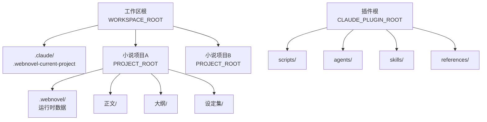
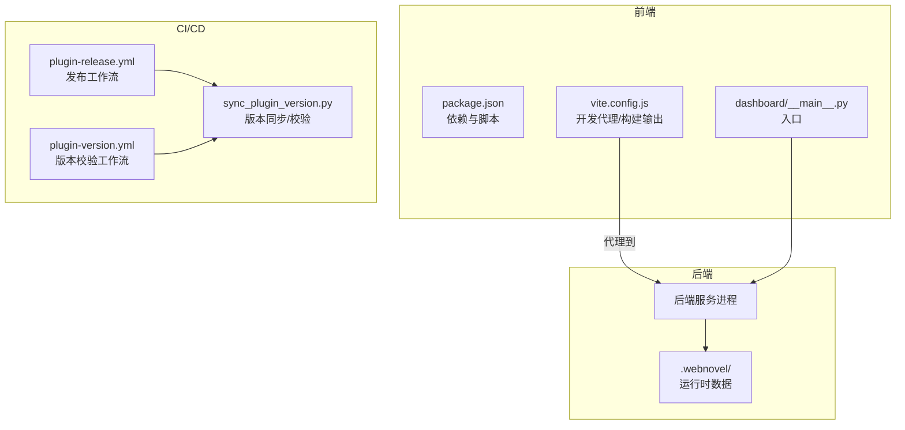
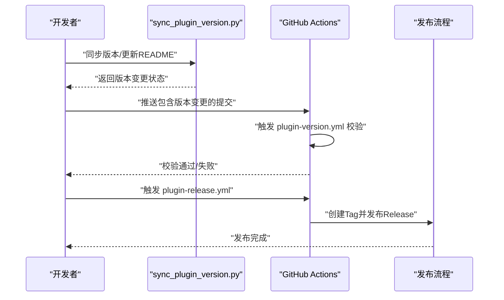
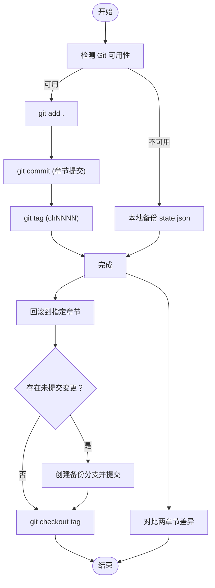
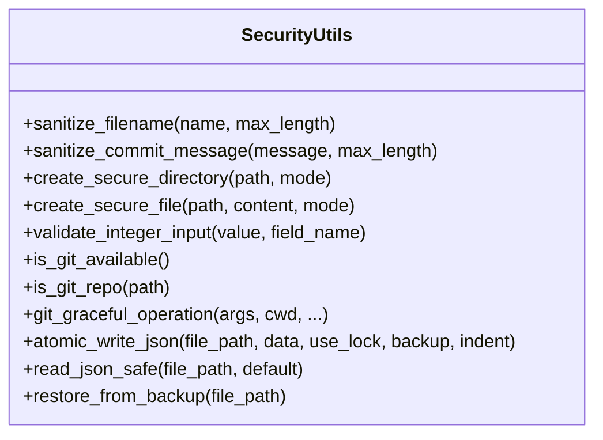
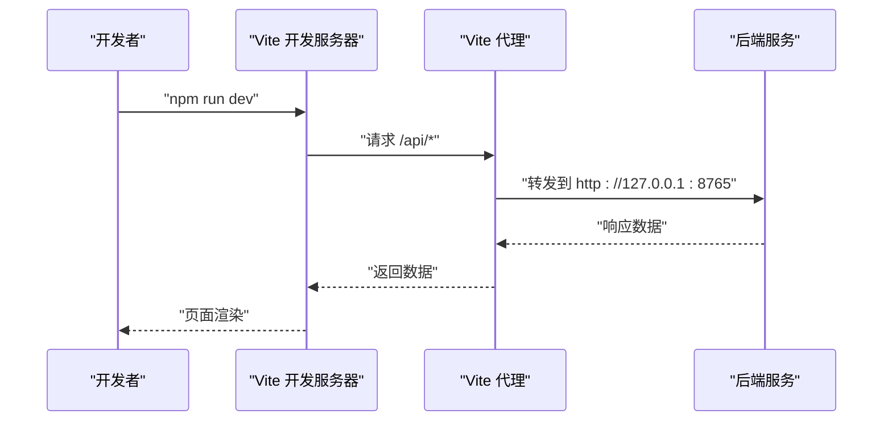
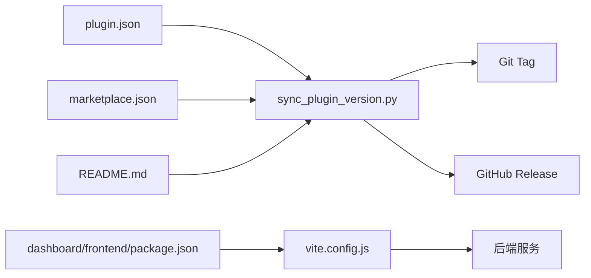

# 部署与运维

<cite>
**本文引用的文件**
- [README.md](file://README.md)
- [requirements.txt](file://requirements.txt)
- [webnovel-writer/dashboard/frontend/package.json](file://webnovel-writer/dashboard/frontend/package.json)
- [.github/workflows/plugin-release.yml](file://.github/workflows/plugin-release.yml)
- [.github/workflows/plugin-version.yml](file://.github/workflows/plugin-version.yml)
- [webnovel-writer/scripts/sync_plugin_version.py](file://webnovel-writer/scripts/sync_plugin_version.py)
- [webnovel-writer/dashboard/frontend/vite.config.js](file://webnovel-writer/dashboard/frontend/vite.config.js)
- [webnovel-writer/dashboard/__main__.py](file://webnovel-writer/dashboard/__main__.py)
- [webnovel-writer/scripts/backup_manager.py](file://webnovel-writer/scripts/backup_manager.py)
- [webnovel-writer/scripts/security_utils.py](file://webnovel-writer/scripts/security_utils.py)
- [docs/operations.md](file://docs/operations.md)
- [webnovel-writer/.claude-plugin/plugin.json](file://webnovel-writer/.claude-plugin/plugin.json)
- [.claude-plugin/marketplace.json](file://.claude-plugin/marketplace.json)
</cite>

## 目录
1. [简介](#简介)
2. [项目结构](#项目结构)
3. [核心组件](#核心组件)
4. [架构总览](#架构总览)
5. [详细组件分析](#详细组件分析)
6. [依赖关系分析](#依赖关系分析)
7. [性能考虑](#性能考虑)
8. [故障排查指南](#故障排查指南)
9. [结论](#结论)
10. [附录](#附录)

## 简介
本指南面向生产环境的 Webnovel Writer 部署与运维，覆盖以下主题：
- 生产环境部署流程与容器化思路
- CI/CD 流水线配置、版本发布管理与插件打包流程
- 服务器环境要求、性能监控与日志管理
- 数据库迁移、备份恢复与故障应急处理
- 安全配置、访问控制与数据保护
- 运维监控指标、告警与性能优化建议
- 部署脚本、配置文件示例与运维工具使用

## 项目结构
该项目由“插件核心 + 可视化仪表盘 + 脚本工具集 + 文档”组成。核心运行时涉及三类目录：
- 工作区根（WORKSPACE_ROOT）：Claude 工作区，包含 .claude 指针与多个小说项目
- 小说项目根（PROJECT_ROOT）：具体作品工程，包含运行时数据与内容目录
- 插件根（CLAUDE_PLUGIN_ROOT）：插件缓存目录，包含 skills/agents/scripts/references

图表来源
- [docs/operations.md:12-32](file://docs/operations.md#L12-L32)
- [docs/operations.md:34-44](file://docs/operations.md#L34-L44)

章节来源
- [docs/operations.md:1-100](file://docs/operations.md#L1-L100)

## 核心组件
- 插件元数据与市场清单：用于版本同步与发布校验
- CI/CD 工作流：自动化版本检查与发布
- 备份管理器：基于 Git 的原子化备份与回滚
- 安全工具库：输入清理、原子写入、Git 环境检测等
- 可视化仪表盘：前端构建与代理配置

章节来源
- [webnovel-writer/.claude-plugin/plugin.json:1-19](file://webnovel-writer/.claude-plugin/plugin.json#L1-L19)
- [.claude-plugin/marketplace.json:1-24](file://.claude-plugin/marketplace.json#L1-L24)
- [.github/workflows/plugin-release.yml:1-57](file://.github/workflows/plugin-release.yml#L1-L57)
- [.github/workflows/plugin-version.yml:1-33](file://.github/workflows/plugin-version.yml#L1-L33)
- [webnovel-writer/scripts/backup_manager.py:1-470](file://webnovel-writer/scripts/backup_manager.py#L1-L470)
- [webnovel-writer/scripts/security_utils.py:1-590](file://webnovel-writer/scripts/security_utils.py#L1-L590)
- [webnovel-writer/dashboard/frontend/vite.config.js:1-16](file://webnovel-writer/dashboard/frontend/vite.config.js#L1-L16)

## 架构总览
下图展示生产部署视角下的系统交互：前端仪表盘通过本地代理访问后端服务；后端服务与项目数据（.webnovel）交互；CI/CD 负责版本一致性与发布。

图表来源
- [webnovel-writer/dashboard/frontend/package.json:1-23](file://webnovel-writer/dashboard/frontend/package.json#L1-L23)
- [webnovel-writer/dashboard/frontend/vite.config.js:1-16](file://webnovel-writer/dashboard/frontend/vite.config.js#L1-L16)
- [webnovel-writer/dashboard/__main__.py:1-5](file://webnovel-writer/dashboard/__main__.py#L1-L5)
- [.github/workflows/plugin-release.yml:1-57](file://.github/workflows/plugin-release.yml#L1-L57)
- [.github/workflows/plugin-version.yml:1-33](file://.github/workflows/plugin-version.yml#L1-L33)
- [webnovel-writer/scripts/sync_plugin_version.py:1-221](file://webnovel-writer/scripts/sync_plugin_version.py#L1-L221)

## 详细组件分析

### 组件A：插件版本发布与校验
- 目标：确保 plugin.json、marketplace.json 与 README 当前版本一致，并在发布时打 Tag 与创建 Release
- 关键流程：
  - 本地执行版本同步脚本，更新三处元数据
  - 推送后触发 GitHub Actions：校验版本一致性、创建 Tag、创建 Release

图表来源
- [webnovel-writer/scripts/sync_plugin_version.py:110-137](file://webnovel-writer/scripts/sync_plugin_version.py#L110-L137)
- [.github/workflows/plugin-version.yml:19-33](file://.github/workflows/plugin-version.yml#L19-L33)
- [.github/workflows/plugin-release.yml:18-57](file://.github/workflows/plugin-release.yml#L18-L57)

章节来源
- [README.md:130-148](file://README.md#L130-L148)
- [webnovel-writer/scripts/sync_plugin_version.py:140-169](file://webnovel-writer/scripts/sync_plugin_version.py#L140-L169)
- [.github/workflows/plugin-version.yml:1-33](file://.github/workflows/plugin-version.yml#L1-L33)
- [.github/workflows/plugin-release.yml:1-57](file://.github/workflows/plugin-release.yml#L1-L57)

### 组件B：备份与回滚（Git 集成）
- 目标：提供原子化备份、回滚、差异对比与分支创建能力，保障数据一致性
- 关键特性：
  - 自动 add/commit/tag（章节粒度）
  - 回滚前自动创建备份分支
  - 差异统计与 state.json 专项 diff
  - 无 Git 环境时的本地降级备份

图表来源
- [webnovel-writer/scripts/backup_manager.py:70-304](file://webnovel-writer/scripts/backup_manager.py#L70-L304)
- [webnovel-writer/scripts/backup_manager.py:306-398](file://webnovel-writer/scripts/backup_manager.py#L306-L398)

章节来源
- [webnovel-writer/scripts/backup_manager.py:1-470](file://webnovel-writer/scripts/backup_manager.py#L1-L470)

### 组件C：安全工具库
- 目标：集中处理输入清理、原子写入、Git 环境检测与文件权限设置，降低注入与并发风险
- 关键能力：
  - 文件名清理（防路径遍历）、提交消息清理（防命令注入）
  - 原子写入 JSON（临时文件+原子重命名+可选锁与备份）
  - Git 可用性检测与优雅降级
  - 安全目录/文件创建（仅所有者可访问）

图表来源
- [webnovel-writer/scripts/security_utils.py:29-134](file://webnovel-writer/scripts/security_utils.py#L29-L134)
- [webnovel-writer/scripts/security_utils.py:234-333](file://webnovel-writer/scripts/security_utils.py#L234-L333)
- [webnovel-writer/scripts/security_utils.py:345-444](file://webnovel-writer/scripts/security_utils.py#L345-L444)

章节来源
- [webnovel-writer/scripts/security_utils.py:1-590](file://webnovel-writer/scripts/security_utils.py#L1-L590)

### 组件D：可视化仪表盘
- 目标：提供只读面板与实体图谱浏览，前端构建产物随插件分发
- 关键点：
  - 前端依赖与脚本定义
  - Vite 开发代理指向后端服务
  - 作为独立入口运行

图表来源
- [webnovel-writer/dashboard/frontend/package.json:1-23](file://webnovel-writer/dashboard/frontend/package.json#L1-L23)
- [webnovel-writer/dashboard/frontend/vite.config.js:4-15](file://webnovel-writer/dashboard/frontend/vite.config.js#L4-L15)
- [webnovel-writer/dashboard/__main__.py:1-5](file://webnovel-writer/dashboard/__main__.py#L1-L5)

章节来源
- [webnovel-writer/dashboard/frontend/package.json:1-23](file://webnovel-writer/dashboard/frontend/package.json#L1-L23)
- [webnovel-writer/dashboard/frontend/vite.config.js:1-16](file://webnovel-writer/dashboard/frontend/vite.config.js#L1-L16)
- [webnovel-writer/dashboard/__main__.py:1-5](file://webnovel-writer/dashboard/__main__.py#L1-L5)

## 依赖关系分析
- 版本元数据依赖：plugin.json、marketplace.json、README.md 三者版本必须一致
- CI 依赖：plugin-version.yml 在 Push/PR 触发版本一致性检查；plugin-release.yml 在手动触发时执行发布
- 运行时依赖：项目根 .webnovel 目录存放运行时数据；前端通过代理访问后端服务

图表来源
- [webnovel-writer/scripts/sync_plugin_version.py:110-137](file://webnovel-writer/scripts/sync_plugin_version.py#L110-L137)
- [.github/workflows/plugin-release.yml:18-57](file://.github/workflows/plugin-release.yml#L18-L57)
- [.github/workflows/plugin-version.yml:19-33](file://.github/workflows/plugin-version.yml#L19-L33)
- [webnovel-writer/dashboard/frontend/package.json:1-23](file://webnovel-writer/dashboard/frontend/package.json#L1-L23)
- [webnovel-writer/dashboard/frontend/vite.config.js:4-15](file://webnovel-writer/dashboard/frontend/vite.config.js#L4-L15)

章节来源
- [webnovel-writer/.claude-plugin/plugin.json:1-19](file://webnovel-writer/.claude-plugin/plugin.json#L1-L19)
- [.claude-plugin/marketplace.json:1-24](file://.claude-plugin/marketplace.json#L1-L24)
- [README.md:130-148](file://README.md#L130-L148)

## 性能考虑
- 前端构建与代理
  - 使用 Vite 构建输出目录，减少开发时编译开销
  - 代理将 /api 请求转发至本地后端，避免跨域与网络抖动
- 备份与索引
  - 备份采用 Git 增量存储，适合大体量文本增量迭代
  - 索引与向量重建建议在低峰时段执行，避免影响前台交互
- 文件写入与并发
  - 原子写入与可选锁可降低并发写入冲突与数据损坏风险
- 日志与可观测性
  - 建议将后端服务日志输出到标准输出/文件，结合系统日志收集器统一采集
  - 前端错误与网络请求可通过浏览器控制台与网络面板定位

## 故障排查指南
- 版本不一致
  - 现象：Actions 校验失败
  - 处理：使用版本同步脚本更新 plugin.json、marketplace.json、README 当前版本
- Git 不可用
  - 现象：备份/回滚功能降级为本地备份
  - 处理：安装 Git 并初始化仓库；或确认 .gitignore 配置正确
- 提交消息注入风险
  - 现象：提交失败或消息异常
  - 处理：使用安全工具库清理提交消息
- 并发写入冲突
  - 现象：state.json 损坏或读取异常
  - 处理：使用原子写入接口；必要时启用文件锁
- 健康检查与索引重建
  - 命令参考：健康报告、索引重建、向量重建

章节来源
- [webnovel-writer/scripts/sync_plugin_version.py:140-169](file://webnovel-writer/scripts/sync_plugin_version.py#L140-L169)
- [webnovel-writer/scripts/backup_manager.py:70-144](file://webnovel-writer/scripts/backup_manager.py#L70-L144)
- [webnovel-writer/scripts/security_utils.py:345-444](file://webnovel-writer/scripts/security_utils.py#L345-L444)
- [docs/operations.md:63-99](file://docs/operations.md#L63-L99)

## 结论
通过统一的版本元数据管理、严格的 CI/CD 校验、可靠的 Git 原子化备份与安全工具库，Webnovel Writer 可在生产环境中实现稳定、可追溯、可回滚的长期创作与维护。建议在生产中配套完善的日志与监控体系，持续优化索引与向量重建策略，并定期演练备份与回滚流程。

## 附录

### A. 生产环境部署流程（步骤概览）
- 准备工作区与项目根
  - 确认 WORKSPACE_ROOT 与 .claude 指针正确指向 PROJECT_ROOT
- 安装依赖
  - 安装核心与仪表盘依赖
- 启动后端服务
  - 通过 dashboard 入口或后端服务进程提供 API
- 前端构建与上线
  - 使用 Vite 构建输出，部署到静态站点或反向代理
- CI/CD 发布
  - 使用 plugin-release.yml 与 plugin-version.yml 确保版本一致性与自动化发布

章节来源
- [docs/operations.md:63-99](file://docs/operations.md#L63-L99)
- [README.md:32-88](file://README.md#L32-L88)
- [webnovel-writer/dashboard/frontend/package.json:1-23](file://webnovel-writer/dashboard/frontend/package.json#L1-L23)

### B. CI/CD 流水线配置要点
- 版本校验工作流
  - 触发条件：Push/Pull Request 至版本相关文件
  - 核心：调用版本同步脚本进行一致性检查
- 发布工作流
  - 触发条件：workflow_dispatch（手动）
  - 核心：校验版本、创建 Tag、创建 Release

章节来源
- [.github/workflows/plugin-version.yml:1-33](file://.github/workflows/plugin-version.yml#L1-L33)
- [.github/workflows/plugin-release.yml:1-57](file://.github/workflows/plugin-release.yml#L1-L57)

### C. 数据库迁移与备份恢复
- 迁移方案
  - 采用 Git 作为轻量级版本控制：每个章节一次提交与 tag，便于迁移与回滚
- 备份恢复
  - 使用备份管理器进行原子化备份与回滚
  - 无 Git 环境时，使用本地备份目录保存 state.json

章节来源
- [webnovel-writer/scripts/backup_manager.py:192-304](file://webnovel-writer/scripts/backup_manager.py#L192-L304)

### D. 安全配置与访问控制
- 输入清理
  - 文件名清理、提交消息清理、整数输入验证
- 原子写入
  - 临时文件+原子重命名+可选锁+备份
- 访问控制
  - 仅所有者可访问的安全目录/文件
- Git 环境检测
  - 优雅降级，避免阻塞功能

章节来源
- [webnovel-writer/scripts/security_utils.py:29-134](file://webnovel-writer/scripts/security_utils.py#L29-L134)
- [webnovel-writer/scripts/security_utils.py:345-444](file://webnovel-writer/scripts/security_utils.py#L345-L444)
- [webnovel-writer/scripts/security_utils.py:234-333](file://webnovel-writer/scripts/security_utils.py#L234-L333)

### E. 运维监控指标与告警
- 指标建议
  - 后端服务 QPS、P95 延迟、错误率、内存/CPU 使用率
  - 前端加载时间、首次内容绘制时间
  - Git 操作耗时与失败率（备份/回滚）
- 告警建议
  - 服务不可用、延迟突增、错误率上升、Git 操作超时/失败
- 日志管理
  - 标准输出/文件统一采集，保留关键字段（时间戳、请求 ID、状态码、耗时）

[本节为通用运维建议，无需特定文件引用]

### F. 运维工具使用示例
- 健康检查与索引重建
  - 健康报告：status
  - 索引重建：index process-chapter、index stats
  - 向量重建：rag index-chapter、rag stats
- 备份与回滚
  - 备份：backup（章节号与标题）
  - 回滚：rollback（章节号）
  - 差异：diff（A、B 章节）
  - 分支：create-branch（章节号、分支名）
- 版本同步
  - 同步/校验：sync_plugin_version.py（--check/--version/--expected-version/--release-notes）

章节来源
- [docs/operations.md:63-99](file://docs/operations.md#L63-L99)
- [webnovel-writer/scripts/backup_manager.py:400-467](file://webnovel-writer/scripts/backup_manager.py#L400-L467)
- [webnovel-writer/scripts/sync_plugin_version.py:172-221](file://webnovel-writer/scripts/sync_plugin_version.py#L172-L221)