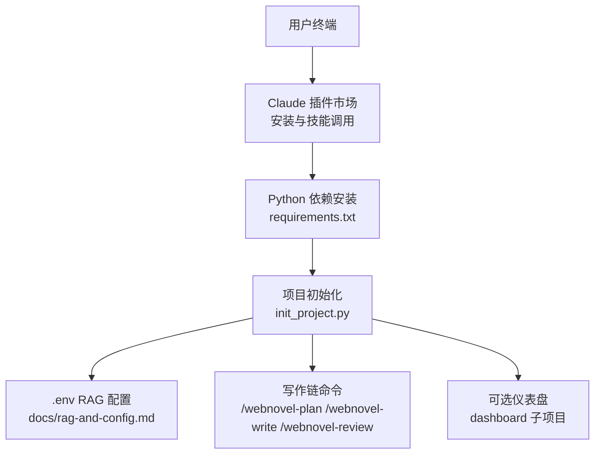
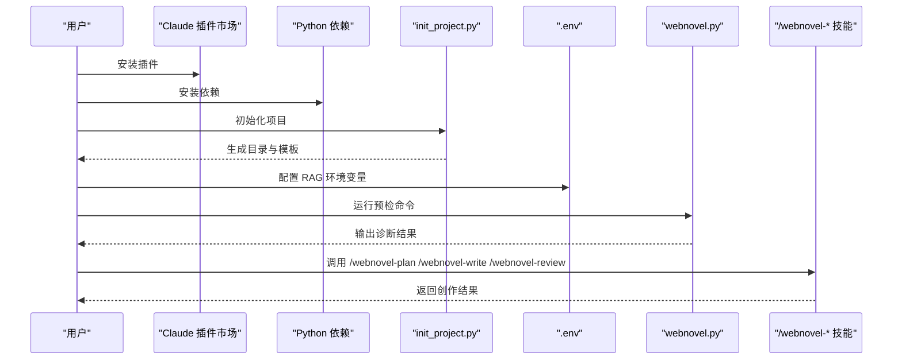
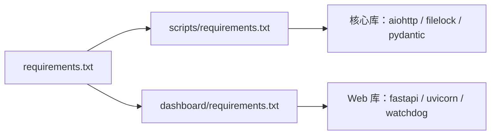
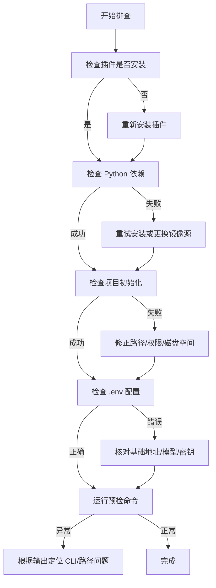

# 快速开始

<cite>
**本文引用的文件**
- [README.md](file://README.md)
- [requirements.txt](file://requirements.txt)
- [webnovel-writer/scripts/requirements.txt](file://webnovel-writer/scripts/requirements.txt)
- [webnovel-writer/dashboard/requirements.txt](file://webnovel-writer/dashboard/requirements.txt)
- [webnovel-writer/scripts/init_project.py](file://webnovel-writer/scripts/init_project.py)
- [webnovel-writer/scripts/webnovel.py](file://webnovel-writer/scripts/webnovel.py)
- [docs/rag-and-config.md](file://docs/rag-and-config.md)
- [webnovel-writer/dashboard/frontend/package.json](file://webnovel-writer/dashboard/frontend/package.json)
</cite>

## 目录
1. [简介](#简介)
2. [项目结构](#项目结构)
3. [核心组件](#核心组件)
4. [架构总览](#架构总览)
5. [详细组件分析](#详细组件分析)
6. [依赖分析](#依赖分析)
7. [性能考虑](#性能考虑)
8. [故障排查指南](#故障排查指南)
9. [结论](#结论)
10. [附录](#附录)

## 简介
本指南面向首次接触 Webnovel Writer 的创作者，帮助你在约 30 分钟内完成从零到可用的完整环境搭建，涵盖插件安装、Python 依赖、项目初始化、RAG 环境配置与最小可用验证。文档同时提供 Windows、macOS、Linux 的适配要点与常见问题排查方法，并给出预检命令与验证清单，确保你可以快速进入创作流程。

## 项目结构
Webnovel Writer 采用“插件 + 写作链 + 可视化仪表盘”的分层结构：
- 插件市场安装入口与技能命令由 README 提供
- 核心 Python 依赖通过 requirements.txt 统一拉取
- 项目初始化由 init_project.py 生成标准目录与模板
- RAG 环境变量通过 .env 注入
- 可选的可视化仪表盘通过 dashboard 子项目提供

图表来源
- [README.md:21-93](file://README.md#L21-L93)
- [requirements.txt:1-3](file://requirements.txt#L1-L3)
- [webnovel-writer/scripts/init_project.py:1-100](file://webnovel-writer/scripts/init_project.py#L1-L100)
- [docs/rag-and-config.md:15-37](file://docs/rag-and-config.md#L15-L37)

章节来源
- [README.md:21-93](file://README.md#L21-L93)
- [requirements.txt:1-3](file://requirements.txt#L1-L3)

## 核心组件
- 插件安装与技能命令
  - 通过 Claude 插件市场添加并安装插件，随后在 Claude Code 中使用 /webnovel-* 技能进行创作。
- Python 依赖管理
  - 顶层 requirements.txt 引用两个子模块的依赖清单，分别覆盖“写作链”和“仪表盘”。
- 项目初始化
  - init_project.py 生成项目目录、state.json 与基础模板，支持 Git 初始化与默认项目指针记录。
- RAG 环境配置
  - 通过 .env 注入 Embedding/Rerank 基础地址、模型与密钥，支持进程环境变量优先级。
- 可视化仪表盘
  - dashboard 子项目提供只读面板，前端构建产物随插件发布，无需本地二次构建。

章节来源
- [README.md:21-93](file://README.md#L21-L93)
- [webnovel-writer/scripts/init_project.py:227-355](file://webnovel-writer/scripts/init_project.py#L227-L355)
- [docs/rag-and-config.md:15-37](file://docs/rag-and-config.md#L15-L37)

## 架构总览
下图展示从安装到使用的端到端流程，以及关键文件与命令的映射关系：

图表来源
- [README.md:21-93](file://README.md#L21-L93)
- [webnovel-writer/scripts/webnovel.py:1-37](file://webnovel-writer/scripts/webnovel.py#L1-L37)
- [webnovel-writer/scripts/init_project.py:227-355](file://webnovel-writer/scripts/init_project.py#L227-L355)
- [docs/rag-and-config.md:15-37](file://docs/rag-and-config.md#L15-L37)

## 详细组件分析

### 步骤一：安装插件（Claude 插件市场）
- 平台通用
  - 添加并安装插件，确保在 Claude Code 中可用 /webnovel-* 技能。
- 注意事项
  - 若仅当前项目生效，将作用域改为项目级；否则使用用户级作用域。
- 验证
  - 在 Claude Code 中输入 /webnovel-plan 或 /webnovel-write，确认技能可用。

章节来源
- [README.md:23-28](file://README.md#L23-L28)

### 步骤二：安装 Python 依赖
- 平台通用
  - 使用 pip 安装顶层 requirements.txt，它会同时拉取“写作链”和“仪表盘”的依赖。
- 依赖来源
  - 写作链依赖：scripts/requirements.txt
  - 仪表盘依赖：dashboard/requirements.txt
- 注意事项
  - 确保 Python 版本满足要求；网络不佳时可考虑离线缓存镜像源。

章节来源
- [README.md:32-38](file://README.md#L32-L38)
- [requirements.txt:1-3](file://requirements.txt#L1-L3)
- [webnovel-writer/scripts/requirements.txt:1-14](file://webnovel-writer/scripts/requirements.txt#L1-L14)
- [webnovel-writer/dashboard/requirements.txt:1-4](file://webnovel-writer/dashboard/requirements.txt#L1-L4)

### 步骤三：初始化小说项目
- 平台通用
  - 在 Claude Code 中执行 /webnovel-init，它会在当前工作区创建项目根目录与默认项目指针。
- 生成内容
  - 项目目录、state.json、基础模板（设定集、大纲、审查报告等）、.env.example。
- 可选增强
  - 自动初始化 Git 仓库（若可用），并写入 .gitignore；记录默认项目指针。
- 注意事项
  - 避免在 .claude 目录内初始化项目；脚本会拒绝该路径。

章节来源
- [README.md:40-48](file://README.md#L40-L48)
- [webnovel-writer/scripts/init_project.py:227-355](file://webnovel-writer/scripts/init_project.py#L227-L355)

### 步骤四：配置 RAG 环境（必做）
- 平台通用
  - 在项目根目录复制 .env.example 为 .env，填写 Embedding 与 Rerank 的基础地址、模型与密钥。
- 最小配置
  - 包含 Embedding 与 Rerank 的基础地址、模型与密钥三项。
- 优先级
  - 进程环境变量 > 项目 .env > 用户级全局 .env。
- 回退策略
  - 未配置 Embedding Key 时，语义检索将回退到 BM25。
- 注意事项
  - 建议每本书单独维护 .env，避免多项目串扰。

章节来源
- [README.md:50-68](file://README.md#L50-L68)
- [docs/rag-and-config.md:15-37](file://docs/rag-and-config.md#L15-L37)

### 步骤五：开始使用核心技能
- 平台通用
  - 执行 /webnovel-plan、/webnovel-write、/webnovel-review 等技能，逐步推进创作。
- 预检命令
  - 使用统一预检命令检查 CLI/插件目录/项目根解析问题，便于快速定位。

章节来源
- [README.md:70-82](file://README.md#L70-L82)
- [README.md:72-76](file://README.md#L72-L76)

### 步骤六：启动可视化面板（可选）
- 平台通用
  - 在 Claude Code 中执行 /webnovel-dashboard，打开只读面板（项目状态、实体图谱、章节/大纲浏览、追读力查看）。
- 前端构建
  - 前端构建产物随插件发布，无需本地 npm build。

章节来源
- [README.md:84-93](file://README.md#L84-L93)
- [webnovel-writer/dashboard/frontend/package.json:1-23](file://webnovel-writer/dashboard/frontend/package.json#L1-L23)

### 步骤七：Agent 模型设置（可选）
- 平台通用
  - 默认继承当前 Claude 会话模型；可在各 Agent 的 frontmatter 中单独指定模型。
- 可选值
  - inherit / sonnet / opus / haiku（以 Claude Code 当前支持为准）。

章节来源
- [README.md:94-116](file://README.md#L94-L116)

## 依赖分析
- 依赖来源
  - 顶层 requirements.txt 引用两个子模块的依赖清单，分别覆盖“写作链”和“仪表盘”。
- 写作链依赖
  - 包含异步 HTTP 客户端、文件锁、Schema 校验等核心库，以及可选的测试工具。
- 仪表盘依赖
  - 包含 Web 服务框架、异步服务器与文件监控库。
- 依赖耦合
  - 通过顶层入口统一拉取，降低手工维护成本；子模块职责清晰，便于独立演进。

图表来源
- [requirements.txt:1-3](file://requirements.txt#L1-L3)
- [webnovel-writer/scripts/requirements.txt:1-14](file://webnovel-writer/scripts/requirements.txt#L1-L14)
- [webnovel-writer/dashboard/requirements.txt:1-4](file://webnovel-writer/dashboard/requirements.txt#L1-L4)

章节来源
- [requirements.txt:1-3](file://requirements.txt#L1-L3)
- [webnovel-writer/scripts/requirements.txt:1-14](file://webnovel-writer/scripts/requirements.txt#L1-L14)
- [webnovel-writer/dashboard/requirements.txt:1-4](file://webnovel-writer/dashboard/requirements.txt#L1-L4)

## 性能考虑
- RAG 检索回退
  - 未配置 Embedding Key 时自动回退到 BM25，保障可用性但可能影响召回质量。
- 项目隔离
  - 建议每本书单独维护 .env，避免跨项目配置干扰导致的额外请求与缓存抖动。
- 前端构建
  - 仪表盘前端产物随插件发布，避免本地二次构建带来的资源消耗。

章节来源
- [docs/rag-and-config.md:33-37](file://docs/rag-and-config.md#L33-L37)
- [README.md:90-93](file://README.md#L90-L93)

## 故障排查指南
- 预检命令
  - 使用统一预检命令检查 CLI/插件目录/项目根解析问题，便于快速定位。
- 常见问题
  - 插件未安装或技能不可用：确认插件已安装且在 Claude Code 中可用。
  - 依赖安装失败：检查网络与 Python 版本；必要时更换镜像源。
  - 项目初始化失败：确认未在 .claude 目录内初始化；检查权限与磁盘空间。
  - RAG 无法检索：检查 .env 是否正确复制与填写；确认进程环境变量优先级。
  - 仪表盘无法访问：确认已执行 /webnovel-dashboard；检查插件版本与前端产物。
- 诊断流程

图表来源
- [README.md:78-82](file://README.md#L78-L82)
- [docs/rag-and-config.md:15-37](file://docs/rag-and-config.md#L15-L37)

章节来源
- [README.md:78-82](file://README.md#L78-L82)
- [docs/rag-and-config.md:15-37](file://docs/rag-and-config.md#L15-L37)

## 结论
按照本指南，你可以在 30 分钟内完成 Webnovel Writer 的安装与配置，并通过 /webnovel-plan、/webnovel-write、/webnovel-review 等技能开始创作。遇到问题时，优先使用统一预检命令与 .env 最小配置进行验证，结合本指南的平台适配与故障排查建议，即可快速恢复可用状态。

## 附录
- 最小可用配置示例
  - 在项目根目录复制 .env.example 为 .env，填写 Embedding 与 Rerank 的基础地址、模型与密钥。
- 验证方法
  - 执行 /webnovel-plan、/webnovel-write、/webnovel-review，观察返回结果；
  - 运行预检命令，确认 CLI/插件目录/项目根解析无误；
  - 启动 /webnovel-dashboard，确认只读面板可访问。

章节来源
- [README.md:50-68](file://README.md#L50-L68)
- [README.md:70-82](file://README.md#L70-L82)
- [README.md:84-93](file://README.md#L84-L93)