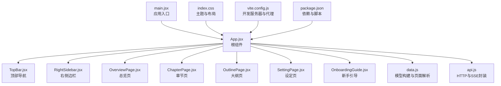
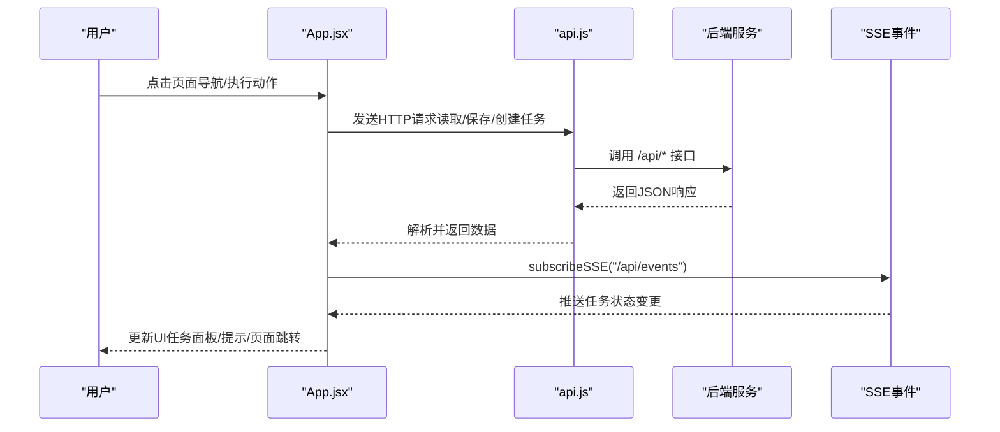
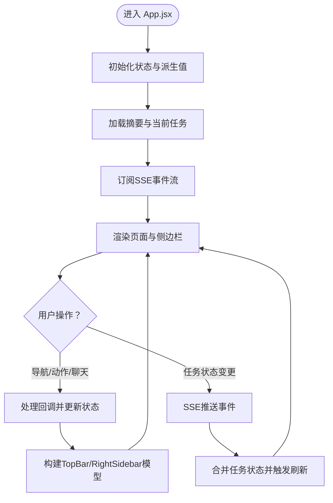
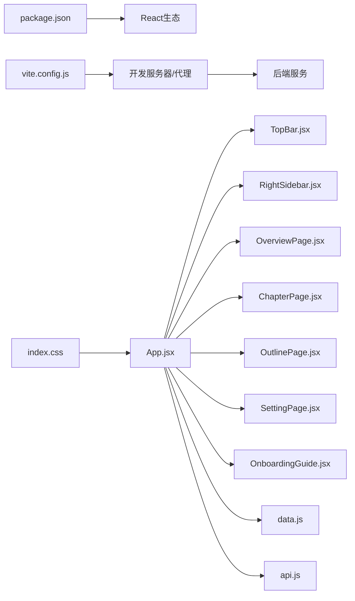

# UI组件定制

<cite>
**本文引用的文件**
- [App.jsx](file://webnovel-writer/dashboard/frontend/src/App.jsx)
- [main.jsx](file://webnovel-writer/dashboard/frontend/src/main.jsx)
- [index.css](file://webnovel-writer/dashboard/frontend/src/index.css)
- [package.json](file://webnovel-writer/dashboard/frontend/package.json)
- [vite.config.js](file://webnovel-writer/dashboard/frontend/vite.config.js)
- [TopBar.jsx](file://webnovel-writer/dashboard/frontend/src/workbench/TopBar.jsx)
- [RightSidebar.jsx](file://webnovel-writer/dashboard/frontend/src/workbench/RightSidebar.jsx)
- [OverviewPage.jsx](file://webnovel-writer/dashboard/frontend/src/workbench/OverviewPage.jsx)
- [ChapterPage.jsx](file://webnovel-writer/dashboard/frontend/src/workbench/ChapterPage.jsx)
- [OutlinePage.jsx](file://webnovel-writer/dashboard/frontend/src/workbench/OutlinePage.jsx)
- [SettingPage.jsx](file://webnovel-writer/dashboard/frontend/src/workbench/SettingPage.jsx)
- [OnboardingGuide.jsx](file://webnovel-writer/dashboard/frontend/src/workbench/OnboardingGuide.jsx)
- [data.js](file://webnovel-writer/dashboard/frontend/src/workbench/data.js)
- [api.js](file://webnovel-writer/dashboard/frontend/src/api.js)
- [index.html](file://webnovel-writer/dashboard/frontend/index.html)
</cite>

## 目录
1. [简介](#简介)
2. [项目结构](#项目结构)
3. [核心组件](#核心组件)
4. [架构总览](#架构总览)
5. [详细组件分析](#详细组件分析)
6. [依赖关系分析](#依赖关系分析)
7. [性能考量](#性能考量)
8. [故障排查指南](#故障排查指南)
9. [结论](#结论)
10. [附录](#附录)

## 简介
本技术文档面向前端开发者与UI设计师，系统讲解Webnovel Writer工作台的UI组件架构与定制方法。文档涵盖前端架构设计、组件结构与定制机制，详解样式定制、主题配置与布局调整，阐述前端与后端的交互方式、数据绑定与事件处理，并提供从简单样式修改到复杂页面重构的完整示例与最佳实践。

## 项目结构
前端采用Vite + React单页应用，入口在main.jsx，根组件App.jsx负责页面路由与全局状态管理，页面组件位于workbench目录，样式集中在index.css，通过CSS变量实现主题化与响应式布局。

图表来源
- [main.jsx:1-11](file://webnovel-writer/dashboard/frontend/src/main.jsx#L1-L11)
- [App.jsx:1-417](file://webnovel-writer/dashboard/frontend/src/App.jsx#L1-L417)
- [TopBar.jsx:1-29](file://webnovel-writer/dashboard/frontend/src/workbench/TopBar.jsx#L1-L29)
- [RightSidebar.jsx:1-145](file://webnovel-writer/dashboard/frontend/src/workbench/RightSidebar.jsx#L1-L145)
- [OverviewPage.jsx:1-56](file://webnovel-writer/dashboard/frontend/src/workbench/OverviewPage.jsx#L1-L56)
- [ChapterPage.jsx:1-199](file://webnovel-writer/dashboard/frontend/src/workbench/ChapterPage.jsx#L1-L199)
- [OutlinePage.jsx:1-209](file://webnovel-writer/dashboard/frontend/src/workbench/OutlinePage.jsx#L1-L209)
- [SettingPage.jsx:1-240](file://webnovel-writer/dashboard/frontend/src/workbench/SettingPage.jsx#L1-L240)
- [OnboardingGuide.jsx:1-161](file://webnovel-writer/dashboard/frontend/src/workbench/OnboardingGuide.jsx#L1-L161)
- [data.js:1-163](file://webnovel-writer/dashboard/frontend/src/workbench/data.js#L1-L163)
- [api.js:1-78](file://webnovel-writer/dashboard/frontend/src/api.js#L1-L78)
- [index.css:1-1250](file://webnovel-writer/dashboard/frontend/src/index.css#L1-L1250)
- [vite.config.js:1-16](file://webnovel-writer/dashboard/frontend/vite.config.js#L1-L16)
- [package.json:1-23](file://webnovel-writer/dashboard/frontend/package.json#L1-L23)

章节来源
- [main.jsx:1-11](file://webnovel-writer/dashboard/frontend/src/main.jsx#L1-L11)
- [index.html:1-17](file://webnovel-writer/dashboard/frontend/index.html#L1-L17)
- [package.json:1-23](file://webnovel-writer/dashboard/frontend/package.json#L1-L23)
- [vite.config.js:1-16](file://webnovel-writer/dashboard/frontend/vite.config.js#L1-L16)

## 核心组件
- 根组件App.jsx：集中管理全局状态（页面、任务、聊天消息、向导步数）、订阅SSE事件、构建各模块模型、渲染页面与侧边栏。
- 页面组件：OverviewPage、ChapterPage、OutlinePage、SettingPage，分别承载不同工作区的UI与业务逻辑。
- 侧边栏组件：TopBar与RightSidebar，前者负责页面导航与任务状态展示，后者负责聊天、动作卡与任务面板。
- 模型与数据：data.js提供页面常量、初始状态、模型构建函数（如TopBar、RightSidebar、Overview等）与页面解析逻辑。
- API与SSE：api.js封装HTTP请求与SSE订阅，统一后端接口调用。

章节来源
- [App.jsx:21-417](file://webnovel-writer/dashboard/frontend/src/App.jsx#L21-L417)
- [data.js:1-163](file://webnovel-writer/dashboard/frontend/src/workbench/data.js#L1-L163)
- [api.js:1-78](file://webnovel-writer/dashboard/frontend/src/api.js#L1-L78)

## 架构总览
前端采用“容器组件 + 展示组件”的分层模式：
- 容器组件（App.jsx）负责状态管理、副作用与事件处理。
- 展示组件（TopBar、RightSidebar、各页面）仅负责UI呈现与用户交互。
- 数据与事件通过props向下传递，回调向上返回，形成清晰的数据流。

图表来源
- [App.jsx:64-273](file://webnovel-writer/dashboard/frontend/src/App.jsx#L64-L273)
- [api.js:39-77](file://webnovel-writer/dashboard/frontend/src/api.js#L39-L77)

## 详细组件分析

### 根组件 App.jsx
- 状态与派生值：维护工作台页面、摘要、当前任务、聊天消息、建议动作、向导步数等。
- 生命周期：初始化加载摘要与当前任务；订阅SSE以接收任务状态变更；监听beforeunload防止误关闭。
- 事件处理：运行动作、重试动作、页面切换、聊天发送、向导控制。
- 模型构建：TopBar与RightSidebar的模型均由data.js提供的构建函数生成，确保UI与数据解耦。
- 页面渲染：根据当前页面渲染Overview/Chapter/Outline/Setting四类页面，并支持reloadToken强制刷新。

图表来源
- [App.jsx:21-417](file://webnovel-writer/dashboard/frontend/src/App.jsx#L21-L417)
- [data.js:54-97](file://webnovel-writer/dashboard/frontend/src/workbench/data.js#L54-L97)

章节来源
- [App.jsx:21-417](file://webnovel-writer/dashboard/frontend/src/App.jsx#L21-L417)
- [data.js:54-97](file://webnovel-writer/dashboard/frontend/src/workbench/data.js#L54-L97)

### 顶部导航 TopBar.jsx
- 输入：model（标题、页面列表、当前激活页）、connected（连接状态）、onSelectPage（页面切换回调）。
- 行为：渲染页面导航按钮，点击切换页面；显示任务徽标与连接指示灯。
- 定制点：按钮样式、徽标颜色、连接指示灯样式可通过index.css中的类名覆盖。

章节来源
- [TopBar.jsx:1-29](file://webnovel-writer/dashboard/frontend/src/workbench/TopBar.jsx#L1-L29)
- [data.js:54-65](file://webnovel-writer/dashboard/frontend/src/workbench/data.js#L54-L65)

### 右侧边栏 RightSidebar.jsx
- 输入：model（上下文、聊天消息、建议动作、当前任务、聊天发送中状态）、回调（发送消息、运行动作、重试、导航）。
- 结构：上下文面板、聊天面板、动作卡面板、任务面板。
- 交互：表单提交消息、执行动作、重试失败任务、根据completionNotice跳转页面。
- 定制点：面板标题、消息列表样式、动作项样式、任务状态徽章、日志列表样式。

章节来源
- [RightSidebar.jsx:1-145](file://webnovel-writer/dashboard/frontend/src/workbench/RightSidebar.jsx#L1-L145)
- [data.js:67-97](file://webnovel-writer/dashboard/frontend/src/workbench/data.js#L67-L97)

### 总览页 OverviewPage.jsx
- 输入：summary、loading、loadError、onRetry、onRestartGuide。
- 行为：加载失败时提供重试按钮；为空时显示占位信息；展示项目概况、最近任务、最近修改、AI建议。
- 定制点：网格布局、卡片样式、占位文案、按钮样式。

章节来源
- [OverviewPage.jsx:1-56](file://webnovel-writer/dashboard/frontend/src/workbench/OverviewPage.jsx#L1-L56)
- [data.js:34-52](file://webnovel-writer/dashboard/frontend/src/workbench/data.js#L34-L52)

### 章节页 ChapterPage.jsx
- 输入：onContextChange、onPageStateChange、cachedSelectedPath、reloadToken。
- 行为：加载文件树、选择章节、读取/保存内容、脏状态管理、保存状态反馈。
- 定制点：文件列表样式、编辑器样式、保存状态徽章、占位按钮禁用态样式。

章节来源
- [ChapterPage.jsx:1-199](file://webnovel-writer/dashboard/frontend/src/workbench/ChapterPage.jsx#L1-L199)

### 大纲页 OutlinePage.jsx
- 输入：onContextChange、onPageStateChange、cachedSelectedPath、reloadToken。
- 行为：加载大纲文件树、选择文件、读取/保存内容、脏状态管理、保存状态反馈。
- 定制点：文件列表样式、编辑器样式、保存状态徽章、占位按钮禁用态样式。

章节来源
- [OutlinePage.jsx:1-209](file://webnovel-writer/dashboard/frontend/src/workbench/OutlinePage.jsx#L1-L209)

### 设定页 SettingPage.jsx
- 输入：onContextChange、onPageStateChange、cachedSelectedPath、reloadToken。
- 行为：按分类过滤文件、选择文件、读取/保存内容、脏状态管理、保存状态反馈。
- 定制点：分类按钮样式、文件列表样式、编辑器样式、保存状态徽章。

章节来源
- [SettingPage.jsx:1-240](file://webnovel-writer/dashboard/frontend/src/workbench/SettingPage.jsx#L1-L240)

### 新手引导 OnboardingGuide.jsx
- 输入：step、onNext、onPrev、onClose、targets。
- 行为：计算气泡位置与箭头方向、高亮目标元素、阻止滚动、步骤指示。
- 定制点：气泡样式、箭头方向、步骤指示器样式、遮罩样式。

章节来源
- [OnboardingGuide.jsx:1-161](file://webnovel-writer/dashboard/frontend/src/workbench/OnboardingGuide.jsx#L1-L161)

### 模型与数据 data.js
- 提供页面常量、初始状态、模型构建函数（TopBar、RightSidebar、Overview等）。
- 页面解析：normalizeWorkbenchPage、resolveTargetPage、buildCompletionNotice。
- 交互辅助：shouldConfirmAction、shouldConfirmNavigation、buildChatReplyModel。

章节来源
- [data.js:1-163](file://webnovel-writer/dashboard/frontend/src/workbench/data.js#L1-L163)

### API与SSE api.js
- 封装GET/POST、文件树/读取/保存、聊天、任务查询与创建。
- SSE订阅：subscribeSSE，自动重连并回调解析后的事件数据。

章节来源
- [api.js:1-78](file://webnovel-writer/dashboard/frontend/src/api.js#L1-L78)

## 依赖关系分析
- 组件依赖：App.jsx依赖所有页面与侧边栏组件；页面组件依赖api.js进行数据访问；TopBar与RightSidebar依赖data.js构建模型。
- 外部依赖：React、react-dom、react-force-graph-3d（用于图谱可视化）。
- 构建与开发：Vite提供开发服务器与代理，将/api前缀代理至后端服务；生产构建输出dist目录。

图表来源
- [package.json:11-21](file://webnovel-writer/dashboard/frontend/package.json#L11-L21)
- [vite.config.js:4-15](file://webnovel-writer/dashboard/frontend/vite.config.js#L4-L15)
- [App.jsx:13-19](file://webnovel-writer/dashboard/frontend/src/App.jsx#L13-L19)
- [data.js:1-163](file://webnovel-writer/dashboard/frontend/src/workbench/data.js#L1-L163)
- [api.js:1-78](file://webnovel-writer/dashboard/frontend/src/api.js#L1-L78)
- [index.css:1-1250](file://webnovel-writer/dashboard/frontend/src/index.css#L1-L1250)

章节来源
- [package.json:1-23](file://webnovel-writer/dashboard/frontend/package.json#L1-L23)
- [vite.config.js:1-16](file://webnovel-writer/dashboard/frontend/vite.config.js#L1-L16)

## 性能考量
- 状态最小化：App.jsx集中管理全局状态，避免子组件重复拉取相同数据。
- 懒加载与重渲染控制：页面组件通过reloadToken强制刷新，减少不必要的重渲染。
- 事件流优化：SSE自动重连，仅在状态变化时更新UI，降低轮询成本。
- 样式复用：通过CSS变量与通用类名减少重复样式定义，提升维护效率。
- 图谱性能：若引入3D图谱组件，建议限制节点数量与更新频率，使用虚拟滚动或分页加载。

## 故障排查指南
- 加载失败与错误提示
  - 概述页与各工作区在加载失败时显示错误信息与重试按钮，优先检查网络与代理配置。
  - 章节/大纲/设定页的文件读取失败会在编辑器上方显示错误文本，检查路径与权限。
- 任务状态异常
  - 若任务面板显示失败，查看日志列表与恢复建议；必要时重试动作。
  - 任务完成后若未自动刷新，检查resolveTargetPage与buildCompletionNotice的页面映射。
- 聊天与动作卡
  - 聊天发送中按钮禁用，发送失败时显示错误消息；检查后端接口与上下文参数。
  - 动作卡未出现或不可执行，确认后端返回的suggested_actions是否正确。
- 本地存储与向导
  - 向导完成后会在localStorage标记完成；若需要重新查看，调用重置函数并重启向导。
- 浏览器兼容性
  - 使用现代CSS Grid与Flex布局，确保主流浏览器支持；关注媒体查询在不同分辨率下的表现。
  - 如需兼容旧版浏览器，可在Vite配置中添加polyfill或降级方案。

章节来源
- [App.jsx:64-273](file://webnovel-writer/dashboard/frontend/src/App.jsx#L64-L273)
- [data.js:108-148](file://webnovel-writer/dashboard/frontend/src/workbench/data.js#L108-L148)
- [OnboardingGuide.jsx:32-42](file://webnovel-writer/dashboard/frontend/src/workbench/OnboardingGuide.jsx#L32-L42)

## 结论
本工作台通过清晰的组件分层与数据模型，实现了UI与业务逻辑的解耦。借助CSS变量与响应式布局，主题与布局定制具备良好的扩展性。通过SSE与统一API封装，前后端交互简洁高效。遵循本文档的定制流程与最佳实践，可快速完成从样式微调到页面重构的各类UI定制需求。

## 附录

### UI组件定制流程（从入门到精通）

- 简单样式修改（如按钮颜色、字体大小）
  - 步骤：定位目标类名（如导航按钮、主按钮），在index.css中覆盖对应属性。
  - 示例路径参考：[index.css:778-800](file://webnovel-writer/dashboard/frontend/src/index.css#L778-L800)
  - 注意：优先使用CSS变量，便于主题统一管理。

- 主题配置（如主色、强调色、阴影）
  - 步骤：修改:root中的CSS变量（如--accent-blue、--bg-main），影响全局配色。
  - 示例路径参考：[index.css:3-23](file://webnovel-writer/dashboard/frontend/src/index.css#L3-L23)

- 布局调整（如侧边栏宽度、页面间距）
  - 步骤：调整.grid模板列与gap，或修改卡片内边距与间距。
  - 示例路径参考：[index.css:52-56](file://webnovel-writer/dashboard/frontend/src/index.css#L52-L56)、[index.css:149-153](file://webnovel-writer/dashboard/frontend/src/index.css#L149-L153)

- 复杂页面重构（如新增页面、替换组件）
  - 步骤：新增页面组件（参考现有章节/大纲/设定页结构），在data.js中注册页面常量与模型构建函数，在App.jsx中接入路由与状态。
  - 示例路径参考：[data.js:1-6](file://webnovel-writer/dashboard/frontend/src/workbench/data.js#L1-L6)、[ChapterPage.jsx:1-199](file://webnovel-writer/dashboard/frontend/src/workbench/ChapterPage.jsx#L1-L199)

- 与后端交互增强（如新增API、SSE事件）
  - 步骤：在api.js中新增请求封装，App.jsx中订阅新事件并更新状态。
  - 示例路径参考：[api.js:39-77](file://webnovel-writer/dashboard/frontend/src/api.js#L39-L77)、[App.jsx:195-273](file://webnovel-writer/dashboard/frontend/src/App.jsx#L195-L273)

- 事件处理与数据绑定（如表单、列表选择）
  - 步骤：在组件内部使用useState/onChange处理输入，通过回调向上通知父组件；在父组件中更新全局状态并触发重渲染。
  - 示例路径参考：[ChapterPage.jsx:96-117](file://webnovel-writer/dashboard/frontend/src/workbench/ChapterPage.jsx#L96-L117)、[RightSidebar.jsx:6-11](file://webnovel-writer/dashboard/frontend/src/workbench/RightSidebar.jsx#L6-L11)

- 性能优化建议
  - 使用useMemo/useCallback缓存计算结果与回调。
  - 控制SSE事件频率，避免频繁重渲染。
  - 对长列表使用虚拟滚动或分页加载。

- 浏览器兼容性处理
  - 关注Grid/Flex在旧版浏览器的行为差异，必要时提供降级方案。
  - 使用postcss或autoprefixer自动添加厂商前缀。