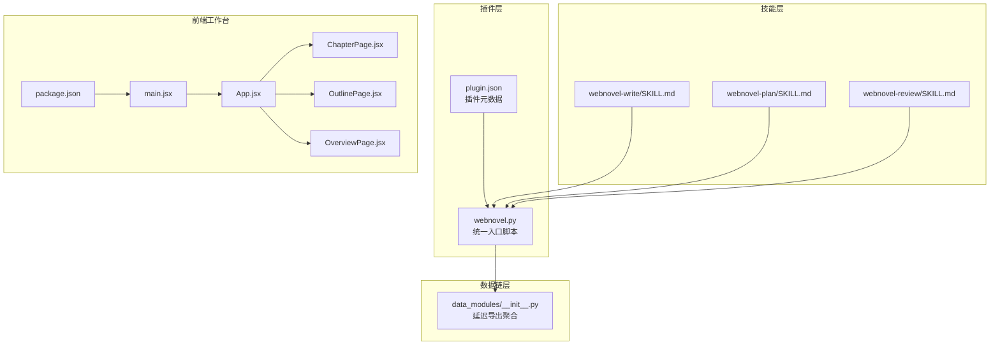
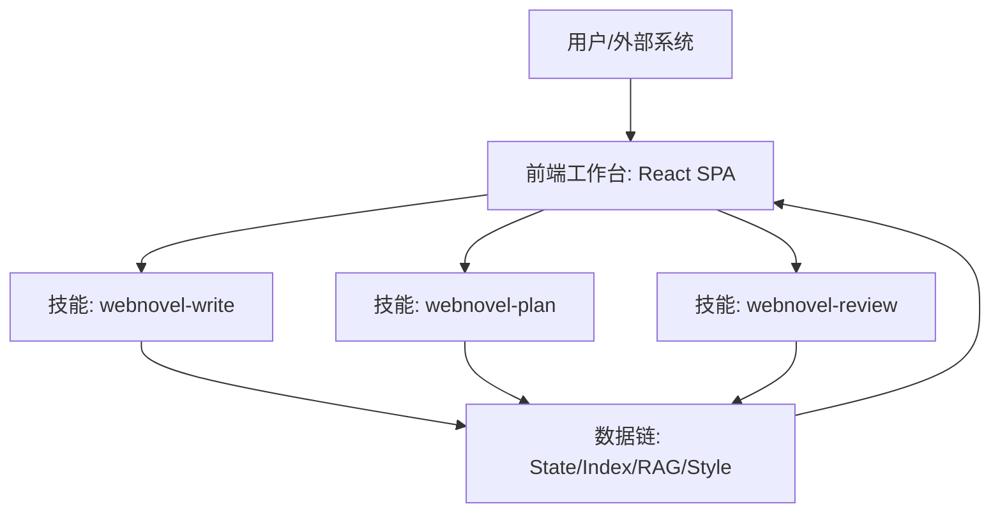
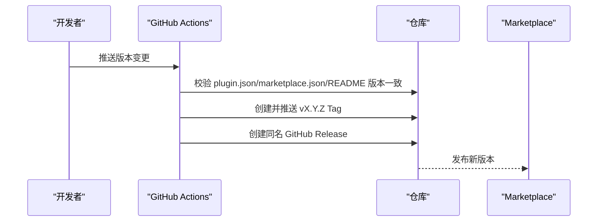
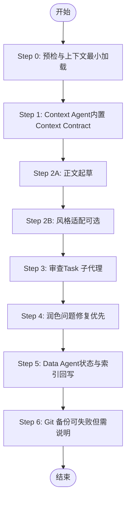
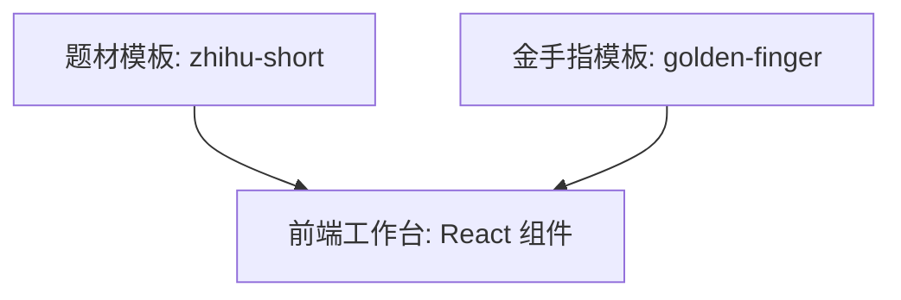
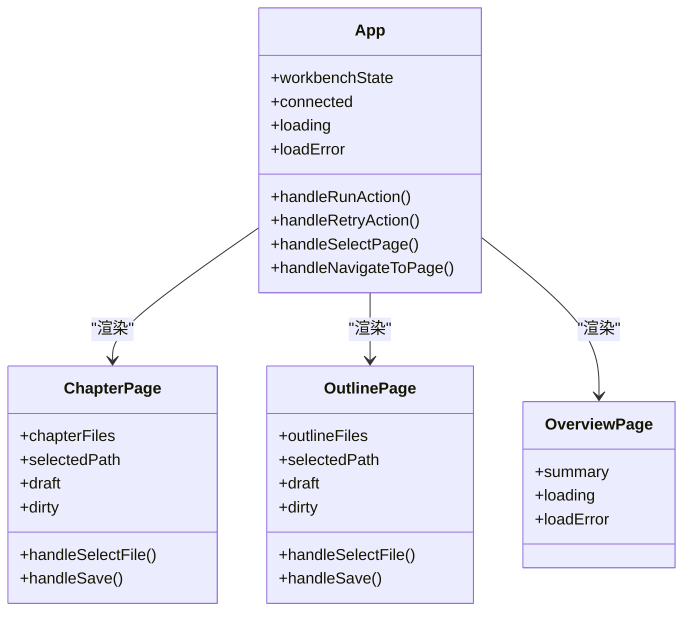
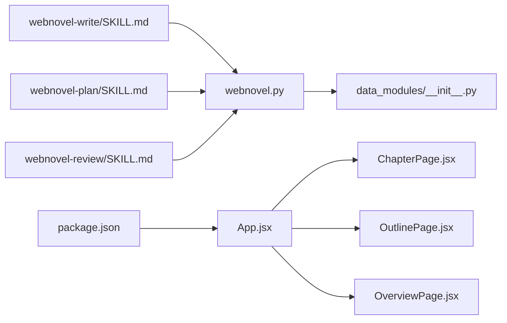

# 扩展与定制

<cite>
**本文引用的文件**
- [README.md](file://README.md)
- [plugin.json](file://webnovel-writer/.claude-plugin/plugin.json)
- [webnovel.py](file://webnovel-writer/scripts/webnovel.py)
- [data_modules/__init__.py](file://webnovel-writer/scripts/data_modules/__init__.py)
- [webnovel-write/SKILL.md](file://webnovel-writer/skills/webnovel-write/SKILL.md)
- [webnovel-plan/SKILL.md](file://webnovel-writer/skills/webnovel-plan/SKILL.md)
- [webnovel-review/SKILL.md](file://webnovel-writer/skills/webnovel-review/SKILL.md)
- [App.jsx](file://webnovel-writer/dashboard/frontend/src/App.jsx)
- [ChapterPage.jsx](file://webnovel-writer/dashboard/frontend/src/workbench/ChapterPage.jsx)
- [OutlinePage.jsx](file://webnovel-writer/dashboard/frontend/src/workbench/OutlinePage.jsx)
- [OverviewPage.jsx](file://webnovel-writer/dashboard/frontend/src/workbench/OverviewPage.jsx)
- [main.jsx](file://webnovel-writer/dashboard/frontend/src/main.jsx)
- [package.json](file://webnovel-writer/dashboard/frontend/package.json)
- [genres/zhihu-short/genre-templates.md](file://webnovel-writer/genres/zhihu-short/genre-templates.md)
- [templates/golden-finger-templates.md](file://webnovel-writer/templates/golden-finger-templates.md)
- [plugin-release.yml](file://.github/workflows/plugin-release.yml)
- [plugin-version.yml](file://.github/workflows/plugin-version.yml)
</cite>

## 目录
1. [简介](#简介)
2. [项目结构](#项目结构)
3. [核心组件](#核心组件)
4. [架构总览](#架构总览)
5. [详细组件分析](#详细组件分析)
6. [依赖分析](#依赖分析)
7. [性能考虑](#性能考虑)
8. [故障排查指南](#故障排查指南)
9. [结论](#结论)
10. [附录](#附录)

## 简介
本文件面向高级用户与第三方开发者，系统化阐述 Webnovel Writer 的扩展与定制能力，包括：
- 插件系统架构与接口规范
- 自定义技能开发与参数配置
- 题材模板扩展与样式定制
- UI 组件定制与主题配置
- 集成测试与最佳实践
- 发布流程与版本管理

目标是帮助你在 Claude Code 插件生态中，基于现有技能、数据链与前端工作台，进行稳定、可维护的二次开发与扩展。

## 项目结构
整体采用“插件 + 技能 + 数据链 + 前端工作台”的分层组织：
- 插件元数据与入口：.claude-plugin/plugin.json、scripts/webnovel.py
- 技能（Skills）：skills/webnovel-*，每个技能以 SKILL.md 描述工作流与引用
- 数据链（Data Modules）：scripts/data_modules/*，提供状态、索引、RAG、风格采样等能力
- 前端工作台：dashboard/frontend，React SPA，提供章节/大纲/总览/设置页

**图表来源**
- [plugin.json](file://webnovel-writer/.claude-plugin/plugin.json)
- [webnovel.py](file://webnovel-writer/scripts/webnovel.py)
- [data_modules/__init__.py](file://webnovel-writer/scripts/data_modules/__init__.py)
- [webnovel-write/SKILL.md](file://webnovel-writer/skills/webnovel-write/SKILL.md)
- [webnovel-plan/SKILL.md](file://webnovel-writer/skills/webnovel-plan/SKILL.md)
- [webnovel-review/SKILL.md](file://webnovel-writer/skills/webnovel-review/SKILL.md)
- [App.jsx](file://webnovel-writer/dashboard/frontend/src/App.jsx)
- [ChapterPage.jsx](file://webnovel-writer/dashboard/frontend/src/workbench/ChapterPage.jsx)
- [OutlinePage.jsx](file://webnovel-writer/dashboard/frontend/src/workbench/OutlinePage.jsx)
- [OverviewPage.jsx](file://webnovel-writer/dashboard/frontend/src/workbench/OverviewPage.jsx)
- [main.jsx](file://webnovel-writer/dashboard/frontend/src/main.jsx)
- [package.json](file://webnovel-writer/dashboard/frontend/package.json)

**章节来源**
- [README.md](file://README.md)
- [plugin.json](file://webnovel-writer/.claude-plugin/plugin.json)
- [webnovel.py](file://webnovel-writer/scripts/webnovel.py)
- [data_modules/__init__.py](file://webnovel-writer/scripts/data_modules/__init__.py)
- [App.jsx](file://webnovel-writer/dashboard/frontend/src/App.jsx)
- [main.jsx](file://webnovel-writer/dashboard/frontend/src/main.jsx)
- [package.json](file://webnovel-writer/dashboard/frontend/package.json)

## 核心组件
- 插件元数据与版本：通过 .claude-plugin/plugin.json 管理插件名称、版本、关键词等，配合 GitHub Actions 实现自动化发版与版本校验。
- 统一入口脚本：scripts/webnovel.py 将 .claude/scripts 注入 sys.path，并转发到 data_modules.webnovel.main，确保技能与数据链在不同安装路径下的稳定调用。
- 数据链聚合：scripts/data_modules/__init__.py 采用延迟导入策略，聚合 State Manager、Index Manager、RAG Adapter、Style Sampler 等能力，避免包级导入带来的性能与兼容性问题。
- 技能工作流：skills/webnovel-* 的 SKILL.md 定义了严格的步骤、引用加载策略、工具策略与失败回滚规则，确保写作链的稳定性与可观测性。
- 前端工作台：dashboard/frontend 以 React 组件化方式提供章节编辑、大纲编辑、总览与设置页，支持 SSE 任务状态订阅与文件树浏览。

**章节来源**
- [plugin.json](file://webnovel-writer/.claude-plugin/plugin.json)
- [webnovel.py](file://webnovel-writer/scripts/webnovel.py)
- [data_modules/__init__.py](file://webnovel-writer/scripts/data_modules/__init__.py)
- [webnovel-write/SKILL.md](file://webnovel-writer/skills/webnovel-write/SKILL.md)
- [webnovel-plan/SKILL.md](file://webnovel-writer/skills/webnovel-plan/SKILL.md)
- [webnovel-review/SKILL.md](file://webnovel-writer/skills/webnovel-review/SKILL.md)
- [App.jsx](file://webnovel-writer/dashboard/frontend/src/App.jsx)
- [ChapterPage.jsx](file://webnovel-writer/dashboard/frontend/src/workbench/ChapterPage.jsx)
- [OutlinePage.jsx](file://webnovel-writer/dashboard/frontend/src/workbench/OutlinePage.jsx)
- [OverviewPage.jsx](file://webnovel-writer/dashboard/frontend/src/workbench/OverviewPage.jsx)
- [main.jsx](file://webnovel-writer/dashboard/frontend/src/main.jsx)
- [package.json](file://webnovel-writer/dashboard/frontend/package.json)

## 架构总览
Webnovel Writer 的扩展架构围绕“技能 + 数据链 + 前端工作台”协同展开：
- 技能层：每个技能以文档化工作流定义步骤、引用加载与工具策略，确保可审计、可测试与可演进。
- 数据链层：提供状态持久化、索引管理、RAG 搜索与风格采样等能力，支撑技能的上下文与回写。
- 前端工作台：提供章节/大纲编辑与任务执行入口，通过 API 与后端数据链对接，实现所见即所得的创作体验。

**图表来源**
- [webnovel-write/SKILL.md](file://webnovel-writer/skills/webnovel-write/SKILL.md)
- [webnovel-plan/SKILL.md](file://webnovel-writer/skills/webnovel-plan/SKILL.md)
- [webnovel-review/SKILL.md](file://webnovel-writer/skills/webnovel-review/SKILL.md)
- [data_modules/__init__.py](file://webnovel-writer/scripts/data_modules/__init__.py)
- [App.jsx](file://webnovel-writer/dashboard/frontend/src/App.jsx)

## 详细组件分析

### 插件系统与版本管理
- 插件元数据：.claude-plugin/plugin.json 定义插件名称、版本、关键字等，作为 Marketplace 与安装流程的权威来源。
- 统一入口：scripts/webnovel.py 将 .claude/scripts 加入 sys.path，转发到 data_modules.webnovel.main，确保无论项目级或用户级安装，都能稳定调用数据链。
- 版本发布：GitHub Actions 工作流 plugin-release.yml 与 plugin-version.yml 负责版本校验、Tag 创建、Release 发布与版本同步，保障发布一致性与可追溯性。

**图表来源**
- [plugin.json](file://webnovel-writer/.claude-plugin/plugin.json)
- [plugin-release.yml](file://.github/workflows/plugin-release.yml)
- [plugin-version.yml](file://.github/workflows/plugin-version.yml)

**章节来源**
- [plugin.json](file://webnovel-writer/.claude-plugin/plugin.json)
- [webnovel.py](file://webnovel-writer/scripts/webnovel.py)
- [plugin-release.yml](file://.github/workflows/plugin-release.yml)
- [plugin-version.yml](file://.github/workflows/plugin-version.yml)

### 自定义技能开发指南
- 技能文档化工作流：每个技能以 SKILL.md 定义目标、执行原则、模式、引用加载等级、工具策略与交互流程，确保步骤可审计、可测试。
- 步骤与引用：严格区分 Step 1→2A→2B→3→4→5→6 的职责边界，引用加载遵循 L0/L1/L2 的渐进披露策略，避免一次性加载全部参考。
- 工具策略：Read/Grep/Bash/Task 等工具按需使用，审查与数据回写为硬步骤，保证闭环与可观测性。
- 失败处理：最小回滚策略，仅重跑失败步骤，不回滚已通过步骤；关键产物缺失时，仅重跑 Step 5，不回滚 1-4。

**图表来源**
- [webnovel-write/SKILL.md](file://webnovel-writer/skills/webnovel-write/SKILL.md)

**章节来源**
- [webnovel-write/SKILL.md](file://webnovel-writer/skills/webnovel-write/SKILL.md)
- [webnovel-plan/SKILL.md](file://webnovel-writer/skills/webnovel-plan/SKILL.md)
- [webnovel-review/SKILL.md](file://webnovel-writer/skills/webnovel-review/SKILL.md)

### 题材模板扩展与样式定制
- 题材模板：genres/zhihu-short/genre-templates.md 提供知乎短篇体裁模板，包含结构、关键场景、情绪曲线与模板组合技巧，可直接套用并按需调整。
- 金手指模板：templates/golden-finger-templates.md 提供系统化的金手指设计框架，涵盖核心原则、代价/反制库、反馈节奏、类型模板与设计工作流，便于在不同题材中复用与扩展。
- 样式定制：前端工作台通过 React 组件与 CSS 类名组织 UI，可在不破坏既有结构的前提下，通过主题变量与样式覆盖实现定制化视觉风格。

**图表来源**
- [genres/zhihu-short/genre-templates.md](file://webnovel-writer/genres/zhihu-short/genre-templates.md)
- [templates/golden-finger-templates.md](file://webnovel-writer/templates/golden-finger-templates.md)
- [App.jsx](file://webnovel-writer/dashboard/frontend/src/App.jsx)

**章节来源**
- [genres/zhihu-short/genre-templates.md](file://webnovel-writer/genres/zhihu-short/genre-templates.md)
- [templates/golden-finger-templates.md](file://webnovel-writer/templates/golden-finger-templates.md)
- [App.jsx](file://webnovel-writer/dashboard/frontend/src/App.jsx)

### UI 组件定制与主题配置
- 组件化结构：App.jsx 负责路由与状态管理，ChapterPage.jsx/OutlinePage.jsx/OverviewPage.jsx 分别承载章节编辑、大纲编辑与总览视图，支持文件树浏览、内容加载与保存。
- 任务与订阅：通过 API 与 SSE 订阅任务状态，实现任务创建、执行、完成与失败通知，结合聊天消息与建议动作，提供一体化创作体验。
- 主题与布局：前端依赖 package.json 中的 React 与 Vite 配置，可通过 CSS 变量与类名覆盖实现主题定制与布局调整。

**图表来源**
- [App.jsx](file://webnovel-writer/dashboard/frontend/src/App.jsx)
- [ChapterPage.jsx](file://webnovel-writer/dashboard/frontend/src/workbench/ChapterPage.jsx)
- [OutlinePage.jsx](file://webnovel-writer/dashboard/frontend/src/workbench/OutlinePage.jsx)
- [OverviewPage.jsx](file://webnovel-writer/dashboard/frontend/src/workbench/OverviewPage.jsx)
- [main.jsx](file://webnovel-writer/dashboard/frontend/src/main.jsx)
- [package.json](file://webnovel-writer/dashboard/frontend/package.json)

**章节来源**
- [App.jsx](file://webnovel-writer/dashboard/frontend/src/App.jsx)
- [ChapterPage.jsx](file://webnovel-writer/dashboard/frontend/src/workbench/ChapterPage.jsx)
- [OutlinePage.jsx](file://webnovel-writer/dashboard/frontend/src/workbench/OutlinePage.jsx)
- [OverviewPage.jsx](file://webnovel-writer/dashboard/frontend/src/workbench/OverviewPage.jsx)
- [main.jsx](file://webnovel-writer/dashboard/frontend/src/main.jsx)
- [package.json](file://webnovel-writer/dashboard/frontend/package.json)

### 集成测试与最佳实践
- 预检与断点：技能文档中明确 preflight 校验与 workflow 断点记录，确保环境与任务状态可追溯。
- 最小回滚：失败处理遵循最小回滚原则，仅重跑失败步骤，避免全链路重跑。
- 观测与性能：Data Agent 提供 timing 日志与 call_trace，支持性能瓶颈定位与优化。
- 发布一致性：通过 GitHub Actions 自动化校验与发布，减少人为误差。

**章节来源**
- [webnovel-write/SKILL.md](file://webnovel-writer/skills/webnovel-write/SKILL.md)
- [webnovel-plan/SKILL.md](file://webnovel-writer/skills/webnovel-plan/SKILL.md)
- [webnovel-review/SKILL.md](file://webnovel-writer/skills/webnovel-review/SKILL.md)
- [plugin-release.yml](file://.github/workflows/plugin-release.yml)
- [plugin-version.yml](file://.github/workflows/plugin-version.yml)

## 依赖分析
- 插件入口依赖：webnovel.py 依赖 data_modules.webnovel.main，后者由 data_modules/__init__.py 聚合导出。
- 技能依赖：各技能通过 bash 调用 scripts/webnovel.py 与 extract_chapter_context.py，依赖统一的预检与项目根解析。
- 前端依赖：React 19 与 Vite 构建，组件间通过 props 与状态共享实现解耦。

**图表来源**
- [webnovel.py](file://webnovel-writer/scripts/webnovel.py)
- [data_modules/__init__.py](file://webnovel-writer/scripts/data_modules/__init__.py)
- [webnovel-write/SKILL.md](file://webnovel-writer/skills/webnovel-write/SKILL.md)
- [webnovel-plan/SKILL.md](file://webnovel-writer/skills/webnovel-plan/SKILL.md)
- [webnovel-review/SKILL.md](file://webnovel-writer/skills/webnovel-review/SKILL.md)
- [App.jsx](file://webnovel-writer/dashboard/frontend/src/App.jsx)
- [ChapterPage.jsx](file://webnovel-writer/dashboard/frontend/src/workbench/ChapterPage.jsx)
- [OutlinePage.jsx](file://webnovel-writer/dashboard/frontend/src/workbench/OutlinePage.jsx)
- [OverviewPage.jsx](file://webnovel-writer/dashboard/frontend/src/workbench/OverviewPage.jsx)
- [package.json](file://webnovel-writer/dashboard/frontend/package.json)

**章节来源**
- [webnovel.py](file://webnovel-writer/scripts/webnovel.py)
- [data_modules/__init__.py](file://webnovel-writer/scripts/data_modules/__init__.py)
- [App.jsx](file://webnovel-writer/dashboard/frontend/src/App.jsx)
- [package.json](file://webnovel-writer/dashboard/frontend/package.json)

## 性能考虑
- 延迟导入：data_modules/__init__.py 采用延迟导入，避免包级导入带来的启动开销与兼容性问题。
- 渐进引用：技能引用加载遵循 L0/L1/L2 策略，按需加载，减少不必要的 IO 与内存占用。
- 性能观测：Data Agent 提供 timing 日志与 call_trace，建议在关键步骤输出耗时统计，结合外层总耗时与内层耗时差异，定位瓶颈。

[本节为通用指导，无需特定文件引用]

## 故障排查指南
- 预检失败：使用统一预检命令检查 CLAUDE_PLUGIN_ROOT、SKILL_ROOT、SCRIPTS_DIR、PROJECT_ROOT 解析是否正确。
- 任务状态异常：通过 SSE 订阅任务更新，关注 status、logs、error 字段，必要时重试上次动作。
- 文件保存失败：检查章节/大纲文件权限与磁盘空间，确认保存状态与错误提示。
- 发布校验失败：核对 plugin.json、marketplace.json 与 README 版本一致性，确保 Tag 与 Release 创建成功。

**章节来源**
- [webnovel.py](file://webnovel-writer/scripts/webnovel.py)
- [webnovel-write/SKILL.md](file://webnovel-writer/skills/webnovel-write/SKILL.md)
- [plugin-release.yml](file://.github/workflows/plugin-release.yml)
- [plugin-version.yml](file://.github/workflows/plugin-version.yml)

## 结论
Webnovel Writer 通过“技能文档化工作流 + 数据链聚合 + 前端工作台”的架构，提供了完善的扩展与定制能力。开发者可基于 SKILL.md 的步骤与引用规范，扩展新的技能；基于题材与金手指模板，快速搭建符合平台约束的写作体验；通过前端组件与样式定制，实现主题与布局的个性化。配合自动化发布与版本校验，确保扩展的稳定性与可维护性。

[本节为总结，无需特定文件引用]

## 附录
- 快速开始与安装：参考项目 README 的安装与初始化步骤，确保依赖与环境配置正确。
- 插件发版：使用 GitHub Actions 的 Plugin Release 工作流，确保版本一致与发布可追溯。

**章节来源**
- [README.md](file://README.md)
- [plugin-release.yml](file://.github/workflows/plugin-release.yml)
- [plugin-version.yml](file://.github/workflows/plugin-version.yml)