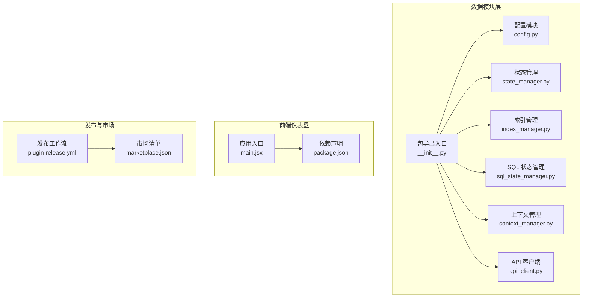
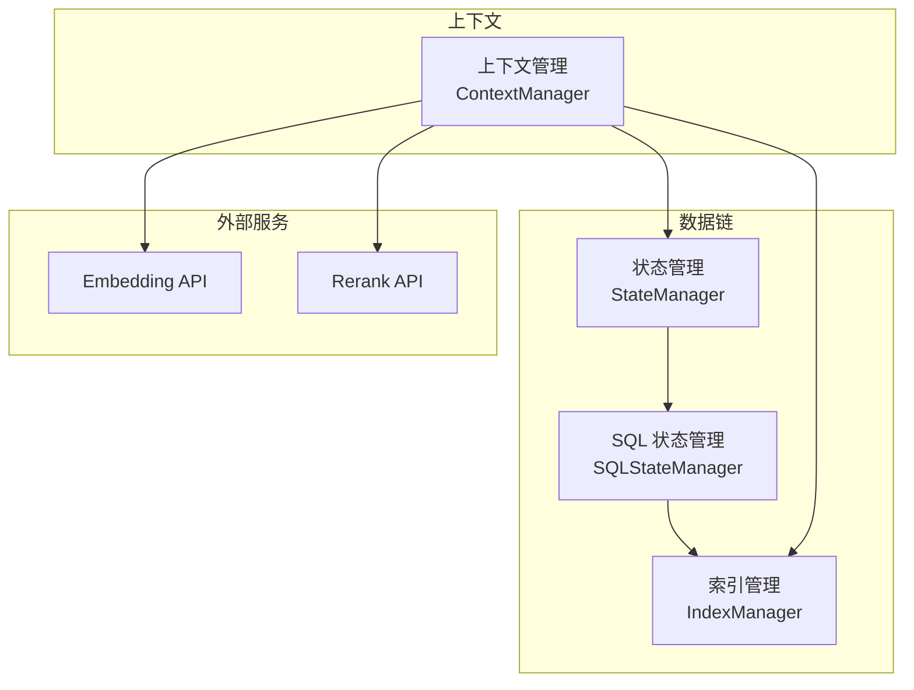
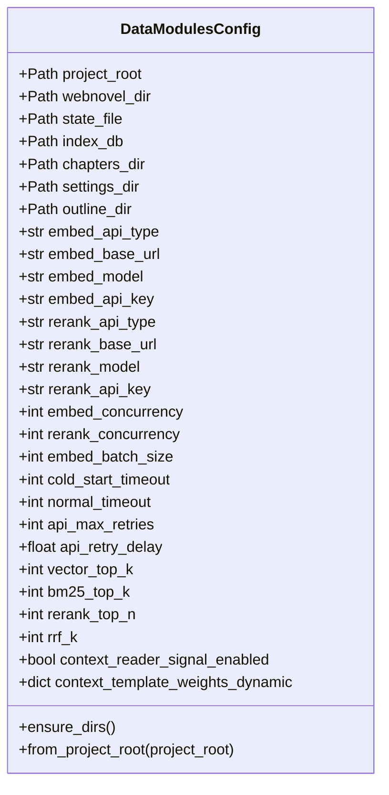
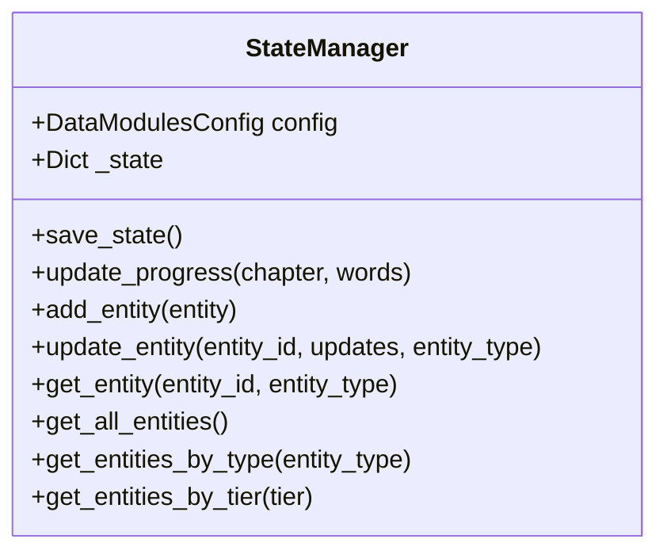
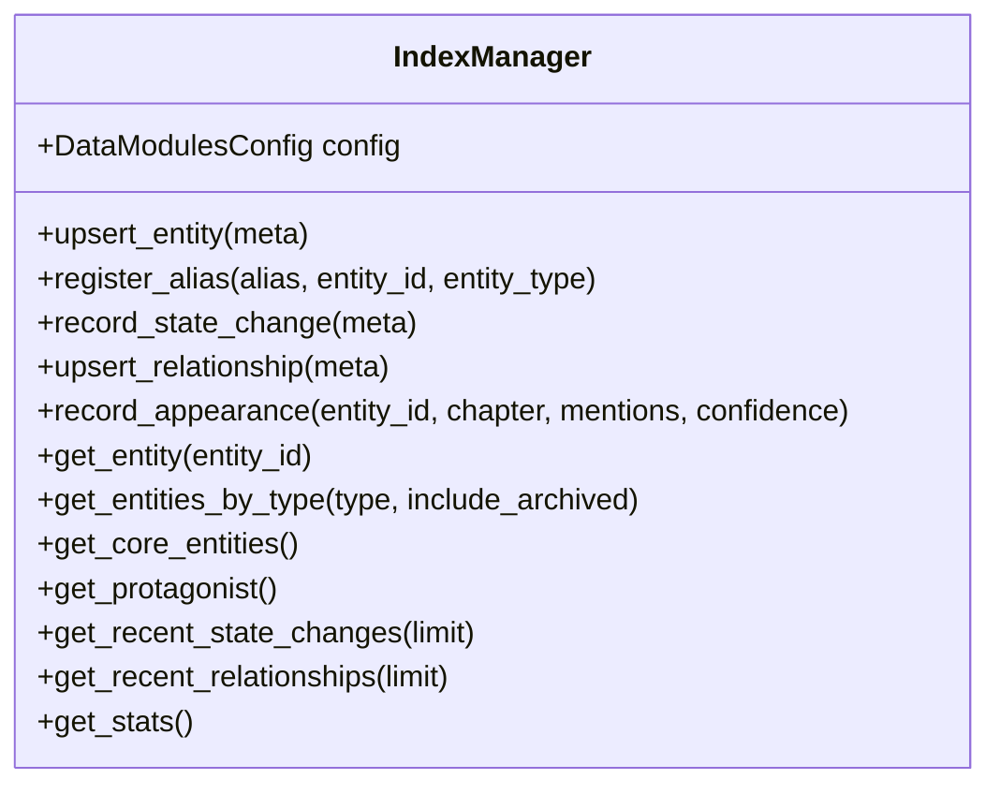
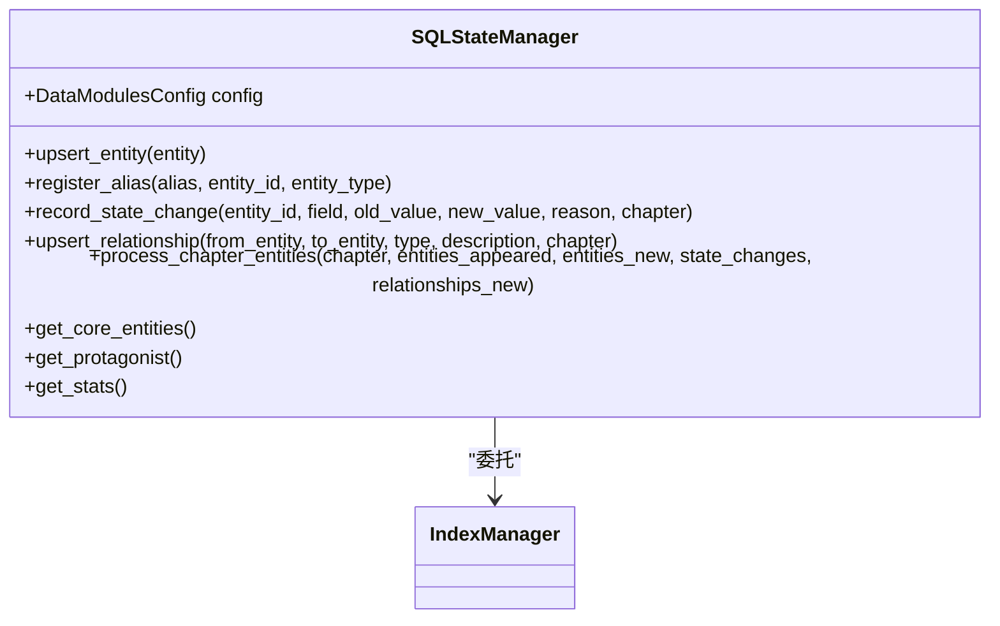
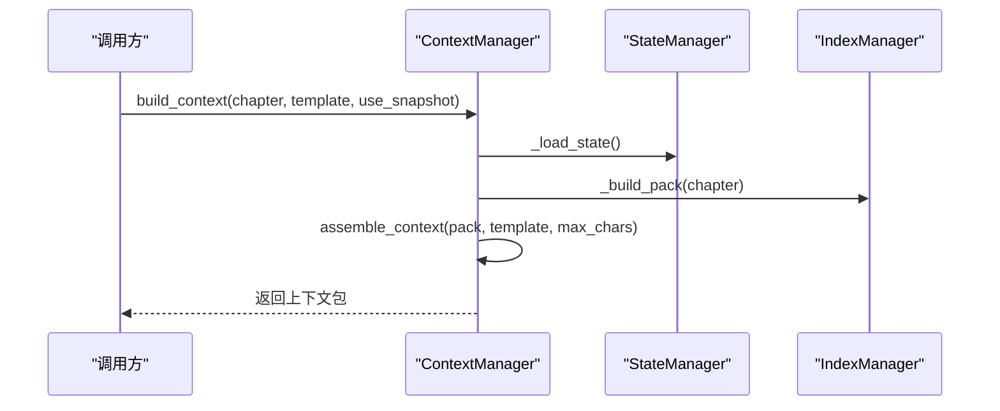
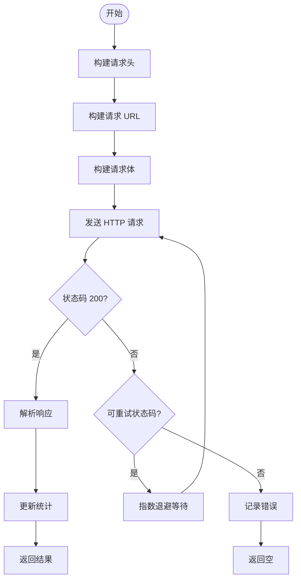
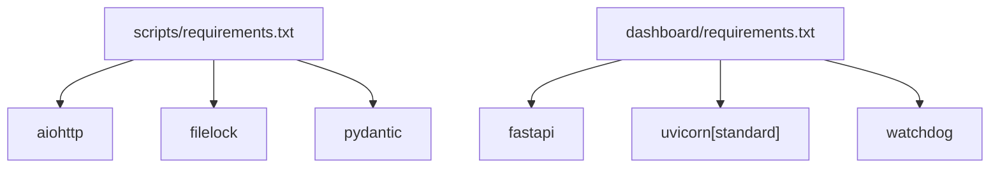

# 插件开发指南

<cite>
**本文档引用的文件**
- [plugin-release.yml](file://.github/workflows/plugin-release.yml)
- [marketplace.json](file://.claude-plugin/marketplace.json)
- [config.py](file://webnovel-writer/scripts/data_modules/config.py)
- [state_manager.py](file://webnovel-writer/scripts/data_modules/state_manager.py)
- [index_manager.py](file://webnovel-writer/scripts/data_modules/index_manager.py)
- [sql_state_manager.py](file://webnovel-writer/scripts/data_modules/sql_state_manager.py)
- [context_manager.py](file://webnovel-writer/scripts/data_modules/context_manager.py)
- [api_client.py](file://webnovel-writer/scripts/data_modules/api_client.py)
- [__init__.py](file://webnovel-writer/scripts/data_modules/__init__.py)
- [dashboard requirements.txt](file://webnovel-writer/dashboard/requirements.txt)
- [scripts requirements.txt](file://webnovel-writer/scripts/requirements.txt)
- [main.jsx](file://webnovel-writer/dashboard/frontend/src/main.jsx)
- [package.json](file://webnovel-writer/dashboard/frontend/package.json)
</cite>

## 目录
1. [简介](#简介)
2. [项目结构](#项目结构)
3. [核心组件](#核心组件)
4. [架构总览](#架构总览)
5. [详细组件分析](#详细组件分析)
6. [依赖分析](#依赖分析)
7. [性能考虑](#性能考虑)
8. [故障排除指南](#故障排除指南)
9. [结论](#结论)
10. [附录](#附录)

## 简介
本指南面向第三方开发者，系统讲解 Webnovel Writer 插件系统的架构设计、开发流程与接口规范，涵盖以下主题：
- 插件系统如何与主系统交互（数据链、状态管理、上下文组装、API 调用）
- 插件配置文件结构、manifest 定义与市场发布流程
- 插件与主系统的事件处理与数据流
- 开发最佳实践、调试技巧与性能优化
- 从 Hello World 插件到复杂 AI 代理集成的完整示例路径

## 项目结构
Webnovel Writer 由 Python 数据模块与前端仪表盘组成，插件生态围绕数据模块与前端 UI 展开：
- 数据模块层：负责状态管理、索引、上下文组装、API 客户端与可观测性
- 前端仪表盘：基于 React/Vite，提供可视化界面与交互
- 发布与市场：GitHub Actions 工作流与 marketplace.json 定义插件市场条目

**图表来源**
- [config.py:90-349](file://webnovel-writer/scripts/data_modules/config.py#L90-L349)
- [state_manager.py:90-140](file://webnovel-writer/scripts/data_modules/state_manager.py#L90-L140)
- [index_manager.py:228-234](file://webnovel-writer/scripts/data_modules/index_manager.py#L228-L234)
- [sql_state_manager.py:46-92](file://webnovel-writer/scripts/data_modules/sql_state_manager.py#L46-L92)
- [context_manager.py:50-82](file://webnovel-writer/scripts/data_modules/context_manager.py#L50-L82)
- [api_client.py:41-56](file://webnovel-writer/scripts/data_modules/api_client.py#L41-L56)
- [__init__.py:21-107](file://webnovel-writer/scripts/data_modules/__init__.py#L21-L107)
- [main.jsx:1-11](file://webnovel-writer/dashboard/frontend/src/main.jsx#L1-L11)
- [package.json:1-23](file://webnovel-writer/dashboard/frontend/package.json#L1-L23)
- [plugin-release.yml:1-57](file://.github/workflows/plugin-release.yml#L1-L57)
- [marketplace.json:1-24](file://.claude-plugin/marketplace.json#L1-L24)

**章节来源**
- [config.py:90-349](file://webnovel-writer/scripts/data_modules/config.py#L90-L349)
- [__init__.py:21-107](file://webnovel-writer/scripts/data_modules/__init__.py#L21-L107)
- [plugin-release.yml:1-57](file://.github/workflows/plugin-release.yml#L1-L57)
- [marketplace.json:1-24](file://.claude-plugin/marketplace.json#L1-L24)

## 核心组件
本节聚焦插件开发所需的核心模块及其职责：
- 配置模块：集中管理路径、API、检索与上下文权重等参数
- 状态管理：提供实体、关系、状态变更与进度的读写接口
- 索引管理：SQLite 数据库的实体、别名、关系、状态变更与统计
- SQL 状态管理：与状态管理兼容的 SQLite 接口，支持批量处理
- 上下文管理：根据模板与权重组装上下文包，支持快照与排序
- API 客户端：异步 Embedding/Rerank 客户端，支持重试与并发

**章节来源**
- [config.py:90-349](file://webnovel-writer/scripts/data_modules/config.py#L90-L349)
- [state_manager.py:90-140](file://webnovel-writer/scripts/data_modules/state_manager.py#L90-L140)
- [index_manager.py:228-234](file://webnovel-writer/scripts/data_modules/index_manager.py#L228-L234)
- [sql_state_manager.py:46-92](file://webnovel-writer/scripts/data_modules/sql_state_manager.py#L46-L92)
- [context_manager.py:50-82](file://webnovel-writer/scripts/data_modules/context_manager.py#L50-L82)
- [api_client.py:41-56](file://webnovel-writer/scripts/data_modules/api_client.py#L41-L56)

## 架构总览
插件系统围绕“数据链 + 上下文 + API”的模式组织：
- 数据链：通过状态管理与索引管理维护项目状态与实体关系
- 上下文：根据模板权重与动态预算生成上下文包，支持快照缓存
- API：统一的异步客户端封装，支持 OpenAI 兼容与 Modal 自定义接口
- 前端：仪表盘提供可视化与交互，便于调试与展示

**图表来源**
- [state_manager.py:90-140](file://webnovel-writer/scripts/data_modules/state_manager.py#L90-L140)
- [sql_state_manager.py:46-92](file://webnovel-writer/scripts/data_modules/sql_state_manager.py#L46-L92)
- [index_manager.py:228-234](file://webnovel-writer/scripts/data_modules/index_manager.py#L228-L234)
- [context_manager.py:77-82](file://webnovel-writer/scripts/data_modules/context_manager.py#L77-L82)
- [api_client.py:41-56](file://webnovel-writer/scripts/data_modules/api_client.py#L41-L56)

## 详细组件分析

### 配置模块（DataModulesConfig）
- 职责：集中管理项目路径、API 配置、检索参数、上下文权重与动态预算
- 关键点：
  - 项目根目录解析与 .env 加载策略
  - Embedding/Rerank API 类型与 URL 构造
  - 上下文模板权重、动态预算与读者信号开关
  - 查询限制、伏笔紧急度与节奏参数

**图表来源**
- [config.py:90-349](file://webnovel-writer/scripts/data_modules/config.py#L90-L349)

**章节来源**
- [config.py:90-349](file://webnovel-writer/scripts/data_modules/config.py#L90-L349)

### 状态管理（StateManager）
- 职责：管理 state.json 的读写，提供实体、关系、状态变更与进度接口
- 关键点：
  - 增量合并写入与文件锁保障并发安全
  - 与 SQLite 同步（SQLStateManager）的协同
  - 进度更新（章节与字数）与告警截断

**图表来源**
- [state_manager.py:90-140](file://webnovel-writer/scripts/data_modules/state_manager.py#L90-L140)

**章节来源**
- [state_manager.py:208-370](file://webnovel-writer/scripts/data_modules/state_manager.py#L208-L370)

### 索引管理（IndexManager）
- 职责：SQLite 数据库的实体、别名、关系、状态变更与统计
- 关键点：
  - v5.1 引入的 entities/aliases/state_changes/relationships 表
  - v5.3 引入的债务与 Override Contract 表
  - v5.4 引入的无效事实、工具调用统计与审查指标表
  - CLI 子命令支持查询与写入

**图表来源**
- [index_manager.py:228-234](file://webnovel-writer/scripts/data_modules/index_manager.py#L228-L234)

**章节来源**
- [index_manager.py:295-620](file://webnovel-writer/scripts/data_modules/index_manager.py#L295-L620)

### SQL 状态管理（SQLStateManager）
- 职责：提供与 StateManager 兼容的 SQLite 接口，支持批量处理章节实体
- 关键点：
  - upsert_entity/register_alias/record_state_change/upsert_relationship
  - process_chapter_entities 批量写入统计
  - 与 IndexManager 的协作与一致性保证

**图表来源**
- [sql_state_manager.py:46-92](file://webnovel-writer/scripts/data_modules/sql_state_manager.py#L46-L92)

**章节来源**
- [sql_state_manager.py:103-140](file://webnovel-writer/scripts/data_modules/sql_state_manager.py#L103-L140)
- [sql_state_manager.py:267-417](file://webnovel-writer/scripts/data_modules/sql_state_manager.py#L267-L417)

### 上下文管理（ContextManager）
- 职责：根据模板权重与动态预算组装上下文包，支持快照与排序
- 关键点：
  - 模板权重与动态预算（早/中/晚章）
  - 读者信号与写作清单评分
  - Genre Profile 与写作指导构建
  - 快照加载与保存

**图表来源**
- [context_manager.py:99-131](file://webnovel-writer/scripts/data_modules/context_manager.py#L99-L131)
- [context_manager.py:189-248](file://webnovel-writer/scripts/data_modules/context_manager.py#L189-L248)

**章节来源**
- [context_manager.py:99-165](file://webnovel-writer/scripts/data_modules/context_manager.py#L99-L165)
- [context_manager.py:189-248](file://webnovel-writer/scripts/data_modules/context_manager.py#L189-L248)

### API 客户端（EmbeddingAPIClient/RerankAPIClient/ModalAPIClient）
- 职责：统一异步 Embedding/Rerank 调用，支持 OpenAI 兼容与 Modal 自定义接口
- 关键点：
  - 并发信号量与批处理
  - 指数退避重试与超时控制
  - 统一请求头与负载构造
  - 预热与统计输出

**图表来源**
- [api_client.py:118-195](file://webnovel-writer/scripts/data_modules/api_client.py#L118-L195)
- [api_client.py:312-383](file://webnovel-writer/scripts/data_modules/api_client.py#L312-L383)

**章节来源**
- [api_client.py:41-56](file://webnovel-writer/scripts/data_modules/api_client.py#L41-L56)
- [api_client.py:118-195](file://webnovel-writer/scripts/data_modules/api_client.py#L118-L195)
- [api_client.py:312-383](file://webnovel-writer/scripts/data_modules/api_client.py#L312-L383)

### 包导出入口（data_modules/__init__.py）
- 职责：延迟导入与统一导出，避免包级导入引发的运行时警告
- 关键点：
  - _LAZY_EXPORTS 映射与 __getattr__ 实现
  - 与 Config/StateManager/IndexManager/API Client 的聚合

**章节来源**
- [__init__.py:57-107](file://webnovel-writer/scripts/data_modules/__init__.py#L57-L107)

## 依赖分析
- Python 依赖：aiohttp、filelock、pydantic（核心）、pytest 系列（开发/测试）
- 前端依赖：React、React DOM、Vite、react-force-graph-3d
- 发布依赖：FastAPI、Uvicorn、Watchdog（仪表盘）

**图表来源**
- [scripts requirements.txt:4-14](file://webnovel-writer/scripts/requirements.txt#L4-L14)
- [dashboard requirements.txt:1-4](file://webnovel-writer/dashboard/requirements.txt#L1-L4)

**章节来源**
- [scripts requirements.txt:4-14](file://webnovel-writer/scripts/requirements.txt#L4-L14)
- [dashboard requirements.txt:1-4](file://webnovel-writer/dashboard/requirements.txt#L1-L4)

## 性能考虑
- 并发与批处理：合理设置 embed_concurrency、rerank_concurrency 与 embed_batch_size，避免 API 限流
- 动态预算：利用上下文动态预算在早期与晚期章节调整权重，减少上下文长度
- 快照缓存：启用上下文快照，避免重复计算
- SQLite 同步：通过 SQLStateManager 将大数据迁移到 index.db，降低 state.json 体积
- 超时与重试：根据冷启动与正常阶段设置不同超时与重试策略

[本节为通用指导，无需特定文件来源]

## 故障排除指南
- 状态文件并发写入失败：检查 state.json 锁路径与权限，确认 save_state 的文件锁逻辑
- API 调用错误：查看 Embed/Rerank 客户端的 last_error_status 与错误消息，结合重试日志定位问题
- 上下文组装异常：确认模板权重与动态预算配置，检查快照兼容性
- 插件版本与发布：使用 GitHub Actions 工作流校验版本并创建标签与发布

**章节来源**
- [state_manager.py:368-370](file://webnovel-writer/scripts/data_modules/state_manager.py#L368-L370)
- [api_client.py:164-193](file://webnovel-writer/scripts/data_modules/api_client.py#L164-L193)
- [context_manager.py:83-97](file://webnovel-writer/scripts/data_modules/context_manager.py#L83-L97)
- [plugin-release.yml:35-40](file://.github/workflows/plugin-release.yml#L35-L40)

## 结论
Webnovel Writer 的插件系统以数据模块为核心，通过状态管理、索引管理与上下文管理形成稳定的数据链，并以统一的 API 客户端对接外部服务。开发者可基于这些模块扩展插件能力，实现从简单提示到复杂 AI 代理的全栈集成。

[本节为总结，无需特定文件来源]

## 附录

### 插件配置文件结构与 Manifest
- marketplace.json：定义插件名称、描述、版本、作者、源路径与分类
- 插件版本发布：通过 GitHub Actions 工作流校验版本、打标签并创建发布

**章节来源**
- [marketplace.json:1-24](file://.claude-plugin/marketplace.json#L1-L24)
- [plugin-release.yml:1-57](file://.github/workflows/plugin-release.yml#L1-L57)

### 插件与主系统的交互机制
- 数据读写：通过 StateManager 与 SQLStateManager 读写项目状态与实体
- 上下文生成：通过 ContextManager 组装上下文包，支持快照与排序
- API 调用：通过 EmbeddingAPIClient/RerankAPIClient 统一调用外部服务
- 前端集成：React/Vite 仪表盘提供可视化与交互

**章节来源**
- [state_manager.py:208-370](file://webnovel-writer/scripts/data_modules/state_manager.py#L208-L370)
- [sql_state_manager.py:267-417](file://webnovel-writer/scripts/data_modules/sql_state_manager.py#L267-L417)
- [context_manager.py:99-165](file://webnovel-writer/scripts/data_modules/context_manager.py#L99-L165)
- [api_client.py:41-56](file://webnovel-writer/scripts/data_modules/api_client.py#L41-L56)
- [main.jsx:1-11](file://webnovel-writer/dashboard/frontend/src/main.jsx#L1-L11)
- [package.json:1-23](file://webnovel-writer/dashboard/frontend/package.json#L1-L23)

### 开发最佳实践
- 使用延迟导入与统一导出入口，避免包级导入副作用
- 合理设置并发与批大小，结合指数退避与超时控制
- 利用快照缓存与动态预算提升性能
- 通过 CLI 子命令验证索引与状态一致性
- 在发布前使用工作流校验版本与创建标签

**章节来源**
- [__init__.py:57-107](file://webnovel-writer/scripts/data_modules/__init__.py#L57-L107)
- [api_client.py:118-195](file://webnovel-writer/scripts/data_modules/api_client.py#L118-L195)
- [context_manager.py:113-131](file://webnovel-writer/scripts/data_modules/context_manager.py#L113-L131)
- [index_manager.py:636-800](file://webnovel-writer/scripts/data_modules/index_manager.py#L636-L800)
- [plugin-release.yml:35-40](file://.github/workflows/plugin-release.yml#L35-L40)

### 调试技巧
- 启用并观察 API 客户端统计与错误日志
- 使用 CLI 子命令快速验证索引与状态
- 在前端仪表盘中观察实体关系图谱与写作清单评分
- 通过 .env 文件注入 API 密钥与基础 URL，便于本地调试

**章节来源**
- [api_client.py:476-485](file://webnovel-writer/scripts/data_modules/api_client.py#L476-L485)
- [index_manager.py:636-800](file://webnovel-writer/scripts/data_modules/index_manager.py#L636-L800)
- [package.json:16-21](file://webnovel-writer/dashboard/frontend/package.json#L16-L21)

### 性能优化建议
- 早期章节使用更高权重的 core 模块，减少 late 章节的 global 模块预算
- 控制上下文最大字符数与额外预算，避免超出模型上下文窗口
- 批量处理实体与关系，减少多次往返调用
- 合理设置并发与批大小，避免 API 限流与超时

**章节来源**
- [config.py:239-248](file://webnovel-writer/scripts/data_modules/config.py#L239-L248)
- [context_manager.py:133-165](file://webnovel-writer/scripts/data_modules/context_manager.py#L133-L165)
- [api_client.py:197-231](file://webnovel-writer/scripts/data_modules/api_client.py#L197-L231)

### 插件开发示例路径
- Hello World 插件：最小化实现，仅调用 ContextManager 生成上下文并输出
- 实体管理插件：使用 SQLStateManager 写入实体与关系，配合前端展示
- AI 代理集成：通过 API 客户端调用 Embedding/Rerank，结合上下文生成与状态更新

[本节为概念性指导，无需特定文件来源]