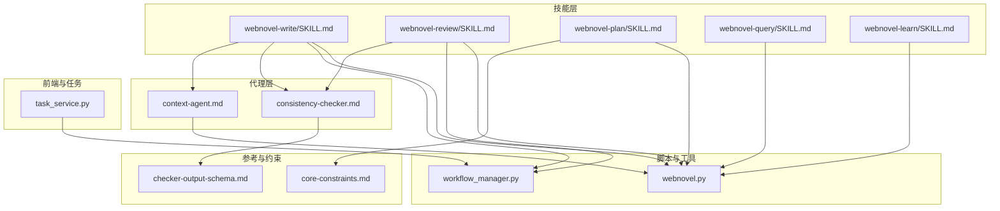
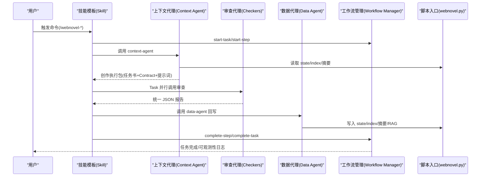
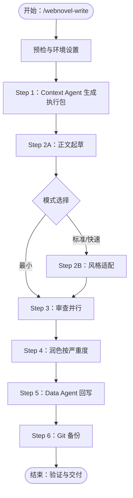
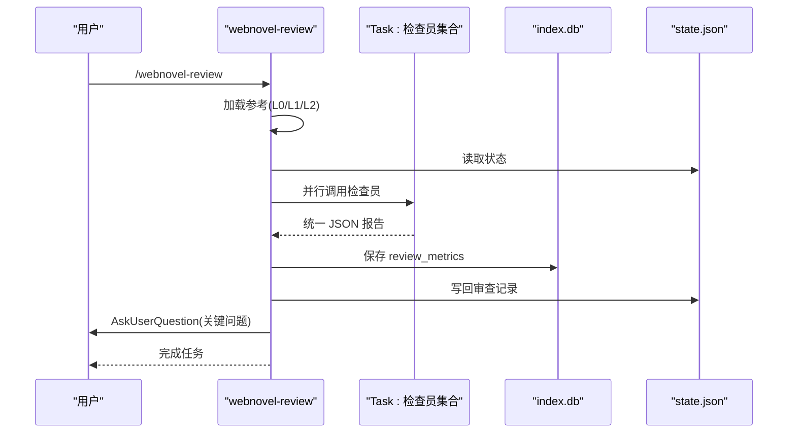
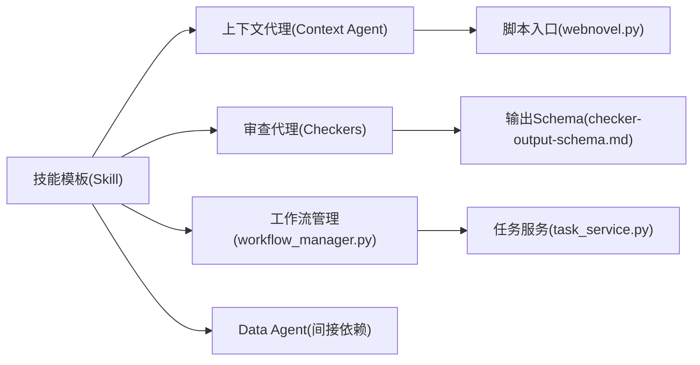

# 自定义技能开发

<cite>
**本文引用的文件**
- [webnovel-write/SKILL.md](file://webnovel-writer/skills/webnovel-write/SKILL.md)
- [webnovel-review/SKILL.md](file://webnovel-writer/skills/webnovel-review/SKILL.md)
- [webnovel-plan/SKILL.md](file://webnovel-writer/skills/webnovel-plan/SKILL.md)
- [webnovel-query/SKILL.md](file://webnovel-writer/skills/webnovel-query/SKILL.md)
- [webnovel-learn/SKILL.md](file://webnovel-writer/skills/webnovel-learn/SKILL.md)
- [context-agent.md](file://webnovel-writer/agents/context-agent.md)
- [consistency-checker.md](file://webnovel-writer/agents/consistency-checker.md)
- [workflow_manager.py](file://webnovel-writer/scripts/workflow_manager.py)
- [webnovel.py](file://webnovel-writer/scripts/webnovel.py)
- [core-constraints.md](file://webnovel-writer/references/shared/core-constraints.md)
- [checker-output-schema.md](file://webnovel-writer/references/checker-output-schema.md)
- [task_service.py](file://webnovel-writer/dashboard/task_service.py)
</cite>

## 目录
1. [简介](#简介)
2. [项目结构](#项目结构)
3. [核心组件](#核心组件)
4. [架构总览](#架构总览)
5. [详细组件分析](#详细组件分析)
6. [依赖分析](#依赖分析)
7. [性能考量](#性能考量)
8. [故障排查指南](#故障排查指南)
9. [结论](#结论)
10. [附录](#附录)

## 简介
本文件面向高级用户与技能开发者，系统化阐述 Webnovel Writer 的技能系统架构、技能模板结构与开发规范，覆盖从基础写作技能到高级评审技能的完整开发流程。文档重点包括：
- 技能系统的分层设计与工作流编排
- 技能模板的结构化定义与参数配置
- 约束与参考加载策略、与 AI 代理的交互机制
- 上下文处理与结果输出规范
- 集成测试与可观测性
- 完整示例与最佳实践、性能优化建议

## 项目结构
技能系统围绕“技能模板 + 代理 + 脚本工具 + 参考资料 + 工作流管理”展开，形成稳定的“输入 → 上下文 → 执行 → 审查 → 回写 → 备份”的闭环。

图表来源
- [webnovel-write/SKILL.md:1-381](file://webnovel-writer/skills/webnovel-write/SKILL.md#L1-L381)
- [webnovel-review/SKILL.md:1-195](file://webnovel-writer/skills/webnovel-review/SKILL.md#L1-L195)
- [webnovel-plan/SKILL.md:1-480](file://webnovel-writer/skills/webnovel-plan/SKILL.md#L1-L480)
- [webnovel-query/SKILL.md:1-193](file://webnovel-writer/skills/webnovel-query/SKILL.md#L1-L193)
- [webnovel-learn/SKILL.md:1-46](file://webnovel-writer/skills/webnovel-learn/SKILL.md#L1-L46)
- [context-agent.md:1-269](file://webnovel-writer/agents/context-agent.md#L1-L269)
- [consistency-checker.md:1-229](file://webnovel-writer/agents/consistency-checker.md#L1-L229)
- [workflow_manager.py:1-823](file://webnovel-writer/scripts/workflow_manager.py#L1-L823)
- [webnovel.py:1-37](file://webnovel-writer/scripts/webnovel.py#L1-L37)
- [core-constraints.md:1-99](file://webnovel-writer/references/shared/core-constraints.md#L1-L99)
- [checker-output-schema.md:1-169](file://webnovel-writer/references/checker-output-schema.md#L1-L169)
- [task_service.py:1-166](file://webnovel-writer/dashboard/task_service.py#L1-L166)

章节来源
- [webnovel-write/SKILL.md:1-381](file://webnovel-writer/skills/webnovel-write/SKILL.md#L1-L381)
- [webnovel-review/SKILL.md:1-195](file://webnovel-writer/skills/webnovel-review/SKILL.md#L1-L195)
- [webnovel-plan/SKILL.md:1-480](file://webnovel-writer/skills/webnovel-plan/SKILL.md#L1-L480)
- [webnovel-query/SKILL.md:1-193](file://webnovel-writer/skills/webnovel-query/SKILL.md#L1-L193)
- [webnovel-learn/SKILL.md:1-46](file://webnovel-writer/skills/webnovel-learn/SKILL.md#L1-L46)
- [context-agent.md:1-269](file://webnovel-writer/agents/context-agent.md#L1-L269)
- [consistency-checker.md:1-229](file://webnovel-writer/agents/consistency-checker.md#L1-L229)
- [workflow_manager.py:1-823](file://webnovel-writer/scripts/workflow_manager.py#L1-L823)
- [webnovel.py:1-37](file://webnovel-writer/scripts/webnovel.py#L1-L37)
- [core-constraints.md:1-99](file://webnovel-writer/references/shared/core-constraints.md#L1-L99)
- [checker-output-schema.md:1-169](file://webnovel-writer/references/checker-output-schema.md#L1-L169)
- [task_service.py:1-166](file://webnovel-writer/dashboard/task_service.py#L1-L166)

## 核心组件
- 技能模板（Skill）：定义命令名、描述、允许工具、执行流程、引用加载策略、约束与产物规范。典型如“写作”“评审”“规划”“查询”“学习”。
- 上下文代理（Context Agent）：生成“创作执行包”，包含任务书、Context Contract 与直写提示词，直接驱动正文起草。
- 审查代理（Checker Agents）：执行一致性、连续性、节奏、爽点等专项检查，输出统一 JSON 结构，支持并行汇总。
- 工作流管理（Workflow Manager）：跟踪任务与步骤状态、断点恢复、可观测性日志、清理与回滚策略。
- 脚本入口（webnovel.py）：统一 CLI 入口，转发到数据模块，适配项目级/用户级安装。
- 参考与约束（core-constraints、checker-output-schema）：共享约束与审查输出规范，确保跨技能一致性。

章节来源
- [webnovel-write/SKILL.md:1-381](file://webnovel-writer/skills/webnovel-write/SKILL.md#L1-L381)
- [webnovel-review/SKILL.md:1-195](file://webnovel-writer/skills/webnovel-review/SKILL.md#L1-L195)
- [context-agent.md:1-269](file://webnovel-writer/agents/context-agent.md#L1-L269)
- [consistency-checker.md:1-229](file://webnovel-writer/agents/consistency-checker.md#L1-L229)
- [workflow_manager.py:1-823](file://webnovel-writer/scripts/workflow_manager.py#L1-L823)
- [webnovel.py:1-37](file://webnovel-writer/scripts/webnovel.py#L1-L37)
- [core-constraints.md:1-99](file://webnovel-writer/references/shared/core-constraints.md#L1-L99)
- [checker-output-schema.md:1-169](file://webnovel-writer/references/checker-output-schema.md#L1-L169)

## 架构总览
技能系统采用“模板驱动 + 代理协作 + 工作流编排”的分层架构：
- 模板层：技能定义与流程规范
- 代理层：上下文生成、审查与数据处理
- 工具层：CLI 脚本与工作流管理
- 参考层：共享约束与输出规范
- 前端层：任务服务与事件推送

图表来源
- [webnovel-write/SKILL.md:109-381](file://webnovel-writer/skills/webnovel-write/SKILL.md#L109-L381)
- [webnovel-review/SKILL.md:102-195](file://webnovel-writer/skills/webnovel-review/SKILL.md#L102-L195)
- [context-agent.md:101-269](file://webnovel-writer/agents/context-agent.md#L101-L269)
- [consistency-checker.md:20-229](file://webnovel-writer/agents/consistency-checker.md#L20-L229)
- [workflow_manager.py:191-363](file://webnovel-writer/scripts/workflow_manager.py#L191-L363)
- [webnovel.py:1-37](file://webnovel-writer/scripts/webnovel.py#L1-L37)

## 详细组件分析

### 组件A：写作技能（webnovel-write）
- 目标与原则：稳定产出可发布章节，保证审查、润色、回写的闭环；严格约束 Step 顺序与产物命名。
- 执行模式：标准/快速/最小三种模式，裁剪可选步骤但不跳步。
- 关键步骤与约束：
  - Step 1：Context Agent 生成“创作执行包”，包含任务书、Context Contract 与直写提示词。
  - Step 2A：正文起草，遵循“大纲即法律、设定即物理、发明需识别”三大定律。
  - Step 2B：风格适配（可跳过），仅做表达层转译。
  - Step 3：审查（必须由 Task 子代理执行），核心 + 条件审查器并行汇总。
  - Step 4：润色，按严重度修复，Anti-AI 终检。
  - Step 5：Data Agent 回写 state/index/摘要/RAG，失败隔离与重试策略。
  - Step 6：Git 备份（可失败但需说明）。
- 参考加载策略：严格按步骤加载，L0/L1/L2 三级策略，路径约定清晰。
- 输出产物：章节文件、review_metrics、摘要、state.json、index.db、观测日志。

图表来源
- [webnovel-write/SKILL.md:24-381](file://webnovel-writer/skills/webnovel-write/SKILL.md#L24-L381)

章节来源
- [webnovel-write/SKILL.md:1-381](file://webnovel-writer/skills/webnovel-write/SKILL.md#L1-L381)
- [core-constraints.md:1-99](file://webnovel-writer/references/shared/core-constraints.md#L1-L99)

### 组件B：评审技能（webnovel-review）
- 目标：对章节质量进行审查并生成报告，支持 Core/Full 两种深度。
- 关键步骤：
  - Step 1：按需加载参考（L0/L1/L2）。
  - Step 2：加载项目状态（state.json）。
  - Step 3：Task 并行调用检查员（一致性/连续性/OOC/读者追读/爽点/节奏）。
  - Step 4：生成审查报告。
  - Step 5：保存 review_metrics 到 index.db。
  - Step 6：写回审查记录到 state.json。
  - Step 7：关键问题 AskUserQuestion 交互。
  - Step 8：收尾完成任务。
- 输出：审查报告、review_metrics JSON、state.json 审查记录。

图表来源
- [webnovel-review/SKILL.md:1-195](file://webnovel-writer/skills/webnovel-review/SKILL.md#L1-L195)
- [checker-output-schema.md:1-169](file://webnovel-writer/references/checker-output-schema.md#L1-L169)

章节来源
- [webnovel-review/SKILL.md:1-195](file://webnovel-writer/skills/webnovel-review/SKILL.md#L1-L195)
- [checker-output-schema.md:1-169](file://webnovel-writer/references/checker-output-schema.md#L1-L169)

### 组件C：规划技能（webnovel-plan）
- 目标：从总纲生成卷纲与章节大纲，继承创意约束，准备可写作的章节计划。
- 关键步骤：
  - 项目根校验与环境设置。
  - 加载参考（节拍表/时间线/题材配置/Strand 节奏/爽点结构等）。
  - 生成卷节拍表与时间线。
  - 生成卷骨架与章节大纲（批量）。
  - 基于卷纲增量补充设定集。
  - 校验与保存，更新 state。
- 参考加载策略：L0/L1/L2，按步骤与触发条件加载。
- 输出：卷节拍表、卷时间线、详细大纲、设定集增量、state 更新。

章节来源
- [webnovel-plan/SKILL.md:1-480](file://webnovel-writer/skills/webnovel-plan/SKILL.md#L1-L480)
- [core-constraints.md:1-99](file://webnovel-writer/references/shared/core-constraints.md#L1-L99)

### 组件D：查询技能（webnovel-query）
- 目标：查询角色、力量、势力、物品、Foreshadowing 等，支持紧急度分析与金手指状态。
- 关键步骤：
  - 项目根校验与环境设置。
  - 识别查询类型（关键词映射）。
  - 按类型加载参考（L1/L2）。
  - 加载 state.json。
  - 执行查询与格式化输出。
- 输出：查询结果、状态一致性检查、快速分析（status）。

章节来源
- [webnovel-query/SKILL.md:1-193](file://webnovel-writer/skills/webnovel-query/SKILL.md#L1-L193)

### 组件E：学习技能（webnovel-learn）
- 目标：从当前会话提取成功模式并写入 project_memory.json。
- 关键步骤：读取 state.json 获取当前章节，解析用户输入，追加记录并写回。

章节来源
- [webnovel-learn/SKILL.md:1-46](file://webnovel-writer/skills/webnovel-learn/SKILL.md#L1-L46)

### 组件F：上下文代理（context-agent）
- 职责：生成“创作执行包”，包含任务书、Context Contract 与直写提示词，确保“可直接开写”。
- 关键能力：
  - 读取 state/index/摘要/快照，按需召回与推断补全。
  - 生成时间约束（上章锚点、本章锚点、允许推进跨度、过渡要求、倒计时状态）。
  - 逻辑红线校验（不可变事实冲突、时空跳跃、能力/信息无因果、角色动机断裂、合同与任务书冲突、时间逻辑错误）。
- 输出：单一执行包，供 Step 2A 直写。

章节来源
- [context-agent.md:1-269](file://webnovel-writer/agents/context-agent.md#L1-L269)

### 组件G：审查代理（consistency-checker）
- 职责：设定一致性检查，输出结构化报告。
- 检查范围：战力一致性、地点/角色一致性、时间线一致性、实体一致性。
- 输出：统一 JSON Schema，包含 issues、metrics、summary、overall_score、pass 等字段。

章节来源
- [consistency-checker.md:1-229](file://webnovel-writer/agents/consistency-checker.md#L1-L229)
- [checker-output-schema.md:1-169](file://webnovel-writer/references/checker-output-schema.md#L1-L169)

### 组件H：工作流管理（workflow_manager）
- 职责：跟踪任务与步骤状态、断点恢复、可观测性日志、清理与回滚策略。
- 关键功能：
  - start-task/start-step/complete-step/complete-task/fail-task/detect/cleanup/clear
  - 预期步骤顺序（webnovel-write/webnovel-review）
  - 中断检测与恢复选项
  - 调用追踪与稳定状态快照
- 与前端任务服务对接，提供事件订阅与状态推送。

章节来源
- [workflow_manager.py:1-823](file://webnovel-writer/scripts/workflow_manager.py#L1-L823)
- [task_service.py:1-166](file://webnovel-writer/dashboard/task_service.py#L1-L166)

### 组件I：脚本入口（webnovel.py）
- 职责：统一 CLI 入口，转发到 data_modules.webnovel，适配技能/代理在项目级或用户级安装。

章节来源
- [webnovel.py:1-37](file://webnovel-writer/scripts/webnovel.py#L1-L37)

## 依赖分析
- 技能模板依赖上下文代理与审查代理，通过 Task 工具并行调用。
- 上下文代理依赖脚本入口与 index/state/摘要/快照。
- 审查代理依赖统一输出 Schema，确保跨检查器一致性。
- Data Agent 依赖脚本入口与 index/state/摘要/RAG。
- 工作流管理为所有技能提供可观测性与断点恢复。
- 前端任务服务订阅工作流事件，实时推送任务状态。

图表来源
- [webnovel-write/SKILL.md:109-381](file://webnovel-writer/skills/webnovel-write/SKILL.md#L109-L381)
- [webnovel-review/SKILL.md:102-195](file://webnovel-writer/skills/webnovel-review/SKILL.md#L102-L195)
- [context-agent.md:101-269](file://webnovel-writer/agents/context-agent.md#L101-L269)
- [consistency-checker.md:20-229](file://webnovel-writer/agents/consistency-checker.md#L20-L229)
- [checker-output-schema.md:1-169](file://webnovel-writer/references/checker-output-schema.md#L1-L169)
- [workflow_manager.py:191-363](file://webnovel-writer/scripts/workflow_manager.py#L191-L363)
- [task_service.py:14-166](file://webnovel-writer/dashboard/task_service.py#L14-L166)
- [webnovel.py:1-37](file://webnovel-writer/scripts/webnovel.py#L1-L37)

章节来源
- [webnovel-write/SKILL.md:1-381](file://webnovel-writer/skills/webnovel-write/SKILL.md#L1-L381)
- [webnovel-review/SKILL.md:1-195](file://webnovel-writer/skills/webnovel-review/SKILL.md#L1-L195)
- [context-agent.md:1-269](file://webnovel-writer/agents/context-agent.md#L1-L269)
- [consistency-checker.md:1-229](file://webnovel-writer/agents/consistency-checker.md#L1-L229)
- [checker-output-schema.md:1-169](file://webnovel-writer/references/checker-output-schema.md#L1-L169)
- [workflow_manager.py:1-823](file://webnovel-writer/scripts/workflow_manager.py#L1-L823)
- [task_service.py:1-166](file://webnovel-writer/dashboard/task_service.py#L1-L166)
- [webnovel.py:1-37](file://webnovel-writer/scripts/webnovel.py#L1-L37)

## 性能考量
- 观测性：通过 call_trace.jsonl 与 data_agent_timing.jsonl 记录外层调用链与内部耗时，区分 agent 启动/环境探测开销与正文/数据处理开销。
- 性能阈值：当外层总耗时远大于内层之和时，默认归因为外层系统开销。
- 失败隔离：Step 5（Data Agent）失败时，按子步骤粒度重试，避免重跑全流程。
- 并行化：审查阶段并行调用多个检查器，缩短总时长。
- 参考加载：严格按步骤加载，避免一次性加载全部参考造成 IO 压力。

章节来源
- [webnovel-write/SKILL.md:314-322](file://webnovel-writer/skills/webnovel-write/SKILL.md#L314-L322)
- [workflow_manager.py:365-564](file://webnovel-writer/scripts/workflow_manager.py#L365-L564)

## 故障排查指南
- 断点与恢复：
  - 使用 detect/interrupt 检测中断状态，analyze_recovery_options 提供多种恢复选项（从 Step 1 重启、回滚到上一章、继续润色、重新执行审查等）。
  - cleanup 支持预览与确认删除半成品、重置 Git 暂存区。
- 失败标记与诊断：
  - fail-current-task 标记任务失败并保留状态，便于诊断。
  - append_call_trace 记录事件与负载，辅助定位问题。
- 常见问题：
  - 审查缺失：重跑 Step 3 并落库 review_metrics。
  - 润色失真：恢复 Step 2A 输出并重做 Step 4。
  - 摘要/状态缺失：只重跑 Step 5。
  - 设定冲突：通过 Anti-AI 终检与一致性检查修复。

章节来源
- [workflow_manager.py:365-800](file://webnovel-writer/scripts/workflow_manager.py#L365-L800)

## 结论
Webnovel Writer 的技能系统以“模板 + 代理 + 工作流”为核心，通过严格的参考加载策略、统一的输出规范与可观测性机制，实现了可复用、可扩展、可恢复的写作与评审流水线。开发者可据此快速构建自定义技能，确保与现有生态无缝集成。

## 附录
- 技能开发清单
  - 定义命令名、描述、允许工具
  - 设计执行流程与模式（标准/快速/最小）
  - 明确引用加载策略（L0/L1/L2）
  - 定义硬约束与禁止事项
  - 设计产物与落库规范
  - 集成工作流断点记录与可观测性
  - 编写集成测试与验证清单
- 示例路径
  - 写作技能模板：[webnovel-write/SKILL.md:1-381](file://webnovel-writer/skills/webnovel-write/SKILL.md#L1-L381)
  - 评审技能模板：[webnovel-review/SKILL.md:1-195](file://webnovel-writer/skills/webnovel-review/SKILL.md#L1-L195)
  - 规划技能模板：[webnovel-plan/SKILL.md:1-480](file://webnovel-writer/skills/webnovel-plan/SKILL.md#L1-L480)
  - 查询技能模板：[webnovel-query/SKILL.md:1-193](file://webnovel-writer/skills/webnovel-query/SKILL.md#L1-L193)
  - 学习技能模板：[webnovel-learn/SKILL.md:1-46](file://webnovel-writer/skills/webnovel-learn/SKILL.md#L1-L46)
  - 上下文代理：[context-agent.md:1-269](file://webnovel-writer/agents/context-agent.md#L1-L269)
  - 一致性检查器：[consistency-checker.md:1-229](file://webnovel-writer/agents/consistency-checker.md#L1-L229)
  - 工作流管理：[workflow_manager.py:1-823](file://webnovel-writer/scripts/workflow_manager.py#L1-L823)
  - 脚本入口：[webnovel.py:1-37](file://webnovel-writer/scripts/webnovel.py#L1-L37)
  - 共享约束：[core-constraints.md:1-99](file://webnovel-writer/references/shared/core-constraints.md#L1-L99)
  - 审查输出规范：[checker-output-schema.md:1-169](file://webnovel-writer/references/checker-output-schema.md#L1-L169)
  - 前端任务服务：[task_service.py:1-166](file://webnovel-writer/dashboard/task_service.py#L1-L166)