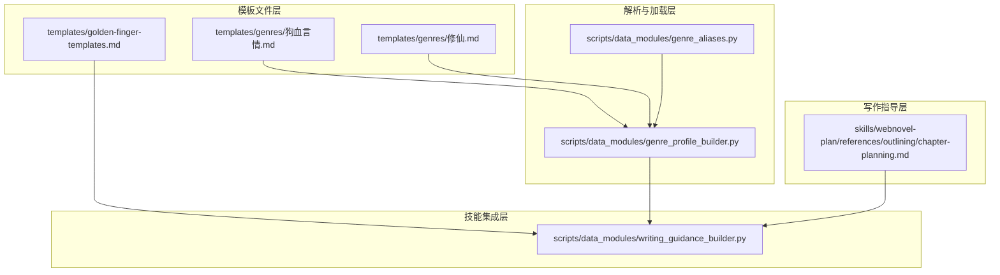
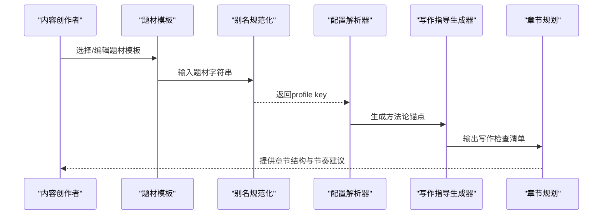
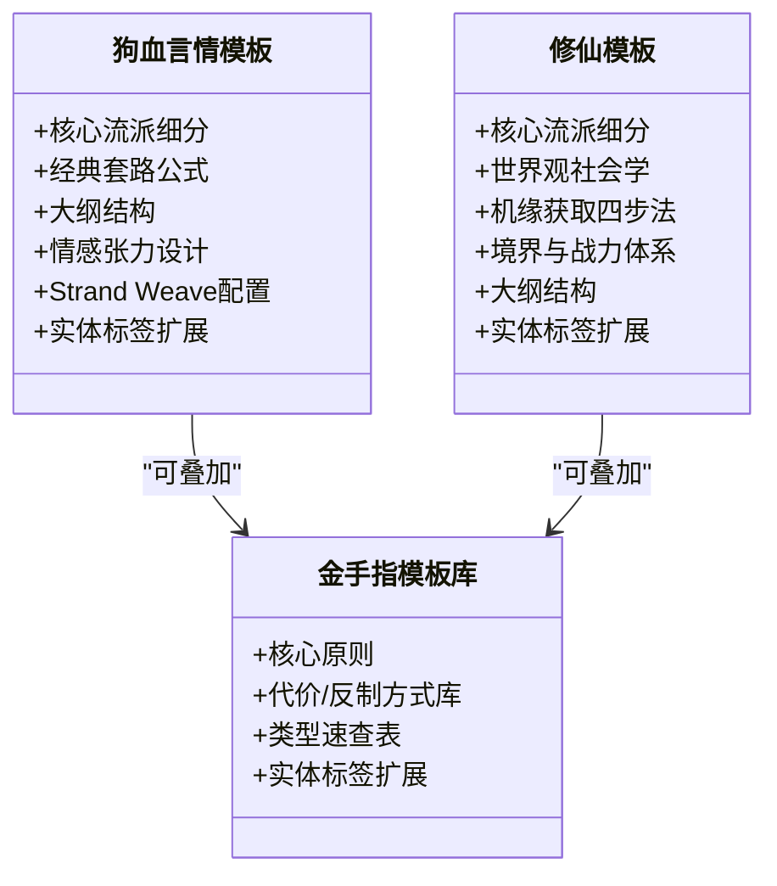
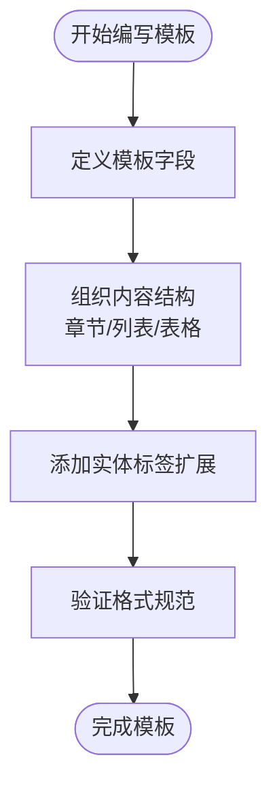
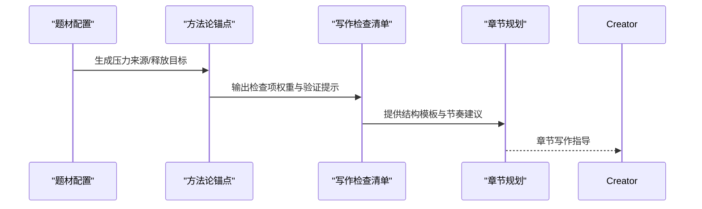
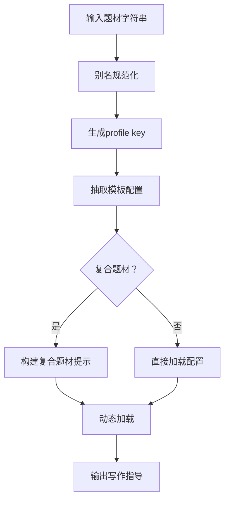
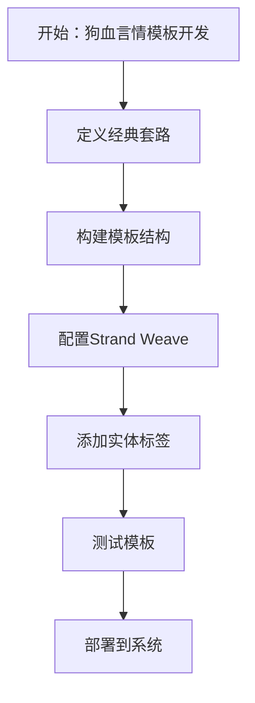
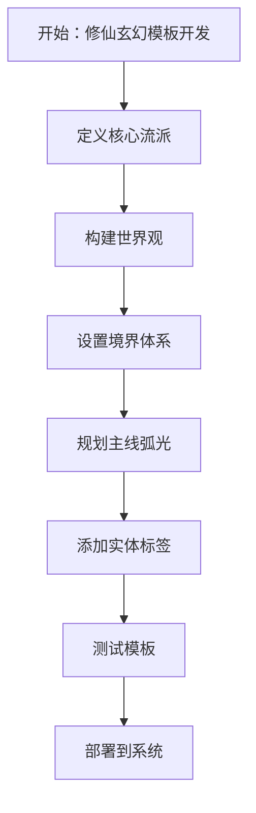
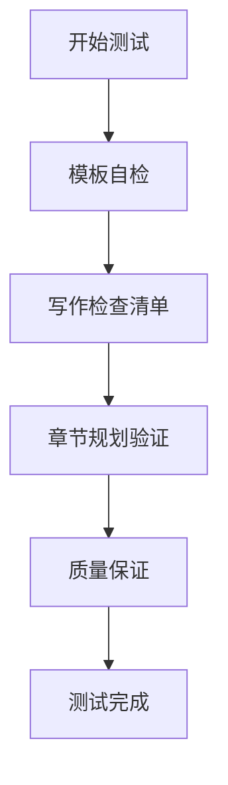
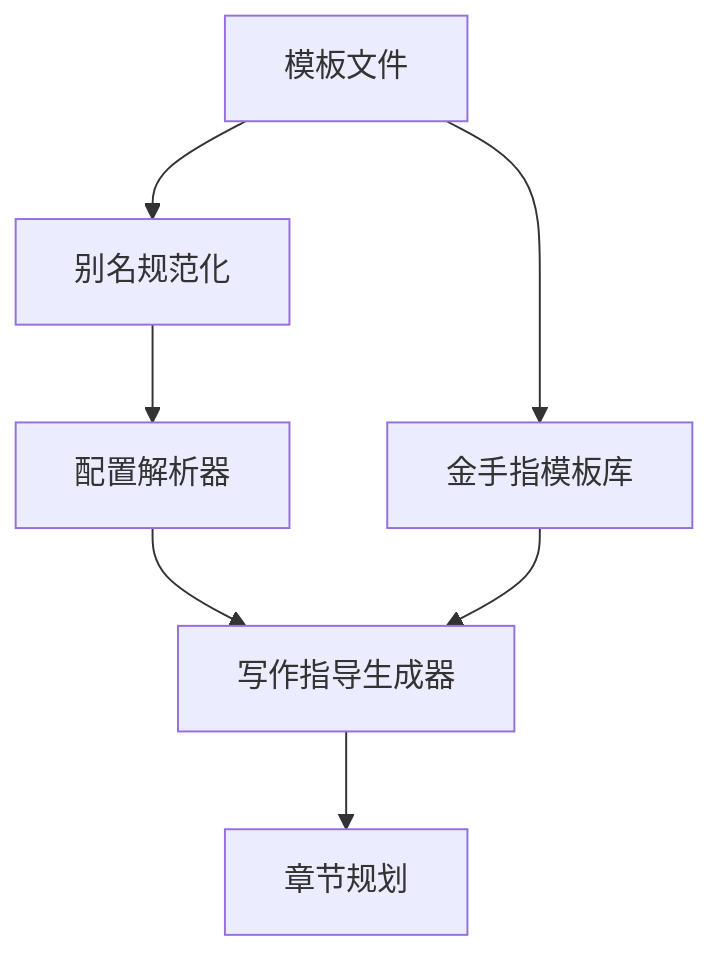

# 题材模板扩展

<cite>
**本文档引用的文件**
- [狗血言情.md](file://webnovel-writer/templates/genres/狗血言情.md)
- [修仙.md](file://webnovel-writer/templates/genres/修仙.md)
- [golden-finger-templates.md](file://webnovel-writer/templates/golden-finger-templates.md)
- [emotional-tension.md](file://webnovel-writer/genres/dog-blood-romance/emotional-tension.md)
- [romance-tropes.md](file://webnovel-writer/genres/dog-blood-romance/romance-tropes.md)
- [cultivation-levels.md](file://webnovel-writer/genres/xuanhuan/cultivation-levels.md)
- [xuanhuan-plot-patterns.md](file://webnovel-writer/genres/xuanhuan/xuanhuan-plot-patterns.md)
- [genre_aliases.py](file://webnovel-writer/scripts/data_modules/genre_aliases.py)
- [genre_profile_builder.py](file://webnovel-writer/scripts/data_modules/genre_profile_builder.py)
- [writing_guidance_builder.py](file://webnovel-writer/scripts/data_modules/writing_guidance_builder.py)
- [chapter-planning.md](file://webnovel-writer/skills/webnovel-plan/references/outlining/chapter-planning.md)
</cite>

## 目录
1. [简介](#简介)
2. [项目结构](#项目结构)
3. [核心组件](#核心组件)
4. [架构概览](#架构概览)
5. [详细组件分析](#详细组件分析)
6. [依赖分析](#依赖分析)
7. [性能考虑](#性能考虑)
8. [故障排除指南](#故障排除指南)
9. [结论](#结论)
10. [附录](#附录)

## 简介
本技术文档面向内容创作者和模板开发者，系统性阐述Webnovel Writer题材模板扩展的架构设计、模板结构与扩展机制。文档深入解析题材模板系统如何通过标准化模板、动态加载与参数传递实现可复用的创作支持，并提供从简单狗血言情到复杂修仙玄幻的完整开发示例。同时，文档涵盖模板测试方法、验证标准与质量保证流程，帮助开发者构建高质量、可维护的题材扩展。

## 项目结构
题材模板系统围绕"模板文件 + 解析与加载 + 写作指导 + 技能集成"四个维度构建：

- 模板文件层：位于templates/genres/，包含各题材的标准模板与金手指模板库
- 解析与加载层：scripts/data_modules/中的别名规范化、题材配置解析与章节抽取
- 写作指导层：skills/webnovel-plan/references/outlining/中的章节规划与节奏控制
- 技能集成层：scripts/data_modules/writing_guidance_builder.py提供的方法论锚点与检查清单

**图表来源**
- [狗血言情.md:1-192](file://webnovel-writer/templates/genres/狗血言情.md#L1-L192)
- [修仙.md:1-108](file://webnovel-writer/templates/genres/修仙.md#L1-L108)
- [golden-finger-templates.md:1-474](file://webnovel-writer/templates/golden-finger-templates.md#L1-L474)
- [genre_aliases.py:1-67](file://webnovel-writer/scripts/data_modules/genre_aliases.py#L1-L67)
- [genre_profile_builder.py:1-108](file://webnovel-writer/scripts/data_modules/genre_profile_builder.py#L1-L108)
- [chapter-planning.md:1-296](file://webnovel-writer/skills/webnovel-plan/references/outlining/chapter-planning.md#L1-L296)
- [writing_guidance_builder.py:1-479](file://webnovel-writer/scripts/data_modules/writing_guidance_builder.py#L1-L479)

**章节来源**
- [狗血言情.md:1-192](file://webnovel-writer/templates/genres/狗血言情.md#L1-L192)
- [修仙.md:1-108](file://webnovel-writer/templates/genres/修仙.md#L1-L108)
- [golden-finger-templates.md:1-474](file://webnovel-writer/templates/golden-finger-templates.md#L1-L474)
- [genre_aliases.py:1-67](file://webnovel-writer/scripts/data_modules/genre_aliases.py#L1-L67)
- [genre_profile_builder.py:1-108](file://webnovel-writer/scripts/data_modules/genre_profile_builder.py#L1-L108)
- [chapter-planning.md:1-296](file://webnovel-writer/skills/webnovel-plan/references/outlining/chapter-planning.md#L1-L296)
- [writing_guidance_builder.py:1-479](file://webnovel-writer/scripts/data_modules/writing_guidance_builder.py#L1-L479)

## 核心组件
- 题材模板：定义题材的核心流派、结构、节奏与实体标签，如狗血言情的"霸道总裁"、"替身文学"与修仙的"凡人流"、"无敌流"
- 别名规范化：将输入的题材别名映射到统一的profile key，确保跨文件的一致性
- 题材配置解析：从模板中抽取章节结构、情感张力设计、金手指配置等关键信息
- 写作指导生成：基于题材锚点与读者信号，生成方法论策略卡与写作检查清单
- 章节规划：提供章节结构、节奏控制与标题技巧，确保每章都有明确的冲突、爽点与钩子

**章节来源**
- [狗血言情.md:1-192](file://webnovel-writer/templates/genres/狗血言情.md#L1-L192)
- [修仙.md:1-108](file://webnovel-writer/templates/genres/修仙.md#L1-L108)
- [genre_aliases.py:1-67](file://webnovel-writer/scripts/data_modules/genre_aliases.py#L1-L67)
- [genre_profile_builder.py:1-108](file://webnovel-writer/scripts/data_modules/genre_profile_builder.py#L1-L108)
- [writing_guidance_builder.py:1-479](file://webnovel-writer/scripts/data_modules/writing_guidance_builder.py#L1-L479)
- [chapter-planning.md:1-296](file://webnovel-writer/skills/webnovel-plan/references/outlining/chapter-planning.md#L1-L296)

## 架构概览
题材模板系统采用"模板驱动 + 动态解析 + 方法论指导"的架构，通过以下流程实现扩展：

**图表来源**
- [genre_aliases.py:53-66](file://webnovel-writer/scripts/data_modules/genre_aliases.py#L53-L66)
- [genre_profile_builder.py:15-51](file://webnovel-writer/scripts/data_modules/genre_profile_builder.py#L15-L51)
- [writing_guidance_builder.py:81-167](file://webnovel-writer/scripts/data_modules/writing_guidance_builder.py#L81-L167)
- [chapter-planning.md:9-15](file://webnovel-writer/skills/webnovel-plan/references/outlining/chapter-planning.md#L9-L15)

## 详细组件分析

### 组件A：题材模板结构与扩展机制
- 狗血言情模板包含核心流派细分、经典套路公式、大纲结构与情感张力设计，提供Strand Weave配置与实体标签扩展
- 修仙模板包含流派细分、世界观社会学、机缘获取四步法、境界与战力体系以及大纲结构，提供实体标签扩展
- 金手指模板库提供系统化的设计框架，包括功能性、可视化与爽点嵌入原则，以及代价/反制方式库

**图表来源**
- [狗血言情.md:1-192](file://webnovel-writer/templates/genres/狗血言情.md#L1-L192)
- [修仙.md:1-108](file://webnovel-writer/templates/genres/修仙.md#L1-L108)
- [golden-finger-templates.md:1-474](file://webnovel-writer/templates/golden-finger-templates.md#L1-L474)

**章节来源**
- [狗血言情.md:1-192](file://webnovel-writer/templates/genres/狗血言情.md#L1-L192)
- [修仙.md:1-108](file://webnovel-writer/templates/genres/修仙.md#L1-L108)
- [golden-finger-templates.md:1-474](file://webnovel-writer/templates/golden-finger-templates.md#L1-L474)

### 组件B：模板编写规范与内容组织
- 模板字段标准化：所有模板采用统一的字段结构（核心卖点、创意约束、流派细分、套路公式、大纲结构、实体标签等）
- 内容组织方式：采用Markdown结构化文档，使用章节标题、列表、表格与代码块确保可读性与可解析性
- 实体标签扩展：提供XML实体标签模板，便于数据提取与后续处理

**图表来源**
- [狗血言情.md:1-192](file://webnovel-writer/templates/genres/狗血言情.md#L1-L192)
- [修仙.md:1-108](file://webnovel-writer/templates/genres/修仙.md#L1-L108)
- [golden-finger-templates.md:439-451](file://webnovel-writer/templates/golden-finger-templates.md#L439-L451)

**章节来源**
- [狗血言情.md:1-192](file://webnovel-writer/templates/genres/狗血言情.md#L1-L192)
- [修仙.md:1-108](file://webnovel-writer/templates/genres/修仙.md#L1-L108)
- [golden-finger-templates.md:439-451](file://webnovel-writer/templates/golden-finger-templates.md#L439-L451)

### 组件C：题材模板与写作技能的关联关系
- 方法论锚点：每个题材都有对应的"压力来源"和"释放目标"，指导章节的冲突设置与解决路径
- 写作检查清单：基于读者信号与题材锚点，生成具体的写作检查项，确保每章都有冲突、爽点与钩子
- 章节规划：提供章节结构模板、节奏控制与标题技巧，确保内容的连贯性与吸引力

**图表来源**
- [writing_guidance_builder.py:29-78](file://webnovel-writer/scripts/data_modules/writing_guidance_builder.py#L29-L78)
- [writing_guidance_builder.py:81-167](file://webnovel-writer/scripts/data_modules/writing_guidance_builder.py#L81-L167)
- [chapter-planning.md:9-15](file://webnovel-writer/skills/webnovel-plan/references/outlining/chapter-planning.md#L9-L15)

**章节来源**
- [writing_guidance_builder.py:29-78](file://webnovel-writer/scripts/data_modules/writing_guidance_builder.py#L29-L78)
- [writing_guidance_builder.py:81-167](file://webnovel-writer/scripts/data_modules/writing_guidance_builder.py#L81-L167)
- [chapter-planning.md:9-15](file://webnovel-writer/skills/webnovel-plan/references/outlining/chapter-planning.md#L9-L15)

### 组件D：参数传递与动态加载
- 别名规范化：将输入的题材别名映射到统一的profile key，支持多种别名形式
- 配置解析：从模板中抽取章节结构、情感张力设计、金手指配置等关键信息
- 复合题材处理：支持主辅题材组合，提供执行参考与冲突优先级指导

**图表来源**
- [genre_aliases.py:53-66](file://webnovel-writer/scripts/data_modules/genre_aliases.py#L53-L66)
- [genre_profile_builder.py:15-51](file://webnovel-writer/scripts/data_modules/genre_profile_builder.py#L15-L51)
- [genre_profile_builder.py:93-106](file://webnovel-writer/scripts/data_modules/genre_profile_builder.py#L93-L106)

**章节来源**
- [genre_aliases.py:53-66](file://webnovel-writer/scripts/data_modules/genre_aliases.py#L53-L66)
- [genre_profile_builder.py:15-51](file://webnovel-writer/scripts/data_modules/genre_profile_builder.py#L15-L51)
- [genre_profile_builder.py:93-106](file://webnovel-writer/scripts/data_modules/genre_profile_builder.py#L93-L106)

### 组件E：从简单到复杂的开发示例

#### 示例1：狗血言情模板开发流程
- 需求分析：确定核心流派（霸道总裁、替身文学、重生复仇等）
- 模板编写：按照"核心流派细分 + 经典套路公式 + 大纲结构 + 情感张力设计 + 实体标签扩展"的结构编写
- 参数传递：通过Strand Weave配置与实体标签，向写作指导系统传递节奏与角色信息
- 动态加载：使用别名规范化与配置解析，实现模板的动态加载与应用

**图表来源**
- [狗血言情.md:11-102](file://webnovel-writer/templates/genres/狗血言情.md#L11-L102)
- [emotional-tension.md:1-579](file://webnovel-writer/genres/dog-blood-romance/emotional-tension.md#L1-L579)
- [romance-tropes.md:1-529](file://webnovel-writer/genres/dog-blood-romance/romance-tropes.md#L1-L529)

**章节来源**
- [狗血言情.md:11-102](file://webnovel-writer/templates/genres/狗血言情.md#L11-L102)
- [emotional-tension.md:1-579](file://webnovel-writer/genres/dog-blood-romance/emotional-tension.md#L1-L579)
- [romance-tropes.md:1-529](file://webnovel-writer/genres/dog-blood-romance/romance-tropes.md#L1-L529)

#### 示例2：修仙玄幻模板开发流程
- 需求分析：确定核心流派（凡人流、无敌流、家族流、苟道流）
- 模板编写：按照"核心流派细分 + 世界观社会学 + 机缘获取四步法 + 境界与战力体系 + 大纲结构 + 实体标签扩展"的结构编写
- 参数传递：通过境界设定与战力体系，向写作指导系统传递成长曲线与冲突强度
- 动态加载：使用别名规范化与配置解析，实现模板的动态加载与应用

**图表来源**
- [修仙.md:11-75](file://webnovel-writer/templates/genres/修仙.md#L11-L75)
- [cultivation-levels.md:1-477](file://webnovel-writer/genres/xuanhuan/cultivation-levels.md#L1-L477)
- [xuanhuan-plot-patterns.md:1-548](file://webnovel-writer/genres/xuanhuan/xuanhuan-plot-patterns.md#L1-L548)

**章节来源**
- [修仙.md:11-75](file://webnovel-writer/templates/genres/修仙.md#L11-L75)
- [cultivation-levels.md:1-477](file://webnovel-writer/genres/xuanhuan/cultivation-levels.md#L1-L477)
- [xuanhuan-plot-patterns.md:1-548](file://webnovel-writer/genres/xuanhuan/xuanhuan-plot-patterns.md#L1-L548)

### 组件F：测试方法、验证标准与质量保证
- 自检清单：模板完成后使用自检清单检查核心字段、结构完整性与实体标签
- 写作检查清单：基于读者信号与题材锚点，生成具体的写作检查项，确保每章都有冲突、爽点与钩子
- 质量保证：通过章节规划模板与节奏控制，确保内容的连贯性与吸引力；通过方法论锚点，确保题材承诺的稳定兑现

**图表来源**
- [狗血言情.md:105-123](file://webnovel-writer/templates/genres/狗血言情.md#L105-L123)
- [修仙.md:77-98](file://webnovel-writer/templates/genres/修仙.md#L77-L98)
- [writing_guidance_builder.py:278-449](file://webnovel-writer/scripts/data_modules/writing_guidance_builder.py#L278-L449)
- [chapter-planning.md:247-257](file://webnovel-writer/skills/webnovel-plan/references/outlining/chapter-planning.md#L247-L257)

**章节来源**
- [狗血言情.md:105-123](file://webnovel-writer/templates/genres/狗血言情.md#L105-L123)
- [修仙.md:77-98](file://webnovel-writer/templates/genres/修仙.md#L77-L98)
- [writing_guidance_builder.py:278-449](file://webnovel-writer/scripts/data_modules/writing_guidance_builder.py#L278-L449)
- [chapter-planning.md:247-257](file://webnovel-writer/skills/webnovel-plan/references/outlining/chapter-planning.md#L247-L257)

## 依赖分析
题材模板系统的关键依赖关系如下：

**图表来源**
- [genre_aliases.py:1-67](file://webnovel-writer/scripts/data_modules/genre_aliases.py#L1-L67)
- [genre_profile_builder.py:1-108](file://webnovel-writer/scripts/data_modules/genre_profile_builder.py#L1-L108)
- [writing_guidance_builder.py:1-479](file://webnovel-writer/scripts/data_modules/writing_guidance_builder.py#L1-L479)
- [chapter-planning.md:1-296](file://webnovel-writer/skills/webnovel-plan/references/outlining/chapter-planning.md#L1-L296)
- [golden-finger-templates.md:1-474](file://webnovel-writer/templates/golden-finger-templates.md#L1-L474)

**章节来源**
- [genre_aliases.py:1-67](file://webnovel-writer/scripts/data_modules/genre_aliases.py#L1-L67)
- [genre_profile_builder.py:1-108](file://webnovel-writer/scripts/data_modules/genre_profile_builder.py#L1-L108)
- [writing_guidance_builder.py:1-479](file://webnovel-writer/scripts/data_modules/writing_guidance_builder.py#L1-L479)
- [chapter-planning.md:1-296](file://webnovel-writer/skills/webnovel-plan/references/outlining/chapter-planning.md#L1-L296)
- [golden-finger-templates.md:1-474](file://webnovel-writer/templates/golden-finger-templates.md#L1-L474)

## 性能考虑
- 模板解析性能：通过延迟导入与模块缓存机制，减少初始化开销
- 写作指导生成：基于题材锚点与读者信号的增量计算，避免重复解析
- 章节规划：提供预设模板与检查清单，降低创作过程中的认知负担

## 故障排除指南
- 模板加载失败：检查模板文件路径与编码格式，确保Markdown语法正确
- 别名映射错误：核对genre_aliases.py中的映射表，确保输入别名在映射范围内
- 写作指导异常：检查writing_guidance_builder.py中的方法论锚点与检查清单生成逻辑
- 章节规划问题：参考chapter-planning.md中的模板与检查清单，确保每章都有明确的冲突、爽点与钩子

**章节来源**
- [writing_guidance_builder.py:452-479](file://webnovel-writer/scripts/data_modules/writing_guidance_builder.py#L452-L479)
- [chapter-planning.md:247-257](file://webnovel-writer/skills/webnovel-plan/references/outlining/chapter-planning.md#L247-L257)

## 结论
Webnovel Writer的题材模板扩展系统通过标准化模板、动态解析与方法论指导，为内容创作者提供了从简单到复杂的完整开发框架。系统不仅支持题材模板的快速扩展，还能通过参数传递与动态加载实现高度定制化的写作支持。结合测试方法、验证标准与质量保证流程，开发者可以构建高质量、可维护的题材扩展，满足不同读者群体的需求。

## 附录
- 参考案例：可参考模板中的经典案例分析，学习成功题材的结构与节奏控制
- 扩展建议：在现有模板基础上，结合读者信号与市场趋势，持续优化题材配置与写作指导