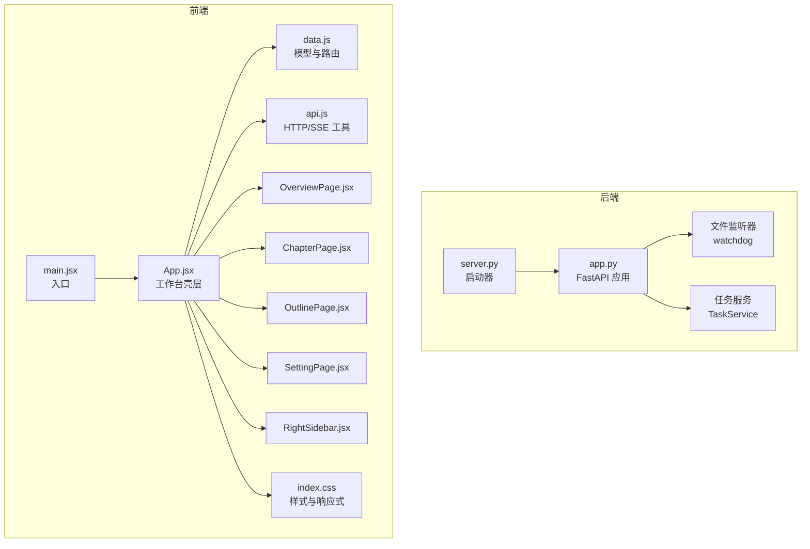
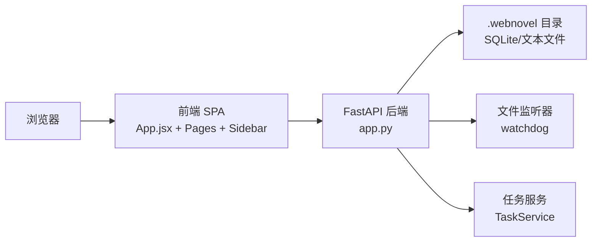
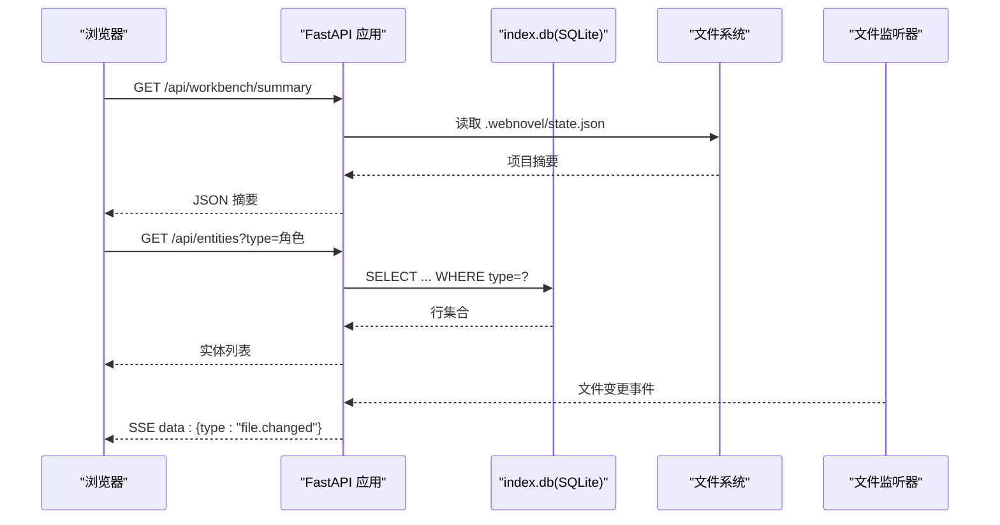
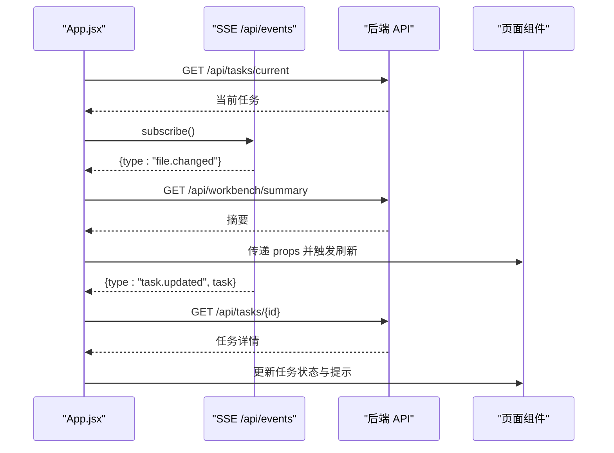
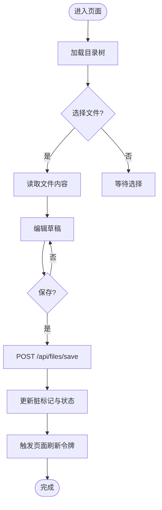
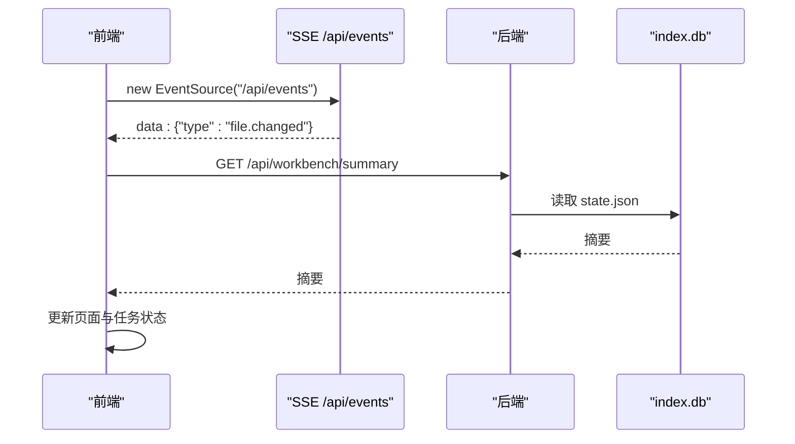
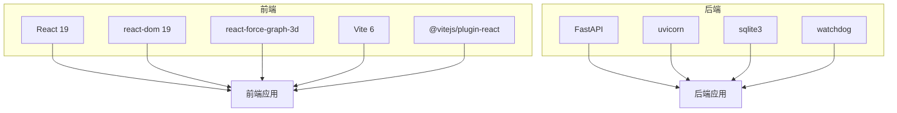

# 仪表板技能 (webnovel-dashboard)

<cite>
**本文引用的文件**   
- [SKILL.md](file://webnovel-writer/skills/webnovel-dashboard/SKILL.md)
- [app.py](file://webnovel-writer/dashboard/app.py)
- [server.py](file://webnovel-writer/dashboard/server.py)
- [package.json](file://webnovel-writer/dashboard/frontend/package.json)
- [main.jsx](file://webnovel-writer/dashboard/frontend/src/main.jsx)
- [App.jsx](file://webnovel-writer/dashboard/frontend/src/App.jsx)
- [api.js](file://webnovel-writer/dashboard/frontend/src/api.js)
- [data.js](file://webnovel-writer/dashboard/frontend/src/workbench/data.js)
- [index.css](file://webnovel-writer/dashboard/frontend/src/index.css)
- [OverviewPage.jsx](file://webnovel-writer/dashboard/frontend/src/workbench/OverviewPage.jsx)
- [ChapterPage.jsx](file://webnovel-writer/dashboard/frontend/src/workbench/ChapterPage.jsx)
- [OutlinePage.jsx](file://webnovel-writer/dashboard/frontend/src/workbench/OutlinePage.jsx)
- [SettingPage.jsx](file://webnovel-writer/dashboard/frontend/src/workbench/SettingPage.jsx)
- [RightSidebar.jsx](file://webnovel-writer/dashboard/frontend/src/workbench/RightSidebar.jsx)
</cite>

## 目录
1. [简介](#简介)
2. [项目结构](#项目结构)
3. [核心组件](#核心组件)
4. [架构总览](#架构总览)
5. [详细组件分析](#详细组件分析)
6. [依赖关系分析](#依赖关系分析)
7. [性能考量](#性能考量)
8. [故障排查指南](#故障排查指南)
9. [结论](#结论)
10. [附录](#附录)

## 简介
webnovel-dashboard 是一个面向本地小说项目的可视化工作台与只读仪表板，提供以下能力：
- 项目状态与进度概览
- 实体与关系图谱浏览
- 章节与大纲内容浏览
- 设定集文档浏览
- 追读力分析与评审指标
- 实时事件推送（文件变更、任务状态）
- 与后端服务的只读数据查询与最小写入能力

该技能通过本地启动一个只读 Web 面板，监听 .webnovel 目录变更并实时刷新，不对项目做任何修改。

**章节来源**
- [SKILL.md:1-81](file://webnovel-writer/skills/webnovel-dashboard/SKILL.md#L1-L81)

## 项目结构
仪表板分为前后端两部分：
- 后端（FastAPI）：提供只读 API、静态资源托管、SSE 实时事件推送、文件系统安全访问控制
- 前端（React + Vite）：工作台壳层与四大页面（总览、章节、大纲、设定）、右侧栏（聊天、动作卡、任务面板）、样式与响应式布局

**图表来源**
- [server.py:1-72](file://webnovel-writer/dashboard/server.py#L1-L72)
- [app.py:1-513](file://webnovel-writer/dashboard/app.py#L1-L513)
- [main.jsx:1-11](file://webnovel-writer/dashboard/frontend/src/main.jsx#L1-L11)
- [App.jsx:1-417](file://webnovel-writer/dashboard/frontend/src/App.jsx#L1-L417)
- [data.js:1-163](file://webnovel-writer/dashboard/frontend/src/workbench/data.js#L1-L163)
- [api.js:1-78](file://webnovel-writer/dashboard/frontend/src/api.js#L1-L78)
- [index.css:1-1250](file://webnovel-writer/dashboard/frontend/src/index.css#L1-L1250)
- [OverviewPage.jsx:1-56](file://webnovel-writer/dashboard/frontend/src/workbench/OverviewPage.jsx#L1-L56)
- [ChapterPage.jsx:1-199](file://webnovel-writer/dashboard/frontend/src/workbench/ChapterPage.jsx#L1-L199)
- [OutlinePage.jsx:1-209](file://webnovel-writer/dashboard/frontend/src/workbench/OutlinePage.jsx#L1-L209)
- [SettingPage.jsx:1-240](file://webnovel-writer/dashboard/frontend/src/workbench/SettingPage.jsx#L1-L240)
- [RightSidebar.jsx:1-145](file://webnovel-writer/dashboard/frontend/src/workbench/RightSidebar.jsx#L1-L145)

**章节来源**
- [package.json:1-23](file://webnovel-writer/dashboard/frontend/package.json#L1-L23)
- [server.py:1-72](file://webnovel-writer/dashboard/server.py#L1-L72)
- [app.py:1-513](file://webnovel-writer/dashboard/app.py#L1-L513)

## 核心组件
- 后端应用与生命周期
  - 创建 FastAPI 应用，注册 CORS、静态资源、SPA 回退
  - 生命周期内启动文件监听器与任务服务
- API 分层
  - 项目元信息：/api/project/info、/api/workbench/summary
  - 实体与关系：/api/entities、/api/relationships、/api/relationship-events、/api/state-changes、/api/aliases
  - 章节与场景：/api/chapters、/api/scenes
  - 追读力与评审：/api/reading-power、/api/review-metrics
  - 扩展表（v5.3+）：/api/overrides、/api/debts、/api/debt-events、/api/invalid-facts、/api/rag-queries、/api/tool-stats、/api/checklist-scores
  - 文档浏览（只读）：/api/files/tree、/api/files/read、/api/files/save（POST）
  - 任务与聊天：/api/tasks、/api/tasks/{id}、/api/tasks/current、/api/chat
  - 实时事件：/api/events（SSE）
- 前端工作台壳层
  - 状态管理：工作台页面、当前任务、聊天消息、页面状态缓存
  - 数据加载：摘要、当前任务
  - 事件订阅：SSE 文件变更与任务更新
  - 页面渲染：总览、章节、大纲、设定四页
  - 右侧栏：上下文、聊天、动作卡、任务面板
- 样式与响应式
  - 主题色板与网格布局
  - 针对不同屏幕尺寸的断点适配

**章节来源**
- [app.py:50-490](file://webnovel-writer/dashboard/app.py#L50-L490)
- [App.jsx:21-417](file://webnovel-writer/dashboard/frontend/src/App.jsx#L21-L417)
- [index.css:1-1250](file://webnovel-writer/dashboard/frontend/src/index.css#L1-L1250)

## 架构总览
仪表板采用“后端 API + 前端 SPA”的分层架构，后端负责数据聚合与安全访问，前端负责视图与交互。

**图表来源**
- [app.py:50-490](file://webnovel-writer/dashboard/app.py#L50-L490)
- [server.py:43-72](file://webnovel-writer/dashboard/server.py#L43-L72)
- [App.jsx:190-273](file://webnovel-writer/dashboard/frontend/src/App.jsx#L190-L273)

## 详细组件分析

### 后端应用与生命周期（FastAPI）
- 应用工厂与生命周期
  - 通过 lifespan 在启动时初始化监听器与任务服务，在关闭时清理
- 中间件与静态资源
  - CORS 允许 GET/POST
  - 静态资源挂载 /assets，SPA 回退至 index.html
- API 路由
  - 项目与工作台摘要
  - 实体与关系查询（含只读安全封装）
  - 章节/场景/阅读力/评审指标
  - 扩展表查询（带表存在性保护）
  - 文档浏览（只读 + 路径穿越防护）
  - 任务与聊天（最小写入）
  - SSE 事件推送（文件变更与任务状态）

**图表来源**
- [app.py:80-430](file://webnovel-writer/dashboard/app.py#L80-L430)

**章节来源**
- [app.py:50-490](file://webnovel-writer/dashboard/app.py#L50-L490)

### 前端工作台壳层（App.jsx）
- 状态与派生
  - 工作台页面、摘要、当前任务、聊天消息、页面状态缓存
  - 通过 normalizeWorkbenchPage 保证页面合法
- 数据加载
  - 初始化加载摘要与当前任务
- 事件订阅
  - 订阅 /api/events，处理文件变更与任务更新
  - 连接状态变化（SSE open/error）
- 动作与聊天
  - 发送聊天请求，构建回复模型与建议动作
  - 执行动作卡，创建任务并追踪状态
- 页面渲染
  - 根据 activePage 渲染总览/章节/大纲/设定
  - 使用 reloadToken 强制刷新受影响页面

**图表来源**
- [App.jsx:64-194](file://webnovel-writer/dashboard/frontend/src/App.jsx#L64-L194)
- [App.jsx:195-273](file://webnovel-writer/dashboard/frontend/src/App.jsx#L195-L273)
- [api.js:61-78](file://webnovel-writer/dashboard/frontend/src/api.js#L61-L78)

**章节来源**
- [App.jsx:21-417](file://webnovel-writer/dashboard/frontend/src/App.jsx#L21-L417)

### 页面组件与数据绑定
- 总览页（OverviewPage.jsx）
  - 从摘要构建项目概况、最近任务、最近修改、AI 建议
- 章节页（ChapterPage.jsx）
  - 加载正文目录树，支持选择文件、编辑、保存
  - 与 App.jsx 共享页面状态与脏标记
- 大纲页（OutlinePage.jsx）
  - 类似章节页，但按文件名推断大纲类型
- 设定页（SettingPage.jsx）
  - 支持按类别筛选文件，自动识别分类
- 右侧栏（RightSidebar.jsx）
  - 展示上下文、聊天消息、动作卡、当前任务与日志

**图表来源**
- [ChapterPage.jsx:26-80](file://webnovel-writer/dashboard/frontend/src/workbench/ChapterPage.jsx#L26-L80)
- [OutlinePage.jsx:34-87](file://webnovel-writer/dashboard/frontend/src/workbench/OutlinePage.jsx#L34-L87)
- [SettingPage.jsx:38-106](file://webnovel-writer/dashboard/frontend/src/workbench/SettingPage.jsx#L38-L106)
- [api.js:27-37](file://webnovel-writer/dashboard/frontend/src/api.js#L27-L37)

**章节来源**
- [OverviewPage.jsx:1-56](file://webnovel-writer/dashboard/frontend/src/workbench/OverviewPage.jsx#L1-L56)
- [ChapterPage.jsx:1-199](file://webnovel-writer/dashboard/frontend/src/workbench/ChapterPage.jsx#L1-L199)
- [OutlinePage.jsx:1-209](file://webnovel-writer/dashboard/frontend/src/workbench/OutlinePage.jsx#L1-L209)
- [SettingPage.jsx:1-240](file://webnovel-writer/dashboard/frontend/src/workbench/SettingPage.jsx#L1-L240)
- [RightSidebar.jsx:1-145](file://webnovel-writer/dashboard/frontend/src/workbench/RightSidebar.jsx#L1-L145)

### 实时更新策略与事件推送
- SSE 端点
  - /api/events 返回 Server-Sent Events，推送文件变更与任务更新
- 前端订阅
  - 使用 EventSource 订阅，自动重连
  - 收到事件后更新工作台状态，必要时触发页面刷新
- 任务状态
  - 任务创建后轮询 /api/tasks/{id} 获取详情
  - 任务完成后刷新摘要并触发对应页面刷新

**图表来源**
- [app.py:434-460](file://webnovel-writer/dashboard/app.py#L434-L460)
- [api.js:61-78](file://webnovel-writer/dashboard/frontend/src/api.js#L61-L78)
- [App.jsx:195-273](file://webnovel-writer/dashboard/frontend/src/App.jsx#L195-L273)

**章节来源**
- [app.py:434-460](file://webnovel-writer/dashboard/app.py#L434-L460)
- [api.js:61-78](file://webnovel-writer/dashboard/frontend/src/api.js#L61-L78)

### 个性化配置、主题定制与响应式设计
- 主题定制
  - CSS 变量集中定义颜色与阴影，便于统一替换
  - 卡片、徽章、进度条等组件化样式
- 响应式设计
  - 针对 1280px、960px、720px 断点进行布局调整
  - 侧边栏图标与文字在窄屏下隐藏，保留核心导航
- 个性化
  - 页面状态缓存（selectedPath/dirty）避免刷新丢失状态
  - 任务状态与聊天上下文持久化于工作台壳层

**章节来源**
- [index.css:1-1250](file://webnovel-writer/dashboard/frontend/src/index.css#L1-L1250)
- [App.jsx:32-47](file://webnovel-writer/dashboard/frontend/src/App.jsx#L32-L47)

## 依赖关系分析
- 前端依赖
  - React 19、react-dom 19、react-force-graph-3d（用于图谱）
  - Vite 6、@vitejs/plugin-react
- 后端依赖
  - FastAPI、uvicorn、sqlite3（内置）
  - watchdog（文件监听）
  - 路径安全模块（防路径穿越）

**图表来源**
- [package.json:11-21](file://webnovel-writer/dashboard/frontend/package.json#L11-L21)
- [app.py:15-24](file://webnovel-writer/dashboard/app.py#L15-L24)

**章节来源**
- [package.json:1-23](file://webnovel-writer/dashboard/frontend/package.json#L1-L23)
- [app.py:1-513](file://webnovel-writer/dashboard/app.py#L1-L513)

## 性能考量
- 前端
  - 使用 reloadToken 强制刷新特定页面，避免全量重载
  - 仅在任务完成或文件变更时触发摘要刷新
  - 文本编辑采用草稿状态，减少无效保存
- 后端
  - SQLite 查询使用只读连接与行工厂，避免写操作
  - 对不存在的扩展表返回空列表，降低异常开销
  - 文件树遍历与路径解析在服务端完成，前端仅消费结果
- 网络
  - SSE 自动重连，降低长连接中断影响
  - API 参数化查询，避免重复扫描

[本节为通用指导，无需具体文件分析]

## 故障排查指南
- 启动失败
  - 确认已安装依赖并构建前端产物
  - 检查项目根目录是否包含 .webnovel/state.json
- API 404/403
  - index.db 或 state.json 不存在
  - 文件读取超出允许目录（正文/大纲/设定集）
- SSE 不更新
  - 检查 /api/events 是否可达
  - 查看浏览器网络面板与控制台错误
- 任务未完成
  - 检查任务日志与错误提示
  - 确认动作卡与页面上下文一致

**章节来源**
- [SKILL.md:76-81](file://webnovel-writer/skills/webnovel-dashboard/SKILL.md#L76-L81)
- [app.py:80-113](file://webnovel-writer/dashboard/app.py#L80-L113)
- [app.py:365-385](file://webnovel-writer/dashboard/app.py#L365-L385)

## 结论
webnovel-dashboard 提供了完整的只读可视化工作台，结合后端 API 与前端 SPA，实现了：
- 项目状态与进度的可视化展示
- 实体与关系的浏览与检索
- 章节/大纲/设定的只读浏览与最小写入
- 实时事件推送与任务状态追踪
- 可定制的主题与响应式布局

其设计强调安全性（路径穿越防护、只读 API）、可维护性（模块化前端、清晰的 API 分层）与可用性（SSE 实时更新、上下文感知的聊天与动作卡）。

[本节为总结，无需具体文件分析]

## 附录

### 使用指南
- 启动
  - 设置项目根目录并运行后端服务，默认端口 8765
  - 浏览器访问 http://127.0.0.1:8765
- 导航
  - 顶部导航切换总览/章节/大纲/设定
  - 右侧栏查看上下文、聊天、动作卡与任务面板
- 实时更新
  - 修改正文/大纲/设定集文件后，面板自动刷新
  - 任务完成后自动提示并可跳转对应页面

**章节来源**
- [SKILL.md:20-81](file://webnovel-writer/skills/webnovel-dashboard/SKILL.md#L20-L81)
- [server.py:43-72](file://webnovel-writer/dashboard/server.py#L43-L72)

### 功能扩展建议
- 图谱增强：利用 react-force-graph-3d 展示实体关系图谱
- 搜索与筛选：为实体/关系/设定增加搜索与筛选
- 导出与备份：提供摘要导出与增量备份
- 多用户协作：基于任务队列与权限控制扩展协作能力

[本节为建议，无需具体文件分析]