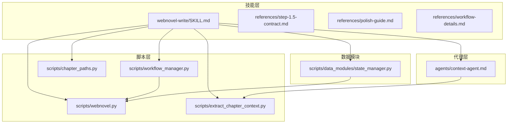
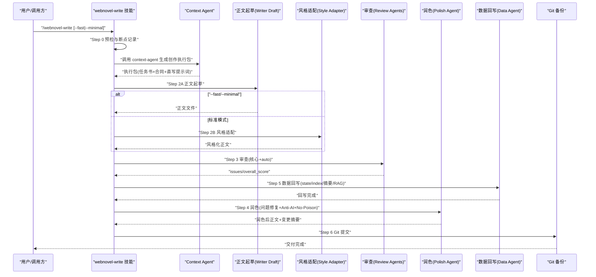
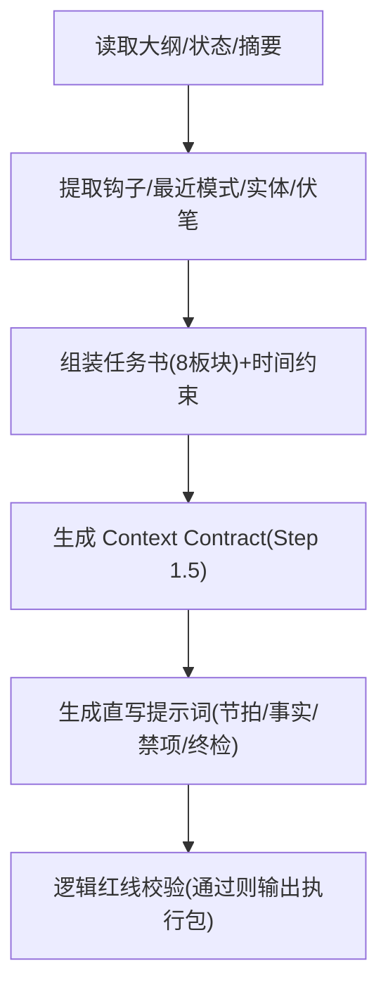
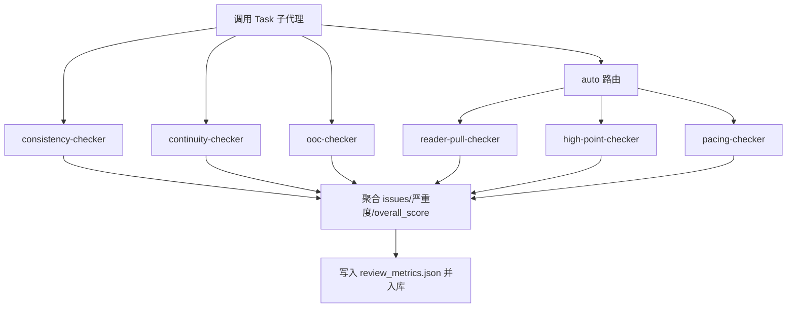
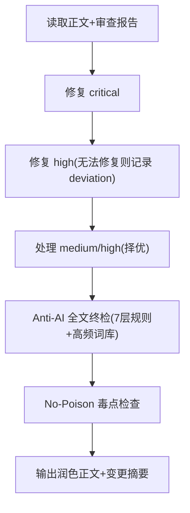
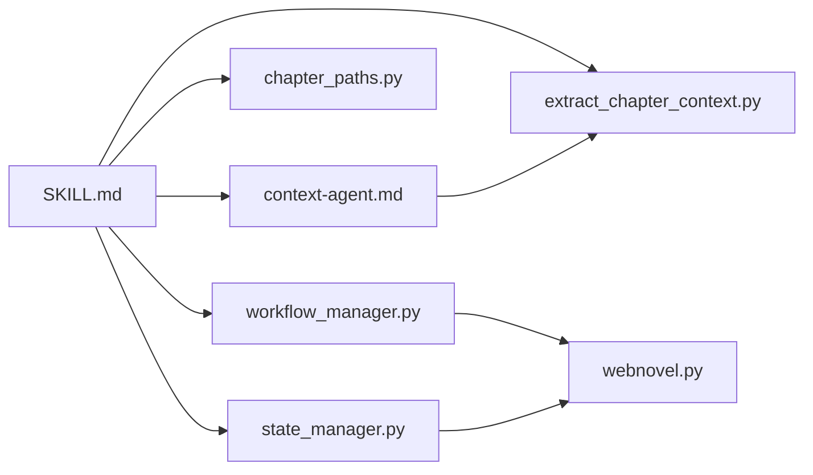

# 写作技能（webnovel-write）

<cite>
**本文引用的文件**
- [webnovel-write/SKILL.md](file://webnovel-writer/skills/webnovel-write/SKILL.md)
- [webnovel-write/references/step-1.5-contract.md](file://webnovel-writer/skills/webnovel-write/references/step-1.5-contract.md)
- [webnovel-write/references/workflow-details.md](file://webnovel-writer/skills/webnovel-write/references/workflow-details.md)
- [webnovel-write/references/core-constraints.md](file://webnovel-writer/skills/webnovel-write/references/core-constraints.md)
- [webnovel-write/references/polish-guide.md](file://webnovel-writer/skills/webnovel-write/references/polish-guide.md)
- [agents/context-agent.md](file://webnovel-writer/agents/context-agent.md)
- [scripts/webnovel.py](file://webnovel-writer/scripts/webnovel.py)
- [scripts/workflow_manager.py](file://webnovel-writer/scripts/workflow_manager.py)
- [scripts/extract_chapter_context.py](file://webnovel-writer/scripts/extract_chapter_context.py)
- [scripts/chapter_paths.py](file://webnovel-writer/scripts/chapter_paths.py)
- [scripts/data_modules/state_manager.py](file://webnovel-writer/scripts/data_modules/state_manager.py)
</cite>

## 目录
1. [简介](#简介)
2. [项目结构](#项目结构)
3. [核心组件](#核心组件)
4. [架构总览](#架构总览)
5. [详细组件分析](#详细组件分析)
6. [依赖分析](#依赖分析)
7. [性能考虑](#性能考虑)
8. [故障排查指南](#故障排查指南)
9. [结论](#结论)
10. [附录](#附录)

## 简介
本文件面向“webnovel-write”写作技能，提供从输入校验到章节交付的完整技术文档。文档覆盖 Step 1–6 的详细步骤、执行原则与硬约束、Context Agent 内置合同、正文起草、风格适配、审查流程、润色处理与数据回写机制，以及命令行参数、环境变量、工具策略、错误处理与最小回滚、失败恢复流程、引用加载等级与路径约定、使用示例、最佳实践与性能优化建议。

## 项目结构
- 技能层（skills/webnovel-write）：定义工作流契约、步骤引用清单、工具策略与执行原则。
- 脚本层（scripts/）：统一入口脚本、上下文抽取、章节路径解析、工作流状态管理、状态与索引回写。
- 代理层（agents/）：Context Agent 等子代理的职责与调用规范。
- 数据模块（scripts/data_modules/）：状态管理、SQL 同步、索引与观察性数据。

图表来源
- [webnovel-write/SKILL.md:110-381](file://webnovel-writer/skills/webnovel-write/SKILL.md#L110-L381)
- [agents/context-agent.md:101-269](file://webnovel-writer/agents/context-agent.md#L101-L269)
- [scripts/webnovel.py:1-37](file://webnovel-writer/scripts/webnovel.py#L1-L37)
- [scripts/workflow_manager.py:1-200](file://webnovel-writer/scripts/workflow_manager.py#L1-L200)
- [scripts/extract_chapter_context.py:1-200](file://webnovel-writer/scripts/extract_chapter_context.py#L1-L200)
- [scripts/chapter_paths.py:1-156](file://webnovel-writer/scripts/chapter_paths.py#L1-L156)
- [scripts/data_modules/state_manager.py:1-200](file://webnovel-writer/scripts/data_modules/state_manager.py#L1-L200)

章节来源
- [webnovel-write/SKILL.md:110-381](file://webnovel-writer/skills/webnovel-write/SKILL.md#L110-L381)
- [scripts/webnovel.py:1-37](file://webnovel-writer/scripts/webnovel.py#L1-L37)

## 核心组件
- 技能契约与步骤引用：定义 Step 1–6 的目标、原则、硬约束、引用加载等级与路径约定。
- Context Agent：生成“创作执行包”，包含任务书、Context Contract 与直写提示词。
- 正文起草（Step 2A）：按大纲与设定约束直写正文，遵循中文叙事单元优先与字数目标。
- 风格适配（Step 2B）：仅做表达层转译，不改变剧情事实。
- 审查（Step 3）：核心检查器 + auto 路由条件检查器，强制落库 review_metrics。
- 润色（Step 4）：问题修复优先，Anti-AI 全文终检与 No-Poison 规避，输出变更摘要。
- 数据回写（Step 5）：Data Agent 写入 state/index/摘要，支持 RAG 索引与风格样本评估。
- Git 备份（Step 6）：提交章节文件、摘要与审查产物，失败需说明原因与未提交范围。
- 工作流断点记录：best-effort 记录 task/step 状态，失败不阻断。

章节来源
- [webnovel-write/SKILL.md:153-381](file://webnovel-writer/skills/webnovel-write/SKILL.md#L153-L381)
- [agents/context-agent.md:31-269](file://webnovel-writer/agents/context-agent.md#L31-L269)

## 架构总览
下图展示从预检到交付的端到端流程，以及关键断点与产物落库点。

图表来源
- [webnovel-write/SKILL.md:153-381](file://webnovel-writer/skills/webnovel-write/SKILL.md#L153-L381)
- [agents/context-agent.md:101-269](file://webnovel-writer/agents/context-agent.md#L101-L269)

## 详细组件分析

### Step 0：预检与断点记录
- 目标：解析真实书项目根、校验核心输入、规范化环境变量，记录工作流断点。
- 关键输入：大纲/总纲、extract_chapter_context.py、state.json。
- 环境变量：CLAUDE_PLUGIN_ROOT、WORKSPACE_ROOT、PROJECT_ROOT、SCRIPTS_DIR、SKILL_ROOT。
- 断点记录：workflow start-task/start-step/complete-step/complete-task，失败仅告警不阻断。

章节来源
- [webnovel-write/SKILL.md:111-152](file://webnovel-writer/skills/webnovel-write/SKILL.md#L111-L152)
- [scripts/webnovel.py:1-37](file://webnovel-writer/scripts/webnovel.py#L1-L37)

### Step 1：Context Agent（内置 Context Contract）
- 作用：生成“创作执行包”，直接驱动 Step 2A。
- 输出三层：任务书（8板块）、Context Contract（Step 1.5）、直写提示词。
- 关键来源：state.json、index.db、summaries、大纲/设定集、阅读力分类与题材 Profile。
- 时间线约束：上章时间锚点、本章时间锚点、允许推进跨度、过渡要求、倒计时状态。
- 逻辑红线：不可变事实冲突、时空跳跃无承接、能力/信息无因果、角色动机断裂、合同与任务书冲突、时间逻辑错误。

图表来源
- [agents/context-agent.md:101-269](file://webnovel-writer/agents/context-agent.md#L101-L269)
- [webnovel-write/references/step-1.5-contract.md:1-50](file://webnovel-writer/skills/webnovel-write/references/step-1.5-contract.md#L1-L50)

章节来源
- [agents/context-agent.md:13-269](file://webnovel-writer/agents/context-agent.md#L13-L269)
- [webnovel-write/references/step-1.5-contract.md:1-50](file://webnovel-writer/skills/webnovel-write/references/step-1.5-contract.md#L1-L50)

### Step 2A：正文起草
- 加载参考：shared/core-constraints.md（单一事实源）。
- 约束与目标：
  - 文件命名：优先“正文/第{NNNN}章-{title_safe}.md”，无标题回退“正文/第{NNNN}章.md”。
  - 字数：默认 2000–2500；关键战斗/高潮/卷末按大纲/用户优先。
  - 禁止占位符正文；保留承接关系（上章钩子必须回应）。
  - 中文叙事单元优先，禁止“先英后中”、英文结论话术。
- 产物：章节草稿（可进入 Step 2B 或 Step 3）。

章节来源
- [webnovel-write/SKILL.md:172-193](file://webnovel-writer/skills/webnovel-write/SKILL.md#L172-L193)
- [webnovel-write/references/core-constraints.md:1-12](file://webnovel-writer/skills/webnovel-write/references/core-constraints.md#L1-L12)

### Step 2B：风格适配（--fast/--minimal 跳过）
- 加载参考：references/style-adapter.md。
- 职责边界：仅表达层转译，不改剧情事实、事件顺序、角色行为结果、设定规则。
- 产物：覆盖原章节文件的风格化正文。

章节来源
- [webnovel-write/SKILL.md:194-207](file://webnovel-writer/skills/webnovel-write/SKILL.md#L194-L207)

### Step 3：审查（auto 路由，必须由 Task 子代理执行）
- 加载参考：references/step-3-review-gate.md。
- 必须用 Task 调用审查 subagent，禁止伪造结论。
- 核心检查器：consistency-checker、continuity-checker、ooc-checker。
- 条件检查器（auto 命中时）：reader-pull-checker、high-point-checker、pacing-checker。
- 模式：
  - 标准/–fast：核心 3 + auto 命中的条件检查器
  - –minimal：仅核心 3（忽略条件检查器）
- 落库：review_metrics 必须成功，包含 overall_score、维度得分、严重度计数、关键问题、报告文件与 notes。

图表来源
- [webnovel-write/SKILL.md:208-258](file://webnovel-writer/skills/webnovel-write/SKILL.md#L208-L258)

章节来源
- [webnovel-write/SKILL.md:208-258](file://webnovel-writer/skills/webnovel-write/SKILL.md#L208-L258)

### Step 4：润色（问题修复优先）
- 加载参考：references/polish-guide.md、references/writing/typesetting.md。
- 执行顺序：先修复 critical，再 high（无法修复记录 deviation），再 medium/high，最后 Anti-AI 与 No-Poison 全文终检。
- Anti-AI 终检：7 层规则 + 高频词库 + 终检清单，全文逐段检查，输出 anti_ai_force_check。
- No-Poison：降智推进、强行误会、圣母无代价、工具人配角、双标裁决五类毒点规避。
- 输出：润色后正文 + 变更摘要（修复项、保留项、deviation、anti_ai_force_check）。

图表来源
- [webnovel-write/SKILL.md:259-276](file://webnovel-writer/skills/webnovel-write/SKILL.md#L259-L276)
- [webnovel-write/references/polish-guide.md:20-318](file://webnovel-writer/skills/webnovel-write/references/polish-guide.md#L20-L318)

章节来源
- [webnovel-write/SKILL.md:259-276](file://webnovel-writer/skills/webnovel-write/SKILL.md#L259-L276)
- [webnovel-write/references/polish-guide.md:20-318](file://webnovel-writer/skills/webnovel-write/references/polish-guide.md#L20-L318)

### Step 5：数据回写（Data Agent）
- 参数：chapter、chapter_file（优先带标题文件名）、review_score、project_root、storage_path、state_file。
- 默认子步骤：加载上下文、AI 实体提取、实体消歧、写入 state/index、写入章节摘要、AI 场景切片、RAG 向量索引、风格样本评估（score≥80）、债务利息（默认关闭）。
- --scenes 来源优先级：index.db scenes → 正文行区间切片 → 整章单场景。
- 失败隔离规则：
  - G/H 失败仅补跑 G/H，不回滚 1–4。
  - A–E 失败仅重跑 Step 5，不回滚 1–4。
- 检查清单：state.json、index.db、summaries/chNNNN.md、observability/data_agent_timing.jsonl。

章节来源
- [webnovel-write/SKILL.md:277-325](file://webnovel-writer/skills/webnovel-write/SKILL.md#L277-L325)

### Step 6：Git 备份
- 提交时机：验证、回写、清理完成后最后执行。
- 提交信息：中文“第{chapter_num}章: {title}”。
- 失败说明：必须给出失败原因与未提交文件范围。

章节来源
- [webnovel-write/SKILL.md:326-337](file://webnovel-writer/skills/webnovel-write/SKILL.md#L326-L337)

### 充分性闸门与验证交付
- 闸门：
  1) 章节正文文件存在且非空
  2) Step 3 已产出 overall_score 且 review_metrics 成功落库
  3) Step 4 已处理全部 critical，high 未修项有 deviation 记录
  4) Step 4 的 anti_ai_force_check=pass
  5) Step 5 已回写 state.json、index.db、summaries/chNNNN.md
  6) 性能观测（可选）：读取最新 timing 并输出结论
- 验证检查：state.json、正文文件、摘要文件、最近 review_metrics、data_agent_timing 最后一行。

章节来源
- [webnovel-write/SKILL.md:338-365](file://webnovel-writer/skills/webnovel-write/SKILL.md#L338-L365)

### 失败处理与最小回滚
- 触发条件：章节文件缺失/空、审查未落库、摘要/状态缺失、润色引入设定冲突。
- 恢复流程：仅重跑失败步骤，不回滚已通过步骤；常见最小修复：重跑 Step 3 并落库、恢复 Step 2A 并重做 Step 4、仅重跑 Step 5。
- 重新执行验证与交付检查，通过后结束。

章节来源
- [webnovel-write/SKILL.md:366-381](file://webnovel-writer/skills/webnovel-write/SKILL.md#L366-L381)

## 依赖分析
- 技能契约依赖 Context Agent 与参考文件（Step 1.5 合同、Polish 指南、风格适配、审查门禁、债务开关）。
- 正文起草依赖 shared/core-constraints.md 与章节路径解析。
- 审查依赖 Task 子代理与 index 产物（review_metrics 落库）。
- 润色依赖审查报告与 Anti-AI/No-Poison 规则。
- 数据回写依赖 state_manager 与 index 管理器，支持 SQLite 同步。
- 工作流断点记录依赖 workflow_manager 的 call_trace 与状态持久化。

图表来源
- [webnovel-write/SKILL.md:153-381](file://webnovel-writer/skills/webnovel-write/SKILL.md#L153-L381)
- [agents/context-agent.md:101-269](file://webnovel-writer/agents/context-agent.md#L101-L269)
- [scripts/extract_chapter_context.py:1-200](file://webnovel-writer/scripts/extract_chapter_context.py#L1-L200)
- [scripts/chapter_paths.py:1-156](file://webnovel-writer/scripts/chapter_paths.py#L1-L156)
- [scripts/workflow_manager.py:1-200](file://webnovel-writer/scripts/workflow_manager.py#L1-L200)
- [scripts/data_modules/state_manager.py:1-200](file://webnovel-writer/scripts/data_modules/state_manager.py#L1-L200)
- [scripts/webnovel.py:1-37](file://webnovel-writer/scripts/webnovel.py#L1-L37)

章节来源
- [webnovel-write/SKILL.md:153-381](file://webnovel-writer/skills/webnovel-write/SKILL.md#L153-L381)

## 性能考虑
- 观测日志：
  - call_trace.jsonl：外层流程调用链（agent 启动、排队、环境探测等系统开销）
  - data_agent_timing.jsonl：Data Agent 内部各子步骤耗时
- 性能要求：当外层总耗时远大于内层 timing 之和时，默认归因为 agent 启动与环境探测开销，不误判为正文或数据处理慢。
- 建议：优先优化外部系统开销，关注 RAG/索引构建与模型调用排队时间；对大章可分段处理，减少一次性上下文规模。

章节来源
- [webnovel-write/SKILL.md:314-322](file://webnovel-writer/skills/webnovel-write/SKILL.md#L314-L322)

## 故障排查指南
- 预检失败：
  - 检查 CLAUDE_PLUGIN_ROOT、SKILL_ROOT、SCRIPTS_DIR、webnovel.py、extract_chapter_context.py 是否存在。
  - 确认解析出的 PROJECT_ROOT 包含 .webnovel/state.json。
- 审查未落库：
  - 确认 review_metrics.json 已生成并成功写入 index。
  - 检查 Task 子代理是否按模式执行（–minimal 也必须产出 overall_score）。
- 润色引入设定冲突：
  - 恢复 Step 2A 输出并重做 Step 4；核对 Anti-AI 与 No-Poison 规则。
- 数据回写失败：
  - A–E 失败：仅重跑 Step 5。
  - G/H 失败：补跑 G/H（检查 --scenes 来源与格式）。
- Git 提交失败：
  - 查看失败原因与未提交文件范围，修正后再提交。

章节来源
- [webnovel-write/SKILL.md:366-381](file://webnovel-writer/skills/webnovel-write/SKILL.md#L366-L381)

## 结论
webnovel-write 技能通过严格的步骤划分、引用加载等级与路径约定、审查与数据回写的闭环机制，确保章节写作的稳定性与可追溯性。遵循执行原则与硬约束，结合最小回滚与失败恢复流程，可在复杂项目中持续产出高质量章节。

## 附录

### 命令行参数与环境变量
- 环境变量
  - CLAUDE_PLUGIN_ROOT：插件根目录
  - WORKSPACE_ROOT：工作区根目录（可能为书项目父目录）
  - PROJECT_ROOT：真实书项目根目录（必须包含 .webnovel/state.json）
  - SCRIPTS_DIR：脚本目录（固定为 CLAUDE_PLUGIN_ROOT/scripts）
  - SKILL_ROOT：技能目录（固定为 CLAUDE_PLUGIN_ROOT/skills/webnovel-write）
- 常用命令
  - 预检：python -X utf8 "${SCRIPTS_DIR}/webnovel.py" --project-root "${WORKSPACE_ROOT}" preflight
  - 解析项目根：python -X utf8 "${SCRIPTS_DIR}/webnovel.py" --project-root "${WORKSPACE_ROOT}" where
  - 审查指标落库：python -X utf8 "${SCRIPTS_DIR}/webnovel.py" --project-root "${PROJECT_ROOT}" index save-review-metrics --data "@${PROJECT_ROOT}/.webnovel/tmp/review_metrics.json"
  - 工作流断点记录：workflow start-task/start-step/complete-step/complete-task（best-effort）

章节来源
- [webnovel-write/SKILL.md:124-152](file://webnovel-writer/skills/webnovel-write/SKILL.md#L124-L152)
- [webnovel-write/SKILL.md:234-238](file://webnovel-writer/skills/webnovel-write/SKILL.md#L234-L238)

### 工具策略
- Read/Grep：读取 state.json、大纲、章节正文与参考文件
- Bash：运行 extract_chapter_context.py、index_manager、workflow_manager
- Task：调用 context-agent、审查 subagent、data-agent 并行执行

章节来源
- [webnovel-write/SKILL.md:103-108](file://webnovel-writer/skills/webnovel-write/SKILL.md#L103-L108)

### 引用加载等级与路径约定
- 加载等级（strict, lazy）
  - L0：未进入对应步骤前，不加载任何参考文件
  - L1：每步仅加载该步“必读”文件
  - L2：仅在触发条件满足时加载“条件必读/可选”文件
- 路径约定
  - references/... 相对当前 skill 目录
  - ../../references/... 指向全局共享参考

章节来源
- [webnovel-write/SKILL.md:45-54](file://webnovel-writer/skills/webnovel-write/SKILL.md#L45-L54)

### 实际使用示例与最佳实践
- 使用示例
  - 标准流程：/webnovel-write
  - 快速模式：/webnovel-write --fast（跳过 Step 2B）
  - 最小模式：/webnovel-write --minimal（仅 3 个基础审查）
- 最佳实践
  - 严格按步骤顺序执行，禁止并步与跳步
  - 审查与数据回写为硬步骤，--fast/--minimal 只允许降级可选环节
  - 参考资料按需加载，避免一次性灌入全部文档
  - Step 2B 与 Step 4 职责分离：2B 只做风格转译，4 只做问题修复与质控
  - 任一步失败优先做最小回滚，不重跑全流程

章节来源
- [webnovel-write/SKILL.md:24-44](file://webnovel-writer/skills/webnovel-write/SKILL.md#L24-L44)
- [webnovel-write/SKILL.md:26-29](file://webnovel-writer/skills/webnovel-write/SKILL.md#L26-L29)