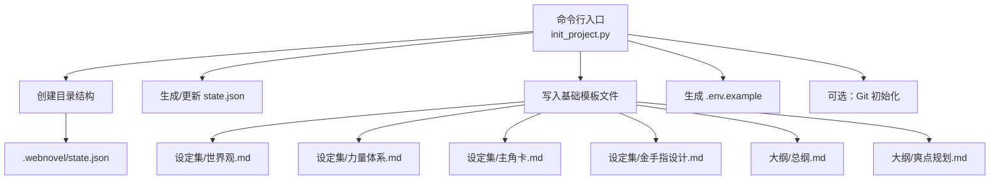
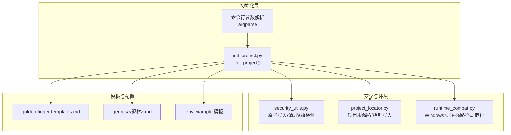
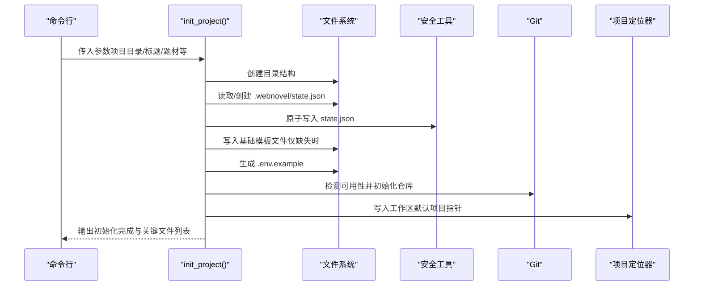
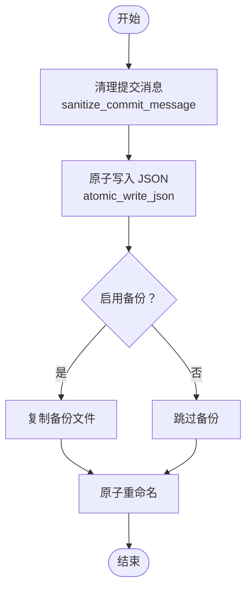
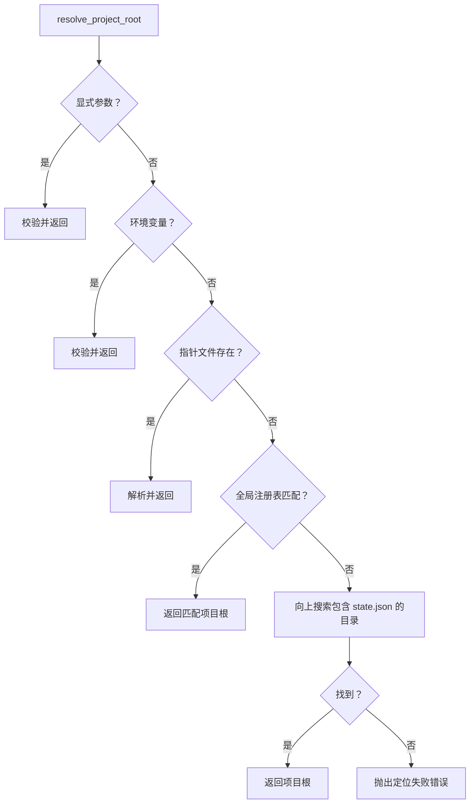
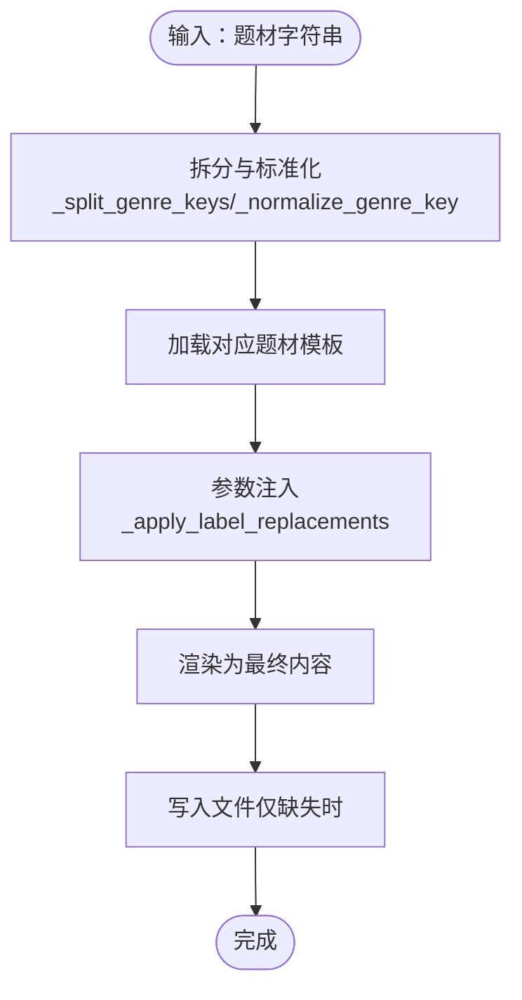
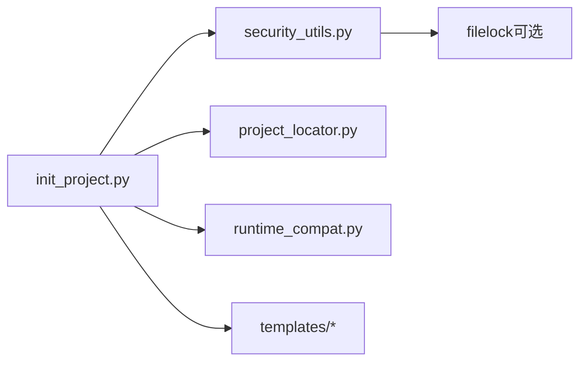

# 初始化技能 (webnovel-init)

<cite>
**本文引用的文件**
- [init_project.py](file://webnovel-writer/scripts/init_project.py)
- [security_utils.py](file://webnovel-writer/scripts/security_utils.py)
- [project_locator.py](file://webnovel-writer/scripts/project_locator.py)
- [runtime_compat.py](file://webnovel-writer/scripts/runtime_compat.py)
- [golden-finger-templates.md](file://webnovel-writer/templates/golden-finger-templates.md)
- [修仙.md](file://webnovel-writer/templates/genres/修仙.md)
- [规则怪谈.md](file://webnovel-writer/templates/genres/规则怪谈.md)
- [system-data-flow.md](file://webnovel-writer/skills/webnovel-init/references/system-data-flow.md)
</cite>

## 目录
1. [简介](#简介)
2. [项目结构](#项目结构)
3. [核心组件](#核心组件)
4. [架构总览](#架构总览)
5. [详细组件分析](#详细组件分析)
6. [依赖分析](#依赖分析)
7. [性能考量](#性能考量)
8. [故障排查指南](#故障排查指南)
9. [结论](#结论)
10. [附录](#附录)

## 简介
本文件面向“webnovel-init 初始化技能”，系统性阐述该项目初始化与环境配置的完整技术方案。内容涵盖：
- 项目结构创建、配置文件生成与初始数据准备的实现流程
- 初始化参数校验、环境检查与依赖项安装的自动化机制
- 不同题材类型的初始化模板与配置选项
- 初始化过程的错误处理、回滚机制与状态恢复策略
- 初始化技能与文件系统的交互方式与权限管理
- 最佳实践、常见问题排查与故障恢复指南

## 项目结构
webnovel-init 是一个独立的初始化脚本，负责生成可运行的网文项目骨架，包括目录结构、核心配置文件与基础模板。其核心产物包括：
- 目录结构：正文、大纲、设定集、审查报告与 .webnovel 子目录
- 核心配置：.webnovel/state.json（运行时真相）
- 基础模板：设定集、大纲等骨架文件
- 环境准备：.env.example 与 Git 初始化（可选）

图表来源
- [init_project.py:227-755](file://webnovel-writer/scripts/init_project.py#L227-L755)

章节来源
- [init_project.py:1-14](file://webnovel-writer/scripts/init_project.py#L1-L14)
- [init_project.py:227-755](file://webnovel-writer/scripts/init_project.py#L227-L755)

## 核心组件
- 初始化主流程：负责解析参数、创建目录、生成/更新 state.json、写入模板与环境文件、可选 Git 初始化
- 安全工具库：提供输入清理、原子写入、Git 可用性检测与文件权限管理
- 项目定位器：提供工作区与项目根目录解析、指针写入与全局注册表更新
- 模板系统：内置题材模板与金手指模板，支持按题材组合与参数注入
- 运行时兼容：处理 Windows UTF-8 标准输入输出与路径规范化

章节来源
- [init_project.py:227-755](file://webnovel-writer/scripts/init_project.py#L227-L755)
- [security_utils.py:83-134](file://webnovel-writer/scripts/security_utils.py#L83-L134)
- [security_utils.py:345-444](file://webnovel-writer/scripts/security_utils.py#L345-L444)
- [project_locator.py:294-330](file://webnovel-writer/scripts/project_locator.py#L294-L330)
- [runtime_compat.py:16-79](file://webnovel-writer/scripts/runtime_compat.py#L16-L79)

## 架构总览
webnovel-init 的整体架构围绕“安全、幂等、可扩展”的原则设计：
- 安全：输入清理、原子写入、权限控制、Git 可用性检测
- 幂等：仅在文件缺失时写入，避免覆盖已有内容
- 可扩展：模板系统支持多题材组合与参数注入

图表来源
- [init_project.py:227-845](file://webnovel-writer/scripts/init_project.py#L227-L845)
- [security_utils.py:234-333](file://webnovel-writer/scripts/security_utils.py#L234-L333)
- [project_locator.py:333-407](file://webnovel-writer/scripts/project_locator.py#L333-L407)
- [runtime_compat.py:16-79](file://webnovel-writer/scripts/runtime_compat.py#L16-L79)

## 详细组件分析

### 初始化主流程（init_project）
- 参数解析：支持项目目录、标题、题材、目标字数/章节数、金手指与角色配置等
- 目录创建：确保正文、大纲、设定集、审查报告与 .webnovel 子目录存在
- state.json 管理：读取现有文件或创建新文件，补齐 schema 字段，使用原子写入
- 模板生成：按题材组合加载模板，注入参数，生成设定集与大纲骨架
- 环境准备：生成 .env.example（不包含真实密钥）
- Git 初始化：检测 Git 可用性，初始化仓库、写入 .gitignore、首次提交
- 工作区指针：尝试写入当前项目指针并更新全局注册表

图表来源
- [init_project.py:227-755](file://webnovel-writer/scripts/init_project.py#L227-L755)
- [security_utils.py:345-444](file://webnovel-writer/scripts/security_utils.py#L345-L444)
- [project_locator.py:294-330](file://webnovel-writer/scripts/project_locator.py#L294-L330)

章节来源
- [init_project.py:227-755](file://webnovel-writer/scripts/init_project.py#L227-L755)

### 安全与权限管理
- 输入清理：提交消息清理（防止命令注入）、文件名清理（防止路径遍历）
- 原子写入：先写临时文件，再原子重命名，支持可选备份与文件锁
- Git 可用性：检测 Git 是否可用，失败时优雅降级
- 权限控制：在类 Unix 系统上为敏感目录与文件设置仅所有者可读写

图表来源
- [security_utils.py:83-134](file://webnovel-writer/scripts/security_utils.py#L83-L134)
- [security_utils.py:345-444](file://webnovel-writer/scripts/security_utils.py#L345-L444)

章节来源
- [security_utils.py:83-134](file://webnovel-writer/scripts/security_utils.py#L83-L134)
- [security_utils.py:345-444](file://webnovel-writer/scripts/security_utils.py#L345-L444)

### 项目定位与工作区指针
- 解析顺序：显式参数 > 环境变量 > 指针文件 > 全局注册表 > 目录搜索
- 指针写入：在工作区 .claude 目录写入当前项目根，便于后续脚本定位
- 全局注册表：记录工作区到项目根的映射，支持“空上下文”定位

图表来源
- [project_locator.py:333-407](file://webnovel-writer/scripts/project_locator.py#L333-L407)
- [project_locator.py:294-330](file://webnovel-writer/scripts/project_locator.py#L294-L330)

章节来源
- [project_locator.py:333-407](file://webnovel-writer/scripts/project_locator.py#L333-L407)
- [project_locator.py:294-330](file://webnovel-writer/scripts/project_locator.py#L294-L330)

### 模板系统与题材组合
- 题材解析：支持“+”“/”“、”“与”等分隔符，标准化别名，拆分为多个题材键
- 模板注入：按题材加载模板，支持参数替换（如世界规模、势力、资源分配等）
- 金手指模板：提供系统化设计框架与类型速查，支持按题材匹配推荐

图表来源
- [init_project.py:52-120](file://webnovel-writer/scripts/init_project.py#L52-L120)
- [golden-finger-templates.md:1-474](file://webnovel-writer/templates/golden-finger-templates.md#L1-L474)
- [修仙.md:1-108](file://webnovel-writer/templates/genres/修仙.md#L1-L108)
- [规则怪谈.md:1-306](file://webnovel-writer/templates/genres/规则怪谈.md#L1-L306)

章节来源
- [init_project.py:52-120](file://webnovel-writer/scripts/init_project.py#L52-L120)
- [golden-finger-templates.md:1-474](file://webnovel-writer/templates/golden-finger-templates.md#L1-L474)
- [修仙.md:1-108](file://webnovel-writer/templates/genres/修仙.md#L1-L108)
- [规则怪谈.md:1-306](file://webnovel-writer/templates/genres/规则怪谈.md#L1-L306)

### Git 初始化与环境准备
- Git 检测：可用时初始化仓库、添加文件、提交（使用清理后的提交消息）
- .gitignore：排除 Python/IDE/临时文件，保留 .webnovel 以跟踪状态
- .env.example：生成示例配置文件，提示不要提交真实密钥

章节来源
- [init_project.py:683-737](file://webnovel-writer/scripts/init_project.py#L683-L737)
- [init_project.py:660-681](file://webnovel-writer/scripts/init_project.py#L660-L681)

## 依赖分析
- 内部依赖
  - init_project.py 依赖 security_utils（原子写入、Git 检测、清理）、project_locator（工作区指针）、runtime_compat（Windows UTF-8）
  - 模板系统依赖 templates 目录下的 Markdown 文件
- 外部依赖
  - Git（可选，用于版本控制）
  - filelock（可选，用于原子写入锁）

图表来源
- [init_project.py:25-31](file://webnovel-writer/scripts/init_project.py#L25-L31)
- [security_utils.py:21-27](file://webnovel-writer/scripts/security_utils.py#L21-L27)

章节来源
- [init_project.py:25-31](file://webnovel-writer/scripts/init_project.py#L25-L31)
- [security_utils.py:21-27](file://webnovel-writer/scripts/security_utils.py#L21-L27)

## 性能考量
- 幂等写入：仅在文件缺失时写入，避免重复 IO
- 原子写入：减少并发写入冲突与数据损坏风险
- Git 操作：在失败时优雅降级，不影响初始化主流程
- 模板加载：按需读取，避免一次性加载过多文件

## 故障排查指南
- 无法定位项目根
  - 确认当前目录或父目录是否存在 .webnovel/state.json
  - 设置环境变量 WEBNOVEL_PROJECT_ROOT 或使用 --project-root
  - 检查工作区指针文件与全局注册表
- Git 初始化失败
  - 确认 Git 已安装并可用
  - 查看错误输出，确认权限与网络配置
- state.json 写入失败
  - 检查磁盘空间与文件权限
  - 使用备份恢复：restore_from_backup
- 提交消息包含非法字符
  - 使用 sanitize_commit_message 清理后再提交

章节来源
- [project_locator.py:333-407](file://webnovel-writer/scripts/project_locator.py#L333-L407)
- [security_utils.py:234-333](file://webnovel-writer/scripts/security_utils.py#L234-L333)
- [security_utils.py:478-507](file://webnovel-writer/scripts/security_utils.py#L478-L507)

## 结论
webnovel-init 初始化技能通过安全、幂等与可扩展的设计，实现了从零到一的网文项目搭建。其核心价值在于：
- 以模板骨架驱动创作，降低上手门槛
- 严格的输入清理与原子写入保障数据安全
- 可选的 Git 初始化与工作区指针提升协作效率
- 丰富的题材模板与金手指设计框架，满足多样化创作需求

## 附录

### 初始化参数与模板字段对照
- 基础参数：项目目录、标题、题材、目标字数、目标章节数
- 金手指参数：名称、类型、风格、可见度、不可逆代价
- 世界参数：世界规模、势力、社会阶层、资源分配、货币体系、兑换规则
- 力量体系参数：体系类型、典型境界链、小境界划分
- 角色参数：主角姓名、女主配置、多主角姓名与定位、反派分层
- 平台与读者：目标读者、发布平台

章节来源
- [init_project.py:757-840](file://webnovel-writer/scripts/init_project.py#L757-L840)

### 初始化模板与配置选项
- 题材模板：按题材加载，支持参数注入
- 金手指模板：提供设计原则、代价/反制库、类型速查与工作流
- 设定集模板：世界观、力量体系、主角卡、女主卡、反派设计、金手指设计、复合题材融合逻辑
- 大纲模板：总纲骨架与爽点规划

章节来源
- [golden-finger-templates.md:1-474](file://webnovel-writer/templates/golden-finger-templates.md#L1-L474)
- [修仙.md:1-108](file://webnovel-writer/templates/genres/修仙.md#L1-L108)
- [规则怪谈.md:1-306](file://webnovel-writer/templates/genres/规则怪谈.md#L1-L306)
- [init_project.py:356-681](file://webnovel-writer/scripts/init_project.py#L356-L681)

### 系统数据流与状态文件
- state.json 精简设计：仅保留关键运行时字段，避免冗余
- SQLite 索引迁移：实体、别名、关系迁移至 index.db
- 目录结构：正文、大纲、设定集、.webnovel/state.json、workflow_state.json、index.db、archive/

章节来源
- [system-data-flow.md:24-42](file://webnovel-writer/skills/webnovel-init/references/system-data-flow.md#L24-L42)