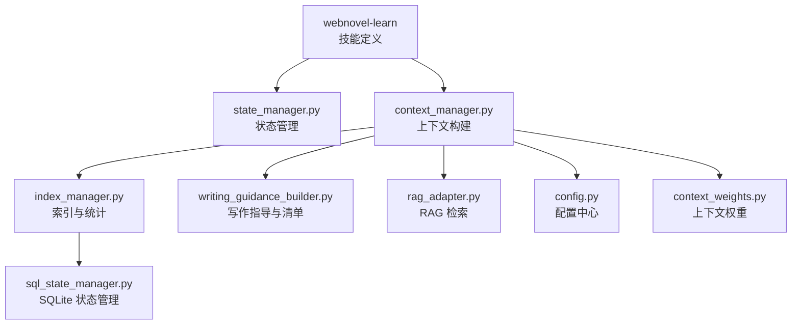
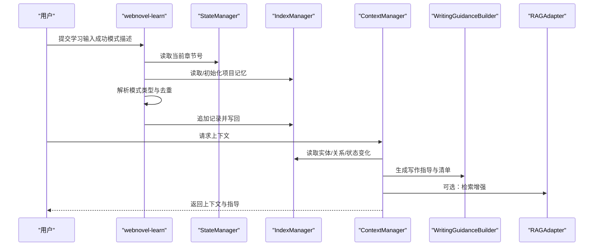
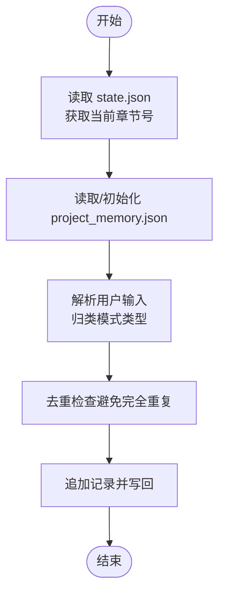
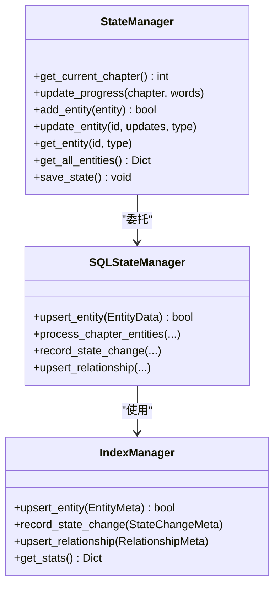
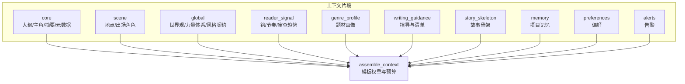
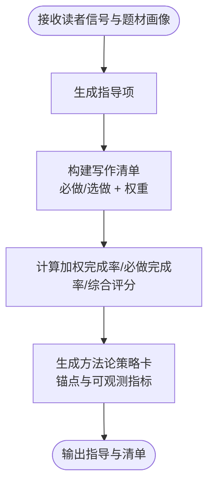
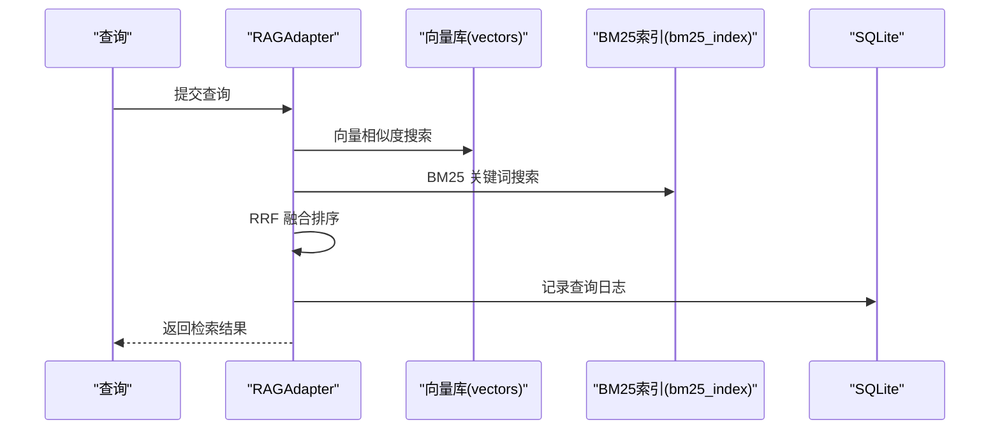
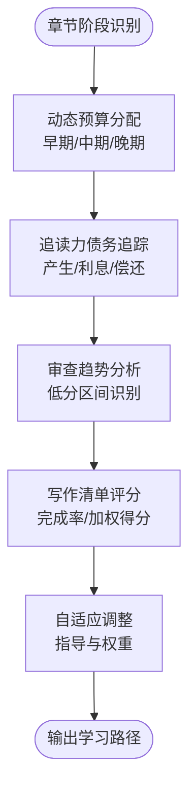
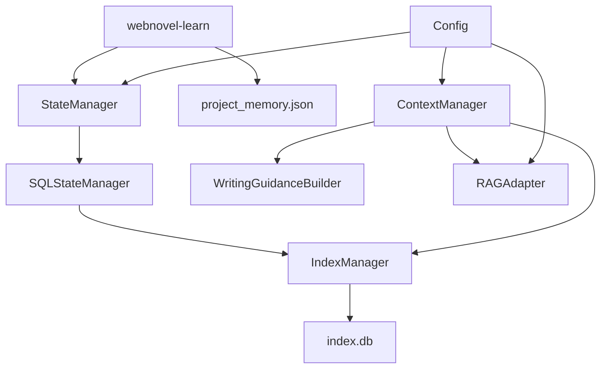

# 学习技能 (webnovel-learn)

<cite>
**本文引用的文件**
- [SKILL.md](file://webnovel-writer/skills/webnovel-learn/SKILL.md)
- [state_manager.py](file://webnovel-writer/scripts/data_modules/state_manager.py)
- [context_manager.py](file://webnovel-writer/scripts/data_modules/context_manager.py)
- [index_manager.py](file://webnovel-writer/scripts/data_modules/index_manager.py)
- [sql_state_manager.py](file://webnovel-writer/scripts/data_modules/sql_state_manager.py)
- [config.py](file://webnovel-writer/scripts/data_modules/config.py)
- [rag_adapter.py](file://webnovel-writer/scripts/data_modules/rag_adapter.py)
- [writing_guidance_builder.py](file://webnovel-writer/scripts/data_modules/writing_guidance_builder.py)
- [context_weights.py](file://webnovel-writer/scripts/data_modules/context_weights.py)
</cite>

## 目录
1. [简介](#简介)
2. [项目结构](#项目结构)
3. [核心组件](#核心组件)
4. [架构总览](#架构总览)
5. [详细组件分析](#详细组件分析)
6. [依赖关系分析](#依赖关系分析)
7. [性能考量](#性能考量)
8. [故障排查指南](#故障排查指南)
9. [结论](#结论)
10. [附录](#附录)

## 简介
本文件面向“webnovel-learn”学习技能，系统化阐述其在创作知识学习与经验积累方面的机制设计与实现细节。重点包括：
- 学习材料的组织与沉淀（模式抽取与项目记忆）
- 知识图谱与上下文构建（实体、关系、追读力债务）
- 智能推荐与写作指导（钩子、节奏、爽点模式）
- 学习路径规划、进度跟踪与效果评估
- 个性化推荐与自适应调整策略
- 学习技能与写作技能的协同与知识迁移
- 学习数据的采集、分析与反馈循环

## 项目结构
webnovel-learn 位于 skills/webnovel-learn 目录，核心职责是从当前会话中提取可复用的写作模式并写入项目记忆文件，形成“可迁移的成功模式库”。其与数据模块协同，通过状态管理、索引管理、上下文构建与检索增强生成（RAG）等能力，支撑学习与写作的闭环。

图表来源
- [SKILL.md:1-46](file://webnovel-writer/skills/webnovel-learn/SKILL.md#L1-L46)
- [state_manager.py:90-140](file://webnovel-writer/scripts/data_modules/state_manager.py#L90-L140)
- [context_manager.py:50-131](file://webnovel-writer/scripts/data_modules/context_manager.py#L50-L131)
- [index_manager.py:228-234](file://webnovel-writer/scripts/data_modules/index_manager.py#L228-L234)
- [sql_state_manager.py:46-92](file://webnovel-writer/scripts/data_modules/sql_state_manager.py#L46-L92)
- [writing_guidance_builder.py:81-167](file://webnovel-writer/scripts/data_modules/writing_guidance_builder.py#L81-L167)
- [rag_adapter.py:68-79](file://webnovel-writer/scripts/data_modules/rag_adapter.py#L68-L79)
- [config.py:90-120](file://webnovel-writer/scripts/data_modules/config.py#L90-L120)
- [context_weights.py:10-38](file://webnovel-writer/scripts/data_modules/context_weights.py#L10-L38)

章节来源
- [SKILL.md:1-46](file://webnovel-writer/skills/webnovel-learn/SKILL.md#L1-L46)

## 核心组件
- 技能入口与执行流程：从当前会话提取成功模式，解析模式类型，追加到项目记忆文件，不删除旧记录并进行去重。
- 状态管理：提供章节进度、实体、关系、状态变化等数据的读写与原子化持久化，支持 SQLite 同步。
- 上下文构建：组装核心、场景、全局、读者信号、题材画像、写作指导与故事骨架等上下文片段，支持模板权重与动态预算。
- 索引与统计：集中管理 SQLite 数据库，提供实体、关系、状态变化、追读力债务、无效事实、工具调用统计、写作清单评分等表。
- 写作指导与清单：根据读者信号与题材画像生成指导项与可执行的写作清单，计算加权完成度与综合评分。
- RAG 检索：向量检索、BM25 关键词检索、混合检索与重排序，支持图谱扩展与查询日志。
- 配置中心：统一管理 API、并发、超时、重试、检索参数、上下文权重与动态预算等。

章节来源
- [SKILL.md:15-46](file://webnovel-writer/skills/webnovel-learn/SKILL.md#L15-L46)
- [state_manager.py:90-140](file://webnovel-writer/scripts/data_modules/state_manager.py#L90-L140)
- [context_manager.py:99-131](file://webnovel-writer/scripts/data_modules/context_manager.py#L99-L131)
- [index_manager.py:228-234](file://webnovel-writer/scripts/data_modules/index_manager.py#L228-L234)
- [writing_guidance_builder.py:206-275](file://webnovel-writer/scripts/data_modules/writing_guidance_builder.py#L206-L275)
- [rag_adapter.py:68-79](file://webnovel-writer/scripts/data_modules/rag_adapter.py#L68-L79)
- [config.py:90-120](file://webnovel-writer/scripts/data_modules/config.py#L90-L120)

## 架构总览
webnovel-learn 的学习机制围绕“模式提取—知识沉淀—上下文构建—智能推荐—效果评估—反馈优化”闭环展开。系统通过状态与索引管理确保数据一致性与可扩展性，借助上下文构建与写作指导实现个性化与自适应，利用 RAG 提升检索质量与知识迁移效率。

图表来源
- [SKILL.md:37-46](file://webnovel-writer/skills/webnovel-learn/SKILL.md#L37-L46)
- [state_manager.py:597-617](file://webnovel-writer/scripts/data_modules/state_manager.py#L597-L617)
- [context_manager.py:189-248](file://webnovel-writer/scripts/data_modules/context_manager.py#L189-L248)
- [writing_guidance_builder.py:206-275](file://webnovel-writer/scripts/data_modules/writing_guidance_builder.py#L206-L275)
- [rag_adapter.py:560-650](file://webnovel-writer/scripts/data_modules/rag_adapter.py#L560-L650)

## 详细组件分析

### 组件一：学习材料组织与项目记忆（webnovel-learn）
- 目标：从当前会话提取可复用的写作模式（钩子/节奏/对话/微兑现/情感等），追加到项目记忆文件。
- 流程：读取状态中的当前章节号；读取/初始化项目记忆；解析输入并归类模式类型；去重后追加写回。
- 约束：不删除旧记录，避免完全重复的描述。

图表来源
- [SKILL.md:37-46](file://webnovel-writer/skills/webnovel-learn/SKILL.md#L37-L46)

章节来源
- [SKILL.md:15-46](file://webnovel-writer/skills/webnovel-learn/SKILL.md#L15-L46)

### 组件二：状态管理与进度跟踪（StateManager）
- 职责：管理 state.json 的读写，确保并发安全（文件锁 + 原子写入），合并增量变更，支持 SQLite 同步。
- 进度管理：提供当前章节号与字数累计，采用 max(chapter) 与累加 words_delta 的策略。
- 实体与关系：提供实体增删改查、别名注册、状态变化记录与关系维护接口。
- SQLite 同步：将大数据字段迁移至 index.db，保持 state.json 轻量化。

图表来源
- [state_manager.py:90-140](file://webnovel-writer/scripts/data_modules/state_manager.py#L90-L140)
- [sql_state_manager.py:46-92](file://webnovel-writer/scripts/data_modules/sql_state_manager.py#L46-L92)
- [index_manager.py:228-234](file://webnovel-writer/scripts/data_modules/index_manager.py#L228-L234)

章节来源
- [state_manager.py:595-617](file://webnovel-writer/scripts/data_modules/state_manager.py#L595-L617)
- [sql_state_manager.py:267-417](file://webnovel-writer/scripts/data_modules/sql_state_manager.py#L267-L417)
- [index_manager.py:228-234](file://webnovel-writer/scripts/data_modules/index_manager.py#L228-L234)

### 组件三：上下文构建与知识图谱（ContextManager + IndexManager）
- 上下文构建：组装 core（大纲、主角快照、近期摘要/元数据）、scene（地点、出场角色）、global（世界观/力量体系/风格契约）、reader_signal（追读力信号）、genre_profile（题材画像）、writing_guidance（写作指导）、story_skeleton（故事骨架）、memory（项目记忆）、preferences（偏好）、alerts（告警）等。
- 知识图谱：通过实体、关系、状态变化、关系事件等表构建时序图谱，支持关系图谱查询与时间线回放。
- 动态预算与模板权重：根据章节阶段（早期/中期/晚期）调整各部分权重，支持模板级动态权重。

图表来源
- [context_manager.py:99-165](file://webnovel-writer/scripts/data_modules/context_manager.py#L99-L165)
- [context_manager.py:189-248](file://webnovel-writer/scripts/data_modules/context_manager.py#L189-L248)
- [context_weights.py:10-38](file://webnovel-writer/scripts/data_modules/context_weights.py#L10-L38)

章节来源
- [context_manager.py:99-165](file://webnovel-writer/scripts/data_modules/context_manager.py#L99-L165)
- [context_manager.py:290-421](file://webnovel-writer/scripts/data_modules/context_manager.py#L290-L421)
- [context_weights.py:10-38](file://webnovel-writer/scripts/data_modules/context_weights.py#L10-L38)

### 组件四：智能推荐与写作指导（WritingGuidanceBuilder）
- 写作指导：基于读者信号（低分区间、钩子类型使用、节奏模式使用、审查趋势）与题材画像生成指导项，包含题材锚定、复合题材协同、网文节奏基线与兑现密度基线等。
- 写作清单：将指导项转化为可执行的清单项，支持必做/选做、权重与验证提示，计算加权完成率、必做完成率与综合评分。
- 方法论策略卡：针对不同题材提供压力源与释放目标锚点，结合章节阶段与可观测指标（next_reason 清晰度、锚点有效性、节奏自然度）生成策略建议。

图表来源
- [writing_guidance_builder.py:206-275](file://webnovel-writer/scripts/data_modules/writing_guidance_builder.py#L206-L275)
- [writing_guidance_builder.py:278-449](file://webnovel-writer/scripts/data_modules/writing_guidance_builder.py#L278-L449)
- [writing_guidance_builder.py:81-167](file://webnovel-writer/scripts/data_modules/writing_guidance_builder.py#L81-L167)

章节来源
- [writing_guidance_builder.py:206-275](file://webnovel-writer/scripts/data_modules/writing_guidance_builder.py#L206-L275)
- [writing_guidance_builder.py:278-449](file://webnovel-writer/scripts/data_modules/writing_guidance_builder.py#L278-L449)
- [writing_guidance_builder.py:81-167](file://webnovel-writer/scripts/data_modules/writing_guidance_builder.py#L81-L167)

### 组件五：检索增强与知识迁移（RAGAdapter）
- 向量检索：调用嵌入 API 获取向量，计算余弦相似度，支持按章节/类型过滤。
- BM25 检索：分词、TF-IDF 计算与 BM25 公式，支持按章节/类型过滤。
- 混合检索：支持向量与 BM25 的 RRF 融合，提升召回质量。
- 图谱扩展：从查询中提取实体别名与 ID，扩展候选集合，提升相关性。
- 查询日志：记录查询类型、命中来源、耗时与章节，便于可观测性与优化。

图表来源
- [rag_adapter.py:560-650](file://webnovel-writer/scripts/data_modules/rag_adapter.py#L560-L650)
- [rag_adapter.py:663-777](file://webnovel-writer/scripts/data_modules/rag_adapter.py#L663-L777)
- [rag_adapter.py:497-517](file://webnovel-writer/scripts/data_modules/rag_adapter.py#L497-L517)

章节来源
- [rag_adapter.py:560-650](file://webnovel-writer/scripts/data_modules/rag_adapter.py#L560-L650)
- [rag_adapter.py:663-777](file://webnovel-writer/scripts/data_modules/rag_adapter.py#L663-L777)
- [rag_adapter.py:497-517](file://webnovel-writer/scripts/data_modules/rag_adapter.py#L497-L517)

### 组件六：学习路径规划与进度跟踪
- 章节阶段识别：根据章节范围划分早期/中期/晚期，动态调整上下文预算与权重。
- 追读力债务：记录债务类型、金额、利息、到期章节与状态，支持事件日志与偿还计划。
- 审查趋势：聚合近期审查指标，识别低分区间，驱动修复型指导。
- 写作清单评分：记录清单完成情况与加权得分，支持趋势分析与自适应调整。

图表来源
- [context_manager.py:517-524](file://webnovel-writer/scripts/data_modules/context_manager.py#L517-L524)
- [index_manager.py:415-510](file://webnovel-writer/scripts/data_modules/index_manager.py#L415-L510)
- [index_manager.py:535-553](file://webnovel-writer/scripts/data_modules/index_manager.py#L535-L553)
- [writing_guidance_builder.py:423-484](file://webnovel-writer/scripts/data_modules/writing_guidance_builder.py#L423-L484)

章节来源
- [context_manager.py:517-524](file://webnovel-writer/scripts/data_modules/context_manager.py#L517-L524)
- [index_manager.py:415-510](file://webnovel-writer/scripts/data_modules/index_manager.py#L415-L510)
- [index_manager.py:535-553](file://webnovel-writer/scripts/data_modules/index_manager.py#L535-L553)
- [writing_guidance_builder.py:423-484](file://webnovel-writer/scripts/data_modules/writing_guidance_builder.py#L423-L484)

## 依赖关系分析
- webnovel-learn 依赖状态管理与项目记忆文件，确保学习记录的持久化与去重。
- 上下文构建依赖索引管理提供的实体、关系、状态变化与追读力数据。
- 写作指导与清单依赖读者信号与题材画像，由上下文构建模块提供。
- RAG 检索依赖向量数据库与 BM25 索引，支持知识迁移与模式复用。
- 配置中心贯穿各模块，统一 API、并发、超时、重试与检索参数。

图表来源
- [SKILL.md:37-46](file://webnovel-writer/skills/webnovel-learn/SKILL.md#L37-L46)
- [state_manager.py:90-140](file://webnovel-writer/scripts/data_modules/state_manager.py#L90-L140)
- [context_manager.py:50-131](file://webnovel-writer/scripts/data_modules/context_manager.py#L50-L131)
- [sql_state_manager.py:46-92](file://webnovel-writer/scripts/data_modules/sql_state_manager.py#L46-L92)
- [index_manager.py:228-234](file://webnovel-writer/scripts/data_modules/index_manager.py#L228-L234)
- [writing_guidance_builder.py:206-275](file://webnovel-writer/scripts/data_modules/writing_guidance_builder.py#L206-L275)
- [rag_adapter.py:68-79](file://webnovel-writer/scripts/data_modules/rag_adapter.py#L68-L79)
- [config.py:90-120](file://webnovel-writer/scripts/data_modules/config.py#L90-L120)

章节来源
- [state_manager.py:90-140](file://webnovel-writer/scripts/data_modules/state_manager.py#L90-L140)
- [context_manager.py:50-131](file://webnovel-writer/scripts/data_modules/context_manager.py#L50-L131)
- [sql_state_manager.py:46-92](file://webnovel-writer/scripts/data_modules/sql_state_manager.py#L46-L92)
- [index_manager.py:228-234](file://webnovel-writer/scripts/data_modules/index_manager.py#L228-L234)
- [writing_guidance_builder.py:206-275](file://webnovel-writer/scripts/data_modules/writing_guidance_builder.py#L206-L275)
- [rag_adapter.py:68-79](file://webnovel-writer/scripts/data_modules/rag_adapter.py#L68-L79)
- [config.py:90-120](file://webnovel-writer/scripts/data_modules/config.py#L90-L120)

## 性能考量
- 并发与锁：状态写入采用文件锁与原子写入，避免多 Agent 并发覆盖；SQLite 同步失败时保留 pending 以便重试。
- 数据库索引：为实体、关系、状态变化、章节与场景建立索引，提升查询性能。
- 检索优化：向量检索与 BM25 检索分别建立索引；混合检索采用 RRF 融合；支持预过滤与最近候选限制。
- 动态预算：根据章节阶段调整上下文预算，平衡性能与信息密度。
- 批量写入：章节实体批量处理，减少事务开销。

## 故障排查指南
- 状态写入失败：检查 state.json 锁文件是否存在与权限；确认磁盘空间与写入权限。
- SQLite 同步异常：查看同步失败日志，确认 pending 快照是否被正确恢复；检查 index.db 结构与索引完整性。
- RAG 检索异常：检查嵌入 API 配置与鉴权；查看 vectors.db 与 bm25_index 表结构；确认查询日志与耗时。
- 写作清单评分异常：检查 writing_checklist_scores 表数据；核对近期审查趋势与低分区间统计。
- 项目记忆文件异常：确认 project_memory.json 格式与去重逻辑；检查模式类型解析与追加写回。

章节来源
- [state_manager.py:368-370](file://webnovel-writer/scripts/data_modules/state_manager.py#L368-L370)
- [state_manager.py:556-560](file://webnovel-writer/scripts/data_modules/state_manager.py#L556-L560)
- [rag_adapter.py:497-517](file://webnovel-writer/scripts/data_modules/rag_adapter.py#L497-L517)
- [index_manager.py:595-619](file://webnovel-writer/scripts/data_modules/index_manager.py#L595-L619)

## 结论
webnovel-learn 通过“模式提取—知识沉淀—上下文构建—智能推荐—效果评估—反馈优化”的闭环，实现了创作知识的学习与迁移。依托状态与索引管理、写作指导与清单、RAG 检索与动态预算，系统在保证数据一致性与性能的同时，提供了个性化的学习路径与自适应调整能力，有效支撑写作技能的持续提升。

## 附录
- 学习资源管理：通过项目记忆文件与实体/关系/状态变化表，实现学习资源的结构化存储与检索。
- 个性化推荐：基于题材画像与读者信号生成指导项与清单，支持权重与验证提示。
- 适应性调整：依据章节阶段与审查趋势动态调整上下文预算与写作策略，实现自适应优化。
- 知识迁移：通过 RAG 检索与知识图谱，将成功模式迁移到新的创作情境中，提升写作效率与质量。