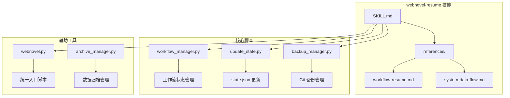
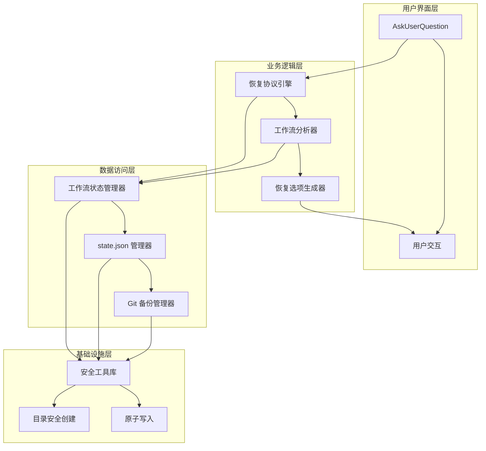
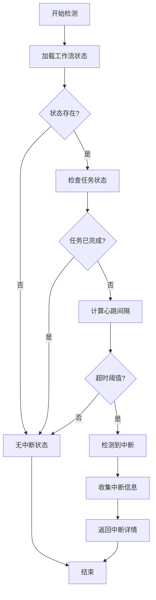
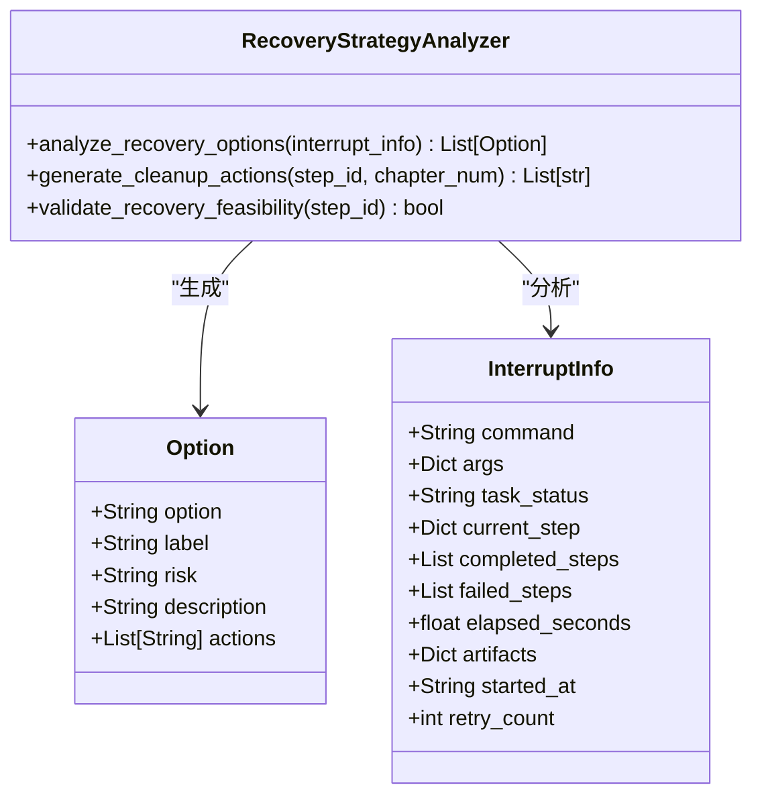
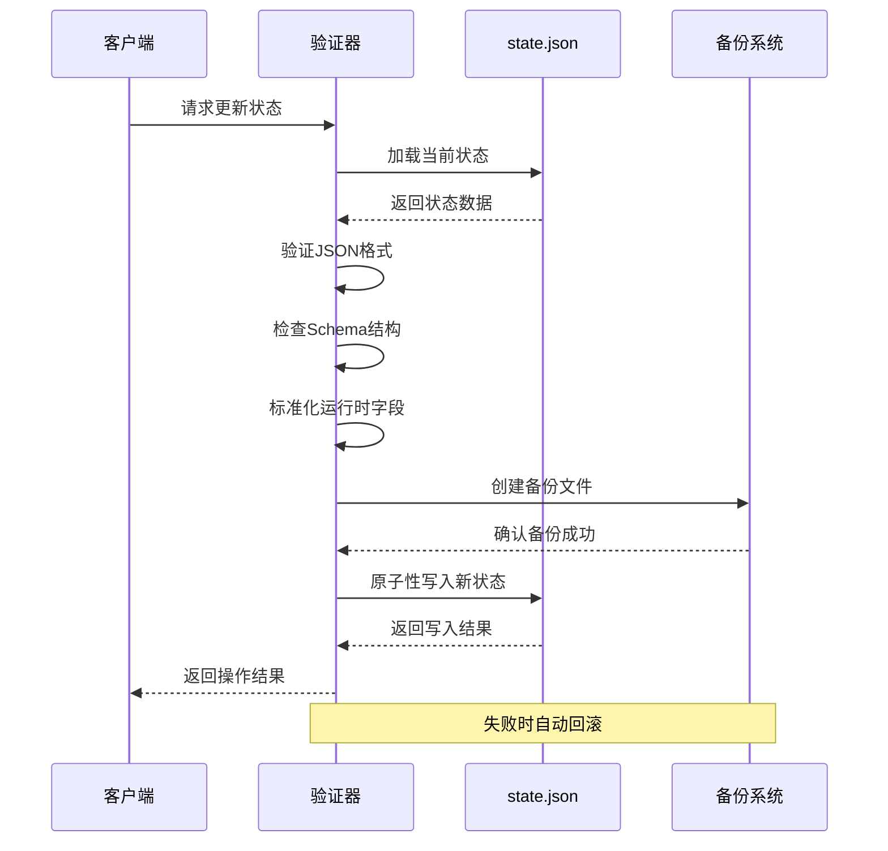
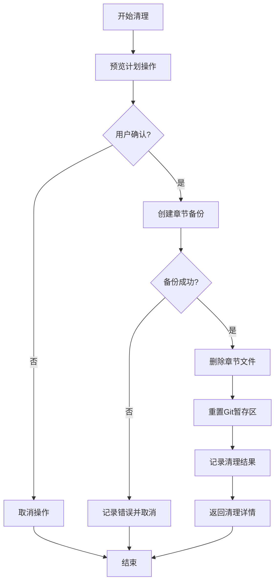
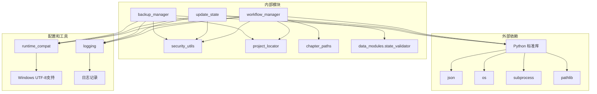
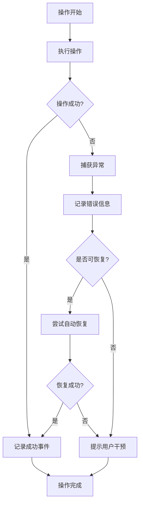

# 恢复技能 (webnovel-resume) 技术文档

<cite>
**本文档引用的文件**
- [SKILL.md](file://webnovel-writer/skills/webnovel-resume/SKILL.md)
- [system-data-flow.md](file://webnovel-writer/skills/webnovel-resume/references/system-data-flow.md)
- [workflow_manager.py](file://webnovel-writer/scripts/workflow_manager.py)
- [update_state.py](file://webnovel-writer/scripts/update_state.py)
- [webnovel.py](file://webnovel-writer/scripts/webnovel.py)
- [backup_manager.py](file://webnovel-writer/scripts/backup_manager.py)
- [archive_manager.py](file://webnovel-writer/scripts/archive_manager.py)
- [test_workflow_manager.py](file://webnovel-writer/scripts/data_modules/tests/test_workflow_manager.py)
</cite>

## 目录
1. [简介](#简介)
2. [项目结构](#项目结构)
3. [核心组件](#核心组件)
4. [架构概览](#架构概览)
5. [详细组件分析](#详细组件分析)
6. [依赖关系分析](#依赖关系分析)
7. [性能考虑](#性能考虑)
8. [故障排除指南](#故障排除指南)
9. [结论](#结论)

## 简介

webnovel-resume 是一个专门设计用于处理中断任务恢复的技能模块。该项目的核心目标是在任务执行过程中出现意外中断时，能够准确检测中断状态并提供安全可靠的恢复选项。

该技能遵循严格的安全原则：禁止智能续写、必须检测后恢复、必须用户确认。通过精确的工作流状态跟踪和断点检测机制，确保在各种中断场景下都能提供合适的恢复策略。

## 项目结构

webnovel-resume 技能位于项目根目录下的 skills/webnovel-resume 目录中，采用模块化设计：

**图表来源**
- [SKILL.md:1-203](file://webnovel-writer/skills/webnovel-resume/SKILL.md#L1-L203)
- [workflow_manager.py:1-823](file://webnovel-writer/scripts/workflow_manager.py#L1-L823)

**章节来源**
- [SKILL.md:1-203](file://webnovel-writer/skills/webnovel-resume/SKILL.md#L1-L203)

## 核心组件

### 恢复协议引擎

恢复协议引擎是整个恢复技能的核心，负责：
- 加载和解析恢复协议
- 确认上下文充足性
- 检测中断状态
- 分析恢复选项
- 执行恢复操作

### 工作流状态管理器

工作流状态管理器提供完整的任务生命周期管理：
- 任务启动和状态跟踪
- 步骤级别的进度监控
- 断点检测和恢复分析
- 原子性状态持久化

### 数据完整性验证器

数据完整性验证器确保状态文件的一致性和可靠性：
- JSON 格式验证
- Schema 结构检查
- 原子性写入操作
- 自动备份和回滚机制

**章节来源**
- [SKILL.md:33-111](file://webnovel-writer/skills/webnovel-resume/SKILL.md#L33-L111)
- [workflow_manager.py:365-402](file://webnovel-writer/scripts/workflow_manager.py#L365-L402)

## 架构概览

webnovel-resume 采用分层架构设计，确保各组件职责清晰且相互独立：

**图表来源**
- [workflow_manager.py:1-823](file://webnovel-writer/scripts/workflow_manager.py#L1-L823)
- [update_state.py:1-634](file://webnovel-writer/scripts/update_state.py#L1-L634)

## 详细组件分析

### 中断检测机制

中断检测是恢复技能的关键功能，通过以下机制实现：

**图表来源**
- [workflow_manager.py:365-402](file://webnovel-writer/scripts/workflow_manager.py#L365-L402)

中断检测的核心逻辑包括：
- 任务状态验证：检查当前任务是否仍在运行
- 心跳机制：通过 last_heartbeat 时间戳判断任务活跃度
- 超时阈值：超过设定时间的未响应被视为中断
- 状态完整性：确保返回的信息包含所有必要字段

### 恢复策略分析器

恢复策略分析器根据中断位置提供不同的恢复选项：

**图表来源**
- [workflow_manager.py:404-564](file://webnovel-writer/scripts/workflow_manager.py#L404-L564)

不同步骤的恢复策略：

| 步骤 | 恢复策略 | 风险等级 | 描述 |
|------|----------|----------|------|
| Step 1 | 重新执行 | 低 | 直接重新开始完整流程 |
| Step 1.5 | 重新设计 | 低 | 重新设计初始阶段 |
| Step 2A | 删除重来 | 中 | 删除半成品，重新开始 |
| Step 2B | 继续适配 | 中 | 继续适配或回到 2A |
| Step 3 | 用户决定 | 高 | 重审或跳过 |
| Step 4 | 删除重写 | 中 | 删除润色稿，重新生成 |
| Step 5 | 重新运行 | 中 | 幂等操作，重新执行 |
| Step 6 | 提交/回滚 | 高 | 检查暂存区，决定提交或回滚 |

### 数据完整性验证机制

数据完整性验证确保状态文件的可靠性和一致性：

**图表来源**
- [update_state.py:139-200](file://webnovel-writer/scripts/update_state.py#L139-L200)

验证机制包括：
- JSON 格式验证：确保状态文件符合标准 JSON 格式
- Schema 结构检查：验证必需字段的存在和正确性
- 数据标准化：自动补全和标准化运行时字段
- 原子性操作：使用原子写入确保操作的完整性
- 自动备份：在修改前创建时间戳备份文件

### 清理和回滚机制

清理和回滚机制提供安全的数据恢复能力：

**图表来源**
- [workflow_manager.py:579-646](file://webnovel-writer/scripts/workflow_manager.py#L579-L646)

清理操作包括：
- 章节文件备份：在删除前创建时间戳备份
- Git暂存区清理：重置暂存区状态
- 安全确认：通过 --confirm 参数确保用户意图
- 错误处理：备份失败时自动取消删除操作

**章节来源**
- [workflow_manager.py:404-564](file://webnovel-writer/scripts/workflow_manager.py#L404-L564)
- [update_state.py:139-200](file://webnovel-writer/scripts/update_state.py#L139-L200)

## 依赖关系分析

webnovel-resume 技能的依赖关系呈现清晰的层次结构：

**图表来源**
- [workflow_manager.py:12-25](file://webnovel-writer/scripts/workflow_manager.py#L12-L25)
- [update_state.py:53-65](file://webnovel-writer/scripts/update_state.py#L53-L65)

主要依赖关系：
- **安全工具库**：提供原子写入和安全目录创建功能
- **项目定位器**：解析项目根目录和状态文件路径
- **章节路径管理**：处理章节文件的查找和管理
- **运行时兼容性**：确保跨平台的编码和输出支持

**章节来源**
- [workflow_manager.py:12-25](file://webnovel-writer/scripts/workflow_manager.py#L12-L25)
- [update_state.py:53-65](file://webnovel-writer/scripts/update_state.py#L53-L65)

## 性能考虑

webnovel-resume 技能在设计时充分考虑了性能优化：

### 内存使用优化
- 状态数据按需加载：只在需要时读取和解析状态文件
- 流式日志记录：使用 JSON Lines 格式减少内存占用
- 临时对象管理：及时释放不再使用的中间对象

### I/O 操作优化
- 原子写入：使用文件锁确保写入操作的原子性
- 批量操作：合并多个相关操作减少磁盘访问次数
- 缓存策略：缓存项目根目录和常用路径信息

### 并发安全性
- 文件锁机制：防止多个进程同时修改状态文件
- 心跳监控：实时检测任务状态变化
- 错误隔离：单个操作失败不影响整体系统稳定性

## 故障排除指南

### 常见问题诊断

**问题1：中断检测失败**
- 检查工作流状态文件是否存在
- 验证任务状态是否正确设置
- 确认心跳机制正常运行

**问题2：恢复选项不正确**
- 验证中断信息的完整性
- 检查步骤顺序约束
- 确认命令类型识别正确

**问题3：数据完整性验证失败**
- 检查 JSON 格式是否正确
- 验证必需字段是否存在
- 确认 Schema 结构符合要求

### 错误处理机制

**图表来源**
- [workflow_manager.py:98-103](file://webnovel-writer/scripts/workflow_manager.py#L98-L103)

### 调试和监控

系统提供了完善的调试和监控功能：
- **调用追踪**：记录所有重要操作的详细信息
- **状态快照**：定期保存稳定状态的快照
- **错误日志**：详细的错误信息和堆栈跟踪
- **性能指标**：操作耗时和资源使用情况

**章节来源**
- [workflow_manager.py:84-103](file://webnovel-writer/scripts/workflow_manager.py#L84-L103)
- [test_workflow_manager.py:105-118](file://webnovel-writer/scripts/data_modules/tests/test_workflow_manager.py#L105-L118)

## 结论

webnovel-resume 恢复技能通过精心设计的架构和严格的实现原则，为 webnovel 写作系统提供了可靠的中断恢复能力。其核心优势包括：

**安全性保障**
- 严格的安全原则：禁止智能续写、必须检测后恢复、必须用户确认
- 原子性操作：确保状态变更的完整性和一致性
- 多层验证机制：从格式验证到语义检查的全面保障

**智能化恢复**
- 精确的中断检测：基于心跳机制和状态分析
- 智能恢复策略：根据不同步骤提供最优恢复选项
- 风险评估：为每个恢复选项提供风险等级标注

**可维护性**
- 模块化设计：清晰的职责分离和接口定义
- 完善的测试覆盖：单元测试和集成测试确保质量
- 详细的文档：完整的 API 文档和使用指南

该技能为 webnovel 写作系统的稳定运行提供了重要保障，能够在各种意外情况下保护用户的数据和进度，确保创作工作的连续性和可靠性。