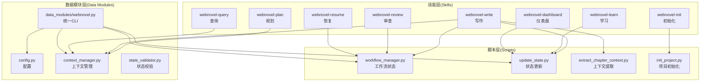
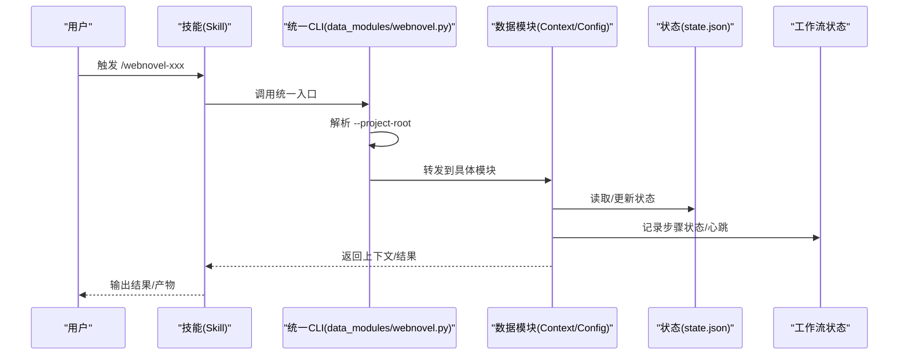
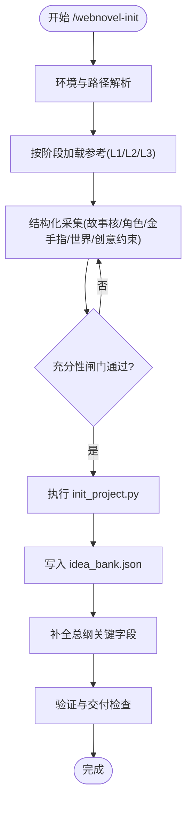
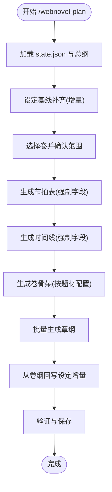
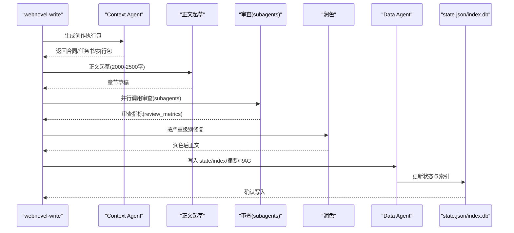
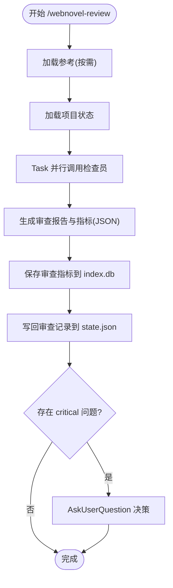
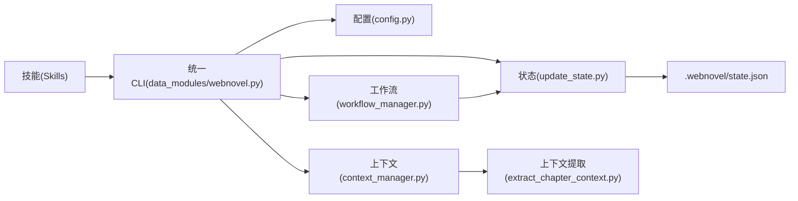

# 技能协作机制

<cite>
**本文档引用的文件**
- [webnovel.py](file://webnovel-writer/scripts/webnovel.py)
- [workflow_manager.py](file://webnovel-writer/scripts/workflow_manager.py)
- [update_state.py](file://webnovel-writer/scripts/update_state.py)
- [init_project.py](file://webnovel-writer/scripts/init_project.py)
- [extract_chapter_context.py](file://webnovel-writer/scripts/extract_chapter_context.py)
- [webnovel.py](file://webnovel-writer/scripts/data_modules/webnovel.py)
- [context_manager.py](file://webnovel-writer/scripts/data_modules/context_manager.py)
- [state_validator.py](file://webnovel-writer/scripts/data_modules/state_validator.py)
- [config.py](file://webnovel-writer/scripts/data_modules/config.py)
- [core-constraints.md](file://webnovel-writer/references/shared/core-constraints.md)
- [webnovel-init/SKILL.md](file://webnovel-writer/skills/webnovel-init/SKILL.md)
- [webnovel-plan/SKILL.md](file://webnovel-writer/skills/webnovel-plan/SKILL.md)
- [webnovel-write/SKILL.md](file://webnovel-writer/skills/webnovel-write/SKILL.md)
- [webnovel-review/SKILL.md](file://webnovel-writer/skills/webnovel-review/SKILL.md)
- [webnovel-query/SKILL.md](file://webnovel-writer/skills/webnovel-query/SKILL.md)
- [webnovel-resume/SKILL.md](file://webnovel-writer/skills/webnovel-resume/SKILL.md)
- [webnovel-learn/SKILL.md](file://webnovel-writer/skills/webnovel-learn/SKILL.md)
- [webnovel-dashboard/SKILL.md](file://webnovel-writer/skills/webnovel-dashboard/SKILL.md)
</cite>

## 目录
1. [简介](#简介)
2. [项目结构](#项目结构)
3. [核心组件](#核心组件)
4. [架构总览](#架构总览)
5. [详细组件分析](#详细组件分析)
6. [依赖关系分析](#依赖关系分析)
7. [性能考虑](#性能考虑)
8. [故障排查指南](#故障排查指南)
9. [结论](#结论)
10. [附录](#附录)

## 简介
本文件系统性阐述 Webnovel Writer 项目中「8个技能」的协作机制，包括技能间的依赖关系、数据流转、工作流编排、参数传递与状态共享、并发控制策略、错误传播与故障隔离、通信协议与消息格式、以及性能优化与资源管理。文档以循序渐进的方式呈现，既适合技术读者深入理解实现细节，也为非技术用户提供可操作的最佳实践与工作流模式。

## 项目结构
该项目采用「技能层 + 数据模块层 + 脚本层」的分层架构：
- 技能层（Skills）：对外暴露统一的命令接口（如 /webnovel-init、/webnovel-plan、/webnovel-write 等），负责编排工作流、加载参考、调用工具与子代理。
- 数据模块层（Data Modules）：提供统一的 CLI 入口与配置管理，封装状态读写、上下文组装、检索增强、索引管理等能力。
- 脚本层（Scripts）：提供底层工具与状态管理脚本，支撑技能层的执行与持久化。

**图表来源**
- [webnovel.py:189-312](file://webnovel-writer/scripts/data_modules/webnovel.py#L189-L312)
- [workflow_manager.py:714-722](file://webnovel-writer/scripts/workflow_manager.py#L714-L722)
- [context_manager.py:99-131](file://webnovel-writer/scripts/data_modules/context_manager.py#L99-L131)
- [update_state.py:71-200](file://webnovel-writer/scripts/update_state.py#L71-L200)
- [extract_chapter_context.py:320-344](file://webnovel-writer/scripts/extract_chapter_context.py#L320-L344)
- [init_project.py:227-264](file://webnovel-writer/scripts/init_project.py#L227-L264)

**章节来源**
- [webnovel.py:189-312](file://webnovel-writer/scripts/data_modules/webnovel.py#L189-L312)
- [workflow_manager.py:714-722](file://webnovel-writer/scripts/workflow_manager.py#L714-L722)

## 核心组件
- 统一 CLI 入口：通过 data_modules/webnovel.py 提供稳定的命令转发，自动解析项目根目录并注入 --project-root 参数，屏蔽路径与 PYTHONPATH 问题。
- 工作流状态管理：workflow_manager.py 提供任务生命周期跟踪、步骤状态、中断检测与恢复选项，确保可回溯与可恢复。
- 上下文管理：context_manager.py 聚合大纲、摘要、状态、题材画像、写作指导、读者信号等，按模板权重动态组装上下文。
- 状态更新：update_state.py 提供原子化写入、备份与回滚、schema 校验与规范化，保障 state.json 的一致性与可靠性。
- 上下文提取：extract_chapter_context.py 从大纲、摘要、状态中抽取章节创作所需上下文，支持 RAG 辅助检索。
- 项目初始化：init_project.py 生成项目骨架、基础设定与模板，确保后续技能可直接运行。

**章节来源**
- [webnovel.py:189-312](file://webnovel-writer/scripts/data_modules/webnovel.py#L189-L312)
- [workflow_manager.py:1-200](file://webnovel-writer/scripts/workflow_manager.py#L1-L200)
- [context_manager.py:99-131](file://webnovel-writer/scripts/data_modules/context_manager.py#L99-L131)
- [update_state.py:71-200](file://webnovel-writer/scripts/update_state.py#L71-L200)
- [extract_chapter_context.py:320-344](file://webnovel-writer/scripts/extract_chapter_context.py#L320-L344)
- [init_project.py:227-264](file://webnovel-writer/scripts/init_project.py#L227-L264)

## 架构总览
技能协作遵循「命令驱动 + 状态驱动 + 参考驱动」的模式：
- 命令驱动：每个技能通过统一 CLI 接口调用，自动解析项目根目录，避免路径错误。
- 状态驱动：state.json 作为单一真相源，贯穿规划、写作、审查、恢复等全流程。
- 参考驱动：技能按需加载参考文件，采用「严格加载」策略，避免一次性灌入全部资料。

**图表来源**
- [webnovel.py:252-307](file://webnovel-writer/scripts/data_modules/webnovel.py#L252-L307)
- [workflow_manager.py:191-216](file://webnovel-writer/scripts/workflow_manager.py#L191-L216)
- [context_manager.py:99-131](file://webnovel-writer/scripts/data_modules/context_manager.py#L99-L131)

## 详细组件分析

### webnovel-init（初始化）
- 目标：通过结构化交互收集完整创作信息，生成可直接进入规划与写作的项目骨架与约束文件。
- 关键机制：
  - 严格加载参考：按阶段加载 L1/L2/L3 参考，避免一次性加载全部资料。
  - 充分性闸门：在执行初始化脚本前，必须满足书名、题材、目标规模、主角核、世界核、金手指核、创意约束等条件。
  - 项目根目录安全规则：禁止在插件目录下生成项目文件，确保目录安全。
  - 生成产物：state.json、设定集文件、总纲、idea_bank.json。
- 与后续技能的关系：init 产物为 plan/write 的输入基础，确保后续流程可直接运行。

**图表来源**
- [webnovel-init/SKILL.md:124-435](file://webnovel-writer/skills/webnovel-init/SKILL.md#L124-L435)
- [init_project.py:227-264](file://webnovel-writer/scripts/init_project.py#L227-L264)

**章节来源**
- [webnovel-init/SKILL.md:1-435](file://webnovel-writer/skills/webnovel-init/SKILL.md#L1-L435)
- [init_project.py:227-264](file://webnovel-writer/scripts/init_project.py#L227-L264)

### webnovel-plan（规划）
- 目标：将总纲细化为卷纲与章纲，补齐设定基线，生成可写作的章节计划。
- 关键机制：
  - 设定基线补齐：在不推翻既有内容的前提下，增量补齐关键字段（角色定位、势力关系、能力边界、代价规则、反派层级映射）。
  - 节拍表与时间线：强制要求中段反转、危机链、卷末新钩子、时间基准与倒计时事件等硬要求。
  - 爽点密度与 Strand 分布：按题材配置比例与密度目标进行规划，确保节奏平衡。
  - 约束触发频率：根据创意约束包计算触发频率，确保反套路与硬约束在卷内合理分布。
- 与后续技能的关系：规划产物（卷纲、章纲、设定增量）为写作阶段提供直接输入。

**图表来源**
- [webnovel-plan/SKILL.md:54-480](file://webnovel-writer/skills/webnovel-plan/SKILL.md#L54-L480)

**章节来源**
- [webnovel-plan/SKILL.md:1-480](file://webnovel-writer/skills/webnovel-plan/SKILL.md#L1-L480)

### webnovel-write（写作）
- 目标：以稳定流程产出可发布章节，确保审查、润色、数据回写完整闭环。
- 关键机制：
  - 步骤化硬约束：Step 1-6 的严格顺序与职责分离，禁止并步与跳步；审查与数据回写为硬步骤。
  - Context Agent 合同：Step 1 生成「创作执行包」，包含任务书、合同字段与直写提示词。
  - 审查路由：默认使用 auto 路由，根据合同与正文信号动态选择审查器；支持 Task 并行调用。
  - 润色与 Anti-AI：按严重级别修复，优先处理 critical，执行 Anti-AI 全文终检。
  - Data Agent：AI 实体提取、消歧、写入 state/index、生成摘要、RAG 向量索引、风格样本评估等。
  - 失败隔离：针对不同子步骤失败提供最小回滚策略，避免重跑全流程。
- 与后续技能的关系：写作产物（章节正文、review_metrics、摘要、state.json 更新）为 review/dashboard 提供输入。

**图表来源**
- [webnovel-write/SKILL.md:109-381](file://webnovel-writer/skills/webnovel-write/SKILL.md#L109-L381)
- [context_manager.py:99-131](file://webnovel-writer/scripts/data_modules/context_manager.py#L99-L131)
- [extract_chapter_context.py:320-344](file://webnovel-writer/scripts/extract_chapter_context.py#L320-L344)

**章节来源**
- [webnovel-write/SKILL.md:1-381](file://webnovel-writer/skills/webnovel-write/SKILL.md#L1-L381)
- [core-constraints.md:11-99](file://webnovel-writer/references/shared/core-constraints.md#L11-L99)

### webnovel-review（审查）
- 目标：对章节质量进行多维度审查，生成报告并记录审查指标。
- 关键机制：
  - 审查深度：Core（默认）与 Full（关键章/用户要求）两种深度。
  - 并行调用：通过 Task 工具并行调用一致性、连续性、OOC、读者拉力、高光点、节奏等检查员。
  - 指标落库：将审查指标写入 index.db，支持趋势统计与回溯。
  - 关键问题处理：当存在 critical 问题时，必须通过 AskUserQuestion 获取用户决策。
- 与后续技能的关系：审查报告与指标为 dashboard 提供可视化数据，也为后续 review 提供参考。

**图表来源**
- [webnovel-review/SKILL.md:33-195](file://webnovel-writer/skills/webnovel-review/SKILL.md#L33-L195)

**章节来源**
- [webnovel-review/SKILL.md:1-195](file://webnovel-writer/skills/webnovel-review/SKILL.md#L1-L195)

### webnovel-query（查询）
- 目标：从项目数据中查询角色、力量、势力、物品、地点、时间线等信息，支持节奏分析与金手指状态查询。
- 关键机制：
  - 严格加载参考：按查询类型加载 system-data-flow、strand-weave-pattern、tag-specification 等参考。
  - 信息查询进度：通过进度清单跟踪识别类型、加载参考、加载项目数据、确认上下文充足、执行查询、格式化输出。
  - 伏笔紧急度分析：基于已过章节与目标章节计算紧急度，提供状态判定。
- 与后续技能的关系：查询结果为 plan/write/dashboard 提供数据支撑。

**章节来源**
- [webnovel-query/SKILL.md:1-193](file://webnovel-writer/skills/webnovel-query/SKILL.md#L1-L193)

### webnovel-resume（恢复）
- 目标：检测中断点并提供安全恢复选项，避免智能续写与状态不一致。
- 关键机制：
  - 恢复协议：禁止智能续写、必须检测后恢复、必须用户确认。
  - 难度分级：根据 Step 难度提供 A/B 选项，如删除半成品重来、Git 回滚等。
  - 中断检测：通过 workflow_manager.detect 分析中断状态，输出任务命令、参数、已完成/未完成步骤。
- 与后续技能的关系：恢复后可继续执行 plan/write 等流程。

**章节来源**
- [webnovel-resume/SKILL.md:1-203](file://webnovel-writer/skills/webnovel-resume/SKILL.md#L1-L203)

### webnovel-learn（学习）
- 目标：从当前会话提取成功模式并写入 project_memory.json。
- 关键机制：
  - 项目根目录守卫：必须在项目根目录执行，确保 .webnovel/state.json 存在。
  - 模式提取：解析用户输入，归类 pattern_type（hook/pacing/dialogue/payoff/emotion），追加记录并写回文件。
  - 约束：不删除旧记录，仅追加；避免完全重复的 description。
- 与后续技能的关系：学习到的模式可为后续写作提供经验参考。

**章节来源**
- [webnovel-learn/SKILL.md:1-46](file://webnovel-writer/skills/webnovel-learn/SKILL.md#L1-L46)

### webnovel-dashboard（仪表盘）
- 目标：启动只读 Web 面板，实时查看项目状态、实体图谱与章节内容。
- 关键机制：
  - 环境确认：解析项目根目录，安装依赖，启动服务器。
  - 文件读取限制：严格限制在 PROJECT_ROOT 范围内，防止路径穿越。
  - 实时刷新：通过 watchdog 监听 .webnovel/ 目录变更并实时刷新。
- 与后续技能的关系：dashboard 为 review/plan/write 等流程提供可视化监控。

**章节来源**
- [webnovel-dashboard/SKILL.md:1-81](file://webnovel-writer/skills/webnovel-dashboard/SKILL.md#L1-L81)

## 依赖关系分析
- 技能与数据模块的耦合：
  - 技能通过统一 CLI 转发到 data_modules，避免直接依赖具体实现。
  - data_modules 通过 config.py 管理配置，支持 .env 加载与项目级覆盖。
- 技能与脚本的耦合：
  - 写作与审查流程依赖 workflow_manager 的状态跟踪与恢复能力。
  - 状态更新通过 update_state.py 提供原子化写入与备份回滚。
  - 上下文提取通过 extract_chapter_context.py 与 RAG 检索增强。
- 外部依赖：
  - API 配置通过环境变量读取（EMBED_BASE_URL/EMBED_MODEL/EMBED_API_KEY 等）。
  - Git 可用性影响项目初始化与备份提交。

**图表来源**
- [webnovel.py:252-307](file://webnovel-writer/scripts/data_modules/webnovel.py#L252-L307)
- [config.py:51-77](file://webnovel-writer/scripts/data_modules/config.py#L51-L77)
- [context_manager.py:99-131](file://webnovel-writer/scripts/data_modules/context_manager.py#L99-L131)
- [workflow_manager.py:191-216](file://webnovel-writer/scripts/workflow_manager.py#L191-L216)
- [update_state.py:71-200](file://webnovel-writer/scripts/update_state.py#L71-L200)
- [extract_chapter_context.py:320-344](file://webnovel-writer/scripts/extract_chapter_context.py#L320-L344)

**章节来源**
- [webnovel.py:252-307](file://webnovel-writer/scripts/data_modules/webnovel.py#L252-L307)
- [config.py:51-77](file://webnovel-writer/scripts/data_modules/config.py#L51-L77)

## 性能考虑
- 上下文压缩与动态权重：context_manager 支持按章节阶段动态调整模板权重，早期增加 core 权重，后期增加 global 权重，避免超长上下文。
- RAG 检索优化：当 outline 不具备行动线索时，不触发 RAG；当向量库缺失或为空时，回退 BM25 搜索。
- 并发与重试：配置层提供 embed/rerank 并发与重试策略，降低外部服务波动对流程的影响。
- 观测与性能分析：Data Agent 输出 timing 日志，支持识别最慢环节并定位系统开销来源。

**章节来源**
- [context_manager.py:517-543](file://webnovel-writer/scripts/data_modules/context_manager.py#L517-L543)
- [extract_chapter_context.py:194-292](file://webnovel-writer/scripts/extract_chapter_context.py#L194-L292)
- [config.py:144-166](file://webnovel-writer/scripts/data_modules/config.py#L144-L166)
- [webnovel-write/SKILL.md:314-322](file://webnovel-writer/skills/webnovel-write/SKILL.md#L314-L322)

## 故障排查指南
- 工作流中断与恢复：
  - 使用 /webnovel-resume 检测中断状态，展示恢复选项（删除半成品重来、Git 回滚等），并提供风险等级与操作清单。
  - workflow_manager 提供清理 artifacts、清除中断任务、标记任务失败等功能。
- 审查失败处理：
  - 当审查缺失或润色引入设定冲突时，提供最小回滚策略：仅重跑失败步骤，不回滚已通过步骤。
- 状态不一致：
  - 使用 update_state.py 的原子化写入与备份回滚，确保 state.json 的一致性。
- 环境问题：
  - 使用 data_modules/webnovel.py 的 preflight 检查 scripts_dir、entry_script、skill_root、project_root 等关键路径。

**章节来源**
- [webnovel-resume/SKILL.md:102-203](file://webnovel-writer/skills/webnovel-resume/SKILL.md#L102-L203)
- [workflow_manager.py:365-564](file://webnovel-writer/scripts/workflow_manager.py#L365-L564)
- [webnovel-write/SKILL.md:366-381](file://webnovel-writer/skills/webnovel-write/SKILL.md#L366-L381)
- [update_state.py:159-200](file://webnovel-writer/scripts/update_state.py#L159-L200)
- [webnovel.py:109-154](file://webnovel-writer/scripts/data_modules/webnovel.py#L109-L154)

## 结论
本技能协作机制通过「统一 CLI + 状态驱动 + 参考驱动」实现了 8 个技能的有序协作与高效编排。工作流状态管理确保可回溯与可恢复，上下文管理与 RAG 辅助提升了创作质量，状态更新与校验保障了数据一致性。配合严格的错误传播与故障隔离策略，系统在复杂创作流程中保持稳定性与可维护性。

## 附录
- 技能组合使用最佳实践：
  - 初始化 → 规划 → 写作 → 审查 → 润色 → 数据回写 → 仪表盘监控
  - 复杂题材建议启用复合题材提示与节奏分析，确保节拍表与时间线强制字段完整
  - 审查深度建议按关键章节提升至 Full，确保高光点与节奏控制质量
- 典型工作流模式：
  - 迭代式写作：每轮写作后进行 Core 审查，必要时进行 Full 审查
  - 节奏控制：结合 Strand Weave 与 Genre Profile，按密度目标与比例分布进行规划
  - 伏笔管理：利用紧急度公式与回收机制，确保伏笔按时回收与节奏推进