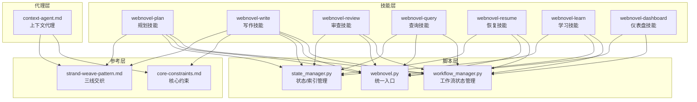
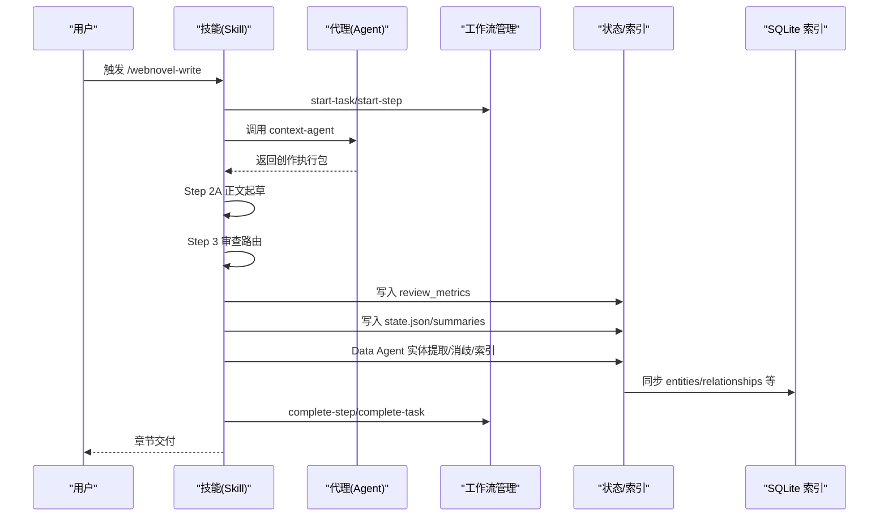
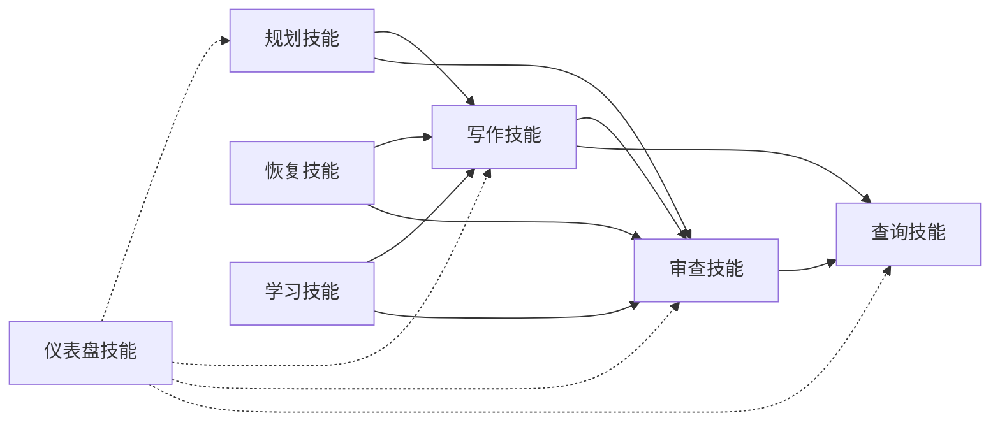
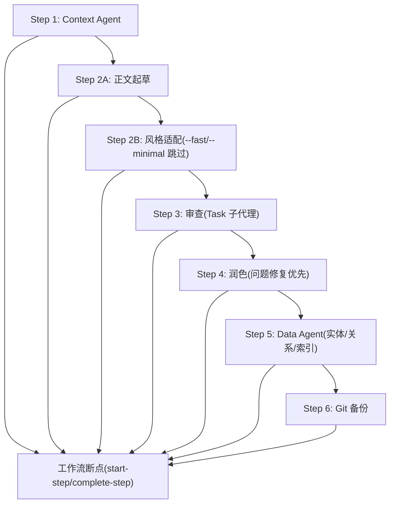
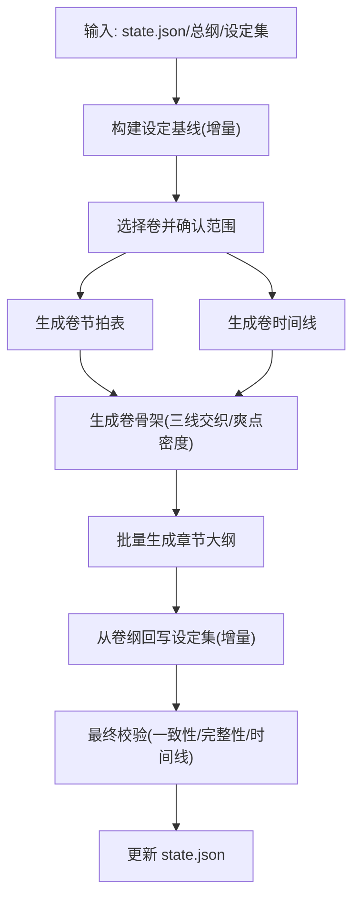
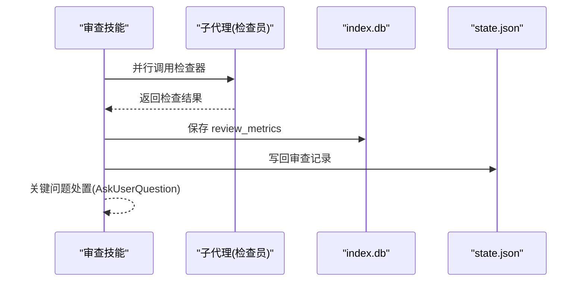
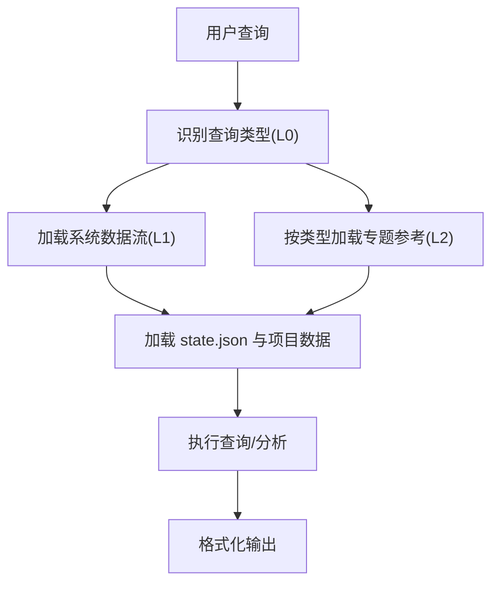
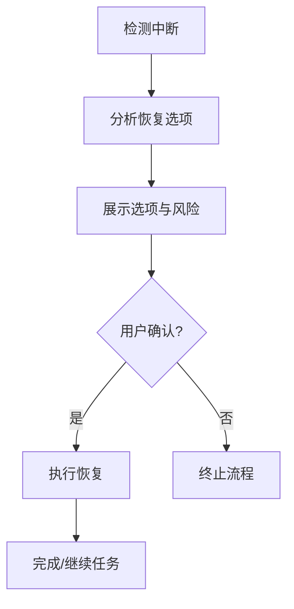
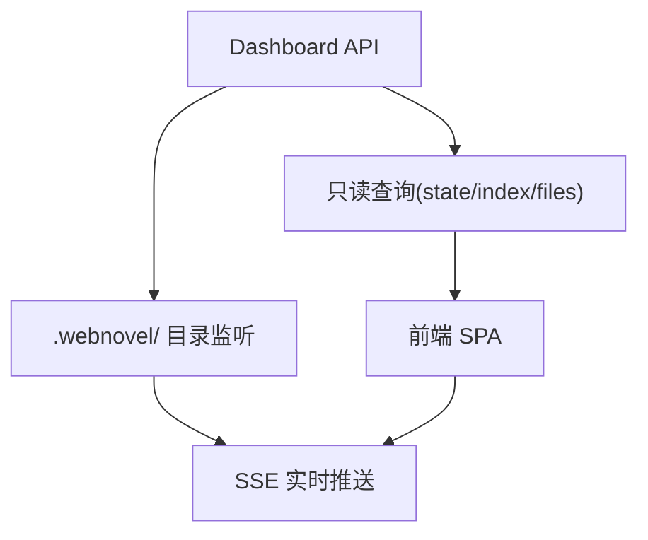
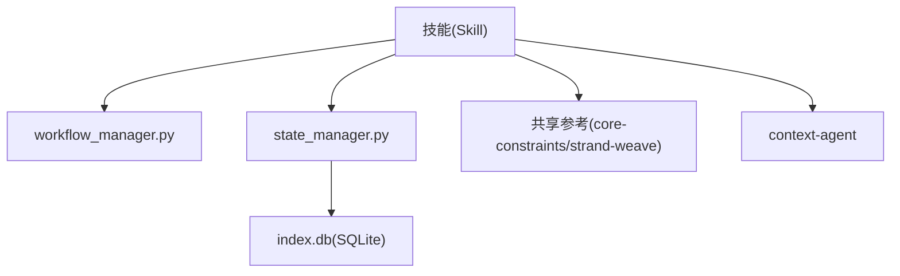

# 技能架构概览

<cite>
**本文档引用的文件**
- [README.md](file://README.md)
- [webnovel-plan/SKILL.md](file://webnovel-writer/skills/webnovel-plan/SKILL.md)
- [webnovel-write/SKILL.md](file://webnovel-writer/skills/webnovel-write/SKILL.md)
- [webnovel-review/SKILL.md](file://webnovel-writer/skills/webnovel-review/SKILL.md)
- [webnovel-query/SKILL.md](file://webnovel-writer/skills/webnovel-query/SKILL.md)
- [webnovel-resume/SKILL.md](file://webnovel-writer/skills/webnovel-resume/SKILL.md)
- [webnovel-learn/SKILL.md](file://webnovel-writer/skills/webnovel-learn/SKILL.md)
- [webnovel-dashboard/SKILL.md](file://webnovel-writer/skills/webnovel-dashboard/SKILL.md)
- [workflow_manager.py](file://webnovel-writer/scripts/workflow_manager.py)
- [webnovel.py](file://webnovel-writer/scripts/webnovel.py)
- [state_manager.py](file://webnovel-writer/scripts/data_modules/state_manager.py)
- [strand-weave-pattern.md](file://webnovel-writer/references/shared/strand-weave-pattern.md)
- [core-constraints.md](file://webnovel-writer/references/shared/core-constraints.md)
- [context-agent.md](file://webnovel-writer/agents/context-agent.md)
- [app.py](file://webnovel-writer/dashboard/app.py)
</cite>

## 目录
1. [引言](#引言)
2. [项目结构](#项目结构)
3. [核心组件](#核心组件)
4. [架构总览](#架构总览)
5. [详细组件分析](#详细组件分析)
6. [依赖关系分析](#依赖关系分析)
7. [性能考量](#性能考量)
8. [故障排查指南](#故障排查指南)
9. [结论](#结论)
10. [附录](#附录)

## 引言
本文件面向初学者与开发者，系统性梳理 Webnovel Writer 的技能架构。项目围绕「长篇网文创作」目标，通过 8 个核心技能（含只读仪表盘）形成「规划-写作-审查-查询-恢复-学习-仪表盘」的闭环工作流，配合统一的状态与索引系统、可观测性与恢复机制，实现「低遗忘、低幻觉、可恢复、可扩展」的 AI 写作基础设施。

## 项目结构
- 技能层：每个技能以独立目录封装，包含 SKILL.md（技能契约与流程）、references（按需引用）与必要的工具调用。
- 脚本层：统一入口与工作流管理、状态与索引管理、数据模块等。
- 参考层：共享约束与模式（如三线交织、核心约束）。
- 代理层：如 context-agent 等子代理，承担上下文抽取与执行包生成。
- 仪表盘：只读 Web 面板，提供项目状态、实体图谱、章节/大纲浏览与追读力分析。

图表来源
- [webnovel-plan/SKILL.md](file://webnovel-writer/skills/webnovel-plan/SKILL.md)
- [webnovel-write/SKILL.md](file://webnovel-writer/skills/webnovel-write/SKILL.md)
- [webnovel-review/SKILL.md](file://webnovel-writer/skills/webnovel-review/SKILL.md)
- [webnovel-query/SKILL.md](file://webnovel-writer/skills/webnovel-query/SKILL.md)
- [webnovel-resume/SKILL.md](file://webnovel-writer/skills/webnovel-resume/SKILL.md)
- [webnovel-learn/SKILL.md](file://webnovel-writer/skills/webnovel-learn/SKILL.md)
- [webnovel-dashboard/SKILL.md](file://webnovel-writer/skills/webnovel-dashboard/SKILL.md)
- [workflow_manager.py](file://webnovel-writer/scripts/workflow_manager.py)
- [webnovel.py](file://webnovel-writer/scripts/webnovel.py)
- [state_manager.py](file://webnovel-writer/scripts/data_modules/state_manager.py)
- [core-constraints.md](file://webnovel-writer/references/shared/core-constraints.md)
- [strand-weave-pattern.md](file://webnovel-writer/references/shared/strand-weave-pattern.md)
- [context-agent.md](file://webnovel-writer/agents/context-agent.md)

章节来源
- [README.md](file://README.md)

## 核心组件
- 技能契约与流程：每个技能以 SKILL.md 明确输入、输出、步骤、引用加载策略与失败处理，确保「按步骤执行、按需加载、可恢复」。
- 工作流状态管理：统一的任务/步骤生命周期、中断检测与恢复选项，保障长流程的可靠性。
- 状态与索引：以 state.json 为核心，结合 SQLite index.db 实现「轻 state.json + 重索引」的高性能数据架构。
- 共享约束与模式：核心约束（大纲即法律、设定即物理、发明需识别）与三线交织（Quest/Fire/Constellation）确保创作一致性与节奏平衡。
- 代理与数据模块：context-agent 等子代理负责上下文抽取与执行包生成，数据模块负责实体、关系、状态变化的原子化写入与同步。

章节来源
- [webnovel-plan/SKILL.md](file://webnovel-writer/skills/webnovel-plan/SKILL.md)
- [webnovel-write/SKILL.md](file://webnovel-writer/skills/webnovel-write/SKILL.md)
- [webnovel-review/SKILL.md](file://webnovel-writer/skills/webnovel-review/SKILL.md)
- [webnovel-query/SKILL.md](file://webnovel-writer/skills/webnovel-query/SKILL.md)
- [webnovel-resume/SKILL.md](file://webnovel-writer/skills/webnovel-resume/SKILL.md)
- [webnovel-learn/SKILL.md](file://webnovel-writer/skills/webnovel-learn/SKILL.md)
- [webnovel-dashboard/SKILL.md](file://webnovel-writer/skills/webnovel-dashboard/SKILL.md)
- [workflow_manager.py](file://webnovel-writer/scripts/workflow_manager.py)
- [state_manager.py](file://webnovel-writer/scripts/data_modules/state_manager.py)
- [core-constraints.md](file://webnovel-writer/references/shared/core-constraints.md)
- [strand-weave-pattern.md](file://webnovel-writer/references/shared/strand-weave-pattern.md)
- [context-agent.md](file://webnovel-writer/agents/context-agent.md)

## 架构总览
技能架构采用「技能-脚本-参考-代理」四层协同：
- 技能层：对外暴露命令（/webnovel-plan、/webnovel-write、/webnovel-review 等），每个技能定义严格的步骤、引用加载与失败处理。
- 脚本层：统一入口 webnovel.py 转发到 data_modules，workflow_manager.py 管理任务/步骤状态与恢复，state_manager.py 管理 state.json 与 index.db 的原子化写入。
- 参考层：共享约束与模式（core-constraints、strand-weave-pattern）作为单一事实源，禁止在技能内复制修改。
- 代理层：context-agent 等子代理按需抽取上下文，生成创作执行包，驱动写作技能的 Step 2A 直写。

图表来源
- [webnovel-write/SKILL.md](file://webnovel-writer/skills/webnovel-write/SKILL.md)
- [context-agent.md](file://webnovel-writer/agents/context-agent.md)
- [workflow_manager.py](file://webnovel-writer/scripts/workflow_manager.py)
- [state_manager.py](file://webnovel-writer/scripts/data_modules/state_manager.py)

## 详细组件分析

### 技能分类体系与协作关系
- 规划类：webnovel-plan（卷纲/节拍表/时间线/骨架/章节大纲批量生成），强调「先纲后目」「增量补齐」「节奏锚定」。
- 写作类：webnovel-write（上下文 Contract + 正文起草 + 风格适配 + 审查 + 润色 + 数据回写 + Git 备份），强调「流程硬约束」「职责分离」「最小回滚」。
- 质量类：webnovel-review（并行检查员 + 报告生成 + 指标落库 + 关键问题处置），强调「可并行」「可追踪」「可修复」。
- 查询类：webnovel-query（角色/设定/伏笔/节奏/标签格式），强调「按需加载」「快速分析」「一致性检查」。
- 恢复类：webnovel-resume（中断检测 + 恢复选项 + 清理 artifacts），强调「禁止智能续写」「必须检测后恢复」「必须用户确认」。
- 学习类：webnovel-learn（从会话提取成功模式写入 project_memory.json），强调「追加不删除」「避免重复」。
- 可视化：webnovel-dashboard（只读面板 + 文件监听 + SSE 实时推送），强调「只读」「安全」「实时」。

图表来源
- [webnovel-plan/SKILL.md](file://webnovel-writer/skills/webnovel-plan/SKILL.md)
- [webnovel-write/SKILL.md](file://webnovel-writer/skills/webnovel-write/SKILL.md)
- [webnovel-review/SKILL.md](file://webnovel-writer/skills/webnovel-review/SKILL.md)
- [webnovel-query/SKILL.md](file://webnovel-writer/skills/webnovel-query/SKILL.md)
- [webnovel-resume/SKILL.md](file://webnovel-writer/skills/webnovel-resume/SKILL.md)
- [webnovel-learn/SKILL.md](file://webnovel-writer/skills/webnovel-learn/SKILL.md)
- [webnovel-dashboard/SKILL.md](file://webnovel-writer/skills/webnovel-dashboard/SKILL.md)

章节来源
- [webnovel-plan/SKILL.md](file://webnovel-writer/skills/webnovel-plan/SKILL.md)
- [webnovel-write/SKILL.md](file://webnovel-writer/skills/webnovel-write/SKILL.md)
- [webnovel-review/SKILL.md](file://webnovel-writer/skills/webnovel-review/SKILL.md)
- [webnovel-query/SKILL.md](file://webnovel-writer/skills/webnovel-query/SKILL.md)
- [webnovel-resume/SKILL.md](file://webnovel-writer/skills/webnovel-resume/SKILL.md)
- [webnovel-learn/SKILL.md](file://webnovel-writer/skills/webnovel-learn/SKILL.md)
- [webnovel-dashboard/SKILL.md](file://webnovel-writer/skills/webnovel-dashboard/SKILL.md)

### 写作技能（webnovel-write）工作流编排
- 步骤划分：Step 1（Context Agent）、2A（正文起草）、2B（风格适配）、3（审查）、4（润色）、5（Data Agent）、6（Git 备份）。
- 职责分离：Step 2B 仅风格转译，Step 4 仅问题修复与质控；审查必须由 Task 子代理执行，禁止主流程伪造结论。
- 模式裁剪：--fast/--minimal 仅允许按契约裁剪步骤，禁止自创模式。
- 断点记录：每个 Step 执行前后记录 workflow 状态，便于恢复与可观测性。

图表来源
- [webnovel-write/SKILL.md](file://webnovel-writer/skills/webnovel-write/SKILL.md)
- [workflow_manager.py](file://webnovel-writer/scripts/workflow_manager.py)

章节来源
- [webnovel-write/SKILL.md](file://webnovel-writer/skills/webnovel-write/SKILL.md)
- [workflow_manager.py](file://webnovel-writer/scripts/workflow_manager.py)

### 规划技能（webnovel-plan）数据流转
- 输入：state.json、总纲、设定集、模板与参考。
- 输出：卷节拍表、卷时间线、卷骨架、章节大纲（批量写入）。
- 增量补齐：仅对现有设定集做增量补充，不清空、不重写整文件。
- 校验与回滚：任一步失败仅重跑失败批次，不覆盖整文件；最终检查通过后才更新 state。

图表来源
- [webnovel-plan/SKILL.md](file://webnovel-writer/skills/webnovel-plan/SKILL.md)

章节来源
- [webnovel-plan/SKILL.md](file://webnovel-writer/skills/webnovel-plan/SKILL.md)

### 审查技能（webnovel-review）并行检查
- 核心检查器：一致性/连贯性/OOC/读者拉力。
- 追加检查器：高潮点/节奏控制（Full 模式）。
- 指标落库：review_metrics 写入 index.db，记录维度得分与严重度。
- 关键问题处置：critical 问题必须用户确认处理方案。

图表来源
- [webnovel-review/SKILL.md](file://webnovel-writer/skills/webnovel-review/SKILL.md)

章节来源
- [webnovel-review/SKILL.md](file://webnovel-writer/skills/webnovel-review/SKILL.md)

### 查询技能（webnovel-query）按需加载
- 查询类型识别：角色/设定/伏笔/节奏/标签格式。
- 加载策略：L0 识别类型，L1 加载系统数据流，L2 按类型加载专题参考。
- 快速分析：提供 urgency/status/strand 等快捷查询。

图表来源
- [webnovel-query/SKILL.md](file://webnovel-writer/skills/webnovel-query/SKILL.md)

章节来源
- [webnovel-query/SKILL.md](file://webnovel-writer/skills/webnovel-query/SKILL.md)

### 恢复技能（webnovel-resume）中断检测与恢复
- 中断检测：检测 last_heartbeat，识别当前任务与步骤。
- 恢复选项：按步骤难度分级提供「删除重来」「回滚到上一章」「重新执行审查」等选项。
- 禁止事项：禁止智能续写、禁止自动选择、禁止跳过中断检测。

图表来源
- [webnovel-resume/SKILL.md](file://webnovel-writer/skills/webnovel-resume/SKILL.md)
- [workflow_manager.py](file://webnovel-writer/scripts/workflow_manager.py)

章节来源
- [webnovel-resume/SKILL.md](file://webnovel-writer/skills/webnovel-resume/SKILL.md)
- [workflow_manager.py](file://webnovel-writer/scripts/workflow_manager.py)

### 学习技能（webnovel-learn）模式提取
- 目标：从当前会话提取成功模式并写入 project_memory.json。
- 约束：不删除旧记录，仅追加；避免完全重复的 description。

章节来源
- [webnovel-learn/SKILL.md](file://webnovel-writer/skills/webnovel-learn/SKILL.md)

### 仪表盘技能（webnovel-dashboard）只读可视化
- 目标：实时查看项目状态、实体图谱、章节/大纲内容与追读力分析。
- 安全：只读 API，严格路径限制，防止路径穿越。
- 实时：watchdog 监听 .webnovel/ 目录变更并推送 SSE。

图表来源
- [webnovel-dashboard/SKILL.md](file://webnovel-writer/skills/webnovel-dashboard/SKILL.md)
- [app.py](file://webnovel-writer/dashboard/app.py)

章节来源
- [webnovel-dashboard/SKILL.md](file://webnovel-writer/skills/webnovel-dashboard/SKILL.md)
- [app.py](file://webnovel-writer/dashboard/app.py)

## 依赖关系分析
- 技能对工作流管理的依赖：所有技能通过 workflow_manager.py 记录任务/步骤状态，支持中断检测与恢复。
- 技能对状态/索引的依赖：state.json 与 index.db 的原子化写入，确保并发安全与数据一致性。
- 技能对共享参考的依赖：core-constraints 与 strand-weave-pattern 作为单一事实源，避免重复与漂移。
- 技能对代理的依赖：context-agent 生成创作执行包，驱动写作技能的直写阶段。

图表来源
- [workflow_manager.py](file://webnovel-writer/scripts/workflow_manager.py)
- [state_manager.py](file://webnovel-writer/scripts/data_modules/state_manager.py)
- [core-constraints.md](file://webnovel-writer/references/shared/core-constraints.md)
- [strand-weave-pattern.md](file://webnovel-writer/references/shared/strand-weave-pattern.md)
- [context-agent.md](file://webnovel-writer/agents/context-agent.md)

章节来源
- [workflow_manager.py](file://webnovel-writer/scripts/workflow_manager.py)
- [state_manager.py](file://webnovel-writer/scripts/data_modules/state_manager.py)
- [core-constraints.md](file://webnovel-writer/references/shared/core-constraints.md)
- [strand-weave-pattern.md](file://webnovel-writer/references/shared/strand-weave-pattern.md)
- [context-agent.md](file://webnovel-writer/agents/context-agent.md)

## 性能考量
- 状态与索引分离：state.json 保持精简，大数据（entities/relationships/state_changes）迁移到 SQLite，降低 JSON 体积与锁竞争。
- 原子化写入：state.json 采用文件锁 + 原子写入，避免并发覆盖；SQLite 同步失败时保留 pending，失败后可回滚内存队列。
- 观测性：call_trace 与 data_agent_timing 记录外层流程与内部子步骤耗时，支持性能瓶颈定位。
- 并行化：审查阶段可并行调用多个子代理，缩短总时长。
- 按需加载：技能引用采用 L0/L1/L2 懒加载策略，减少不必要的 IO。

章节来源
- [state_manager.py](file://webnovel-writer/scripts/data_modules/state_manager.py)
- [webnovel-write/SKILL.md](file://webnovel-writer/skills/webnovel-write/SKILL.md)

## 故障排查指南
- 任务中断恢复：使用 /webnovel-resume 检测中断并提供恢复选项，避免智能续写与自动选择。
- 审查关键问题：critical 问题必须用户确认处理方案；可选择立即修复或稍后处理。
- 写作最小回滚：失败步骤仅重跑，不回滚已通过步骤；如润色引入设定冲突，恢复 Step 2A 并重做 Step 4。
- 状态一致性：审查指标必须落库后才能进入下一步；章节文件、摘要文件、状态文件齐全方可视为成功。
- 仪表盘只读：如需自定义端口或禁用自动打开浏览器，可通过参数配置。

章节来源
- [webnovel-resume/SKILL.md](file://webnovel-writer/skills/webnovel-resume/SKILL.md)
- [webnovel-review/SKILL.md](file://webnovel-writer/skills/webnovel-review/SKILL.md)
- [webnovel-write/SKILL.md](file://webnovel-writer/skills/webnovel-write/SKILL.md)
- [webnovel-dashboard/SKILL.md](file://webnovel-writer/skills/webnovel-dashboard/SKILL.md)

## 结论
Webnovel Writer 的技能架构以「流程硬约束 + 职责分离 + 按需加载 + 可观测 + 可恢复」为核心设计原则，通过 8 个技能形成完整的创作闭环。共享参考确保一致性，工作流管理保障可靠性，状态与索引实现高性能与并发安全。该架构既适合初学者理解创作流程，也为高级用户提供扩展点与自定义接口。

## 附录
- 统一入口：webnovel.py 将 CLI 转发至 data_modules，适配不同安装路径。
- 工作流命令：start-task/start-step/complete-step/complete-task/detect/cleanup/clear 等。
- 数据模块：state_manager.py 提供实体、关系、状态变化的原子化写入与 SQLite 同步。

章节来源
- [webnovel.py](file://webnovel-writer/scripts/webnovel.py)
- [workflow_manager.py](file://webnovel-writer/scripts/workflow_manager.py)
- [state_manager.py](file://webnovel-writer/scripts/data_modules/state_manager.py)