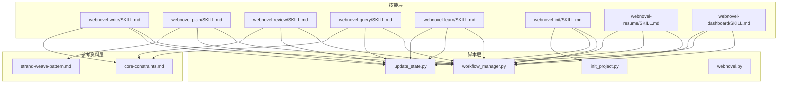
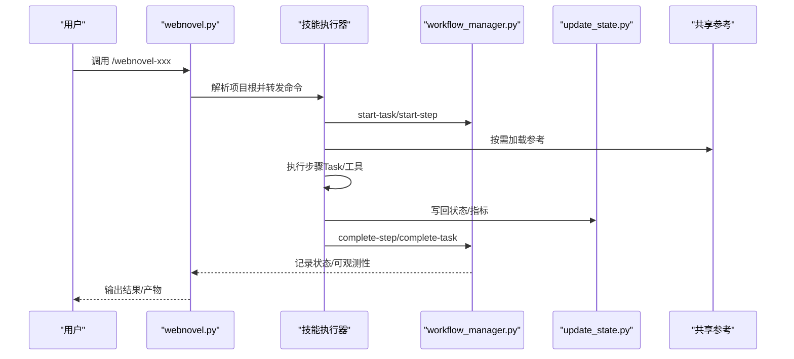
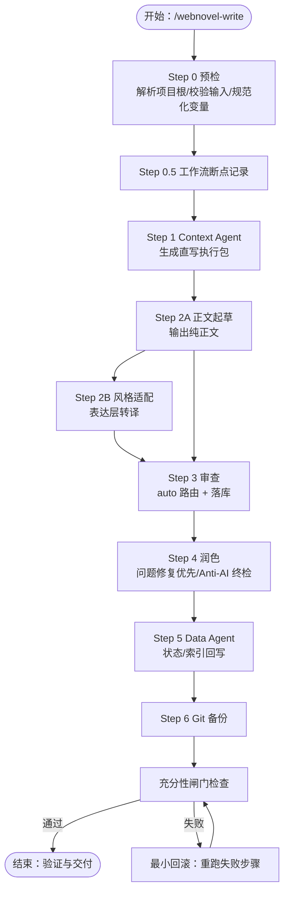
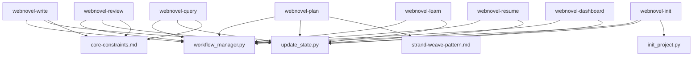

# 技能系统

<cite>
**本文档引用的文件**
- [webnovel-write/SKILL.md](file://webnovel-writer/skills/webnovel-write/SKILL.md)
- [webnovel-plan/SKILL.md](file://webnovel-writer/skills/webnovel-plan/SKILL.md)
- [webnovel-review/SKILL.md](file://webnovel-writer/skills/webnovel-review/SKILL.md)
- [webnovel-query/SKILL.md](file://webnovel-writer/skills/webnovel-query/SKILL.md)
- [webnovel-learn/SKILL.md](file://webnovel-writer/skills/webnovel-learn/SKILL.md)
- [webnovel-init/SKILL.md](file://webnovel-writer/skills/webnovel-init/SKILL.md)
- [webnovel-resume/SKILL.md](file://webnovel-writer/skills/webnovel-resume/SKILL.md)
- [webnovel-dashboard/SKILL.md](file://webnovel-writer/skills/webnovel-dashboard/SKILL.md)
- [workflow_manager.py](file://webnovel-writer/scripts/workflow_manager.py)
- [update_state.py](file://webnovel-writer/scripts/update_state.py)
- [init_project.py](file://webnovel-writer/scripts/init_project.py)
- [webnovel.py](file://webnovel-writer/scripts/webnovel.py)
- [core-constraints.md](file://webnovel-writer/references/shared/core-constraints.md)
- [strand-weave-pattern.md](file://webnovel-writer/references/shared/strand-weave-pattern.md)
</cite>

## 目录
1. [简介](#简介)
2. [项目结构](#项目结构)
3. [核心组件](#核心组件)
4. [架构总览](#架构总览)
5. [详细组件分析](#详细组件分析)
6. [依赖关系分析](#依赖关系分析)
7. [性能考量](#性能考量)
8. [故障排查指南](#故障排查指南)
9. [结论](#结论)
10. [附录](#附录)

## 简介
本文件为 Webnovel Writer 技能系统的全面技术文档，覆盖8个核心写作技能：webnovel-write（写作）、webnovel-plan（规划）、webnovel-review（评审）、webnovel-query（查询）、webnovel-learn（学习）、webnovel-init（初始化）、webnovel-resume（恢复）、webnovel-dashboard（仪表板）。文档从系统架构、组件关系、数据流、处理逻辑、集成点、错误处理与性能特征等维度进行深入剖析，并提供使用示例、参数配置、错误处理方案、技能协作关系与工作流编排说明，以及自定义技能开发指南与扩展方法。

## 项目结构
Webnovel Writer 采用“技能 + 脚本 + 参考资料”的分层组织方式：
- 技能层：每个技能以独立目录存放 SKILL.md 与引用资料，定义执行流程、前置条件、工具策略与输出格式。
- 脚本层：统一 CLI 入口与工作流管理、状态更新、项目初始化等核心逻辑。
- 参考资料层：共享约束与模式（如核心约束、三线交织模式）保障跨技能一致性。

图表来源
- [webnovel-write/SKILL.md:1-381](file://webnovel-writer/skills/webnovel-write/SKILL.md#L1-L381)
- [webnovel-plan/SKILL.md:1-480](file://webnovel-writer/skills/webnovel-plan/SKILL.md#L1-L480)
- [webnovel-review/SKILL.md:1-195](file://webnovel-writer/skills/webnovel-review/SKILL.md#L1-L195)
- [webnovel-query/SKILL.md:1-193](file://webnovel-writer/skills/webnovel-query/SKILL.md#L1-L193)
- [webnovel-learn/SKILL.md:1-46](file://webnovel-writer/skills/webnovel-learn/SKILL.md#L1-L46)
- [webnovel-init/SKILL.md:1-435](file://webnovel-writer/skills/webnovel-init/SKILL.md#L1-L435)
- [webnovel-resume/SKILL.md:1-203](file://webnovel-writer/skills/webnovel-resume/SKILL.md#L1-L203)
- [webnovel-dashboard/SKILL.md:1-81](file://webnovel-writer/skills/webnovel-dashboard/SKILL.md#L1-L81)
- [workflow_manager.py:1-823](file://webnovel-writer/scripts/workflow_manager.py#L1-L823)
- [update_state.py:1-634](file://webnovel-writer/scripts/update_state.py#L1-L634)
- [init_project.py:1-845](file://webnovel-writer/scripts/init_project.py#L1-L845)
- [webnovel.py:1-37](file://webnovel-writer/scripts/webnovel.py#L1-L37)
- [core-constraints.md:1-99](file://webnovel-writer/references/shared/core-constraints.md#L1-L99)
- [strand-weave-pattern.md:1-112](file://webnovel-writer/references/shared/strand-weave-pattern.md#L1-L112)

章节来源
- [webnovel-write/SKILL.md:1-381](file://webnovel-writer/skills/webnovel-write/SKILL.md#L1-L381)
- [webnovel-plan/SKILL.md:1-480](file://webnovel-writer/skills/webnovel-plan/SKILL.md#L1-L480)
- [webnovel-review/SKILL.md:1-195](file://webnovel-writer/skills/webnovel-review/SKILL.md#L1-L195)
- [webnovel-query/SKILL.md:1-193](file://webnovel-writer/skills/webnovel-query/SKILL.md#L1-L193)
- [webnovel-learn/SKILL.md:1-46](file://webnovel-writer/skills/webnovel-learn/SKILL.md#L1-L46)
- [webnovel-init/SKILL.md:1-435](file://webnovel-writer/skills/webnovel-init/SKILL.md#L1-L435)
- [webnovel-resume/SKILL.md:1-203](file://webnovel-writer/skills/webnovel-resume/SKILL.md#L1-L203)
- [webnovel-dashboard/SKILL.md:1-81](file://webnovel-writer/skills/webnovel-dashboard/SKILL.md#L1-L81)
- [workflow_manager.py:1-823](file://webnovel-writer/scripts/workflow_manager.py#L1-L823)
- [update_state.py:1-634](file://webnovel-writer/scripts/update_state.py#L1-L634)
- [init_project.py:1-845](file://webnovel-writer/scripts/init_project.py#L1-L845)
- [webnovel.py:1-37](file://webnovel-writer/scripts/webnovel.py#L1-L37)
- [core-constraints.md:1-99](file://webnovel-writer/references/shared/core-constraints.md#L1-L99)
- [strand-weave-pattern.md:1-112](file://webnovel-writer/references/shared/strand-weave-pattern.md#L1-L112)

## 核心组件
- 技能定义（SKILL.md）：每个技能以 Markdown 文件定义执行原则、引用加载策略、工具策略、交互流程、强制约束、输出产物与验证标准。
- 工作流管理（workflow_manager.py）：提供任务/步骤状态跟踪、中断检测、恢复选项分析、原子化状态持久化与可观测性日志。
- 状态更新（update_state.py）：提供安全、原子、可回滚的 state.json 更新接口，支持部分更新与批量操作。
- 项目初始化（init_project.py）：生成项目骨架、基础设定与大纲模板，确保后续规划/写作可直接运行。
- 统一 CLI（webnovel.py）：封装脚本目录与入口，统一注入 --project-root，屏蔽路径与环境差异。

章节来源
- [webnovel-write/SKILL.md:1-381](file://webnovel-writer/skills/webnovel-write/SKILL.md#L1-L381)
- [webnovel-review/SKILL.md:1-195](file://webnovel-writer/skills/webnovel-review/SKILL.md#L1-L195)
- [webnovel-query/SKILL.md:1-193](file://webnovel-writer/skills/webnovel-query/SKILL.md#L1-L193)
- [webnovel-learn/SKILL.md:1-46](file://webnovel-writer/skills/webnovel-learn/SKILL.md#L1-L46)
- [webnovel-init/SKILL.md:1-435](file://webnovel-writer/skills/webnovel-init/SKILL.md#L1-L435)
- [webnovel-resume/SKILL.md:1-203](file://webnovel-writer/skills/webnovel-resume/SKILL.md#L1-L203)
- [webnovel-dashboard/SKILL.md:1-81](file://webnovel-writer/skills/webnovel-dashboard/SKILL.md#L1-L81)
- [workflow_manager.py:1-823](file://webnovel-writer/scripts/workflow_manager.py#L1-L823)
- [update_state.py:1-634](file://webnovel-writer/scripts/update_state.py#L1-L634)
- [init_project.py:1-845](file://webnovel-writer/scripts/init_project.py#L1-L845)
- [webnovel.py:1-37](file://webnovel-writer/scripts/webnovel.py#L1-L37)

## 架构总览
系统采用“技能驱动 + 工作流编排 + 状态持久化 + 参考资料约束”的架构：
- 技能层：每个技能定义自身流程与约束，按需加载参考文件，调用 Task/工具执行。
- 工作流层：统一记录任务/步骤状态、心跳、失败原因与恢复选项，提供中断检测与清理能力。
- 状态层：通过 update_state.py 提供原子化写入、备份与回滚，保障 state.json 的一致性与可追踪性。
- 资料层：共享约束与模式作为单一事实源，确保跨技能一致性与可审计性。

图表来源
- [webnovel.py:1-37](file://webnovel-writer/scripts/webnovel.py#L1-L37)
- [workflow_manager.py:191-362](file://webnovel-writer/scripts/workflow_manager.py#L191-L362)
- [update_state.py:180-200](file://webnovel-writer/scripts/update_state.py#L180-L200)
- [webnovel-write/SKILL.md:109-151](file://webnovel-writer/skills/webnovel-write/SKILL.md#L109-L151)

章节来源
- [webnovel.py:1-37](file://webnovel-writer/scripts/webnovel.py#L1-L37)
- [workflow_manager.py:1-823](file://webnovel-writer/scripts/workflow_manager.py#L1-L823)
- [update_state.py:1-634](file://webnovel-writer/scripts/update_state.py#L1-L634)
- [webnovel-write/SKILL.md:1-381](file://webnovel-writer/skills/webnovel-write/SKILL.md#L1-L381)

## 详细组件分析

### webnovel-write（写作）
- 目标与范围：稳定产出可发布章节，遵循“正文/第{NNNN}章-{title_safe}.md”命名，字数目标2000-2500字（可由大纲/用户覆盖），保证审查、润色、数据回写的闭环。
- 执行原则与约束：
  - 先校验输入完整性，再进入写作流程；缺关键输入立即阻断。
  - 审查与数据回写是硬步骤，--fast/--minimal 只允许降级可选环节。
  - 参考资料严格按步骤按需加载，不一次性灌入全部文档。
  - Step 2B 与 Step 4 职责分离：2B 只做风格转译，4 只做问题修复与质控。
  - 任一步失败优先做最小回滚，不重跑全流程。
- 模式定义：
  - /webnovel-write：Step 1 → 2A → 2B → 3 → 4 → 5 → 6
  - /webnovel-write --fast：Step 1 → 2A → 3 → 4 → 5 → 6（跳过 2B）
  - /webnovel-write --minimal：Step 1 → 2A → 3（仅3个基础审查）→ 4 → 5 → 6
- 最小产物：章节正文文件、index.db.review_metrics、.webnovel/summaries/ch{NNNN}.md、.webnovel/state.json 的进度与 chapter_meta 更新。
- 强制约束（禁止事项）：禁止并步、跳步、临时改名、自创模式、自审替代、源码探测。
- 引用加载等级：L0（未进入步骤前不加载）、L1（每步仅加载该步“必读”）、L2（仅在触发条件满足时加载“条件必读/可选”）。
- 工具策略：Read/Grep 读取 state.json、大纲、章节正文与参考文件；Bash 运行 extract_chapter_context.py、index_manager、workflow_manager；Task 调用 context-agent、审查 subagent、data-agent 并行执行。
- 交互流程：Step 0 预检与上下文最小加载（解析项目根、校验核心输入、规范化变量、执行 preflight）、Step 0.5 工作流断点记录（best-effort）、Step 1 Context Agent（内置 Context Contract，生成直写执行包）、Step 2A 正文起草（仅输出纯正文到章节文件，遵循中文叙事单元优先）、Step 2B 风格适配（仅做表达层转译，不改剧情事实）、Step 3 审查（auto 路由，必须由 Task 子代理执行，核心 3 个 + auto 命中的条件审查器，审查指标落库）、Step 4 润色（问题修复优先，执行 Anti-AI 与 No-Poison 全文终检）、Step 5 Data Agent（状态与索引回写，包含 AI 实体提取、消歧、写入 state/index、写入章节摘要、AI 场景切片、RAG 向量索引、风格样本评估、债务利息），Step 6 Git 备份（可失败但需说明）。
- 充分性闸门（必须通过）：章节正文文件存在且非空、Step 3 已产出 overall_score 且 review_metrics 成功落库、Step 4 已处理全部 critical、Step 4 的 anti_ai_force_check=pass、Step 5 已回写 state.json、index.db、summaries/ch{chapter_padded}.md、若开启性能观测，已读取最新 timing 记录并输出结论。
- 验证与交付：执行检查（state.json、正文、摘要、最近 review_metrics、最近 data_agent_timing）、成功标准（产物齐全且内容可读、审查分数可追溯、润色后未破坏大纲与设定约束）。
- 失败处理（最小回滚）：触发条件（章节文件缺失或空文件、审查结果未落库、Data Agent 关键产物缺失、润色引入设定冲突）、恢复流程（仅重跑失败步骤，不回滚已通过步骤；常见最小修复：审查缺失只重跑 Step 3 并落库；润色失真恢复 Step 2A 输出并重做 Step 4；摘要/状态缺失只重跑 Step 5；重新执行“验证与交付”全部检查）。

图表来源
- [webnovel-write/SKILL.md:109-381](file://webnovel-writer/skills/webnovel-write/SKILL.md#L109-L381)
- [workflow_manager.py:191-362](file://webnovel-writer/scripts/workflow_manager.py#L191-L362)

章节来源
- [webnovel-write/SKILL.md:1-381](file://webnovel-writer/skills/webnovel-write/SKILL.md#L1-L381)
- [core-constraints.md:1-99](file://webnovel-writer/references/shared/core-constraints.md#L1-L99)

### webnovel-plan（规划）
- 目标：将总纲细化为卷纲与章节纲，不重新设计全局故事；先基于 init 产出的总纲+世界观补齐设定集基线，再在卷纲完成后，直接对现有设定集做增量补充。
- 项目根防护：工作区根目录不一定等于书项目根目录，必须先解析 PROJECT_ROOT 为真实书项目根（必须包含 .webnovel/state.json）。
- 参考加载等级：L0（先确认卷与范围再加载）、L1（每步仅加载“必读”）、L2（仅在触发条件满足时加载“可选”）。
- 工作流：1) 加载项目数据；2) 从总纲+世界观构建设定基线；3) 选择卷并确认范围；4) 生成卷节拍表；4.5) 生成卷时间线；5) 生成卷骨架；6) 批量生成章节纲；7) 从卷纲增量回写现有设定集；8) 校验+保存+更新 state。
- 关键步骤详解：
  - Step 1-2：加载项目数据与构建设定基线（只做增量补齐，不清空、不重写整文件，优先补齐“可执行字段”，若总纲与现有设定冲突，先列冲突并阻断）。
  - Step 3：选择卷（Offer choices from 总纲.md，Confirm any special requirement）。
  - Step 4：生成卷节拍表（必须满足“中段反转”“危机链至少3次递增”“卷末新钩子”）。
  - Step 4.5：生成卷时间线（明确时间体系、本卷时间跨度、关键倒计时事件）。
  - Step 5：生成卷骨架（加载 genre-profiles 与 strand-weave-pattern，按题材配置分发章节，计算爽点密度与约束触发频率，生成模板并填充）。
  - Step 6：批量生成章节纲（≤20章1批，21–40章2批，41–60章3批，>60章4+批；按 Strand 分配、爽点设计、钩子设计、反派层级、关键实体、约束检查、字段规范输出）。
  - Step 7：从卷纲增量回写现有设定集（仅增量补充，新角色/势力/规则写回对应文件，冲突标记 BLOCKER 并停止 state 更新）。
  - Step 8：验证与保存（检查爽点密度、Strand 比例、总纲一致性、约束触发频率、完整性、时间线一致性、设定补全，最后更新 state）。
- 硬失败条件：节拍表/时间线/章纲文件不存在或为空、任一章节缺少必要字段、时间字段缺失或回跳且未标注为闪回、倒计时算术冲突、重大事件发生时间与前章间隔不足、与总纲核心冲突或卷末高潮明显冲突、设定集基线未补齐或本卷增量未回写、存在 BLOCKER 未裁决、约束触发频率不足。

章节来源
- [webnovel-plan/SKILL.md:1-480](file://webnovel-writer/skills/webnovel-plan/SKILL.md#L1-L480)
- [strand-weave-pattern.md:1-112](file://webnovel-writer/references/shared/strand-weave-pattern.md#L1-L112)

### webnovel-review（评审）
- 目标：通过检查员代理并行审查章节质量，生成报告与审查指标，支持 Core/Full 深度。
- 项目根防护：工作区根目录不一定等于书项目根目录，必须先解析 PROJECT_ROOT。
- 工作流断点：Step 0.5 记录（best-effort，不得阻断主流程），Step 映射与记录模板。
- 审查深度：Core（默认）= consistency/continuity/ooc/reader-pull；Full（关键章/用户要求）= Core + high-point + pacing。
- 步骤：Step 1 加载参考（按需，L0先确定深度再加载，L1只加载“必读”，L2仅在问题定位需要时加载“可选”）、Step 2 加载项目状态（若存在）、Step 3 并行调用检查员（Task，禁止主流程直接内联审查结论）、Step 4 生成审查报告（保存到审查报告/第{start}-{end}章审查报告.md）、Step 5 保存审查指标到 index.db（必做）、Step 6 写回审查记录到 state.json（必做，依赖 update-state --add-review）、Step 7 处理关键问题（AskUserQuestion，critical 问题必须修复或仅保存报告）、Step 8 收尾（完成任务）。

章节来源
- [webnovel-review/SKILL.md:1-195](file://webnovel-writer/skills/webnovel-review/SKILL.md#L1-L195)

### webnovel-query（查询）
- 目标：查询项目设定（角色、力量、势力、物品、标签等），支持紧急度分析与金手指状态查询。
- 项目根防护：禁止在插件目录 ${CLAUDE_PLUGIN_ROOT}/ 下读取或写入项目文件。
- 参考加载等级：L0（先识别查询类型，不预加载全部参考）、L1（所有查询仅加载基础数据流规范）、L2（仅按查询类型加载对应专题参考）。
- 工作流：Step 1 识别查询类型（按关键词映射到查询类型与需加载参考）、Step 2 加载对应参考文件（L1/L2）、Step 3 加载项目数据（state.json）、Step 4 确认上下文充足（检查清单）、Step 5 执行查询（标准查询/伏笔紧急度分析/金手指状态/Strand 节奏分析）、Step 6 格式化输出（查询结果、匹配详情、数据一致性检查）。

章节来源
- [webnovel-query/SKILL.md:1-193](file://webnovel-writer/skills/webnovel-query/SKILL.md#L1-L193)

### webnovel-learn（学习）
- 目标：从当前会话提取成功模式并写入 project_memory.json。
- 输入：/webnovel-learn "本章的危机钩设计很有效，悬念拉满"。
- 输出：learned 记录（pattern_type/description/source_chapter/learned_at）。
- 执行流程：1) 读取 .webnovel/state.json 获取当前章节号；2) 读取 .webnovel/project_memory.json（若不存在则初始化）；3) 解析用户输入，归类 pattern_type；4) 追加记录并写回文件。
- 约束：不删除旧记录，仅追加；避免完全重复的 description（可去重）。

章节来源
- [webnovel-learn/SKILL.md:1-46](file://webnovel-writer/skills/webnovel-learn/SKILL.md#L1-L46)

### webnovel-init（初始化）
- 目标：通过分阶段交互收集完整创作信息，生成可直接进入规划与写作的项目骨架与约束文件。
- 执行原则：先收集，再生成；未过充分性闸门，不执行 init_project.py；分波次提问，每轮只问“当前缺失且会阻塞下一步”的信息；允许调用 Read/Grep/Bash/Task/AskUserQuestion/WebSearch/WebFetch 辅助收集；用户已明确的信息不重复问；冲突信息优先让用户裁决；Deep 模式优先完整性，允许慢一点，但禁止漏关键字段。
- 引用加载等级：L0（未确认任务前不预加载）、L1（每个阶段仅加载该阶段“必读”）、L2（仅在题材、金手指、创意约束触发条件满足时加载扩展参考）、L3（显式请求时加载市场趋势类资料）。
- 工具策略：Read/Grep 读取项目上下文与参考文件；Bash 执行 init_project.py、文件存在性检查、最小验证命令；Task 拆分并行子任务；AskUserQuestion 用于关键分歧裁决；WebSearch/WebFetch 用于检索最新市场趋势、平台风向、题材数据。
- 交互流程（Deep）：Step 0 预检与上下文加载（环境设置、确认当前目录可写、解析脚本目录并确认入口、建议先打印解析结果、加载最小参考）、Step 1 故事核与商业定位（书名、题材、目标规模、一句话故事、核心冲突、目标读者/平台）、Step 2 角色骨架与关系冲突（主角姓名、欲望、缺陷、结构、感情线配置、反派分层与镜像对抗）、Step 3 金手指与兑现机制（类型、名称/系统名、风格、可见度、不可逆代价、成长节奏）、Step 4 世界观与力量规则（世界规模、力量体系类型、势力格局、社会阶层与资源分配）、Step 5 创意约束包（基于题材映射加载反套路库、生成2-3套创意包、三问筛选、展示五维评分、用户选择最终方案或拒绝）、Step 6 一致性复述与最终确认（输出初始化摘要草案并让用户确认，确认规则：用户未明确确认不执行生成，若用户仅改局部回到对应 Step 最小重采集）。
- 充分性闸门：未满足以下条件前，禁止执行 init_project.py：书名、题材（可复合）已确定；目标规模可计算（字数或章数至少一个）；主角姓名 + 欲望 + 缺陷完整；世界规模 + 力量体系类型完整；金手指类型已确定（允许“无金手指”）；创意约束已确定（反套路规则1条 + 硬约束至少2条，或用户明确拒绝并记录原因）。
- 项目目录安全规则：project_root 必须由书名安全化生成；若安全化结果为空或以 . 开头，自动前缀 proj-；禁止在插件目录下生成项目文件。
- 执行生成：1) 运行初始化脚本（init_project.py）；2) 写入 idea_bank.json；3) Patch 总纲（补齐故事一句话、核心主线/暗线、创意约束、反派分层、关键爽点里程碑）。
- 验证与交付：执行检查（state.json、设定集核心文件、总纲.md、idea_bank.json）、成功标准（state.json关键字段不为空、设定集核心文件存在、总纲已填核心主线与约束字段、idea_bank.json已写入且与最终选定方案一致）。
- 失败处理（最小回滚）：触发条件（关键文件缺失、总纲关键字段缺失、约束启用但 idea_bank.json 缺失或内容不一致）、恢复流程（仅补缺失字段，不全量重问；仅重跑最小步骤：文件缺失 -> 重跑 init_project.py；总纲缺字段 -> 只 patch 总纲；idea_bank 不一致 -> 只重写该文件；重新验证，全部通过后结束）。

章节来源
- [webnovel-init/SKILL.md:1-435](file://webnovel-writer/skills/webnovel-init/SKILL.md#L1-L435)
- [init_project.py:1-845](file://webnovel-writer/scripts/init_project.py#L1-L845)

### webnovel-resume（恢复）
- 目标：检测中断点并提供安全恢复选项，避免智能续写与自动恢复。
- 核心原则：禁止智能续写、必须检测后恢复、必须用户确认。
- 参考加载等级：L0（不加载任何参考，直到确认存在中断恢复需求）、L1（只加载恢复协议主文件）、L2（仅在数据一致性检查时加载数据规范）。
- 步骤：Step 1 加载恢复协议（必须执行）、Step 2 加载数据规范、Step 3 确认上下文充足、Step 4 检测中断状态（python workflow detect）、Step 5 展示恢复选项（AskUserQuestion，包含任务命令和参数、中断时间和已过时长、已完成步骤、当前（中断）步骤、剩余步骤、恢复选项及风险等级）、Step 6 执行恢复（选项 A：删除半成品，从Step 1重新开始；选项 B：Git 回滚）、Step 7 继续任务（可选）。
- 特殊场景：Step 6 中断（成本高）-> 重新执行双章审查或跳过审查直接润色；Step 4 中断（部分状态）-> 检查并修复 state.json 或回滚到上一章；长时间中断（>1小时）-> 上下文丢失风险高，建议重新开始而非续写。
- 禁止事项：智能续写半成品内容、自动选择恢复策略、跳过中断检测、不验证就修复 state.json。

章节来源
- [webnovel-resume/SKILL.md:1-203](file://webnovel-writer/skills/webnovel-resume/SKILL.md#L1-L203)
- [workflow_manager.py:365-564](file://webnovel-writer/scripts/workflow_manager.py#L365-L564)

### webnovel-dashboard（仪表板）
- 目标：在本地启动一个只读 Web 面板，实时查看项目状态、实体图谱与章节内容。
- 执行步骤：Step 0 环境确认（检查 dashboard 模块存在）、Step 1 安装依赖（首次）、Step 2 解析项目根目录并准备 Python 模块路径（确保 dashboard.server 可在任意工作目录下找到插件模块）、Step 3 启动 Dashboard（自动打开浏览器访问 http://127.0.0.1:8765，支持 --no-browser 与 --port 自定义）。
- 注意事项：Dashboard 为纯只读面板，所有 API 仅 GET，不提供任何修改接口；文件读取严格限制在 PROJECT_ROOT 范围内，防止路径穿越。

章节来源
- [webnovel-dashboard/SKILL.md:1-81](file://webnovel-writer/skills/webnovel-dashboard/SKILL.md#L1-L81)

## 依赖关系分析
- 技能与工作流：各技能通过 workflow_manager.py 记录任务/步骤状态、心跳、失败原因与恢复选项，提供中断检测与清理能力。
- 技能与状态：各技能通过 update_state.py 安全地更新 state.json，支持原子化写入、备份与回滚，保障数据一致性。
- 技能与参考资料：webnovel-write 引用 core-constraints.md，webnovel-plan 引用 strand-weave-pattern.md，确保跨技能一致性与可审计性。
- 统一 CLI：webnovel.py 统一封装脚本目录与入口，统一注入 --project-root，屏蔽路径与环境差异。

图表来源
- [workflow_manager.py:1-823](file://webnovel-writer/scripts/workflow_manager.py#L1-L823)
- [update_state.py:1-634](file://webnovel-writer/scripts/update_state.py#L1-L634)
- [core-constraints.md:1-99](file://webnovel-writer/references/shared/core-constraints.md#L1-L99)
- [strand-weave-pattern.md:1-112](file://webnovel-writer/references/shared/strand-weave-pattern.md#L1-L112)
- [init_project.py:1-845](file://webnovel-writer/scripts/init_project.py#L1-L845)

章节来源
- [workflow_manager.py:1-823](file://webnovel-writer/scripts/workflow_manager.py#L1-L823)
- [update_state.py:1-634](file://webnovel-writer/scripts/update_state.py#L1-L634)
- [core-constraints.md:1-99](file://webnovel-writer/references/shared/core-constraints.md#L1-L99)
- [strand-weave-pattern.md:1-112](file://webnovel-writer/references/shared/strand-weave-pattern.md#L1-L112)
- [init_project.py:1-845](file://webnovel-writer/scripts/init_project.py#L1-L845)

## 性能考量
- 性能观测：Data Agent 内部通过 data_agent_timing.jsonl 记录各子步骤耗时；外层流程通过 call_trace.jsonl 记录调用链（agent 启动、排队、环境探测等系统开销）。当外层总耗时远大于内层 timing 之和时，默认先归因为 agent 启动与环境探测开销，不误判为正文或数据处理慢。
- 性能要求：读取 timing 日志最近一条；当 TOTAL > 30000ms 时，输出最慢 2-3 个环节与原因说明。
- 优化建议：优先按需加载参考文件（L0/L1/L2），避免一次性加载全部资料；并行调用 Task 子代理（如 context-agent、审查 subagent、data-agent）；最小回滚策略减少重复计算；合理使用 --fast/--minimal 模式在非关键场景降级可选环节。

章节来源
- [webnovel-write/SKILL.md:314-322](file://webnovel-writer/skills/webnovel-write/SKILL.md#L314-L322)
- [workflow_manager.py:84-103](file://webnovel-writer/scripts/workflow_manager.py#L84-L103)

## 故障排查指南
- 中断检测与恢复：
  - 使用 /webnovel-resume 检测中断状态，展示恢复选项（A：删除半成品，从Step 1重新开始；B：Git 回滚到上一章），必须用户确认。
  - analyze_recovery_options 根据中断点分析恢复选项，提供风险等级与操作清单。
- 状态修复：
  - 使用 update_state.py 的原子化写入与备份回滚能力，修复 state.json 不一致问题。
  - 对于 Data Agent 子步骤失败（如 --scenes 缺失、scene 为空、scene JSON 格式错误），只补跑相应子步骤，不回滚或重跑 Step 1-4。
- 常见问题与处理：
  - 章节文件缺失或空文件：最小回滚至 Step 2A 重新生成。
  - 审查结果未落库：最小回滚至 Step 3 并落库。
  - Data Agent 关键产物缺失：最小回滚至 Step 5。
  - 润色引入设定冲突：恢复 Step 2A 输出并重做 Step 4。
  - Git 提交失败：必须给出失败原因与未提交文件范围，可选择回滚暂存区或继续完成提交。

章节来源
- [webnovel-resume/SKILL.md:102-194](file://webnovel-writer/skills/webnovel-resume/SKILL.md#L102-L194)
- [workflow_manager.py:404-564](file://webnovel-writer/scripts/workflow_manager.py#L404-L564)
- [update_state.py:180-200](file://webnovel-writer/scripts/update_state.py#L180-L200)
- [webnovel-write/SKILL.md:366-381](file://webnovel-writer/skills/webnovel-write/SKILL.md#L366-L381)

## 结论
Webnovel Writer 技能系统通过“技能定义 + 工作流编排 + 状态持久化 + 参考资料约束”的架构，实现了从初始化、规划、写作、评审、查询、学习到恢复与可视化仪表板的完整创作闭环。各技能以严格的前置条件、执行流程与输出格式保障质量与一致性，工作流管理提供可观测性与可恢复性，状态更新确保数据安全与可追踪。该系统既适合新手快速上手，也为高级用户提供可扩展与定制的空间。

## 附录
- 使用示例与参数配置：
  - /webnovel-init：提供 Deep 模式交互流程，支持外部检索与创意约束包生成。
  - /webnovel-plan：按卷生成节拍表、时间线、骨架与章节纲，支持 Strand 平衡与约束触发频率检查。
  - /webnovel-write：支持 --fast/--minimal 模式，按需加载参考，严格落库审查指标与回写状态。
  - /webnovel-review：支持 Core/Full 深度，生成审查报告与指标，写回 state.json。
  - /webnovel-query：支持标准查询、伏笔紧急度分析、金手指状态、Strand 节奏分析与标签格式查询。
  - /webnovel-learn：提取成功模式写入 project_memory.json。
  - /webnovel-resume：检测中断并提供安全恢复选项。
  - /webnovel-dashboard：启动只读 Web 面板，实时查看项目状态与内容。
- 错误处理方案：
  - 中断检测与恢复：使用 /webnovel-resume 分析恢复选项，必须用户确认。
  - 状态修复：使用 update_state.py 原子化写入与备份回滚。
  - Data Agent 失败隔离：按 --scenes 缺失场景分别处理，不重跑全流程。
- 技能协作关系与工作流编排：
  - 初始化（webnovel-init）→ 规划（webnovel-plan）→ 写作（webnovel-write）→ 评审（webnovel-review）→ 查询（webnovel-query）→ 学习（webnovel-learn）→ 恢复（webnovel-resume）→ 可视化（webnovel-dashboard）。
  - 各技能通过 workflow_manager.py 与 update_state.py 协同，共享 core-constraints.md 与 strand-weave-pattern.md 确保一致性。
- 自定义技能开发指南与扩展方法：
  - 参照现有 SKILL.md 的结构与约束，定义执行原则、引用加载策略、工具策略、交互流程、强制约束、输出产物与验证标准。
  - 使用 workflow_manager.py 的 start-task/start-step/complete-step/complete-task 接口记录工作流状态。
  - 使用 update_state.py 的原子化写入接口更新 state.json，确保备份与回滚。
  - 在 references/shared 下维护单一事实源，避免技能内部重复修改。
  - 通过 webnovel.py 统一 CLI 入口，确保 --project-root 注入与路径解析一致。

章节来源
- [webnovel-init/SKILL.md:124-435](file://webnovel-writer/skills/webnovel-init/SKILL.md#L124-L435)
- [webnovel-plan/SKILL.md:54-480](file://webnovel-writer/skills/webnovel-plan/SKILL.md#L54-L480)
- [webnovel-write/SKILL.md:24-381](file://webnovel-writer/skills/webnovel-write/SKILL.md#L24-L381)
- [webnovel-review/SKILL.md:58-195](file://webnovel-writer/skills/webnovel-review/SKILL.md#L58-L195)
- [webnovel-query/SKILL.md:34-193](file://webnovel-writer/skills/webnovel-query/SKILL.md#L34-L193)
- [webnovel-learn/SKILL.md:9-46](file://webnovel-writer/skills/webnovel-learn/SKILL.md#L9-L46)
- [webnovel-resume/SKILL.md:33-203](file://webnovel-writer/skills/webnovel-resume/SKILL.md#L33-L203)
- [webnovel-dashboard/SKILL.md:20-81](file://webnovel-writer/skills/webnovel-dashboard/SKILL.md#L20-L81)
- [workflow_manager.py:191-362](file://webnovel-writer/scripts/workflow_manager.py#L191-L362)
- [update_state.py:180-200](file://webnovel-writer/scripts/update_state.py#L180-L200)
- [webnovel.py:103-200](file://webnovel-writer/scripts/webnovel.py#L103-L200)
- [core-constraints.md:1-99](file://webnovel-writer/references/shared/core-constraints.md#L1-L99)
- [strand-weave-pattern.md:1-112](file://webnovel-writer/references/shared/strand-weave-pattern.md#L1-L112)