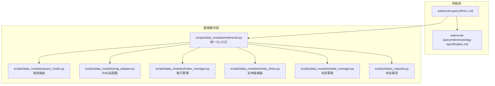
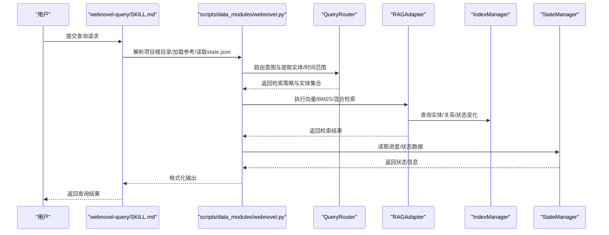
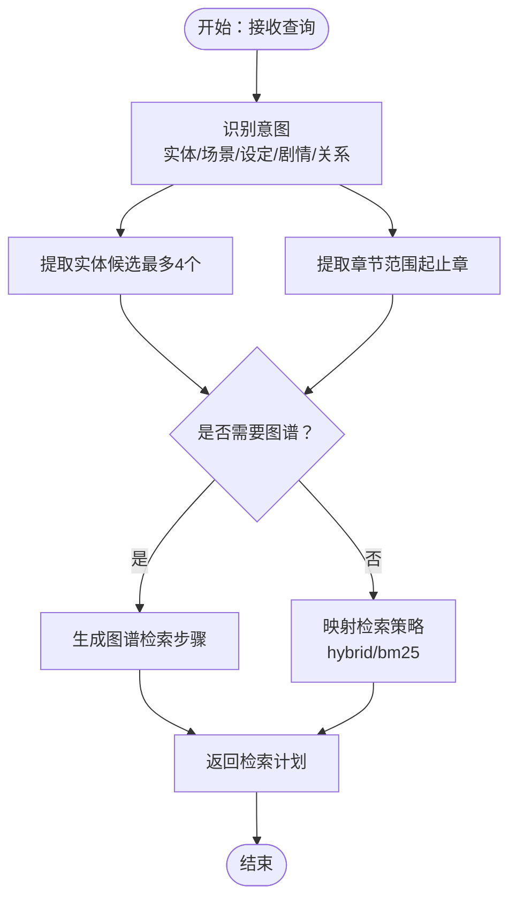
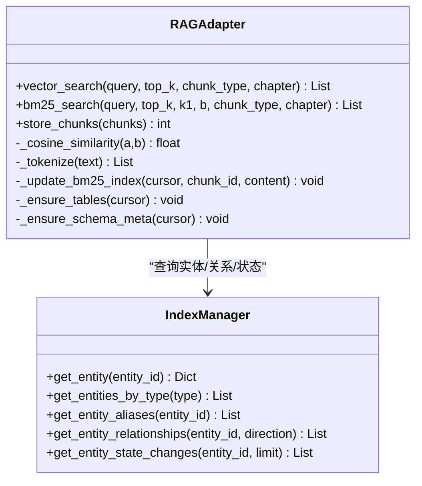
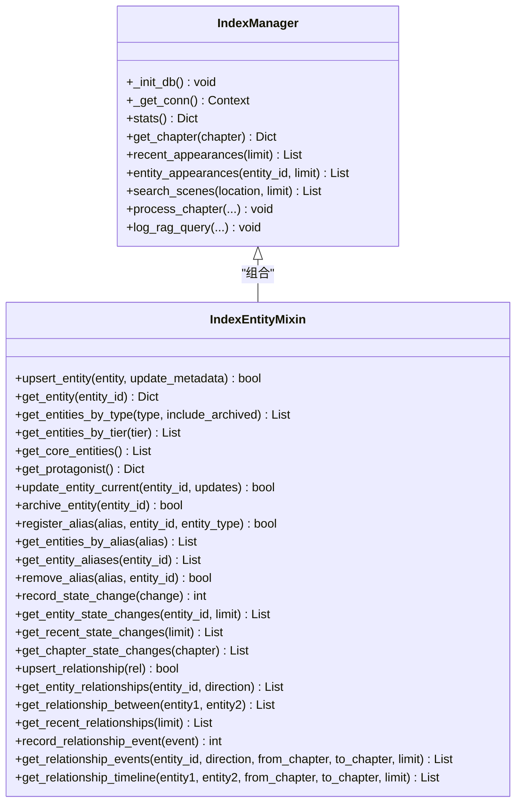
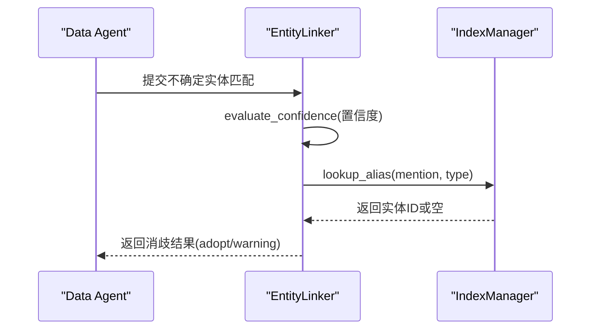
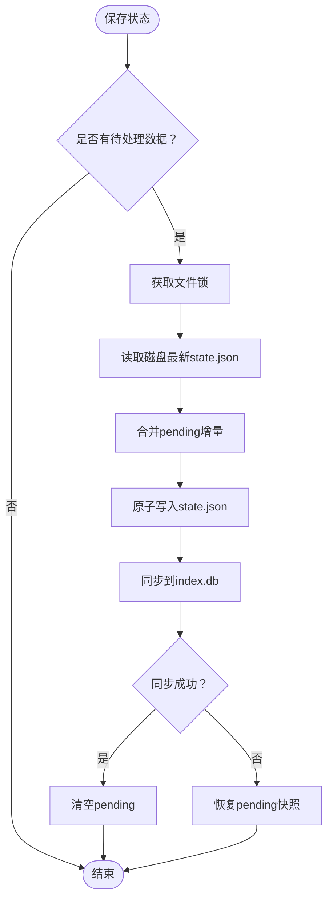
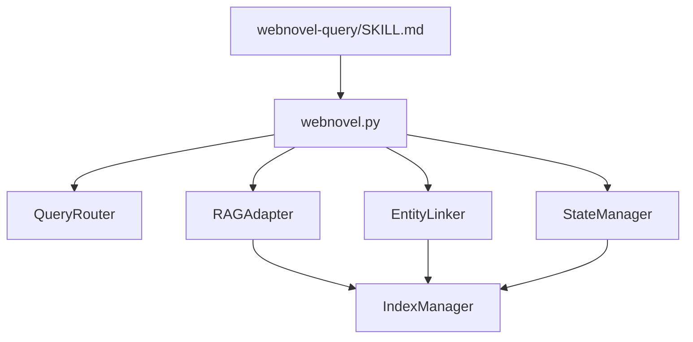

# 查询技能 (webnovel-query)

<cite>
**本文档引用的文件**
- [SKILL.md](file://webnovel-writer/skills/webnovel-query/SKILL.md)
- [tag-specification.md](file://webnovel-writer/skills/webnovel-query/references/tag-specification.md)
- [webnovel.py](file://webnovel-writer/scripts/data_modules/webnovel.py)
- [query_router.py](file://webnovel-writer/scripts/data_modules/query_router.py)
- [entity_linker.py](file://webnovel-writer/scripts/data_modules/entity_linker.py)
- [index_manager.py](file://webnovel-writer/scripts/data_modules/index_manager.py)
- [index_entity_mixin.py](file://webnovel-writer/scripts/data_modules/index_entity_mixin.py)
- [rag_adapter.py](file://webnovel-writer/scripts/data_modules/rag_adapter.py)
- [state_manager.py](file://webnovel-writer/scripts/data_modules/state_manager.py)
- [status_reporter.py](file://webnovel-writer/scripts/status_reporter.py)
- [test_webnovel_unified_cli.py](file://webnovel-writer/scripts/data_modules/tests/test_webnovel_unified_cli.py)
</cite>

## 目录
1. [简介](#简介)
2. [项目结构](#项目结构)
3. [核心组件](#核心组件)
4. [架构总览](#架构总览)
5. [详细组件分析](#详细组件分析)
6. [依赖分析](#依赖分析)
7. [性能考虑](#性能考虑)
8. [故障排查指南](#故障排查指南)
9. [结论](#结论)
10. [附录](#附录)

## 简介
本文件是 webnovel-query 查询技能的详细技术文档，聚焦于项目数据查询与信息检索的核心能力。内容涵盖实体查询、关系检索、章节索引与状态查询的实现机制，解释查询语法规范、标签系统与过滤条件的使用方法，并提供高级查询模式、复合条件与排序规则的实现思路。同时，文档阐述查询技能与 RAG 系统的集成方式与数据同步机制，给出查询示例、最佳实践与调试技巧，帮助开发者与使用者高效、准确地进行故事世界的数据检索与一致性验证。

## 项目结构
webnovel-query 技能位于 skills/webnovel-query 目录，配合 scripts/data_modules 中的统一 CLI 与数据模块，形成“技能层 + 数据层”的查询架构。技能层负责意图识别、参考文件加载与输出格式化；数据层负责索引管理、实体/关系/状态变更的持久化与检索。

图表来源
- [SKILL.md:1-193](file://webnovel-writer/skills/webnovel-query/SKILL.md#L1-L193)
- [webnovel.py:1-312](file://webnovel-writer/scripts/data_modules/webnovel.py#L1-L312)
- [query_router.py:1-145](file://webnovel-writer/scripts/data_modules/query_router.py#L1-L145)
- [rag_adapter.py:1-800](file://webnovel-writer/scripts/data_modules/rag_adapter.py#L1-L800)
- [index_manager.py:1-800](file://webnovel-writer/scripts/data_modules/index_manager.py#L1-L800)
- [entity_linker.py:1-275](file://webnovel-writer/scripts/data_modules/entity_linker.py#L1-L275)
- [state_manager.py:1-800](file://webnovel-writer/scripts/data_modules/state_manager.py#L1-L800)
- [status_reporter.py:1-200](file://webnovel-writer/scripts/status_reporter.py#L1-L200)

章节来源
- [SKILL.md:1-193](file://webnovel-writer/skills/webnovel-query/SKILL.md#L1-L193)
- [webnovel.py:1-312](file://webnovel-writer/scripts/data_modules/webnovel.py#L1-L312)

## 核心组件
- 技能入口与工作流
  - 技能通过 bash 环境变量解析项目根目录，加载参考文件与 state.json，执行查询并格式化输出。
  - 参考文件加载策略分为 L1/L2 级别，按查询类型动态加载。
- 查询路由与意图识别
  - QueryRouter 基于关键词与正则识别查询意图（实体/场景/设定/剧情/关系），并提取实体与时间范围。
- RAG 检索与混合检索
  - RAGAdapter 封装向量检索、BM25 关键词检索与混合检索，支持章节范围与类型过滤。
- 索引与实体/关系管理
  - IndexManager 提供章节、场景、实体、别名、状态变化、关系、关系事件等索引与查询接口。
  - IndexEntityMixin 提供实体增删改查、别名管理、状态变化与关系管理的实现。
- 实体链接与消歧
  - EntityLinker 提供别名注册、查找与置信度评估，辅助 Data Agent 进行实体消歧。
- 状态管理与一致性
  - StateManager 管理 state.json 的读写与 SQLite 同步，提供进度、实体、关系与状态变更的统一接口。
- 状态报告与可视化
  - StatusReporter 生成角色活跃度、伏笔紧急度、节奏分布等可视化报告，支撑查询结果的一致性检查。

章节来源
- [SKILL.md:34-193](file://webnovel-writer/skills/webnovel-query/SKILL.md#L34-L193)
- [query_router.py:10-145](file://webnovel-writer/scripts/data_modules/query_router.py#L10-L145)
- [rag_adapter.py:68-800](file://webnovel-writer/scripts/data_modules/rag_adapter.py#L68-L800)
- [index_manager.py:228-800](file://webnovel-writer/scripts/data_modules/index_manager.py#L228-L800)
- [index_entity_mixin.py:20-800](file://webnovel-writer/scripts/data_modules/index_entity_mixin.py#L20-L800)
- [entity_linker.py:36-275](file://webnovel-writer/scripts/data_modules/entity_linker.py#L36-L275)
- [state_manager.py:90-800](file://webnovel-writer/scripts/data_modules/state_manager.py#L90-L800)
- [status_reporter.py:126-200](file://webnovel-writer/scripts/status_reporter.py#L126-L200)

## 架构总览
webnovel-query 的查询链路从技能层开始，经由统一 CLI 入口，进入查询路由与 RAG 检索，最终落到索引与状态管理模块，形成“意图识别 → 检索策略 → 结果聚合 → 输出格式化”的闭环。

图表来源
- [SKILL.md:34-193](file://webnovel-writer/skills/webnovel-query/SKILL.md#L34-L193)
- [webnovel.py:189-312](file://webnovel-writer/scripts/data_modules/webnovel.py#L189-L312)
- [query_router.py:67-145](file://webnovel-writer/scripts/data_modules/query_router.py#L67-L145)
- [rag_adapter.py:560-800](file://webnovel-writer/scripts/data_modules/rag_adapter.py#L560-L800)
- [index_manager.py:637-800](file://webnovel-writer/scripts/data_modules/index_manager.py#L637-L800)
- [state_manager.py:595-800](file://webnovel-writer/scripts/data_modules/state_manager.py#L595-L800)

## 详细组件分析

### 查询路由与意图识别（QueryRouter）
- 功能要点
  - 基于关键词与正则表达式识别查询意图（实体/场景/设定/剧情/关系）。
  - 提取查询中的实体候选与章节范围（支持“第X章到Y章”、“第X章”等格式）。
  - 生成检索步骤（graph_lookup/graph_hybrid/hybrid/bm25）。
- 复杂度与性能
  - 正则匹配与候选提取为 O(n)（n 为查询长度），整体开销较小。
- 错误处理
  - 时间范围解析失败时返回空范围，不影响其他检索策略。

图表来源
- [query_router.py:67-145](file://webnovel-writer/scripts/data_modules/query_router.py#L67-L145)

章节来源
- [query_router.py:10-145](file://webnovel-writer/scripts/data_modules/query_router.py#L10-L145)

### RAG 检索与混合检索（RAGAdapter）
- 功能要点
  - 向量检索：调用嵌入 API 获取查询向量，遍历 vectors 表计算余弦相似度，支持按章节与类型过滤。
  - BM25 检索：对内容分词后构建倒排索引与文档统计，按 BM25 公式打分。
  - 混合检索：结合向量与 BM25 结果进行重排序。
  - Schema 管理：自动迁移 vectors 表结构，备份与恢复。
- 性能特性
  - 向量检索：O(N) 遍历 vectors 表，受索引与过滤条件影响。
  - BM25 检索：O(T×D)（T 为查询词数，D 为含该词的文档数）。
  - 参数控制：vector_top_k、bm25_top_k 控制返回数量。
- 错误处理
  - 嵌入失败时进入降级模式，记录失败原因并返回空结果。

图表来源
- [rag_adapter.py:68-800](file://webnovel-writer/scripts/data_modules/rag_adapter.py#L68-L800)
- [index_manager.py:228-800](file://webnovel-writer/scripts/data_modules/index_manager.py#L228-L800)

章节来源
- [rag_adapter.py:68-800](file://webnovel-writer/scripts/data_modules/rag_adapter.py#L68-L800)
- [index_manager.py:228-800](file://webnovel-writer/scripts/data_modules/index_manager.py#L228-L800)

### 索引管理与实体/关系（IndexManager/IndexEntityMixin）
- 功能要点
  - 章节与场景索引：提供章节元数据、场景元数据的查询接口。
  - 实体管理：upsert_entity、get_entity、get_entities_by_type、get_entities_by_tier、get_core_entities、get_protagonist、update_entity_current、archive_entity。
  - 别名管理：register_alias、get_entities_by_alias、get_entity_aliases、remove_alias。
  - 状态变化：record_state_change、get_entity_state_changes、get_recent_state_changes、get_chapter_state_changes。
  - 关系管理：upsert_relationship、get_entity_relationships、get_relationship_between、get_recent_relationships。
  - 关系事件与时序：record_relationship_event、get_relationship_events、get_relationship_timeline、加载章节截面有效关系边。
- 性能特性
  - 多处索引（entities、aliases、state_changes、relationships、relationship_events 等）提升查询效率。
  - 支持按类型、层级、章节范围过滤，降低扫描范围。
- 错误处理
  - JSON 解析异常时记录警告并继续处理。

图表来源
- [index_entity_mixin.py:20-800](file://webnovel-writer/scripts/data_modules/index_entity_mixin.py#L20-L800)
- [index_manager.py:228-800](file://webnovel-writer/scripts/data_modules/index_manager.py#L228-L800)

章节来源
- [index_entity_mixin.py:20-800](file://webnovel-writer/scripts/data_modules/index_entity_mixin.py#L20-L800)
- [index_manager.py:228-800](file://webnovel-writer/scripts/data_modules/index_manager.py#L228-L800)

### 实体链接与消歧（EntityLinker）
- 功能要点
  - 别名注册与查找：register_alias、lookup_alias、lookup_alias_all、get_all_aliases。
  - 置信度评估：evaluate_confidence，根据阈值返回 auto/warn/manual。
  - 批量处理：process_extraction_result，汇总不确定匹配并生成警告。
  - 新实体注册：register_new_entities，批量注册主名称与提及方式。
- 性能特性
  - 基于 SQLite 的别名表与索引，查找复杂度近似 O(1)。
- 错误处理
  - 参数校验失败返回 False/None，避免无效写入。

图表来源
- [entity_linker.py:36-275](file://webnovel-writer/scripts/data_modules/entity_linker.py#L36-L275)
- [index_manager.py:228-800](file://webnovel-writer/scripts/data_modules/index_manager.py#L228-L800)

章节来源
- [entity_linker.py:36-275](file://webnovel-writer/scripts/data_modules/entity_linker.py#L36-L275)
- [index_manager.py:228-800](file://webnovel-writer/scripts/data_modules/index_manager.py#L228-L800)

### 状态管理与一致性（StateManager）
- 功能要点
  - 进度管理：update_progress、get_current_chapter。
  - 实体管理：add_entity、update_entity、get_entity、get_all_entities、get_entities_by_type、get_entities_by_tier。
  - 关系管理：upsert_relationship、get_entity_relationships。
  - 状态变化：record_state_change、get_entity_state_changes。
  - 原子写入：save_state，使用文件锁合并 pending 数据，避免并发覆盖。
  - SQLite 同步：_sync_to_sqlite/_sync_pending_patches_to_sqlite，确保 state.json 与 index.db 一致。
- 性能特性
  - pending 队列合并写入，减少磁盘 IO。
  - SQLite 同步失败时保留 pending，避免数据丢失。
- 错误处理
  - 文件锁超时抛出异常，提示稍后重试。

图表来源
- [state_manager.py:208-370](file://webnovel-writer/scripts/data_modules/state_manager.py#L208-L370)

章节来源
- [state_manager.py:90-800](file://webnovel-writer/scripts/data_modules/state_manager.py#L90-L800)

### 状态报告与可视化（StatusReporter）
- 功能要点
  - 角色活跃度分析：统计最后出场章节与缺勤时长，标记掉线状态。
  - 伏笔紧急度分析：基于层级权重与章节跨度计算紧急度，支持“核心/支线/装饰”三层。
  - 节奏分析：基于 Strand Weave 三线（Quest/Fire/Constellation）统计与趋势。
  - 输出：Markdown 报告，包含 Mermaid 图表。
- 与查询技能的衔接
  - 技能可通过 status 子命令快速获取“urgency/strand”等关键指标，作为查询结果的补充。

章节来源
- [status_reporter.py:126-200](file://webnovel-writer/scripts/status_reporter.py#L126-L200)
- [SKILL.md:149-170](file://webnovel-writer/skills/webnovel-query/SKILL.md#L149-L170)

## 依赖分析
- 技能层依赖
  - bash 环境变量解析项目根目录，依赖 scripts/data_modules/webnovel.py 的 where/use 命令。
  - 参考文件依赖：tag-specification.md、system-data-flow.md、strand-weave-pattern.md、foreshadowing.md。
- 数据模块依赖
  - webnovel.py 作为统一入口，将参数规范化并转发至具体模块。
  - RAGAdapter 依赖 IndexManager 与 QueryRouter。
  - EntityLinker 依赖 IndexManager 的别名与实体查询接口。
  - StateManager 依赖 SQLite 同步（SQLStateManager）与安全写入工具。

图表来源
- [webnovel.py:189-312](file://webnovel-writer/scripts/data_modules/webnovel.py#L189-L312)
- [query_router.py:10-145](file://webnovel-writer/scripts/data_modules/query_router.py#L10-L145)
- [rag_adapter.py:68-800](file://webnovel-writer/scripts/data_modules/rag_adapter.py#L68-L800)
- [entity_linker.py:36-275](file://webnovel-writer/scripts/data_modules/entity_linker.py#L36-L275)
- [state_manager.py:90-800](file://webnovel-writer/scripts/data_modules/state_manager.py#L90-L800)
- [index_manager.py:228-800](file://webnovel-writer/scripts/data_modules/index_manager.py#L228-L800)

章节来源
- [webnovel.py:189-312](file://webnovel-writer/scripts/data_modules/webnovel.py#L189-L312)
- [SKILL.md:34-193](file://webnovel-writer/skills/webnovel-query/SKILL.md#L34-L193)

## 性能考虑
- 索引与过滤
  - 利用 SQLite 索引（entities、aliases、state_changes、relationships、relationship_events 等）减少全表扫描。
  - 在查询中尽可能提供章节范围与类型过滤，缩小检索范围。
- 检索策略
  - 向量检索适合语义相似度，BM25 适合关键词精确匹配，混合检索可兼顾两者。
  - 控制 top_k 数量，避免返回过多结果造成前端渲染压力。
- 写入与同步
  - StateManager 使用 pending 队列与原子写入，减少锁竞争与磁盘 IO。
  - SQLite 同步失败时保留 pending，避免数据丢失。
- 缓存与降级
  - RAGAdapter 在嵌入 API 失败时进入降级模式，记录失败原因，保证服务可用性。

[本节为通用性能指导，无需特定文件引用]

## 故障排查指南
- 项目根目录解析失败
  - 确认 CLAUDE_PLUGIN_ROOT 与 CLAUDE_PROJECT_DIR 设置正确，使用 webnovel.py where 校验解析结果。
- 参考文件加载问题
  - 检查 L1/L2 加载策略是否与查询类型匹配，确保所需参考文件存在。
- RAG 检索无结果
  - 检查 vectors 表是否为空或 schema 是否需要迁移；确认嵌入 API 可用。
- 实体消歧置信度过低
  - 使用 EntityLinker 的置信度评估结果，必要时手动确认或补充别名。
- 状态不一致
  - 使用 StatusReporter 生成健康报告，核对角色活跃度、伏笔紧急度与节奏分布。
- CLI 行为验证
  - 通过测试用例验证 CLI 行为（如 extract-context 的参数转发），确保 --project-root 正确传递。

章节来源
- [webnovel.py:189-312](file://webnovel-writer/scripts/data_modules/webnovel.py#L189-L312)
- [test_webnovel_unified_cli.py:49-169](file://webnovel-writer/scripts/data_modules/tests/test_webnovel_unified_cli.py#L49-L169)
- [rag_adapter.py:83-118](file://webnovel-writer/scripts/data_modules/rag_adapter.py#L83-L118)
- [entity_linker.py:76-145](file://webnovel-writer/scripts/data_modules/entity_linker.py#L76-L145)
- [status_reporter.py:126-200](file://webnovel-writer/scripts/status_reporter.py#L126-L200)

## 结论
webnovel-query 查询技能通过“技能层 + 数据模块层”的协同，实现了从意图识别到检索执行再到结果输出的完整链路。借助 RAG 检索、索引管理与状态报告，系统能够高效、准确地支持实体查询、关系检索、章节索引与状态查询，并提供可视化与一致性检查能力。配合标签系统与过滤条件，用户可以灵活构建高级查询模式与复合条件，满足复杂故事世界的检索需求。

[本节为总结性内容，无需特定文件引用]

## 附录

### 查询语法规范与标签系统
- 标签系统
  - XML 标签用于手动标注实体、技能、关系、伏笔与大纲偏离，支持自动从正文提取实体写入 index.db。
  - 标签放置规则：推荐章节末尾统一放置，要求标签独占一行。
- 标签总览
  - entity、entity-alias、entity-update、skill、foreshadow、relationship、deviation。
- 属性与层级
  - tier（核心/支线/装饰）、type（角色/地点/物品/势力/招式）、id/ref（实体引用）。
- 示例与错误规范
  - 提供多种标签使用示例与常见错误修正建议。

章节来源
- [tag-specification.md:1-155](file://webnovel-writer/skills/webnovel-query/references/tag-specification.md#L1-L155)

### 高级查询模式与复合条件
- 复合条件
  - 结合 QueryRouter 的实体提取与时间范围，构造“实体+章节范围+类型”的复合查询。
- 排序规则
  - 向量检索按相似度降序，BM25 按 BM25 分数降序，混合检索按融合分数排序。
- 图谱增强
  - 对关系查询使用 graph_hybrid 策略，结合图谱证据与实体检索提升准确性。

章节来源
- [query_router.py:86-145](file://webnovel-writer/scripts/data_modules/query_router.py#L86-L145)
- [rag_adapter.py:560-800](file://webnovel-writer/scripts/data_modules/rag_adapter.py#L560-L800)

### 查询示例与最佳实践
- 示例
  - “角色/主角/配角” → 标准查询（匹配主角卡与角色库）。
  - “境界/筑基/金丹” → 力量体系查询。
  - “伏笔/紧急伏笔” → 三层分类与紧急度计算。
  - “金手指/系统” → 金手指状态查询。
  - “节奏/Strand” → Strand 节奏分析。
  - “标签/实体格式” → 标签格式查询。
- 最佳实践
  - 明确查询类型，按需加载参考文件。
  - 使用章节范围限定检索范围，提高响应速度。
  - 结合状态报告与一致性检查，确保查询结果与项目状态一致。

章节来源
- [SKILL.md:66-193](file://webnovel-writer/skills/webnovel-query/SKILL.md#L66-L193)