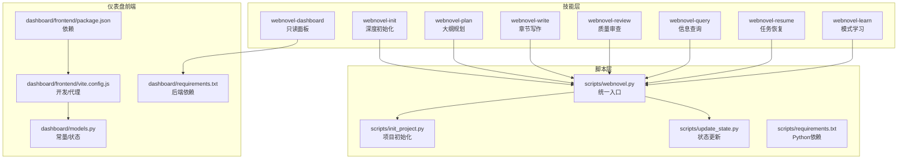
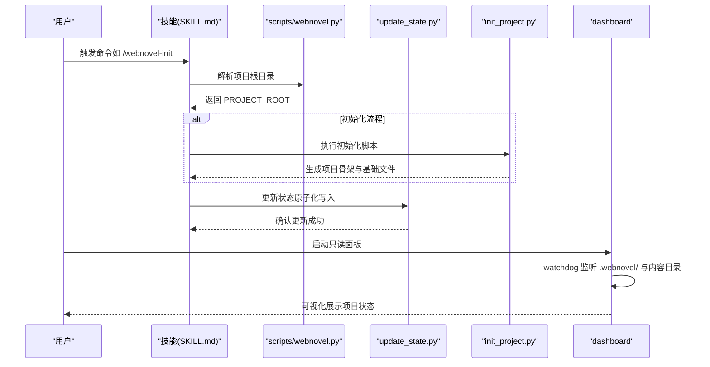
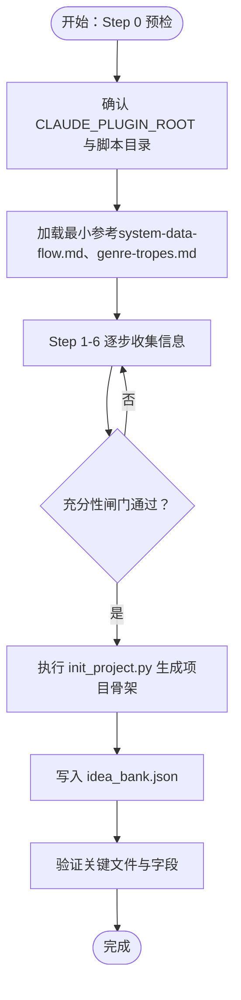
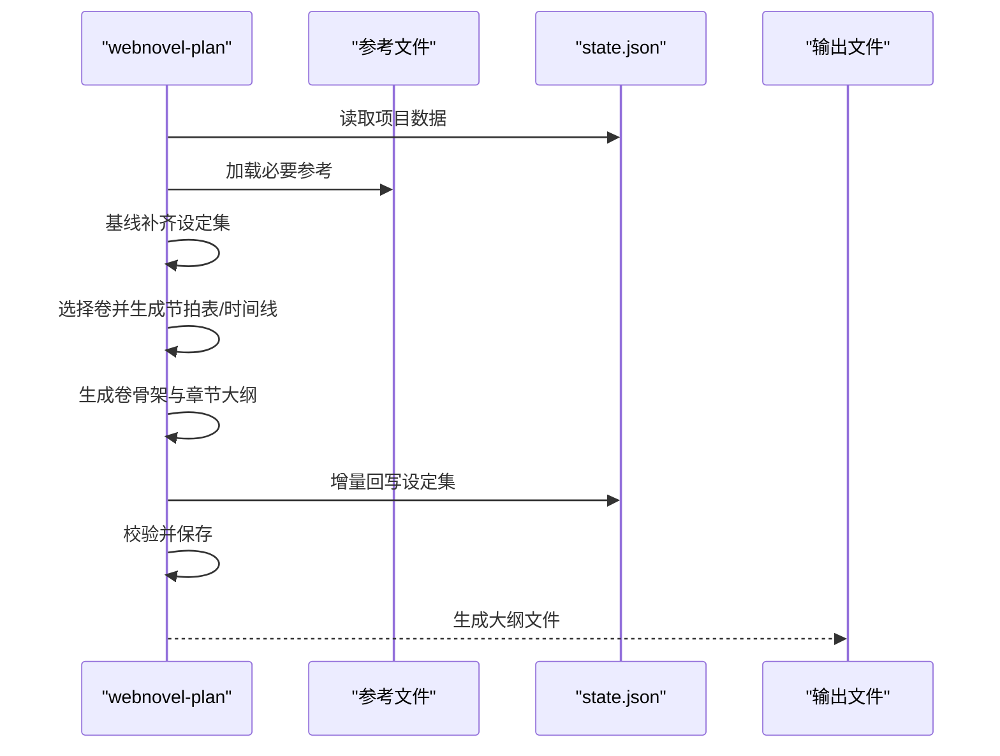
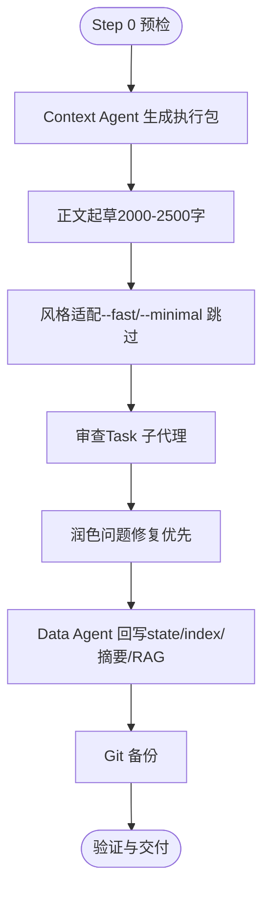
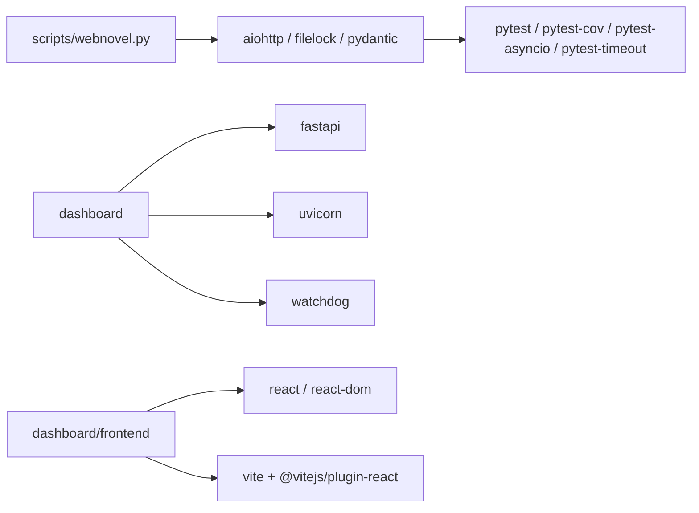

# 自定义开发指南

<cite>
**本文档引用的文件**
- [webnovel-dashboard/SKILL.md](file://webnovel-writer/skills/webnovel-dashboard/SKILL.md)
- [webnovel-init/SKILL.md](file://webnovel-writer/skills/webnovel-init/SKILL.md)
- [webnovel-plan/SKILL.md](file://webnovel-writer/skills/webnovel-plan/SKILL.md)
- [webnovel-write/SKILL.md](file://webnovel-writer/skills/webnovel-write/SKILL.md)
- [webnovel-review/SKILL.md](file://webnovel-writer/skills/webnovel-review/SKILL.md)
- [webnovel-query/SKILL.md](file://webnovel-writer/skills/webnovel-query/SKILL.md)
- [webnovel-resume/SKILL.md](file://webnovel-writer/skills/webnovel-resume/SKILL.md)
- [webnovel-learn/SKILL.md](file://webnovel-writer/skills/webnovel-learn/SKILL.md)
- [webnovel.py](file://webnovel-writer/scripts/webnovel.py)
- [init_project.py](file://webnovel-writer/scripts/init_project.py)
- [update_state.py](file://webnovel-writer/scripts/update_state.py)
- [models.py](file://webnovel-writer/dashboard/models.py)
- [package.json](file://webnovel-writer/dashboard/frontend/package.json)
- [vite.config.js](file://webnovel-writer/dashboard/frontend/vite.config.js)
- [requirements.txt](file://webnovel-writer/dashboard/requirements.txt)
- [scripts-requirements.txt](file://webnovel-writer/scripts/requirements.txt)
</cite>

## 目录
1. [简介](#简介)
2. [项目结构](#项目结构)
3. [核心组件](#核心组件)
4. [架构总览](#架构总览)
5. [详细组件分析](#详细组件分析)
6. [依赖分析](#依赖分析)
7. [性能考量](#性能考量)
8. [故障排查指南](#故障排查指南)
9. [结论](#结论)
10. [附录](#附录)

## 简介
本指南面向希望在现有系统基础上开发“自定义技能”的工程师与创作者，系统阐述技能设计原则、实现框架、开发规范与最佳实践。文档以项目中的既有技能为蓝本，总结其模板、配置文件与接口定义的标准格式，给出调试、测试、部署与扩展示例，并覆盖与现有系统的集成、兼容性与版本管理策略。

## 项目结构
该项目围绕“网文创作工作流”构建，包含技能（Skill）层、脚本（Scripts）层与仪表盘（Dashboard）前端。技能层提供可编排的创作动作（如初始化、规划、写作、审查、查询、恢复、学习），脚本层提供统一入口与数据状态管理，仪表盘提供只读可视化面板。

**图表来源**
- [webnovel.py:1-37](file://webnovel-writer/scripts/webnovel.py#L1-L37)
- [init_project.py:1-845](file://webnovel-writer/scripts/init_project.py#L1-L845)
- [update_state.py:1-634](file://webnovel-writer/scripts/update_state.py#L1-L634)
- [webnovel-dashboard/SKILL.md:1-81](file://webnovel-writer/skills/webnovel-dashboard/SKILL.md#L1-L81)
- [package.json:1-23](file://webnovel-writer/dashboard/frontend/package.json#L1-L23)
- [vite.config.js:1-16](file://webnovel-writer/dashboard/frontend/vite.config.js#L1-L16)
- [models.py:1-23](file://webnovel-writer/dashboard/models.py#L1-L23)
- [requirements.txt:1-4](file://webnovel-writer/dashboard/requirements.txt#L1-L4)
- [scripts-requirements.txt:1-14](file://webnovel-writer/scripts/requirements.txt#L1-L14)

**章节来源**
- [webnovel.py:1-37](file://webnovel-writer/scripts/webnovel.py#L1-L37)
- [webnovel-dashboard/SKILL.md:1-81](file://webnovel-writer/skills/webnovel-dashboard/SKILL.md#L1-L81)
- [package.json:1-23](file://webnovel-writer/dashboard/frontend/package.json#L1-L23)
- [vite.config.js:1-16](file://webnovel-writer/dashboard/frontend/vite.config.js#L1-L16)
- [models.py:1-23](file://webnovel-writer/dashboard/models.py#L1-L23)
- [requirements.txt:1-4](file://webnovel-writer/dashboard/requirements.txt#L1-L4)
- [scripts-requirements.txt:1-14](file://webnovel-writer/scripts/requirements.txt#L1-L14)

## 核心组件
- 技能（Skill）：以 SKILL.md 为模板的可编排动作，定义目标、执行原则、引用加载策略、工具策略、交互流程、充分性闸门与验证交付标准。
- 脚本（Scripts）：统一入口脚本与数据状态管理脚本，提供安全的原子化写入、备份与校验。
- 仪表盘（Dashboard）：只读 Web 面板，监听项目目录变更并可视化展示项目状态、实体图谱与章节内容。

关键要点
- 技能模板：每个技能以 YAML 头部声明 name、description、allowed-tools，正文为步骤化文档。
- 引用加载：采用“严格/惰性”加载策略，按步骤按需加载参考文件，避免一次性灌入。
- 工具策略：明确允许的工具集（Read/Write/Edit/Grep/Bash/Task/AskUserQuestion/WebSearch/WebFetch），并给出触发条件。
- 数据流：统一通过 scripts/webnovel.py 解析项目根目录，确保 PROJECT_ROOT 准确指向包含 .webnovel/state.json 的真实项目根。

**章节来源**
- [webnovel-init/SKILL.md:1-435](file://webnovel-writer/skills/webnovel-init/SKILL.md#L1-L435)
- [webnovel-plan/SKILL.md:1-480](file://webnovel-writer/skills/webnovel-plan/SKILL.md#L1-L480)
- [webnovel-write/SKILL.md:1-381](file://webnovel-writer/skills/webnovel-write/SKILL.md#L1-L381)
- [webnovel-review/SKILL.md:1-195](file://webnovel-writer/skills/webnovel-review/SKILL.md#L1-L195)
- [webnovel-query/SKILL.md:1-193](file://webnovel-writer/skills/webnovel-query/SKILL.md#L1-L193)
- [webnovel-resume/SKILL.md:1-203](file://webnovel-writer/skills/webnovel-resume/SKILL.md#L1-L203)
- [webnovel-learn/SKILL.md:1-46](file://webnovel-writer/skills/webnovel-learn/SKILL.md#L1-L46)

## 架构总览
系统采用“技能编排 + 脚本统一入口 + 状态中心”的架构。技能通过 bash 步骤调用 scripts/webnovel.py 与各类数据模块，状态通过 update_state.py 原子化更新，仪表盘通过 watchdog 监听项目目录并提供只读可视化。

**图表来源**
- [webnovel.py:1-37](file://webnovel-writer/scripts/webnovel.py#L1-L37)
- [init_project.py:1-845](file://webnovel-writer/scripts/init_project.py#L1-L845)
- [update_state.py:1-634](file://webnovel-writer/scripts/update_state.py#L1-L634)
- [webnovel-dashboard/SKILL.md:1-81](file://webnovel-writer/skills/webnovel-dashboard/SKILL.md#L1-L81)

## 详细组件分析

### webnovel-init（深度初始化）
- 目标：通过分阶段交互收集完整创作信息，生成可直接进入规划与写作的项目骨架与约束文件。
- 执行原则：先收集再生成；分波次提问；按需加载参考；充分性闸门通过后才执行生成。
- 引用加载：分级加载（L0/L1/L2/L3），避免一次性灌入。
- 工具策略：Read/Grep/Bash/Task/AskUserQuestion/WebSearch/WebFetch。
- 数据模型：内部收集对象包含 project、protagonist、relationship、golden_finger、world、constraints 等字段。
- 生成流程：调用 scripts/webnovel.py init，写入 state.json、idea_bank.json、设定集与大纲模板文件。
- 验证与交付：检查关键文件存在性与字段完整性；失败时最小回滚。

**图表来源**
- [webnovel-init/SKILL.md:124-435](file://webnovel-writer/skills/webnovel-init/SKILL.md#L124-L435)
- [init_project.py:227-755](file://webnovel-writer/scripts/init_project.py#L227-L755)

**章节来源**
- [webnovel-init/SKILL.md:1-435](file://webnovel-writer/skills/webnovel-init/SKILL.md#L1-L435)
- [init_project.py:1-845](file://webnovel-writer/scripts/init_project.py#L1-L845)

### webnovel-plan（大纲规划）
- 目标：将总纲细化为卷与章节大纲，继承创意约束，准备写作就绪的章节计划。
- 工作流：加载项目数据 → 基线补齐设定集 → 选择卷 → 生成节拍表与时间线 → 生成卷骨架 → 批量生成章节大纲 → 增量回写设定集 → 校验与保存。
- 参考加载：严格/惰性加载，按步骤加载“必读/可选”参考。
- 校验规则：包含爽点密度、Strand 比例、总纲一致性、约束触发频率、完整性检查与时间线一致性检查。
- 失败处理：最小回滚，仅重跑失败批次。

**图表来源**
- [webnovel-plan/SKILL.md:54-480](file://webnovel-writer/skills/webnovel-plan/SKILL.md#L54-L480)

**章节来源**
- [webnovel-plan/SKILL.md:1-480](file://webnovel-writer/skills/webnovel-plan/SKILL.md#L1-L480)

### webnovel-write（章节写作）
- 目标：以稳定流程产出可发布章节，保证审查、润色、数据回写的完整闭环。
- 模式：默认/快速/最小三种模式，严格约束步骤顺序与产物命名。
- 工具策略：Read/Grep/Bash/Task，Task 子代理执行审查。
- 审查与落库：统一通过 scripts/webnovel.py index save-review-metrics 落库 review_metrics。
- 数据回写：Data Agent 负责上下文加载、实体提取、消歧、写入 state/index、摘要、RAG 索引、风格样本评估与债务利息。
- 失败处理：最小回滚，仅重跑失败步骤。

**图表来源**
- [webnovel-write/SKILL.md:109-381](file://webnovel-writer/skills/webnovel-write/SKILL.md#L109-L381)

**章节来源**
- [webnovel-write/SKILL.md:1-381](file://webnovel-writer/skills/webnovel-write/SKILL.md#L1-L381)

### webnovel-review（质量审查）
- 目标：并行调用检查员生成报告，保存审查指标到 index.db，并写回 state.json。
- 深度：Core（默认）与 Full（关键章/用户要求）两种深度。
- 工具策略：Task 并行调用子代理，禁止主流程伪造结论。
- 关键流程：加载参考 → 加载项目状态 → 并行调用检查员 → 生成报告 → 保存指标 → 写回 state → 处理关键问题 → 收尾。

**章节来源**
- [webnovel-review/SKILL.md:1-195](file://webnovel-writer/skills/webnovel-review/SKILL.md#L1-L195)

### webnovel-query（信息查询）
- 目标：查询角色、力量、势力、物品、标签与金手指状态，支持节奏与紧急度分析。
- 引用加载：按查询类型加载 system-data-flow.md、strand-weave-pattern.md、tag-specification.md 等。
- 工具策略：Read/Grep/Bash/AskUserQuestion。
- 输出：结构化查询结果与数据一致性检查。

**章节来源**
- [webnovel-query/SKILL.md:1-193](file://webnovel-writer/skills/webnovel-query/SKILL.md#L1-L193)

### webnovel-resume（任务恢复）
- 目标：检测中断点并提供安全恢复选项，禁止智能续写与自动恢复。
- 工具策略：Read/Bash/AskUserQuestion。
- 恢复策略：难度分级（⭐-⭐⭐⭐），提供“删除重来”“Git 回滚”等选项。

**章节来源**
- [webnovel-resume/SKILL.md:1-203](file://webnovel-writer/skills/webnovel-resume/SKILL.md#L1-L203)

### webnovel-learn（模式学习）
- 目标：从当前会话提取成功模式并写入 project_memory.json。
- 工具策略：Read/Write/Bash。
- 约束：不删除旧记录，避免完全重复。

**章节来源**
- [webnovel-learn/SKILL.md:1-46](file://webnovel-writer/skills/webnovel-learn/SKILL.md#L1-L46)

### webnovel-dashboard（只读面板）
- 目标：在本地启动只读 Web 面板，可视化查看项目状态、实体图谱与章节内容。
- 工具策略：Bash Read。
- 安全：严格限制在 PROJECT_ROOT 范围内读取，防止路径穿越；支持自定义端口与禁用自动打开浏览器。

**章节来源**
- [webnovel-dashboard/SKILL.md:1-81](file://webnovel-writer/skills/webnovel-dashboard/SKILL.md#L1-L81)

## 依赖分析
- 统一入口：scripts/webnovel.py 将 .claude/scripts 加入 sys.path，转发到 data_modules.webnovel.main，适配不同安装位置。
- Python 依赖：核心依赖包括 aiohttp、filelock、pydantic；开发/测试依赖包括 pytest、pytest-cov、pytest-asyncio、pytest-timeout。
- 仪表盘依赖：FastAPI、Uvicorn、Watchdog；前端依赖 React、React DOM、Vite 与 React 插件。

**图表来源**
- [webnovel.py:1-37](file://webnovel-writer/scripts/webnovel.py#L1-L37)
- [scripts-requirements.txt:1-14](file://webnovel-writer/scripts/requirements.txt#L1-L14)
- [requirements.txt:1-4](file://webnovel-writer/dashboard/requirements.txt#L1-L4)
- [package.json:1-23](file://webnovel-writer/dashboard/frontend/package.json#L1-L23)

**章节来源**
- [webnovel.py:1-37](file://webnovel-writer/scripts/webnovel.py#L1-L37)
- [scripts-requirements.txt:1-14](file://webnovel-writer/scripts/requirements.txt#L1-L14)
- [requirements.txt:1-4](file://webnovel-writer/dashboard/requirements.txt#L1-L4)
- [package.json:1-23](file://webnovel-writer/dashboard/frontend/package.json#L1-L23)

## 性能考量
- 写作链路性能观测：通过 data_agent_timing.jsonl 记录各子步骤耗时，若外层总耗时远大于内层之和，优先归因为 agent 启动与环境探测开销。
- 读取最近一条 timing 记录并输出最慢 2-3 个环节与原因说明。
- 建议：在高频批处理场景中，优先使用批量生成与并行子任务，减少重复 IO。

**章节来源**
- [webnovel-write/SKILL.md:314-322](file://webnovel-writer/skills/webnovel-write/SKILL.md#L314-L322)

## 故障排查指南
- 项目根目录解析失败：确认 CLAUDE_PLUGIN_ROOT 与脚本目录存在，使用 scripts/webnovel.py where 获取 PROJECT_ROOT。
- 章节文件缺失或空文件：检查 Step 2A 是否成功生成正文；必要时重跑 Step 3 并落库 review_metrics。
- 审查结果未落库：确认 review_metrics JSON 字段完整并通过 scripts/webnovel.py index save-review-metrics。
- Data Agent 关键产物缺失：仅重跑 Step 5，不回滚已通过步骤。
- 润色引入设定冲突：恢复 Step 2A 输出并重做 Step 4。
- 任务中断恢复：使用 /webnovel-resume 检测中断状态，提供“删除重来”“Git 回滚”等选项。

**章节来源**
- [webnovel-write/SKILL.md:366-381](file://webnovel-writer/skills/webnovel-write/SKILL.md#L366-L381)
- [webnovel-resume/SKILL.md:102-203](file://webnovel-writer/skills/webnovel-resume/SKILL.md#L102-L203)

## 结论
本指南基于现有技能与脚本，总结了自定义技能开发的设计原则、实现框架与开发规范。遵循“严格/惰性”引用加载、“充分性闸门”与“最小回滚”的工程实践，可确保技能在复杂创作工作流中的稳定性与可维护性。通过统一入口与状态中心，技能与系统形成清晰的耦合边界，便于扩展与演进。

## 附录

### 技能模板与配置文件标准格式
- 技能头部（YAML）：name、description、allowed-tools。
- 步骤化文档：目标、执行原则、引用加载策略、工具策略、交互流程、充分性闸门、验证与交付、失败处理。
- 参考文件：按步骤导航，采用“必读/可选”清单，支持 L1/L2 加载。

**章节来源**
- [webnovel-init/SKILL.md:1-50](file://webnovel-writer/skills/webnovel-init/SKILL.md#L1-L50)
- [webnovel-plan/SKILL.md:34-53](file://webnovel-writer/skills/webnovel-plan/SKILL.md#L34-L53)
- [webnovel-write/SKILL.md:45-54](file://webnovel-writer/skills/webnovel-write/SKILL.md#L45-L54)
- [webnovel-review/SKILL.md:73-78](file://webnovel-writer/skills/webnovel-review/SKILL.md#L73-L78)
- [webnovel-query/SKILL.md:50-65](file://webnovel-writer/skills/webnovel-query/SKILL.md#L50-L65)

### 接口定义与数据流
- 统一入口：scripts/webnovel.py 提供 preflight/where/index 等命令。
- 状态更新：scripts/update_state.py 提供原子化写入、备份与校验。
- 仪表盘：dashboard 通过 watchdog 监听项目目录，提供只读 API 与前端界面。

**章节来源**
- [webnovel.py:1-37](file://webnovel-writer/scripts/webnovel.py#L1-L37)
- [update_state.py:1-634](file://webnovel-writer/scripts/update_state.py#L1-L634)
- [webnovel-dashboard/SKILL.md:62-81](file://webnovel-writer/skills/webnovel-dashboard/SKILL.md#L62-L81)

### 调试方法与测试策略
- 调试：使用 --dry-run 预览状态更新；通过 data_agent_timing.jsonl 观察性能瓶颈。
- 测试：scripts 层提供 pytest 生态；dashboard 前端使用 Vite 开发服务器与代理配置。

**章节来源**
- [update_state.py:438-441](file://webnovel-writer/scripts/update_state.py#L438-L441)
- [vite.config.js:1-16](file://webnovel-writer/dashboard/frontend/vite.config.js#L1-L16)

### 部署流程
- 仪表盘：安装 FastAPI/Uvicorn/Watchdog，启动 dashboard.server 并监听项目目录。
- 前端：使用 Vite 构建，代理 /api 到本地服务端口。
- Git：项目初始化时可选择性启用 Git 并提交初始骨架。

**章节来源**
- [requirements.txt:1-4](file://webnovel-writer/dashboard/requirements.txt#L1-L4)
- [package.json:1-23](file://webnovel-writer/dashboard/frontend/package.json#L1-L23)
- [vite.config.js:1-16](file://webnovel-writer/dashboard/frontend/vite.config.js#L1-L16)
- [init_project.py:683-755](file://webnovel-writer/scripts/init_project.py#L683-L755)

### 扩展示例与最佳实践
- 扩展建议：新增技能遵循现有模板，明确 allowed-tools 与引用加载策略；通过 scripts/webnovel.py 解析 PROJECT_ROOT；在失败处理中采用最小回滚。
- 最佳实践：严格区分“引用加载”与“执行生成”，在充分性闸门通过后再执行写入；审查与数据回写为硬步骤，不可省略。

**章节来源**
- [webnovel-init/SKILL.md:15-31](file://webnovel-writer/skills/webnovel-init/SKILL.md#L15-L31)
- [webnovel-plan/SKILL.md:54-63](file://webnovel-writer/skills/webnovel-plan/SKILL.md#L54-L63)
- [webnovel-write/SKILL.md:16-44](file://webnovel-writer/skills/webnovel-write/SKILL.md#L16-L44)

### 兼容性要求与版本管理
- Python 版本：脚本层要求 Python >= 3.10。
- 依赖管理：使用 requirements.txt 管理核心与开发依赖；仪表盘前后端分别管理各自依赖。
- 版本同步：通过 scripts/sync_plugin_version.py 与工作流自动化同步版本。

**章节来源**
- [scripts-requirements.txt:1-2](file://webnovel-writer/scripts/requirements.txt#L1-L2)
- [.github/workflows/plugin-release.yml](file://.github/workflows/plugin-release.yml)

### 工具链、IDE 配置与开发环境
- 前端：Vite + React，开发服务器端口与代理配置见 vite.config.js。
- 后端：FastAPI/Uvicorn，支持本地开发与热更新。
- IDE：建议启用 UTF-8 编码与 Python 虚拟环境；前端使用 VS Code + Vite 插件。

**章节来源**
- [vite.config.js:1-16](file://webnovel-writer/dashboard/frontend/vite.config.js#L1-L16)
- [package.json:1-23](file://webnovel-writer/dashboard/frontend/package.json#L1-L23)

### 性能优化与安全考虑
- 性能：批处理生成、并行子任务、性能观测日志；避免一次性加载全部参考。
- 安全：严格限制在 PROJECT_ROOT 范围内读取；使用原子化写入与备份；禁止智能续写与自动恢复。

**章节来源**
- [webnovel-write/SKILL.md:314-322](file://webnovel-writer/skills/webnovel-write/SKILL.md#L314-L322)
- [webnovel-dashboard/SKILL.md:76-81](file://webnovel-writer/skills/webnovel-dashboard/SKILL.md#L76-L81)
- [webnovel-resume/SKILL.md:68-72](file://webnovel-writer/skills/webnovel-resume/SKILL.md#L68-L72)