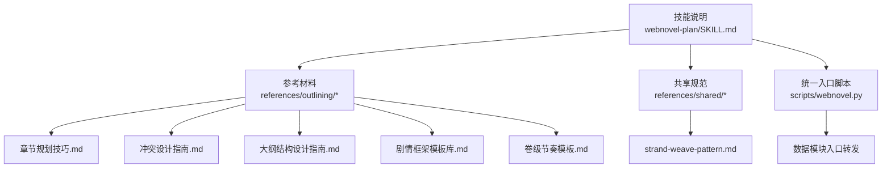
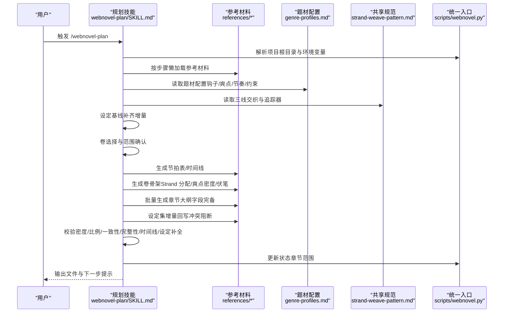
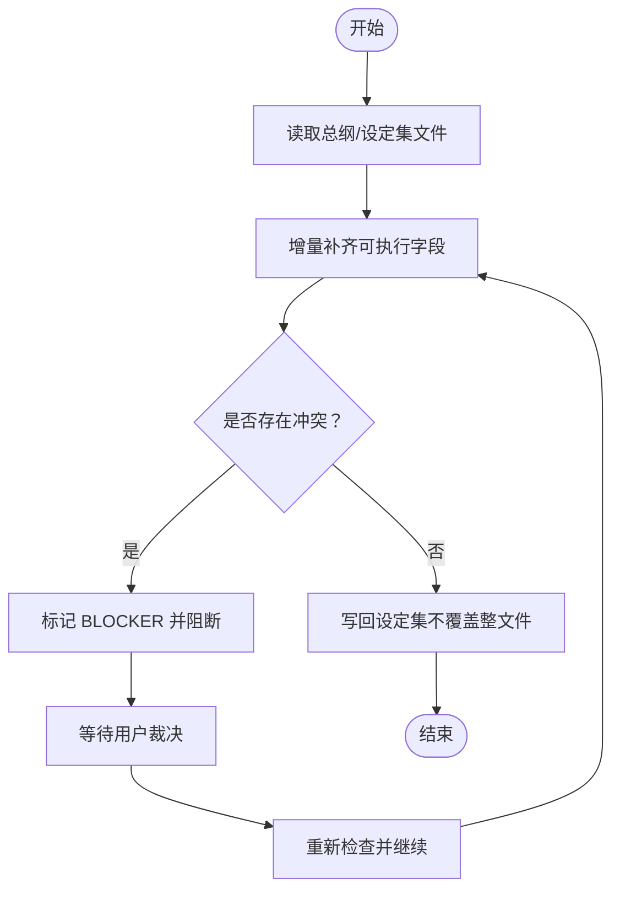
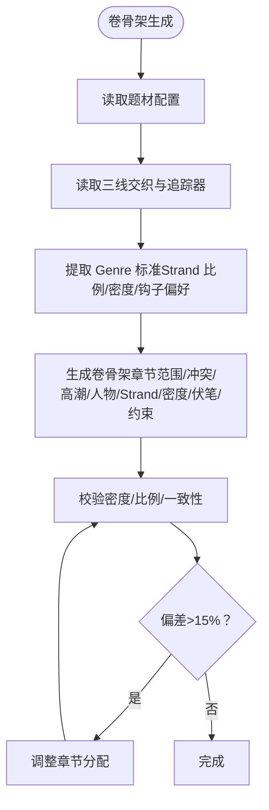
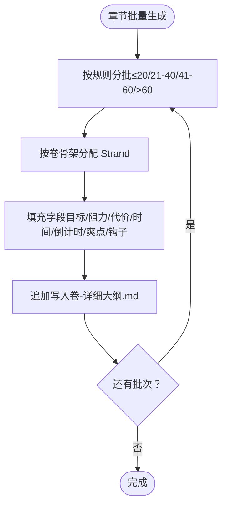
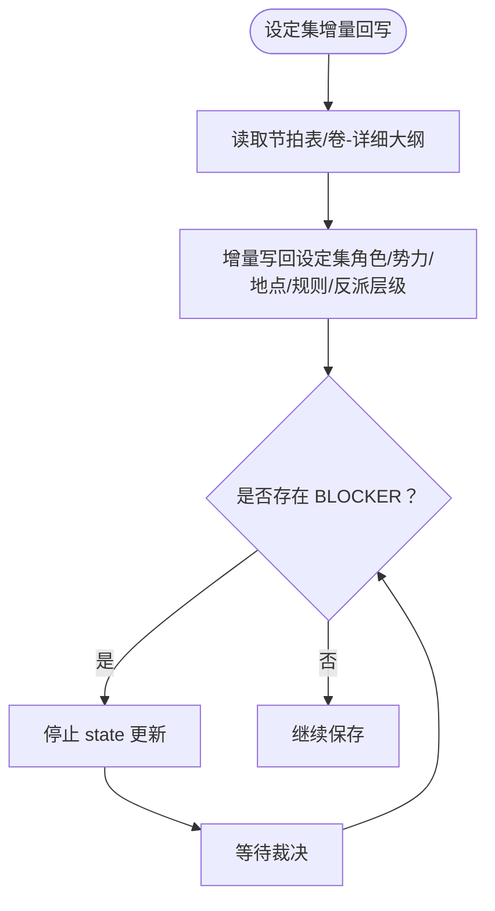
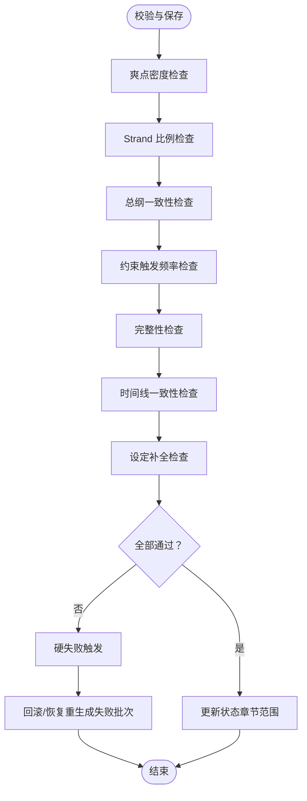
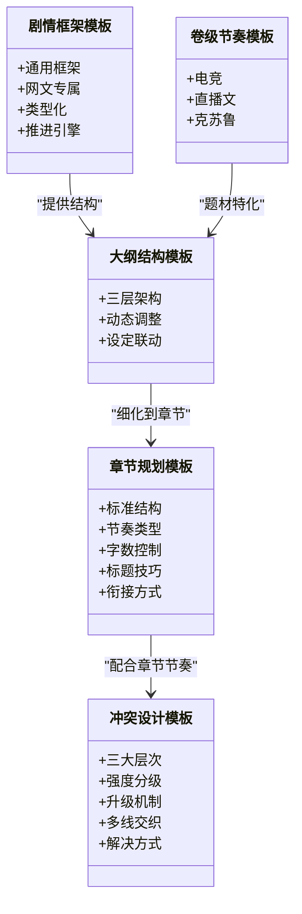
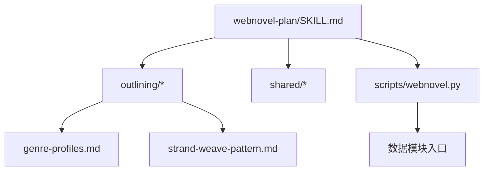

# 规划技能 (webnovel-plan)

<cite>
**本文引用的文件**
- [webnovel-plan/SKILL.md](file://webnovel-writer/skills/webnovel-plan/SKILL.md)
- [章节规划技巧.md](file://webnovel-writer/skills/webnovel-plan/references/outlining/chapter-planning.md)
- [冲突设计指南.md](file://webnovel-writer/skills/webnovel-plan/references/outlining/conflict-design.md)
- [大纲结构设计指南.md](file://webnovel-writer/skills/webnovel-plan/references/outlining/outline-structure.md)
- [剧情框架模板库.md](file://webnovel-writer/skills/webnovel-plan/references/outlining/plot-frameworks.md)
- [题材配置档案.md](file://webnovel-writer/references/genre-profiles.md)
- [strand-weave-pattern.md](file://webnovel-writer/references/shared/strand-weave-pattern.md)
- [卷级节奏模板（电竞/直播/克苏鲁）.md](file://webnovel-writer/skills/webnovel-plan/references/outlining/genre-volume-pacing.md)
- [webnovel.py](file://webnovel-writer/scripts/webnovel.py)
</cite>

## 目录
1. [简介](#简介)
2. [项目结构](#项目结构)
3. [核心组件](#核心组件)
4. [架构总览](#架构总览)
5. [详细组件分析](#详细组件分析)
6. [依赖分析](#依赖分析)
7. [性能考量](#性能考量)
8. [故障排查指南](#故障排查指南)
9. [结论](#结论)
10. [附录](#附录)

## 简介
本文件面向“规划技能（webnovel-plan）”的技术文档，系统阐述网络小说创作规划的核心功能与实现原理，覆盖大纲规划、章节设计、冲突设计与情节框架构建方法；解释规划技能与写作技能的衔接机制与数据传递格式；给出规划模板、设计模式与创作约束的具体实现；并提供规划质量评估、迭代优化与版本管理策略，以及工具调用、参数配置与输出格式说明。文档同时包含实际规划案例、最佳实践与常见问题解决方案。

## 项目结构
规划技能位于 skills/webnovel-plan 目录，核心由技能说明文件与一系列参考材料组成，辅以共享参考与统一入口脚本。整体采用“技能说明 + 参考资料 + 共享规范 + 脚本入口”的组织方式，便于在不同工作流阶段按需加载与复用。

图表来源
- [webnovel-plan/SKILL.md:1-480](file://webnovel-writer/skills/webnovel-plan/SKILL.md#L1-L480)
- [章节规划技巧.md:1-296](file://webnovel-writer/skills/webnovel-plan/references/outlining/chapter-planning.md#L1-L296)
- [冲突设计指南.md:1-278](file://webnovel-writer/skills/webnovel-plan/references/outlining/conflict-design.md#L1-L278)
- [大纲结构设计指南.md:1-214](file://webnovel-writer/skills/webnovel-plan/references/outlining/outline-structure.md#L1-L214)
- [剧情框架模板库.md:1-244](file://webnovel-writer/skills/webnovel-plan/references/outlining/plot-frameworks.md#L1-L244)
- [题材配置档案.md:1-692](file://webnovel-writer/references/genre-profiles.md#L1-L692)
- [strand-weave-pattern.md:1-112](file://webnovel-writer/references/shared/strand-weave-pattern.md#L1-L112)
- [卷级节奏模板（电竞/直播/克苏鲁）.md:1-85](file://webnovel-writer/skills/webnovel-plan/references/outlining/genre-volume-pacing.md#L1-L85)
- [webnovel.py:1-37](file://webnovel-writer/scripts/webnovel.py#L1-L37)

章节来源
- [webnovel-plan/SKILL.md:1-480](file://webnovel-writer/skills/webnovel-plan/SKILL.md#L1-L480)

## 核心组件
- 技能说明与工作流
  - 明确项目根目录解析、环境变量设置与工作流步骤（设定基线、卷选择、节拍表、时间线、骨架、章节批量生成、设定集增量补充、校验与保存）。
- 参考资料体系
  - 章节规划技巧、冲突设计、大纲结构、剧情框架、卷级节奏模板等，按步骤导航与懒加载策略组织。
- 共享规范
  - 三线交织（Quest/Fire/Constellation）与 strand_tracker 状态追踪，确保节奏平衡与可审计。
- 统一入口脚本
  - 通过 scripts/webnovel.py 转发到数据模块入口，支持项目级与用户级安装场景。

章节来源
- [webnovel-plan/SKILL.md:54-131](file://webnovel-writer/skills/webnovel-plan/SKILL.md#L54-L131)
- [strand-weave-pattern.md:1-112](file://webnovel-writer/references/shared/strand-weave-pattern.md#L1-L112)
- [webnovel.py:1-37](file://webnovel-writer/scripts/webnovel.py#L1-L37)

## 架构总览
规划技能围绕“项目数据 → 设定基线 → 卷级节奏 → 章节骨架 → 批量生成 → 设定回写 → 校验保存”的流水线展开。技能通过懒加载策略按步骤读取参考材料，结合题材配置与共享规范，确保规划质量与一致性。

图表来源
- [webnovel-plan/SKILL.md:54-479](file://webnovel-writer/skills/webnovel-plan/SKILL.md#L54-L479)
- [题材配置档案.md:649-692](file://webnovel-writer/references/genre-profiles.md#L649-L692)
- [strand-weave-pattern.md:29-42](file://webnovel-writer/references/shared/strand-weave-pattern.md#L29-L42)
- [webnovel.py:24-36](file://webnovel-writer/scripts/webnovel.py#L24-L36)

## 详细组件分析

### 组件A：设定基线构建（增量补齐）
- 目标：在不推翻现有内容的前提下，让设定集从“骨架模板”进入“可规划可写作”的基线状态。
- 输入来源：总纲、世界观、力量体系、主角卡、反派设计。
- 执行规则：
  - 只做增量补齐，不清空、不重写整文件。
  - 优先补齐“可执行字段”：角色定位、势力关系、能力边界、代价规则、反派层级映射。
  - 若总纲与现有设定冲突，先列冲突并阻断，等待用户裁决后再改。
- 基线补齐最小要求：世界观、力量体系、主角卡、反派设计。

图表来源
- [webnovel-plan/SKILL.md:82-106](file://webnovel-writer/skills/webnovel-plan/SKILL.md#L82-L106)

章节来源
- [webnovel-plan/SKILL.md:82-106](file://webnovel-writer/skills/webnovel-plan/SKILL.md#L82-L106)

### 组件B：卷级节奏与骨架生成（Strand 交织与密度控制）
- 目标：基于题材配置与共享规范，分配章节到 Quest/Fire/Constellation 三线，控制爽点密度与关键里程碑。
- 关键步骤：
  - 读取题材配置（钩子偏好、爽点密度、节奏红线、约束豁免）。
  - 读取三线交织模板与 strand_tracker，确保节奏平衡。
  - 生成卷骨架：章节范围、核心冲突、卷末高潮、人物与反派、Strand 分配、爽点密度、伏笔、约束触发。
- 约束触发规划：反套路规则频率、硬约束体现、主角缺陷、反派镜像。

图表来源
- [webnovel-plan/SKILL.md:158-263](file://webnovel-writer/skills/webnovel-plan/SKILL.md#L158-L263)
- [题材配置档案.md:11-692](file://webnovel-writer/references/genre-profiles.md#L11-L692)
- [strand-weave-pattern.md:13-42](file://webnovel-writer/references/shared/strand-weave-pattern.md#L13-L42)

章节来源
- [webnovel-plan/SKILL.md:158-263](file://webnovel-writer/skills/webnovel-plan/SKILL.md#L158-L263)
- [题材配置档案.md:649-692](file://webnovel-writer/references/genre-profiles.md#L649-L692)
- [strand-weave-pattern.md:1-112](file://webnovel-writer/references/shared/strand-weave-pattern.md#L1-L112)

### 组件C：章节批量生成（字段完备与钩子设计）
- 目标：按卷骨架与三线分配，批量生成章节大纲，确保字段完备与钩子设计一致。
- 生成策略：
  - 按批大小（≤20、21–40、41–60、>60）分批生成。
  - 每章字段：目标、阻力、代价、时间锚点、章内时间跨度、与上章时间差、倒计时状态、爽点、Strand、反派层级、视角/主角、关键实体、本章变化、章末未闭合问题、钩子。
  - 钩子类型：悬念钩、危机钩、承诺钩、情绪钩、选择钩、渴望钩。
- 时间字段说明：时间锚点、章内时间跨度、与上章时间差、倒计时状态。
- 章末未闭合问题与钩子类型/强度一致，避免“钩子很强但问题很虚”。

图表来源
- [webnovel-plan/SKILL.md:265-362](file://webnovel-writer/skills/webnovel-plan/SKILL.md#L265-L362)

章节来源
- [webnovel-plan/SKILL.md:265-362](file://webnovel-writer/skills/webnovel-plan/SKILL.md#L265-L362)

### 组件D：设定集增量回写与冲突阻断
- 目标：卷纲写完后，把本卷新增事实写回“现有设定集文件”，确保后续写作可直接读取。
- 写回策略：仅增量补充相关段落，不覆盖整文件；新增角色/势力/地点/物品写入对应文件；新增反派层级信息保持层级一致。
- 冲突处理：若卷纲新增信息与总纲或已确认设定冲突，标记 BLOCKER 并停止 state 更新；只有冲突裁决完成后，才允许继续更新设定。

图表来源
- [webnovel-plan/SKILL.md:364-381](file://webnovel-writer/skills/webnovel-plan/SKILL.md#L364-L381)

章节来源
- [webnovel-plan/SKILL.md:364-381](file://webnovel-writer/skills/webnovel-plan/SKILL.md#L364-L381)

### 组件E：校验与保存（硬失败条件与回滚恢复）
- 校验检查（必须全部通过）：
  - 爽点密度检查（每章≥1小爽点、每5-8章≥1关键章节、每卷≥1高潮章节）。
  - Strand 比例检查（Quest 55-65%、Fire 20-30%、Constellation 10-20%）。
  - 总纲一致性检查（核心冲突贯穿、卷末高潮位置合理、关键人物登场按计划）。
  - 约束触发频率检查（反套路规则触发次数≥总章数/N、硬约束在≥50%章节体现、主角缺陷至少2次、反派镜像体现）。
  - 完整性检查（每章字段齐全）。
  - 时间线一致性检查（文件存在、时间单调递增、倒计时推进正确、大跨度跳跃有过渡说明）。
  - 设定补全检查（本卷涉及的新角色/势力/规则已回写、BLOCKER 为0）。
- 硬失败条件（必须停止）：节拍表/时间线/章纲文件缺失或为空、章节字段缺失、时间回跳且未标注闪回、倒计时算术冲突、重大事件时间间隔不足且无合理解释、与总纲核心冲突或卷末高潮明显冲突、设定集未补齐或未回写、存在未裁决 BLOCKER、约束触发频率不足。
- 回滚/恢复：若任何硬失败触发，停止并列出失败项，仅重生成失败批次，最后一批无效则删除并重写，仅在最终检查通过后更新状态。

图表来源
- [webnovel-plan/SKILL.md:382-476](file://webnovel-writer/skills/webnovel-plan/SKILL.md#L382-L476)

章节来源
- [webnovel-plan/SKILL.md:382-476](file://webnovel-writer/skills/webnovel-plan/SKILL.md#L382-L476)

### 组件F：规划模板与设计模式
- 章节规划模板：标准章节结构（开头/发展/高潮/结尾）、节奏类型（爽点章/过渡章/刀子章）、字数控制与标题技巧、章节衔接方式。
- 冲突设计模板：三大层次（外部/内部/理念）、强度分级（S/A/B/C）、升级机制、多线冲突交织、冲突解决方式。
- 大纲结构模板：三层架构（骨架/分卷/章节）、动态调整、与设定集联动。
- 剧情框架模板：通用框架（英雄之旅）、网文专属框架（打脸/废材逆袭/扮猪吃虎）、类型化框架（修仙/都市异能/游戏竞技）、剧情推进引擎（时间限制/空间转移/外部威胁/寻人/寻物）。
- 卷级节奏模板：电竞/直播文/克苏鲁题材的卷结构与里程碑检查。

图表来源
- [章节规划技巧.md:1-296](file://webnovel-writer/skills/webnovel-plan/references/outlining/chapter-planning.md#L1-L296)
- [冲突设计指南.md:1-278](file://webnovel-writer/skills/webnovel-plan/references/outlining/conflict-design.md#L1-L278)
- [大纲结构设计指南.md:1-214](file://webnovel-writer/skills/webnovel-plan/references/outlining/outline-structure.md#L1-L214)
- [剧情框架模板库.md:1-244](file://webnovel-writer/skills/webnovel-plan/references/outlining/plot-frameworks.md#L1-L244)
- [卷级节奏模板（电竞/直播/克苏鲁）.md:1-85](file://webnovel-writer/skills/webnovel-plan/references/outlining/genre-volume-pacing.md#L1-L85)

章节来源
- [章节规划技巧.md:1-296](file://webnovel-writer/skills/webnovel-plan/references/outlining/chapter-planning.md#L1-L296)
- [冲突设计指南.md:1-278](file://webnovel-writer/skills/webnovel-plan/references/outlining/conflict-design.md#L1-L278)
- [大纲结构设计指南.md:1-214](file://webnovel-writer/skills/webnovel-plan/references/outlining/outline-structure.md#L1-L214)
- [剧情框架模板库.md:1-244](file://webnovel-writer/skills/webnovel-plan/references/outlining/plot-frameworks.md#L1-L244)
- [卷级节奏模板（电竞/直播/克苏鲁）.md:1-85](file://webnovel-writer/skills/webnovel-plan/references/outlining/genre-volume-pacing.md#L1-L85)

### 组件G：规划质量评估与迭代优化
- 质量评估维度：密度（每章/每卷/每5-8章）、比例（Strand 占比偏差）、一致性（总纲/卷末高潮/关键人物）、完整性（字段齐全）、时间线（单调递增/倒计时推进）、设定补全（BLOCKER 为0）。
- 迭代优化策略：偏差>15%时调整章节分配；约束触发频率不足时增加触发点；时间跳跃需过渡说明；设定冲突需裁决后方可继续。
- 版本管理策略：通过 state.json 记录 strand_tracker 与章节范围；使用统一入口脚本更新状态，确保可追溯与可回滚。

章节来源
- [webnovel-plan/SKILL.md:382-476](file://webnovel-writer/skills/webnovel-plan/SKILL.md#L382-L476)
- [strand-weave-pattern.md:29-42](file://webnovel-writer/references/shared/strand-weave-pattern.md#L29-L42)

### 组件H：工具调用、参数配置与输出格式
- 工具调用：
  - 环境设置：设置 WORKSPACE_ROOT、SKILL_ROOT、SCRIPTS_DIR、PROJECT_ROOT。
  - 项目根目录解析：通过 scripts/webnovel.py 调用数据模块入口。
  - 状态更新：调用 scripts/webnovel.py update-state，传入 volume-planned 与 chapters-range。
- 参数配置：
  - 参考加载级别：L0-L2，按步骤与触发条件加载。
  - 题材配置：genre-profiles.md 提供钩子偏好、爽点密度、节奏红线、约束豁免。
  - 三线交织：strand-weave-pattern.md 提供 Strand 比例与追踪器结构。
- 输出格式：
  - 节拍表：大纲/第{volume_id}卷-节拍表.md。
  - 时间线：大纲/第{volume_id}卷-时间线.md。
  - 章纲：大纲/第{volume_id}卷-详细大纲.md。
  - 设定集：按卷增量回写，冲突阻断。

章节来源
- [webnovel-plan/SKILL.md:15-479](file://webnovel-writer/skills/webnovel-plan/SKILL.md#L15-L479)
- [题材配置档案.md:649-692](file://webnovel-writer/references/genre-profiles.md#L649-L692)
- [strand-weave-pattern.md:29-42](file://webnovel-writer/references/shared/strand-weave-pattern.md#L29-L42)
- [webnovel.py:24-36](file://webnovel-writer/scripts/webnovel.py#L24-L36)

## 依赖分析
- 技能与参考材料的耦合：按步骤懒加载，降低耦合度；共享规范（strand-weave-pattern）与题材配置（genre-profiles）为跨技能共享，避免多源漂移。
- 外部依赖：统一入口脚本转发到数据模块入口，支持项目级与用户级安装。
- 潜在循环依赖：技能说明文件与参考材料为单向依赖，无循环；共享规范为单一事实源，禁止在各 Skill 的 references 下复制修改。

图表来源
- [webnovel-plan/SKILL.md:34-45](file://webnovel-writer/skills/webnovel-plan/SKILL.md#L34-L45)
- [题材配置档案.md:649-692](file://webnovel-writer/references/genre-profiles.md#L649-L692)
- [strand-weave-pattern.md:6-11](file://webnovel-writer/references/shared/strand-weave-pattern.md#L6-L11)
- [webnovel.py:24-36](file://webnovel-writer/scripts/webnovel.py#L24-L36)

章节来源
- [webnovel-plan/SKILL.md:34-45](file://webnovel-writer/skills/webnovel-plan/SKILL.md#L34-L45)
- [strand-weave-pattern.md:6-11](file://webnovel-writer/references/shared/strand-weave-pattern.md#L6-L11)
- [webnovel.py:24-36](file://webnovel-writer/scripts/webnovel.py#L24-L36)

## 性能考量
- 批量生成：按章节数量分批（≤20、21–40、41–60、>60），减少一次性处理压力。
- 懒加载：按步骤与触发条件加载参考材料，避免不必要的 IO。
- 校验前置：在保存前进行多项硬失败检查，减少无效写入与回滚成本。
- 时间线一致性：通过单调递增与倒计时推进检查，避免后续写作阶段的时间冲突修复成本。

## 故障排查指南
- 常见问题与解决：
  - 设定冲突：出现 BLOCKER 时，先裁决冲突再继续；确保设定集增量回写不覆盖整文件。
  - 字段缺失：每章必须包含目标/阻力/代价/时间锚点/章内时间跨度/与上章时间差/倒计时状态/爽点/Strand/反派层级/视角/关键实体/本章变化/章末未闭合问题/钩子。
  - 时间错误：时间回跳需标注闪回；倒计时算术冲突需修正；大跨度时间跳跃需过渡说明。
  - 约束不足：当启用 idea_bank 时，反套路规则触发次数、硬约束体现比例、主角缺陷与反派镜像需满足最低要求。
- 回滚/恢复：若硬失败触发，仅重生成失败批次；最后一批无效则删除并重写；仅在最终检查通过后更新状态。

章节来源
- [webnovel-plan/SKILL.md:455-476](file://webnovel-writer/skills/webnovel-plan/SKILL.md#L455-L476)

## 结论
规划技能（webnovel-plan）通过“设定基线增量补齐—卷级节奏—章节骨架—批量生成—设定回写—校验保存”的完整流水线，结合题材配置与三线交织规范，确保规划质量与一致性。其懒加载与共享规范设计降低了耦合度，统一入口脚本保证了可移植性与可维护性。遵循硬失败条件与回滚策略，可有效保障规划成果的可用性与可迭代性。

## 附录
- 实际规划案例与最佳实践：
  - 章节规划：参考章节规划技巧，按黄金结构与节奏类型设计每章内容，确保每章有钩子与爽点。
  - 冲突设计：使用冲突设计指南的强度分级与升级机制，避免无意义冲突，确保冲突推动剧情。
  - 大纲结构：采用三层架构与动态调整策略，与设定集联动，避免时间线与设定冲突。
  - 剧情框架：根据题材选择合适框架与推进引擎，组合使用多种框架提升可读性。
  - 卷级节奏：针对电竞/直播/克苏鲁等题材，使用卷级节奏模板，明确里程碑与卷末兑现。
- 常用模板与工具：
  - 章节规划模板、冲突设计模板、大纲结构模板、剧情框架模板、卷级节奏模板。
  - 三线交织模板与 strand_tracker 结构，确保节奏平衡与可审计。

章节来源
- [章节规划技巧.md:1-296](file://webnovel-writer/skills/webnovel-plan/references/outlining/chapter-planning.md#L1-L296)
- [冲突设计指南.md:1-278](file://webnovel-writer/skills/webnovel-plan/references/outlining/conflict-design.md#L1-L278)
- [大纲结构设计指南.md:1-214](file://webnovel-writer/skills/webnovel-plan/references/outlining/outline-structure.md#L1-L214)
- [剧情框架模板库.md:1-244](file://webnovel-writer/skills/webnovel-plan/references/outlining/plot-frameworks.md#L1-L244)
- [卷级节奏模板（电竞/直播/克苏鲁）.md:1-85](file://webnovel-writer/skills/webnovel-plan/references/outlining/genre-volume-pacing.md#L1-L85)
- [strand-weave-pattern.md:1-112](file://webnovel-writer/references/shared/strand-weave-pattern.md#L1-L112)