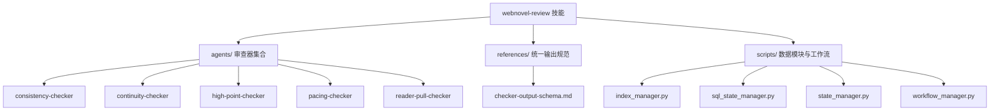
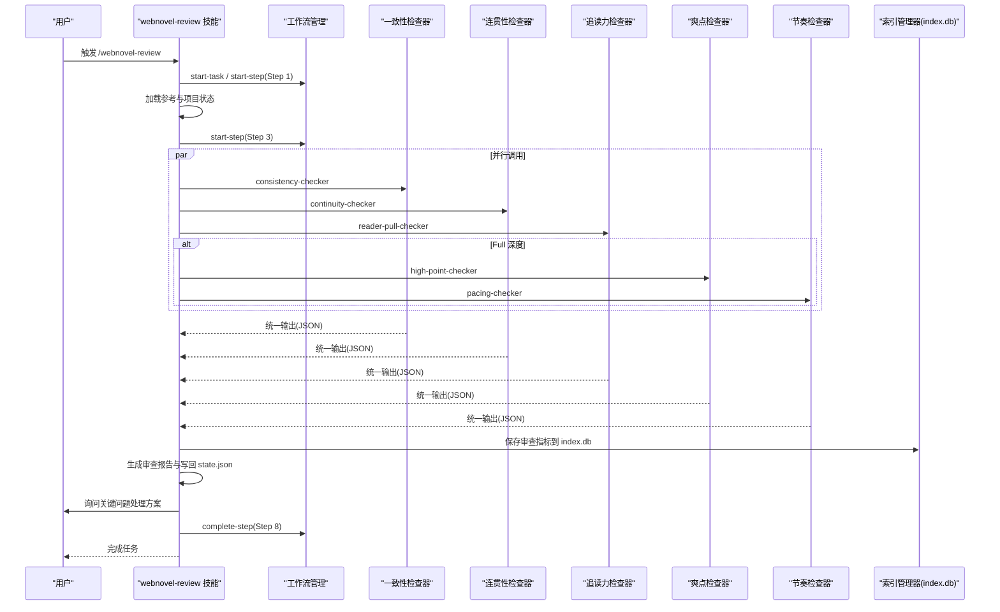
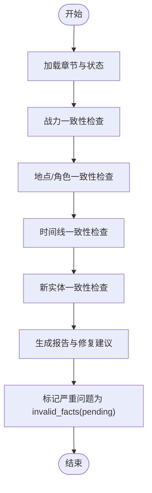
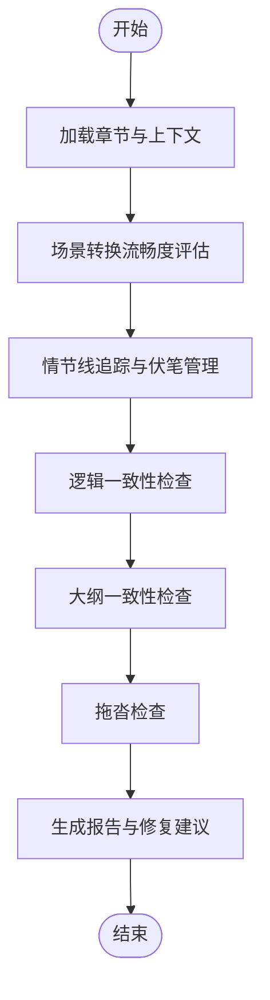
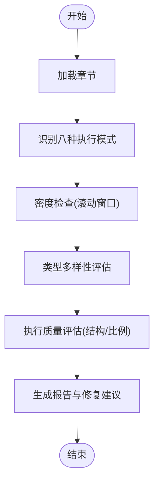
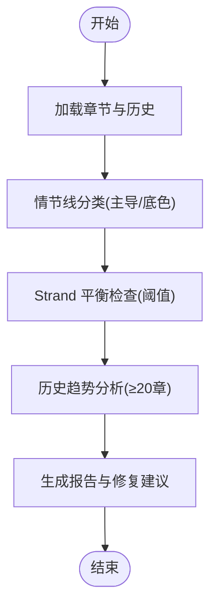
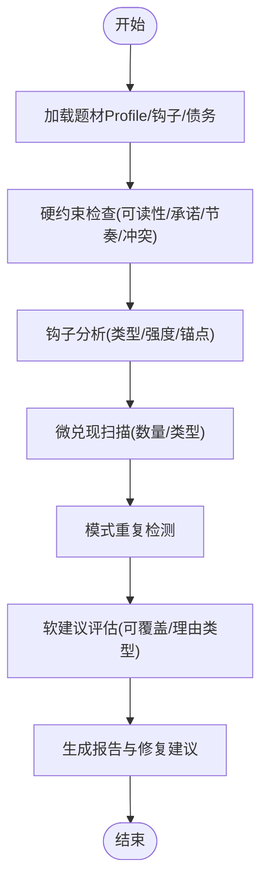
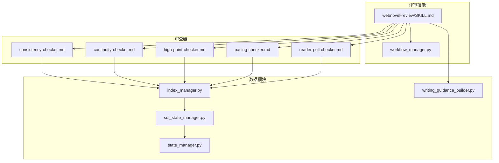

# 评审技能 (webnovel-review)

<cite>
**本文引用的文件**
- [webnovel-review/SKILL.md](file://webnovel-writer/skills/webnovel-review/SKILL.md)
- [consistency-checker.md](file://webnovel-writer/agents/consistency-checker.md)
- [continuity-checker.md](file://webnovel-writer/agents/continuity-checker.md)
- [high-point-checker.md](file://webnovel-writer/agents/high-point-checker.md)
- [pacing-checker.md](file://webnovel-writer/agents/pacing-checker.md)
- [reader-pull-checker.md](file://webnovel-writer/agents/reader-pull-checker.md)
- [checker-output-schema.md](file://webnovel-writer/references/checker-output-schema.md)
- [index_manager.py](file://webnovel-writer/scripts/data_modules/index_manager.py)
- [sql_state_manager.py](file://webnovel-writer/scripts/data_modules/sql_state_manager.py)
- [state_manager.py](file://webnovel-writer/scripts/data_modules/state_manager.py)
- [workflow_manager.py](file://webnovel-writer/scripts/workflow_manager.py)
- [webnovel.py](file://webnovel-writer/scripts/webnovel.py)
- [writing_guidance_builder.py](file://webnovel-writer/scripts/data_modules/writing_guidance_builder.py)
</cite>

## 目录
1. [简介](#简介)
2. [项目结构](#项目结构)
3. [核心组件](#核心组件)
4. [架构总览](#架构总览)
5. [详细组件分析](#详细组件分析)
6. [依赖关系分析](#依赖关系分析)
7. [性能考量](#性能考量)
8. [故障排查指南](#故障排查指南)
9. [结论](#结论)
10. [附录](#附录)

## 简介
本文件面向“webnovel-review”评审技能，系统化阐述章节质量评审的完整流程与评估体系。文档聚焦以下目标：
- 六维审查指标（爽点密度、设定一致性、节奏控制、人物塑造、连贯性、追读力）的计算方法与权重分配
- 核心审查器（consistency-checker、continuity-checker、reader-pull-checker）与条件审查器（high-point-checker、pacing-checker）的工作机制
- 审查报告生成、严重程度分级与问题分类的标准流程
- 审查结果的数据结构、存储格式与可视化展示
- 评审技能与写作技能的集成方式与数据交换协议

## 项目结构
评审技能位于 skills/webnovel-review 目录，配合 agents 子目录中的各检查器、references 中的统一输出规范与 scripts 中的数据模块共同构成完整的评审流水线。

图表来源
- [webnovel-review/SKILL.md:1-195](file://webnovel-writer/skills/webnovel-review/SKILL.md#L1-L195)
- [checker-output-schema.md:1-169](file://webnovel-writer/references/checker-output-schema.md#L1-L169)

章节来源
- [webnovel-review/SKILL.md:1-195](file://webnovel-writer/skills/webnovel-review/SKILL.md#L1-L195)

## 核心组件
- 审查技能入口与工作流
  - 技能定义与步骤映射：通过 SKILL.md 定义审查深度（Core/Full）、步骤序列、参考加载策略与断点恢复机制。
  - 工作流管理：workflow_manager.py 提供任务与步骤的生命周期管理，确保可恢复与可观测。
- 审查器子系统
  - 设定一致性检查器：校验战力、地点/角色、时间线与新实体的一致性。
  - 连贯性检查器：场景转换、情节线追踪、伏笔管理、逻辑一致性与拖沓检查。
  - 爽点密度检查器：识别八种执行模式，进行密度与多样性评估。
  - 节奏检查器：基于 Strand Weave 分析主线、感情线、世界观线的平衡。
  - 追读力检查器：硬/软约束分层、钩子与微兑现、Override Contract 与债务管理。
- 数据与存储
  - 统一输出规范：checker-output-schema.md 规定了各检查器的标准化输出结构。
  - 索引与状态管理：index_manager.py 提供 SQLite 数据表与 CLI 接口；sql_state_manager.py 与 state_manager.py 提供实体、关系、状态变化的读写与同步。

章节来源
- [webnovel-review/SKILL.md:42-51](file://webnovel-writer/skills/webnovel-review/SKILL.md#L42-L51)
- [checker-output-schema.md:10-32](file://webnovel-writer/references/checker-output-schema.md#L10-L32)
- [index_manager.py:228-234](file://webnovel-writer/scripts/data_modules/index_manager.py#L228-L234)
- [sql_state_manager.py:46-92](file://webnovel-writer/scripts/data_modules/sql_state_manager.py#L46-L92)
- [state_manager.py:90-140](file://webnovel-writer/scripts/data_modules/state_manager.py#L90-L140)

## 架构总览
评审技能采用“并行子审查器 + 汇总评分 + 存储与报告”的流水线架构。核心流程如下：

图表来源
- [webnovel-review/SKILL.md:102-117](file://webnovel-writer/skills/webnovel-review/SKILL.md#L102-L117)
- [index_manager.py:782-790](file://webnovel-writer/scripts/data_modules/index_manager.py#L782-L790)
- [workflow_manager.py:191-216](file://webnovel-writer/scripts/workflow_manager.py#L191-L216)

## 详细组件分析

### 六维审查指标与权重分配
- 指标维度
  - 爽点密度：衡量章节中“爽点”出现频率与结构质量，关注密度、类型多样性与执行质量。
  - 设定一致性：校验战力、地点/角色、时间线与新实体与既定设定的契合度。
  - 节奏控制：基于 Strand Weave 分析主线、感情线、世界观线的分布与平衡。
  - 人物塑造：通过角色行为一致性、动机合理性与关系演进评估（在各检查器中体现）。
  - 连贯性：场景转换、情节线追踪、伏笔管理与逻辑一致性。
  - 追读力：钩子强度与类型、微兑现数量、模式重复风险与债务管理。
- 权重分配
  - 技能文档未给出固定权重；统一输出规范要求各检查器输出 overall_score 与 pass 标志，最终综合评分由汇总器根据检查器结果与严重度统计得出。
  - 追读力检查器提供软评分与硬约束，作为能否“通过”的关键依据。

章节来源
- [webnovel-review/SKILL.md:118-158](file://webnovel-writer/skills/webnovel-review/SKILL.md#L118-L158)
- [checker-output-schema.md:145-168](file://webnovel-writer/references/checker-output-schema.md#L145-L168)
- [reader-pull-checker.md:258-286](file://webnovel-writer/agents/reader-pull-checker.md#L258-L286)

### 设定一致性检查器（consistency-checker）
- 职责与范围
  - 设定守卫者，执行“设定即物理”的第二防幻觉定律。
  - 检查战力一致性、地点/角色一致性、时间线一致性与新实体一致性。
- 三层检查流程
  - 战力一致性：校验境界/层数与技能使用限制、突破描写与能力提升的合理性。
  - 地点/角色一致性：校验当前位置与移动序列、角色属性与设定档案的一致性。
  - 时间线一致性：校验事件顺序、时间敏感元素与闪回标记，分级严重度。
  - 新实体一致性：对新增实体进行设定层面的冲突与合理性评估。
- 输出与标记
  - 统一输出 JSON，包含问题列表与严重度。
  - 对严重级别问题自动标记 invalid_facts（状态 pending），等待人工确认。

图表来源
- [consistency-checker.md:20-229](file://webnovel-writer/agents/consistency-checker.md#L20-L229)

章节来源
- [consistency-checker.md:14-229](file://webnovel-writer/agents/consistency-checker.md#L14-L229)
- [index_manager.py:511-534](file://webnovel-writer/scripts/data_modules/index_manager.py#L511-L534)

### 连贯性检查器（continuity-checker）
- 职责与范围
  - 叙事流守卫者，确保场景过渡顺畅、情节线连贯、逻辑一致。
- 四层检查流程
  - 场景转换流畅度：评级 A/B/C/F，关注时间/空间标记与自然过渡。
  - 情节线追踪：主线与支线的引入、进展与解决，避免烂尾与遗忘。
  - 伏笔管理：短期/中期/长期伏笔的设置与回收，避免遗忘风险。
  - 逻辑一致性：前后矛盾、因果断裂与大纲偏差的识别与处理。
  - 拖沓检查：对重复场景与无关过程的压缩建议。
- 输出与成功标准
  - 统一输出 JSON，包含各维度评分与修复建议。
  - 成功标准：场景转换 ≥ B、无活跃情节线遗忘超过阈值、逻辑漏洞为 0、大纲偏差正确标记。

图表来源
- [continuity-checker.md:20-251](file://webnovel-writer/agents/continuity-checker.md#L20-L251)

章节来源
- [continuity-checker.md:14-251](file://webnovel-writer/agents/continuity-checker.md#L14-L251)

### 爽点密度检查器（high-point-checker）
- 职责与范围
  - 读者满足感机制的质量保障专家，识别八种标准执行模式。
- 执行流程
  - 识别模式：装逼打脸、扮猪吃虎、越级反杀、打脸权威、反派翻车、甜蜜超预期、迪化误解、身份掉马。
  - 密度检查：滚动窗口基线（每章/每5章/每10-15章）。
  - 类型多样性：单一类型不得超过 80%。
  - 执行质量评估：铺垫、反转、情绪回报与结构（30/40/30）与压扬比例。
- 输出与成功标准
  - 统一输出 JSON，包含密度、类型分布、质量评级与修复建议。
  - 成功标准：密度健康、类型多样、平均质量评级 ≥ B。

图表来源
- [high-point-checker.md:25-197](file://webnovel-writer/agents/high-point-checker.md#L25-L197)

章节来源
- [high-point-checker.md:14-197](file://webnovel-writer/agents/high-point-checker.md#L14-L197)

### 节奏检查器（pacing-checker）
- 职责与范围
  - 节奏分析师，执行 Strand Weave 平衡检查，防止读者疲劳。
- 执行流程
  - 章节情节线分类：Quest、Fire、Constellation 的主导与底色识别。
  - 平衡检查：Quest 过载、Fire 干旱、Constellation 缺席的阈值与影响。
  - 节奏标准：每10章的理想分布与缺席阈值。
  - 历史趋势分析：≥20章历史数据的分布可视化与结论。
- 输出与成功标准
  - 统一输出 JSON，包含主导线、比例、连续章数与风险等级。
  - 成功标准：单一情节线不超过阈值、所有情节线在各自阈值内出现、提供下一章建议。

图表来源
- [pacing-checker.md:46-215](file://webnovel-writer/agents/pacing-checker.md#L46-L215)

章节来源
- [pacing-checker.md:14-215](file://webnovel-writer/agents/pacing-checker.md#L14-L215)

### 追读力检查器（reader-pull-checker）
- 职责与范围
  - 审查“读者为什么会点下一章”，执行硬/软约束分层。
- 约束分层
  - 硬约束：可读性底线、承诺违背、节奏灾难、冲突真空（必须修复）。
  - 软建议：下章动机、钩子锚点、钩子强度、微兑现数量、模式重复、期待过载、节奏自然性（可覆盖，需 Override Contract）。
- 钩子与微兑现
  - 钩子类型：危机钩、悬念钩、情绪钩、选择钩、渴望钩。
  - 微兑现类型：信息、关系、能力、资源、认可、情绪、线索。
- Override Contract 与债务管理
  - 可覆盖场景与理由类型（TRANSITIONAL_SETUP、LOGIC_INTEGRITY 等）。
  - 债务产生与利息累积，超期变为 overdue。
- 输出与成功标准
  - 统一输出 JSON，包含硬/软约束、钩子与微兑现统计、债务余额与修复建议。
  - 成功标准：无硬约束违规、软评分达标或有有效 Override。

图表来源
- [reader-pull-checker.md:216-318](file://webnovel-writer/agents/reader-pull-checker.md#L216-L318)

章节来源
- [reader-pull-checker.md:66-318](file://webnovel-writer/agents/reader-pull-checker.md#L66-L318)

### 审查报告生成与严重程度分级
- 报告结构
  - 综合评分：六维指标概览与总评等级。
  - 修改优先级：🔴高优先级（必须修改）、🟠中优先级（建议修改）、🟡低优先级（可选优化）。
  - 改进建议：针对具体问题的可执行修复建议。
- 严重程度分级
  - critical：必须修复，如设定自相矛盾、时间线算术错误、承诺违背、节奏灾难。
  - high：高优先级，如地点/角色无解释的跳跃、时间回跳、大纲重大偏差。
  - medium：中等问题，如时间锚点缺失、轻微时间模糊。
  - low：轻微问题，如轻微时间模糊。
- 指标 JSON 结构
  - 包含起止章节、总体分数、维度分数、严重度计数、关键问题列表、报告文件路径与备注。

章节来源
- [webnovel-review/SKILL.md:118-158](file://webnovel-writer/skills/webnovel-review/SKILL.md#L118-L158)
- [checker-output-schema.md:50-58](file://webnovel-writer/references/checker-output-schema.md#L50-L58)

### 数据结构、存储与可视化
- 统一输出结构
  - 所有检查器遵循 checker-output-schema.md 的统一 JSON Schema，包含 agent、chapter、overall_score、pass、issues、metrics、summary 等字段。
- 审查指标存储
  - 通过 index_manager.py 的 CLI 命令保存到 review_metrics 表，字段包括 start_chapter、end_chapter、overall_score、dimension_scores、severity_counts、critical_issues、report_file、notes。
- 可视化展示
  - 追读力检查器提供章节追读力元数据表（chapter_reading_power），可用于趋势与债务可视化。
  - 写作指导构建器（writing_guidance_builder.py）提供策略卡片与清单项，辅助可视化与可执行建议。

章节来源
- [checker-output-schema.md:10-32](file://webnovel-writer/references/checker-output-schema.md#L10-L32)
- [index_manager.py:535-554](file://webnovel-writer/scripts/data_modules/index_manager.py#L535-L554)
- [writing_guidance_builder.py:170-276](file://webnovel-writer/scripts/data_modules/writing_guidance_builder.py#L170-L276)

### 评审技能与写作技能的集成与数据交换
- 集成方式
  - 技能通过 Task 工具调用各子审查器，禁止主流程直接内联结论，确保并行与可恢复。
  - 工作流管理器（workflow_manager.py）提供任务与步骤的生命周期管理，支持断点恢复与可观测性。
- 数据交换协议
  - 统一输出：各检查器输出符合 checker-output-schema.md 的 JSON，便于汇总与趋势分析。
  - 索引接口：通过 scripts/webnovel.py 转发到 data_modules，使用 index_manager.py 的 CLI 命令进行幂等写入。
  - 状态同步：state_manager.py 与 sql_state_manager.py 将大数据字段迁移至 SQLite，保持与 Data Agent 的接口兼容。

章节来源
- [webnovel-review/SKILL.md:102-117](file://webnovel-writer/skills/webnovel-review/SKILL.md#L102-L117)
- [workflow_manager.py:124-128](file://webnovel-writer/scripts/workflow_manager.py#L124-L128)
- [webnovel.py:24-32](file://webnovel-writer/scripts/webnovel.py#L24-L32)
- [index_manager.py:782-790](file://webnovel-writer/scripts/data_modules/index_manager.py#L782-L790)

## 依赖关系分析

图表来源
- [webnovel-review/SKILL.md:1-195](file://webnovel-writer/skills/webnovel-review/SKILL.md#L1-L195)
- [workflow_manager.py:714-722](file://webnovel-writer/scripts/workflow_manager.py#L714-L722)
- [index_manager.py:228-234](file://webnovel-writer/scripts/data_modules/index_manager.py#L228-L234)
- [sql_state_manager.py:46-92](file://webnovel-writer/scripts/data_modules/sql_state_manager.py#L46-L92)
- [state_manager.py:90-140](file://webnovel-writer/scripts/data_modules/state_manager.py#L90-L140)
- [writing_guidance_builder.py:1-479](file://webnovel-writer/scripts/data_modules/writing_guidance_builder.py#L1-L479)

章节来源
- [workflow_manager.py:714-722](file://webnovel-writer/scripts/workflow_manager.py#L714-L722)
- [index_manager.py:228-234](file://webnovel-writer/scripts/data_modules/index_manager.py#L228-L234)

## 性能考量
- 并行执行：审查器并行调用，缩短整体评审时间。
- 幂等写入：索引与状态写入通过 CLI 与事务接口实现，避免重复与丢失。
- 大数据迁移：state.json 中的大数据字段迁移至 SQLite，降低内存占用与 IO 压力。
- 断点恢复：工作流管理器记录步骤状态，支持最佳努力恢复，减少重跑成本。

## 故障排查指南
- 硬约束违规
  - 设定一致性：时间线算术错误、承诺违背、节奏灾难、冲突真空等必须修复。
  - 连贯性：重大大纲偏差且无 deviate 标记、遗忘伏笔超过阈值、场景转换 F 级等。
  - 追读力：任何硬约束违规直接未通过，必须修复后重新审核。
- 软建议与 Override Contract
  - 可覆盖的软建议需提交 Override Contract，并承担债务与利息。
  - 债务超期未偿还将变为 overdue，影响后续章节的软评分。
- 数据写入异常
  - index.db 写入失败会记录警告并保留待同步队列，确保不中断主流程。
  - 建议检查 SQLite 权限与磁盘空间，必要时重试或回滚。

章节来源
- [reader-pull-checker.md:260-286](file://webnovel-writer/agents/reader-pull-checker.md#L260-L286)
- [continuity-checker.md:236-251](file://webnovel-writer/agents/continuity-checker.md#L236-L251)
- [consistency-checker.md:214-229](file://webnovel-writer/agents/consistency-checker.md#L214-L229)
- [index_manager.py:511-534](file://webnovel-writer/scripts/data_modules/index_manager.py#L511-L534)

## 结论
webnovel-review 评审技能通过标准化的六维指标与严格的约束分层，结合并行审查器与可观测的工作流管理，形成了可恢复、可扩展、可可视化的章节质量评审体系。统一输出规范与 SQLite 存储确保了数据一致性与趋势分析能力，为写作技能提供了可靠的反馈闭环。

## 附录
- 参考文件
  - 技能定义与步骤映射：[webnovel-review/SKILL.md:1-195](file://webnovel-writer/skills/webnovel-review/SKILL.md#L1-L195)
  - 统一输出规范：[checker-output-schema.md:1-169](file://webnovel-writer/references/checker-output-schema.md#L1-L169)
  - 工作流管理：[workflow_manager.py:1-823](file://webnovel-writer/scripts/workflow_manager.py#L1-L823)
  - 数据模块与索引：[index_manager.py:1-1314](file://webnovel-writer/scripts/data_modules/index_manager.py#L1-L1314)
  - 状态管理：[state_manager.py:1-1352](file://webnovel-writer/scripts/data_modules/state_manager.py#L1-L1352)
  - SQL 状态管理：[sql_state_manager.py:1-595](file://webnovel-writer/scripts/data_modules/sql_state_manager.py#L1-L595)
  - 写作指导构建：[writing_guidance_builder.py:1-479](file://webnovel-writer/scripts/data_modules/writing_guidance_builder.py#L1-L479)
  - 审查器实现
    - [consistency-checker.md:1-229](file://webnovel-writer/agents/consistency-checker.md#L1-L229)
    - [continuity-checker.md:1-251](file://webnovel-writer/agents/continuity-checker.md#L1-L251)
    - [high-point-checker.md:1-218](file://webnovel-writer/agents/high-point-checker.md#L1-L218)
    - [pacing-checker.md:1-216](file://webnovel-writer/agents/pacing-checker.md#L1-L216)
    - [reader-pull-checker.md:1-318](file://webnovel-writer/agents/reader-pull-checker.md#L1-L318)