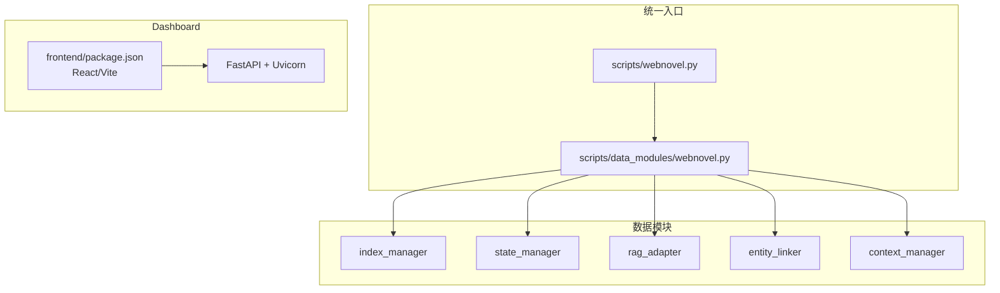
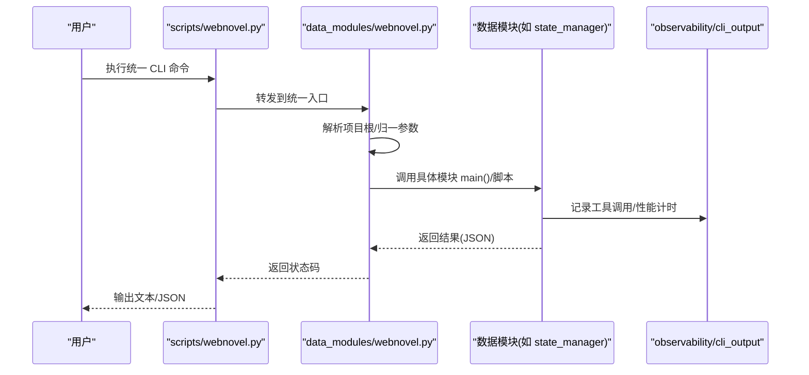
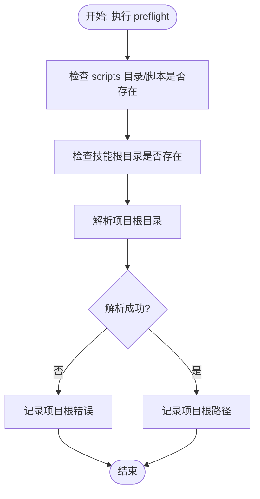
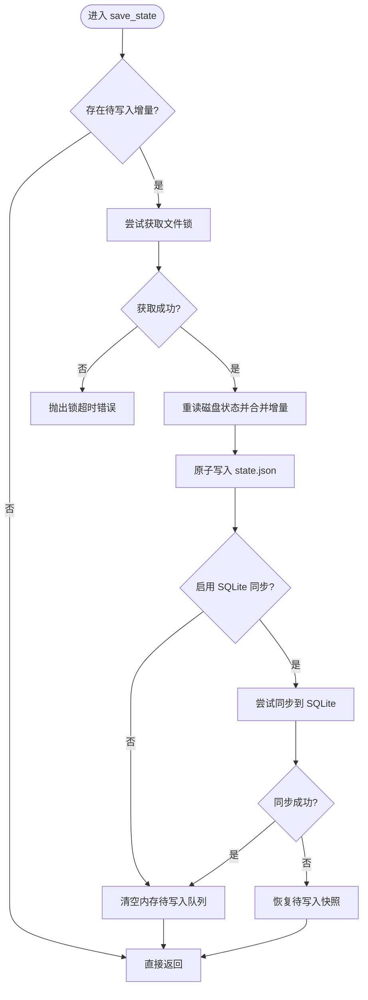
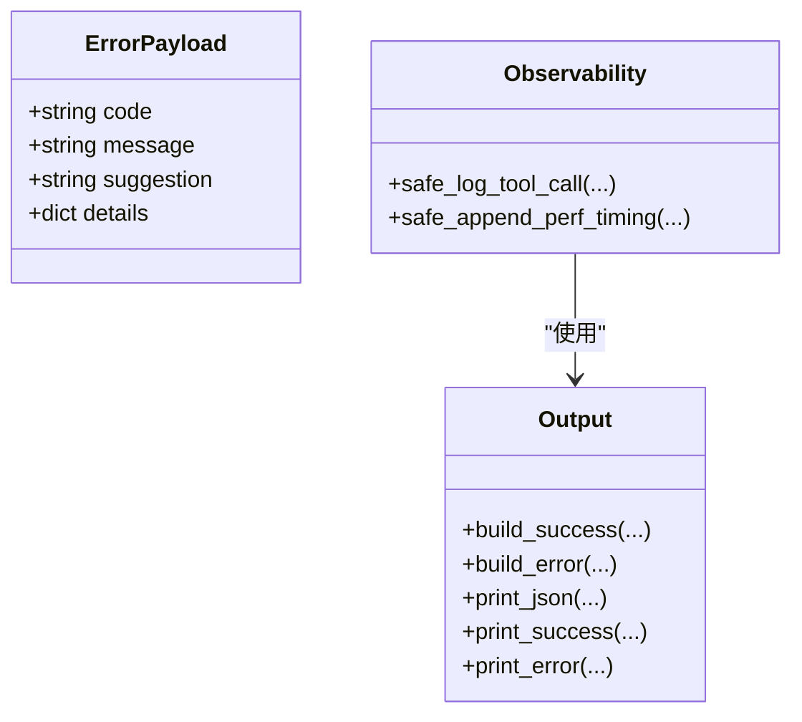
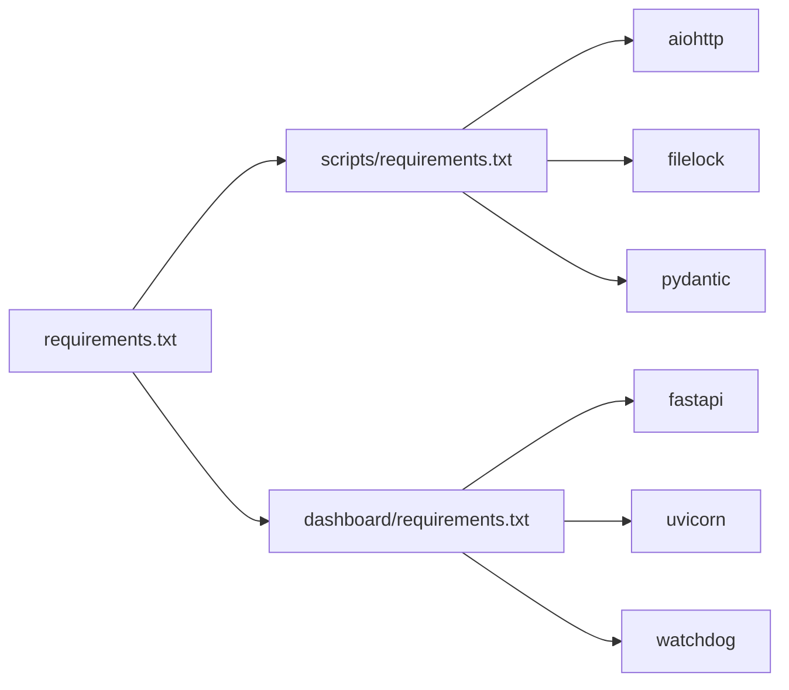

# 常见问题诊断

<cite>
**本文引用的文件**
- [README.md](file://README.md)
- [requirements.txt](file://requirements.txt)
- [webnovel-writer/scripts/requirements.txt](file://webnovel-writer/scripts/requirements.txt)
- [webnovel-writer/dashboard/requirements.txt](file://webnovel-writer/dashboard/requirements.txt)
- [webnovel-writer/scripts/webnovel.py](file://webnovel-writer/scripts/webnovel.py)
- [webnovel-writer/scripts/data_modules/webnovel.py](file://webnovel-writer/scripts/data_modules/webnovel.py)
- [webnovel-writer/scripts/data_modules/cli_output.py](file://webnovel-writer/scripts/data_modules/cli_output.py)
- [webnovel-writer/scripts/data_modules/observability.py](file://webnovel-writer/scripts/data_modules/observability.py)
- [webnovel-writer/scripts/runtime_compat.py](file://webnovel-writer/scripts/runtime_compat.py)
- [webnovel-writer/scripts/data_modules/state_manager.py](file://webnovel-writer/scripts/data_modules/state_manager.py)
- [webnovel-writer/dashboard/frontend/package.json](file://webnovel-writer/dashboard/frontend/package.json)
- [webnovel-writer/dashboard/claude_runner.py](file://webnovel-writer/dashboard/claude_runner.py)
</cite>

## 目录
1. [简介](#简介)
2. [项目结构](#项目结构)
3. [核心组件](#核心组件)
4. [架构总览](#架构总览)
5. [详细组件分析](#详细组件分析)
6. [依赖分析](#依赖分析)
7. [性能考虑](#性能考虑)
8. [故障排查指南](#故障排查指南)
9. [结论](#结论)
10. [附录](#附录)

## 简介
本指南面向不同技术背景的用户，系统化梳理 Webnovel Writer 在安装与运行阶段的常见问题症状、诊断步骤与解决方法，覆盖依赖安装失败、Python 版本不兼容、Node.js 环境缺失、API 调用失败、文件权限错误、网络连接超时、日志分析与命令行自检工具使用等主题。文档提供从基础到高级的诊断策略，并给出可复用的自检清单与错误代码对照。

## 项目结构
Webnovel Writer 采用“统一 CLI 入口 + 多数据模块”的分层组织方式：
- 统一入口脚本负责环境探测、项目根解析、参数归一与模块转发
- 数据模块负责具体功能（索引、状态、RAG、实体链接、上下文抽取等）
- Dashboard 提供只读可视化面板（React/Vite 前端 + FastAPI 后端）
- 顶层 requirements.txt 作为聚合入口，分别引入 scripts 与 dashboard 的依赖

图表来源
- [webnovel-writer/scripts/webnovel.py:1-37](file://webnovel-writer/scripts/webnovel.py#L1-L37)
- [webnovel-writer/scripts/data_modules/webnovel.py:1-312](file://webnovel-writer/scripts/data_modules/webnovel.py#L1-L312)
- [webnovel-writer/dashboard/frontend/package.json:1-23](file://webnovel-writer/dashboard/frontend/package.json#L1-L23)

章节来源
- [README.md:1-170](file://README.md#L1-L170)
- [requirements.txt:1-3](file://requirements.txt#L1-L3)
- [webnovel-writer/scripts/requirements.txt:1-14](file://webnovel-writer/scripts/requirements.txt#L1-L14)
- [webnovel-writer/dashboard/requirements.txt:1-4](file://webnovel-writer/dashboard/requirements.txt#L1-L4)

## 核心组件
- 统一 CLI 入口
  - 负责 sys.path 注入、项目根解析、参数归一与模块转发
  - 提供 where/preflight/use 等诊断与引导命令
- 数据模块
  - 状态管理、索引、RAG、实体链接、上下文抽取等
  - 统一输出 JSON 结构，便于自动化与日志分析
- 可观测性与日志
  - 工具调用日志、性能计时、错误封装
- 运行时兼容
  - Windows UTF-8 stdio 包装、路径规范化
- Dashboard
  - React/Vite 前端 + FastAPI/Uvicorn 后端，提供只读面板

章节来源
- [webnovel-writer/scripts/webnovel.py:1-37](file://webnovel-writer/scripts/webnovel.py#L1-L37)
- [webnovel-writer/scripts/data_modules/webnovel.py:1-312](file://webnovel-writer/scripts/data_modules/webnovel.py#L1-L312)
- [webnovel-writer/scripts/data_modules/cli_output.py:1-69](file://webnovel-writer/scripts/data_modules/cli_output.py#L1-L69)
- [webnovel-writer/scripts/data_modules/observability.py:1-58](file://webnovel-writer/scripts/data_modules/observability.py#L1-L58)
- [webnovel-writer/scripts/runtime_compat.py:1-77](file://webnovel-writer/scripts/runtime_compat.py#L1-L77)

## 架构总览
下图展示从用户命令到数据模块执行与可观测性输出的整体流程。

图表来源
- [webnovel-writer/scripts/webnovel.py:1-37](file://webnovel-writer/scripts/webnovel.py#L1-L37)
- [webnovel-writer/scripts/data_modules/webnovel.py:1-312](file://webnovel-writer/scripts/data_modules/webnovel.py#L1-L312)
- [webnovel-writer/scripts/data_modules/cli_output.py:1-69](file://webnovel-writer/scripts/data_modules/cli_output.py#L1-L69)
- [webnovel-writer/scripts/data_modules/observability.py:1-58](file://webnovel-writer/scripts/data_modules/observability.py#L1-L58)

## 详细组件分析

### 组件A：统一 CLI 入口与预检
- 功能要点
  - sys.path 注入 scripts 目录，避免路径/导入问题
  - 归一化 --project-root 参数位置，减少拼接错误
  - 提供 where/use/preflight 等诊断命令
  - 预检报告包含 scripts 目录、入口脚本、提取脚本、技能根目录与项目根解析
- 常见问题定位
  - scripts 目录/脚本缺失：预检失败
  - 项目根解析异常：检查工作区/项目指针与 .webnovel/state.json 存在性
- 诊断建议
  - 使用统一预检命令输出 JSON，结合错误字段定位
  - 对于 Windows 路径，确认是否使用 POSIX 风格并被正确规范化

图表来源
- [webnovel-writer/scripts/data_modules/webnovel.py:109-154](file://webnovel-writer/scripts/data_modules/webnovel.py#L109-L154)

章节来源
- [webnovel-writer/scripts/webnovel.py:1-37](file://webnovel-writer/scripts/webnovel.py#L1-L37)
- [webnovel-writer/scripts/data_modules/webnovel.py:1-312](file://webnovel-writer/scripts/data_modules/webnovel.py#L1-L312)

### 组件B：状态管理与并发写入
- 功能要点
  - state.json 原子写入 + 文件锁，避免并发覆盖
  - SQLite 同步降级与失败回滚
  - 增量补丁合并，减少磁盘写放大
- 常见问题定位
  - 文件锁超时：并发写入冲突或磁盘权限不足
  - SQLite 同步失败：数据库不可用或索引模块异常
- 诊断建议
  - 观察保存流程中的锁等待与异常日志
  - 检查 SQLite 同步开关与依赖模块可用性

图表来源
- [webnovel-writer/scripts/data_modules/state_manager.py:208-370](file://webnovel-writer/scripts/data_modules/state_manager.py#L208-L370)
- [webnovel-writer/scripts/data_modules/state_manager.py:371-560](file://webnovel-writer/scripts/data_modules/state_manager.py#L371-L560)

章节来源
- [webnovel-writer/scripts/data_modules/state_manager.py:1-800](file://webnovel-writer/scripts/data_modules/state_manager.py#L1-L800)

### 组件C：可观测性与错误输出
- 功能要点
  - 统一 JSON 错误载荷结构，包含 code/message/suggestion/details
  - 工具调用日志与性能计时安全记录
- 常见问题定位
  - CLI 输出 JSON：通过 code/message/suggestion 快速定位
  - 性能计时：定位慢环节与重试次数
- 诊断建议
  - 优先解析 JSON 错误载荷，提取建议与详情
  - 结合性能计时与工具调用日志进行根因分析

图表来源
- [webnovel-writer/scripts/data_modules/cli_output.py:1-69](file://webnovel-writer/scripts/data_modules/cli_output.py#L1-L69)
- [webnovel-writer/scripts/data_modules/observability.py:1-58](file://webnovel-writer/scripts/data_modules/observability.py#L1-L58)

章节来源
- [webnovel-writer/scripts/data_modules/cli_output.py:1-69](file://webnovel-writer/scripts/data_modules/cli_output.py#L1-L69)
- [webnovel-writer/scripts/data_modules/observability.py:1-58](file://webnovel-writer/scripts/data_modules/observability.py#L1-L58)

### 组件D：运行时兼容与路径处理
- 功能要点
  - Windows UTF-8 stdio 包装，避免终端乱码
  - 路径规范化，兼容 Git Bash/WSL POSIX 风格
- 常见问题定位
  - 终端显示乱码：检查 UTF-8 包装是否生效
  - 路径解析异常：确认是否被正确规范化
- 诊断建议
  - 在 Windows 环境下验证 stdio 编码
  - 对于 POSIX 风格路径，确认是否匹配正则并转换为盘符路径

章节来源
- [webnovel-writer/scripts/runtime_compat.py:1-77](file://webnovel-writer/scripts/runtime_compat.py#L1-L77)

### 组件E：Dashboard 前端依赖与运行
- 功能要点
  - 前端使用 React/Vite，依赖 react/react-dom/react-force-graph-3d
  - 后端使用 FastAPI/Uvicorn，配合 watchdog
- 常见问题定位
  - 前端依赖缺失：npm/yarn 安装失败或 Node.js 版本不兼容
  - 后端服务无法启动：端口占用、依赖未安装
- 诊断建议
  - 使用 package.json 中的脚本命令进行本地开发/构建
  - 确认 Node.js 版本满足 Vite/React 要求

章节来源
- [webnovel-writer/dashboard/frontend/package.json:1-23](file://webnovel-writer/dashboard/frontend/package.json#L1-L23)

## 依赖分析
- 顶层依赖聚合
  - requirements.txt 引入 scripts 与 dashboard 的依赖清单
- Scripts 侧核心依赖
  - aiohttp、filelock、pydantic 为核心运行与并发控制提供支撑
- Dashboard 侧后端依赖
  - FastAPI、Uvicorn、watchdog 用于服务与文件监控
- 前端依赖
  - React 生态与 Vite 构建工具链

图表来源
- [requirements.txt:1-3](file://requirements.txt#L1-L3)
- [webnovel-writer/scripts/requirements.txt:1-14](file://webnovel-writer/scripts/requirements.txt#L1-L14)
- [webnovel-writer/dashboard/requirements.txt:1-4](file://webnovel-writer/dashboard/requirements.txt#L1-L4)

章节来源
- [requirements.txt:1-3](file://requirements.txt#L1-L3)
- [webnovel-writer/scripts/requirements.txt:1-14](file://webnovel-writer/scripts/requirements.txt#L1-L14)
- [webnovel-writer/dashboard/requirements.txt:1-4](file://webnovel-writer/dashboard/requirements.txt#L1-L4)

## 性能考虑
- 并发写入与锁竞争
  - state.json 采用文件锁与原子写入，避免竞态；建议减少频繁小粒度写入
- SQLite 同步降级
  - SQLite 不可用时自动降级，但会保留待写入队列；建议排查数据库可用性
- 性能计时与工具调用日志
  - 使用安全计时与日志接口，便于定位慢环节与重试次数

章节来源
- [webnovel-writer/scripts/data_modules/state_manager.py:208-370](file://webnovel-writer/scripts/data_modules/state_manager.py#L208-L370)
- [webnovel-writer/scripts/data_modules/observability.py:1-58](file://webnovel-writer/scripts/data_modules/observability.py#L1-L58)

## 故障排查指南

### 一、安装阶段常见问题
- 依赖安装失败
  - 症状：pip 安装报错、模块导入失败
  - 诊断步骤
    - 确认 Python 版本满足要求（3.10+）
    - 使用顶层 requirements.txt 聚合安装
    - 分模块检查：scripts 与 dashboard 依赖是否齐全
  - 解决方法
    - 升级 Python 或使用兼容版本容器
    - 更换镜像源或离线安装对应 wheel
    - 确保网络可达，必要时配置代理
- Python 版本不兼容
  - 症状：导入报错、语法不支持
  - 诊断步骤
    - 查看 README 中 Python 版本要求
    - 检查当前 Python 版本
  - 解决方法
    - 切换至 3.10+ 环境
- Node.js 环境缺失
  - 症状：前端构建失败、依赖安装报错
  - 诊断步骤
    - 检查 package.json 中的脚本与依赖
    - 确认 Node.js 版本满足 Vite/React 要求
  - 解决方法
    - 安装 Node.js 并重新安装依赖
    - 使用 nvm/ndenv 管理版本

章节来源
- [README.md:32-38](file://README.md#L32-L38)
- [requirements.txt:1-3](file://requirements.txt#L1-L3)
- [webnovel-writer/scripts/requirements.txt:1-14](file://webnovel-writer/scripts/requirements.txt#L1-L14)
- [webnovel-writer/dashboard/requirements.txt:1-4](file://webnovel-writer/dashboard/requirements.txt#L1-L4)
- [webnovel-writer/dashboard/frontend/package.json:1-23](file://webnovel-writer/dashboard/frontend/package.json#L1-L23)

### 二、运行时错误识别
- API 调用失败
  - 症状：HTTP 请求异常、响应为空或超时
  - 诊断步骤
    - 使用统一 CLI 的预检命令输出 JSON，检查 code/message/suggestion
    - 结合性能计时与工具调用日志定位慢请求
  - 解决方法
    - 校验鉴权与网络连通性
    - 重试与限流策略
- 文件权限错误
  - 症状：state.json 写入失败、锁文件无法创建
  - 诊断步骤
    - 检查 state.json 及其 .lock 文件所在目录权限
    - 排查并发写入与进程占用
  - 解决方法
    - 修正目录权限或切换到可写目录
    - 串行化写入或调整并发策略
- 网络连接超时
  - 症状：RAG/嵌入/重排服务超时
  - 诊断步骤
    - 使用预检命令检查项目根与脚本可用性
    - 校验 .env 中的 API 基础地址与密钥
  - 解决方法
    - 更换网络环境或配置代理
    - 检查上游服务可用性与配额

章节来源
- [webnovel-writer/scripts/data_modules/cli_output.py:1-69](file://webnovel-writer/scripts/data_modules/cli_output.py#L1-L69)
- [webnovel-writer/scripts/data_modules/observability.py:1-58](file://webnovel-writer/scripts/data_modules/observability.py#L1-L58)
- [webnovel-writer/scripts/data_modules/webnovel.py:109-154](file://webnovel-writer/scripts/data_modules/webnovel.py#L109-L154)
- [README.md:50-68](file://README.md#L50-L68)

### 三、系统化日志分析方法
- 错误日志解读
  - 优先解析 JSON 错误载荷，提取 code 与 suggestion
  - 结合 details 字段定位具体参数或路径
- 调试信息提取
  - 使用预检命令输出 JSON，包含 scripts 目录、脚本与项目根解析结果
  - 观察工具调用日志与性能计时
- 问题根因分析
  - 并发写入：检查 state.json 锁与原子写入流程
  - SQLite 同步：确认可用性与失败回滚逻辑
  - 路径与编码：Windows UTF-8 stdio 与路径规范化

章节来源
- [webnovel-writer/scripts/data_modules/cli_output.py:1-69](file://webnovel-writer/scripts/data_modules/cli_output.py#L1-L69)
- [webnovel-writer/scripts/data_modules/webnovel.py:109-154](file://webnovel-writer/scripts/data_modules/webnovel.py#L109-L154)
- [webnovel-writer/scripts/data_modules/state_manager.py:208-370](file://webnovel-writer/scripts/data_modules/state_manager.py#L208-L370)
- [webnovel-writer/scripts/runtime_compat.py:1-77](file://webnovel-writer/scripts/runtime_compat.py#L1-L77)

### 四、命令行诊断工具使用
- 统一预检
  - 用法：参考 README 中的统一预检命令
  - 输出：text/json 两种格式，便于自动化
- 项目根解析
  - where：打印解析出的 project_root
  - use：绑定当前工作区使用的书项目（写入指针/注册表）
- Dashboard 相关
  - claude_runner 中对 preflight 的调用与文件校验流程可用于验证目标路径存在性

章节来源
- [README.md:78-82](file://README.md#L78-L82)
- [webnovel-writer/scripts/data_modules/webnovel.py:189-312](file://webnovel-writer/scripts/data_modules/webnovel.py#L189-L312)
- [webnovel-writer/dashboard/claude_runner.py:72-112](file://webnovel-writer/dashboard/claude_runner.py#L72-L112)

### 五、错误代码对照表
- CLI 统一错误载荷
  - 字段：code、message、suggestion、details
  - 用途：标准化错误输出，便于自动化解析与提示
- 常见 code 类型
  - 项目根解析失败：检查工作区/项目指针与 .webnovel/state.json
  - 脚本缺失：检查 scripts 目录与入口脚本
  - 文件锁超时：检查并发写入与权限
  - SQLite 同步失败：检查数据库可用性与索引模块

章节来源
- [webnovel-writer/scripts/data_modules/cli_output.py:1-69](file://webnovel-writer/scripts/data_modules/cli_output.py#L1-L69)
- [webnovel-writer/scripts/data_modules/webnovel.py:109-154](file://webnovel-writer/scripts/data_modules/webnovel.py#L109-L154)
- [webnovel-writer/scripts/data_modules/state_manager.py:371-560](file://webnovel-writer/scripts/data_modules/state_manager.py#L371-L560)

### 六、问题自检清单
- 安装阶段
  - Python 版本是否满足 3.10+
  - requirements.txt 是否完整安装
  - scripts 与 dashboard 依赖是否齐全
  - Node.js 是否安装且版本满足前端要求
- 运行阶段
  - 统一预检是否通过（text/json）
  - 项目根解析是否成功
  - state.json 写入与锁是否正常
  - SQLite 同步是否可用
  - API 基础地址与密钥是否正确
  - 终端编码与路径是否被正确规范化

章节来源
- [README.md:32-38](file://README.md#L32-L38)
- [requirements.txt:1-3](file://requirements.txt#L1-L3)
- [webnovel-writer/scripts/data_modules/webnovel.py:109-154](file://webnovel-writer/scripts/data_modules/webnovel.py#L109-L154)
- [webnovel-writer/scripts/data_modules/state_manager.py:208-370](file://webnovel-writer/scripts/data_modules/state_manager.py#L208-L370)
- [webnovel-writer/scripts/runtime_compat.py:1-77](file://webnovel-writer/scripts/runtime_compat.py#L1-L77)

## 结论
通过统一 CLI 入口、标准化错误输出与可观测性接口、以及完善的预检与路径/编码兼容处理，Webnovel Writer 提供了系统化的安装与运行诊断能力。建议在日常使用中优先采用统一预检与 JSON 输出，结合性能计时与工具调用日志进行根因分析，并依据自检清单逐项排除常见问题。

## 附录
- 快速参考
  - 安装命令与依赖路径：参考 README 与 requirements.txt
  - 统一预检命令：参考 README 中的统一预检示例
  - Dashboard 依赖与脚本：参考 frontend/package.json

章节来源
- [README.md:1-170](file://README.md#L1-L170)
- [requirements.txt:1-3](file://requirements.txt#L1-L3)
- [webnovel-writer/dashboard/frontend/package.json:1-23](file://webnovel-writer/dashboard/frontend/package.json#L1-L23)