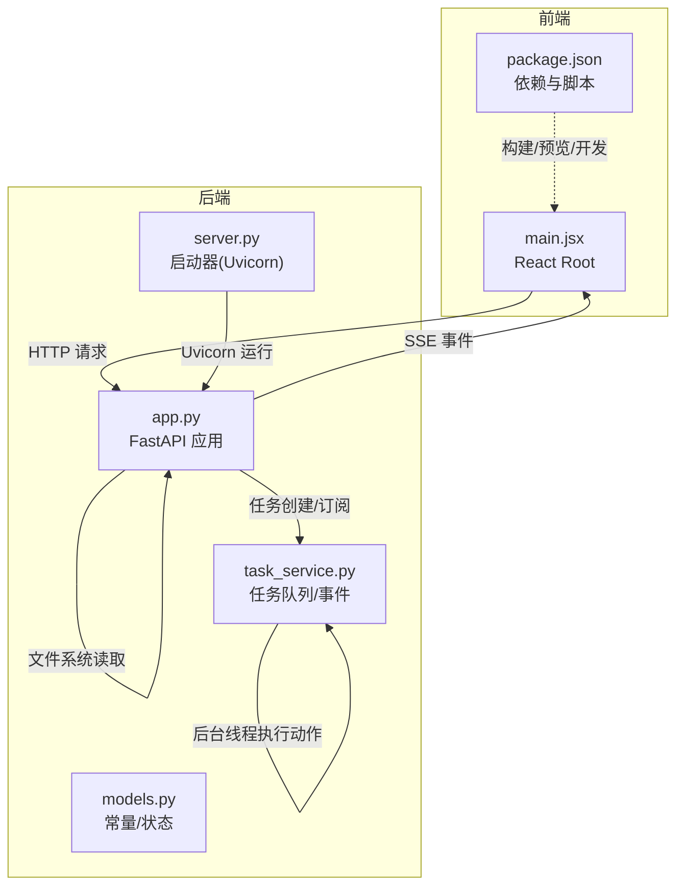
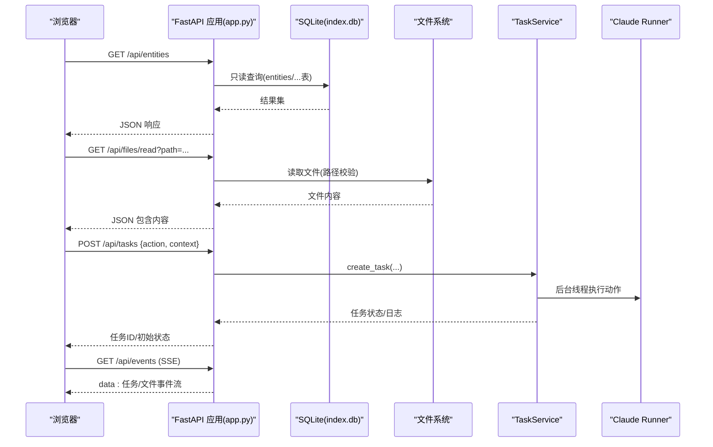
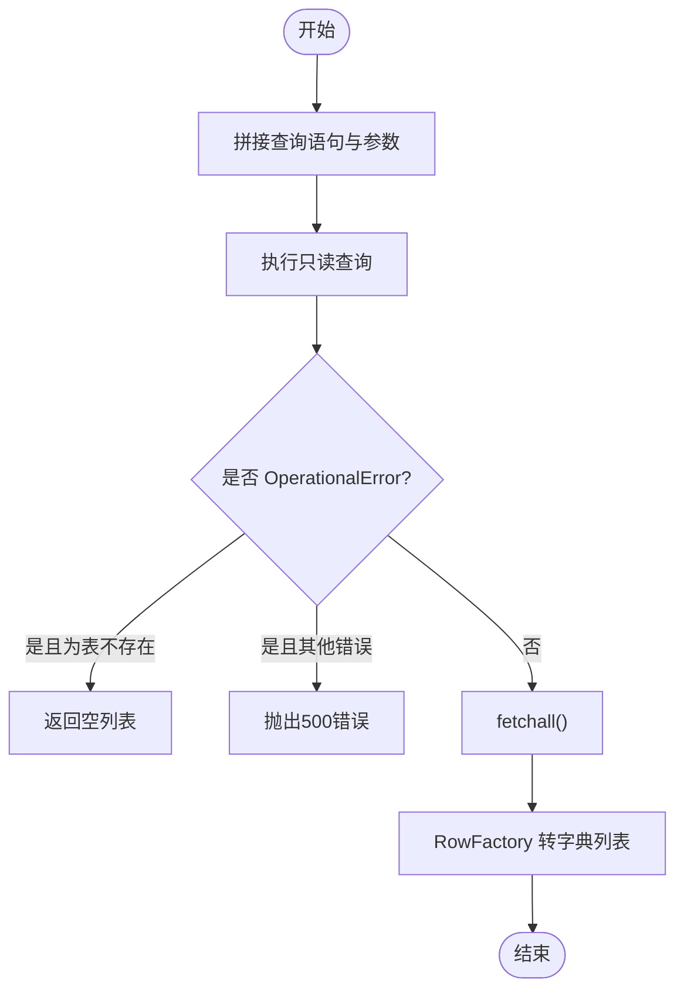
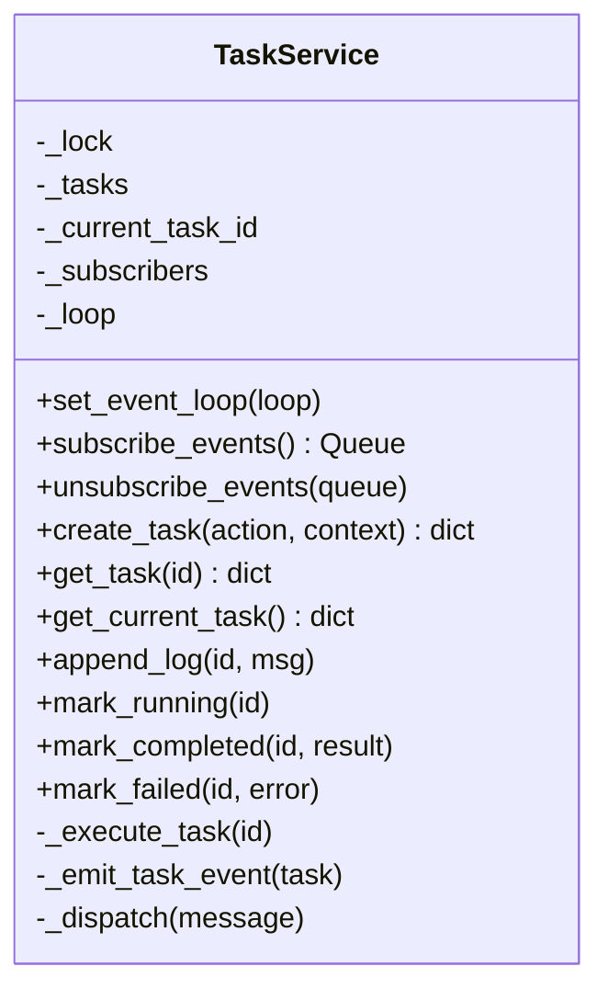
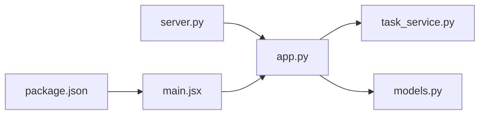

# 性能问题优化

<cite>
**本文引用的文件**
- [README.md](file://README.md)
- [webnovel-writer/dashboard/app.py](file://webnovel-writer/dashboard/app.py)
- [webnovel-writer/dashboard/server.py](file://webnovel-writer/dashboard/server.py)
- [webnovel-writer/dashboard/models.py](file://webnovel-writer/dashboard/models.py)
- [webnovel-writer/dashboard/task_service.py](file://webnovel-writer/dashboard/task_service.py)
- [webnovel-writer/dashboard/frontend/package.json](file://webnovel-writer/dashboard/frontend/package.json)
- [webnovel-writer/dashboard/frontend/src/main.jsx](file://webnovel-writer/dashboard/frontend/src/main.jsx)
</cite>

## 目录
1. [简介](#简介)
2. [项目结构](#项目结构)
3. [核心组件](#核心组件)
4. [架构总览](#架构总览)
5. [详细组件分析](#详细组件分析)
6. [依赖分析](#依赖分析)
7. [性能考虑](#性能考虑)
8. [故障排查指南](#故障排查指南)
9. [结论](#结论)
10. [附录](#附录)

## 简介
本指南面向 Webnovel Writer 的性能优化，聚焦以下方面：
- 系统性能瓶颈识别：CPU 使用率、内存占用、I/O 等待等。
- 数据库查询优化：索引、查询计划、慢查询日志、批量操作。
- 前端性能优化：React 渲染、资源加载、缓存与体验优化。
- AI 代理调用优化：并发控制、请求批量化、结果缓存、响应时间优化。
- 性能监控指标、基准测试与回归检测流程。

本项目包含一个基于 FastAPI 的只读 Dashboard API 服务与前端 SPA，以及一个任务执行与事件推送的后台线程/协程机制。这些组件共同构成了性能优化的关键切入点。

## 项目结构
Dashboard 采用后端 API + 前端 SPA 的分层组织：
- 后端：FastAPI 应用、SQLite 只读查询、文件系统读取、任务队列与 SSE 实时推送。
- 前端：Vite + React，打包产物静态托管。
- 任务执行：后台线程触发 Claude Runner 执行动作，通过队列向前端推送事件。

图表来源
- [webnovel-writer/dashboard/app.py:50-490](file://webnovel-writer/dashboard/app.py#L50-L490)
- [webnovel-writer/dashboard/server.py:43-67](file://webnovel-writer/dashboard/server.py#L43-L67)
- [webnovel-writer/dashboard/task_service.py:14-166](file://webnovel-writer/dashboard/task_service.py#L14-L166)
- [webnovel-writer/dashboard/frontend/src/main.jsx:1-11](file://webnovel-writer/dashboard/frontend/src/main.jsx#L1-L11)
- [webnovel-writer/dashboard/frontend/package.json:1-23](file://webnovel-writer/dashboard/frontend/package.json#L1-L23)

章节来源
- [README.md:84-93](file://README.md#L84-L93)
- [webnovel-writer/dashboard/app.py:50-490](file://webnovel-writer/dashboard/app.py#L50-L490)
- [webnovel-writer/dashboard/server.py:43-67](file://webnovel-writer/dashboard/server.py#L43-L67)
- [webnovel-writer/dashboard/frontend/package.json:1-23](file://webnovel-writer/dashboard/frontend/package.json#L1-L23)

## 核心组件
- FastAPI 应用与路由：提供只读查询、文件读取、任务管理、SSE 实时推送。
- SQLite 只读查询：对 index.db 的多表查询封装，带安全检查与降级。
- 任务服务：线程池 + asyncio 队列，负责任务生命周期与事件广播。
- 前端 SPA：React + Vite，静态资源托管与路由回退。
- 启动器：Uvicorn 运行、自动打开浏览器、参数解析。

章节来源
- [webnovel-writer/dashboard/app.py:80-490](file://webnovel-writer/dashboard/app.py#L80-L490)
- [webnovel-writer/dashboard/task_service.py:14-166](file://webnovel-writer/dashboard/task_service.py#L14-L166)
- [webnovel-writer/dashboard/models.py:1-23](file://webnovel-writer/dashboard/models.py#L1-L23)
- [webnovel-writer/dashboard/server.py:43-67](file://webnovel-writer/dashboard/server.py#L43-L67)
- [webnovel-writer/dashboard/frontend/src/main.jsx:1-11](file://webnovel-writer/dashboard/frontend/src/main.jsx#L1-L11)

## 架构总览
Dashboard 的运行时交互如下：
- 客户端通过 HTTP 访问 API，获取只读数据、文件内容、任务状态。
- SSE 端点持续推送文件变更与任务事件。
- 任务创建后由后台线程执行，期间通过队列向客户端广播状态更新。
- 前端通过 SPA 路由与静态资源进行展示。

图表来源
- [webnovel-writer/dashboard/app.py:114-460](file://webnovel-writer/dashboard/app.py#L114-L460)
- [webnovel-writer/dashboard/task_service.py:36-143](file://webnovel-writer/dashboard/task_service.py#L36-L143)

## 详细组件分析

### FastAPI 应用与路由（性能关键点）
- 只读查询封装：统一连接建立、row_factory 设置、异常捕获与降级。
- 文件读取：路径安全校验、父目录白名单、编码错误处理。
- SSE 事件：异步等待两个队列之一就绪，避免阻塞。
- 静态托管：SPA 回退、CORS 配置。

优化建议
- 连接池：对 SQLite 使用连接池或复用连接，减少频繁打开关闭的开销。
- 查询计划：对高频查询添加合适的索引，避免全表扫描。
- 缓存：对热点只读数据（如章节/场景列表）增加进程内缓存。
- SSE 背压：限制订阅队列长度，丢弃过期事件，防止内存膨胀。
- 压缩：开启 gzip/br 压缩，减少传输体积。

章节来源
- [webnovel-writer/dashboard/app.py:96-113](file://webnovel-writer/dashboard/app.py#L96-L113)
- [webnovel-writer/dashboard/app.py:365-385](file://webnovel-writer/dashboard/app.py#L365-L385)
- [webnovel-writer/dashboard/app.py:434-460](file://webnovel-writer/dashboard/app.py#L434-L460)
- [webnovel-writer/dashboard/app.py:466-487](file://webnovel-writer/dashboard/app.py#L466-L487)

### SQLite 只读查询与索引优化
- 查询范围：entities、relationships、relationship_events、chapters、scenes、review_metrics、state_changes、aliases、override_contracts、chase_debt、debt_events、invalid_facts、rag_query_log、tool_call_stats、writing_checklist_scores。
- 安全封装：统一异常捕获，表不存在时返回空列表，避免中断。
- 优化方向：
  - 对高频过滤字段（type、entity、chapter、status、created_at、updated_at）建立复合索引。
  - 对排序字段（chapter、last_appearance、end_chapter、marked_at、id）建立单列索引。
  - 分页查询使用 LIMIT/OFFSET 或基于游标的方式，避免大偏移。
  - 使用 EXPLAIN QUERY PLAN 分析慢查询，必要时改写 SQL 或引入物化视图。

图表来源
- [webnovel-writer/dashboard/app.py:104-113](file://webnovel-writer/dashboard/app.py#L104-L113)

章节来源
- [webnovel-writer/dashboard/app.py:114-347](file://webnovel-writer/dashboard/app.py#L114-L347)

### 任务服务与并发控制
- 任务生命周期：pending → running → completed/failed。
- 事件广播：通过 asyncio.Queue 广播，最大队列长度限制。
- 后台执行：线程池触发 Claude Runner 动作，主线程保持响应。
- 日志截断：保留最近 N 条日志，避免内存增长。

优化建议
- 并发上限：限制同时运行的任务数，避免 CPU/IO 抖动。
- 请求批量化：合并相似任务，减少 Runner 调用次数。
- 结果缓存：对重复动作的结果进行缓存，命中则直接返回。
- 超时与重试：为 Runner 调用设置超时与指数退避重试。
- 事件去抖：对高频状态更新进行去抖，降低 SSE 压力。

图表来源
- [webnovel-writer/dashboard/task_service.py:14-166](file://webnovel-writer/dashboard/task_service.py#L14-L166)

章节来源
- [webnovel-writer/dashboard/task_service.py:36-143](file://webnovel-writer/dashboard/task_service.py#L36-L143)
- [webnovel-writer/dashboard/models.py:9-22](file://webnovel-writer/dashboard/models.py#L9-L22)

### SSE 实时推送与背压控制
- 事件源：文件变更队列与任务事件队列。
- 异步等待：使用 asyncio.wait 等待任一队列就绪，避免阻塞。
- 订阅管理：队列满时剔除死订阅，释放内存。

优化建议
- 队列容量：根据内存与吞吐设定合理上限，避免积压。
- 事件聚合：对连续的小事件进行合并发送。
- 心跳与断线重连：客户端侧实现心跳与断线重连逻辑。
- 服务端重启：在生命周期钩子中优雅停止，避免丢事件。

章节来源
- [webnovel-writer/dashboard/app.py:434-460](file://webnovel-writer/dashboard/app.py#L434-L460)
- [webnovel-writer/dashboard/task_service.py:25-35](file://webnovel-writer/dashboard/task_service.py#L25-L35)
- [webnovel-writer/dashboard/task_service.py:157-166](file://webnovel-writer/dashboard/task_service.py#L157-L166)

### 前端性能优化（React + Vite）
- 构建与运行：开发、预览、生产构建脚本。
- React Root：严格模式启用，利于早期发现副作用问题。
- 优化方向：
  - 组件渲染：使用 memo、useMemo、useCallback 减少重渲染。
  - 资源加载：代码分割、懒加载、预加载关键资源。
  - 缓存策略：HTTP 缓存头、Service Worker、IndexedDB。
  - 用户体验：骨架屏、虚拟滚动、防抖搜索、增量加载。

章节来源
- [webnovel-writer/dashboard/frontend/package.json:6-10](file://webnovel-writer/dashboard/frontend/package.json#L6-L10)
- [webnovel-writer/dashboard/frontend/src/main.jsx:1-11](file://webnovel-writer/dashboard/frontend/src/main.jsx#L1-L11)

### 启动器与部署（Uvicorn）
- 参数解析：主机、端口、是否自动打开浏览器。
- 项目根解析：优先 CLI，其次环境变量，再尝试 .claude 指针，最后当前目录。
- 运行：Uvicorn 启动，打印访问地址与文档地址。

优化建议
- 生产部署：使用反向代理（Nginx/Traefik）与进程管理（systemd/Docker）。
- 日志级别：生产环境调整为 info 或更高。
- 资源限制：容器/进程资源配额，避免 OOM。

章节来源
- [webnovel-writer/dashboard/server.py:16-41](file://webnovel-writer/dashboard/server.py#L16-L41)
- [webnovel-writer/dashboard/server.py:43-67](file://webnovel-writer/dashboard/server.py#L43-L67)

## 依赖分析
- 后端依赖：FastAPI、Uvicorn、SQLite3、pathlib、asyncio、threading。
- 前端依赖：React、ReactDOM、Vite、@vitejs/plugin-react。
- 任务执行：通过 Claude Runner 执行动作，属于外部调用。

图表来源
- [webnovel-writer/dashboard/app.py:20-24](file://webnovel-writer/dashboard/app.py#L20-L24)
- [webnovel-writer/dashboard/task_service.py:10-11](file://webnovel-writer/dashboard/task_service.py#L10-L11)
- [webnovel-writer/dashboard/server.py:55-56](file://webnovel-writer/dashboard/server.py#L55-L56)
- [webnovel-writer/dashboard/frontend/src/main.jsx:1-10](file://webnovel-writer/dashboard/frontend/src/main.jsx#L1-L10)
- [webnovel-writer/dashboard/frontend/package.json:11-21](file://webnovel-writer/dashboard/frontend/package.json#L11-L21)

章节来源
- [webnovel-writer/dashboard/app.py:15-24](file://webnovel-writer/dashboard/app.py#L15-L24)
- [webnovel-writer/dashboard/task_service.py:10-11](file://webnovel-writer/dashboard/task_service.py#L10-L11)
- [webnovel-writer/dashboard/server.py:55-56](file://webnovel-writer/dashboard/server.py#L55-L56)
- [webnovel-writer/dashboard/frontend/package.json:11-21](file://webnovel-writer/dashboard/frontend/package.json#L11-L21)

## 性能考虑
- CPU 使用率过高
  - 识别：任务执行阶段、SSE 推送、大量只读查询。
  - 优化：限制并发、批量化请求、缓存热点数据、避免不必要的计算。
- 内存占用异常
  - 识别：任务日志累积、SSE 订阅队列积压、静态资源未压缩。
  - 优化：日志截断、队列容量限制、Gzip/Br 压缩、资源按需加载。
- I/O 等待过长
  - 识别：文件读取、SQLite 查询、外部 Runner 调用。
  - 优化：路径校验前置、连接池/复用、索引优化、异步 I/O、超时控制。

章节来源
- [webnovel-writer/dashboard/task_service.py:83-86](file://webnovel-writer/dashboard/task_service.py#L83-L86)
- [webnovel-writer/dashboard/app.py:434-460](file://webnovel-writer/dashboard/app.py#L434-L460)
- [webnovel-writer/dashboard/app.py:365-385](file://webnovel-writer/dashboard/app.py#L365-L385)

## 故障排查指南
- 项目根未配置
  - 现象：500 错误，提示项目根目录未配置。
  - 处理：通过 CLI/环境变量/指针设置正确路径。
- index.db 不存在
  - 现象：404 错误，提示数据库文件不存在。
  - 处理：确认项目初始化与 .webnovel 目录存在。
- state.json 不存在
  - 现象：404 错误，提示状态文件不存在。
  - 处理：检查项目初始化流程与文件权限。
- 文件读取失败
  - 现象：403/404，路径不在允许目录或编码错误。
  - 处理：校验路径白名单、UTF-8 编码、文件存在性。
- 任务执行失败
  - 现象：任务状态为 failed，日志包含错误信息。
  - 处理：查看 Runner 返回、重试策略、超时设置。

章节来源
- [webnovel-writer/dashboard/app.py:80-86](file://webnovel-writer/dashboard/app.py#L80-L86)
- [webnovel-writer/dashboard/app.py:96-102](file://webnovel-writer/dashboard/app.py#L96-L102)
- [webnovel-writer/dashboard/app.py:365-385](file://webnovel-writer/dashboard/app.py#L365-L385)
- [webnovel-writer/dashboard/task_service.py:110-142](file://webnovel-writer/dashboard/task_service.py#L110-L142)

## 结论
本指南围绕 Webnovel Writer 的 Dashboard 服务与前端，给出了系统性能瓶颈识别、数据库查询优化、前端渲染与资源优化、AI 代理调用优化以及监控与回归检测的实践建议。通过连接池/索引/缓存/并发控制/SSE 背压等手段，可在高负载下保持系统稳定与良好体验。

## 附录
- 性能监控指标建议
  - 后端：请求延迟分位数、每秒请求数、错误率、SSE 订阅数量、SQLite 连接数。
  - 前端：首屏时间、交互延迟、资源体积、缓存命中率。
  - AI 调用：平均耗时、成功率、超时率、重试次数。
- 基准测试方法
  - 使用 wrk/ab/JMeter 对关键 API 进行压力测试，记录 P50/P95/P99 延迟。
  - 对文件读取与只读查询进行混合负载测试。
- 性能回归检测流程
  - CI 中加入自动化基准测试，对比基线与当前版本指标，触发告警。