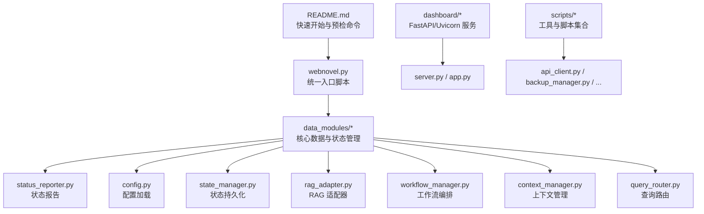
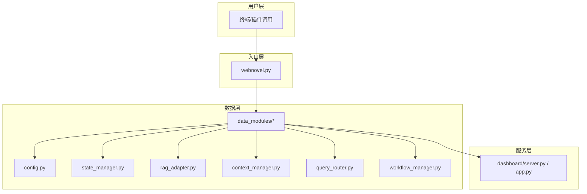
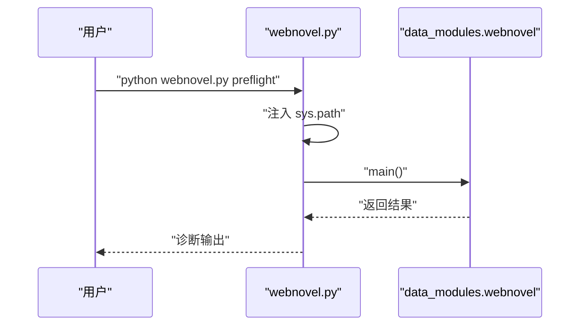
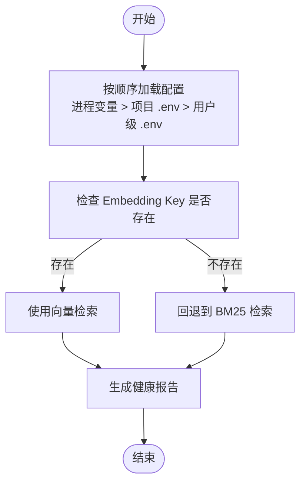
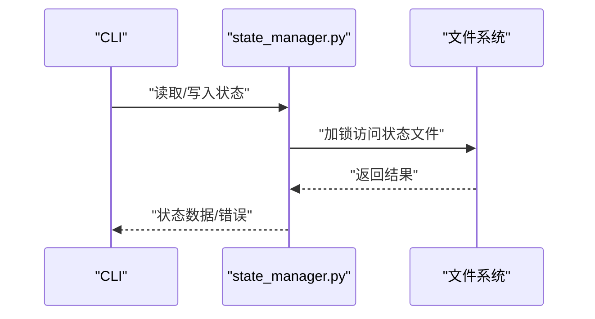
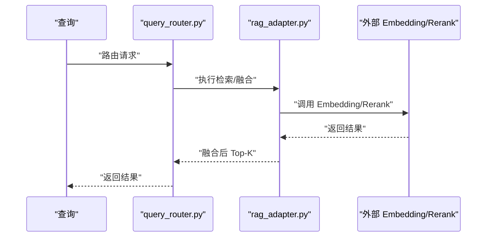
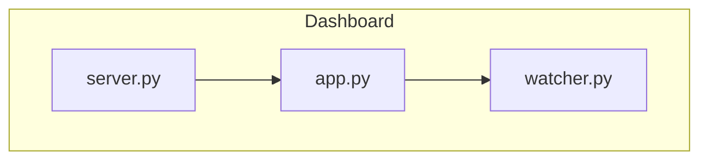
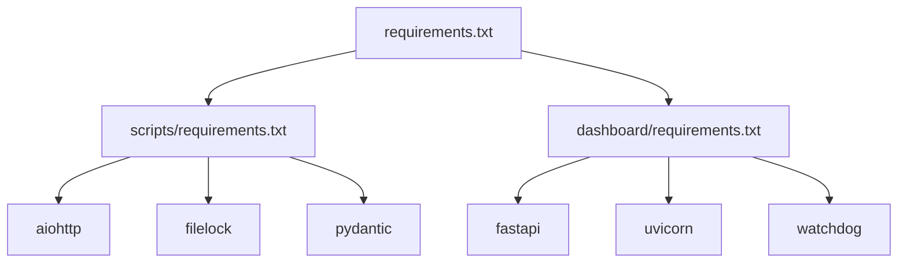

# 故障排除

<cite>
**本文引用的文件**
- [README.md](file://README.md)
- [docs/operations.md](file://docs/operations.md)
- [docs/rag-and-config.md](file://docs/rag-and-config.md)
- [requirements.txt](file://requirements.txt)
- [webnovel-writer/scripts/requirements.txt](file://webnovel-writer/scripts/requirements.txt)
- [webnovel-writer/dashboard/requirements.txt](file://webnovel-writer/dashboard/requirements.txt)
- [webnovel-writer/scripts/webnovel.py](file://webnovel-writer/scripts/webnovel.py)
- [webnovel-writer/scripts/data_modules/config.py](file://webnovel-writer/scripts/data_modules/config.py)
- [webnovel-writer/scripts/data_modules/state_manager.py](file://webnovel-writer/scripts/data_modules/state_manager.py)
- [webnovel-writer/scripts/data_modules/rag_adapter.py](file://webnovel-writer/scripts/data_modules/rag_adapter.py)
- [webnovel-writer/dashboard/server.py](file://webnovel-writer/dashboard/server.py)
- [webnovel-writer/dashboard/app.py](file://webnovel-writer/dashboard/app.py)
- [webnovel-writer/watcher.py](file://webnovel-writer/watcher.py)
- [webnovel-writer/workbench_service.py](file://webnovel-writer/workbench_service.py)
- [webnovel-writer/task_service.py](file://webnovel-writer/task_service.py)
- [webnovel-writer/models.py](file://webnovel-writer/models.py)
- [webnovel-writer/path_guard.py](file://webnovel-writer/path_guard.py)
- [webnovel-writer/claude_runner.py](file://webnovel-writer/claude_runner.py)
- [webnovel-writer/scripts/status_reporter.py](file://webnovel-writer/scripts/status_reporter.py)
- [webnovel-writer/scripts/init_project.py](file://webnovel-writer/scripts/init_project.py)
- [webnovel-writer/scripts/project_locator.py](file://webnovel-writer/scripts/project_locator.py)
- [webnovel-writer/scripts/runtime_compat.py](file://webnovel-writer/scripts/runtime_compat.py)
- [webnovel-writer/scripts/security_utils.py](file://webnovel-writer/scripts/security_utils.py)
- [webnovel-writer/scripts/migrate_state_to_sqlite.py](file://webnovel-writer/scripts/migrate_state_to_sqlite.py)
- [webnovel-writer/scripts/update_state.py](file://webnovel-writer/scripts/update_state.py)
- [webnovel-writer/scripts/workflow_manager.py](file://webnovel-writer/scripts/workflow_manager.py)
- [webnovel-writer/scripts/extract_chapter_context.py](file://webnovel-writer/scripts/extract_chapter_context.py)
- [webnovel-writer/scripts/backup_manager.py](file://webnovel-writer/scripts/backup_manager.py)
- [webnovel-writer/scripts/archive_manager.py](file://webnovel-writer/scripts/archive_manager.py)
- [webnovel-writer/scripts/api_client.py](file://webnovel-writer/scripts/api_client.py)
- [webnovel-writer/scripts/context_manager.py](file://webnovel-writer/scripts/context_manager.py)
- [webnovel-writer/scripts/query_router.py](file://webnovel-writer/scripts/query_router.py)
- [webnovel-writer/scripts/sync_plugin_version.py](file://webnovel-writer/scripts/sync_plugin_version.py)
</cite>

## 目录
1. [简介](#简介)
2. [项目结构](#项目结构)
3. [核心组件](#核心组件)
4. [架构总览](#架构总览)
5. [详细组件分析](#详细组件分析)
6. [依赖关系分析](#依赖关系分析)
7. [性能考虑](#性能考虑)
8. [故障排除指南](#故障排除指南)
9. [结论](#结论)
10. [附录](#附录)

## 简介
本指南面向使用 Webnovel Writer 的作者与运维人员，提供系统化的问题诊断与排错方法。覆盖安装与环境准备、配置错误、API 调用失败、RAG 环境问题、插件版本冲突、文件权限与路径解析、网络连接、性能瓶颈与数据异常等场景，并给出命令行诊断工具、日志分析技巧、错误定位策略、预防性维护与应急响应流程。

## 项目结构
Webnovel Writer 由“插件入口脚本 + 数据模块 + 可视化仪表盘 + 工具与脚本集合”构成，核心运行路径通过统一入口脚本转发至数据模块，配合 CLI 命令完成健康检查、索引重建、RAG 向量重建与状态报告等运维操作。

图表来源
- [README.md:78-82](file://README.md#L78-L82)
- [webnovel-writer/scripts/webnovel.py:1-37](file://webnovel-writer/scripts/webnovel.py#L1-L37)
- [docs/operations.md:63-99](file://docs/operations.md#L63-L99)

章节来源
- [README.md:21-88](file://README.md#L21-L88)
- [docs/operations.md:3-100](file://docs/operations.md#L3-L100)

## 核心组件
- 统一入口脚本：负责将插件 scripts 目录加入 sys.path 并转发到数据模块主入口，确保在项目级或用户级安装时均可正确调用。
- 数据模块：包含配置加载、状态管理、RAG 适配、上下文管理、查询路由、工作流编排等。
- 可视化仪表盘：基于 FastAPI/Uvicorn 提供只读面板，便于查看项目状态、实体图谱、章节/大纲与追读力。
- 工具与脚本：提供健康检查、索引重建、RAG 向量重建、备份归档、API 客户端、安全工具等。

章节来源
- [webnovel-writer/scripts/webnovel.py:1-37](file://webnovel-writer/scripts/webnovel.py#L1-L37)
- [webnovel-writer/scripts/data_modules/config.py](file://webnovel-writer/scripts/data_modules/config.py)
- [webnovel-writer/scripts/data_modules/state_manager.py](file://webnovel-writer/scripts/data_modules/state_manager.py)
- [webnovel-writer/scripts/data_modules/rag_adapter.py](file://webnovel-writer/scripts/data_modules/rag_adapter.py)
- [webnovel-writer/dashboard/server.py](file://webnovel-writer/dashboard/server.py)
- [webnovel-writer/dashboard/app.py](file://webnovel-writer/dashboard/app.py)

## 架构总览
系统采用“CLI 统一入口 + 数据模块 + 可视化服务”的分层架构。CLI 通过统一入口脚本解析项目根与转发命令；数据模块负责状态、索引、RAG、上下文与工作流；仪表盘提供只读可视化能力。

图表来源
- [webnovel-writer/scripts/webnovel.py:1-37](file://webnovel-writer/scripts/webnovel.py#L1-L37)
- [webnovel-writer/scripts/data_modules/config.py](file://webnovel-writer/scripts/data_modules/config.py)
- [webnovel-writer/scripts/data_modules/state_manager.py](file://webnovel-writer/scripts/data_modules/state_manager.py)
- [webnovel-writer/scripts/data_modules/rag_adapter.py](file://webnovel-writer/scripts/data_modules/rag_adapter.py)
- [webnovel-writer/dashboard/server.py](file://webnovel-writer/dashboard/server.py)
- [webnovel-writer/dashboard/app.py](file://webnovel-writer/dashboard/app.py)

## 详细组件分析

### 组件A：统一入口与项目根解析
- 功能要点
  - 将 scripts 目录加入 sys.path，延迟导入数据模块主入口，保证路径解析与兼容性。
  - 提供预检命令与项目根定位命令，便于诊断 CLI/插件目录与项目根解析问题。
- 关键路径
  - 入口转发逻辑与 UTF-8 标准输入输出兼容。
  - 预检命令与项目根定位命令的使用方式见 README 与运维文档。
- 故障定位
  - 若找不到数据模块主入口，检查 sys.path 是否包含 scripts 目录。
  - 若项目根解析失败，确认当前工作区与指针文件是否正确，参考运维文档中的目录层级说明。

图表来源
- [webnovel-writer/scripts/webnovel.py:24-36](file://webnovel-writer/scripts/webnovel.py#L24-L36)
- [README.md:78-82](file://README.md#L78-L82)

章节来源
- [webnovel-writer/scripts/webnovel.py:1-37](file://webnovel-writer/scripts/webnovel.py#L1-L37)
- [README.md:78-82](file://README.md#L78-L82)
- [docs/operations.md:63-71](file://docs/operations.md#L63-L71)

### 组件B：配置加载与 RAG 环境
- 功能要点
  - 配置加载顺序：进程环境变量 > 项目根 .env > 用户级全局 .env。
  - RAG 默认模型与回退策略：未配置 Embedding Key 时回退到 BM25。
- 常见问题
  - 环境变量未生效：检查加载顺序与作用域。
  - RAG 查询效果差：确认 Embedding Key 与 Base URL 配置，必要时启用 BM25 回退。
- 诊断步骤
  - 使用健康报告命令查看 RAG 状态与统计。
  - 对比不同作用域的 .env 文件，确认最终生效配置。

图表来源
- [docs/rag-and-config.md:15-37](file://docs/rag-and-config.md#L15-L37)
- [docs/operations.md:80-92](file://docs/operations.md#L80-L92)

章节来源
- [docs/rag-and-config.md:1-37](file://docs/rag-and-config.md#L1-L37)
- [docs/operations.md:80-92](file://docs/operations.md#L80-L92)

### 组件C：状态管理与数据一致性
- 功能要点
  - 状态持久化与并发控制（文件锁）。
  - 状态迁移与更新工具，支持 SQLite 迁移与状态更新。
- 常见问题
  - 状态不一致：检查状态文件是否被并发修改，确认文件锁机制是否正常。
  - 迁移失败：核对迁移脚本与数据库版本，确保迁移顺序正确。
- 诊断步骤
  - 使用状态报告命令聚焦 urgent 项。
  - 检查状态文件与锁文件是否存在异常。

图表来源
- [webnovel-writer/scripts/data_modules/state_manager.py](file://webnovel-writer/scripts/data_modules/state_manager.py)
- [webnovel-writer/scripts/migrate_state_to_sqlite.py](file://webnovel-writer/scripts/migrate_state_to_sqlite.py)
- [webnovel-writer/scripts/update_state.py](file://webnovel-writer/scripts/update_state.py)

章节来源
- [webnovel-writer/scripts/data_modules/state_manager.py](file://webnovel-writer/scripts/data_modules/state_manager.py)
- [webnovel-writer/scripts/migrate_state_to_sqlite.py](file://webnovel-writer/scripts/migrate_state_to_sqlite.py)
- [webnovel-writer/scripts/update_state.py](file://webnovel-writer/scripts/update_state.py)
- [docs/operations.md:80-85](file://docs/operations.md#L80-L85)

### 组件D：RAG 适配与查询路由
- 功能要点
  - RAG 适配器封装向量与重排序接口。
  - 查询路由根据 auto/graph_hybrid 等策略选择检索路径，并进行 RRF 融合与重排序。
- 常见问题
  - API 调用失败：检查 Base URL、模型与密钥配置。
  - 检索质量差：调整融合参数或切换检索策略。
- 诊断步骤
  - 使用 RAG 统计命令查看索引与查询状态。
  - 对比不同检索策略的效果。

图表来源
- [webnovel-writer/scripts/data_modules/rag_adapter.py](file://webnovel-writer/scripts/data_modules/rag_adapter.py)
- [webnovel-writer/scripts/query_router.py](file://webnovel-writer/scripts/query_router.py)
- [docs/rag-and-config.md:3-8](file://docs/rag-and-config.md#L3-L8)

章节来源
- [webnovel-writer/scripts/data_modules/rag_adapter.py](file://webnovel-writer/scripts/data_modules/rag_adapter.py)
- [webnovel-writer/scripts/query_router.py](file://webnovel-writer/scripts/query_router.py)
- [docs/rag-and-config.md:3-8](file://docs/rag-and-config.md#L3-L8)

### 组件E：可视化仪表盘
- 功能要点
  - 基于 FastAPI/Uvicorn 的只读面板，前端构建产物随插件发布。
  - 监控文件变化，提供实时刷新能力。
- 常见问题
  - 无法启动：检查依赖安装与端口占用。
  - 访问异常：确认工作区与项目根解析是否正确。
- 诊断步骤
  - 查看服务日志与依赖版本。
  - 使用文件监听器确认项目文件变更是否被感知。

图表来源
- [webnovel-writer/dashboard/server.py](file://webnovel-writer/dashboard/server.py)
- [webnovel-writer/dashboard/app.py](file://webnovel-writer/dashboard/app.py)
- [webnovel-writer/watcher.py](file://webnovel-writer/watcher.py)

章节来源
- [webnovel-writer/dashboard/server.py](file://webnovel-writer/dashboard/server.py)
- [webnovel-writer/dashboard/app.py](file://webnovel-writer/dashboard/app.py)
- [webnovel-writer/watcher.py](file://webnovel-writer/watcher.py)
- [webnovel-writer/dashboard/requirements.txt:1-4](file://webnovel-writer/dashboard/requirements.txt#L1-L4)

## 依赖关系分析
- 顶层依赖汇总了脚本与仪表盘的 Python 依赖，确保异步 HTTP 客户端、文件锁、Schema 校验与服务运行所需的基础库。
- 依赖版本建议
  - aiohttp、filelock、pydantic 保持较新版本以获得更好的稳定性与性能。
  - 仪表盘依赖 fastapi、uvicorn、watchdog，确保服务与文件监听正常。

图表来源
- [requirements.txt:1-3](file://requirements.txt#L1-L3)
- [webnovel-writer/scripts/requirements.txt:1-14](file://webnovel-writer/scripts/requirements.txt#L1-L14)
- [webnovel-writer/dashboard/requirements.txt:1-4](file://webnovel-writer/dashboard/requirements.txt#L1-L4)

章节来源
- [requirements.txt:1-3](file://requirements.txt#L1-L3)
- [webnovel-writer/scripts/requirements.txt:1-14](file://webnovel-writer/scripts/requirements.txt#L1-L14)
- [webnovel-writer/dashboard/requirements.txt:1-4](file://webnovel-writer/dashboard/requirements.txt#L1-L4)

## 性能考虑
- 异步 I/O 与并发控制
  - 使用异步 HTTP 客户端减少等待时间，结合文件锁避免状态文件并发写入冲突。
- 检索策略优化
  - 在 Embedding Key 不可用时启用 BM25 回退，保证检索可用性。
  - 合理设置融合与重排序参数，平衡召回与精度。
- 服务与监控
  - 仪表盘使用文件监听器实现增量刷新，减少无效轮询。
  - 健康报告聚焦 urgent 项，帮助快速定位性能瓶颈。

章节来源
- [webnovel-writer/scripts/requirements.txt:5-6](file://webnovel-writer/scripts/requirements.txt#L5-L6)
- [webnovel-writer/scripts/data_modules/state_manager.py](file://webnovel-writer/scripts/data_modules/state_manager.py)
- [docs/rag-and-config.md:35-36](file://docs/rag-and-config.md#L35-L36)
- [docs/operations.md:80-85](file://docs/operations.md#L80-L85)
- [webnovel-writer/watcher.py](file://webnovel-writer/watcher.py)

## 故障排除指南

### 一、安装与环境准备
- 症状
  - 插件安装后命令不可用或报路径错误。
  - Python 依赖安装失败或版本冲突。
- 原因分析
  - 插件未正确安装到用户级或项目级作用域。
  - 顶层 requirements.txt 未正确合并脚本与仪表盘依赖。
- 解决步骤
  - 按 README 的 Marketplace 安装步骤执行，并确认安装成功。
  - 使用统一入口脚本的预检命令进行环境自检。
  - 若依赖安装失败，先升级 pip，再按 requirements.txt 逐段安装。
- 诊断命令
  - 预检命令：参考 README 的预检命令。
  - 项目根定位：参考运维文档中的 where 命令。
- 日志与输出
  - 关注 sys.path 注入与数据模块主入口的导入输出。
  - 检查依赖安装日志中的版本冲突提示。

章节来源
- [README.md:23-38](file://README.md#L23-L38)
- [README.md:78-82](file://README.md#L78-L82)
- [docs/operations.md:63-71](file://docs/operations.md#L63-L71)
- [requirements.txt:1-3](file://requirements.txt#L1-L3)

### 二、配置错误
- 症状
  - RAG 查询失败或效果差。
  - 环境变量未生效导致功能异常。
- 原因分析
  - 配置加载顺序不符合预期，或 .env 文件缺失/格式错误。
  - RAG Key 未配置导致回退到 BM25。
- 解决步骤
  - 检查 .env 文件位置与内容，确认加载顺序。
  - 为每本书单独配置项目根 .env，避免多项目串扰。
  - 如需向量检索，补充 Embedding Key 与 Base URL。
- 诊断命令
  - 健康报告：聚焦 all/urgency，查看 RAG 统计。
  - RAG 状态：查看索引与查询统计。
- 日志与输出
  - 关注配置加载日志与 RAG 适配器的调用记录。

章节来源
- [docs/rag-and-config.md:15-37](file://docs/rag-and-config.md#L15-L37)
- [docs/operations.md:80-92](file://docs/operations.md#L80-L92)
- [webnovel-writer/scripts/data_modules/config.py](file://webnovel-writer/scripts/data_modules/config.py)

### 三、API 调用失败
- 症状
  - Embedding 或 Rerank 接口返回错误或超时。
  - 无法连接外部服务。
- 原因分析
  - Base URL 错误、Key 过期或配额不足。
  - 网络不稳定或代理配置问题。
- 解决步骤
  - 校验 Base URL 与 Key，必要时更换服务提供商。
  - 检查网络连通性与代理设置。
  - 适当增加超时与重试策略（若代码允许）。
- 诊断命令
  - 使用 RAG 统计命令查看调用状态。
  - 对比不同服务提供商的响应时间与成功率。
- 日志与输出
  - 关注 API 客户端的错误码与响应体。

章节来源
- [docs/rag-and-config.md:21-31](file://docs/rag-and-config.md#L21-L31)
- [webnovel-writer/scripts/api_client.py](file://webnovel-writer/scripts/api_client.py)
- [webnovel-writer/scripts/data_modules/rag_adapter.py](file://webnovel-writer/scripts/data_modules/rag_adapter.py)

### 四、性能问题
- 症状
  - 健康报告中出现性能相关警告。
  - RAG 查询响应慢或频繁失败。
- 原因分析
  - 缺少向量检索导致回退到 BM25，召回质量与速度受限。
  - 状态文件并发写入冲突或锁竞争。
- 解决步骤
  - 配置 Embedding Key 以启用向量检索。
  - 优化工作流与批处理策略，减少频繁写入。
  - 使用健康报告聚焦 urgent 项，定位瓶颈。
- 诊断命令
  - 健康报告：status -- --focus all/urgency。
  - RAG 统计：查看索引与查询统计。
- 日志与输出
  - 关注状态文件锁与并发写入日志。

章节来源
- [docs/rag-and-config.md:35-36](file://docs/rag-and-config.md#L35-L36)
- [docs/operations.md:80-92](file://docs/operations.md#L80-L92)
- [webnovel-writer/scripts/data_modules/state_manager.py](file://webnovel-writer/scripts/data_modules/state_manager.py)

### 五、数据异常
- 症状
  - 状态不一致、索引缺失或损坏。
  - 迁移失败或数据丢失。
- 原因分析
  - 并发写入未受控，文件锁失效。
  - 迁移脚本版本不匹配或中断。
- 解决步骤
  - 使用状态报告命令聚焦 urgent 项。
  - 重新执行索引重建与 RAG 向量重建。
  - 按顺序执行迁移脚本，确保数据库版本一致。
- 诊断命令
  - 索引重建：index process-chapter 与 index stats。
  - RAG 向量重建：rag index-chapter 与 rag stats。
- 日志与输出
  - 关注状态文件与迁移脚本的输出。

章节来源
- [docs/operations.md:73-92](file://docs/operations.md#L73-L92)
- [webnovel-writer/scripts/migrate_state_to_sqlite.py](file://webnovel-writer/scripts/migrate_state_to_sqlite.py)
- [webnovel-writer/scripts/update_state.py](file://webnovel-writer/scripts/update_state.py)

### 六、RAG 环境配置问题
- 症状
  - 未配置 Embedding Key 时检索效果差。
  - 模型与 Base URL 不匹配导致调用失败。
- 原因分析
  - 配置文件缺失或格式错误。
  - 作用域配置不当，导致加载顺序异常。
- 解决步骤
  - 为每本书单独配置项目根 .env。
  - 确认加载顺序：进程变量 > 项目 .env > 用户级 .env。
  - 如需向量检索，补充完整配置。
- 诊断命令
  - 健康报告与 RAG 统计。
- 日志与输出
  - 关注 RAG 适配器的调用与回退日志。

章节来源
- [docs/rag-and-config.md:15-37](file://docs/rag-and-config.md#L15-L37)
- [docs/operations.md:80-92](file://docs/operations.md#L80-L92)

### 七、插件版本冲突
- 症状
  - 插件安装后命令不可用或行为异常。
  - 版本不一致导致功能差异。
- 原因分析
  - Marketplace 与本地安装版本不一致。
  - 发布流程未正确同步版本信息。
- 解决步骤
  - 使用同步版本脚本统一版本信息与发布说明。
  - 通过 Actions 工作流执行发布校验。
- 诊断命令
  - 版本同步：sync_plugin_version.py。
  - 发布校验：Actions 工作流。
- 日志与输出
  - 关注版本校验与标签创建日志。

章节来源
- [README.md:130-147](file://README.md#L130-L147)
- [webnovel-writer/scripts/sync_plugin_version.py](file://webnovel-writer/scripts/sync_plugin_version.py)

### 八、文件权限与路径解析
- 症状
  - 无法读取/写入项目文件或状态文件。
  - 项目根解析失败或指向错误目录。
- 原因分析
  - 文件权限不足或路径越权。
  - 指针文件缺失或内容不正确。
- 解决步骤
  - 检查工作区与项目根目录权限。
  - 确认 .claude/.webnovel-current-project 指针文件内容。
  - 使用项目根定位命令验证解析结果。
- 诊断命令
  - 项目根定位：where 命令。
  - 路径守卫：path_guard.py。
- 日志与输出
  - 关注路径解析与权限错误日志。

章节来源
- [docs/operations.md:3-53](file://docs/operations.md#L3-L53)
- [webnovel-writer/scripts/project_locator.py](file://webnovel-writer/scripts/project_locator.py)
- [webnovel-writer/path_guard.py](file://webnovel-writer/path_guard.py)

### 九、网络连接问题
- 症状
  - API 调用超时或连接失败。
  - 间歇性断线影响检索稳定性。
- 原因分析
  - 网络不稳定或代理配置错误。
  - 服务端限流或证书问题。
- 解决步骤
  - 检查网络连通性与代理设置。
  - 尝试更换服务提供商或调整超时参数。
- 诊断命令
  - RAG 统计与健康报告。
- 日志与输出
  - 关注 API 客户端的错误码与重试日志。

章节来源
- [docs/rag-and-config.md:21-31](file://docs/rag-and-config.md#L21-L31)
- [webnovel-writer/scripts/api_client.py](file://webnovel-writer/scripts/api_client.py)

### 十、可视化仪表盘问题
- 症状
  - 仪表盘无法启动或页面空白。
  - 实时刷新不生效。
- 原因分析
  - 依赖未安装或版本不兼容。
  - 端口被占用或文件监听异常。
- 解决步骤
  - 安装 dashboard 依赖并确认版本。
  - 更换端口或关闭占用进程。
  - 检查文件监听器是否正常工作。
- 诊断命令
  - 服务启动日志与端口占用情况。
- 日志与输出
  - 关注 FastAPI/Uvicorn 启动日志与 watcher 输出。

章节来源
- [webnovel-writer/dashboard/requirements.txt:1-4](file://webnovel-writer/dashboard/requirements.txt#L1-L4)
- [webnovel-writer/dashboard/server.py](file://webnovel-writer/dashboard/server.py)
- [webnovel-writer/dashboard/app.py](file://webnovel-writer/dashboard/app.py)
- [webnovel-writer/watcher.py](file://webnovel-writer/watcher.py)

### 十一、命令行诊断工具与日志分析
- 常用命令
  - 预检：统一入口脚本的 preflight。
  - 项目根定位：where。
  - 健康报告：status -- --focus all/urgency。
  - 索引重建：index process-chapter 与 index stats。
  - RAG 向量重建：rag index-chapter 与 rag stats。
- 日志分析技巧
  - 关注配置加载顺序与最终生效配置。
  - 结合健康报告聚焦 urgent 项，快速定位问题。
  - 对比不同检索策略与服务提供商的响应。
- 错误定位策略
  - 从入口脚本到数据模块再到外部 API 的链路逐段排查。
  - 使用文件锁与状态文件日志判断并发问题。

章节来源
- [README.md:78-82](file://README.md#L78-L82)
- [docs/operations.md:63-99](file://docs/operations.md#L63-L99)

### 十二、预防性维护与应急响应
- 预防性维护
  - 定期执行健康报告与 RAG 统计，关注性能指标。
  - 按需重建索引与向量，保持检索质量。
  - 为每本书单独配置 .env，避免串扰。
- 应急响应流程
  - 出现异常时先执行预检与健康报告，收集日志。
  - 根据症状分类定位：配置、API、性能、数据、路径。
  - 必要时回滚到上一个稳定版本并重建索引/向量。
- 监控告警设置建议
  - 健康报告中的 urgent 项作为告警阈值。
  - API 调用失败率与响应时间作为外部服务监控指标。

章节来源
- [docs/operations.md:63-99](file://docs/operations.md#L63-L99)
- [webnovel-writer/scripts/status_reporter.py](file://webnovel-writer/scripts/status_reporter.py)

## 结论
通过系统化的故障排除流程与工具链，可以高效定位并解决 Webnovel Writer 在安装、配置、API 调用、性能、数据与可视化等方面的常见问题。建议将健康报告与 RAG 统计纳入日常运维，结合预检命令与日志分析，建立完善的监控与应急响应机制。

## 附录

### A. 常用命令清单
- 预检命令：统一入口脚本的 preflight。
- 项目根定位：where。
- 健康报告：status -- --focus all/urgency。
- 索引重建：index process-chapter 与 index stats。
- RAG 向量重建：rag index-chapter 与 rag stats。
- 版本同步：sync_plugin_version.py。

章节来源
- [README.md:78-82](file://README.md#L78-L82)
- [docs/operations.md:63-99](file://docs/operations.md#L63-L99)

### B. 问题报告模板
- 环境信息
  - 操作系统、Python 版本、插件版本。
  - 依赖安装情况与版本。
- 复现步骤
  - 详细的操作步骤与命令。
  - 期望结果与实际结果。
- 日志与截图
  - 健康报告与 RAG 统计输出。
  - 错误日志与屏幕截图。
- 附加信息
  - .env 配置摘要与网络环境。
  - 已尝试的解决步骤。