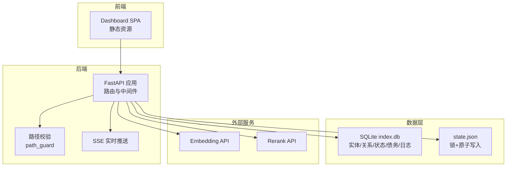
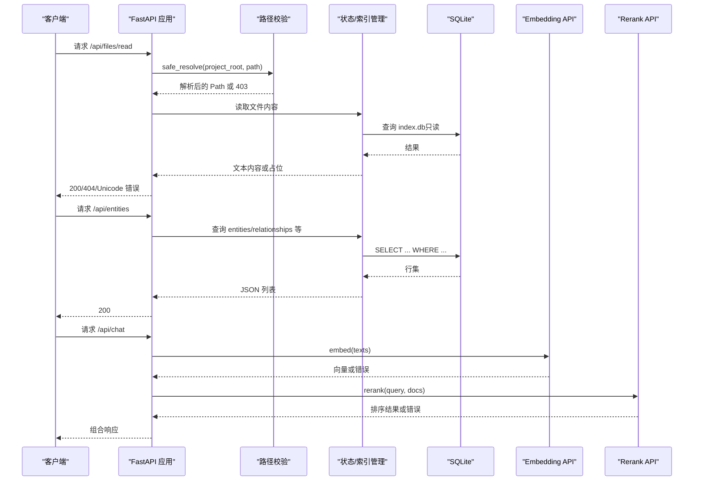
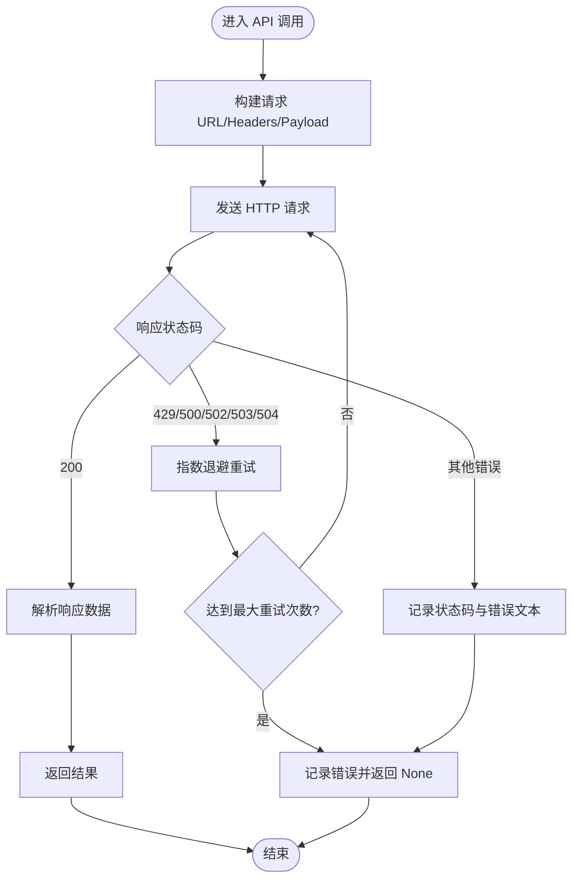
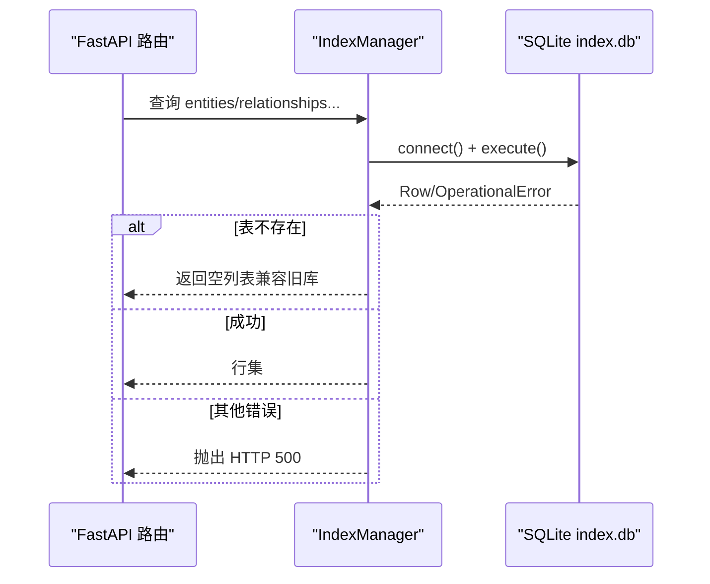
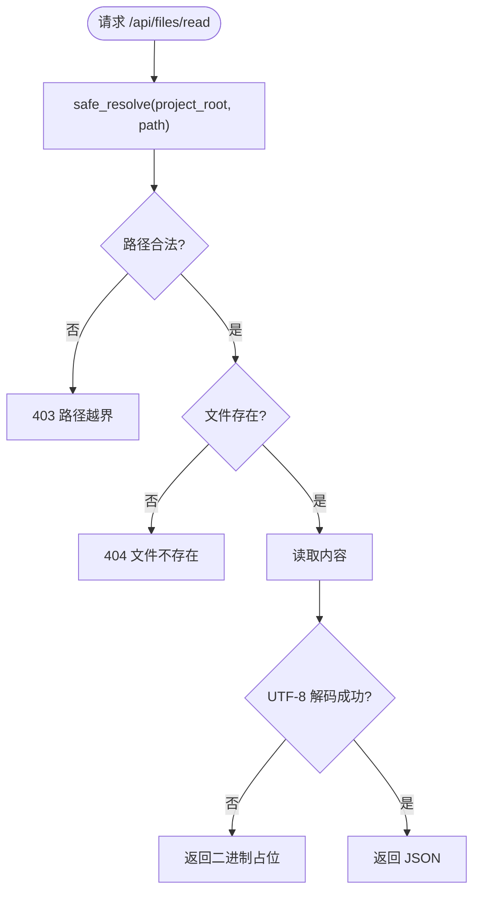
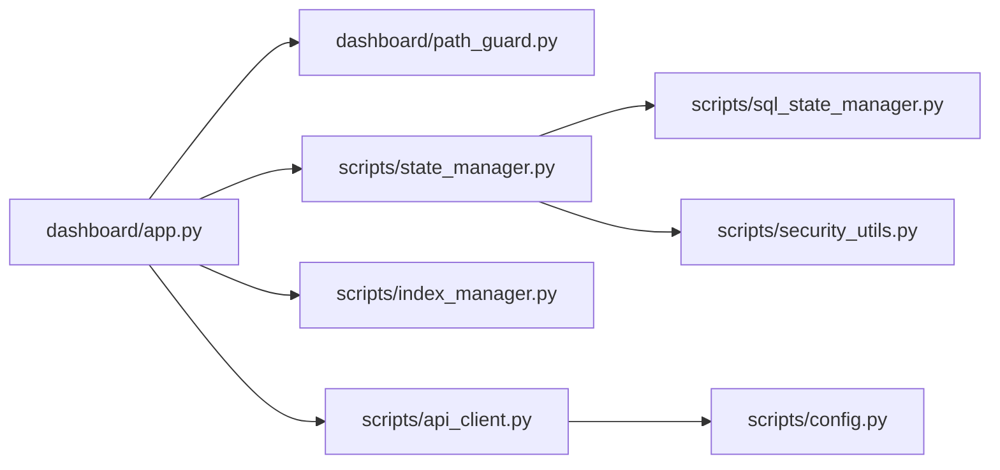

# 运行时错误处理

<cite>
**本文引用的文件**
- [app.py](file://webnovel-writer/dashboard/app.py)
- [server.py](file://webnovel-writer/dashboard/server.py)
- [path_guard.py](file://webnovel-writer/dashboard/path_guard.py)
- [api_client.py](file://webnovel-writer/scripts/data_modules/api_client.py)
- [config.py](file://webnovel-writer/scripts/data_modules/config.py)
- [state_manager.py](file://webnovel-writer/scripts/data_modules/state_manager.py)
- [sql_state_manager.py](file://webnovel-writer/scripts/data_modules/sql_state_manager.py)
- [index_manager.py](file://webnovel-writer/scripts/data_modules/index_manager.py)
- [security_utils.py](file://webnovel-writer/scripts/security_utils.py)
- [README.md](file://README.md)
- [operations.md](file://docs/operations.md)
</cite>

## 目录
1. [简介](#简介)
2. [项目结构](#项目结构)
3. [核心组件](#核心组件)
4. [架构总览](#架构总览)
5. [详细组件分析](#详细组件分析)
6. [依赖分析](#依赖分析)
7. [性能考量](#性能考量)
8. [故障排查指南](#故障排查指南)
9. [结论](#结论)
10. [附录](#附录)

## 简介
本指南面向 Webnovel Writer 的运行时错误处理，系统性梳理 API 调用失败、数据库连接与事务、文件系统操作、内存与资源耗尽、以及错误重试与降级策略。文档结合代码实现，提供可操作的诊断步骤、修复建议与应急响应流程，帮助保障系统的稳定性与可靠性。

## 项目结构
Webnovel Writer 采用前后端分离架构：
- 前端：Dashboard SPA（静态资源托管）
- 后端：FastAPI 应用，提供只读查询与最小写接口，统一经路径校验与 SSE 实时推送
- 数据层：SQLite（index.db）承载实体、关系、状态变化、追读力债务等数据；state.json 仅保留精简数据并通过锁与原子写入保证一致性
- 外部服务：通过异步 HTTP 客户端对接 Embedding/Rerank 等外部 API，具备指数退避与批量容错

图表来源
- [app.py:50-490](file://webnovel-writer/dashboard/app.py#L50-L490)
- [path_guard.py:11-29](file://webnovel-writer/dashboard/path_guard.py#L11-L29)
- [index_manager.py:235-621](file://webnovel-writer/scripts/data_modules/index_manager.py#L235-L621)
- [state_manager.py:208-370](file://webnovel-writer/scripts/data_modules/state_manager.py#L208-L370)
- [api_client.py:41-496](file://webnovel-writer/scripts/data_modules/api_client.py#L41-L496)

章节来源
- [app.py:50-490](file://webnovel-writer/dashboard/app.py#L50-L490)
- [README.md:1-170](file://README.md#L1-L170)

## 核心组件
- FastAPI 应用与路由：提供只读查询、文件浏览、任务与聊天接口，统一进行路径校验与错误处理
- 路径校验模块：严格限制文件访问范围，防止路径穿越
- SQLite 索引管理：负责 index.db 的表结构初始化、查询与写入
- 状态管理器：state.json 的锁与原子写入，SQLite 同步与回滚
- API 客户端：Embedding/Rerank 的异步 HTTP 客户端，具备并发、超时、重试与批量容错
- 安全工具：原子写入、文件锁、Git 降级、输入清理等

章节来源
- [app.py:80-489](file://webnovel-writer/dashboard/app.py#L80-L489)
- [path_guard.py:11-29](file://webnovel-writer/dashboard/path_guard.py#L11-L29)
- [index_manager.py:235-621](file://webnovel-writer/scripts/data_modules/index_manager.py#L235-L621)
- [state_manager.py:208-370](file://webnovel-writer/scripts/data_modules/state_manager.py#L208-L370)
- [api_client.py:41-496](file://webnovel-writer/scripts/data_modules/api_client.py#L41-L496)
- [security_utils.py:345-476](file://webnovel-writer/scripts/security_utils.py#L345-L476)

## 架构总览
后端通过 FastAPI 提供 REST 接口，所有文件读取均经 path_guard 校验，数据库访问通过 IndexManager 统一封装，状态变更通过 StateManager 与 SQLite 同步，外部 API 调用通过 API 客户端统一处理。

图表来源
- [app.py:365-428](file://webnovel-writer/dashboard/app.py#L365-L428)
- [path_guard.py:11-29](file://webnovel-writer/dashboard/path_guard.py#L11-L29)
- [index_manager.py:235-621](file://webnovel-writer/scripts/data_modules/index_manager.py#L235-L621)
- [api_client.py:118-383](file://webnovel-writer/scripts/data_modules/api_client.py#L118-L383)

## 详细组件分析

### API 调用失败诊断与修复
- HTTP 状态码错误
  - 常见可重试状态：429（限流）、500、502、503、504
  - 客户端实现：指数退避重试、超时控制、批量容错
  - 诊断要点：检查 last_error_status、last_error_message，确认网络连通与鉴权
- 请求参数验证失败
  - 路由层：对 path/content/action/context/message 等字段进行类型校验
  - API 客户端：payload 构造与响应解析遵循不同 API 类型（OpenAI/Modal）
- 响应格式异常
  - 客户端解析：按 API 类型解析 data 字段，排序 index，处理缺失字段
  - 建议：增加日志与回退策略，避免阻塞主流程

图表来源
- [api_client.py:118-195](file://webnovel-writer/scripts/data_modules/api_client.py#L118-L195)
- [api_client.py:312-383](file://webnovel-writer/scripts/data_modules/api_client.py#L312-L383)

章节来源
- [api_client.py:41-496](file://webnovel-writer/scripts/data_modules/api_client.py#L41-L496)
- [config.py:124-156](file://webnovel-writer/scripts/data_modules/config.py#L124-L156)

### 数据库连接错误排查（SQLite）
- 连接失败
  - 检查 index.db 是否存在与可访问（只读查询前会校验）
  - 确认 .webnovel 目录存在且权限正确
- 事务冲突与死锁
  - 状态管理器通过锁与原子写入减少并发冲突
  - SQLite 同步失败时保留 pending，避免静默丢数据
- 查询异常
  - 对“表不存在”等运行时错误进行捕获与降级（返回空列表）

图表来源
- [app.py:96-113](file://webnovel-writer/dashboard/app.py#L96-L113)
- [index_manager.py:622-631](file://webnovel-writer/scripts/data_modules/index_manager.py#L622-L631)
- [state_manager.py:371-407](file://webnovel-writer/scripts/data_modules/state_manager.py#L371-L407)

章节来源
- [app.py:96-113](file://webnovel-writer/dashboard/app.py#L96-L113)
- [index_manager.py:235-621](file://webnovel-writer/scripts/data_modules/index_manager.py#L235-L621)
- [state_manager.py:371-407](file://webnovel-writer/scripts/data_modules/state_manager.py#L371-L407)

### 文件系统操作错误处理
- 路径穿越防护
  - safe_resolve 严格校验解析路径不得越界 PROJECT_ROOT
  - 对非法路径与越界访问统一返回 403
- 文件读取异常
  - 文本文件读取失败返回占位信息，避免前端崩溃
- 写入与权限
  - state.json 通过原子写入与文件锁保证并发安全
  - 安全工具提供安全目录/文件创建与权限设置

图表来源
- [app.py:365-385](file://webnovel-writer/dashboard/app.py#L365-L385)
- [path_guard.py:11-29](file://webnovel-writer/dashboard/path_guard.py#L11-L29)
- [security_utils.py:345-476](file://webnovel-writer/scripts/security_utils.py#L345-L476)

章节来源
- [path_guard.py:11-29](file://webnovel-writer/dashboard/path_guard.py#L11-L29)
- [app.py:365-385](file://webnovel-writer/dashboard/app.py#L365-L385)
- [security_utils.py:137-195](file://webnovel-writer/scripts/security_utils.py#L137-L195)

### 内存泄漏与资源耗尽诊断
- 并发与连接池
  - API 客户端使用 aiohttp.ClientSession 与 TCPConnector 限制连接数
  - 通过信号量控制并发，避免资源耗尽
- 文件锁与原子写入
  - state.json 写入使用文件锁与备份回滚，降低资源竞争风险
- 建议
  - 监控进程内存与句柄数，必要时调整并发与超时参数
  - 对长时间运行的任务进行资源上限与超时控制

章节来源
- [api_client.py:57-61](file://webnovel-writer/scripts/data_modules/api_client.py#L57-L61)
- [state_manager.py:237-370](file://webnovel-writer/scripts/data_modules/state_manager.py#L237-L370)
- [config.py:144-151](file://webnovel-writer/scripts/data_modules/config.py#L144-L151)

### 错误重试机制与降级策略
- API 层
  - 指数退避重试（最大重试次数、初始延迟）
  - 批量处理失败时可选择跳过失败项或整体回退
- 数据层
  - SQLite 同步失败保留 pending，失败后恢复快照，避免静默丢数据
- 降级
  - 旧库“表不存在”时返回空列表
  - Git 不可用时优雅降级

章节来源
- [api_client.py:118-195](file://webnovel-writer/scripts/data_modules/api_client.py#L118-L195)
- [state_manager.py:561-584](file://webnovel-writer/scripts/data_modules/state_manager.py#L561-L584)
- [index_manager.py:104-112](file://webnovel-writer/scripts/data_modules/index_manager.py#L104-L112)
- [security_utils.py:284-333](file://webnovel-writer/scripts/security_utils.py#L284-L333)

## 依赖分析
- 组件耦合
  - FastAPI 应用依赖路径校验、状态/索引管理、任务服务与 SSE
  - 状态管理器依赖 SQLite 同步模块，回退到内存 state
  - API 客户端依赖配置模块与异步 HTTP
- 外部依赖
  - filelock（可选）、aiohttp、sqlite3、filelock（可选）

图表来源
- [app.py:20-24](file://webnovel-writer/dashboard/app.py#L20-L24)
- [state_manager.py:113-117](file://webnovel-writer/scripts/data_modules/state_manager.py#L113-L117)
- [api_client.py:30-31](file://webnovel-writer/scripts/data_modules/api_client.py#L30-L31)
- [config.py:90-108](file://webnovel-writer/scripts/data_modules/config.py#L90-L108)
- [security_utils.py:22-27](file://webnovel-writer/scripts/security_utils.py#L22-L27)

章节来源
- [app.py:20-24](file://webnovel-writer/dashboard/app.py#L20-L24)
- [state_manager.py:113-117](file://webnovel-writer/scripts/data_modules/state_manager.py#L113-L117)
- [api_client.py:30-31](file://webnovel-writer/scripts/data_modules/api_client.py#L30-L31)
- [config.py:90-108](file://webnovel-writer/scripts/data_modules/config.py#L90-L108)
- [security_utils.py:22-27](file://webnovel-writer/scripts/security_utils.py#L22-L27)

## 性能考量
- 并发与限流
  - 通过信号量与连接池限制并发，避免外部服务过载
- 查询优化
  - SQLite 建立多处索引，减少扫描成本
- I/O 优化
  - 原子写入减少磁盘碎片与竞态
- 建议
  - 根据硬件与外部服务 SLA 调整并发与超时
  - 对高频查询建立缓存或物化视图（视需求评估）

## 故障排查指南

### API 调用失败
- 现象
  - 响应状态码为 429/500/502/503/504 或超时
- 诊断
  - 查看 last_error_status/last_error_message
  - 检查 EMBED_BASE_URL/EMBED_API_KEY 等环境变量
  - 确认网络连通与外部服务可用性
- 修复
  - 调整 api_max_retries 与 api_retry_delay
  - 降低并发或增加超时
  - 使用 Modal/OpenAI 兼容接口切换

章节来源
- [api_client.py:118-195](file://webnovel-writer/scripts/data_modules/api_client.py#L118-L195)
- [config.py:124-156](file://webnovel-writer/scripts/data_modules/config.py#L124-L156)

### 数据库连接与查询异常
- 现象
  - index.db 不存在或查询报 OperationalError
- 诊断
  - 检查 .webnovel 目录与 index.db 权限
  - 确认表是否存在（旧库可能缺少新表）
- 修复
  - 重建索引：参考运维文档的索引重建命令
  - 降级处理：表不存在时返回空列表

章节来源
- [app.py:96-113](file://webnovel-writer/dashboard/app.py#L96-L113)
- [operations.md:73-78](file://docs/operations.md#L73-L78)

### 文件系统错误
- 现象
  - 403 路径越界、404 文件不存在、UnicodeDecodeError
- 诊断
  - safe_resolve 是否抛出 403
  - 文件是否在允许的三大目录内
  - 文件编码是否为 UTF-8
- 修复
  - 修正请求路径，确保在允许范围内
  - 更正文件编码或返回二进制占位

章节来源
- [path_guard.py:11-29](file://webnovel-writer/dashboard/path_guard.py#L11-L29)
- [app.py:365-385](file://webnovel-writer/dashboard/app.py#L365-L385)

### 状态文件写入失败
- 现象
  - 无法获取 state.json 文件锁、写入中断
- 诊断
  - 检查文件锁路径与权限
  - 确认磁盘空间与写入权限
- 修复
  - 等待锁释放或重启进程
  - 使用备份恢复（.bak）

章节来源
- [state_manager.py:237-370](file://webnovel-writer/scripts/data_modules/state_manager.py#L237-L370)
- [security_utils.py:478-507](file://webnovel-writer/scripts/security_utils.py#L478-L507)

### 外部服务不可用
- 现象
  - Git 不可用、API 超时或拒绝
- 诊断
  - is_git_available 与超时设置
  - API 客户端错误日志
- 修复
  - 安装 Git 或禁用相关功能
  - 调整超时与重试策略

章节来源
- [security_utils.py:234-333](file://webnovel-writer/scripts/security_utils.py#L234-L333)
- [api_client.py:118-195](file://webnovel-writer/scripts/data_modules/api_client.py#L118-L195)

## 结论
Webnovel Writer 在运行时错误处理方面具备完善的防护与降级机制：路径校验杜绝越界访问，SQLite 查询与状态写入通过锁与原子写入保证一致性，API 客户端提供指数退避与批量容错，运维文档提供索引与健康报告等工具。遵循本文提供的诊断与修复步骤，可有效提升系统的稳定性与可靠性。

## 附录
- 运维命令参考
  - 索引重建：参考运维文档中的 index process-chapter 与 stats
  - 健康报告：status -- --focus all/urgency
  - 向量重建：rag index-chapter 与 rag stats
- 预检命令
  - 使用统一预检命令排查 CLI/插件/项目根解析问题

章节来源
- [operations.md:73-99](file://docs/operations.md#L73-L99)
- [README.md:78-83](file://README.md#L78-L83)