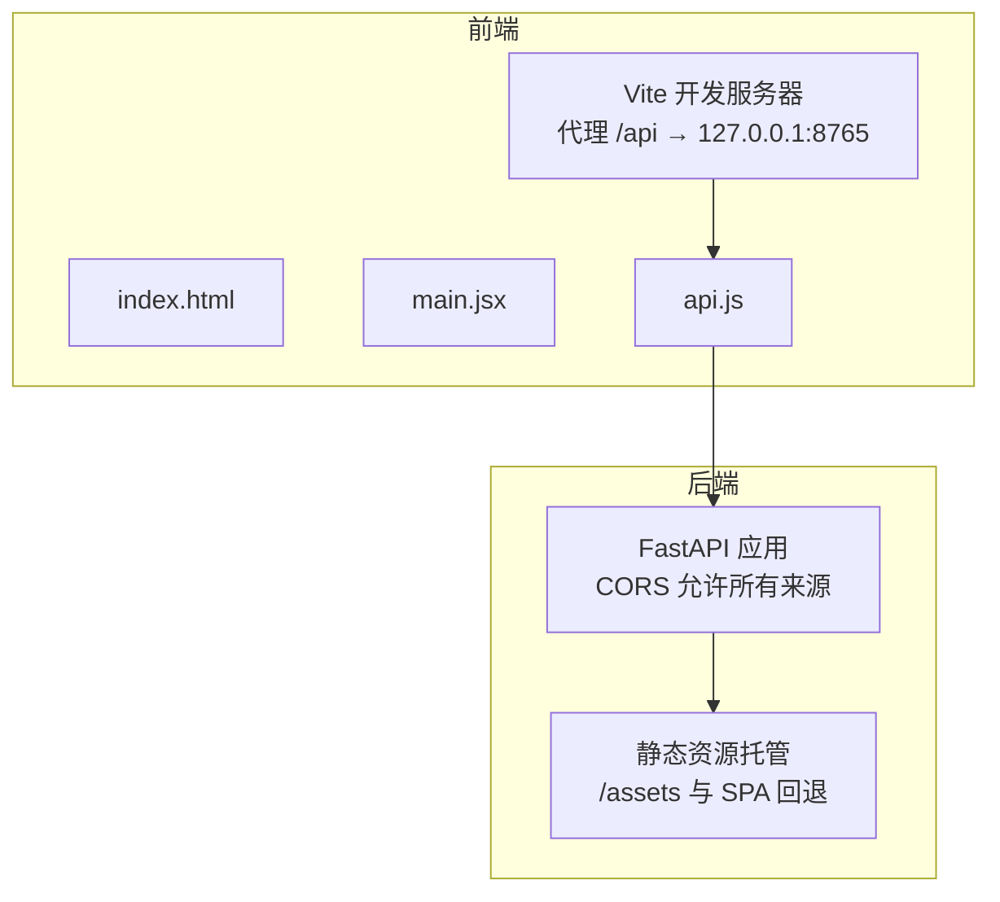
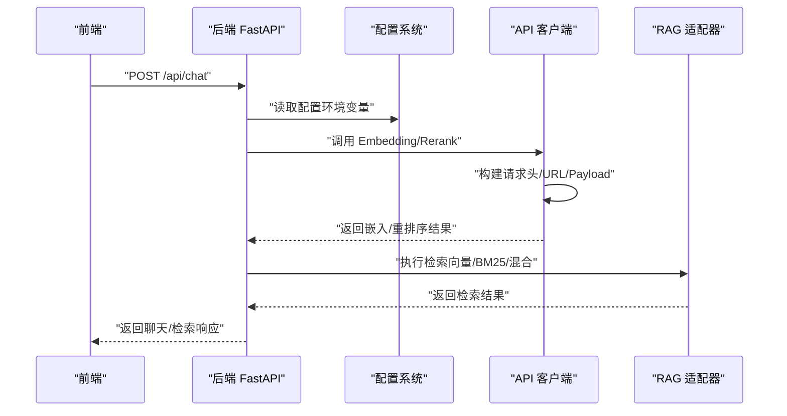
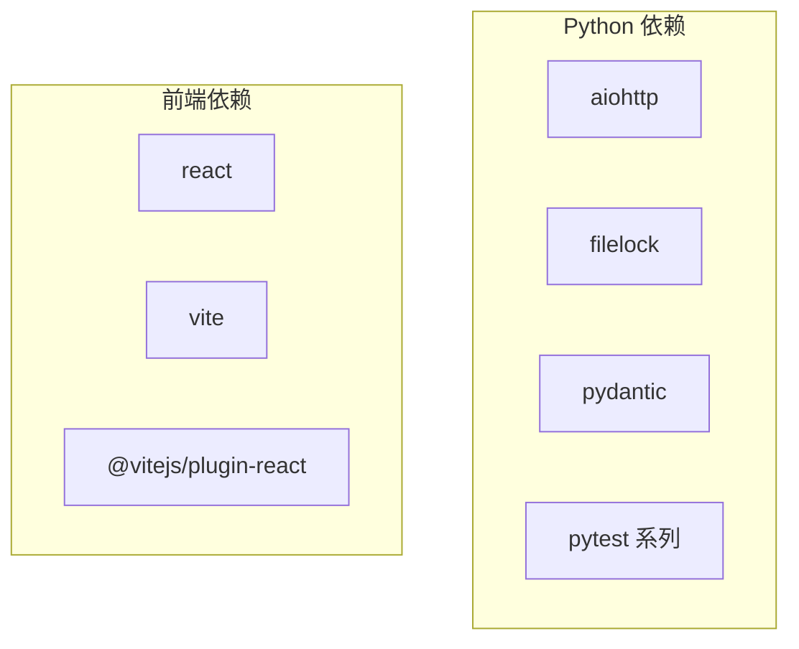
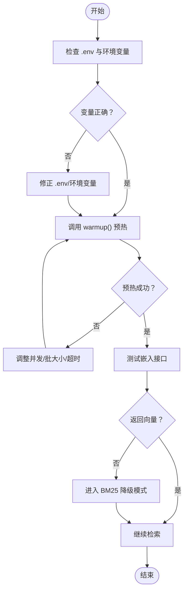

# 配置问题排查

<cite>
**本文引用的文件**
- [vite.config.js](file://webnovel-writer/dashboard/frontend/vite.config.js)
- [package.json](file://webnovel-writer/dashboard/frontend/package.json)
- [index.html](file://webnovel-writer/dashboard/frontend/index.html)
- [main.jsx](file://webnovel-writer/dashboard/frontend/src/main.jsx)
- [api.js](file://webnovel-writer/dashboard/frontend/src/api.js)
- [app.py](file://webnovel-writer/dashboard/app.py)
- [config.py](file://webnovel-writer/webnovel-writer/scripts/data_modules/config.py)
- [api_client.py](file://webnovel-writer/webnovel-writer/scripts/data_modules/api_client.py)
- [rag_adapter.py](file://webnovel-writer/webnovel-writer/scripts/data_modules/rag_adapter.py)
- [backup_manager.py](file://webnovel-writer/webnovel-writer/scripts/backup_manager.py)
- [requirements.txt](file://webnovel-writer/webnovel-writer/scripts/requirements.txt)
- [rag-and-config.md](file://docs/rag-and-config.md)
</cite>

## 目录
1. [简介](#简介)
2. [项目结构](#项目结构)
3. [核心组件](#核心组件)
4. [架构总览](#架构总览)
5. [详细组件分析](#详细组件分析)
6. [依赖分析](#依赖分析)
7. [性能考虑](#性能考虑)
8. [故障排查指南](#故障排查指南)
9. [结论](#结论)
10. [附录](#附录)

## 简介
本指南面向 Webnovel Writer 的使用者与维护者，聚焦于配置问题的系统化排查与修复。内容覆盖：
- RAG 环境配置错误：向量数据库连接失败、嵌入模型加载错误、索引配置不当等
- Claude API 密钥配置问题：认证失败、配额限制、网络访问控制等
- 前端构建配置问题：Vite 代理、静态资源加载、跨域等
- 环境变量设置错误：路径、编码、代理等常见问题
- 配置文件验证工具、环境检查脚本与配置备份恢复流程

## 项目结构
Webnovel Writer 采用前后端分离架构：
- 前端位于 dashboard/frontend，使用 Vite 构建，FastAPI 提供后端 API 与静态资源托管
- 后端负责文件系统访问、任务调度、RAG 查询日志与 SSE 实时推送
- RAG 与配置逻辑集中在 scripts/data_modules 下，通过环境变量驱动

图表来源
- [vite.config.js:4-15](file://webnovel-writer/dashboard/frontend/vite.config.js#L4-L15)
- [api.js:5-25](file://webnovel-writer/dashboard/frontend/src/api.js#L5-L25)
- [app.py:67-74](file://webnovel-writer/dashboard/app.py#L67-L74)
- [app.py:466-487](file://webnovel-writer/dashboard/app.py#L466-L487)

章节来源
- [vite.config.js:1-16](file://webnovel-writer/dashboard/frontend/vite.config.js#L1-L16)
- [package.json:1-23](file://webnovel-writer/dashboard/frontend/package.json#L1-L23)
- [index.html:1-17](file://webnovel-writer/dashboard/frontend/index.html#L1-L17)
- [main.jsx:1-11](file://webnovel-writer/dashboard/frontend/src/main.jsx#L1-L11)
- [api.js:1-78](file://webnovel-writer/dashboard/frontend/src/api.js#L1-L78)
- [app.py:1-513](file://webnovel-writer/dashboard/app.py#L1-L513)

## 核心组件
- 配置系统：集中于 scripts/data_modules/config.py，支持 .env 加载、项目级与用户级优先级、默认值与路径推导
- API 客户端：scripts/data_modules/api_client.py，封装 Embedding/Rerank 的 OpenAI 兼容与 Modal 接口，含重试、超时、并发控制
- RAG 适配器：scripts/data_modules/rag_adapter.py，负责向量/关键词混合检索、BM25 索引、SQLite 模式迁移与备份
- 前端：dashboard/frontend，Vite + React，通过 api.js 发起 /api 请求，经后端代理至后端服务
- 后端：dashboard/app.py，FastAPI，提供文件读写、实体查询、任务与聊天、SSE、静态资源托管
- 备份管理：scripts/backup_manager.py，基于 Git 的原子性备份与回滚

章节来源
- [config.py:1-349](file://webnovel-writer/webnovel-writer/scripts/data_modules/config.py#L1-L349)
- [api_client.py:1-496](file://webnovel-writer/webnovel-writer/scripts/data_modules/api_client.py#L1-L496)
- [rag_adapter.py:1-800](file://webnovel-writer/webnovel-writer/scripts/data_modules/rag_adapter.py#L1-L800)
- [app.py:1-513](file://webnovel-writer/dashboard/app.py#L1-L513)
- [backup_manager.py:1-470](file://webnovel-writer/webnovel-writer/scripts/backup_manager.py#L1-L470)

## 架构总览
RAG 与配置相关的关键交互如下：

图表来源
- [api.js:39-41](file://webnovel-writer/dashboard/frontend/src/api.js#L39-L41)
- [app.py:420-428](file://webnovel-writer/dashboard/app.py#L420-L428)
- [config.py:124-156](file://webnovel-writer/webnovel-writer/scripts/data_modules/config.py#L124-L156)
- [api_client.py:118-195](file://webnovel-writer/webnovel-writer/scripts/data_modules/api_client.py#L118-L195)
- [rag_adapter.py:560-650](file://webnovel-writer/webnovel-writer/scripts/data_modules/rag_adapter.py#L560-L650)

## 详细组件分析

### RAG 配置与环境变量
- 环境变量加载顺序：进程环境变量 > 项目级 .env > 用户级 ~/.claude/webnovel-writer/.env
- 关键变量：EMBED_BASE_URL/EMBED_MODEL/EMBED_API_KEY、RERANK_BASE_URL/RERANK_MODEL/RERANK_API_KEY
- 默认模型：Embedding Qwen/Qwen3-Embedding-8B、Reranker jina-reranker-v3
- 配置优先级与兜底策略：显式环境变量优先，.env 仅在未设置时生效

章节来源
- [rag-and-config.md:15-37](file://docs/rag-and-config.md#L15-L37)
- [config.py:51-77](file://webnovel-writer/webnovel-writer/scripts/data_modules/config.py#L51-L77)
- [config.py:124-156](file://webnovel-writer/webnovel-writer/scripts/data_modules/config.py#L124-L156)

### API 客户端与重试机制
- 支持 OpenAI 兼容与 Modal 自定义接口
- 并发与批大小：embed_concurrency、embed_batch_size
- 超时与重试：冷启动与常规超时、指数退避重试（429/500/502/503/504 可重试）
- 错误状态记录：Embedding 客户端记录 last_error_status，用于降级模式判断

章节来源
- [api_client.py:41-195](file://webnovel-writer/webnovel-writer/scripts/data_modules/api_client.py#L41-L195)
- [api_client.py:239-383](file://webnovel-writer/webnovel-writer/scripts/data_modules/api_client.py#L239-L383)
- [rag_adapter.py:83-88](file://webnovel-writer/webnovel-writer/scripts/data_modules/rag_adapter.py#L83-L88)

### RAG 适配器与数据库
- 数据库：SQLite vectors/bm25_index/doc_stats 表，自动建表与模式迁移
- 检索：向量相似度、BM25 关键词、混合检索（RRF 融合 + Rerank）
- 备份：schema 迁移前自动备份 vectors.db，失败时可恢复
- 性能：参数化查询、批量插入、索引优化（章节/父 chunk/类型/词项）

章节来源
- [rag_adapter.py:90-118](file://webnovel-writer/webnovel-writer/scripts/data_modules/rag_adapter.py#L90-L118)
- [rag_adapter.py:206-245](file://webnovel-writer/webnovel-writer/scripts/data_modules/rag_adapter.py#L206-L245)
- [rag_adapter.py:139-153](file://webnovel-writer/webnovel-writer/scripts/data_modules/rag_adapter.py#L139-L153)

### 前端构建与代理
- Vite 代理：/api → http://127.0.0.1:8765
- 构建输出：dist，静态资源 assets
- SPA 回退：除 /api 外路由均返回 index.html
- CORS：后端允许所有来源，便于本地联调

章节来源
- [vite.config.js:4-15](file://webnovel-writer/dashboard/frontend/vite.config.js#L4-L15)
- [app.py:67-74](file://webnovel-writer/dashboard/app.py#L67-L74)
- [app.py:466-487](file://webnovel-writer/dashboard/app.py#L466-L487)

### 备份与回滚
- Git 集成：自动提交、打标签、回滚到指定章节
- 本地降级：Git 不可用时使用本地备份
- 安全：提交消息清理、权限与异常处理

章节来源
- [backup_manager.py:70-144](file://webnovel-writer/webnovel-writer/scripts/backup_manager.py#L70-L144)
- [backup_manager.py:192-249](file://webnovel-writer/webnovel-writer/scripts/backup_manager.py#L192-L249)
- [backup_manager.py:251-304](file://webnovel-writer/webnovel-writer/scripts/backup_manager.py#L251-L304)

## 依赖分析
- Python 依赖：aiohttp、filelock、pydantic（核心）、pytest 系列（开发/测试）
- 前端依赖：React、Vite、@vitejs/plugin-react

图表来源
- [requirements.txt:4-14](file://webnovel-writer/webnovel-writer/scripts/requirements.txt#L4-L14)
- [package.json:11-21](file://webnovel-writer/dashboard/frontend/package.json#L11-L21)

章节来源
- [requirements.txt:1-14](file://webnovel-writer/webnovel-writer/scripts/requirements.txt#L1-L14)
- [package.json:1-23](file://webnovel-writer/dashboard/frontend/package.json#L1-L23)

## 性能考虑
- 并发与批大小：合理设置 embed_concurrency 与 embed_batch_size，避免 API 限流与内存峰值
- 超时策略：冷启动超时与常规超时区分，指数退避降低抖动
- 数据库索引：章节、父 chunk、类型、词项索引提升检索效率
- 前端构建：生产构建开启压缩与缓存，减少首屏加载

## 故障排查指南

### 一、RAG 环境配置错误排查
- 症状：向量检索为空、仅 BM25 生效
  - 排查要点：
    - 检查 EMBED_API_KEY 是否设置，确认 last_error_status 是否为 401
    - 确认 EMBED_BASE_URL/EMBED_MODEL 正确，必要时切换为 OpenAI 兼容或 Modal 接口
    - 若嵌入失败，RAG 会降级为仅 BM25 索引
  - 修复建议：
    - 在项目根目录 .env 写入最小配置，避免多项目串扰
    - 使用 get_client.warmup() 预热服务，观察日志
    - 调整并发与批大小，避免限流

- 症状：向量数据库连接失败或表结构异常
  - 排查要点：
    - 检查 .webnovel/vectors.db 是否存在与可写
    - 查看迁移日志，确认是否触发 schema_migration 备份
    - 确认 SQLite 权限与磁盘空间
  - 修复建议：
    - 运行迁移流程，失败时使用备份恢复
    - 检查索引与表是否存在，必要时重建

- 症状：检索结果质量差或速度慢
  - 排查要点：
    - 检查 vector_top_k、bm25_top_k、rerank_top_n 设置
    - 确认 RRF 融合参数与 Rerank 模型
    - 观察数据库索引是否缺失
  - 修复建议：
    - 适度提高 top_k，结合 Rerank 提升召回
    - 为常用查询建立索引，优化查询计划

章节来源
- [rag-and-config.md:15-37](file://docs/rag-and-config.md#L15-L37)
- [config.py:124-156](file://webnovel-writer/webnovel-writer/scripts/data_modules/config.py#L124-L156)
- [api_client.py:118-195](file://webnovel-writer/webnovel-writer/scripts/data_modules/api_client.py#L118-L195)
- [rag_adapter.py:83-88](file://webnovel-writer/webnovel-writer/scripts/data_modules/rag_adapter.py#L83-L88)
- [rag_adapter.py:90-118](file://webnovel-writer/webnovel-writer/scripts/data_modules/rag_adapter.py#L90-L118)
- [rag_adapter.py:206-245](file://webnovel-writer/webnovel-writer/scripts/data_modules/rag_adapter.py#L206-L245)

### 二、Claude API 密钥配置问题
- 症状：认证失败（401）
  - 排查要点：
    - 检查 EMBED_API_KEY/RERANK_API_KEY 是否正确
    - 确认 Base URL 与模型名称匹配供应商接口
    - 查看 Embedding 客户端 last_error_status
  - 修复建议：
    - 在项目级 .env 或用户级 .env 中重新设置
    - 使用供应商提供的测试接口验证密钥

- 症状：配额限制（429）
  - 排查要点：
    - 观察指数退避重试日志
    - 检查并发与批大小是否过高
  - 修复建议：
    - 降低并发与批大小，延长重试间隔
    - 调整冷启动与常规超时

- 症状：网络访问控制（502/503/504）
  - 排查要点：
    - 检查代理与防火墙设置
    - 确认供应商服务可用性
  - 修复建议：
    - 配置系统代理，确保直连或代理可达
    - 临时切换到备用供应商或接口

章节来源
- [api_client.py:118-195](file://webnovel-writer/webnovel-writer/scripts/data_modules/api_client.py#L118-L195)
- [api_client.py:312-383](file://webnovel-writer/webnovel-writer/scripts/data_modules/api_client.py#L312-L383)
- [rag_adapter.py:83-88](file://webnovel-writer/webnovel-writer/scripts/data_modules/rag_adapter.py#L83-L88)

### 三、前端构建配置问题
- 症状：Vite 启动报错或代理无效
  - 排查要点：
    - 检查 vite.config.js 代理配置与端口占用
    - 确认 package.json 脚本与依赖安装
  - 修复建议：
    - 修改代理目标为实际后端地址
    - 清理 node_modules 并重新安装依赖

- 症状：静态资源加载失败或 404
  - 排查要点：
    - 确认 dist 目录存在与权限
    - 检查 /assets 路由与 SPA 回退
  - 修复建议：
    - 先执行构建再启动后端
    - 校验静态资源路径与 CDN 配置

- 症状：跨域问题（CORS）
  - 排查要点：
    - 后端已允许所有来源，检查浏览器控制台
  - 修复建议：
    - 生产环境配置具体允许来源
    - 使用代理绕过浏览器同源限制

章节来源
- [vite.config.js:4-15](file://webnovel-writer/dashboard/frontend/vite.config.js#L4-L15)
- [package.json:6-10](file://webnovel-writer/dashboard/frontend/package.json#L6-L10)
- [app.py:67-74](file://webnovel-writer/dashboard/app.py#L67-L74)
- [app.py:466-487](file://webnovel-writer/dashboard/app.py#L466-L487)

### 四、环境变量设置错误
- 症状：路径解析错误或编码异常
  - 排查要点：
    - 检查 WEBNOVEL_CLAUDE_HOME/CLAUDE_HOME 与路径规范化
    - 确认 .env 文件编码为 UTF-8
  - 修复建议：
    - 使用 normalize_windows_path 与 expanduser/resolve
    - 在 Windows 下确保 UTF-8 标准输出

- 症状：代理配置导致请求失败
  - 排查要点：
    - 检查系统代理与 npm/Python 代理
  - 修复建议：
    - 临时禁用代理或配置白名单
    - 使用直连测试供应商接口

章节来源
- [config.py:20-27](file://webnovel-writer/webnovel-writer/scripts/data_modules/config.py#L20-L27)
- [config.py:30-48](file://webnovel-writer/webnovel-writer/scripts/data_modules/config.py#L30-L48)
- [config.py:51-77](file://webnovel-writer/webnovel-writer/scripts/data_modules/config.py#L51-L77)

### 五、配置文件验证与备份恢复
- 配置验证
  - 使用 get_config() 读取配置，检查 .webnovel 目录与数据库文件存在性
  - 通过 get_client.warmup() 验证 API 可用性
- 环境检查脚本
  - 建议编写最小化检查脚本：读取 .env、调用 warmup、查询向量表
- 备份与恢复
  - Git 备份：自动提交、打标签、回滚到指定章节
  - 本地降级：Git 不可用时使用本地备份目录
  - 恢复流程：schema 迁移失败时从备份复制回原库

章节来源
- [config.py:329-343](file://webnovel-writer/webnovel-writer/scripts/data_modules/config.py#L329-L343)
- [api_client.py:427-441](file://webnovel-writer/webnovel-writer/scripts/data_modules/api_client.py#L427-L441)
- [backup_manager.py:192-249](file://webnovel-writer/webnovel-writer/scripts/backup_manager.py#L192-L249)
- [backup_manager.py:251-304](file://webnovel-writer/webnovel-writer/scripts/backup_manager.py#L251-L304)
- [rag_adapter.py:139-153](file://webnovel-writer/webnovel-writer/scripts/data_modules/rag_adapter.py#L139-L153)

## 结论
- RAG 配置的核心在于环境变量的正确性与 API 的稳定性，配合合理的并发与批大小可显著提升性能
- 前端与后端的代理与 CORS 需保持一致，避免跨域与路由冲突
- 备份与回滚机制是保障数据一致性的关键，建议在每次重要节点执行备份
- 通过日志与状态码快速定位问题，优先从配置与网络入手

## 附录

### A. 常见问题速查表
- RAG 无结果：检查 EMBED_API_KEY 与 Base URL，确认 last_error_status
- 向量库异常：检查 vectors.db 权限与迁移日志，必要时恢复备份
- 前端 404：确认 dist 构建完成与 SPA 回退配置
- 跨域失败：核对后端 CORS 与浏览器代理设置
- 环境变量冲突：优先使用项目级 .env，避免全局污染

### B. 诊断流程图（RAG 嵌入失败）

图表来源
- [config.py:51-77](file://webnovel-writer/webnovel-writer/scripts/data_modules/config.py#L51-L77)
- [api_client.py:118-195](file://webnovel-writer/webnovel-writer/scripts/data_modules/api_client.py#L118-L195)
- [rag_adapter.py:83-88](file://webnovel-writer/webnovel-writer/scripts/data_modules/rag_adapter.py#L83-L88)