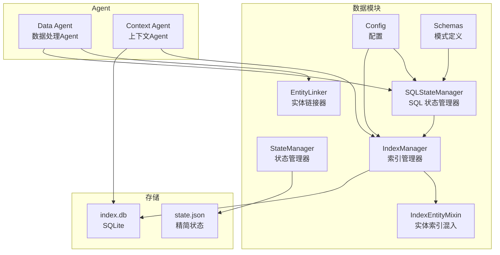
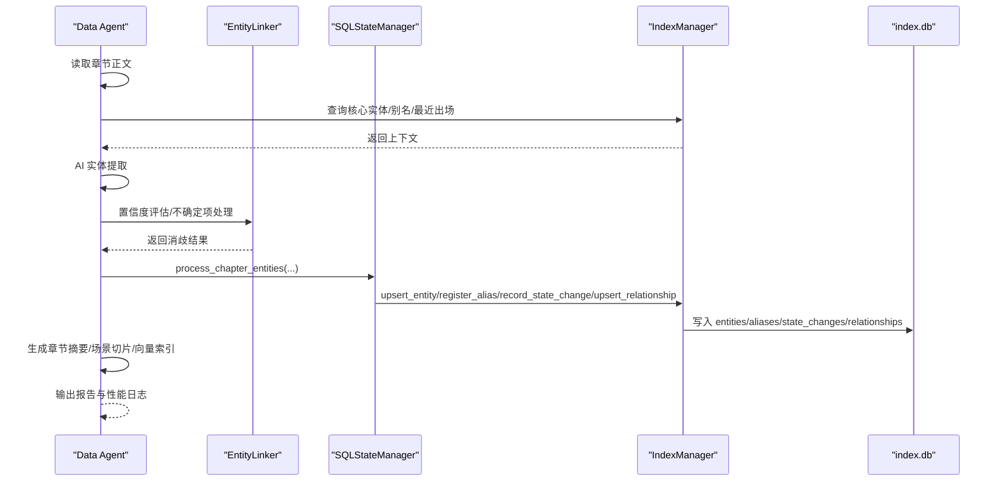
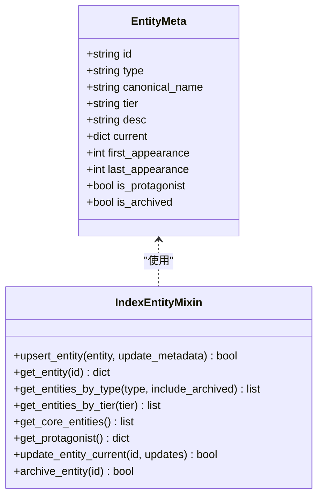
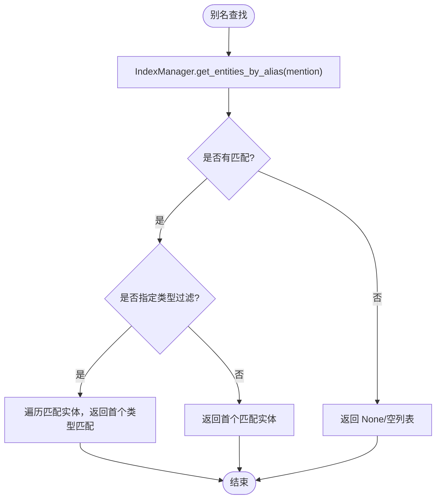
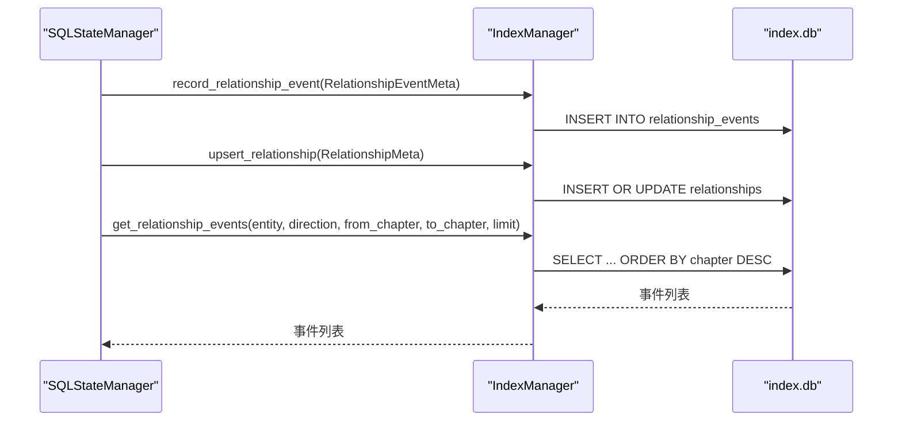
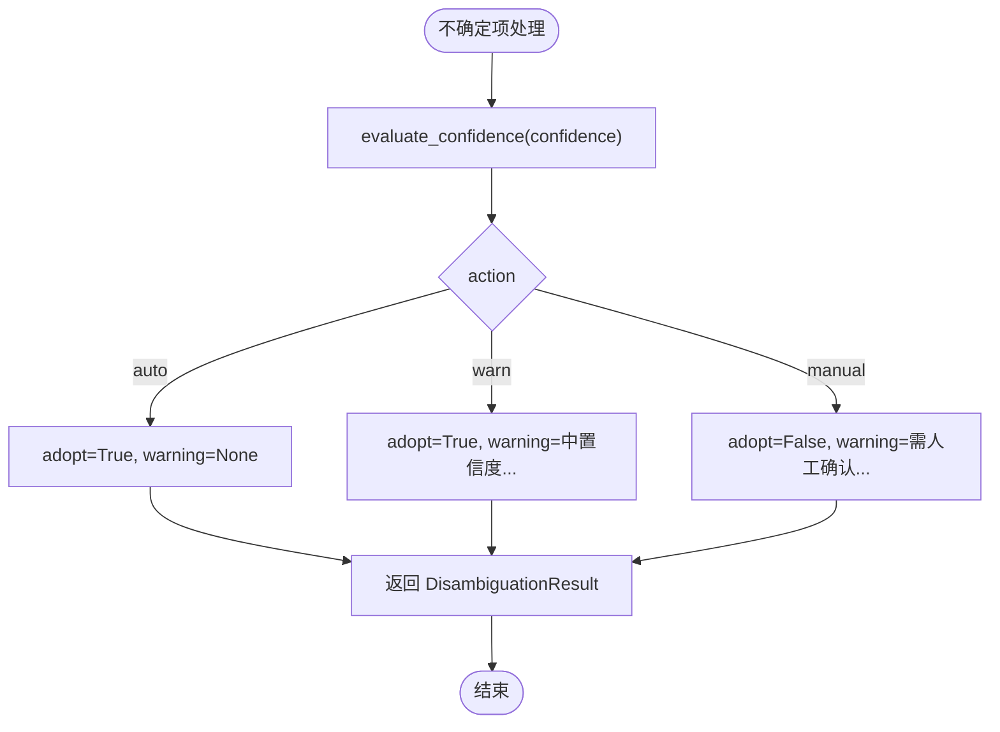
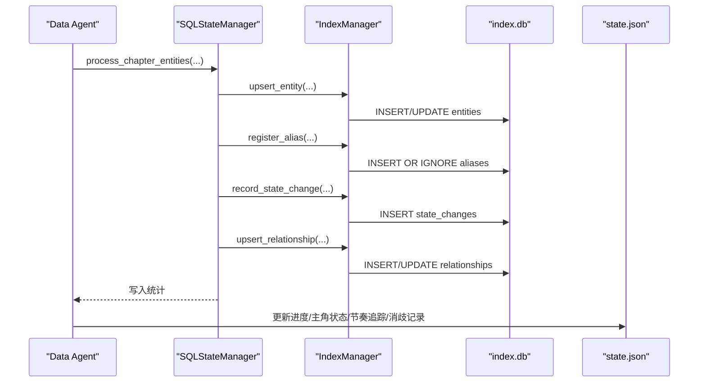
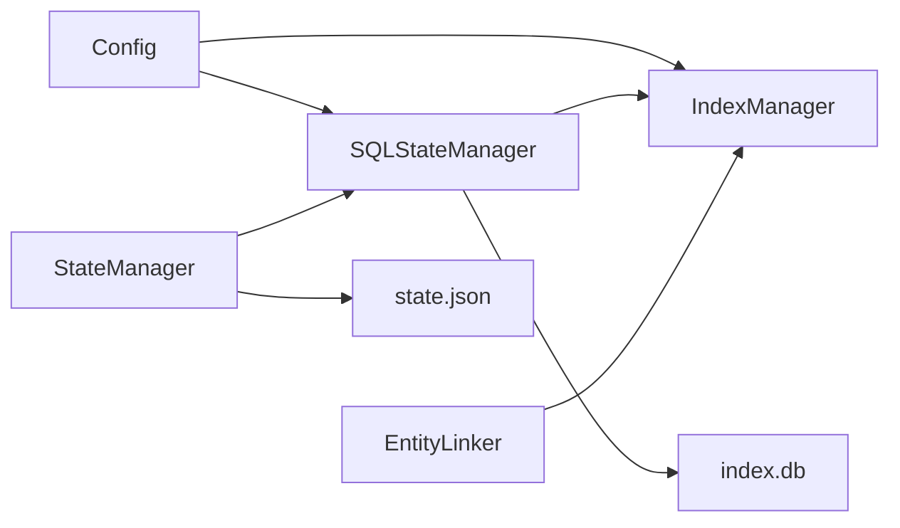

# 实体关系管理

<cite>
**本文引用的文件**
- [entity-management-spec.md](file://webnovel-writer/references/entity-management-spec.md)
- [entity_linker.py](file://webnovel-writer/scripts/data_modules/entity_linker.py)
- [schemas.py](file://webnovel-writer/scripts/data_modules/schemas.py)
- [index_entity_mixin.py](file://webnovel-writer/scripts/data_modules/index_entity_mixin.py)
- [state_manager.py](file://webnovel-writer/scripts/data_modules/state_manager.py)
- [sql_state_manager.py](file://webnovel-writer/scripts/data_modules/sql_state_manager.py)
- [index_manager.py](file://webnovel-writer/scripts/data_modules/index_manager.py)
- [config.py](file://webnovel-writer/scripts/data_modules/config.py)
- [data-agent.md](file://webnovel-writer/agents/data-agent.md)
- [context-agent.md](file://webnovel-writer/agents/context-agent.md)
- [README.md](file://README.md)
</cite>

## 目录
1. [简介](#简介)
2. [项目结构](#项目结构)
3. [核心组件](#核心组件)
4. [架构总览](#架构总览)
5. [详细组件分析](#详细组件分析)
6. [依赖分析](#依赖分析)
7. [性能考虑](#性能考虑)
8. [故障排查指南](#故障排查指南)
9. [结论](#结论)
10. [附录](#附录)

## 简介
本技术文档围绕 Webnovel Writer 的实体关系管理系统，系统性阐述实体识别、别名解析、关系建立与维护的完整流程，深入解析实体元数据模型（EntityMeta）的设计与生命周期，别名系统的一对多映射与冲突处理策略，关系图谱构建算法、时序关系事件记录与动态更新机制，以及实体链接器的工作原理、关系强度计算、极性分析与置信度评估。文档同时提供实体查询优化、批量操作处理与一致性保障方案，并给出 API 使用示例、错误处理策略与性能调优建议，面向数据科学家与算法工程师，帮助读者掌握实体关系建模与分析的关键技术。

## 项目结构
Webnovel Writer 将实体、别名、状态变化、关系等数据从 state.json 迁移至 SQLite（index.db），并通过 Data Agent 与 Context Agent 的协作实现自动化抽取与上下文生成。核心模块包括：
- 数据模块（scripts/data_modules）：包含实体链接器、状态管理器、SQL 状态管理器、索引管理器、配置与模式定义等。
- Agent 文档：data-agent.md 与 context-agent.md 描述了 Data Agent 的实体提取与写入流程、Context Agent 的上下文聚合与约束生成。
- 规范文档：entity-management-spec.md 定义了存储架构、处理流程、标签体系、ID 生成规则与错误处理策略。

图表来源
- [entity_linker.py:36-177](file://webnovel-writer/scripts/data_modules/entity_linker.py#L36-L177)
- [sql_state_manager.py:46-100](file://webnovel-writer/scripts/data_modules/sql_state_manager.py#L46-L100)
- [index_manager.py:228-234](file://webnovel-writer/scripts/data_modules/index_manager.py#L228-L234)
- [index_entity_mixin.py:20-123](file://webnovel-writer/scripts/data_modules/index_entity_mixin.py#L20-L123)
- [state_manager.py:90-140](file://webnovel-writer/scripts/data_modules/state_manager.py#L90-L140)
- [config.py:90-120](file://webnovel-writer/scripts/data_modules/config.py#L90-L120)
- [schemas.py:67-99](file://webnovel-writer/scripts/data_modules/schemas.py#L67-L99)
- [data-agent.md:65-126](file://webnovel-writer/agents/data-agent.md#L65-L126)
- [context-agent.md:85-92](file://webnovel-writer/agents/context-agent.md#L85-L92)

章节来源
- [README.md:1-170](file://README.md#L1-L170)
- [entity-management-spec.md:20-85](file://webnovel-writer/references/entity-management-spec.md#L20-L85)

## 核心组件
- 实体链接器（EntityLinker）：提供别名注册、别名查找（含一对多）、置信度评估与不确定项处理，支撑 Data Agent 的实体消歧。
- 状态管理器（StateManager）：负责 state.json 的读写与原子合并，同时桥接 SQLite 同步，确保大数据字段迁移至 index.db。
- SQL 状态管理器（SQLStateManager）：提供与 StateManager 兼容的接口，将实体、别名、状态变化、关系写入 SQLite，支持批量处理章节数据。
- 索引管理器（IndexManager）：封装 SQLite 表结构与查询接口，提供实体 CRUD、别名管理、状态变化记录、关系维护、关系事件与时序图谱查询。
- 配置（Config）：集中管理路径、API、并发、超时、重试、检索、图谱与实体提取等参数。
- 模式定义（Schemas）：定义 Data Agent 输出的 Pydantic 模式，确保数据结构校验与规范化。

章节来源
- [entity_linker.py:36-177](file://webnovel-writer/scripts/data_modules/entity_linker.py#L36-L177)
- [state_manager.py:90-140](file://webnovel-writer/scripts/data_modules/state_manager.py#L90-L140)
- [sql_state_manager.py:46-100](file://webnovel-writer/scripts/data_modules/sql_state_manager.py#L46-L100)
- [index_manager.py:228-234](file://webnovel-writer/scripts/data_modules/index_manager.py#L228-L234)
- [config.py:90-120](file://webnovel-writer/scripts/data_modules/config.py#L90-L120)
- [schemas.py:67-99](file://webnovel-writer/scripts/data_modules/schemas.py#L67-L99)

## 架构总览
系统采用“双 Agent 架构”：Data Agent 负责 AI 驱动的实体提取与写入，Context Agent 负责上下文聚合与约束生成。两者均通过 SQLStateManager/IndexManager 与 SQLite 交互，确保数据一致性与高性能查询。

图表来源
- [data-agent.md:65-126](file://webnovel-writer/agents/data-agent.md#L65-L126)
- [entity_linker.py:76-144](file://webnovel-writer/scripts/data_modules/entity_linker.py#L76-L144)
- [sql_state_manager.py:267-417](file://webnovel-writer/scripts/data_modules/sql_state_manager.py#L267-L417)
- [index_manager.py:29-123](file://webnovel-writer/scripts/data_modules/index_manager.py#L29-L123)

## 详细组件分析

### 实体元数据模型（EntityMeta）与生命周期
- 元数据字段：id、type、canonical_name、tier、desc、current、first_appearance、last_appearance、is_protagonist、is_archived。
- 生命周期控制：
  - 首次出现：记录 first_appearance 与 canonical_name。
  - 最近出现：通过 last_appearance 更新，用于排序与上下文筛选。
  - 归档：is_archived 标记，不影响查询但参与筛选。
  - 状态合并：current_json 采用增量合并策略，避免覆盖。
- 类型分类：角色/地点/物品/势力/招式，tier 用于重要度分级（核心/重要/次要/装饰）。

图表来源
- [index_entity_mixin.py:20-123](file://webnovel-writer/scripts/data_modules/index_entity_mixin.py#L20-L123)
- [index_manager.py:80-94](file://webnovel-writer/scripts/data_modules/index_manager.py#L80-L94)

章节来源
- [index_entity_mixin.py:20-123](file://webnovel-writer/scripts/data_modules/index_entity_mixin.py#L20-L123)
- [index_manager.py:80-94](file://webnovel-writer/scripts/data_modules/index_manager.py#L80-L94)

### 别名系统：一对多设计与冲突解决
- 一对多映射：aliases 表支持同一别名指向多个实体（如“天云宗”可同时映射到“地点”和“势力”）。
- 冲突解决：
  - lookup_alias：按类型过滤返回首个匹配；若未指定类型，返回任意匹配。
  - lookup_alias_all：返回所有匹配实体（类型+ID）。
  - 别名冲突：当 ref 命中多个实体且无法消歧时，报错并提示改用 id 或补充 type。
- 注册与查询：
  - register_alias：写入别名（OR IGNORE），支持一对多。
  - get_entities_by_alias：根据别名查找所有实体。
  - get_entity_aliases：获取实体的所有别名。

图表来源
- [entity_linker.py:51-68](file://webnovel-writer/scripts/data_modules/entity_linker.py#L51-L68)
- [index_entity_mixin.py:278-318](file://webnovel-writer/scripts/data_modules/index_entity_mixin.py#L278-L318)

章节来源
- [entity-linker.md:235-247](file://webnovel-writer/references/entity-management-spec.md#L235-L247)
- [entity_linker.py:51-68](file://webnovel-writer/scripts/data_modules/entity_linker.py#L51-L68)
- [index_entity_mixin.py:278-318](file://webnovel-writer/scripts/data_modules/index_entity_mixin.py#L278-L318)

### 关系图谱构建与动态更新
- 关系记录：relationships 表存储 from_entity、to_entity、type、description、chapter，并通过 UNIQUE 约束去重。
- 关系事件：relationship_events 表记录时序事件（action/create/update/decay/remove、polarity、strength、confidence、evidence、scene_index）。
- 动态更新：
  - upsert_relationship：相同 (from,to,type) 时更新 description 与 chapter。
  - record_relationship_event：写入事件，返回事件 ID；支持极性推断与置信度评估。
  - _load_effective_relationship_edges：按章节截面加载有效关系边，去除 remove 事件，回退到快照补边。
- 图谱查询：
  - get_entity_relationships：按方向（from/to/both）查询关系。
  - get_relationship_between：查询两实体间的所有关系。
  - get_relationship_events/get_relationship_timeline：按实体或两实体间查询事件与时间线。

图表来源
- [sql_state_manager.py:392-416](file://webnovel-writer/scripts/data_modules/sql_state_manager.py#L392-L416)
- [index_entity_mixin.py:525-642](file://webnovel-writer/scripts/data_modules/index_entity_mixin.py#L525-L642)

章节来源
- [index_entity_mixin.py:393-510](file://webnovel-writer/scripts/data_modules/index_entity_mixin.py#L393-L510)
- [sql_state_manager.py:231-263](file://webnovel-writer/scripts/data_modules/sql_state_manager.py#L231-L263)

### 实体链接器：置信度评估与不确定项处理
- 置信度策略：
  - > 0.8：自动采用，无需确认。
  - 0.5 - 0.8：采用建议值，记录 warning。
  - < 0.5：标记待人工确认，不自动写入。
- 不确定项处理：process_uncertain 返回 DisambiguationResult，包含 mention、entity_id、candidates、confidence、adopted、warning。
- 批量处理：process_extraction_result 支持批量不确定项，返回 results 与 warnings。

图表来源
- [entity_linker.py:76-115](file://webnovel-writer/scripts/data_modules/entity_linker.py#L76-L115)

章节来源
- [entity_linker.py:76-144](file://webnovel-writer/scripts/data_modules/entity_linker.py#L76-L144)
- [entity-management-spec.md:249-256](file://webnovel-writer/references/entity-management-spec.md#L249-L256)

### 数据写入流程：Data Agent → SQLite
- Data Agent 从章节正文中提取实体、状态变化与关系，结合上下文（核心实体、别名、最近出场）进行置信度评估与消歧。
- 写入 index.db：
  - upsert_entity：插入或更新实体，合并 current_json。
  - register_alias：注册主名称与提及方式。
  - record_state_change：记录状态变化。
  - upsert_relationship：插入或更新关系。
- 写入 state.json（精简）：进度、主角状态、节奏追踪、消歧警告与待处理项。

图表来源
- [data-agent.md:65-126](file://webnovel-writer/agents/data-agent.md#L65-L126)
- [sql_state_manager.py:267-417](file://webnovel-writer/scripts/data_modules/sql_state_manager.py#L267-L417)
- [index_entity_mixin.py:20-123](file://webnovel-writer/scripts/data_modules/index_entity_mixin.py#L20-L123)

章节来源
- [data-agent.md:65-126](file://webnovel-writer/agents/data-agent.md#L65-L126)
- [sql_state_manager.py:267-417](file://webnovel-writer/scripts/data_modules/sql_state_manager.py#L267-L417)

### 查询优化与批量操作
- 查询优化：
  - SQLite 索引：entities/type、entities/tier、entities/is_protagonist、aliases/entity、aliases/alias、state_changes/entity、relationships/from/to/chapter 等。
  - 分页与限制：query_*_limit、export_*_slice、export_recent_changes_slice 等。
- 批量操作：
  - process_chapter_entities：一次性处理出场实体、新实体、状态变化与关系。
  - _sync_to_sqlite/_sync_pending_patches_to_sqlite：批量同步 pending 数据，避免重复写入。
- 一致性保障：
  - state.json 原子写入（FileLock + 锁内重读 + 合并 + 原子写入）。
  - SQLite 同步失败时保留 pending 并回滚内存队列，避免静默丢失。

章节来源
- [config.py:263-267](file://webnovel-writer/scripts/data_modules/config.py#L263-L267)
- [state_manager.py:208-370](file://webnovel-writer/scripts/data_modules/state_manager.py#L208-L370)
- [sql_state_manager.py:371-559](file://webnovel-writer/scripts/data_modules/sql_state_manager.py#L371-L559)

### API 使用示例与最佳实践
- 查询实体：通过 CLI 或直接调用 IndexManager.get_entity/get_entities_by_type/get_core_entities。
- 通过别名查找：IndexManager.get_entities_by_alias；或使用 EntityLinker.lookup_alias/lookup_alias_all。
- 关系查询：IndexManager.get_entity_relationships/get_relationship_between；关系事件：get_relationship_events/get_relationship_timeline。
- 写入关系：SQLStateManager.upsert_relationship；记录关系事件：record_relationship_event。
- 批量处理章节：SQLStateManager.process_chapter_entities。

章节来源
- [entity-management-spec.md:133-150](file://webnovel-writer/references/entity-management-spec.md#L133-L150)
- [index_manager.py:678-741](file://webnovel-writer/scripts/data_modules/index_manager.py#L678-L741)
- [sql_state_manager.py:267-417](file://webnovel-writer/scripts/data_modules/sql_state_manager.py#L267-L417)

## 依赖分析
- 组件耦合：
  - SQLStateManager 依赖 IndexManager 提供 SQLite 操作。
  - StateManager 与 SQLStateManager 双向协作，前者负责 state.json 的原子写入，后者负责大数据写入 index.db。
  - EntityLinker 依赖 IndexManager 进行别名读写。
- 外部依赖：
  - 配置通过环境变量注入（EMBED_BASE_URL/EMBED_MODEL/EMBED_API_KEY、RERANK_BASE_URL/RERANK_MODEL/RERANK_API_KEY）。
  - SQLite 作为主要存储，RAG 向量存储在 vectors.db。

图表来源
- [entity_linker.py:39-42](file://webnovel-writer/scripts/data_modules/entity_linker.py#L39-L42)
- [sql_state_manager.py:97-99](file://webnovel-writer/scripts/data_modules/sql_state_manager.py#L97-L99)
- [state_manager.py:104-117](file://webnovel-writer/scripts/data_modules/state_manager.py#L104-L117)
- [config.py:124-142](file://webnovel-writer/scripts/data_modules/config.py#L124-L142)

章节来源
- [entity_linker.py:39-42](file://webnovel-writer/scripts/data_modules/entity_linker.py#L39-L42)
- [sql_state_manager.py:97-99](file://webnovel-writer/scripts/data_modules/sql_state_manager.py#L97-L99)
- [state_manager.py:104-117](file://webnovel-writer/scripts/data_modules/state_manager.py#L104-L117)
- [config.py:124-142](file://webnovel-writer/scripts/data_modules/config.py#L124-L142)

## 性能考虑
- 存储层：
  - SQLite 索引显著提升查询性能，建议在高频查询字段上保持索引。
  - 批量写入（process_chapter_entities）减少事务开销。
- 并发与重试：
  - 配置 embed_concurrency/rerank_concurrency、api_max_retries、api_retry_delay 控制外部服务调用。
- 查询限制：
  - 合理设置 query_*_limit 与 export_*_slice，避免一次性返回过多数据。
- 内存与磁盘：
  - state.json 保持精简（<5KB），大数据迁移至 index.db，降低 JSON 膨胀风险。

章节来源
- [config.py:144-156](file://webnovel-writer/scripts/data_modules/config.py#L144-L156)
- [config.py:263-267](file://webnovel-writer/scripts/data_modules/config.py#L263-L267)
- [state_manager.py:267-272](file://webnovel-writer/scripts/data_modules/state_manager.py#L267-L272)

## 故障排查指南
- 别名歧义：
  - 现象：同一别名命中多个实体且无法消歧。
  - 处理：改用 id 或补充 type；或使用 lookup_all 查看所有候选。
- 置信度处理：
  - 置信度 < 0.5：标记待人工确认，不自动写入；可查看 disambiguation_warnings/disambiguation_pending。
- 写入失败：
  - state.json 写入失败：检查锁文件与权限；确认锁超时（Timeout）。
  - SQLite 同步失败：保留 pending 并回滚内存队列，重试后自动恢复。
- 查询异常：
  - 确认索引是否存在；检查字段类型与大小写；使用 limit 控制返回量。

章节来源
- [entity-management-spec.md:235-256](file://webnovel-writer/references/entity-management-spec.md#L235-L256)
- [state_manager.py:368-370](file://webnovel-writer/scripts/data_modules/state_manager.py#L368-L370)
- [sql_state_manager.py:556-559](file://webnovel-writer/scripts/data_modules/sql_state_manager.py#L556-L559)

## 结论
Webnovel Writer 的实体关系管理系统通过 SQLite 存储与双 Agent 架构实现了高效、可扩展的实体抽取、别名管理、关系维护与上下文生成。EntityMeta 的生命周期管理、别名的一对多设计、关系事件的时序记录与动态更新机制，共同构成了强大的实体关系建模基础。配合置信度评估、批量写入与一致性保障，系统能够稳定支撑长周期连载创作与大规模数据处理需求。

## 附录
- 相关 Agent 文档：data-agent.md、context-agent.md
- 规范文档：entity-management-spec.md
- 配置参数：config.py 中的路径、API、并发、超时、重试、检索、图谱与实体提取等参数

章节来源
- [data-agent.md:65-126](file://webnovel-writer/agents/data-agent.md#L65-L126)
- [context-agent.md:85-92](file://webnovel-writer/agents/context-agent.md#L85-L92)
- [entity-management-spec.md:20-85](file://webnovel-writer/references/entity-management-spec.md#L20-L85)
- [config.py:90-120](file://webnovel-writer/scripts/data_modules/config.py#L90-L120)