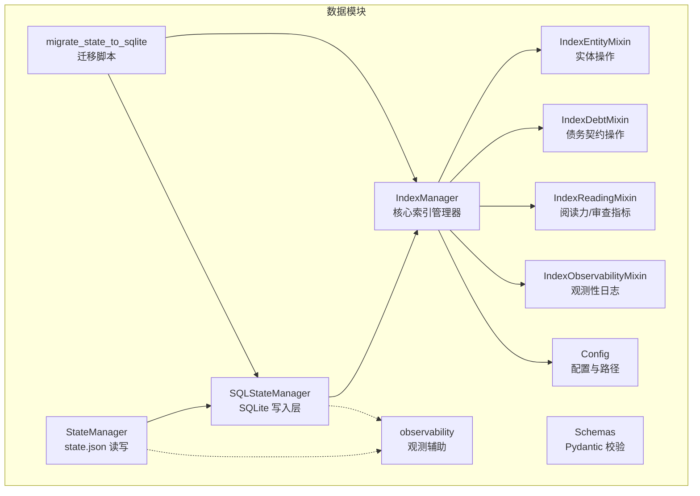
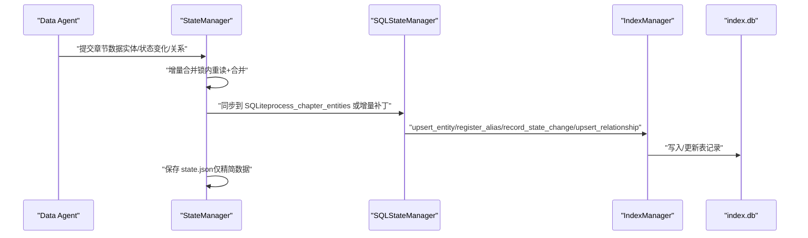
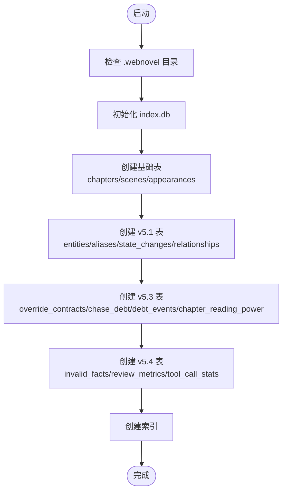
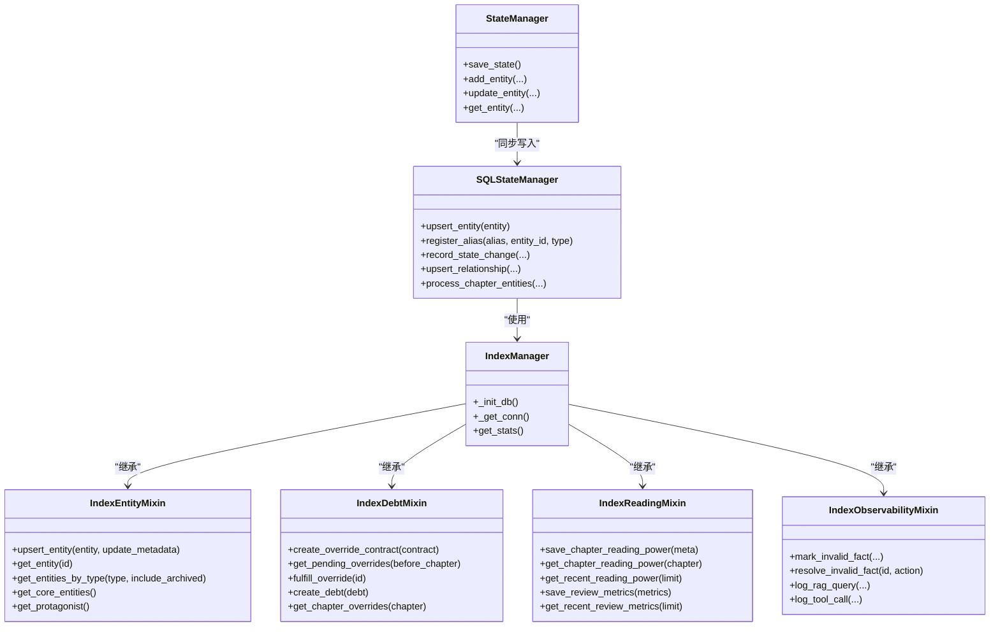
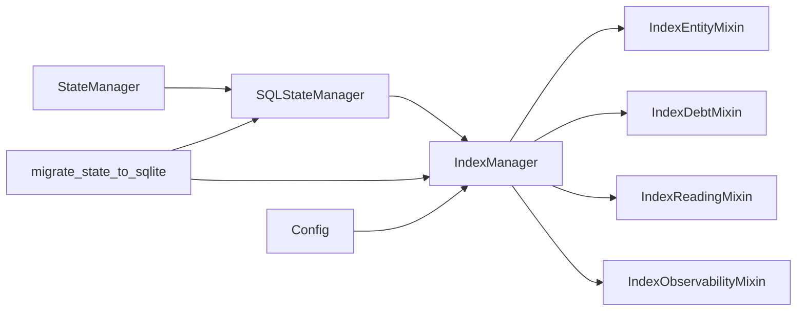

# 数据库架构设计

<cite>
**本文档引用的文件**
- [index_manager.py](file://webnovel-writer/scripts/data_modules/index_manager.py)
- [sql_state_manager.py](file://webnovel-writer/scripts/data_modules/sql_state_manager.py)
- [state_manager.py](file://webnovel-writer/scripts/data_modules/state_manager.py)
- [migrate_state_to_sqlite.py](file://webnovel-writer/scripts/data_modules/migrate_state_to_sqlite.py)
- [schemas.py](file://webnovel-writer/scripts/data_modules/schemas.py)
- [config.py](file://webnovel-writer/scripts/data_modules/config.py)
- [index_entity_mixin.py](file://webnovel-writer/scripts/data_modules/index_entity_mixin.py)
- [index_debt_mixin.py](file://webnovel-writer/scripts/data_modules/index_debt_mixin.py)
- [index_reading_mixin.py](file://webnovel-writer/scripts/data_modules/index_reading_mixin.py)
- [index_observability_mixin.py](file://webnovel-writer/scripts/data_modules/index_observability_mixin.py)
- [observability.py](file://webnovel-writer/scripts/data_modules/observability.py)
- [test_migrate_state_to_sqlite.py](file://webnovel-writer/scripts/data_modules/tests/test_migrate_state_to_sqlite.py)
</cite>

## 目录
1. [简介](#简介)
2. [项目结构](#项目结构)
3. [核心组件](#核心组件)
4. [架构总览](#架构总览)
5. [详细组件分析](#详细组件分析)
6. [依赖关系分析](#依赖关系分析)
7. [性能考量](#性能考量)
8. [故障排查指南](#故障排查指南)
9. [结论](#结论)
10. [附录](#附录)

## 简介
本文件系统性梳理 Webnovel Writer 的数据库架构设计，聚焦 SQLite 数据库存储与索引策略，覆盖 v5.1 引入的核心表（entities、aliases、state_changes、relationships）、v5.3 引入的债务管理表（chase_debt、debt_events、override_contracts）、v5.4 引入的观测性表（invalid_facts、review_metrics、tool_call_stats），以及数据库初始化流程、连接管理机制、事务处理策略与性能优化方案。文档面向数据库架构师与高级开发者，提供深入的设计原理与实现细节。

## 项目结构
围绕数据库架构的相关文件主要位于 scripts/data_modules 目录，采用“模块化混入（Mixin）+ 配置驱动”的组织方式：
- index_manager.py：核心索引管理器，负责数据库初始化、表结构定义与连接管理
- index_entity_mixin.py：实体相关 CRUD 与查询接口
- index_debt_mixin.py：债务与契约相关操作
- index_reading_mixin.py：阅读力与审查指标相关操作
- index_observability_mixin.py：观测性日志与指标记录
- sql_state_manager.py：与 StateManager 对接的 SQLite 写入层
- state_manager.py：state.json 的读写与并发控制，同时同步写入 SQLite
- migrate_state_to_sqlite.py：从 state.json 迁移至 SQLite 的脚本
- config.py：项目路径、数据库文件位置与各类配置项
- observability.py：工具调用与性能观测辅助
- schemas.py：数据代理输出的 Pydantic 校验模型
- tests/test_migrate_state_to_sqlite.py：迁移脚本的测试用例

**图表来源**
- [index_manager.py:228-620](file://webnovel-writer/scripts/data_modules/index_manager.py#L228-L620)
- [sql_state_manager.py:46-100](file://webnovel-writer/scripts/data_modules/sql_state_manager.py#L46-L100)
- [state_manager.py:90-140](file://webnovel-writer/scripts/data_modules/state_manager.py#L90-L140)
- [migrate_state_to_sqlite.py:39-88](file://webnovel-writer/scripts/data_modules/migrate_state_to_sqlite.py#L39-L88)
- [config.py:90-120](file://webnovel-writer/scripts/data_modules/config.py#L90-L120)

**章节来源**
- [index_manager.py:1-120](file://webnovel-writer/scripts/data_modules/index_manager.py#L1-L120)
- [config.py:90-120](file://webnovel-writer/scripts/data_modules/config.py#L90-L120)

## 核心组件
- IndexManager：负责数据库初始化、表结构定义、索引创建与连接管理；聚合多个 Mixin 提供实体、债务、阅读力、观测性等能力。
- SQLStateManager：提供与 StateManager 兼容的接口，将大数据（实体、别名、状态变化、关系）写入 SQLite，保持与 Data Agent/Context Agent 的接口一致性。
- StateManager：管理 state.json 的读写，采用文件锁与增量合并策略；在启用 SQLite 同步时，将变更异步同步到 SQLite。
- 迁移脚本：将 state.json 中的大数据字段迁移至 SQLite，并对 state.json 进行瘦身，仅保留精简数据。

**章节来源**
- [index_manager.py:228-620](file://webnovel-writer/scripts/data_modules/index_manager.py#L228-L620)
- [sql_state_manager.py:46-100](file://webnovel-writer/scripts/data_modules/sql_state_manager.py#L46-L100)
- [state_manager.py:90-140](file://webnovel-writer/scripts/data_modules/state_manager.py#L90-L140)
- [migrate_state_to_sqlite.py:39-88](file://webnovel-writer/scripts/data_modules/migrate_state_to_sqlite.py#L39-L88)

## 架构总览
数据库整体采用 SQLite 单机文件数据库，通过 IndexManager 统一初始化与管理，配合多种 Mixin 将不同业务域的能力模块化。核心数据流如下：

**图表来源**
- [state_manager.py:371-406](file://webnovel-writer/scripts/data_modules/state_manager.py#L371-L406)
- [sql_state_manager.py:267-417](file://webnovel-writer/scripts/data_modules/sql_state_manager.py#L267-L417)
- [index_manager.py:228-620](file://webnovel-writer/scripts/data_modules/index_manager.py#L228-L620)

## 详细组件分析

### v5.1 核心表与设计原则
- entities 表：替代 state.json 的 entities_v3，存储实体元数据与 current_json（状态快照），并维护 first_appearance/last_appearance、is_protagonist、is_archived 等关键字段。
- aliases 表：替代 alias_index，支持一对多别名映射，主键包含 (alias, entity_id, entity_type)，保证唯一性与快速反向查询。
- state_changes 表：替代 state.json 的 state_changes，记录实体字段变更历史，包含 entity_id、field、old_value、new_value、reason、chapter 等。
- relationships 表：替代 structured_relationships，记录实体间关系，UNIQUE 约束确保同一类型关系唯一，便于图谱构建与分析。

设计原则
- 数据分层：将“大而全”的 entities_v3、alias_index、state_changes、structured_relationships 从 state.json 迁移至 SQLite，state.json 仅保留精简数据，降低 JSON 文件体积与解析成本。
- 读写分离：IndexManager 提供统一的 CRUD 与查询接口，SQLStateManager 与 StateManager 分别承担写入与状态管理职责。
- 元数据与内容分离：实体 current_json 以 JSON 文本存储，便于增量更新；别名独立表支持多语言/多形态别名解析。

**章节来源**
- [index_manager.py:295-350](file://webnovel-writer/scripts/data_modules/index_manager.py#L295-L350)
- [index_manager.py:352-382](file://webnovel-writer/scripts/data_modules/index_manager.py#L352-L382)
- [index_entity_mixin.py:20-123](file://webnovel-writer/scripts/data_modules/index_entity_mixin.py#L20-L123)

### v5.3 债务管理表
- override_contracts 表：记录违背软建议时的契约，包含约束类型、原因、偿还计划、截止章节与状态；使用 ON CONFLICT 实现原子 UPSERT，冻结终态（fulfilled/cancelled）。
- chase_debt 表：记录追读力债务，含债务类型、原始金额、当前金额（含利息）、利率、来源章节、截止章节、关联契约与状态。
- debt_events 表：记录债务事件（产生/利息/部分/全额偿还/逾期），便于审计与趋势分析。
- chapter_reading_power 表：记录章节追读力元数据（钩子类型/强度、爽点模式、微兑现、硬约束违规、软建议、过渡章标记、债务余额等）。

设计原则
- 债务生命周期管理：从契约生成到债务产生、事件记录、状态变更，形成闭环。
- 金融化建模：采用复利模型（每章计息），支持到期提醒与逾期处理。
- 可追溯性：通过事件表与章节元数据，支持回溯与报表生成。

**章节来源**
- [index_manager.py:417-483](file://webnovel-writer/scripts/data_modules/index_manager.py#L417-L483)
- [index_debt_mixin.py:14-98](file://webnovel-writer/scripts/data_modules/index_debt_mixin.py#L14-L98)

### v5.4 观测性表
- invalid_facts 表：记录无效事实（pending/confirmed），支持标记人与发现章节，便于质量治理与人工复核。
- review_metrics 表：记录审查指标（起止章节、总分、维度得分、严重度统计、关键问题、报告文件、备注），支持趋势分析。
- tool_call_stats 表：记录工具调用成功率、重试次数、错误码与消息、章节等，支撑可观测性与性能分析。
- rag_query_log/writing_checklist_scores：扩展的观测性与写作清单评分记录（v5.4 引入）。

设计原则
- 低侵入：观测性数据与业务数据分离，不影响主流程。
- 可扩展：新增观测性表不影响现有核心表结构。
- 易查询：为观测性表建立必要索引，支持按时间、工具名、状态等过滤。

**章节来源**
- [index_manager.py:513-615](file://webnovel-writer/scripts/data_modules/index_manager.py#L513-L615)
- [index_observability_mixin.py:18-200](file://webnovel-writer/scripts/data_modules/index_observability_mixin.py#L18-L200)
- [index_reading_mixin.py:137-200](file://webnovel-writer/scripts/data_modules/index_reading_mixin.py#L137-L200)

### 数据库初始化流程
- 路径与文件：通过 Config 提供 .webnovel/index.db 路径，默认在项目根目录下创建。
- 初始化步骤：IndexManager 在首次访问时创建 chapters、scenes、appearances 等基础表；随后创建 v5.1/v5.3/v5.4 新增表；最后创建对应索引。
- 连接管理：_get_conn 返回带 row_factory 的连接，确保查询结果可按字典访问；使用上下文管理器确保连接关闭。

**图表来源**
- [index_manager.py:235-620](file://webnovel-writer/scripts/data_modules/index_manager.py#L235-L620)
- [config.py:90-120](file://webnovel-writer/scripts/data_modules/config.py#L90-L120)

**章节来源**
- [index_manager.py:235-620](file://webnovel-writer/scripts/data_modules/index_manager.py#L235-L620)
- [config.py:90-120](file://webnovel-writer/scripts/data_modules/config.py#L90-L120)

### 连接管理机制与事务策略
- 连接池：SQLite 采用轻量连接模型，每个操作通过 _get_conn 获取连接并在上下文结束时关闭。
- 事务：IndexManager 的写入操作均在单次连接内执行，未显式开启 BEGIN/COMMIT，SQLite 默认自动提交；对于需要原子性的操作（如 ON CONFLICT UPSERT）由 SQLite 保证原子性。
- 并发控制：StateManager 使用文件锁（state.json.lock）进行写入并发控制，避免多进程/多 Agent 并发写入导致的数据竞争。

**章节来源**
- [index_manager.py:622-631](file://webnovel-writer/scripts/data_modules/index_manager.py#L622-L631)
- [state_manager.py:237-370](file://webnovel-writer/scripts/data_modules/state_manager.py#L237-L370)

### 迁移方案与兼容性
- 迁移流程：迁移脚本读取 state.json 的 entities_v3、alias_index、state_changes、structured_relationships，逐条写入 SQLite；随后对 state.json 进行瘦身，仅保留精简字段并打上迁移标记。
- 兼容性：迁移后 StateManager 仍可读取旧字段（回退逻辑），但写入路径统一走 SQLite；迁移脚本提供 dry-run 与备份选项，确保安全可控。
- 测试保障：测试覆盖了迁移失败、备份、跳过脏数据等场景，确保迁移过程的健壮性。

**章节来源**
- [migrate_state_to_sqlite.py:39-277](file://webnovel-writer/scripts/data_modules/migrate_state_to_sqlite.py#L39-L277)
- [test_migrate_state_to_sqlite.py:28-209](file://webnovel-writer/scripts/data_modules/tests/test_migrate_state_to_sqlite.py#L28-L209)

### 查询优化与索引策略
- v5.1 索引
  - entities：按 type、tier、is_protagonist 建立索引，支持按类型/层级/主角筛选。
  - aliases：按 entity_id、alias 建立索引，支持别名解析与实体别名查询。
  - state_changes：按 entity_id、chapter 建立索引，支持实体变更历史与章节变更查询。
  - relationships：按 from_entity、to_entity、chapter 建立索引，支持关系图谱与时间线查询。
- v5.3 索引
  - override_contracts：按 chapter、status、due_chapter 建立索引，支持待偿还与逾期查询。
  - chase_debt：按 status、source_chapter、due_chapter 建立索引，支持债务状态与来源/截止章节查询。
  - debt_events：按 debt_id、chapter 建立索引，支持债务事件时间线。
- v5.4 索引
  - invalid_facts：按 status、source_type/source_id 建立索引，支持无效事实状态与来源过滤。
  - review_metrics：按 end_chapter 建立索引，支持审查趋势查询。
  - tool_call_stats：按 tool_name、chapter 建立索引，支持工具调用统计与趋势分析。

**章节来源**
- [index_manager.py:352-510](file://webnovel-writer/scripts/data_modules/index_manager.py#L352-L510)

### 类关系与数据模型

**图表来源**
- [index_manager.py:228-229](file://webnovel-writer/scripts/data_modules/index_manager.py#L228-L229)
- [sql_state_manager.py:46-100](file://webnovel-writer/scripts/data_modules/sql_state_manager.py#L46-L100)
- [state_manager.py:90-140](file://webnovel-writer/scripts/data_modules/state_manager.py#L90-L140)

## 依赖关系分析
- 模块耦合
  - IndexManager 作为核心协调者，聚合多个 Mixin，耦合度适中，职责清晰。
  - SQLStateManager 依赖 IndexManager 的具体表操作，耦合集中在数据模型与索引策略。
  - StateManager 与 SQLStateManager 双向协作：前者负责 state.json 的并发安全与精简写入，后者负责 SQLite 的高性能写入。
- 外部依赖
  - SQLite：单机文件数据库，无需外部服务，部署简单。
  - Python 标准库 sqlite3、json、typing、contextlib 等。
- 潜在循环依赖
  - 通过 Mixin 分离职责，避免了循环导入；各模块通过配置对象共享路径信息。

**图表来源**
- [state_manager.py:90-140](file://webnovel-writer/scripts/data_modules/state_manager.py#L90-L140)
- [sql_state_manager.py:46-100](file://webnovel-writer/scripts/data_modules/sql_state_manager.py#L46-L100)
- [index_manager.py:228-229](file://webnovel-writer/scripts/data_modules/index_manager.py#L228-L229)
- [migrate_state_to_sqlite.py:39-88](file://webnovel-writer/scripts/data_modules/migrate_state_to_sqlite.py#L39-L88)
- [config.py:90-120](file://webnovel-writer/scripts/data_modules/config.py#L90-L120)

**章节来源**
- [state_manager.py:90-140](file://webnovel-writer/scripts/data_modules/state_manager.py#L90-L140)
- [sql_state_manager.py:46-100](file://webnovel-writer/scripts/data_modules/sql_state_manager.py#L46-L100)
- [index_manager.py:228-229](file://webnovel-writer/scripts/data_modules/index_manager.py#L228-L229)
- [migrate_state_to_sqlite.py:39-88](file://webnovel-writer/scripts/data_modules/migrate_state_to_sqlite.py#L39-L88)
- [config.py:90-120](file://webnovel-writer/scripts/data_modules/config.py#L90-L120)

## 性能考量
- 写入性能
  - 批量写入：SQLStateManager 的 process_chapter_entities 支持批量处理实体、状态变化与关系，减少往返开销。
  - 增量更新：entities 的 current_json 采用 JSON 合并策略，避免全量覆盖。
  - 原子 UPSERT：override_contracts 使用 ON CONFLICT 实现原子更新，避免重复写入与竞态。
- 查询性能
  - 为高频查询字段建立索引（type/tier/is_protagonist、entity_id/alias、entity_id/chapter、from_entity/to_entity/chapter 等）。
  - 通过 Mixin 将查询逻辑模块化，便于针对性优化。
- 存储与 IO
  - SQLite 文件位于 .webnovel/index.db，建议与项目同盘，避免跨盘符带来的 IO 延迟。
  - state.json 精简后体积显著下降，提升读写效率与并发稳定性。

[本节为通用性能指导，不直接分析具体文件]

## 故障排查指南
- 迁移失败
  - 现象：迁移脚本抛出异常或返回错误计数大于 0。
  - 排查：检查 state.json 权限、index.db 写权限、备份是否成功；使用 dry-run 验证数据结构；查看测试用例中的错误分支覆盖。
- SQLite 同步失败
  - 现象：StateManager 保存 state.json 成功但 SQLite 同步失败。
  - 排查：确认 SQLStateManager 可用；检查 _pending_sqlite_data 是否被正确清空；查看日志警告与回滚快照。
- 并发写入冲突
  - 现象：state.json 写入失败或锁超时。
  - 排查：确认 state.json.lock 是否被占用；检查多进程/多 Agent 是否共享同一项目根目录；适当增加超时时间。
- 观测性数据异常
  - 现象：invalid_facts/review_metrics/tool_call_stats 等表数据异常。
  - 排查：检查 JSON 字段解析异常日志；确认索引是否存在；核对写入参数与时间戳。

**章节来源**
- [migrate_state_to_sqlite.py:325-380](file://webnovel-writer/scripts/data_modules/migrate_state_to_sqlite.py#L325-L380)
- [state_manager.py:371-406](file://webnovel-writer/scripts/data_modules/state_manager.py#L371-L406)
- [index_observability_mixin.py:18-200](file://webnovel-writer/scripts/data_modules/index_observability_mixin.py#L18-L200)

## 结论
Webnovel Writer 的数据库架构以 SQLite 为核心，通过 IndexManager 统一管理表结构与索引，结合 Mixin 模块化实现实体、债务、阅读力与观测性等能力。v5.1 将大数据从 state.json 迁移至 SQLite，v5.3 引入债务契约与追读力管理，v5.4 增强观测性与审查指标记录。整体设计兼顾性能、可维护性与可扩展性，适合长文本写作项目的持续演进需求。

[本节为总结性内容，不直接分析具体文件]

## 附录
- 版本演进要点
  - v5.1：引入 entities/aliases/state_changes/relationships 表，替代 state.json 中的大数据字段。
  - v5.3：引入 override_contracts/chase_debt/debt_events/chapter_reading_power 表，支持债务契约与追读力管理。
  - v5.4：引入 invalid_facts/review_metrics/tool_call_stats 等观测性表，增强质量治理与性能观测。
- 数据代理输出校验
  - schemas.py 提供 Pydantic 校验模型，确保 Data Agent 输出结构正确，便于迁移与后续处理。

**章节来源**
- [index_manager.py:4-34](file://webnovel-writer/scripts/data_modules/index_manager.py#L4-L34)
- [schemas.py:13-126](file://webnovel-writer/scripts/data_modules/schemas.py#L13-L126)