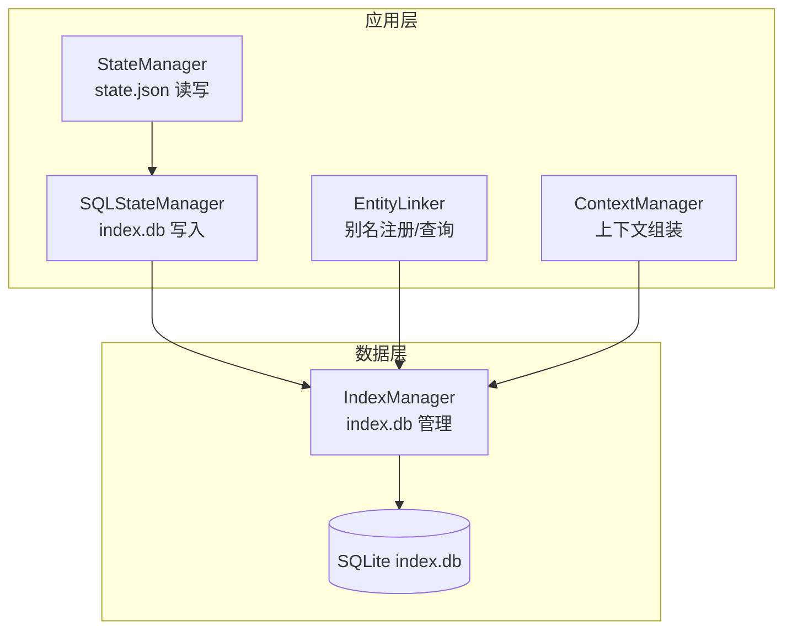
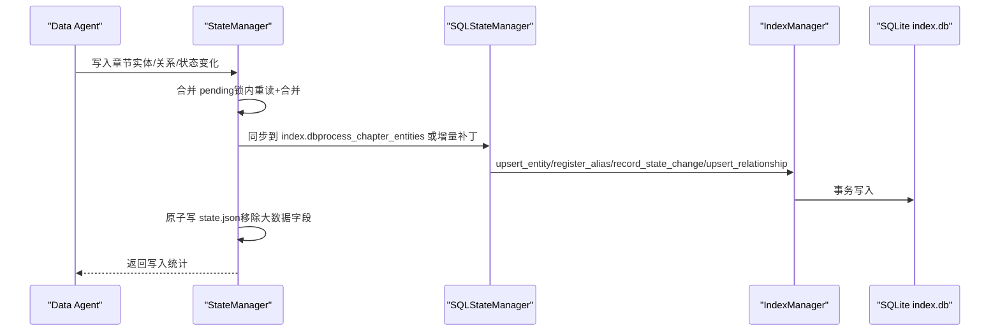
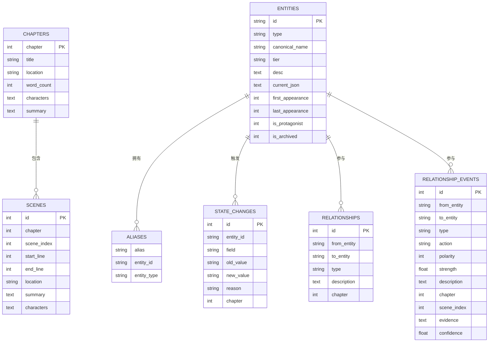
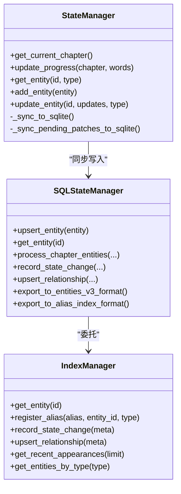
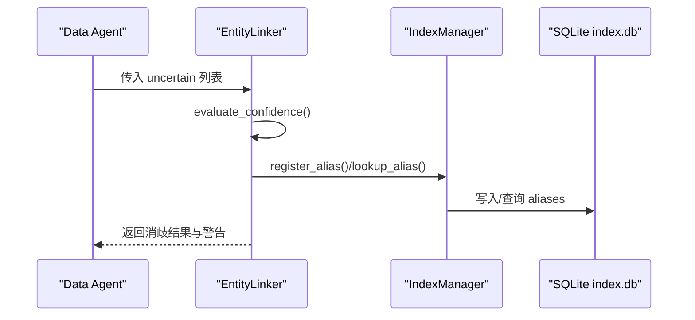
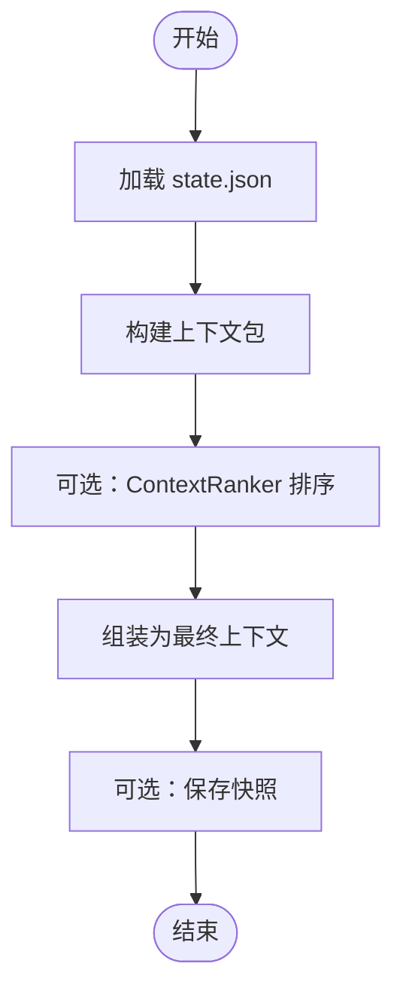
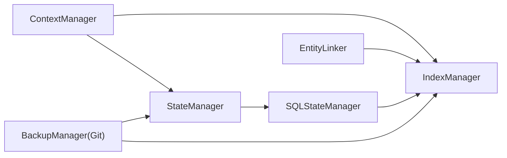

# 数据管理系统

<cite>
**本文引用的文件**
- [sql_state_manager.py](file://webnovel-writer/scripts/data_modules/sql_state_manager.py)
- [state_manager.py](file://webnovel-writer/scripts/data_modules/state_manager.py)
- [index_manager.py](file://webnovel-writer/scripts/data_modules/index_manager.py)
- [migrate_state_to_sqlite.py](file://webnovel-writer/scripts/data_modules/migrate_state_to_sqlite.py)
- [entity_linker.py](file://webnovel-writer/scripts/data_modules/entity_linker.py)
- [context_manager.py](file://webnovel-writer/scripts/data_modules/context_manager.py)
- [schemas.py](file://webnovel-writer/scripts/data_modules/schemas.py)
- [config.py](file://webnovel-writer/scripts/data_modules/config.py)
- [backup_manager.py](file://webnovel-writer/scripts/backup_manager.py)
- [status_reporter.py](file://webnovel-writer/scripts/status_reporter.py)
- [state_validator.py](file://webnovel-writer/scripts/data_modules/state_validator.py)
- [observability.py](file://webnovel-writer/scripts/data_modules/observability.py)
</cite>

## 目录
1. [简介](#简介)
2. [项目结构](#项目结构)
3. [核心组件](#核心组件)
4. [架构总览](#架构总览)
5. [详细组件分析](#详细组件分析)
6. [依赖关系分析](#依赖关系分析)
7. [性能考量](#性能考量)
8. [故障排查指南](#故障排查指南)
9. [结论](#结论)
10. [附录](#附录)

## 简介
本文件面向数据库管理员与高级开发者，系统化阐述 Webnovel Writer 数据管理系统的架构设计与实现细节。重点涵盖：
- SQLite 数据库架构与实体关系管理
- 章节索引系统与状态跟踪机制
- 数据访问层（State Manager 与 SQL State Manager）设计
- 索引策略、查询优化与事务处理
- 状态管理器的持久化策略、实体链接器的关系维护、上下文管理器的缓存机制
- 数据迁移方案、备份恢复策略与性能监控方法
- API 使用示例、错误处理与最佳实践

## 项目结构
系统围绕“state.json + index.db”的双层存储模型组织：
- state.json：轻量运行态数据（进度、主线人物、strand 跟踪、警告与待确认项等）
- index.db：全文检索与关系图谱的高性能 SQLite 数据库，承载实体、别名、状态变化、关系、章节与场景索引等

图表来源
- [state_manager.py:90-140](file://webnovel-writer/scripts/data_modules/state_manager.py#L90-L140)
- [sql_state_manager.py:46-100](file://webnovel-writer/scripts/data_modules/sql_state_manager.py#L46-L100)
- [index_manager.py:228-234](file://webnovel-writer/scripts/data_modules/index_manager.py#L228-L234)
- [entity_linker.py:36-42](file://webnovel-writer/scripts/data_modules/entity_linker.py#L36-L42)
- [context_manager.py:50-82](file://webnovel-writer/scripts/data_modules/context_manager.py#L50-L82)

章节来源
- [state_manager.py:90-140](file://webnovel-writer/scripts/data_modules/state_manager.py#L90-L140)
- [sql_state_manager.py:46-100](file://webnovel-writer/scripts/data_modules/sql_state_manager.py#L46-L100)
- [index_manager.py:228-234](file://webnovel-writer/scripts/data_modules/index_manager.py#L228-L234)
- [entity_linker.py:36-42](file://webnovel-writer/scripts/data_modules/entity_linker.py#L36-L42)
- [context_manager.py:50-82](file://webnovel-writer/scripts/data_modules/context_manager.py#L50-L82)

## 核心组件
- StateManager：负责 state.json 的读写与原子落盘，同时协调 SQLite 同步，确保并发安全与数据一致性。
- SQLStateManager：提供与 StateManager 兼容的接口，但将大数据字段（实体、别名、状态变化、关系）写入 index.db。
- IndexManager：封装 SQLite 表结构、索引与查询接口，提供实体、别名、状态变化、关系、章节与场景的快速检索。
- EntityLinker：提供别名注册与查询、置信度评估与批量处理，支撑 Data Agent 的实体消歧。
- ContextManager：基于 index.db 与 state.json 组装上下文包，支持快照缓存与权重动态调整。
- 配置与可观测：DataModulesConfig 提供统一配置；observability 提供性能与工具调用日志。

章节来源
- [state_manager.py:90-140](file://webnovel-writer/scripts/data_modules/state_manager.py#L90-L140)
- [sql_state_manager.py:46-100](file://webnovel-writer/scripts/data_modules/sql_state_manager.py#L46-L100)
- [index_manager.py:228-234](file://webnovel-writer/scripts/data_modules/index_manager.py#L228-L234)
- [entity_linker.py:36-42](file://webnovel-writer/scripts/data_modules/entity_linker.py#L36-L42)
- [context_manager.py:50-82](file://webnovel-writer/scripts/data_modules/context_manager.py#L50-L82)
- [config.py:90-349](file://webnovel-writer/scripts/data_modules/config.py#L90-L349)
- [observability.py:19-88](file://webnovel-writer/scripts/data_modules/observability.py#L19-L88)

## 架构总览
系统采用“轻 state.json + 重 index.db”的双轨架构：
- 写入路径：Data Agent 产出章节实体与关系，StateManager 先写入 pending 队列，随后通过 SQLStateManager 同步至 index.db；同时原子写 state.json。
- 读取路径：优先从 index.db（IndexManager）读取实体、关系、状态变化与出场记录；回退到 state.json（兼容未迁移场景）。

图表来源
- [state_manager.py:208-370](file://webnovel-writer/scripts/data_modules/state_manager.py#L208-L370)
- [sql_state_manager.py:267-417](file://webnovel-writer/scripts/data_modules/sql_state_manager.py#L267-L417)
- [index_manager.py:622-631](file://webnovel-writer/scripts/data_modules/index_manager.py#L622-L631)

章节来源
- [state_manager.py:208-370](file://webnovel-writer/scripts/data_modules/state_manager.py#L208-L370)
- [sql_state_manager.py:267-417](file://webnovel-writer/scripts/data_modules/sql_state_manager.py#L267-L417)
- [index_manager.py:622-631](file://webnovel-writer/scripts/data_modules/index_manager.py#L622-L631)

## 详细组件分析

### SQLite 数据库架构与索引策略
- 表结构概览
  - chapters/scenes：章节与场景元数据与索引
  - entities：实体主表（类型、层级、描述、current_json、首次/末次出场、是否主角/归档）
  - aliases：别名表（一对多，支持别名到实体的映射）
  - state_changes：状态变化记录（实体、字段、旧值、新值、原因、章节）
  - relationships/relationship_events：关系与关系事件（含极性、强度、证据、置信度等）
  - 追读力债务管理：override_contracts、chase_debt、debt_events、chapter_reading_power
  - 无效事实与日志：invalid_facts、review_metrics、rag_query_log、tool_call_stats、writing_checklist_scores
- 索引策略
  - 实体：type、tier、is_protagonist、is_archived
  - 别名：entity_id、alias
  - 状态变化：entity_id、chapter
  - 关系：from_entity、to_entity、chapter
  - 关系事件：from_entity/chapter、to_entity/chapter、chapter、type/chapter
  - 债务与评审：状态、到期、章节、评分等复合索引
- 查询优化
  - 通过专用查询 mixin（IndexChapterMixin/IndexEntityMixin/IndexDebtMixin/IndexReadingMixin/IndexObservabilityMixin）提供高效检索
  - 读取路径优先走索引，避免全表扫描

图表来源
- [index_manager.py:242-414](file://webnovel-writer/scripts/data_modules/index_manager.py#L242-L414)
- [index_manager.py:415-619](file://webnovel-writer/scripts/data_modules/index_manager.py#L415-L619)

章节来源
- [index_manager.py:242-414](file://webnovel-writer/scripts/data_modules/index_manager.py#L242-L414)
- [index_manager.py:415-619](file://webnovel-writer/scripts/data_modules/index_manager.py#L415-L619)

### 数据访问层：StateManager 与 SQLStateManager
- StateManager
  - 原子写入：使用文件锁与“锁内重读+合并+原子写”策略，避免并发覆盖
  - SQLite 同步：将大数据字段迁移至 index.db，state.json 仅保留精简数据
  - 增量补丁：维护 _pending_* 队列，支持批量合并与失败回滚
- SQLStateManager
  - 提供与 StateManager 兼容的接口，内部委托 IndexManager 完成 SQLite 操作
  - 支持批量处理章节数据（process_chapter_entities），并维护别名与出场记录
  - 提供导出兼容格式（entities_v3、alias_index）

图表来源
- [state_manager.py:90-140](file://webnovel-writer/scripts/data_modules/state_manager.py#L90-L140)
- [sql_state_manager.py:46-100](file://webnovel-writer/scripts/data_modules/sql_state_manager.py#L46-L100)
- [index_manager.py:228-234](file://webnovel-writer/scripts/data_modules/index_manager.py#L228-L234)

章节来源
- [state_manager.py:90-140](file://webnovel-writer/scripts/data_modules/state_manager.py#L90-L140)
- [sql_state_manager.py:46-100](file://webnovel-writer/scripts/data_modules/sql_state_manager.py#L46-L100)
- [index_manager.py:228-234](file://webnovel-writer/scripts/data_modules/index_manager.py#L228-L234)

### 实体链接器与关系维护
- 别名管理：register_alias/lookup_alias/get_all_aliases，支持按类型过滤与一对多匹配
- 置信度评估：evaluate_confidence 将提取结果分为 auto/warn/manual 三类
- 批量处理：process_extraction_result/process_uncertain，支持不确定项的消歧与警告生成
- 与 IndexManager 的协作：所有别名写入与查询均通过 index.db aliases 表完成

图表来源
- [entity_linker.py:36-42](file://webnovel-writer/scripts/data_modules/entity_linker.py#L36-L42)
- [index_manager.py:622-631](file://webnovel-writer/scripts/data_modules/index_manager.py#L622-L631)

章节来源
- [entity_linker.py:36-42](file://webnovel-writer/scripts/data_modules/entity_linker.py#L36-L42)
- [index_manager.py:622-631](file://webnovel-writer/scripts/data_modules/index_manager.py#L622-L631)

### 上下文管理器与缓存机制
- 快照缓存：build_context 支持使用 SnapshotManager 缓存上下文包，模板兼容性检查后复用
- 权重动态：根据章节阶段（早期/中期/晚期）动态调整各部分权重
- 读者信号：结合 index.db 的阅读功率、钩子类型、审查趋势等生成写作指导与检查清单评分
- 缓存命中：_is_snapshot_compatible 判定快照与模板兼容性，避免不必要重建

图表来源
- [context_manager.py:99-131](file://webnovel-writer/scripts/data_modules/context_manager.py#L99-L131)
- [context_manager.py:133-165](file://webnovel-writer/scripts/data_modules/context_manager.py#L133-L165)

章节来源
- [context_manager.py:99-131](file://webnovel-writer/scripts/data_modules/context_manager.py#L99-L131)
- [context_manager.py:133-165](file://webnovel-writer/scripts/data_modules/context_manager.py#L133-L165)

### 数据模型定义与模式校验
- Pydantic 模型：EntityAppeared/EntityNew/StateChange/RelationshipNew/DataAgentOutput/ErrorSchema
- 校验与归一化：validate_data_agent_output/format_validation_error/normalize_data_agent_output
- Schema 保障：确保 Data Agent 输出字段完整性与类型正确性，减少下游异常

章节来源
- [schemas.py:13-126](file://webnovel-writer/scripts/data_modules/schemas.py#L13-L126)

### 配置与可观测性
- DataModulesConfig：集中管理路径、API、并发、超时、重试、检索、动态预算、权重、阈值等参数
- observability：提供工具调用日志与性能时间戳记录，便于定位瓶颈与异常

章节来源
- [config.py:90-349](file://webnovel-writer/scripts/data_modules/config.py#L90-L349)
- [observability.py:19-88](file://webnovel-writer/scripts/data_modules/observability.py#L19-L88)

## 依赖关系分析
- 组件耦合
  - StateManager 与 SQLStateManager：通过接口解耦，SQLStateManager 内部依赖 IndexManager
  - EntityLinker 与 IndexManager：强耦合，所有别名操作经由 index.db
  - ContextManager：依赖 IndexManager 与 SnapshotManager，读取 index.db 与 state.json
- 外部依赖
  - SQLite：index.db 作为主要数据存储
  - Git：备份管理器提供原子性回滚与版本控制
  - 环境变量：通过 .env 文件注入 API 配置

图表来源
- [state_manager.py:90-140](file://webnovel-writer/scripts/data_modules/state_manager.py#L90-L140)
- [sql_state_manager.py:46-100](file://webnovel-writer/scripts/data_modules/sql_state_manager.py#L46-L100)
- [index_manager.py:228-234](file://webnovel-writer/scripts/data_modules/index_manager.py#L228-L234)
- [entity_linker.py:36-42](file://webnovel-writer/scripts/data_modules/entity_linker.py#L36-L42)
- [context_manager.py:50-82](file://webnovel-writer/scripts/data_modules/context_manager.py#L50-L82)
- [backup_manager.py:70-88](file://webnovel-writer/scripts/backup_manager.py#L70-L88)

章节来源
- [state_manager.py:90-140](file://webnovel-writer/scripts/data_modules/state_manager.py#L90-L140)
- [sql_state_manager.py:46-100](file://webnovel-writer/scripts/data_modules/sql_state_manager.py#L46-L100)
- [index_manager.py:228-234](file://webnovel-writer/scripts/data_modules/index_manager.py#L228-L234)
- [entity_linker.py:36-42](file://webnovel-writer/scripts/data_modules/entity_linker.py#L36-L42)
- [context_manager.py:50-82](file://webnovel-writer/scripts/data_modules/context_manager.py#L50-L82)
- [backup_manager.py:70-88](file://webnovel-writer/scripts/backup_manager.py#L70-L88)

## 性能考量
- 写入路径
  - StateManager 使用文件锁与“锁内重读+合并+原子写”，避免并发覆盖
  - SQLStateManager 批量写入（process_chapter_entities）与增量补丁（_pending_*）降低 IO 次数
- 查询路径
  - 通过专用索引与 mixin 查询接口，优先走索引避免全表扫描
  - ContextManager 的快照缓存减少重复组装成本
- I/O 与并发
  - 配置 embed_concurrency/rerank_concurrency/vector_top_k 等参数平衡吞吐与资源占用
- 监控
  - observability 提供性能时间戳与工具调用日志，便于定位热点与异常

章节来源
- [state_manager.py:208-370](file://webnovel-writer/scripts/data_modules/state_manager.py#L208-L370)
- [sql_state_manager.py:267-417](file://webnovel-writer/scripts/data_modules/sql_state_manager.py#L267-L417)
- [config.py:144-166](file://webnovel-writer/scripts/data_modules/config.py#L144-L166)
- [observability.py:46-88](file://webnovel-writer/scripts/data_modules/observability.py#L46-L88)

## 故障排查指南
- 迁移失败
  - 现象：迁移脚本报错或部分字段未迁移
  - 排查：检查 state.json 权限与 index.db 初始化；使用 --dry-run 分析；查看迁移统计
  - 参考：migrate_state_to_sqlite
- SQLite 同步失败
  - 现象：state.json 写入成功但 index.db 未更新
  - 排查：检查 _sync_to_sqlite/_sync_pending_patches_to_sqlite 的异常日志；确认 pending 快照回滚
  - 参考：state_manager
- 别名冲突或缺失
  - 现象：lookup_alias 返回空或重复
  - 排查：确认 aliases 表索引与唯一约束；检查 register_alias 的调用
  - 参考：entity_linker/index_manager
- 备份回滚不一致
  - 现象：回滚后 state.json 与正文不一致
  - 排查：使用 Git 备份管理器的原子回滚；检查 .gitignore 与提交状态
  - 参考：backup_manager
- 上下文组装异常
  - 现象：ContextManager 报错或快照不可用
  - 排查：检查模板兼容性；确认 SnapshotManager 与 IndexManager 可用
  - 参考：context_manager

章节来源
- [migrate_state_to_sqlite.py:325-380](file://webnovel-writer/scripts/data_modules/migrate_state_to_sqlite.py#L325-L380)
- [state_manager.py:371-560](file://webnovel-writer/scripts/data_modules/state_manager.py#L371-L560)
- [entity_linker.py:181-275](file://webnovel-writer/scripts/data_modules/entity_linker.py#L181-L275)
- [backup_manager.py:192-304](file://webnovel-writer/scripts/backup_manager.py#L192-L304)
- [context_manager.py:83-131](file://webnovel-writer/scripts/data_modules/context_manager.py#L83-L131)

## 结论
本系统通过“轻 state.json + 重 index.db”的双轨架构，在保证并发安全与数据一致性的同时，实现了高性能的实体关系检索与上下文组装。SQLStateManager 与 IndexManager 的清晰职责划分，使得扩展与维护更为便利；配套的迁移、备份与监控机制进一步提升了生产可用性。建议在大规模项目中：
- 严格遵循 Schema 校验与数据规范化
- 合理设置并发与查询阈值
- 定期进行备份与快照清理
- 使用 observability 日志持续优化热点路径

## 附录

### 数据迁移方案
- 迁移步骤
  - 备份 state.json（可选）
  - 初始化 SQLStateManager
  - 依次迁移 entities_v3 → entities、alias_index → aliases、state_changes → state_changes、structured_relationships → relationships
  - 精简 state.json，移除已迁移字段
- CLI 使用
  - python -m data_modules.migrate_state_to_sqlite --project-root "<路径>" [--dry-run/--backup]

章节来源
- [migrate_state_to_sqlite.py:39-277](file://webnovel-writer/scripts/data_modules/migrate_state_to_sqlite.py#L39-L277)

### 备份恢复策略
- Git 集成备份
  - 自动提交：/webnovel-write 完成后自动 commit
  - 原子回滚：git checkout 同步回滚所有文件
  - 差异对比：git diff 查看任意版本差异
  - 分支创建：git branch 从任意时间点创建分支
- CLI 使用
  - 备份：--chapter N [--chapter-title "标题"]
  - 回滚：--rollback N
  - 对比：--diff A B
  - 列表：--list
  - 分支：--create-branch N --branch-name "<name>"

章节来源
- [backup_manager.py:70-470](file://webnovel-writer/scripts/backup_manager.py#L70-L470)

### 性能监控方法
- 工具调用日志：safe_log_tool_call 记录 success/retry/error 信息
- 性能时间戳：safe_append_perf_timing 输出 data_agent_timing.jsonl
- 建议
  - 定期分析 data_agent_timing.jsonl，识别耗时步骤
  - 结合 SQLite EXPLAIN QUERY PLAN 分析慢查询

章节来源
- [observability.py:19-88](file://webnovel-writer/scripts/data_modules/observability.py#L19-L88)

### API 使用示例（路径引用）
- 写入实体
  - [sql_state_manager.py:103-139](file://webnovel-writer/scripts/data_modules/sql_state_manager.py#L103-L139)
- 记录状态变化
  - [sql_state_manager.py:193-223](file://webnovel-writer/scripts/data_modules/sql_state_manager.py#L193-L223)
- 注册别名
  - [sql_state_manager.py:187-189](file://webnovel-writer/scripts/data_modules/sql_state_manager.py#L187-L189)
- 处理章节数据
  - [sql_state_manager.py:267-417](file://webnovel-writer/scripts/data_modules/sql_state_manager.py#L267-L417)
- 读取实体
  - [state_manager.py:620-637](file://webnovel-writer/scripts/data_modules/state_manager.py#L620-L637)
- 上下文构建
  - [context_manager.py:99-131](file://webnovel-writer/scripts/data_modules/context_manager.py#L99-L131)

### 错误处理与最佳实践
- 错误处理
  - SQLite 同步失败：保留 pending 队列，失败回滚快照
  - 迁移脚本：dry-run 分析、错误计数、备份策略
  - 上下文组装：模板兼容性检查、快照不可用时回退
- 最佳实践
  - 使用 Schema 校验 Data Agent 输出
  - 合理设置并发与查询阈值
  - 定期清理快照与日志，避免空间膨胀
  - 使用 Git 备份进行原子性回滚

章节来源
- [state_manager.py:371-560](file://webnovel-writer/scripts/data_modules/state_manager.py#L371-L560)
- [migrate_state_to_sqlite.py:325-380](file://webnovel-writer/scripts/data_modules/migrate_state_to_sqlite.py#L325-L380)
- [context_manager.py:83-131](file://webnovel-writer/scripts/data_modules/context_manager.py#L83-L131)
- [schemas.py:88-126](file://webnovel-writer/scripts/data_modules/schemas.py#L88-L126)