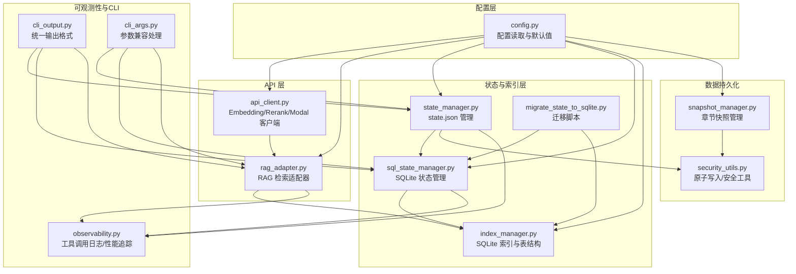
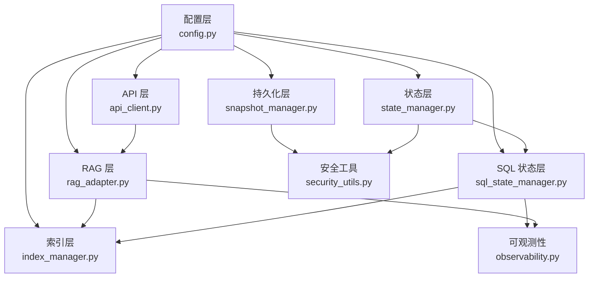
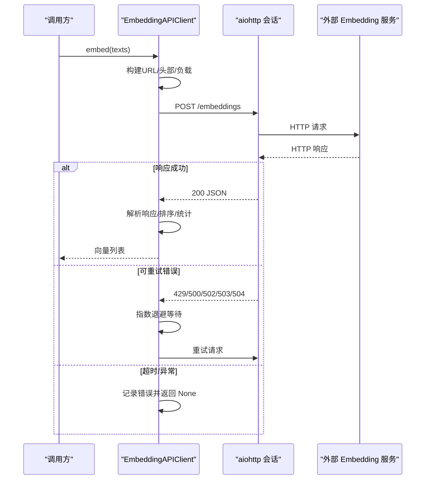
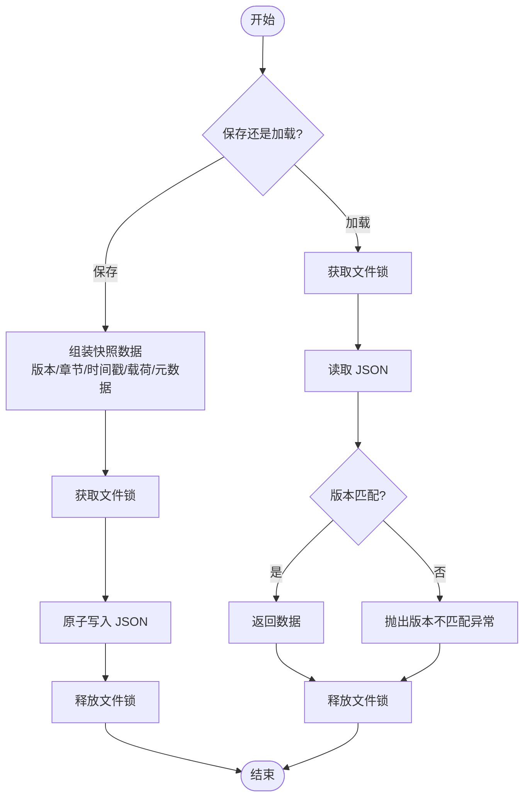
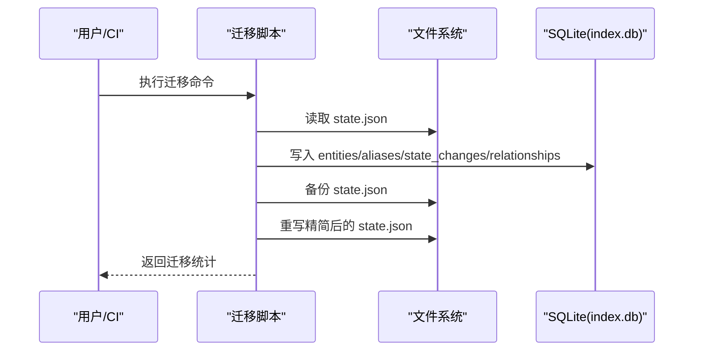
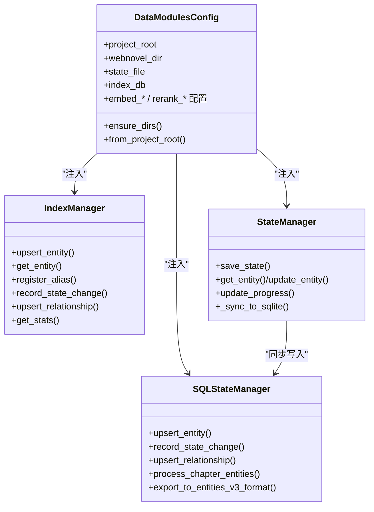
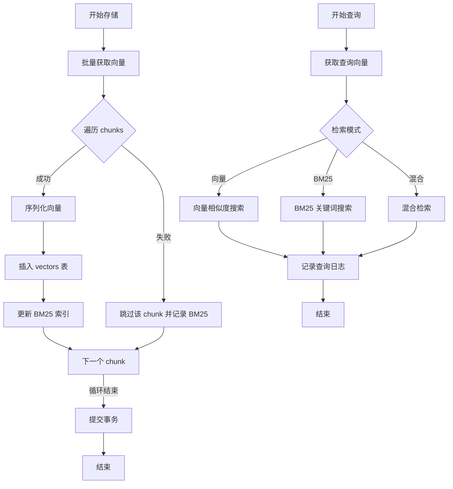
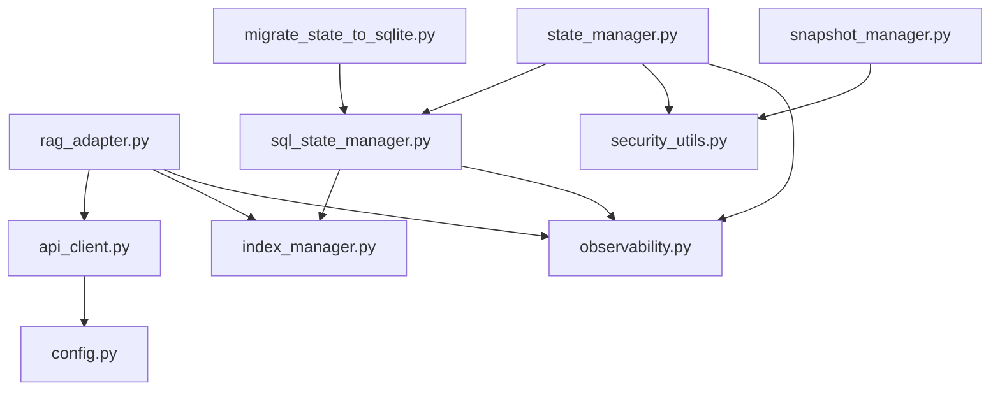

# 数据访问层

<cite>
**本文引用的文件**
- [api_client.py](file://webnovel-writer/scripts/data_modules/api_client.py)
- [snapshot_manager.py](file://webnovel-writer/scripts/data_modules/snapshot_manager.py)
- [sql_state_manager.py](file://webnovel-writer/scripts/data_modules/sql_state_manager.py)
- [state_manager.py](file://webnovel-writer/scripts/data_modules/state_manager.py)
- [migrate_state_to_sqlite.py](file://webnovel-writer/scripts/data_modules/migrate_state_to_sqlite.py)
- [index_manager.py](file://webnovel-writer/scripts/data_modules/index_manager.py)
- [config.py](file://webnovel-writer/scripts/data_modules/config.py)
- [security_utils.py](file://webnovel-writer/scripts/security_utils.py)
- [rag_adapter.py](file://webnovel-writer/scripts/data_modules/rag_adapter.py)
- [state_validator.py](file://webnovel-writer/scripts/data_modules/state_validator.py)
- [observability.py](file://webnovel-writer/scripts/data_modules/observability.py)
- [cli_output.py](file://webnovel-writer/scripts/data_modules/cli_output.py)
- [cli_args.py](file://webnovel-writer/scripts/data_modules/cli_args.py)
</cite>

## 目录
1. [简介](#简介)
2. [项目结构](#项目结构)
3. [核心组件](#核心组件)
4. [架构总览](#架构总览)
5. [详细组件分析](#详细组件分析)
6. [依赖分析](#依赖分析)
7. [性能考虑](#性能考虑)
8. [故障排查指南](#故障排查指南)
9. [结论](#结论)
10. [附录](#附录)

## 简介
本技术文档聚焦 Webnovel Writer 的数据访问层，系统性阐述以下方面：
- API 客户端设计与实现：HTTP 请求封装、响应解析、并发控制与指数退避重试机制
- 快照管理器的数据备份策略、版本控制与并发安全
- 状态迁移器的数据转换逻辑、SQLite 同步与兼容性处理
- 数据访问抽象层设计、DAO 模式实现与依赖注入机制
- 序列化/反序列化、数据校验与安全防护
- 性能优化、连接池管理与并发控制
- API 接口文档、SDK 使用示例与集成指南

## 项目结构
数据访问层主要位于 scripts/data_modules 目录，围绕以下模块协同工作：
- 配置模块：集中管理 API、并发、超时、重试、检索等配置
- API 客户端：封装 Embedding/Rerank/Modal 接口，支持并发与重试
- 状态管理：提供 state.json 的读写与 SQLite 同步
- SQL 状态管理：将大数据迁移到 SQLite，提供高效查询接口
- 快照管理：章节上下文快照的持久化与版本控制
- RAG 适配器：向量检索、BM25 混合检索与向量数据库管理
- 安全工具：原子写入、文件名清理、Git 操作降级
- 可观测性：工具调用日志与性能追踪
- CLI 辅助：统一输出格式与参数兼容

**图表来源**
- [config.py:90-349](file://webnovel-writer/scripts/data_modules/config.py#L90-L349)
- [api_client.py:41-496](file://webnovel-writer/scripts/data_modules/api_client.py#L41-L496)
- [rag_adapter.py:68-800](file://webnovel-writer/scripts/data_modules/rag_adapter.py#L68-L800)
- [state_manager.py:90-800](file://webnovel-writer/scripts/data_modules/state_manager.py#L90-L800)
- [sql_state_manager.py:46-595](file://webnovel-writer/scripts/data_modules/sql_state_manager.py#L46-L595)
- [index_manager.py:228-800](file://webnovel-writer/scripts/data_modules/index_manager.py#L228-L800)
- [migrate_state_to_sqlite.py:39-380](file://webnovel-writer/scripts/data_modules/migrate_state_to_sqlite.py#L39-L380)
- [snapshot_manager.py:41-93](file://webnovel-writer/scripts/data_modules/snapshot_manager.py#L41-L93)
- [security_utils.py:345-590](file://webnovel-writer/scripts/security_utils.py#L345-L590)
- [observability.py:19-88](file://webnovel-writer/scripts/data_modules/observability.py#L19-L88)
- [cli_output.py:23-70](file://webnovel-writer/scripts/data_modules/cli_output.py#L23-L70)
- [cli_args.py:63-97](file://webnovel-writer/scripts/data_modules/cli_args.py#L63-L97)

**章节来源**
- [config.py:90-349](file://webnovel-writer/scripts/data_modules/config.py#L90-L349)
- [api_client.py:41-496](file://webnovel-writer/scripts/data_modules/api_client.py#L41-L496)
- [rag_adapter.py:68-800](file://webnovel-writer/scripts/data_modules/rag_adapter.py#L68-L800)
- [state_manager.py:90-800](file://webnovel-writer/scripts/data_modules/state_manager.py#L90-L800)
- [sql_state_manager.py:46-595](file://webnovel-writer/scripts/data_modules/sql_state_manager.py#L46-L595)
- [index_manager.py:228-800](file://webnovel-writer/scripts/data_modules/index_manager.py#L228-L800)
- [migrate_state_to_sqlite.py:39-380](file://webnovel-writer/scripts/data_modules/migrate_state_to_sqlite.py#L39-L380)
- [snapshot_manager.py:41-93](file://webnovel-writer/scripts/data_modules/snapshot_manager.py#L41-L93)
- [security_utils.py:345-590](file://webnovel-writer/scripts/security_utils.py#L345-L590)
- [observability.py:19-88](file://webnovel-writer/scripts/data_modules/observability.py#L19-L88)
- [cli_output.py:23-70](file://webnovel-writer/scripts/data_modules/cli_output.py#L23-L70)
- [cli_args.py:63-97](file://webnovel-writer/scripts/data_modules/cli_args.py#L63-L97)

## 核心组件
- API 客户端：统一 Embedding/Rerank/Modal 接口，支持并发信号量、指数退避重试、冷启动与常规超时区分
- 状态管理器：state.json 的读写与 SQLite 同步，保证并发安全与数据一致性
- SQL 状态管理器：将大数据迁移到 SQLite，提供实体、别名、状态变化、关系的高效查询
- 快照管理器：章节上下文快照的版本控制与并发安全写入
- RAG 适配器：向量检索与 BM25 混合检索，向量数据库的 schema 管理与降级模式
- 安全工具：原子写入、文件名清理、Git 操作降级，防止并发冲突与路径注入
- 可观测性：工具调用日志与性能追踪，便于定位性能瓶颈与错误

**章节来源**
- [api_client.py:41-496](file://webnovel-writer/scripts/data_modules/api_client.py#L41-L496)
- [state_manager.py:90-800](file://webnovel-writer/scripts/data_modules/state_manager.py#L90-L800)
- [sql_state_manager.py:46-595](file://webnovel-writer/scripts/data_modules/sql_state_manager.py#L46-L595)
- [snapshot_manager.py:41-93](file://webnovel-writer/scripts/data_modules/snapshot_manager.py#L41-L93)
- [rag_adapter.py:68-800](file://webnovel-writer/scripts/data_modules/rag_adapter.py#L68-L800)
- [security_utils.py:345-590](file://webnovel-writer/scripts/security_utils.py#L345-L590)
- [observability.py:19-88](file://webnovel-writer/scripts/data_modules/observability.py#L19-L88)

## 架构总览
数据访问层采用分层设计：
- 配置层：集中管理 API、并发、超时、重试、检索等配置项
- API 层：封装外部服务调用，提供统一接口与重试机制
- 状态层：state.json 与 SQLite 的双轨并行，逐步迁移大数据
- 索引层：SQLite 表结构与查询接口，支撑实体、别名、关系、状态变化等
- 持久化层：快照与原子写入，保障并发安全与数据完整性
- RAG 层：向量与 BM25 检索，向量数据库管理与降级策略
- 可观测性层：日志与性能追踪，辅助运维与性能优化

**图表来源**
- [config.py:90-349](file://webnovel-writer/scripts/data_modules/config.py#L90-L349)
- [api_client.py:41-496](file://webnovel-writer/scripts/data_modules/api_client.py#L41-L496)
- [rag_adapter.py:68-800](file://webnovel-writer/scripts/data_modules/rag_adapter.py#L68-L800)
- [state_manager.py:90-800](file://webnovel-writer/scripts/data_modules/state_manager.py#L90-L800)
- [sql_state_manager.py:46-595](file://webnovel-writer/scripts/data_modules/sql_state_manager.py#L46-L595)
- [index_manager.py:228-800](file://webnovel-writer/scripts/data_modules/index_manager.py#L228-L800)
- [snapshot_manager.py:41-93](file://webnovel-writer/scripts/data_modules/snapshot_manager.py#L41-L93)
- [security_utils.py:345-590](file://webnovel-writer/scripts/security_utils.py#L345-L590)
- [observability.py:19-88](file://webnovel-writer/scripts/data_modules/observability.py#L19-L88)

## 详细组件分析

### API 客户端设计与实现
- 设计要点
  - 支持 OpenAI 兼容与 Modal 自定义接口，自动 URL/请求体/响应解析适配
  - 并发控制：独立信号量控制 Embedding 与 Rerank 并发
  - 超时策略：冷启动超时与常规超时区分，避免预热阶段超时
  - 重试机制：指数退避，支持 429/500/502/503/504 等可重试状态码
  - 统计与诊断：调用次数、耗时、错误计数与最后错误信息
- 关键流程
  - 构建会话与连接器（TCP 连接池）
  - 构建请求头与 URL，序列化请求体
  - 发送请求，解析响应，按接口类型提取向量或排序结果
  - 失败时按指数退避重试，最终返回 None 并记录错误
  - 成功后更新统计与预热状态

**图表来源**
- [api_client.py:118-195](file://webnovel-writer/scripts/data_modules/api_client.py#L118-L195)

**章节来源**
- [api_client.py:41-496](file://webnovel-writer/scripts/data_modules/api_client.py#L41-L496)
- [config.py:124-156](file://webnovel-writer/scripts/data_modules/config.py#L124-L156)

### 快照管理器的数据备份策略
- 设计要点
  - 版本控制：快照包含版本号，加载时校验版本一致性
  - 并发安全：使用文件锁保护同一章节的并发写入
  - 原子写入：结合安全工具的原子写入函数，避免部分写入
  - 生命周期管理：支持保存、加载、删除、列举快照
- 关键流程
  - 保存：组装快照数据（版本、章节、时间戳、载荷、元数据），加锁写入
  - 加载：加锁读取，校验版本，不一致抛出版本不匹配异常
  - 删除：加锁删除对应文件
  - 列举：扫描快照目录，返回有序文件名列表

**图表来源**
- [snapshot_manager.py:54-80](file://webnovel-writer/scripts/data_modules/snapshot_manager.py#L54-L80)
- [security_utils.py:345-444](file://webnovel-writer/scripts/security_utils.py#L345-L444)

**章节来源**
- [snapshot_manager.py:41-93](file://webnovel-writer/scripts/data_modules/snapshot_manager.py#L41-L93)
- [security_utils.py:345-444](file://webnovel-writer/scripts/security_utils.py#L345-L444)

### 状态迁移器的数据转换逻辑与兼容性处理
- 设计要点
  - 迁移策略：将 state.json 中的大数据字段迁移至 SQLite，state.json 仅保留精简数据
  - 兼容性：State Manager 与 SQL State Manager 双轨并行，逐步迁移
  - 数据一致性：迁移脚本支持备份、干跑与错误统计
  - 格式适配：提供导出到 entities_v3 与 alias_index 的兼容格式
- 关键流程
  - 迁移：逐字段读取并写入 SQLite 对应表，记录统计与错误
  - 精简：迁移完成后重写 state.json，仅保留必要字段
  - 同步：State Manager 在保存时同步到 SQLite，并在失败时回滚内存队列

**图表来源**
- [migrate_state_to_sqlite.py:39-277](file://webnovel-writer/scripts/data_modules/migrate_state_to_sqlite.py#L39-L277)
- [state_manager.py:371-406](file://webnovel-writer/scripts/data_modules/state_manager.py#L371-L406)

**章节来源**
- [migrate_state_to_sqlite.py:39-380](file://webnovel-writer/scripts/data_modules/migrate_state_to_sqlite.py#L39-L380)
- [state_manager.py:371-406](file://webnovel-writer/scripts/data_modules/state_manager.py#L371-L406)
- [sql_state_manager.py:439-487](file://webnovel-writer/scripts/data_modules/sql_state_manager.py#L439-L487)

### 数据访问抽象层设计、DAO 模式与依赖注入
- 抽象层设计
  - 配置抽象：DataModulesConfig 统一读取与默认值，支持项目级 .env
  - DAO 抽象：IndexManager 提供实体、别名、状态变化、关系等 CRUD 接口
  - 状态抽象：State Manager 与 SQL State Manager 提供统一的状态读写接口
- 依赖注入
  - 通过构造函数注入配置对象，支持全局默认配置与项目级配置
  - 通过 get_client/get_config 等工厂函数提供单例与便捷访问
- 优点
  - 解耦配置与业务逻辑
  - 易于替换底层实现（如更换 API 供应商）
  - 便于单元测试与集成测试

**图表来源**
- [config.py:90-349](file://webnovel-writer/scripts/data_modules/config.py#L90-L349)
- [index_manager.py:228-800](file://webnovel-writer/scripts/data_modules/index_manager.py#L228-L800)
- [state_manager.py:90-800](file://webnovel-writer/scripts/data_modules/state_manager.py#L90-L800)
- [sql_state_manager.py:46-595](file://webnovel-writer/scripts/data_modules/sql_state_manager.py#L46-L595)

**章节来源**
- [config.py:90-349](file://webnovel-writer/scripts/data_modules/config.py#L90-L349)
- [index_manager.py:228-800](file://webnovel-writer/scripts/data_modules/index_manager.py#L228-L800)
- [state_manager.py:90-800](file://webnovel-writer/scripts/data_modules/state_manager.py#L90-L800)
- [sql_state_manager.py:46-595](file://webnovel-writer/scripts/data_modules/sql_state_manager.py#L46-L595)

### 序列化/反序列化、数据校验与安全防护
- 序列化/反序列化
  - JSON：state.json 使用原子写入，避免并发写入损坏
  - 向量：SQLite 中以二进制存储向量，使用 struct 序列化/反序列化
- 数据校验
  - 状态运行时校验：foreshadowing 状态与层级规范化、章节字段解析
  - 输入校验：整数输入严格验证，防止注入与异常
- 安全防护
  - 文件名清理：sanitize_filename 防止路径遍历
  - 提交消息清理：sanitize_commit_message 防止 Git 注入
  - 原子写入：atomic_write_json 防止并发冲突与部分写入
  - Git 降级：git_graceful_operation 在无 Git 环境下优雅降级

**章节来源**
- [security_utils.py:29-134](file://webnovel-writer/scripts/security_utils.py#L29-L134)
- [security_utils.py:345-590](file://webnovel-writer/scripts/security_utils.py#L345-L590)
- [state_validator.py:54-250](file://webnovel-writer/scripts/data_modules/state_validator.py#L54-L250)
- [rag_adapter.py:486-496](file://webnovel-writer/scripts/data_modules/rag_adapter.py#L486-L496)

### RAG 适配器与混合检索
- 设计要点
  - 向量检索：调用 API 获取查询向量，计算余弦相似度，返回 top_k 结果
  - BM25 检索：本地 SQLite BM25 索引，支持分词与 IDF 计算
  - 混合检索：可配置向量与 BM25 的融合策略（RRF 等）
  - 向量数据库：vectors 表存储 chunk_id/chapter/scene/content/embedding 等
  - 降级模式：当认证失败等异常时进入降级模式，仅使用 BM25
- 关键流程
  - 存储：批量获取向量，序列化后写入 vectors 表，同时更新 BM25 索引
  - 查询：向量检索或 BM25 检索，支持按章节/类型过滤
  - 日志：记录查询类型、命中来源、延迟等指标

**图表来源**
- [rag_adapter.py:379-484](file://webnovel-writer/scripts/data_modules/rag_adapter.py#L379-L484)
- [rag_adapter.py:560-650](file://webnovel-writer/scripts/data_modules/rag_adapter.py#L560-L650)
- [rag_adapter.py:663-777](file://webnovel-writer/scripts/data_modules/rag_adapter.py#L663-L777)

**章节来源**
- [rag_adapter.py:68-800](file://webnovel-writer/scripts/data_modules/rag_adapter.py#L68-L800)
- [config.py:157-175](file://webnovel-writer/scripts/data_modules/config.py#L157-L175)

## 依赖分析
- 组件耦合
  - API 客户端依赖配置模块，RAG 适配器依赖 API 客户端与索引管理器
  - 状态管理器依赖 SQLite 状态管理器与安全工具
  - 迁移脚本依赖 SQL 状态管理器与配置模块
- 外部依赖
  - aiohttp：异步 HTTP 客户端与 TCP 连接池
  - sqlite3：本地 SQLite 数据库
  - filelock：文件锁，保障并发安全
  - pathlib：跨平台路径处理

**图表来源**
- [api_client.py:30-31](file://webnovel-writer/scripts/data_modules/api_client.py#L30-L31)
- [rag_adapter.py:31-36](file://webnovel-writer/scripts/data_modules/rag_adapter.py#L31-L36)
- [state_manager.py:29-31](file://webnovel-writer/scripts/data_modules/state_manager.py#L29-L31)
- [sql_state_manager.py:20-29](file://webnovel-writer/scripts/data_modules/sql_state_manager.py#L20-L29)
- [migrate_state_to_sqlite.py:35-36](file://webnovel-writer/scripts/data_modules/migrate_state_to_sqlite.py#L35-L36)
- [snapshot_manager.py:17-23](file://webnovel-writer/scripts/data_modules/snapshot_manager.py#L17-L23)
- [observability.py:16-17](file://webnovel-writer/scripts/data_modules/observability.py#L16-L17)

**章节来源**
- [api_client.py:30-31](file://webnovel-writer/scripts/data_modules/api_client.py#L30-L31)
- [rag_adapter.py:31-36](file://webnovel-writer/scripts/data_modules/rag_adapter.py#L31-L36)
- [state_manager.py:29-31](file://webnovel-writer/scripts/data_modules/state_manager.py#L29-L31)
- [sql_state_manager.py:20-29](file://webnovel-writer/scripts/data_modules/sql_state_manager.py#L20-L29)
- [migrate_state_to_sqlite.py:35-36](file://webnovel-writer/scripts/data_modules/migrate_state_to_sqlite.py#L35-L36)
- [snapshot_manager.py:17-23](file://webnovel-writer/scripts/data_modules/snapshot_manager.py#L17-L23)
- [observability.py:16-17](file://webnovel-writer/scripts/data_modules/observability.py#L16-L17)

## 性能考虑
- 并发与连接池
  - API 客户端使用 aiohttp.TCPConnector 与信号量控制并发，合理设置并发上限
  - SQLite 连接使用上下文管理器确保及时关闭，避免句柄泄漏
- 检索性能
  - 向量检索：批量嵌入、向量序列化/反序列化、索引查询
  - BM25 检索：倒排索引与文档统计，支持按章节/类型过滤
  - 混合检索：可配置融合参数，平衡语义与关键词
- 写入性能
  - 原子写入与文件锁减少竞争，批量写入 SQLite 提升吞吐
  - 迁移脚本支持干跑与备份，降低生产风险

**章节来源**
- [api_client.py:57-61](file://webnovel-writer/scripts/data_modules/api_client.py#L57-L61)
- [rag_adapter.py:246-253](file://webnovel-writer/scripts/data_modules/rag_adapter.py#L246-L253)
- [state_manager.py:342-367](file://webnovel-writer/scripts/data_modules/state_manager.py#L342-L367)

## 故障排查指南
- API 调用失败
  - 检查认证头与 URL 构建是否正确
  - 查看重试日志与最后错误状态码，确认是否为可重试错误
  - 调整并发与超时配置，避免冷启动与限流
- SQLite 写入失败
  - 检查磁盘空间与权限
  - 查看事务提交异常与索引约束冲突
  - 使用迁移脚本的备份与回滚能力
- 快照版本不匹配
  - 确认快照版本号与当前版本一致
  - 检查并发写入是否导致文件损坏
- RAG 降级模式
  - 检查认证失败等异常，确认是否进入降级模式
  - 仅使用 BM25 检索，关注日志中的错误信息

**章节来源**
- [api_client.py:157-193](file://webnovel-writer/scripts/data_modules/api_client.py#L157-L193)
- [state_manager.py:371-406](file://webnovel-writer/scripts/data_modules/state_manager.py#L371-L406)
- [snapshot_manager.py:77-80](file://webnovel-writer/scripts/data_modules/snapshot_manager.py#L77-L80)
- [rag_adapter.py:83-89](file://webnovel-writer/scripts/data_modules/rag_adapter.py#L83-L89)

## 结论
Webnovel Writer 的数据访问层通过清晰的分层设计与完善的工具链，实现了：
- 高可靠性的 API 客户端与重试机制
- 并发安全的快照管理与原子写入
- 渐进式的大数据迁移与 SQLite 同步
- 高效的 RAG 检索与混合策略
- 全面的安全防护与可观测性

这些设计为后端开发与系统集成提供了稳定、可扩展的数据访问解决方案。

## 附录

### API 接口文档（摘要）
- EmbeddingAPIClient
  - embed(texts): 获取向量，支持批量与重试
  - embed_batch(texts, skip_failures): 批量嵌入，支持跳过失败项
  - warmup(): 预热服务
- RerankAPIClient
  - rerank(query, documents, top_n): 重排序，支持 top_n
  - warmup(): 预热服务
- ModalAPIClient
  - embed()/embed_batch()/rerank()/warmup(): 统一接口
  - stats/print_stats(): 统计信息
- RAGAdapter
  - store_chunks(chunks): 存储向量与 BM25 索引
  - vector_search/query/bm25_search/hybrid_search: 检索接口
  - degraded_mode_reason: 降级原因

**章节来源**
- [api_client.py:118-383](file://webnovel-writer/scripts/data_modules/api_client.py#L118-L383)
- [rag_adapter.py:379-777](file://webnovel-writer/scripts/data_modules/rag_adapter.py#L379-L777)

### SDK 使用示例（路径指引）
- 初始化配置
  - [config.py:318-343](file://webnovel-writer/scripts/data_modules/config.py#L318-L343)
- 获取 API 客户端
  - [api_client.py:491-496](file://webnovel-writer/scripts/data_modules/api_client.py#L491-L496)
- 使用 RAG 适配器
  - [rag_adapter.py:68-800](file://webnovel-writer/scripts/data_modules/rag_adapter.py#L68-L800)
- 状态管理与迁移
  - [state_manager.py:90-800](file://webnovel-writer/scripts/data_modules/state_manager.py#L90-L800)
  - [migrate_state_to_sqlite.py:325-380](file://webnovel-writer/scripts/data_modules/migrate_state_to_sqlite.py#L325-L380)
- 快照管理
  - [snapshot_manager.py:54-93](file://webnovel-writer/scripts/data_modules/snapshot_manager.py#L54-L93)
- 安全工具
  - [security_utils.py:345-590](file://webnovel-writer/scripts/security_utils.py#L345-L590)

### 集成指南
- 配置管理
  - 通过 DataModulesConfig 读取环境变量与 .env 文件
  - 支持项目级与全局 .env，避免覆盖已有环境变量
- 依赖注入
  - 通过工厂函数与构造函数注入配置对象
  - 统一使用 get_config/get_client 获取实例
- CLI 集成
  - 使用 cli_output 统一输出 JSON
  - 使用 cli_args 兼容参数位置，支持 --project-root 放在子命令后
- 可观测性
  - 使用 observability 模块记录工具调用与性能指标
  - 在关键流程埋点，便于定位问题与优化

**章节来源**
- [config.py:51-77](file://webnovel-writer/scripts/data_modules/config.py#L51-L77)
- [cli_output.py:23-70](file://webnovel-writer/scripts/data_modules/cli_output.py#L23-L70)
- [cli_args.py:63-97](file://webnovel-writer/scripts/data_modules/cli_args.py#L63-L97)
- [observability.py:19-88](file://webnovel-writer/scripts/data_modules/observability.py#L19-L88)