# 状态跟踪机制

<cite>
**本文档引用的文件**
- [webnovel-writer/scripts/data_modules/state_manager.py](file://webnovel-writer/scripts/data_modules/state_manager.py)
- [webnovel-writer/scripts/data_modules/sql_state_manager.py](file://webnovel-writer/scripts/data_modules/sql_state_manager.py)
- [webnovel-writer/scripts/data_modules/index_manager.py](file://webnovel-writer/scripts/data_modules/index_manager.py)
- [webnovel-writer/scripts/data_modules/state_validator.py](file://webnovel-writer/scripts/data_modules/state_validator.py)
- [webnovel-writer/scripts/data_modules/snapshot_manager.py](file://webnovel-writer/scripts/data_modules/snapshot_manager.py)
- [webnovel-writer/scripts/data_modules/migrate_state_to_sqlite.py](file://webnovel-writer/scripts/data_modules/migrate_state_to_sqlite.py)
- [webnovel-writer/scripts/data_modules/schemas.py](file://webnovel-writer/scripts/data_modules/schemas.py)
- [webnovel-writer/scripts/data_modules/tests/test_sql_state_manager.py](file://webnovel-writer/scripts/data_modules/tests/test_sql_state_manager.py)
- [webnovel-writer/scripts/data_modules/tests/test_state_validator.py](file://webnovel-writer/scripts/data_modules/tests/test_state_validator.py)
- [webnovel-writer/scripts/status_reporter.py](file://webnovel-writer/scripts/status_reporter.py)
- [webnovel-writer/scripts/update_state.py](file://webnovel-writer/scripts/update_state.py)
</cite>

## 目录
1. [简介](#简介)
2. [项目结构](#项目结构)
3. [核心组件](#核心组件)
4. [架构概览](#架构概览)
5. [详细组件分析](#详细组件分析)
6. [依赖分析](#依赖分析)
7. [性能考虑](#性能考虑)
8. [故障排除指南](#故障排除指南)
9. [结论](#结论)
10. [附录](#附录)

## 简介

Webnovel Writer 状态跟踪机制是一个基于 SQLite 的分布式状态管理系统，专为大型网络小说创作设计。该系统实现了完整的状态变化记录、实体管理、关系追踪和历史查询功能，支持并发安全的增量更新和批量处理。

系统采用"state.json + SQLite"双层架构，其中 state.json 保持精简数据，而大数据字段（实体、别名、状态变化、关系）全部迁移到 SQLite 数据库中，实现了高效的存储和查询性能。

## 项目结构

项目采用模块化设计，主要分为以下几个核心模块：

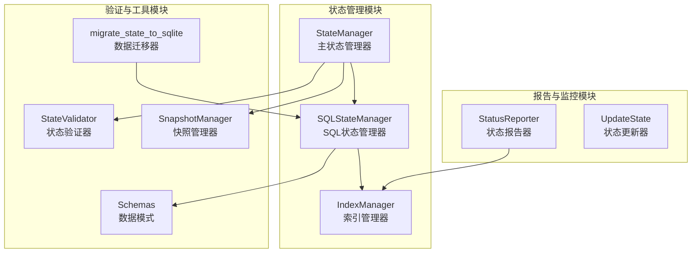

**图表来源**
- [webnovel-writer/scripts/data_modules/state_manager.py:90-140](file://webnovel-writer/scripts/data_modules/state_manager.py#L90-L140)
- [webnovel-writer/scripts/data_modules/sql_state_manager.py:46-100](file://webnovel-writer/scripts/data_modules/sql_state_manager.py#L46-L100)
- [webnovel-writer/scripts/data_modules/index_manager.py:228-234](file://webnovel-writer/scripts/data_modules/index_manager.py#L228-L234)

**章节来源**
- [webnovel-writer/scripts/data_modules/state_manager.py:1-140](file://webnovel-writer/scripts/data_modules/state_manager.py#L1-L140)
- [webnovel-writer/scripts/data_modules/sql_state_manager.py:1-50](file://webnovel-writer/scripts/data_modules/sql_state_manager.py#L1-L50)
- [webnovel-writer/scripts/data_modules/index_manager.py:1-50](file://webnovel-writer/scripts/data_modules/index_manager.py#L1-L50)

## 核心组件

### StateManager 主状态管理器

StateManager 是整个状态跟踪系统的核心控制器，负责协调各个子系统的协作。它实现了以下关键功能：

- **双层架构支持**：同时管理 state.json 和 SQLite 数据库
- **并发安全**：使用文件锁确保多进程安全
- **增量更新**：通过补丁机制实现高效的状态变更
- **数据迁移**：自动将大数据字段迁移到 SQLite

### SQLStateManager SQL状态管理器

SQLStateManager 提供了与 StateManager 兼容的接口，但数据存储在 SQLite 中：

- **实体管理**：支持实体的创建、更新、查询
- **状态变化追踪**：记录详细的变更历史
- **关系管理**：维护实体间的关系网络
- **批量处理**：优化章节级别的批量数据处理

### IndexManager 索引管理器

IndexManager 是 SQLite 数据库的直接操作层，提供了丰富的查询接口：

- **实体索引**：按类型、层级、别名快速检索
- **状态变化历史**：支持按实体、章节的时间序列查询
- **关系图谱**：构建和查询实体关系网络
- **债务管理**：支持追读力债务的追踪和管理

**章节来源**
- [webnovel-writer/scripts/data_modules/state_manager.py:90-140](file://webnovel-writer/scripts/data_modules/state_manager.py#L90-L140)
- [webnovel-writer/scripts/data_modules/sql_state_manager.py:46-100](file://webnovel-writer/scripts/data_modules/sql_state_manager.py#L46-L100)
- [webnovel-writer/scripts/data_modules/index_manager.py:228-234](file://webnovel-writer/scripts/data_modules/index_manager.py#L228-L234)

## 架构概览

系统采用分层架构设计，实现了清晰的职责分离：

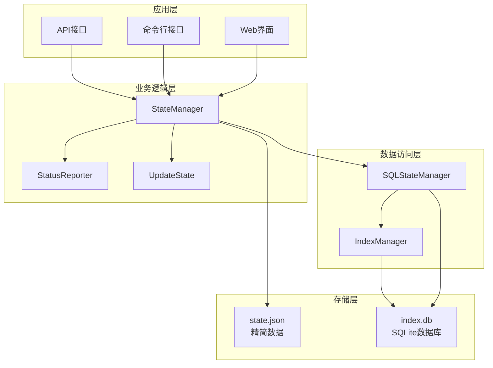

**图表来源**
- [webnovel-writer/scripts/data_modules/state_manager.py:96-140](file://webnovel-writer/scripts/data_modules/state_manager.py#L96-L140)
- [webnovel-writer/scripts/data_modules/sql_state_manager.py:97-100](file://webnovel-writer/scripts/data_modules/sql_state_manager.py#L97-L100)
- [webnovel-writer/scripts/data_modules/index_manager.py:231-234](file://webnovel-writer/scripts/data_modules/index_manager.py#L231-L234)

## 详细组件分析

### StateChangeMeta 数据模型

StateChangeMeta 是状态变化记录的核心数据结构，定义了状态变更的完整信息：

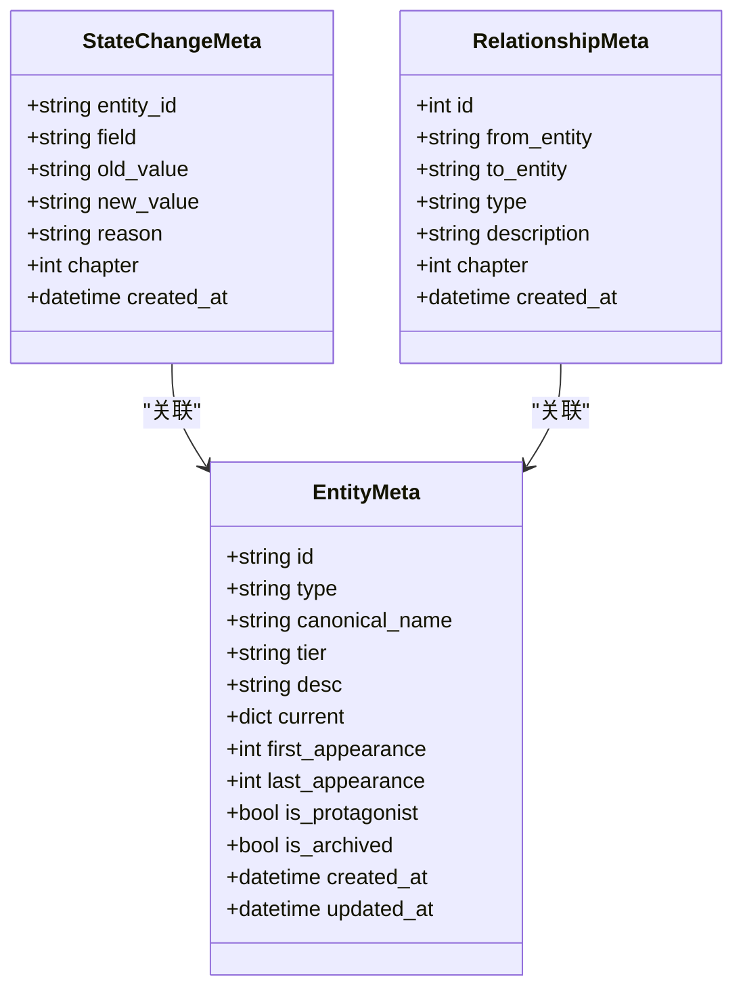

**图表来源**
- [webnovel-writer/scripts/data_modules/index_manager.py:97-117](file://webnovel-writer/scripts/data_modules/index_manager.py#L97-L117)
- [webnovel-writer/scripts/data_modules/index_manager.py:81-94](file://webnovel-writer/scripts/data_modules/index_manager.py#L81-L94)
- [webnovel-writer/scripts/data_modules/index_manager.py:109-117](file://webnovel-writer/scripts/data_modules/index_manager.py#L109-L117)

#### 状态字段跟踪机制

系统实现了多层次的状态字段跟踪：

1. **实体状态跟踪**：记录实体的 current 字段变更
2. **关系状态跟踪**：维护实体间关系的动态变化
3. **章节级状态**：按章节维度组织状态变更
4. **历史版本管理**：支持状态变更的历史追溯

**章节来源**
- [webnovel-writer/scripts/data_modules/index_manager.py:97-117](file://webnovel-writer/scripts/data_modules/index_manager.py#L97-L117)
- [webnovel-writer/scripts/data_modules/state_manager.py:67-76](file://webnovel-writer/scripts/data_modules/state_manager.py#L67-L76)

### 状态验证器规则引擎

状态验证器实现了完整的规则引擎，确保状态数据的一致性和完整性：

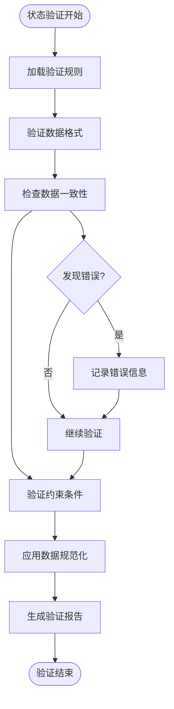

**图表来源**
- [webnovel-writer/scripts/data_modules/state_validator.py:156-189](file://webnovel-writer/scripts/data_modules/state_validator.py#L156-L189)
- [webnovel-writer/scripts/data_modules/state_validator.py:192-217](file://webnovel-writer/scripts/data_modules/state_validator.py#L192-L217)

#### 验证规则类型

系统支持多种验证规则：

- **格式验证**：确保数据结构符合预期
- **一致性检查**：验证数据间的逻辑关系
- **约束验证**：检查业务规则的满足情况
- **规范化处理**：自动修正数据格式问题

**章节来源**
- [webnovel-writer/scripts/data_modules/state_validator.py:1-250](file://webnovel-writer/scripts/data_modules/state_validator.py#L1-L250)

### SQL状态管理器持久化策略

SQL状态管理器采用了优化的持久化策略：

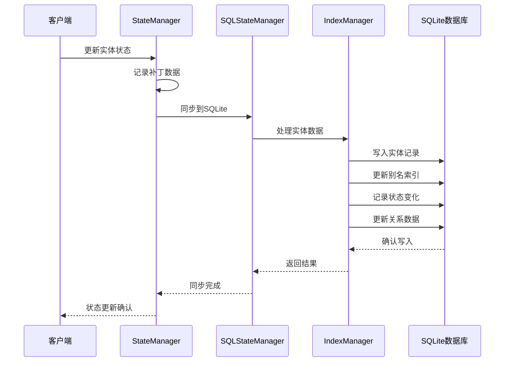

**图表来源**
- [webnovel-writer/scripts/data_modules/state_manager.py:371-406](file://webnovel-writer/scripts/data_modules/state_manager.py#L371-L406)
- [webnovel-writer/scripts/data_modules/sql_state_manager.py:267-417](file://webnovel-writer/scripts/data_modules/sql_state_manager.py#L267-L417)

#### 事务边界控制

系统实现了细粒度的事务控制：

- **批量事务**：章节级别的批量数据处理使用单一事务
- **增量事务**：单个实体更新使用独立事务
- **原子操作**：关键操作保证原子性
- **回滚机制**：失败时自动回滚并恢复状态

**章节来源**
- [webnovel-writer/scripts/data_modules/state_manager.py:371-371](file://webnovel-writer/scripts/data_modules/state_manager.py#L371-L371)
- [webnovel-writer/scripts/data_modules/sql_state_manager.py:419-430](file://webnovel-writer/scripts/data_modules/sql_state_manager.py#L419-L430)

### 并发访问处理

系统采用多层并发控制机制：

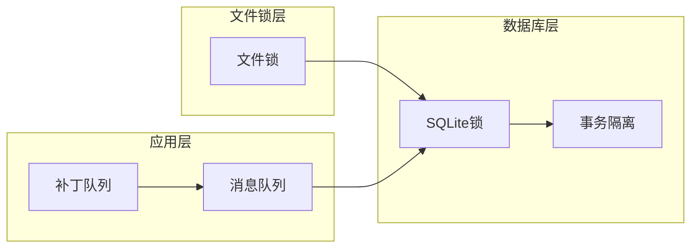

**图表来源**
- [webnovel-writer/scripts/data_modules/state_manager.py:237-238](file://webnovel-writer/scripts/data_modules/state_manager.py#L237-L238)
- [webnovel-writer/scripts/data_modules/state_manager.py:371-371](file://webnovel-writer/scripts/data_modules/state_manager.py#L371-L371)

#### 并发安全机制

- **文件锁**：防止多个进程同时修改 state.json
- **SQLite事务**：确保数据库操作的原子性
- **补丁合并**：在锁内重读并合并增量更新
- **超时处理**：避免死锁和长时间阻塞

**章节来源**
- [webnovel-writer/scripts/data_modules/state_manager.py:208-370](file://webnovel-writer/scripts/data_modules/state_manager.py#L208-L370)

### 状态快照管理

快照管理器提供了完整的状态快照功能：

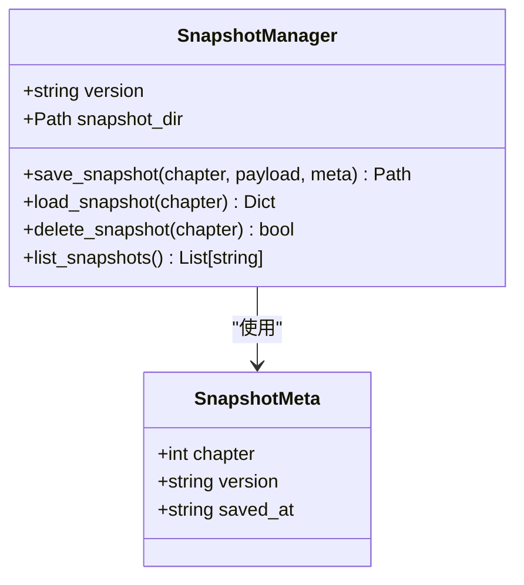

**图表来源**
- [webnovel-writer/scripts/data_modules/snapshot_manager.py:41-93](file://webnovel-writer/scripts/data_modules/snapshot_manager.py#L41-L93)

#### 快照版本控制

- **版本标识**：支持快照版本的版本控制
- **原子写入**：使用原子文件写入确保数据完整性
- **并发安全**：通过文件锁避免并发冲突
- **清理策略**：支持快照的删除和清理

**章节来源**
- [webnovel-writer/scripts/data_modules/snapshot_manager.py:1-93](file://webnovel-writer/scripts/data_modules/snapshot_manager.py#L1-L93)

### 增量更新机制

系统实现了高效的增量更新机制：

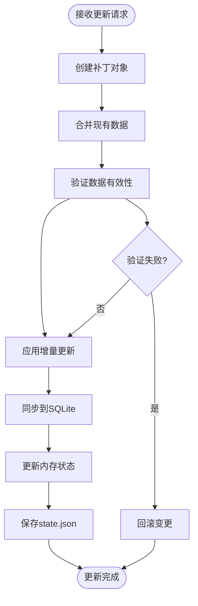

**图表来源**
- [webnovel-writer/scripts/data_modules/state_manager.py:119-138](file://webnovel-writer/scripts/data_modules/state_manager.py#L119-L138)
- [webnovel-writer/scripts/data_modules/state_manager.py:208-370](file://webnovel-writer/scripts/data_modules/state_manager.py#L208-L370)

#### 增量更新策略

- **补丁队列**：收集和管理待处理的增量更新
- **数据合并**：智能合并不同来源的更新
- **冲突检测**：检测和解决数据冲突
- **批量处理**：优化大量数据的处理效率

**章节来源**
- [webnovel-writer/scripts/data_modules/state_manager.py:76-88](file://webnovel-writer/scripts/data_modules/state_manager.py#L76-L88)

### 版本控制方案

系统实现了多层次的版本控制：

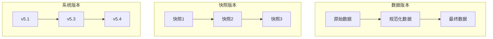

**图表来源**
- [webnovel-writer/scripts/data_modules/snapshot_manager.py:24-46](file://webnovel-writer/scripts/data_modules/snapshot_manager.py#L24-L46)
- [webnovel-writer/scripts/data_modules/migrate_state_to_sqlite.py:252-255](file://webnovel-writer/scripts/data_modules/migrate_state_to_sqlite.py#L252-L255)

#### 版本兼容性

- **向前兼容**：新版本可以读取旧版本数据
- **向后兼容**：旧版本可以读取新版本数据
- **迁移机制**：提供自动数据迁移功能
- **版本标记**：在数据中记录版本信息

**章节来源**
- [webnovel-writer/scripts/data_modules/migrate_state_to_sqlite.py:39-277](file://webnovel-writer/scripts/data_modules/migrate_state_to_sqlite.py#L39-L277)

### 状态回滚与撤销

系统提供了完整的回滚和撤销功能：

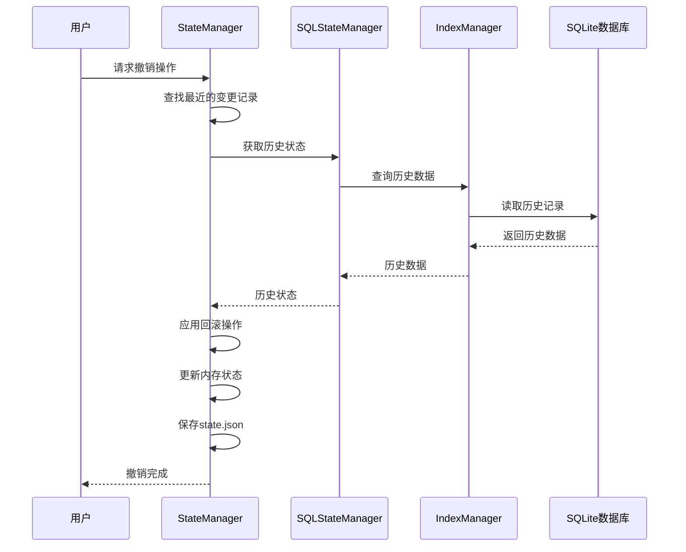

**图表来源**
- [webnovel-writer/scripts/data_modules/state_manager.py:561-584](file://webnovel-writer/scripts/data_modules/state_manager.py#L561-L584)
- [webnovel-writer/scripts/data_modules/sql_state_manager.py:217-227](file://webnovel-writer/scripts/data_modules/sql_state_manager.py#L217-L227)

#### 回滚机制特性

- **时间点回滚**：支持回到任意历史时间点
- **增量回滚**：只回滚特定的变更
- **批量回滚**：支持批量撤销操作
- **冲突解决**：自动处理回滚过程中的冲突

**章节来源**
- [webnovel-writer/scripts/data_modules/state_manager.py:561-584](file://webnovel-writer/scripts/data_modules/state_manager.py#L561-L584)

### 审计追踪功能

系统实现了完整的审计追踪功能：

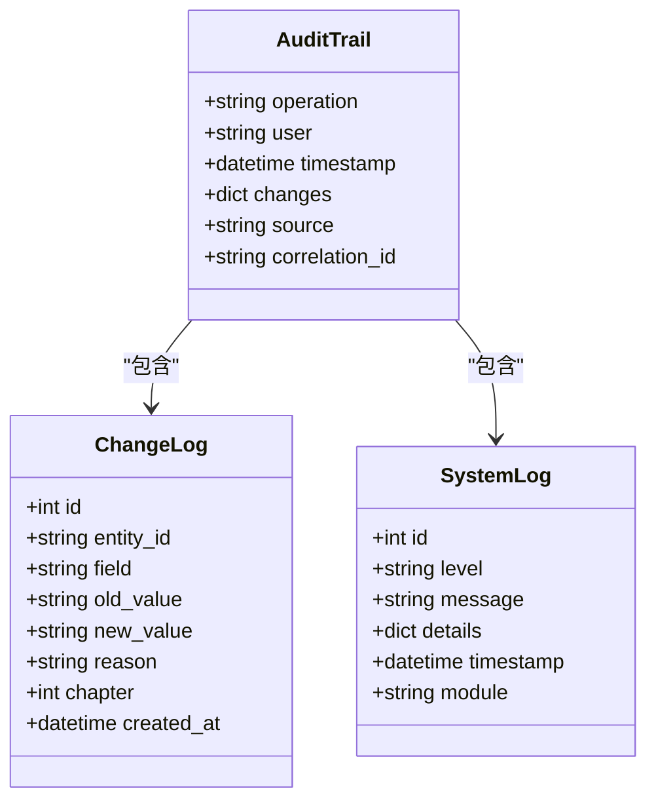

**图表来源**
- [webnovel-writer/scripts/data_modules/index_manager.py:515-554](file://webnovel-writer/scripts/data_modules/index_manager.py#L515-L554)
- [webnovel-writer/scripts/data_modules/index_manager.py:556-594](file://webnovel-writer/scripts/data_modules/index_manager.py#L556-L594)

#### 审计功能特性

- **操作追踪**：记录所有用户操作
- **变更日志**：详细记录数据变更历史
- **系统监控**：监控系统运行状态
- **合规性**：满足审计要求

**章节来源**
- [webnovel-writer/scripts/data_modules/index_manager.py:515-594](file://webnovel-writer/scripts/data_modules/index_manager.py#L515-L594)

### 状态查询优化

系统实现了多种查询优化策略：

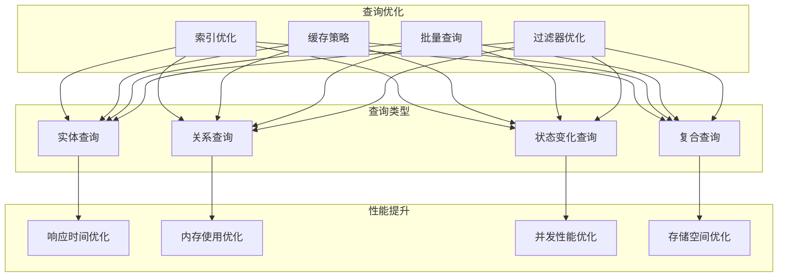

**图表来源**
- [webnovel-writer/scripts/data_modules/index_manager.py:282-414](file://webnovel-writer/scripts/data_modules/index_manager.py#L282-L414)
- [webnovel-writer/scripts/data_modules/state_manager.py:618-706](file://webnovel-writer/scripts/data_modules/state_manager.py#L618-L706)

#### 查询优化技术

- **索引策略**：为常用查询字段建立索引
- **缓存机制**：缓存热点数据减少数据库访问
- **批量处理**：优化大批量数据的查询性能
- **过滤优化**：减少不必要的数据传输

**章节来源**
- [webnovel-writer/scripts/data_modules/index_manager.py:282-414](file://webnovel-writer/scripts/data_modules/index_manager.py#L282-L414)

### 批量状态更新

系统支持高效的批量状态更新：

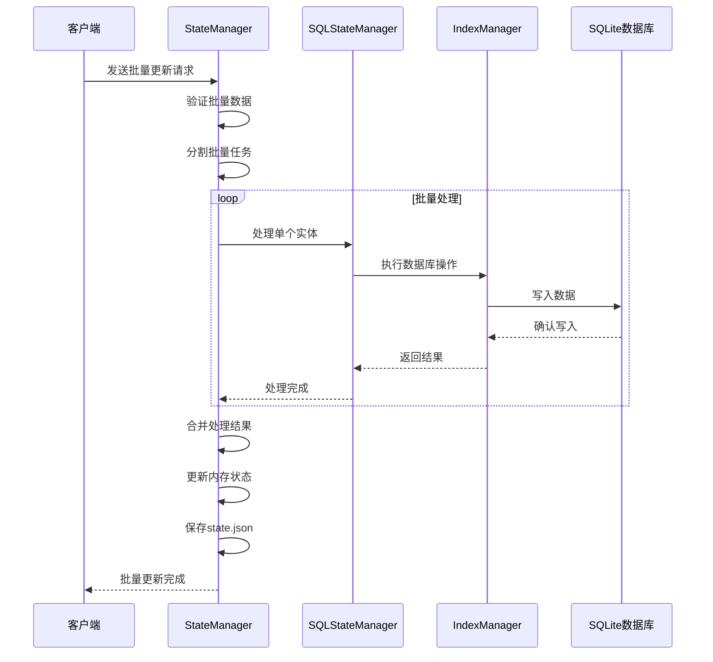

**图表来源**
- [webnovel-writer/scripts/data_modules/sql_state_manager.py:267-417](file://webnovel-writer/scripts/data_modules/sql_state_manager.py#L267-L417)
- [webnovel-writer/scripts/data_modules/state_manager.py:371-406](file://webnovel-writer/scripts/data_modules/state_manager.py#L371-L406)

#### 批量处理特性

- **事务优化**：批量操作使用单一事务
- **并发控制**：避免批量操作间的冲突
- **错误处理**：单个失败不影响整体操作
- **进度跟踪**：实时显示批量处理进度

**章节来源**
- [webnovel-writer/scripts/data_modules/sql_state_manager.py:267-417](file://webnovel-writer/scripts/data_modules/sql_state_manager.py#L267-L417)

### 状态迁移处理

系统提供了完整的状态迁移功能：

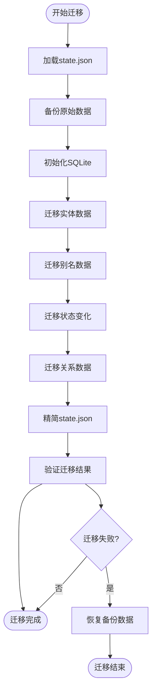

**图表来源**
- [webnovel-writer/scripts/data_modules/migrate_state_to_sqlite.py:39-277](file://webnovel-writer/scripts/data_modules/migrate_state_to_sqlite.py#L39-L277)

#### 迁移特性

- **原子性**：迁移过程保证原子性
- **可逆性**：支持迁移失败后的回滚
- **性能优化**：批量处理提高迁移效率
- **数据完整性**：确保迁移后数据的完整性

**章节来源**
- [webnovel-writer/scripts/data_modules/migrate_state_to_sqlite.py:39-277](file://webnovel-writer/scripts/data_modules/migrate_state_to_sqlite.py#L39-L277)

## 依赖分析

系统具有清晰的依赖关系：

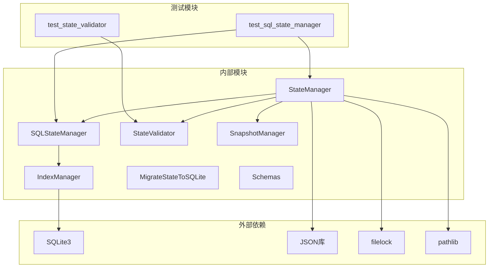

**图表来源**
- [webnovel-writer/scripts/data_modules/state_manager.py:16-41](file://webnovel-writer/scripts/data_modules/state_manager.py#L16-L41)
- [webnovel-writer/scripts/data_modules/sql_state_manager.py:15-29](file://webnovel-writer/scripts/data_modules/sql_state_manager.py#L15-L29)
- [webnovel-writer/scripts/data_modules/index_manager.py:35-52](file://webnovel-writer/scripts/data_modules/index_manager.py#L35-L52)

**章节来源**
- [webnovel-writer/scripts/data_modules/state_manager.py:16-41](file://webnovel-writer/scripts/data_modules/state_manager.py#L16-L41)
- [webnovel-writer/scripts/data_modules/sql_state_manager.py:15-29](file://webnovel-writer/scripts/data_modules/sql_state_manager.py#L15-L29)
- [webnovel-writer/scripts/data_modules/index_manager.py:35-52](file://webnovel-writer/scripts/data_modules/index_manager.py#L35-L52)

## 性能考虑

系统在设计时充分考虑了性能优化：

### 存储优化

- **数据分层**：将大数据字段迁移到 SQLite，减少 JSON 文件大小
- **索引策略**：为常用查询字段建立索引，提高查询性能
- **批量操作**：支持批量数据处理，减少数据库往返次数

### 查询优化

- **缓存机制**：缓存热点数据，减少数据库访问
- **延迟加载**：按需加载数据，避免不必要的数据传输
- **查询优化**：使用高效的 SQL 查询语句

### 并发优化

- **锁机制**：使用文件锁和数据库锁确保并发安全
- **事务管理**：合理使用事务减少锁竞争
- **异步处理**：支持异步操作提高响应速度

## 故障排除指南

### 常见问题诊断

#### 状态文件锁定问题

**症状**：无法获取 state.json 文件锁

**解决方案**：
1. 检查是否有其他进程正在使用状态文件
2. 等待锁释放或重启应用程序
3. 检查文件权限设置

#### SQLite 连接问题

**症状**：数据库连接失败或查询超时

**解决方案**：
1. 检查数据库文件是否存在且可访问
2. 验证数据库文件的完整性
3. 检查磁盘空间是否充足

#### 数据迁移失败

**症状**：数据迁移过程中出现错误

**解决方案**：
1. 检查备份文件是否完整
2. 验证源数据的格式正确性
3. 检查目标数据库的权限设置

### 性能问题排查

#### 查询缓慢

**诊断步骤**：
1. 检查数据库索引是否完整
2. 分析查询执行计划
3. 考虑添加适当的索引

#### 内存使用过高

**诊断步骤**：
1. 检查缓存配置是否合理
2. 分析内存使用模式
3. 考虑调整缓存策略

**章节来源**
- [webnovel-writer/scripts/data_modules/state_manager.py:368-370](file://webnovel-writer/scripts/data_modules/state_manager.py#L368-L370)
- [webnovel-writer/scripts/data_modules/sql_state_manager.py:419-430](file://webnovel-writer/scripts/data_modules/sql_state_manager.py#L419-L430)

## 结论

Webnovel Writer 状态跟踪机制是一个设计精良的分布式状态管理系统，具有以下特点：

### 技术优势

1. **架构清晰**：采用分层架构，职责分离明确
2. **性能优异**：通过 SQLite 优化大数据存储和查询
3. **并发安全**：多重锁机制确保数据一致性
4. **扩展性强**：模块化设计便于功能扩展

### 实践价值

1. **创作支持**：为大型网络小说创作提供强大的状态管理
2. **数据完整性**：确保创作数据的完整性和可追溯性
3. **团队协作**：支持多作者协作创作的并发需求
4. **长期维护**：提供完整的审计和回滚功能

### 未来发展方向

1. **云原生支持**：考虑支持云端部署和分布式架构
2. **实时同步**：增强多设备间的实时数据同步能力
3. **AI集成**：与 AI 创作工具深度集成
4. **性能优化**：持续优化大数据场景下的性能表现

该系统为网络小说创作提供了一个可靠、高效、可扩展的状态管理平台，能够满足专业作者的复杂创作需求。

## 附录

### API 接口说明

#### 状态管理接口

| 接口 | 方法 | 描述 | 参数 | 返回值 |
|------|------|------|------|--------|
| StateManager | get_entity() | 获取实体信息 | entity_id, entity_type | Dict |
| StateManager | update_entity() | 更新实体状态 | entity_id, updates, entity_type | bool |
| StateManager | add_entity() | 添加新实体 | EntityState | bool |
| SQLStateManager | record_state_change() | 记录状态变化 | entity_id, field, old_value, new_value, reason, chapter | int |
| SQLStateManager | upsert_relationship() | 插入或更新关系 | from_entity, to_entity, type, description, chapter | bool |

#### 查询接口

| 接口 | 方法 | 描述 | 参数 | 返回值 |
|------|------|------|------|--------|
| IndexManager | get_entity_state_changes() | 获取实体状态变化历史 | entity_id, limit | List[Dict] |
| IndexManager | get_recent_state_changes() | 获取最近的状态变化 | limit | List[Dict] |
| IndexManager | get_entity_relationships() | 获取实体关系 | entity_id, direction | List[Dict] |
| IndexManager | build_relationship_subgraph() | 构建关系子图谱 | center_entity, depth, chapter, top_edges | Dict |

### 错误处理机制

系统实现了完善的错误处理机制：

1. **异常分类**：区分数据错误、系统错误、用户错误
2. **错误恢复**：提供自动恢复和手动干预选项
3. **日志记录**：详细记录错误信息便于调试
4. **用户提示**：友好的错误提示和解决方案建议

### 性能监控方法

系统提供了全面的性能监控功能：

1. **数据库监控**：监控数据库连接、查询性能
2. **文件系统监控**：监控文件访问和存储使用
3. **内存监控**：监控内存使用和垃圾回收
4. **并发监控**：监控锁竞争和线程状态

**章节来源**
- [webnovel-writer/scripts/data_modules/state_manager.py:618-800](file://webnovel-writer/scripts/data_modules/state_manager.py#L618-L800)
- [webnovel-writer/scripts/data_modules/sql_state_manager.py:193-227](file://webnovel-writer/scripts/data_modules/sql_state_manager.py#L193-L227)
- [webnovel-writer/scripts/data_modules/index_manager.py:637-800](file://webnovel-writer/scripts/data_modules/index_manager.py#L637-L800)