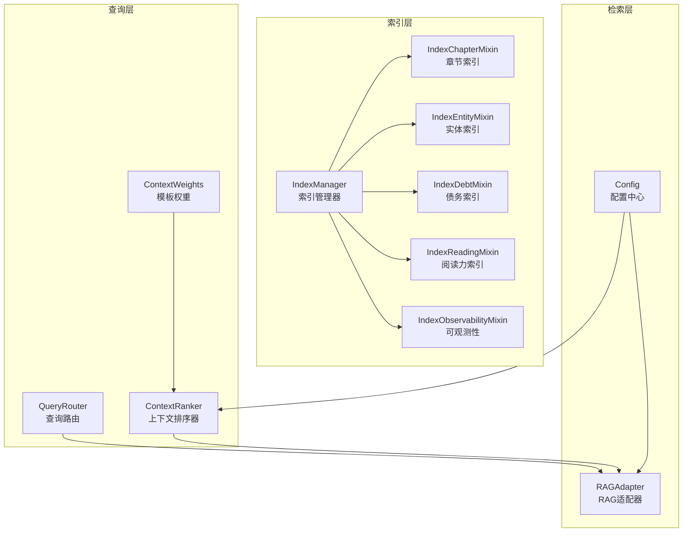
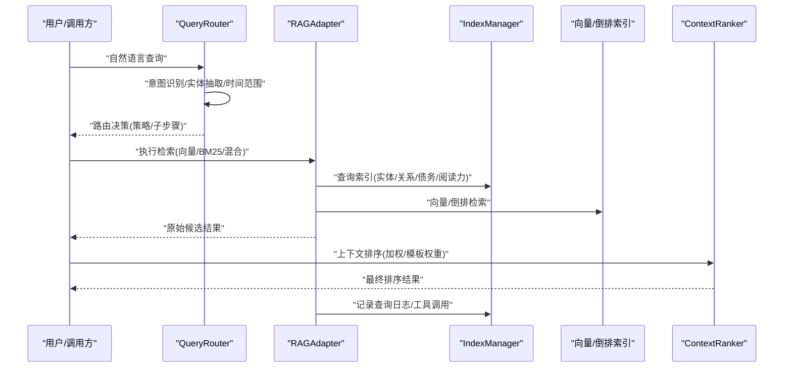
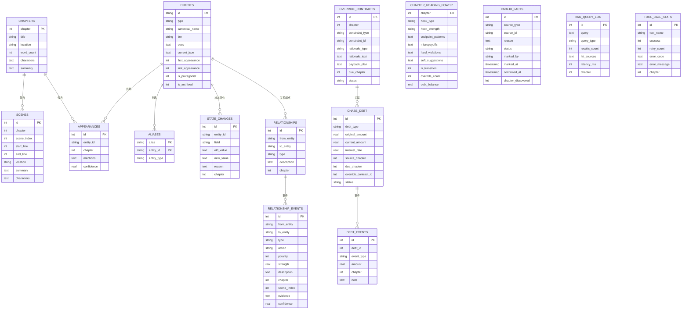
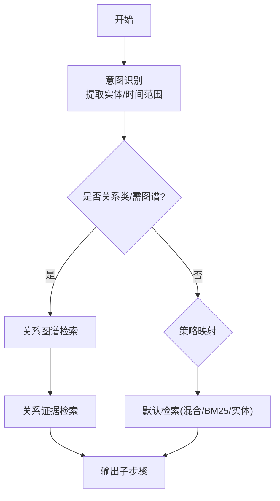
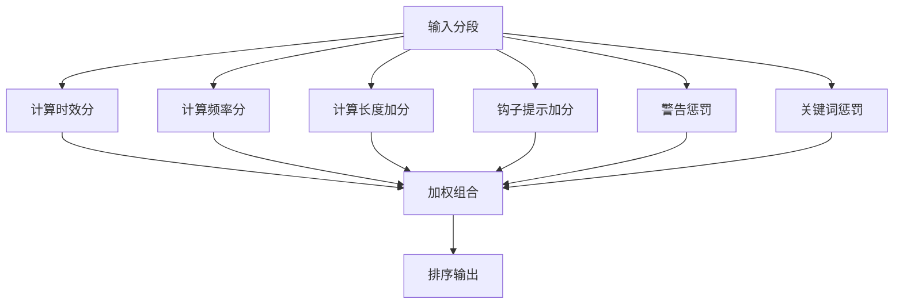
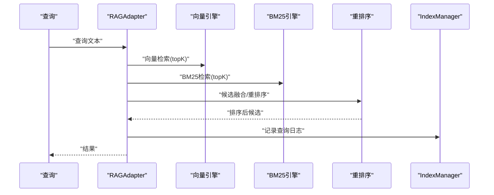
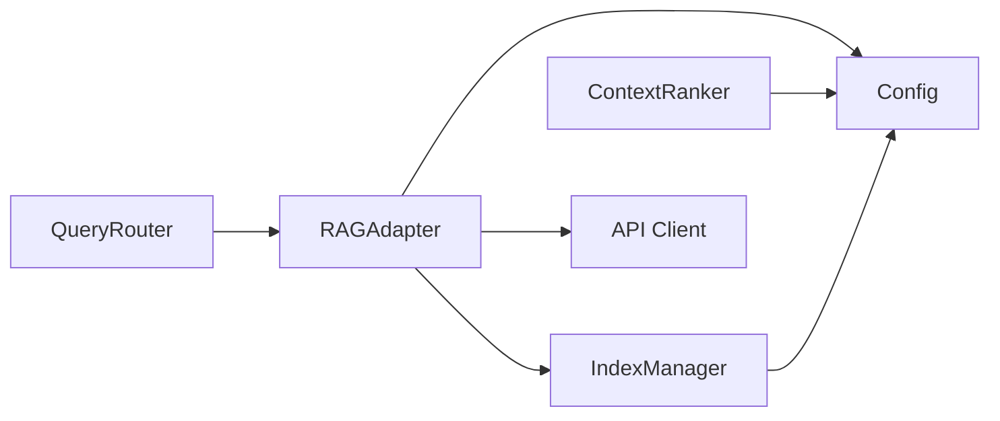

# 索引与查询优化

<cite>
**本文引用的文件**   
- [index_manager.py](file://webnovel-writer/scripts/data_modules/index_manager.py)
- [index_chapter_mixin.py](file://webnovel-writer/scripts/data_modules/index_chapter_mixin.py)
- [index_entity_mixin.py](file://webnovel-writer/scripts/data_modules/index_entity_mixin.py)
- [index_debt_mixin.py](file://webnovel-writer/scripts/data_modules/index_debt_mixin.py)
- [index_reading_mixin.py](file://webnovel-writer/scripts/data_modules/index_reading_mixin.py)
- [index_observability_mixin.py](file://webnovel-writer/scripts/data_modules/index_observability_mixin.py)
- [query_router.py](file://webnovel-writer/scripts/data_modules/query_router.py)
- [context_ranker.py](file://webnovel-writer/scripts/data_modules/context_ranker.py)
- [context_weights.py](file://webnovel-writer/scripts/data_modules/context_weights.py)
- [config.py](file://webnovel-writer/scripts/data_modules/config.py)
- [rag_adapter.py](file://webnovel-writer/scripts/data_modules/rag_adapter.py)
- [schemas.py](file://webnovel-writer/scripts/data_modules/schemas.py)
- [observability.py](file://webnovel-writer/scripts/data_modules/observability.py)
- [test_context_ranker.py](file://webnovel-writer/scripts/data_modules/tests/test_context_ranker.py)
</cite>

## 目录
1. [简介](#简介)
2. [项目结构](#项目结构)
3. [核心组件](#核心组件)
4. [架构总览](#架构总览)
5. [详细组件分析](#详细组件分析)
6. [依赖分析](#依赖分析)
7. [性能考量](#性能考量)
8. [故障排查指南](#故障排查指南)
9. [结论](#结论)
10. [附录](#附录)

## 简介
本文件面向数据库性能工程师与系统优化专家，系统化梳理 Webnovel Writer 的索引与查询优化体系，涵盖多维度索引策略（章节、实体、关系、债务）、查询路由与重写、上下文排序与权重、复合查询执行计划与缓存、大规模数据分区与并行处理、以及可观测性与维护最佳实践。文档以代码为依据，辅以可视化图示与实操建议，帮助读者快速掌握从索引设计到查询优化的完整闭环。

## 项目结构
本系统围绕“索引管理器 + 检索适配器 + 上下文排序器”的三层架构组织，配合配置中心与可观测性模块，形成可扩展、可维护、可监控的查询优化体系。

**图表来源**
- [index_manager.py:228-620](file://webnovel-writer/scripts/data_modules/index_manager.py#L228-L620)
- [index_chapter_mixin.py:14-303](file://webnovel-writer/scripts/data_modules/index_chapter_mixin.py#L14-L303)
- [index_entity_mixin.py:20-986](file://webnovel-writer/scripts/data_modules/index_entity_mixin.py#L20-L986)
- [index_debt_mixin.py:14-505](file://webnovel-writer/scripts/data_modules/index_debt_mixin.py#L14-L505)
- [index_reading_mixin.py:15-383](file://webnovel-writer/scripts/data_modules/index_reading_mixin.py#L15-L383)
- [index_observability_mixin.py:18-228](file://webnovel-writer/scripts/data_modules/index_observability_mixin.py#L18-L228)
- [query_router.py:10-145](file://webnovel-writer/scripts/data_modules/query_router.py#L10-L145)
- [context_ranker.py:20-211](file://webnovel-writer/scripts/data_modules/context_ranker.py#L20-L211)
- [context_weights.py:12-38](file://webnovel-writer/scripts/data_modules/context_weights.py#L12-L38)
- [config.py:90-349](file://webnovel-writer/scripts/data_modules/config.py#L90-L349)
- [rag_adapter.py:68-800](file://webnovel-writer/scripts/data_modules/rag_adapter.py#L68-L800)

**章节来源**
- [index_manager.py:1-1314](file://webnovel-writer/scripts/data_modules/index_manager.py#L1-L1314)
- [config.py:1-349](file://webnovel-writer/scripts/data_modules/config.py#L1-L349)

## 核心组件
- 索引管理器与多维索引
  - 章节索引：章节元数据、场景、出场记录
  - 实体索引：实体、别名、状态变化、关系
  - 债务索引：Override Contract、追读力债务、事件日志、章节阅读力元数据
  - 可观测性索引：无效事实、RAG 查询日志、工具调用统计
- 查询路由与重写
  - 基于意图识别与时间范围抽取的路由决策
  - 复合子查询规划与策略选择
- 上下文排序与权重
  - 基于时效、频率、钩子提示的加权排序
  - 模板动态权重随阶段调整
- 检索适配器与缓存
  - 向量检索、BM25、混合检索、重排序与RRF融合
  - 向量/倒排索引与近期候选预过滤
- 配置中心与可观测性
  - 全局参数、并发、超时、重试、预算与阈值
  - 性能计时、工具调用日志、查询日志

**章节来源**
- [index_manager.py:228-620](file://webnovel-writer/scripts/data_modules/index_manager.py#L228-L620)
- [query_router.py:10-145](file://webnovel-writer/scripts/data_modules/query_router.py#L10-L145)
- [context_ranker.py:20-211](file://webnovel-writer/scripts/data_modules/context_ranker.py#L20-L211)
- [context_weights.py:12-38](file://webnovel-writer/scripts/data_modules/context_weights.py#L12-L38)
- [rag_adapter.py:68-800](file://webnovel-writer/scripts/data_modules/rag_adapter.py#L68-L800)
- [config.py:90-349](file://webnovel-writer/scripts/data_modules/config.py#L90-L349)

## 架构总览
下图展示从查询输入到结果输出的关键交互路径，包括路由、检索、排序与日志记录。

**图表来源**
- [query_router.py:67-145](file://webnovel-writer/scripts/data_modules/query_router.py#L67-L145)
- [rag_adapter.py:68-800](file://webnovel-writer/scripts/data_modules/rag_adapter.py#L68-L800)
- [index_manager.py:228-620](file://webnovel-writer/scripts/data_modules/index_manager.py#L228-L620)
- [context_ranker.py:28-211](file://webnovel-writer/scripts/data_modules/context_ranker.py#L28-L211)

## 详细组件分析

### 索引管理器与多维索引
- 设计原则
  - 以 SQLite 为中心，围绕“章节-场景-实体-关系-债务-可观测性”六大主题域构建
  - 通过主键/唯一约束保证一致性，通过索引提升查询效率
  - v5.1+ 引入实体、别名、状态变化、关系表；v5.3+ 引入债务与章节阅读力；v5.4+ 引入无效事实与审查指标
- 章节索引
  - 章节表：章节号为主键，存储标题、地点、字数、出场角色、摘要
  - 场景表：章节内场景索引，支持按地点检索
  - 出场记录：实体在章节中的提及与置信度
- 实体索引
  - 实体表：类型、正名、Tier、当前状态、首次/末次出场、是否主角/归档
  - 别名表：支持一对多映射，便于模糊匹配
  - 状态变化表：字段变更轨迹
  - 关系表：三元组(from,to,type)，支持双向查询与时间线
  - 关系事件表：时序化关系演进，支持快照与事件流融合
- 债务索引
  - Override Contract：软建议违背的契约，冻结终态
  - 追读力债务：含利息、到期、状态、关联契约
  - 债务事件：创建、计息、部分/全额偿还、逾期
  - 章节阅读力元数据：钩子类型/强度、爽点模式、微兑现、违规/建议、过渡章、债务余额
- 可观测性索引
  - 无效事实：来源类型/ID、原因、状态、发现章节
  - RAG 查询日志：查询类型、命中来源分布、耗时、章节
  - 工具调用统计：成功/失败、重试次数、错误码/消息、章节

**图表来源**
- [index_manager.py:242-620](file://webnovel-writer/scripts/data_modules/index_manager.py#L242-L620)

**章节来源**
- [index_manager.py:228-620](file://webnovel-writer/scripts/data_modules/index_manager.py#L228-L620)
- [index_chapter_mixin.py:14-303](file://webnovel-writer/scripts/data_modules/index_chapter_mixin.py#L14-L303)
- [index_entity_mixin.py:20-986](file://webnovel-writer/scripts/data_modules/index_entity_mixin.py#L20-L986)
- [index_debt_mixin.py:14-505](file://webnovel-writer/scripts/data_modules/index_debt_mixin.py#L14-L505)
- [index_reading_mixin.py:15-383](file://webnovel-writer/scripts/data_modules/index_reading_mixin.py#L15-L383)
- [index_observability_mixin.py:18-228](file://webnovel-writer/scripts/data_modules/index_observability_mixin.py#L18-L228)

### 查询路由与重写
- 路由目标
  - 识别查询意图（关系/实体/场景/设定/剧情）
  - 抽取时间范围（起止章节）
  - 提取实体候选（基于中文短语与停用词过滤）
  - 判断是否需要图谱增强
- 子查询规划
  - 关系类查询：先图谱检索再证据检索
  - 图谱增强检索：对实体+时间范围进行混合检索
  - 其他意图：按实体/BM25/混合策略执行
- 查询重写
  - 将自然语言拆分为子查询片段（逗号/分号/顿号/以及/和）

**图表来源**
- [query_router.py:67-137](file://webnovel-writer/scripts/data_modules/query_router.py#L67-L137)

**章节来源**
- [query_router.py:10-145](file://webnovel-writer/scripts/data_modules/query_router.py#L10-L145)

### 上下文排序与权重
- 排序目标
  - 优先近期出现、稳定高频、高信号钩子/反转/冲突
  - 保持输出结构兼容（同键、重排列表）
- 权重与评分
  - 时效分：1/(1+章差)
  - 频率分：log(1+总出场)/log(11)，避免过度偏爱极高频
  - 长度加分：按摘要长度占比上限
  - 钩子提示加分：包含特定关键词
  - 警告惩罚：出场项带警告时降低分数
  - 关键词惩罚：严重级别为“critical/high”的告警
- 模板权重
  - 随阶段（早期/中期/晚期）动态调整核心/场景/全局权重
  - 支持多种模板（剧情/战斗/情感/过渡）

**图表来源**
- [context_ranker.py:148-200](file://webnovel-writer/scripts/data_modules/context_ranker.py#L148-L200)
- [context_weights.py:19-38](file://webnovel-writer/scripts/data_modules/context_weights.py#L19-L38)

**章节来源**
- [context_ranker.py:20-211](file://webnovel-writer/scripts/data_modules/context_ranker.py#L20-L211)
- [context_weights.py:12-38](file://webnovel-writer/scripts/data_modules/context_weights.py#L12-L38)
- [test_context_ranker.py:8-56](file://webnovel-writer/scripts/data_modules/tests/test_context_ranker.py#L8-L56)

### 检索适配器与缓存
- 向量检索
  - 批量嵌入、序列化向量、SQLite 存储
  - 余弦相似度计算，支持按章节/类型过滤
- BM25 检索
  - 中英混合分词、TF-IDF、IDF、平均文档长度
  - 倒排索引 + 文档统计表
- 混合检索与重排序
  - 向量/BM25候选融合，RRF 融合参数可配置
  - 可选重排序（rerank）提升相关性
- 缓存与预过滤
  - 近期候选预过滤、全量扫描阈值控制
  - SQLite 参数批处理分片（避免参数过多）
- 查询日志与降级
  - 记录查询类型、命中来源、耗时、章节
  - 嵌入鉴权失败进入降级模式

**图表来源**
- [rag_adapter.py:560-777](file://webnovel-writer/scripts/data_modules/rag_adapter.py#L560-L777)
- [rag_adapter.py:379-484](file://webnovel-writer/scripts/data_modules/rag_adapter.py#L379-L484)

**章节来源**
- [rag_adapter.py:68-800](file://webnovel-writer/scripts/data_modules/rag_adapter.py#L68-L800)
- [config.py:124-175](file://webnovel-writer/scripts/data_modules/config.py#L124-L175)

### 复合查询执行计划与索引选择
- 执行计划
  - 路由器输出子步骤，适配器按策略并行/串行执行
  - 向量检索与 BM25 检索可并行，重排序串行
  - 近期候选预过滤减少向量扫描规模
- 索引选择
  - 章节/场景：chapter、scene_index、location
  - 实体/别名：id、alias、type
  - 关系/事件：from/to/type/chapter、时间窗口
  - 债务：status、due_chapter、source_chapter
  - 向量/倒排：chunk_id 主键、term/term+chunk_id 复合索引
- 缓存机制
  - 向量/倒排持久化于 SQLite
  - 近期候选按章节/类型缓存，避免重复扫描

**章节来源**
- [index_manager.py:282-620](file://webnovel-writer/scripts/data_modules/index_manager.py#L282-L620)
- [rag_adapter.py:240-245](file://webnovel-writer/scripts/data_modules/rag_adapter.py#L240-L245)
- [config.py:157-175](file://webnovel-writer/scripts/data_modules/config.py#L157-L175)

## 依赖分析
- 组件耦合
  - IndexManager 通过 Mixin 组合章节/实体/债务/阅读力/可观测性能力
  - RAGAdapter 依赖 IndexManager 查询索引、依赖 Config 控制参数
  - QueryRouter 与 ContextRanker 独立运行，通过适配器集成
- 外部依赖
  - API 客户端（嵌入/重排序）用于向量化与重排序
  - SQLite 作为向量/倒排/索引存储后端
- 循环依赖
  - 无循环导入；模块间通过实例注入与函数调用解耦

**图表来源**
- [query_router.py:10-145](file://webnovel-writer/scripts/data_modules/query_router.py#L10-L145)
- [rag_adapter.py:68-800](file://webnovel-writer/scripts/data_modules/rag_adapter.py#L68-L800)
- [index_manager.py:228-620](file://webnovel-writer/scripts/data_modules/index_manager.py#L228-L620)
- [config.py:90-349](file://webnovel-writer/scripts/data_modules/config.py#L90-L349)

**章节来源**
- [schemas.py:1-126](file://webnovel-writer/scripts/data_modules/schemas.py#L1-L126)

## 性能考量
- 索引与查询
  - 为高频过滤字段建立索引（章节、类型、状态、时间范围）
  - 使用复合索引覆盖常见查询模式（from/chapter、to/chapter、type/chapter）
- 向量与倒排
  - 控制向量全量扫描阈值，启用近期候选预过滤
  - BM25 倒排索引按 term 建立，文档统计表支撑 IDF 计算
- 并发与吞吐
  - 嵌入/重排序并发度与批大小可配置
  - SQLite 连接池化与参数分片避免超限
- 内存管理
  - 向量序列化为二进制，减少内存占用
  - 分批读取与排序，避免一次性加载全部候选
- 降级与弹性
  - 嵌入鉴权失败进入降级模式，仅保留 BM25 检索
  - 工具调用与查询日志异步落盘，避免阻塞主流程

[本节为通用指导，无需具体文件引用]

## 故障排查指南
- 常见问题
  - 嵌入失败：检查鉴权与网络，查看降级模式原因
  - 查询缓慢：检查索引是否覆盖查询条件，评估近期候选阈值
  - 结果相关性不足：调整向量/重排序/融合参数，检查模板权重
- 可观测性
  - 查询日志：查看查询类型、命中来源分布、耗时
  - 工具调用统计：定位失败与重试热点
  - 性能计时：定位长尾步骤
- 数据一致性
  - 债务契约终态冻结，避免并发更新导致的数据漂移
  - 关系事件与快照融合，确保截面有效边集合

**章节来源**
- [index_observability_mixin.py:105-146](file://webnovel-writer/scripts/data_modules/index_observability_mixin.py#L105-L146)
- [observability.py:19-88](file://webnovel-writer/scripts/data_modules/observability.py#L19-L88)
- [rag_adapter.py:83-89](file://webnovel-writer/scripts/data_modules/rag_adapter.py#L83-L89)

## 结论
本系统通过“索引-路由-检索-排序-可观测”的闭环设计，实现了对小说创作知识的多维索引与高效查询。章节/实体/关系/债务四大索引域覆盖创作全生命周期，查询路由与重写保障语义理解与策略适配，上下文排序与模板权重兼顾时效与风格，向量/BM25混合与重排序提升相关性，配置中心与可观测性提供弹性与可运维性。建议在生产环境中结合业务特征持续调优参数与索引策略，并建立慢查询与索引维护的自动化流程。

[本节为总结，无需具体文件引用]

## 附录
- 配置要点
  - 检索参数：向量/关键词TopK、重排序TopN、RRF融合参数
  - 并发与超时：嵌入/重排序并发度、最大重试与延迟
  - 预过滤：全量扫描阈值、近期候选数量
  - 预算与阈值：告警/离题/活跃度等阈值
- 测试参考
  - 上下文排序单元测试覆盖时效、钩子提示、出场频率等关键行为

**章节来源**
- [config.py:124-305](file://webnovel-writer/scripts/data_modules/config.py#L124-L305)
- [test_context_ranker.py:8-56](file://webnovel-writer/scripts/data_modules/tests/test_context_ranker.py#L8-L56)