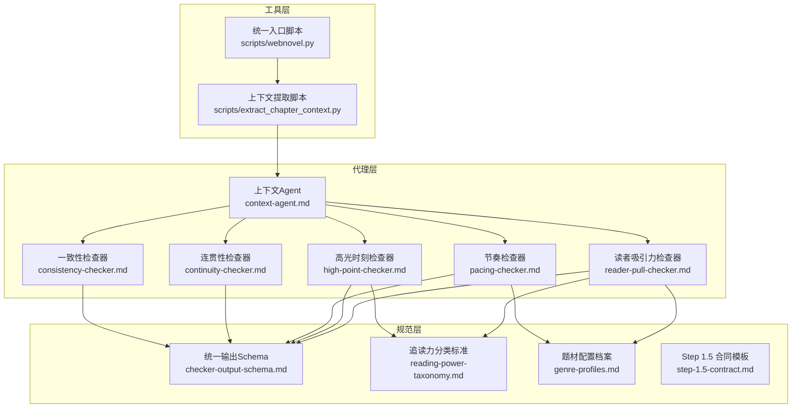
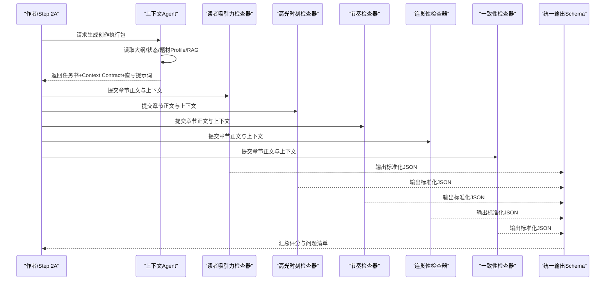
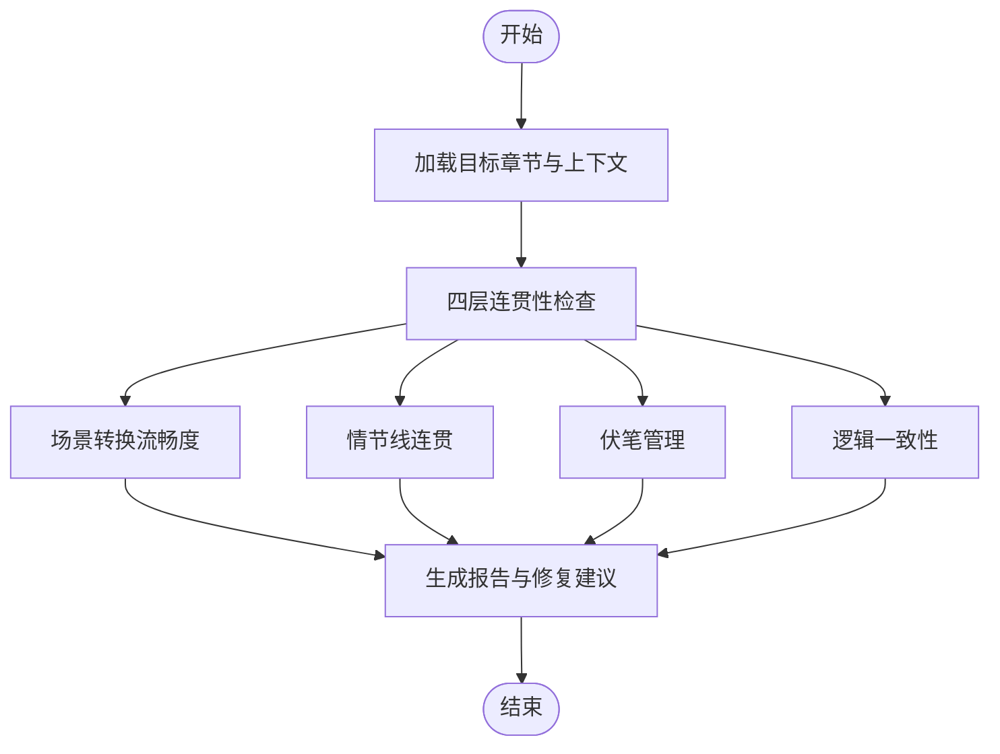
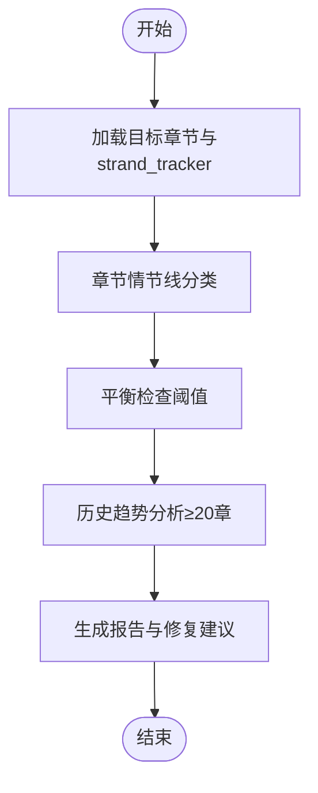
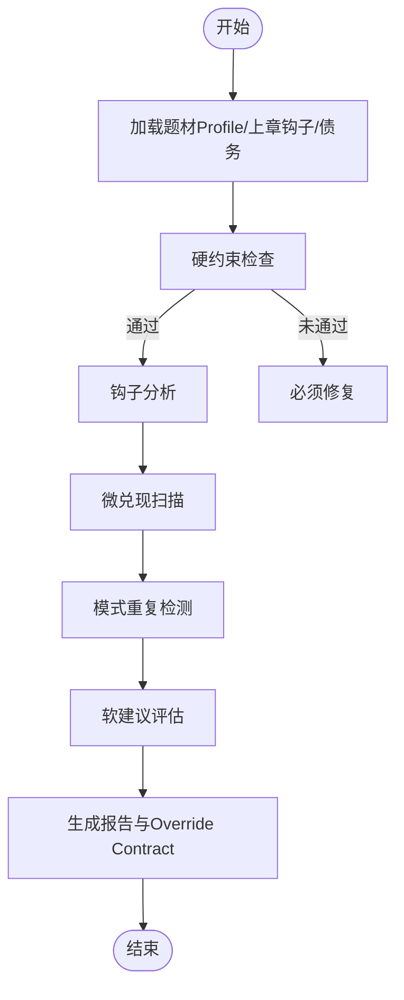
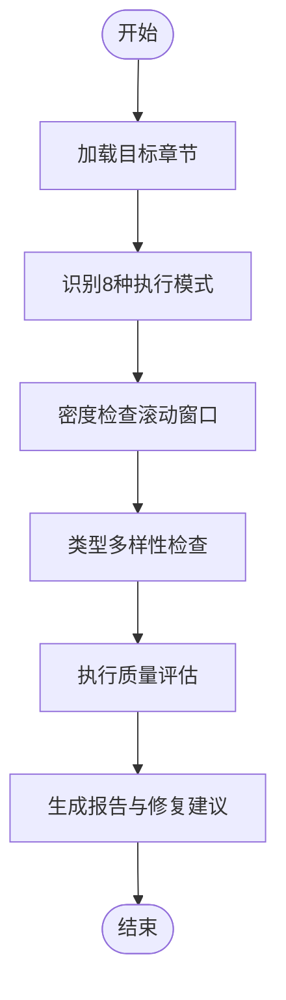
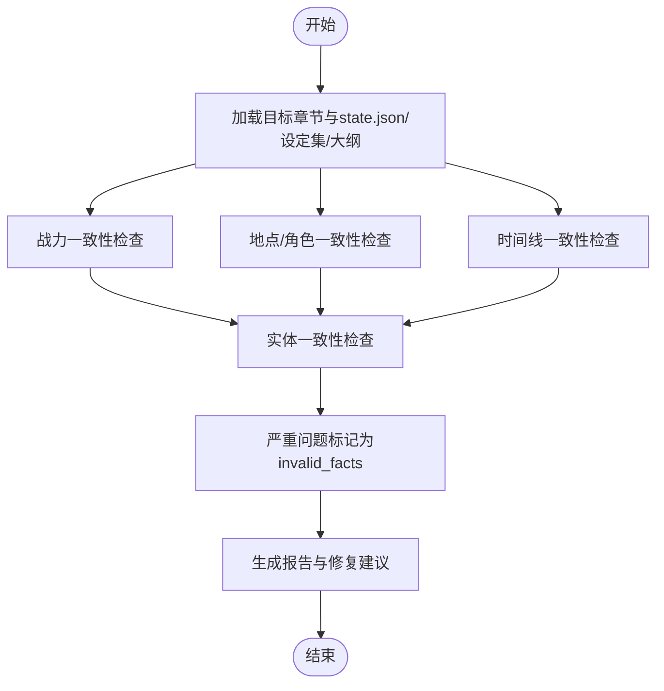
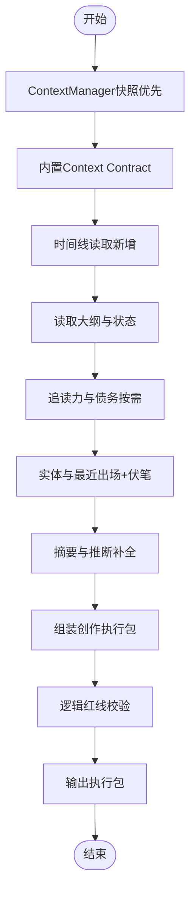
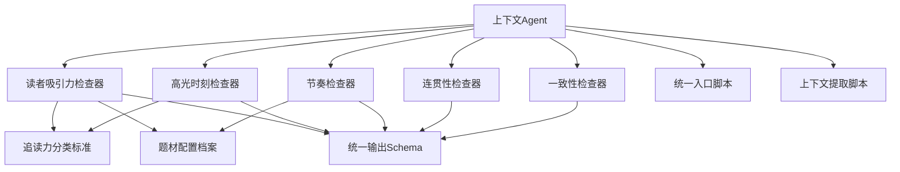

# AI代理机制

<cite>
**本文引用的文件**
- [consistency-checker.md](file://webnovel-writer/agents/consistency-checker.md)
- [pacing-checker.md](file://webnovel-writer/agents/pacing-checker.md)
- [reader-pull-checker.md](file://webnovel-writer/agents/reader-pull-checker.md)
- [high-point-checker.md](file://webnovel-writer/agents/high-point-checker.md)
- [continuity-checker.md](file://webnovel-writer/agents/continuity-checker.md)
- [context-agent.md](file://webnovel-writer/agents/context-agent.md)
- [checker-output-schema.md](file://webnovel-writer/references/checker-output-schema.md)
- [reading-power-taxonomy.md](file://webnovel-writer/references/reading-power-taxonomy.md)
- [genre-profiles.md](file://webnovel-writer/references/genre-profiles.md)
- [step-1.5-contract.md](file://webnovel-writer/skills/webnovel-write/references/step-1.5-contract.md)
- [webnovel.py](file://webnovel-writer/scripts/webnovel.py)
- [extract_chapter_context.py](file://webnovel-writer/scripts/extract_chapter_context.py)
</cite>

## 目录
1. [引言](#引言)
2. [项目结构](#项目结构)
3. [核心组件](#核心组件)
4. [架构总览](#架构总览)
5. [详细组件分析](#详细组件分析)
6. [依赖分析](#依赖分析)
7. [性能考虑](#性能考虑)
8. [故障排查指南](#故障排查指南)
9. [结论](#结论)
10. [附录](#附录)

## 引言
本文件系统化梳理并深入解析该项目的AI代理机制，围绕多代理协作架构、代理间通信协议、任务分配与协调机制展开。文档聚焦以下代理：连贯性检查器、节奏控制器、读者吸引力检查器、高光时刻检查器、持续性检查器，并结合统一输出Schema、追读力分类标准、题材配置档案等参考规范，阐述各代理的职责边界、证据收集方法、质量评估标准、配置参数、性能调优与故障处理策略。同时提供可视化流程图与时序图，帮助读者快速把握整体工作流。

## 项目结构
项目采用“代理文件 + 参考规范 + 脚本工具”的分层组织方式：
- 代理层：各Agent以Markdown形式定义职责、输入输出、执行流程与成功标准
- 规范层：统一输出Schema、追读力分类、题材Profile等，确保跨Agent一致性
- 工具层：CLI脚本与上下文提取脚本，支撑代理的输入准备与数据访问

图表来源
- [context-agent.md:1-269](file://webnovel-writer/agents/context-agent.md#L1-L269)
- [reader-pull-checker.md:1-318](file://webnovel-writer/agents/reader-pull-checker.md#L1-L318)
- [high-point-checker.md:1-218](file://webnovel-writer/agents/high-point-checker.md#L1-L218)
- [pacing-checker.md:1-216](file://webnovel-writer/agents/pacing-checker.md#L1-L216)
- [continuity-checker.md:1-251](file://webnovel-writer/agents/continuity-checker.md#L1-L251)
- [consistency-checker.md:1-229](file://webnovel-writer/agents/consistency-checker.md#L1-L229)
- [checker-output-schema.md:1-169](file://webnovel-writer/references/checker-output-schema.md#L1-L169)
- [reading-power-taxonomy.md:1-360](file://webnovel-writer/references/reading-power-taxonomy.md#L1-L360)
- [genre-profiles.md:1-692](file://webnovel-writer/references/genre-profiles.md#L1-L692)
- [step-1.5-contract.md:1-50](file://webnovel-writer/skills/webnovel-write/references/step-1.5-contract.md#L1-L50)
- [webnovel.py:1-37](file://webnovel-writer/scripts/webnovel.py#L1-L37)
- [extract_chapter_context.py:1-537](file://webnovel-writer/scripts/extract_chapter_context.py#L1-L537)

章节来源
- [context-agent.md:1-269](file://webnovel-writer/agents/context-agent.md#L1-L269)
- [checker-output-schema.md:1-169](file://webnovel-writer/references/checker-output-schema.md#L1-L169)

## 核心组件
- 连贯性检查器：确保场景过渡、情节线、伏笔与逻辑的一致性与流畅性，输出结构化报告并给出修复建议。
- 节奏检查器：基于Strand Weave模型进行情节线平衡检查，识别Quest过载、Fire干旱、Constellation缺席等风险。
- 读者吸引力检查器：评估钩子、微兑现、模式重复等，执行硬约束与软建议分层，支持Override Contract与债务管理。
- 高光时刻检查器：识别并评估“爽点”执行质量，关注密度、类型多样性和结构合理性。
- 一致性检查器：校验战力、地点/角色、时间线与新增实体的一致性，标记无效事实并输出修复建议。
- 上下文Agent：生成创作执行包（含任务书、Context Contract、直写提示词），确保Step 2A可直接开写。

章节来源
- [continuity-checker.md:1-251](file://webnovel-writer/agents/continuity-checker.md#L1-L251)
- [pacing-checker.md:1-216](file://webnovel-writer/agents/pacing-checker.md#L1-L216)
- [reader-pull-checker.md:1-318](file://webnovel-writer/agents/reader-pull-checker.md#L1-L318)
- [high-point-checker.md:1-218](file://webnovel-writer/agents/high-point-checker.md#L1-L218)
- [consistency-checker.md:1-229](file://webnovel-writer/agents/consistency-checker.md#L1-L229)
- [context-agent.md:1-269](file://webnovel-writer/agents/context-agent.md#L1-L269)

## 架构总览
多代理协作以“上下文Agent产出执行包，各检查Agent并行审阅，统一输出Schema汇总”的方式运行。上下文Agent负责整合大纲、状态、题材Profile、RAG检索与最近模式，形成可直接驱动创作的“合同式”上下文；随后由各检查Agent依据自身领域知识进行专业化审查，最终由汇总层输出统一的评分与问题清单。

图表来源
- [context-agent.md:101-269](file://webnovel-writer/agents/context-agent.md#L101-L269)
- [reader-pull-checker.md:216-318](file://webnovel-writer/agents/reader-pull-checker.md#L216-L318)
- [high-point-checker.md:138-218](file://webnovel-writer/agents/high-point-checker.md#L138-L218)
- [pacing-checker.md:143-216](file://webnovel-writer/agents/pacing-checker.md#L143-L216)
- [continuity-checker.md:172-251](file://webnovel-writer/agents/continuity-checker.md#L172-L251)
- [consistency-checker.md:146-229](file://webnovel-writer/agents/consistency-checker.md#L146-L229)
- [checker-output-schema.md:10-169](file://webnovel-writer/references/checker-output-schema.md#L10-L169)

## 详细组件分析

### 连贯性检查器（continuity-checker）
- 职责：确保场景过渡、情节线、伏笔与逻辑的一致性与流畅性，输出结构化报告并给出修复建议。
- 执行流程要点：
  - 并行读取目标章节、前2-3章、大纲与state.json中的情节线追踪器
  - 四层检查：场景转换流畅度、情节线连贯、伏笔管理、逻辑一致性
  - 大纲一致性检查与拖沓识别
- 证据收集与质量评估：
  - 场景转换评级（A/B/C/F）
  - 活跃/休眠/遗忘情节线追踪
  - 伏笔设置-回收周期与风险等级
  - 逻辑漏洞与前后矛盾识别
- 成功标准：
  - 场景转换≥B；无活跃情节线遗忘超过15章；长期伏笔已追踪；0个重大逻辑漏洞；大纲偏差已正确标记

图表来源
- [continuity-checker.md:20-251](file://webnovel-writer/agents/continuity-checker.md#L20-L251)

章节来源
- [continuity-checker.md:1-251](file://webnovel-writer/agents/continuity-checker.md#L1-L251)

### 节奏检查器（pacing-checker）
- 职责：执行Strand Weave平衡检查，防止读者疲劳。
- 执行流程要点：
  - 并行读取目标章节、strand_tracker历史与大纲
  - 章节情节线分类（Quest/Fire/Constellation）
  - 平衡检查（Quest过载、Fire干旱、Constellation缺席）
  - 历史趋势分析（≥20章）
- 证据收集与质量评估：
  - 最近出现章数与连续章数
  - 理想分布与阈值（Quest 55-65%，Fire 20-30%，Constellation 10-20%）
  - 趋势分析与“均衡/偏重/不足”结论
- 成功标准：
  - 最近10章单一情节线不超过70%；所有情节线在阈值内至少出现一次；提供下一章建议；趋势均衡

图表来源
- [pacing-checker.md:20-216](file://webnovel-writer/agents/pacing-checker.md#L20-L216)

章节来源
- [pacing-checker.md:1-216](file://webnovel-writer/agents/pacing-checker.md#L1-L216)

### 读者吸引力检查器（reader-pull-checker）
- 职责：审查“读者为什么会点下一章”，执行Hard/Soft约束分层。
- 执行流程要点：
  - 加载题材Profile、上章钩子与模式、当前债务状态
  - 硬约束检查（可读性底线、承诺违背、节奏灾难、冲突真空）
  - 钩子分析（类型、强度、有效性）、微兑现扫描、模式重复检测
  - 软建议评估与Override Contract机制
- 证据收集与质量评估：
  - 钩子类型与强度（危机/悬念/情绪/选择/渴望）
  - 微兑现类型（信息/关系/能力/资源/认可/情绪/线索）
  - 模式重复风险（连续2/3/4+章）
  - 债务与利息累积
- 成功标准：
  - 无硬约束违规；软评分≥70（或有有效Override）；存在可感知的未闭合问题/期待锚点；微兑现达标；无连续3章以上同型；输出清晰的“下章动机”

图表来源
- [reader-pull-checker.md:216-318](file://webnovel-writer/agents/reader-pull-checker.md#L216-L318)
- [reading-power-taxonomy.md:1-360](file://webnovel-writer/references/reading-power-taxonomy.md#L1-L360)
- [genre-profiles.md:1-692](file://webnovel-writer/references/genre-profiles.md#L1-L692)

章节来源
- [reader-pull-checker.md:1-318](file://webnovel-writer/agents/reader-pull-checker.md#L1-L318)

### 高光时刻检查器（high-point-checker）
- 职责：评估“爽点”密度、类型覆盖与执行质量。
- 执行流程要点：
  - 识别8种标准执行模式（装逼打脸、扮猪吃虎、越级反杀、打脸权威、反派翻车、甜蜜超预期、迪化误解、身份掉马）
  - 密度检查（滚动窗口）、类型多样性检查、执行质量评估（铺垫、反转、情绪回报、30/40/30结构、压扬比例）
- 证据收集与质量评估：
  - 爽点密度与类型分布
  - 质量评级（A/B/C/F）
  - 单一类型不得超过80%的风险
- 成功标准：
  - 滚动窗口密度健康；类型分布多样化；平均质量评级≥B；结构合理；无连续5章同类型

图表来源
- [high-point-checker.md:25-218](file://webnovel-writer/agents/high-point-checker.md#L25-L218)
- [reading-power-taxonomy.md:155-240](file://webnovel-writer/references/reading-power-taxonomy.md#L155-L240)

章节来源
- [high-point-checker.md:1-218](file://webnovel-writer/agents/high-point-checker.md#L1-L218)

### 一致性检查器（consistency-checker）
- 职责：执行“设定即物理”的第二防幻觉定律，校验战力、地点/角色、时间线与新增实体一致性。
- 执行流程要点：
  - 并行读取目标章节、state.json、设定集、大纲
  - 三层一致性检查：战力一致性、地点/角色一致性、时间线一致性
  - 实体一致性检查与新增实体评估
  - 严重问题自动标记为invalid_facts（待确认）
- 证据收集与质量评估：
  - 战力冲突、地点错误、时间线问题分级（critical/high/medium/low）
  - 新增实体与世界观一致性
- 成功标准：
  - 0个严重违规；0个高优先级时间线问题；所有新实体与现有世界观一致；报告提供具体修复建议

图表来源
- [consistency-checker.md:20-229](file://webnovel-writer/agents/consistency-checker.md#L20-L229)

章节来源
- [consistency-checker.md:1-229](file://webnovel-writer/agents/consistency-checker.md#L1-L229)

### 上下文Agent（context-agent）
- 职责：生成创作执行包，确保Step 2A可直接开写。
- 执行流程要点：
  - 读取优先级与默认值（上章钩子、最近3章模式、角色动机、题材Profile、当前债务）
  - ContextManager快照优先、内置Context Contract、时间线读取（新增）
  - 大纲与状态、追读力与债务、实体与最近出场+伏笔、摘要与推断补全
  - 逻辑红线校验（大纲关键事件、设定规则、时空跳跃、能力/信息因果、角色动机、合同与任务书冲突、时间逻辑）
- 成功标准：
  - 创作执行包可直接驱动Step 2A；任务书包含8个板块（含时间约束）；逻辑红线fail=0；时间约束完整且时间逻辑红线通过

图表来源
- [context-agent.md:101-269](file://webnovel-writer/agents/context-agent.md#L101-L269)

章节来源
- [context-agent.md:1-269](file://webnovel-writer/agents/context-agent.md#L1-L269)

## 依赖分析
- 组件耦合与协作：
  - 上下文Agent为其他Agent提供统一输入（大纲、状态、题材Profile、RAG检索、最近模式）
  - 各检查Agent共享统一输出Schema，便于汇总与趋势分析
  - 读者吸引力检查器与高光时刻检查器依赖追读力分类标准与题材Profile
  - 节奏检查器依赖Strand Weave阈值与历史数据
  - 一致性检查器依赖设定集与state.json中的实体/关系/状态变化
- 外部依赖与集成点：
  - CLI脚本统一入口，封装sys.path与转发调用
  - 上下文提取脚本负责从项目中抽取大纲片段、摘要、状态与RAG检索结果
  - 数据模块（index.db）提供章节追读力元数据、Override Contract与债务管理

图表来源
- [context-agent.md:101-269](file://webnovel-writer/agents/context-agent.md#L101-L269)
- [reader-pull-checker.md:216-318](file://webnovel-writer/agents/reader-pull-checker.md#L216-L318)
- [high-point-checker.md:138-218](file://webnovel-writer/agents/high-point-checker.md#L138-L218)
- [pacing-checker.md:143-216](file://webnovel-writer/agents/pacing-checker.md#L143-L216)
- [checker-output-schema.md:10-169](file://webnovel-writer/references/checker-output-schema.md#L10-L169)
- [reading-power-taxonomy.md:1-360](file://webnovel-writer/references/reading-power-taxonomy.md#L1-L360)
- [genre-profiles.md:1-692](file://webnovel-writer/references/genre-profiles.md#L1-L692)
- [webnovel.py:1-37](file://webnovel-writer/scripts/webnovel.py#L1-L37)
- [extract_chapter_context.py:1-537](file://webnovel-writer/scripts/extract_chapter_context.py#L1-L537)

章节来源
- [webnovel.py:1-37](file://webnovel-writer/scripts/webnovel.py#L1-L37)
- [extract_chapter_context.py:1-537](file://webnovel-writer/scripts/extract_chapter_context.py#L1-L537)

## 性能考虑
- 并行读取与I/O优化：
  - 各Agent在执行初期采用并行读取目标章节、state.json、设定集与大纲，减少等待时间
  - 上下文Agent优先使用ContextManager快照，避免重复计算
- 检索与RAG辅助：
  - 上下文提取脚本按需触发RAG检索，仅在大纲包含特定关键词时启用，降低向量数据库查询成本
  - RAG搜索失败时自动回退至BM25策略，保证稳定性
- 数据库与索引：
  - 通过index.db获取章节追读力元数据、Override Contract与债务，避免重复扫描全文
- 内存与缓存：
  - 任务书与Context Contract在内存中组装，避免频繁磁盘IO
  - 上下文快照可复用，减少重复构建成本

## 故障排查指南
- 上下文Agent常见问题：
  - 未设置CLAUDE_PLUGIN_ROOT或缺少scripts目录：统一入口脚本会报错并退出
  - 项目根解析失败：使用where命令确认解析结果
  - ContextManager快照缺失：自动回退到重建流程
- 读者吸引力检查器：
  - 硬约束违规（可读性底线、承诺违背、节奏灾难、冲突真空）必须修复后方可继续
  - Override Contract需提供合理理由与偿还计划，否则债务将持续累积
- 高光时刻检查器：
  - 连续低密度章节需预警；单一类型超过80%存在单调风险
  - 迪化误解与身份掉马需具备合理铺垫，避免配角智商下线或逻辑矛盾
- 节奏检查器：
  - Quest过载（连续5+章）与Fire干旱（>10章）需在下一章安排相应情节线
  - 历史趋势分析需≥20章数据，否则仅提供当前状态评估
- 连贯性检查器：
  - 场景转换F级不可接受；长期伏笔（10+章）需定期提及或回收
  - 大纲偏差需正确标记，重大偏差必须说明原因
- 一致性检查器：
  - 严重级别问题自动标记为invalid_facts（待确认），需人工复核
  - 新增实体与世界观冲突需确认是否为新设定或笔误

章节来源
- [context-agent.md:103-118](file://webnovel-writer/agents/context-agent.md#L103-L118)
- [reader-pull-checker.md:290-318](file://webnovel-writer/agents/reader-pull-checker.md#L290-L318)
- [high-point-checker.md:181-197](file://webnovel-writer/agents/high-point-checker.md#L181-L197)
- [pacing-checker.md:204-216](file://webnovel-writer/agents/pacing-checker.md#L204-L216)
- [continuity-checker.md:236-251](file://webnovel-writer/agents/continuity-checker.md#L236-L251)
- [consistency-checker.md:214-229](file://webnovel-writer/agents/consistency-checker.md#L214-L229)

## 结论
该AI代理机制通过“上下文Agent + 多专业检查Agent + 统一输出Schema”的架构，实现了从创作上下文生成到多维度质量审查的闭环。各Agent职责清晰、证据收集严谨、评估标准可量化，配合Override Contract与债务管理，既保证创作效率，又确保作品质量与一致性。建议在实际使用中：
- 严格遵循上下文Agent的逻辑红线校验
- 按题材Profile调整检查阈值与建议权重
- 重视Override Contract的合理性与偿还计划
- 定期回顾与优化各Agent的执行流程与性能

## 附录
- 统一输出Schema字段说明与扩展约定
- 追读力分类标准与题材Profile的关键参数
- Step 1.5合同模板的必填结构与差异化检查规则

章节来源
- [checker-output-schema.md:10-169](file://webnovel-writer/references/checker-output-schema.md#L10-L169)
- [reading-power-taxonomy.md:1-360](file://webnovel-writer/references/reading-power-taxonomy.md#L1-L360)
- [genre-profiles.md:1-692](file://webnovel-writer/references/genre-profiles.md#L1-L692)
- [step-1.5-contract.md:1-50](file://webnovel-writer/skills/webnovel-write/references/step-1.5-contract.md#L1-L50)