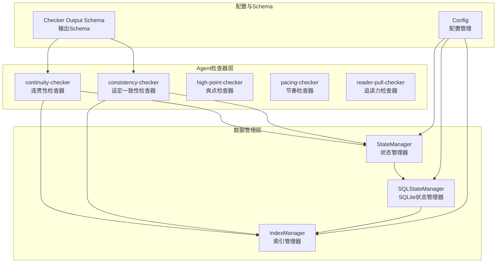
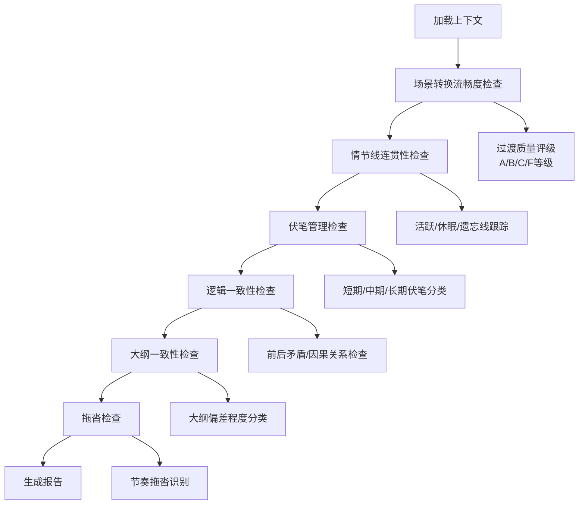
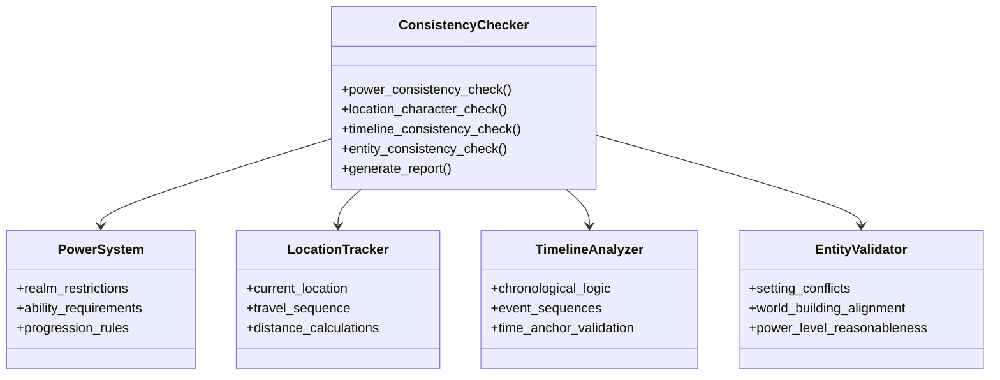
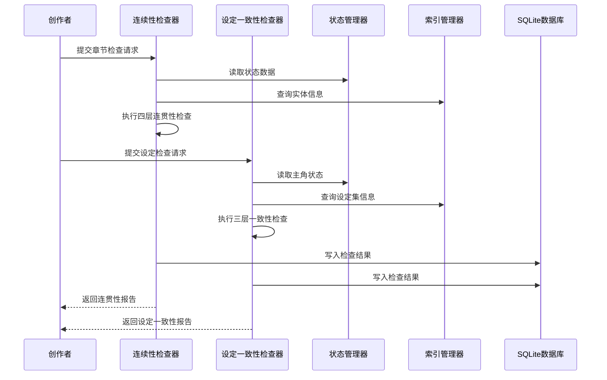
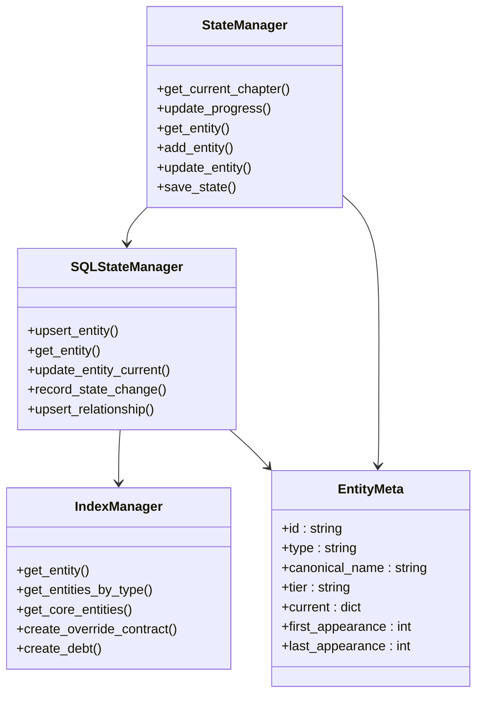
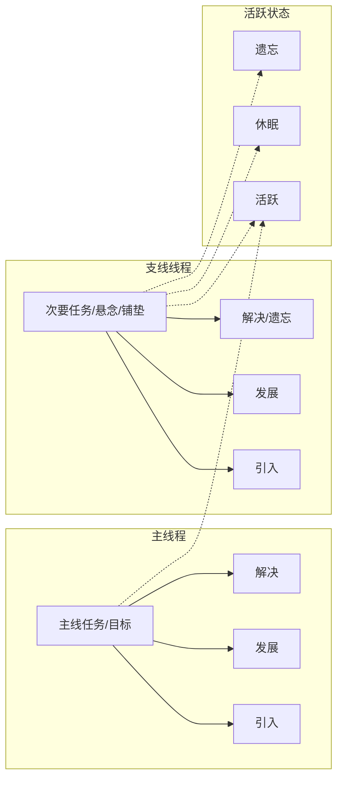
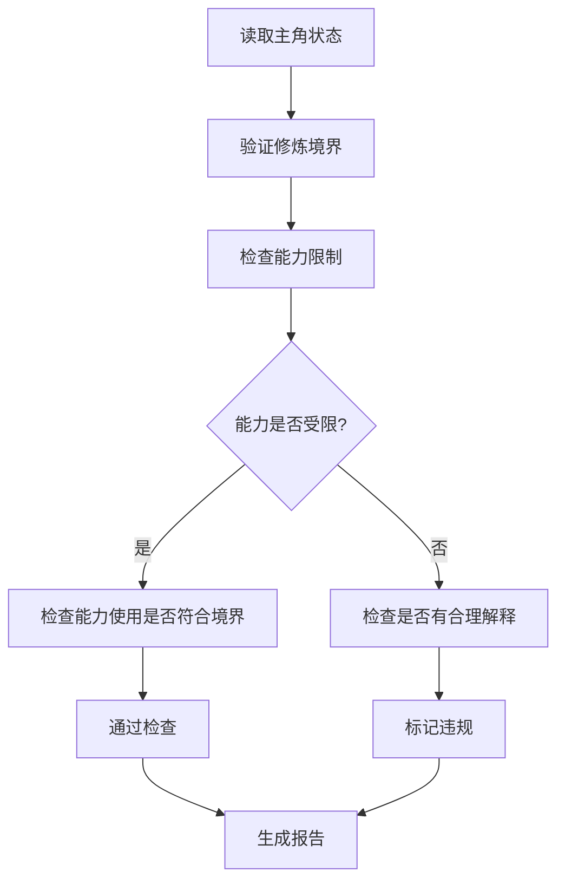
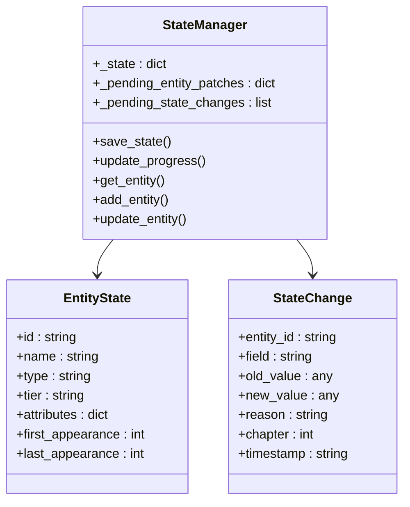
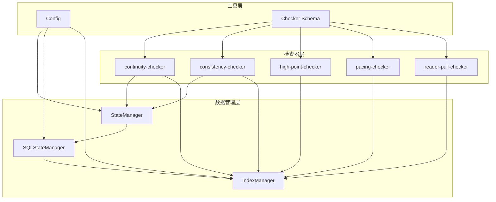

# 持续性检查器

<cite>
**本文档引用的文件**
- [continuity-checker.md](file://webnovel-writer/agents/continuity-checker.md)
- [consistency-checker.md](file://webnovel-writer/agents/consistency-checker.md)
- [checker-output-schema.md](file://webnovel-writer/references/checker-output-schema.md)
- [state_manager.py](file://webnovel-writer/scripts/data_modules/state_manager.py)
- [sql_state_manager.py](file://webnovel-writer/scripts/data_modules/sql_state_manager.py)
- [index_manager.py](file://webnovel-writer/scripts/data_modules/index_manager.py)
- [index_entity_mixin.py](file://webnovel-writer/scripts/data_modules/index_entity_mixin.py)
- [index_debt_mixin.py](file://webnovel-writer/scripts/data_modules/index_debt_mixin.py)
- [config.py](file://webnovel-writer/scripts/data_modules/config.py)
- [pacing-checker.md](file://webnovel-writer/agents/pacing-checker.md)
- [high-point-checker.md](file://webnovel-writer/agents/high-point-checker.md)
- [reader-pull-checker.md](file://webnovel-writer/agents/reader-pull-checker.md)
</cite>

## 目录
1. [简介](#简介)
2. [项目结构](#项目结构)
3. [核心组件](#核心组件)
4. [架构概览](#架构概览)
5. [详细组件分析](#详细组件分析)
6. [依赖关系分析](#依赖关系分析)
7. [性能考虑](#性能考虑)
8. [故障排除指南](#故障排除指南)
9. [结论](#结论)
10. [附录](#附录)

## 简介

持续性检查器是Webnovel Writer项目中的核心质量保证组件，负责维护小说创作过程中的叙事连贯性和逻辑一致性。该系统通过多层次的检查机制，确保故事在人物弧线、情节线索、背景设定和时间线逻辑等关键维度上保持统一和合理。

系统采用Agent架构设计，结合状态管理系统和数据库索引机制，为创作者提供全面的连贯性保障。检查器不仅能够识别潜在的问题，还能提供具体的修复建议和改进方案。

## 项目结构

Webnovel Writer项目采用模块化架构，持续性检查器作为其中的重要组成部分，与其他质量检查组件协同工作：

**图表来源**
- [continuity-checker.md:1-251](file://webnovel-writer/agents/continuity-checker.md#L1-L251)
- [consistency-checker.md:1-229](file://webnovel-writer/agents/consistency-checker.md#L1-L229)
- [state_manager.py:1-800](file://webnovel-writer/scripts/data_modules/state_manager.py#L1-L800)
- [sql_state_manager.py:1-200](file://webnovel-writer/scripts/data_modules/sql_state_manager.py#L1-L200)

**章节来源**
- [continuity-checker.md:1-251](file://webnovel-writer/agents/continuity-checker.md#L1-L251)
- [consistency-checker.md:1-229](file://webnovel-writer/agents/consistency-checker.md#L1-L229)
- [checker-output-schema.md:1-169](file://webnovel-writer/references/checker-output-schema.md#L1-L169)

## 核心组件

### 连续性检查器（Continuity Checker）

连续性检查器专注于维护故事的叙事连贯性，通过四个层次的检查确保故事质量：

#### 四层检查机制

**图表来源**
- [continuity-checker.md:42-171](file://webnovel-writer/agents/continuity-checker.md#L42-L171)

#### 关键检查维度

1. **场景转换流畅度**：评估章节间的过渡自然性
2. **情节线连贯性**：跟踪主线和支线的发展轨迹
3. **伏笔管理**：识别和追踪故事中的伏笔回收
4. **逻辑一致性**：检查故事内在的逻辑合理性

### 设定一致性检查器（Consistency Checker）

设定一致性检查器确保故事世界的内在统一性：

#### 三层一致性检查

**图表来源**
- [consistency-checker.md:42-131](file://webnovel-writer/agents/consistency-checker.md#L42-L131)

**章节来源**
- [continuity-checker.md:42-251](file://webnovel-writer/agents/continuity-checker.md#L42-L251)
- [consistency-checker.md:42-229](file://webnovel-writer/agents/consistency-checker.md#L42-L229)

## 架构概览

### 数据流架构

**图表来源**
- [state_manager.py:208-370](file://webnovel-writer/scripts/data_modules/state_manager.py#L208-L370)
- [index_manager.py:1-200](file://webnovel-writer/scripts/data_modules/index_manager.py#L1-L200)

### 状态管理架构

**图表来源**
- [state_manager.py:90-800](file://webnovel-writer/scripts/data_modules/state_manager.py#L90-L800)
- [sql_state_manager.py:46-200](file://webnovel-writer/scripts/data_modules/sql_state_manager.py#L46-L200)
- [index_manager.py:80-200](file://webnovel-writer/scripts/data_modules/index_manager.py#L80-L200)

**章节来源**
- [state_manager.py:1-800](file://webnovel-writer/scripts/data_modules/state_manager.py#L1-L800)
- [sql_state_manager.py:1-200](file://webnovel-writer/scripts/data_modules/sql_state_manager.py#L1-L200)
- [index_manager.py:1-200](file://webnovel-writer/scripts/data_modules/index_manager.py#L1-L200)

## 详细组件分析

### 连续性检查器详细分析

#### 场景转换流畅度检查

场景转换检查关注章节间的自然过渡，通过以下标准评估：

| 评级 | 标准 | 示例 |
|------|------|------|
| A级 | 自然过渡 + 时间/空间标记清晰 | "三日后，林天抵达血煞秘境入口" |
| B级 | 有过渡但略显生硬 | 需要读者稍作联想 |
| C级 | 缺少过渡，靠读者推测 | 直接跳跃到不同场景 |
| F级 | 完全断裂，逻辑跳跃 | 无任何过渡说明 |

#### 情节线连贯性检查

系统跟踪三种类型的情节线：

**图表来源**
- [continuity-checker.md:65-88](file://webnovel-writer/agents/continuity-checker.md#L65-L88)

#### 伏笔管理系统

伏笔按照持续时间分为三个类别：

| 伏笔类型 | 时间跨度 | 风险等级 | 管理要求 |
|----------|----------|----------|----------|
| 短期 | 1-3章 | 低风险 | 及时回收 |
| 中期 | 4-10章 | 中等风险 | 定期提醒 |
| 长期 | 10+章 | 高风险 | 明确标记 |

#### 逻辑一致性检查

逻辑检查识别以下类型的矛盾：

1. **前后矛盾**：同一角色在不同章节的言行不一致
2. **因果关系缺失**：事件发生缺乏合理解释
3. **时间逻辑错误**：事件发生的顺序不合理

**章节来源**
- [continuity-checker.md:42-251](file://webnovel-writer/agents/continuity-checker.md#L42-L251)

### 设定一致性检查器详细分析

#### 战力一致性检查

战力检查确保角色的能力与其修炼境界相符：

**图表来源**
- [consistency-checker.md:44-61](file://webnovel-writer/agents/consistency-checker.md#L44-L61)

#### 地点/角色一致性检查

检查角色出现的地点是否合理，以及角色属性的一致性：

| 检查类型 | 检查内容 | 违规示例 |
|----------|----------|----------|
| 地点检查 | 当前地点与旅行序列是否匹配 | 从天云宗瞬间到达血煞秘境 |
| 角色检查 | 角色属性与记录是否一致 | 修为倒退无解释 |
| 旅行检查 | 移动距离与时间是否合理 | 跨越数百里却无移动描写 |

#### 时间线一致性检查

时间线检查采用分级制度：

| 严重程度 | 问题类型 | 处理要求 |
|----------|----------|----------|
| critical | 倒计时算术错误 | 必须修复 |
| high | 事件先后矛盾 | 优先修复 |
| medium | 时间锚点缺失 | 建议修复 |
| low | 轻微时间模糊 | 可选修复 |

**章节来源**
- [consistency-checker.md:88-229](file://webnovel-writer/agents/consistency-checker.md#L88-L229)

### 数据管理组件分析

#### 状态管理器

状态管理器负责管理项目的核心状态信息：

**图表来源**
- [state_manager.py:43-76](file://webnovel-writer/scripts/data_modules/state_manager.py#L43-L76)

#### 实体管理机制

实体管理支持多种类型，并提供完整的生命周期管理：

| 实体类型 | 描述 | 管理功能 |
|----------|------|----------|
| 角色 | 故事中的角色 | 属性管理、关系追踪 |
| 地点 | 故事发生的地点 | 出场记录、状态变更 |
| 物品 | 故事中的物品 | 所有权转移、状态变化 |
| 势力 | 故事中的组织 | 关系网络、影响力变化 |
| 招式 | 角色使用的技能 | 学习进度、使用限制 |

**章节来源**
- [state_manager.py:43-800](file://webnovel-writer/scripts/data_modules/state_manager.py#L43-L800)
- [index_entity_mixin.py:20-200](file://webnovel-writer/scripts/data_modules/index_entity_mixin.py#L20-L200)

## 依赖关系分析

### 组件耦合度分析

**图表来源**
- [checker-output-schema.md:10-32](file://webnovel-writer/references/checker-output-schema.md#L10-L32)

### 外部依赖

系统对外部依赖主要包括：

1. **SQLite数据库**：用于存储大量实体和关系数据
2. **配置管理**：通过环境变量和配置文件管理
3. **文件系统**：章节文件和项目数据的存储
4. **API服务**：嵌入和重排序服务（可选）

**章节来源**
- [config.py:90-349](file://webnovel-writer/scripts/data_modules/config.py#L90-L349)

## 性能考虑

### 数据库性能优化

系统采用SQLite进行大规模数据存储，通过以下机制优化性能：

1. **增量写入**：使用待处理队列减少磁盘I/O
2. **原子操作**：确保数据一致性的同时提高效率
3. **索引优化**：为常用查询字段建立索引
4. **连接池管理**：复用数据库连接减少开销

### 内存管理

状态管理器采用内存优先的设计：

1. **懒加载**：只在需要时加载数据
2. **缓存机制**：热点数据缓存减少查询次数
3. **批量操作**：支持批量数据处理
4. **垃圾回收**：及时清理不再使用的数据

## 故障排除指南

### 常见问题诊断

#### 连续性检查问题

| 问题类型 | 症状 | 解决方案 |
|----------|------|----------|
| 场景转换断裂 | 章节间跳跃明显 | 添加过渡描述或时间标记 |
| 情节线遗忘 | 线索长时间未提及 | 建议在后续章节中提及或回收 |
| 伏笔未回收 | 长期未提及的伏笔 | 制定回收计划或删除伏笔 |
| 逻辑矛盾 | 前后不一致的描述 | 统一描述或修改前后文 |

#### 设定一致性问题

| 问题类型 | 症状 | 解决方案 |
|----------|------|----------|
| 战力冲突 | 能力使用超出境界限制 | 修改能力描述或调整境界 |
| 地点错误 | 角色出现在不合理地点 | 添加移动描述或调整设定 |
| 时间线错误 | 事件顺序不合理 | 重新安排事件顺序或添加过渡 |
| 实体冲突 | 新实体与现有设定矛盾 | 调整设定或重新设计实体 |

### 调试工具

系统提供了多种调试和监控工具：

1. **状态检查**：验证状态文件的完整性
2. **实体查询**：快速定位实体信息
3. **关系分析**：分析实体间的关系网络
4. **性能监控**：监控系统的运行状态

**章节来源**
- [continuity-checker.md:236-251](file://webnovel-writer/agents/continuity-checker.md#L236-L251)
- [consistency-checker.md:214-229](file://webnovel-writer/agents/consistency-checker.md#L214-L229)

## 结论

持续性检查器通过多层次的检查机制，为Webnovel Writer项目提供了全面的叙事连贯性保障。系统不仅能够识别潜在的问题，还能提供具体的修复建议和改进方案。

### 主要优势

1. **全面性**：涵盖场景转换、情节线、伏笔管理和逻辑一致性等多个维度
2. **智能化**：基于状态管理和实体追踪，提供准确的分析结果
3. **可操作性**：提供具体的修复建议和改进方案
4. **可扩展性**：模块化设计支持功能扩展和定制

### 发展方向

1. **AI辅助分析**：利用机器学习技术提高检查精度
2. **实时监控**：实现实时的连贯性监控和预警
3. **个性化配置**：支持不同题材和风格的定制化检查
4. **集成开发**：与创作工具深度集成，提供无缝体验

## 附录

### 连续性检查清单

#### 场景转换检查清单
- [ ] 是否有适当的过渡描述
- [ ] 时间标记是否清晰明确
- [ ] 空间转换是否合理
- [ ] 读者是否需要过度推理

#### 情节线检查清单
- [ ] 主线是否清晰发展
- [ ] 支线是否有合理铺垫
- [ ] 活跃线程是否得到解决
- [ ] 休眠线程是否有计划

#### 伏笔检查清单
- [ ] 所有伏笔都有合理回收
- [ ] 长期伏笔定期提及
- [ ] 回收是否自然不生硬
- [ ] 伏笔与情节发展相关

#### 逻辑一致性检查清单
- [ ] 人物言行前后一致
- [ ] 事件因果关系合理
- [ ] 时间顺序逻辑正确
- [ ] 设定规则得到遵守

### 修复方案模板

#### 场景转换修复
1. 添加过渡描述句
2. 明确时间标记
3. 描述移动过程
4. 建立场景联系

#### 情节线修复
1. 补充线程发展
2. 添加必要的铺垫
3. 安排合理的解决
4. 建立线程间的联系

#### 伏笔修复
1. 制定回收计划
2. 安排合适的回收时机
3. 确保回收的合理性
4. 建立伏笔与情节的联系

#### 逻辑修复
1. 统一前后描述
2. 补充因果关系
3. 调整事件顺序
4. 修订设定规则