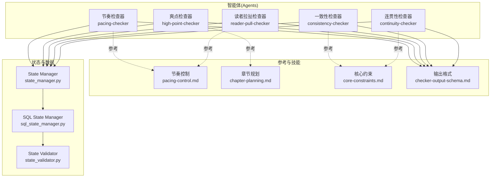
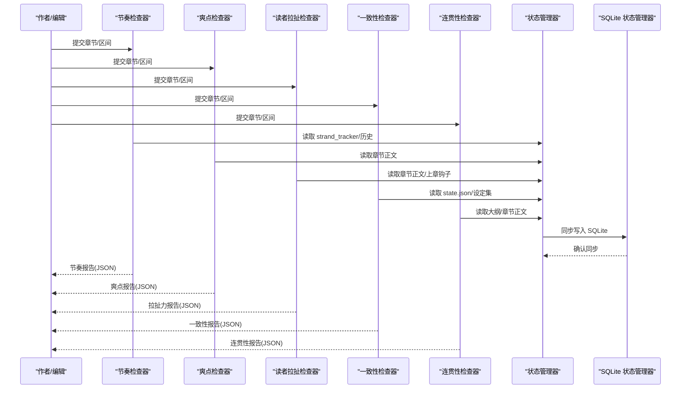
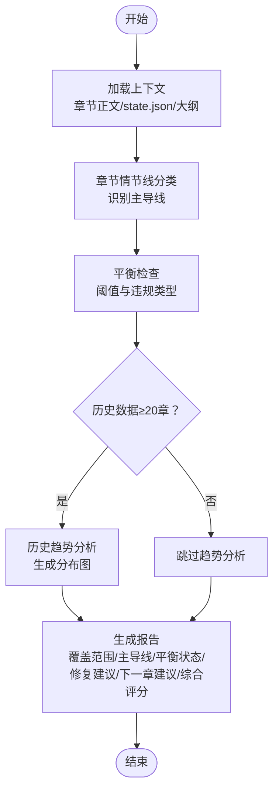
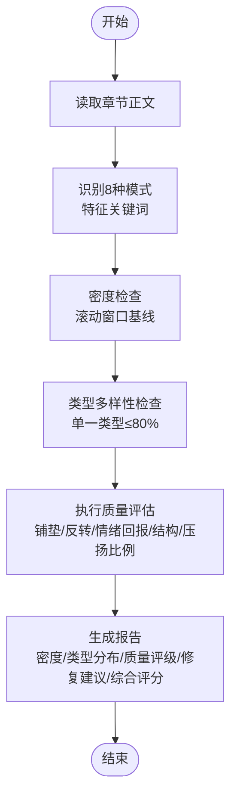
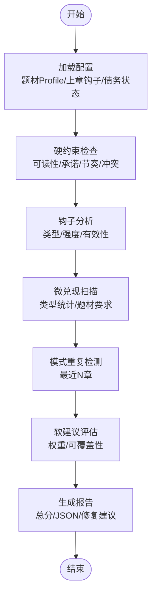
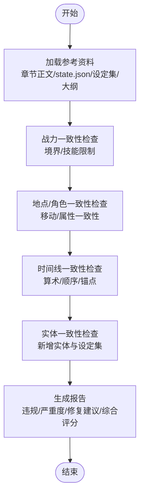
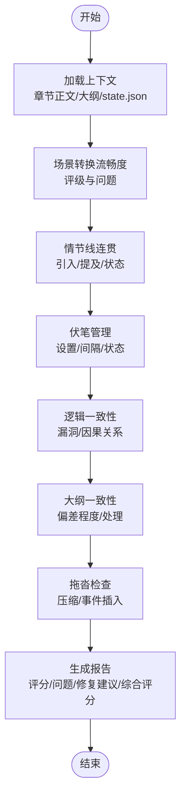
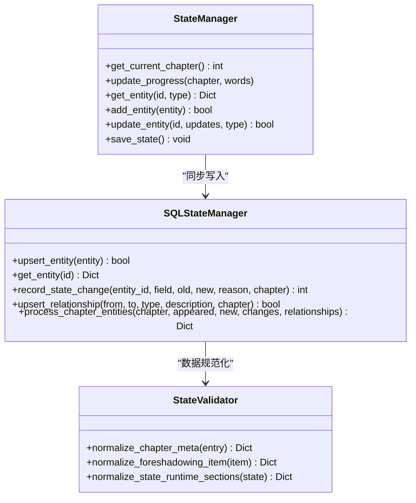
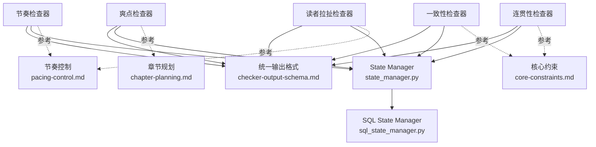

# 节奏控制器

<cite>
**本文引用的文件**
- [pacing-checker.md](file://webnovel-writer/agents/pacing-checker.md)
- [high-point-checker.md](file://webnovel-writer/agents/high-point-checker.md)
- [reader-pull-checker.md](file://webnovel-writer/agents/reader-pull-checker.md)
- [consistency-checker.md](file://webnovel-writer/agents/consistency-checker.md)
- [continuity-checker.md](file://webnovel-writer/agents/continuity-checker.md)
- [pacing-control.md](file://webnovel-writer/skills/webnovel-review/references/pacing-control.md)
- [chapter-planning.md](file://webnovel-writer/skills/webnovel-plan/references/outlining/chapter-planning.md)
- [core-constraints.md](file://webnovel-writer/references/shared/core-constraints.md)
- [checker-output-schema.md](file://webnovel-writer/references/checker-output-schema.md)
- [state_manager.py](file://webnovel-writer/scripts/data_modules/state_manager.py)
- [sql_state_manager.py](file://webnovel-writer/scripts/data_modules/sql_state_manager.py)
- [state_validator.py](file://webnovel-writer/scripts/data_modules/state_validator.py)
</cite>

## 目录
1. [简介](#简介)
2. [项目结构](#项目结构)
3. [核心组件](#核心组件)
4. [架构概览](#架构概览)
5. [详细组件分析](#详细组件分析)
6. [依赖分析](#依赖分析)
7. [性能考虑](#性能考虑)
8. [故障排除指南](#故障排除指南)
9. [结论](#结论)
10. [附录](#附录)

## 简介
本技术文档面向"节奏控制器"系统，旨在为小说写作节奏控制提供完整的理论基础、实践方法与工程实现。系统围绕四大核心指标构建：情节推进速度、冲突密度、情感起伏、信息密度，并结合 Strand Weave 情节线平衡模型、爽点密度检查、读者拉扯力评估与一致性验证，形成从章节到全篇的节奏分析与优化闭环。

系统通过多个专用 Agent（节奏检查器、爽点检查器、读者拉扯检查器、一致性检查器、连贯性检查器）协同工作，配合统一的输出格式与状态管理，实现可量化、可追溯、可优化的节奏控制。

## 项目结构
节奏控制器相关代码分布在以下区域：
- agents：节奏分析与质量检查的智能体（Agent）
- skills：写作技能与参考文档（节奏控制、章节规划、核心约束）
- scripts/data_modules：状态管理与数据持久化（state.json 与 SQLite 同步）
- references：统一输出格式与共享参考

**图表来源**
- [pacing-checker.md:1-216](file://webnovel-writer/agents/pacing-checker.md#L1-L216)
- [high-point-checker.md:1-218](file://webnovel-writer/agents/high-point-checker.md#L1-L218)
- [reader-pull-checker.md:1-318](file://webnovel-writer/agents/reader-pull-checker.md#L1-L318)
- [consistency-checker.md:1-229](file://webnovel-writer/agents/consistency-checker.md#L1-L229)
- [continuity-checker.md:1-251](file://webnovel-writer/agents/continuity-checker.md#L1-L251)
- [pacing-control.md:1-130](file://webnovel-writer/skills/webnovel-review/references/pacing-control.md#L1-L130)
- [chapter-planning.md:1-296](file://webnovel-writer/skills/webnovel-plan/references/outlining/chapter-planning.md#L1-L296)
- [core-constraints.md:1-99](file://webnovel-writer/references/shared/core-constraints.md#L1-L99)
- [checker-output-schema.md:1-169](file://webnovel-writer/references/checker-output-schema.md#L1-L169)
- [state_manager.py:1-800](file://webnovel-writer/scripts/data_modules/state_manager.py#L1-L800)
- [sql_state_manager.py:1-595](file://webnovel-writer/scripts/data_modules/sql_state_manager.py#L1-L595)
- [state_validator.py:1-250](file://webnovel-writer/scripts/data_modules/state_validator.py#L1-L250)

**章节来源**
- [pacing-checker.md:1-216](file://webnovel-writer/agents/pacing-checker.md#L1-L216)
- [high-point-checker.md:1-218](file://webnovel-writer/agents/high-point-checker.md#L1-L218)
- [reader-pull-checker.md:1-318](file://webnovel-writer/agents/reader-pull-checker.md#L1-L318)
- [consistency-checker.md:1-229](file://webnovel-writer/agents/consistency-checker.md#L1-L229)
- [continuity-checker.md:1-251](file://webnovel-writer/agents/continuity-checker.md#L1-L251)
- [pacing-control.md:1-130](file://webnovel-writer/skills/webnovel-review/references/pacing-control.md#L1-L130)
- [chapter-planning.md:1-296](file://webnovel-writer/skills/webnovel-plan/references/outlining/chapter-planning.md#L1-L296)
- [core-constraints.md:1-99](file://webnovel-writer/references/shared/core-constraints.md#L1-L99)
- [checker-output-schema.md:1-169](file://webnovel-writer/references/checker-output-schema.md#L1-L169)
- [state_manager.py:1-800](file://webnovel-writer/scripts/data_modules/state_manager.py#L1-L800)
- [sql_state_manager.py:1-595](file://webnovel-writer/scripts/data_modules/sql_state_manager.py#L1-L595)
- [state_validator.py:1-250](file://webnovel-writer/scripts/data_modules/state_validator.py#L1-L250)

## 核心组件
- 节奏检查器（pacing-checker）：基于 Strand Weave 模型进行情节线平衡检查，输出主导线、历史趋势与修复建议。
- 爽点检查器（high-point-checker）：识别并评估8种标准执行模式，计算密度与类型多样性，提供质量评级。
- 读者拉扯检查器（reader-pull-checker）：评估钩子强度、微兑现数量、模式重复风险，支持 Override Contract 机制。
- 一致性检查器（consistency-checker）：战力一致性、地点/角色一致性、时间线一致性检查，标记严重违规。
- 连贯性检查器（continuity-checker）：场景转换、情节线连贯、伏笔管理、逻辑一致性检查，提供拖沓识别。
- 参考技能与约束：节奏控制（信息密度、快节奏标准）、章节规划（黄金结构、字数分配）、核心约束（三大定律）。
- 状态管理：统一输出格式、SQLite 同步、状态验证与规范化。

**章节来源**
- [pacing-checker.md:1-216](file://webnovel-writer/agents/pacing-checker.md#L1-L216)
- [high-point-checker.md:1-218](file://webnovel-writer/agents/high-point-checker.md#L1-L218)
- [reader-pull-checker.md:1-318](file://webnovel-writer/agents/reader-pull-checker.md#L1-L318)
- [consistency-checker.md:1-229](file://webnovel-writer/agents/consistency-checker.md#L1-L229)
- [continuity-checker.md:1-251](file://webnovel-writer/agents/continuity-checker.md#L1-L251)
- [pacing-control.md:1-130](file://webnovel-writer/skills/webnovel-review/references/pacing-control.md#L1-L130)
- [chapter-planning.md:1-296](file://webnovel-writer/skills/webnovel-plan/references/outlining/chapter-planning.md#L1-L296)
- [core-constraints.md:1-99](file://webnovel-writer/references/shared/core-constraints.md#L1-L99)
- [checker-output-schema.md:1-169](file://webnovel-writer/references/checker-output-schema.md#L1-L169)

## 架构概览
节奏控制器采用多 Agent 协同架构，每个 Agent 负责特定维度的节奏分析，统一输出格式便于聚合与趋势分析。状态管理模块负责持久化与跨组件共享数据，支持 SQLite 同步以承载大数据量。

**图表来源**
- [pacing-checker.md:20-45](file://webnovel-writer/agents/pacing-checker.md#L20-L45)
- [high-point-checker.md:25-45](file://webnovel-writer/agents/high-point-checker.md#L25-L45)
- [reader-pull-checker.md:18-25](file://webnovel-writer/agents/reader-pull-checker.md#L18-L25)
- [consistency-checker.md:20-41](file://webnovel-writer/agents/consistency-checker.md#L20-L41)
- [continuity-checker.md:20-41](file://webnovel-writer/agents/continuity-checker.md#L20-L41)
- [state_manager.py:208-370](file://webnovel-writer/scripts/data_modules/state_manager.py#L208-L370)
- [sql_state_manager.py:265-417](file://webnovel-writer/scripts/data_modules/sql_state_manager.py#L265-L417)

## 详细组件分析

### 节奏检查器（Strand Weave 平衡）
- 核心职责：分析章节主导情节线，检查 Quest/Fire/Constellation 三线平衡，输出历史趋势与修复建议。
- 关键流程：
  1) 加载上下文（章节正文、strand_tracker 历史、大纲）
  2) 章节情节线分类（主导线识别规则）
  3) 平衡检查（阈值与违规类型）
  4) 历史趋势分析（≥20章数据）
  5) 生成报告（覆盖范围、当前主导、平衡状态、修复建议、下一章建议、综合评分）

**图表来源**
- [pacing-checker.md:20-142](file://webnovel-writer/agents/pacing-checker.md#L20-L142)

**章节来源**
- [pacing-checker.md:1-216](file://webnovel-writer/agents/pacing-checker.md#L1-L216)

### 爽点检查器（密度与类型多样性）
- 核心职责：识别8种标准执行模式（装逼打脸、扮猪吃虎、越级反杀、打脸权威、反派翻车、甜蜜超预期、迪化误解、身份掉马），评估密度与质量。
- 关键流程：
  1) 读取目标章节
  2) 识别8种模式（特征关键词与最低要求）
  3) 密度检查（滚动窗口基线）
  4) 类型多样性检查（单一类型≤80%）
  5) 执行质量评估（铺垫、反转、情绪回报、结构、压扬比例）
  6) 生成报告（密度、类型分布、质量评级、修复建议、综合评分）

**图表来源**
- [high-point-checker.md:25-179](file://webnovel-writer/agents/high-point-checker.md#L25-L179)

**章节来源**
- [high-point-checker.md:1-218](file://webnovel-writer/agents/high-point-checker.md#L1-L218)

### 读者拉扯检查器（钩子与微兑现）
- 核心职责：评估钩子类型与强度、微兑现数量、模式重复风险，支持 Override Contract 机制。
- 关键流程：
  1) 加载配置（题材 Profile、上章钩子、债务状态）
  2) 硬约束检查（可读性、承诺、节奏、冲突）
  3) 钩子分析（类型、强度、有效性）
  4) 微兑现扫描（类型统计、题材要求）
  5) 模式重复检测（钩子/开头/爽点最近N章）
  6) 软建议评估（权重与可覆盖性）
  7) 生成报告（总分、JSON 输出、修复建议）

**图表来源**
- [reader-pull-checker.md:216-255](file://webnovel-writer/agents/reader-pull-checker.md#L216-L255)

**章节来源**
- [reader-pull-checker.md:1-318](file://webnovel-writer/agents/reader-pull-checker.md#L1-L318)

### 一致性检查器（设定即物理）
- 核心职责：战力一致性、地点/角色一致性、时间线一致性检查，标记严重级别问题。
- 关键流程：
  1) 加载参考资料（章节正文、state.json、设定集、大纲）
  2) 三层一致性检查（战力/地点/角色/时间线）
  3) 实体一致性检查（新增实体与世界观一致性）
  4) 生成报告（违规类型、严重度、修复建议、综合评分）

**图表来源**
- [consistency-checker.md:20-197](file://webnovel-writer/agents/consistency-checker.md#L20-L197)

**章节来源**
- [consistency-checker.md:1-229](file://webnovel-writer/agents/consistency-checker.md#L1-L229)

### 连贯性检查器（场景与逻辑）
- 核心职责：场景转换流畅度、情节线连贯、伏笔管理、逻辑一致性检查，识别拖沓段落。
- 关键流程：
  1) 加载上下文（章节正文、前2-3章、大纲、strand_tracker）
  2) 四层连贯性检查（场景转换/情节线/伏笔/逻辑）
  3) 大纲一致性检查（偏差程度与处理）
  4) 拖沓检查（重复场景与压缩建议）
  5) 生成报告（评分/问题列表/修复建议/综合评分）

**图表来源**
- [continuity-checker.md:20-234](file://webnovel-writer/agents/continuity-checker.md#L20-L234)

**章节来源**
- [continuity-checker.md:1-251](file://webnovel-writer/agents/continuity-checker.md#L1-L251)

### 状态管理与数据持久化
- State Manager：管理 state.json 的读写，集成 SQLite 同步，确保大数据字段迁移到 index.db，state.json 保持精简。
- SQL State Manager：提供与 StateManager 兼容的接口，将实体、别名、状态变化、关系存储到 SQLite。
- State Validator：规范化状态数据（章节元数据、伏笔状态、模式字段等）。

**图表来源**
- [state_manager.py:90-800](file://webnovel-writer/scripts/data_modules/state_manager.py#L90-L800)
- [sql_state_manager.py:46-595](file://webnovel-writer/scripts/data_modules/sql_state_manager.py#L46-L595)
- [state_validator.py:156-250](file://webnovel-writer/scripts/data_modules/state_validator.py#L156-L250)

**章节来源**
- [state_manager.py:1-800](file://webnovel-writer/scripts/data_modules/state_manager.py#L1-L800)
- [sql_state_manager.py:1-595](file://webnovel-writer/scripts/data_modules/sql_state_manager.py#L1-L595)
- [state_validator.py:1-250](file://webnovel-writer/scripts/data_modules/state_validator.py#L1-L250)

## 依赖分析
- 组件耦合：
  - 各 Agent 依赖统一输出格式（checker-output-schema），便于聚合与趋势分析。
  - 状态管理模块为所有 Agent 提供共享数据（strand_tracker、章节元数据、实体状态）。
  - SQLite 同步确保大数据量场景下的性能与可靠性。
- 外部依赖：
  - SQLite 数据库（index.db）承载实体、别名、状态变化、关系等。
  - 项目根目录约定（正文/、大纲/、设定集/、.webnovel/）。

**图表来源**
- [checker-output-schema.md:1-169](file://webnovel-writer/references/checker-output-schema.md#L1-L169)
- [state_manager.py:208-370](file://webnovel-writer/scripts/data_modules/state_manager.py#L208-L370)
- [sql_state_manager.py:265-417](file://webnovel-writer/scripts/data_modules/sql_state_manager.py#L265-L417)
- [pacing-control.md:1-130](file://webnovel-writer/skills/webnovel-review/references/pacing-control.md#L1-L130)
- [chapter-planning.md:1-296](file://webnovel-writer/skills/webnovel-plan/references/outlining/chapter-planning.md#L1-L296)
- [core-constraints.md:1-99](file://webnovel-writer/references/shared/core-constraints.md#L1-L99)

**章节来源**
- [checker-output-schema.md:1-169](file://webnovel-writer/references/checker-output-schema.md#L1-L169)
- [state_manager.py:1-800](file://webnovel-writer/scripts/data_modules/state_manager.py#L1-L800)
- [sql_state_manager.py:1-595](file://webnovel-writer/scripts/data_modules/sql_state_manager.py#L1-L595)
- [pacing-control.md:1-130](file://webnovel-writer/skills/webnovel-review/references/pacing-control.md#L1-L130)
- [chapter-planning.md:1-296](file://webnovel-writer/skills/webnovel-plan/references/outlining/chapter-planning.md#L1-L296)
- [core-constraints.md:1-99](file://webnovel-writer/references/shared/core-constraints.md#L1-L99)

## 性能考虑
- SQLite 同步：将大数据字段迁移到 SQLite，state.json 保持精简，避免大文件读写开销。
- 锁机制：State Manager 使用文件锁确保并发安全，避免竞态条件。
- 增量写入：Pending 队列合并磁盘最新状态后再原子写入，减少无效覆盖。
- 数据规范化：State Validator 统一字段格式，降低解析与查询成本。

[本节为通用性能讨论，无需具体文件分析]

## 故障排除指南
- 硬约束违规（节奏灾难、冲突真空等）：必须修复后重新审核。
- 时间线问题（倒计时算术错误、事件先后矛盾等）：严重级别问题必须修复。
- 模式重复风险（连续同型章节）：建议调整类型或执行差异化。
- Override Contract：软建议可覆盖，需提交理由与补偿计划，产生债务与利息。
- 状态异常：检查 state.json 锁文件、SQLite 同步状态与 Pending 队列。

**章节来源**
- [reader-pull-checker.md:79-117](file://webnovel-writer/agents/reader-pull-checker.md#L79-L117)
- [consistency-checker.md:96-130](file://webnovel-writer/agents/consistency-checker.md#L96-L130)
- [continuity-checker.md:236-250](file://webnovel-writer/agents/continuity-checker.md#L236-L250)
- [state_manager.py:237-370](file://webnovel-writer/scripts/data_modules/state_manager.py#L237-L370)

## 结论
节奏控制器通过多维度 Agent 协同，结合统一输出格式与状态管理，实现了对小说写作节奏的系统化控制。系统不仅关注情节推进速度、冲突密度、情感起伏与信息密度等核心指标，还通过 Strand Weave 平衡、爽点密度与类型多样性、读者拉扯力评估、一致性与连贯性检查，形成从章节到全篇的节奏分析与优化闭环。SQLite 同步与状态规范化进一步提升了系统的可扩展性与可靠性。

[本节为总结性内容，无需具体文件分析]

## 附录

### 节奏分析算法与指标
- 情节推进速度：章节推进点识别（目标、代价、关系变化、信息变化至少一项）。
- 冲突密度：每章节冲突事件与反转次数，结合题材 Profile 的密度基线。
- 情感起伏：微兑现类型统计（信息、关系、能力、资源、认可、情绪、线索）。
- 信息密度：每1000字推进实质性剧情点的数量，参考网文标准。

**章节来源**
- [core-constraints.md:31-56](file://webnovel-writer/references/shared/core-constraints.md#L31-L56)
- [pacing-control.md:12-34](file://webnovel-writer/skills/webnovel-review/references/pacing-control.md#L12-L34)
- [reader-pull-checker.md:143-162](file://webnovel-writer/agents/reader-pull-checker.md#L143-L162)

### 冲突节点识别与高潮分布评估
- 冲突节点识别：基于8种标准执行模式的关键词与结构要求。
- 高潮分布评估：滚动窗口（5章/10-15章）评估组合爽点与里程碑爽点，避免单调与连续低密度。

**章节来源**
- [high-point-checker.md:33-89](file://webnovel-writer/agents/high-point-checker.md#L33-L89)
- [chapter-planning.md:180-196](file://webnovel-writer/skills/webnovel-plan/references/outlining/chapter-planning.md#L180-L196)

### 节奏优化建议与场景改进建议
- 节奏优化：根据 Strand Weave 平衡结果调整下一章主导线与底色，避免 Quest 过载、Fire 干旱、Constellation 缺席。
- 场景改进建议：压缩拖沓段落、插入微冲突、合理回收伏笔、增强钩子强度与类型匹配。

**章节来源**
- [pacing-checker.md:181-198](file://webnovel-writer/agents/pacing-checker.md#L181-L198)
- [continuity-checker.md:156-171](file://webnovel-writer/agents/continuity-checker.md#L156-L171)
- [reader-pull-checker.md:165-176](file://webnovel-writer/agents/reader-pull-checker.md#L165-L176)

### 读者体验分析
- 下章动机：明确"为何点下一章"，期待锚点位于章末或后段。
- 微兑现达标：按题材要求统计数量，过渡章可降级。
- 模式重复：避免连续3章以上同型，控制新增期待数量。

**章节来源**
- [reader-pull-checker.md:258-285](file://webnovel-writer/agents/reader-pull-checker.md#L258-L285)

### 节奏图表分析与量化指标
- 图表：历史趋势分布图（Quest/Fire/Constellation 占比与章节数）。
- 量化指标：主导线比例、连续章数、间隔章数、密度分数、类型多样性、疲劳风险等级。

**章节来源**
- [pacing-checker.md:122-142](file://webnovel-writer/agents/pacing-checker.md#L122-L142)
- [checker-output-schema.md:129-143](file://webnovel-writer/references/checker-output-schema.md#L129-L143)

### 实际案例研究
- 章节规划模板：战斗章、剧情章、修炼章的标准结构与字数分配。
- 爽点密度控制：按题材与章型设定密度基线，避免连续20章无爽点。

**章节来源**
- [chapter-planning.md:197-296](file://webnovel-writer/skills/webnovel-plan/references/outlining/chapter-planning.md#L197-L296)
- [pacing-control.md:64-72](file://webnovel-writer/skills/webnovel-review/references/pacing-control.md#L64-L72)