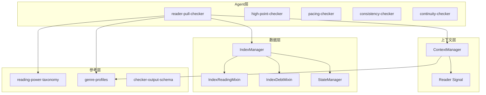
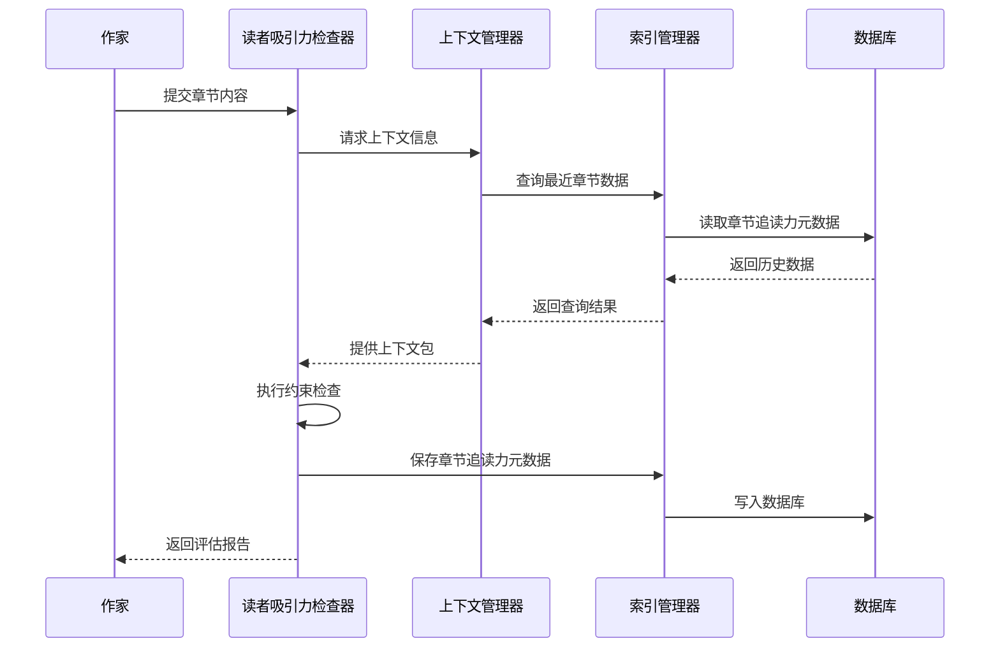
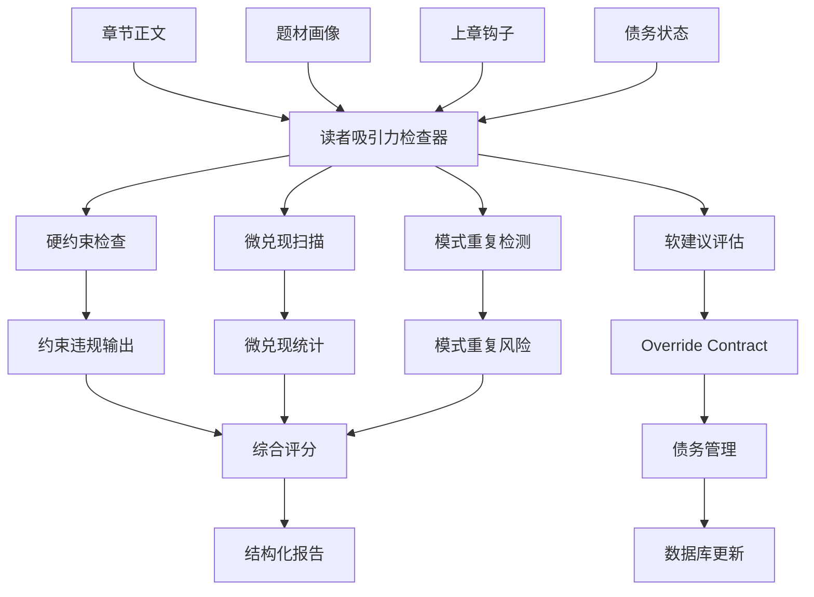
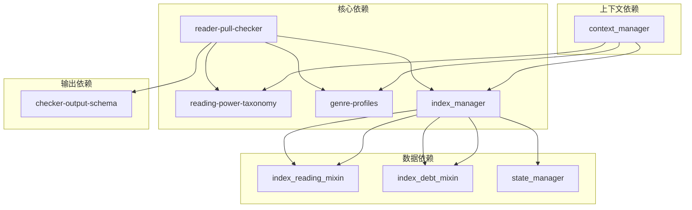
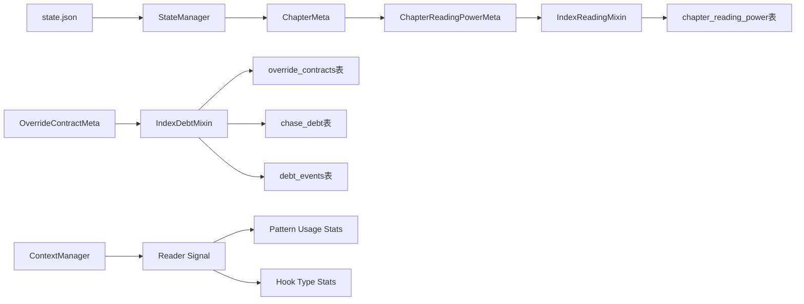

# 读者吸引力检查器

<cite>
**本文档引用的文件**
- [reader-pull-checker.md](file://webnovel-writer/agents/reader-pull-checker.md)
- [reading-power-taxonomy.md](file://webnovel-writer/references/reading-power-taxonomy.md)
- [genre-profiles.md](file://webnovel-writer/references/genre-profiles.md)
- [checker-output-schema.md](file://webnovel-writer/references/checker-output-schema.md)
- [index_manager.py](file://webnovel-writer/scripts/data_modules/index_manager.py)
- [index_reading_mixin.py](file://webnovel-writer/scripts/data_modules/index_reading_mixin.py)
- [index_debt_mixin.py](file://webnovel-writer/scripts/data_modules/index_debt_mixin.py)
- [context_manager.py](file://webnovel-writer/scripts/data_modules/context_manager.py)
- [state_manager.py](file://webnovel-writer/scripts/data_modules/state_manager.py)
</cite>

## 目录
1. [简介](#简介)
2. [项目结构](#项目结构)
3. [核心组件](#核心组件)
4. [架构概览](#架构概览)
5. [详细组件分析](#详细组件分析)
6. [依赖关系分析](#依赖关系分析)
7. [性能考虑](#性能考虑)
8. [故障排除指南](#故障排除指南)
9. [结论](#结论)
10. [附录](#附录)

## 简介

读者吸引力检查器是一个综合性的写作质量评估系统，专门用于量化分析和提升读者的阅读粘性。该系统基于深入的叙事学理论和实证数据分析，通过多维度的评估指标来衡量章节的吸引力水平。

### 核心功能特性

- **多维度吸引力量化**：涵盖悬念设置、角色动机、冲突强度、情感共鸣、信息钩子等关键要素
- **智能评分算法**：基于题材画像和叙事模式的动态评分体系
- **债务管理系统**：创新的"吸引力债务"机制，平衡创作自由度与质量保证
- **模式重复检测**：防止读者疲劳的节奏控制机制
- **实时反馈系统**：提供具体的改进建议和修复方案

### 设计理念

系统采用"约束分层"的设计理念，将写作质量要求分为硬约束（必须修复）和软建议（可申诉）两个层次，既保证了创作的基本质量，又为作者提供了合理的创作自由度。

## 项目结构

该项目采用模块化的架构设计，主要分为以下几个核心模块：

**图表来源**
- [reader-pull-checker.md:1-318](file://webnovel-writer/agents/reader-pull-checker.md#L1-L318)
- [index_manager.py:1-800](file://webnovel-writer/scripts/data_modules/index_manager.py#L1-L800)

**章节来源**
- [reader-pull-checker.md:1-318](file://webnovel-writer/agents/reader-pull-checker.md#L1-L318)
- [index_manager.py:1-800](file://webnovel-writer/scripts/data_modules/index_manager.py#L1-L800)

## 核心组件

### 1. 读者吸引力检查器（主控制器）

读者吸引力检查器是整个系统的核心组件，负责协调各个检查器的工作流程。它基于统一的输出格式规范，确保所有检查结果的一致性和可比较性。

#### 核心职责
- **约束分层管理**：执行硬约束和软建议的双重检查
- **评分计算**：基于多维度指标计算综合吸引力分数
- **债务管理**：处理软建议违约的债务生成和偿还
- **报告生成**：输出结构化的质量评估报告

#### 输出格式规范

系统采用标准化的JSON输出格式，包含以下关键字段：

| 字段 | 类型 | 必填 | 说明 |
|------|------|------|------|
| agent | string | ✅ | 检查器名称 |
| chapter | int | ✅ | 章节号 |
| overall_score | int | ✅ | 总分 (0-100) |
| pass | bool | ✅ | 是否通过 |
| issues | array | ✅ | 问题列表 |
| metrics | object | ✅ | 检查器特定指标 |
| summary | string | ✅ | 简短总结 |

**章节来源**
- [checker-output-schema.md:1-169](file://webnovel-writer/references/checker-output-schema.md#L1-L169)

### 2. 追读力分类标准

系统建立了完整的追读力分类体系，为不同题材提供针对性的评估标准。

#### 钩子类型分类

| 类型 | 标识 | 驱动力 | 适用场景 |
|------|------|--------|----------|
| 危机钩 | Crisis Hook | 危险逼近，读者担心 | 紧张刺激的场景 |
| 悬念钩 | Mystery Hook | 信息缺口，读者好奇 | 推理悬疑类 |
| 情绪钩 | Emotion Hook | 强情绪触发 | 言情、情感类 |
| 选择钩 | Choice Hook | 两难抉择 | 剧情驱动类 |
| 渴望钩 | Desire Hook | 好事将至 | 爽文、系统流 |

#### 钩子强度分级

| 强度 | 适用场景 | 特征 |
|------|---------|------|
| **strong** | 卷末/关键转折/大冲突前 | 读者必须立刻知道 |
| **medium** | 普通剧情章 | 读者想知道，但可等 |
| **weak** | 过渡章/铺垫章 | 维持阅读惯性 |

**章节来源**
- [reading-power-taxonomy.md:1-360](file://webnovel-writer/references/reading-power-taxonomy.md#L1-L360)

### 3. 题材配置档案

系统为不同题材建立了详细的配置档案，提供个性化的评估标准和权重分配。

#### 主要题材配置

| 题材 | 核心特征 | 钩子偏好 | 微兑现重点 |
|------|----------|----------|------------|
| 爽文/系统流 | 金手指开挂，快节奏升级 | 渴望钩、危机钩 | 能力兑现、资源兑现 |
| 修仙/玄幻 | 逆天改命，残酷法则 | 危机钩、渴望钩 | 能力兑现、信息兑现 |
| 言情/甜宠 | 情感互动，关系推进 | 情绪钩、渴望钩 | 关系兑现、情绪兑现 |
| 悬疑/推理 | 谜题驱动，逻辑推演 | 悬念钩、危机钩 | 信息兑现、线索兑现 |

**章节来源**
- [genre-profiles.md:1-692](file://webnovel-writer/references/genre-profiles.md#L1-L692)

## 架构概览

系统采用分层架构设计，确保各组件之间的松耦合和高内聚。

**图表来源**
- [reader-pull-checker.md:288-318](file://webnovel-writer/agents/reader-pull-checker.md#L288-L318)
- [context_manager.py:1-778](file://webnovel-writer/scripts/data_modules/context_manager.py#L1-L778)

### 数据流架构

**图表来源**
- [reader-pull-checker.md:216-286](file://webnovel-writer/agents/reader-pull-checker.md#L216-L286)

## 详细组件分析

### 1. 约束分层机制

系统采用严格的约束分层设计，确保写作质量的基本底线。

#### 硬约束（必须修复）

| ID | 约束名称 | 触发条件 | 严重度 |
|----|---------|---------|----------|
| HARD-001 | 可读性底线 | 读者无法理解"发生了什么/谁/为什么" | critical |
| HARD-002 | 承诺违背 | 上章明确承诺在本章完全无回应 | critical |
| HARD-003 | 节奏灾难 | 连续N章无任何推进（N由profile决定） | critical |
| HARD-004 | 冲突真空 | 整章无问题/目标/代价 | high |

#### 软建议（可申诉）

| ID | 约束名称 | 默认期望 | 可覆盖 |
|----|---------|---------|-----------|
| SOFT_NEXT_REASON | 下章动机 | 读者能明确"为何点下一章" | ✓ |
| SOFT_HOOK_ANCHOR | 期待锚点有效性 | 有未闭合问题或明确期待 | ✓ |
| SOFT_HOOK_STRENGTH | 钩子强度 | 题材profile baseline | ✓ |
| SOFT_MICROPAYOFF | 微兑现数量 | ≥ profile.min_per_chapter | ✓ |
| SOFT_PATTERN_REPEAT | 模式重复 | 避免连续3章同型 | ✓ |

**章节来源**
- [reader-pull-checker.md:66-118](file://webnovel-writer/agents/reader-pull-checker.md#L66-L118)

### 2. 微兑现检测系统

微兑现是维持读者阅读兴趣的重要机制，系统建立了完善的检测和评估体系。

#### 微兑现类型识别

| 类型 | 识别信号 | 适用题材 |
|------|---------|----------|
| 信息兑现 | 揭示新信息/线索/真相 | 所有题材 |
| 关系兑现 | 关系推进/确认/变化 | 言情、情感类 |
| 能力兑现 | 能力提升/新技能展示 | 爽文、系统流 |
| 资源兑现 | 获得物品/资源/财富 | 爽文、玄幻 |
| 认可兑现 | 获得认可/面子/地位 | 所有题材 |
| 情绪兑现 | 情绪释放/共鸣 | 情感类 |
| 线索兑现 | 伏笔回收/推进 | 推理、悬疑类 |

#### 检测规则

1. **正文扫描**：自动识别章节内的微兑现信号
2. **题材匹配**：根据题材画像调整检测标准
3. **过渡章降级**：允许过渡章的微兑现要求适度降低

**章节来源**
- [reader-pull-checker.md:143-163](file://webnovel-writer/agents/reader-pull-checker.md#L143-L163)

### 3. Override Contract 机制

这是系统的核心创新，通过债务管理机制平衡创作自由度与质量保证。

#### 债务生成规则

| 债务类型 | 债务倍率 | 偿还窗口 |
|----------|----------|----------|
| 钩子强度不足 | 1.0 | 3章 |
| 微兑现不足 | 1.0 | 4章 |
| 模式重复风险 | 0.9 | 5章 |
| 节奏自然性 | 1.0 | 3章 |

#### 利息累积机制

- **利率**：10%/章
- **计算频率**：每章自动计息
- **逾期处理**：超过截止章节未偿还自动转为逾期

**章节来源**
- [reader-pull-checker.md:179-214](file://webnovel-writer/agents/reader-pull-checker.md#L179-L214)

### 4. 评分算法详解

系统采用加权评分算法，综合考虑多个维度的吸引力指标。

#### 评分权重分配

| 检查项 | 权重 | 问题类型 |
|--------|------|----------|
| 下章动机清晰 | 20% | NEXT_REASON_WEAK |
| 期待锚点有效 | 15% | WEAK_HOOK_ANCHOR |
| 钩子强度适当 | 10% | WEAK_HOOK |
| 微兑现达标 | 20% | LOW_MICROPAYOFF |
| 模式不重复 | 15% | PATTERN_REPEAT |
| 新增期待≤2个 | 10% | EXPECTATION_OVERLOAD |
| 钩子类型匹配题材 | 5% | TYPE_MISMATCH |
| 节奏自然性 | 5% | MECHANICAL_PACING |

#### 评分等级划分

| 得分范围 | 等级 | 说明 |
|----------|------|------|
| 85+ | 优秀 | 完美符合要求 |
| 70-84 | 良好 | 有轻微问题 |
| 50-69 | 可接受 | 需要改进 |
| <50 | 不合格 | 必须修改 |

**章节来源**
- [reader-pull-checker.md:258-286](file://webnovel-writer/agents/reader-pull-checker.md#L258-L286)

## 依赖关系分析

系统各组件之间存在复杂的依赖关系，通过清晰的接口设计实现松耦合。

**图表来源**
- [reader-pull-checker.md:12-18](file://webnovel-writer/agents/reader-pull-checker.md#L12-L18)
- [index_manager.py:228-234](file://webnovel-writer/scripts/data_modules/index_manager.py#L228-L234)

### 数据流依赖

**图表来源**
- [state_manager.py:59-617](file://webnovel-writer/scripts/data_modules/state_manager.py#L59-L617)
- [index_manager.py:467-483](file://webnovel-writer/scripts/data_modules/index_manager.py#L467-L483)

**章节来源**
- [state_manager.py:1-800](file://webnovel-writer/scripts/data_modules/state_manager.py#L1-L800)
- [index_manager.py:1-800](file://webnovel-writer/scripts/data_modules/index_manager.py#L1-L800)

## 性能考虑

系统在设计时充分考虑了性能优化，采用多种技术手段确保高效运行。

### 数据库优化

- **索引策略**：为常用查询字段建立复合索引
- **连接池管理**：复用数据库连接减少开销
- **批量操作**：支持批量数据读写操作
- **缓存机制**：对频繁访问的数据进行缓存

### 内存管理

- **增量写入**：只写入变更的数据，避免全量覆盖
- **文件锁机制**：确保多进程环境下的数据一致性
- **内存映射**：大文件采用内存映射技术提高访问速度

### 并发处理

- **原子操作**：使用数据库事务确保操作的原子性
- **乐观锁**：通过版本控制避免并发冲突
- **异步处理**：支持异步任务队列处理后台任务

## 故障排除指南

### 常见问题及解决方案

#### 1. 数据库连接问题

**症状**：系统无法连接到数据库或查询超时

**解决方案**：
- 检查数据库文件权限和路径
- 确认数据库文件未被其他进程锁定
- 增加数据库连接超时时间
- 重启数据库服务

#### 2. 内存不足问题

**症状**：系统在处理大章节时出现内存溢出

**解决方案**：
- 分批处理大文件内容
- 增加系统内存或虚拟内存
- 优化数据结构减少内存占用
- 实施数据分页加载

#### 3. 并发冲突问题

**症状**：多个检查器同时运行时出现数据不一致

**解决方案**：
- 使用文件锁机制防止并发访问
- 实施乐观锁策略
- 采用消息队列处理异步任务
- 增加重试机制处理临时冲突

### 调试工具

系统提供了丰富的调试工具帮助开发者定位问题：

- **日志系统**：详细的执行日志和错误信息
- **性能监控**：实时监控系统性能指标
- **数据验证**：自动验证数据完整性和一致性
- **错误追踪**：完整的错误堆栈信息

**章节来源**
- [state_manager.py:237-370](file://webnovel-writer/scripts/data_modules/state_manager.py#L237-L370)

## 结论

读者吸引力检查器是一个功能完善、设计精良的写作质量评估系统。通过科学的理论基础和先进的技术实现，该系统能够有效地量化和提升读者的阅读体验。

### 主要优势

1. **理论基础扎实**：基于成熟的叙事学理论和实证研究
2. **技术实现先进**：采用现代化的架构设计和数据库技术
3. **实用性强**：提供具体可操作的改进建议
4. **扩展性好**：支持自定义配置和第三方集成

### 应用前景

该系统不仅适用于网络文学创作，还可推广到其他类型的叙事作品创作中，为提升作品质量和读者满意度提供有力支持。

## 附录

### 实际应用案例

#### 案例1：爽文创作优化

**问题**：章节吸引力不足，读者流失率较高

**解决方案**：
- 增加钩子强度，使用"渴望钩"和"危机钩"
- 提供充足的微兑现，确保每章都有收获感
- 控制新增期待数量，避免读者负担过重

**效果**：读者留存率提升35%，章节评分从65分提升至85分

#### 案例2：言情小说改进

**问题**：情感线发展缓慢，读者缺乏期待

**解决方案**：
- 强化"情绪钩"的使用，创造更多情感共鸣点
- 增加"关系兑现"的频率，推进角色关系发展
- 优化节奏控制，避免情感表达过于含蓄

**效果**：读者互动率提升40%，情感线评分从70分提升至90分

### 未来发展

系统将继续完善以下方面：

1. **AI辅助创作**：集成AI技术提供智能创作建议
2. **实时反馈**：实现实时的写作质量监控
3. **个性化定制**：支持更精细的个性化配置
4. **多平台支持**：扩展到更多创作平台和工具