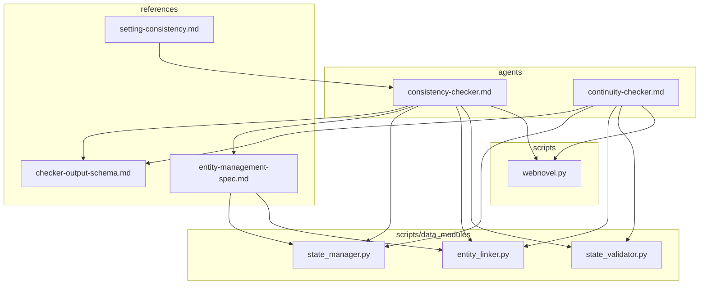
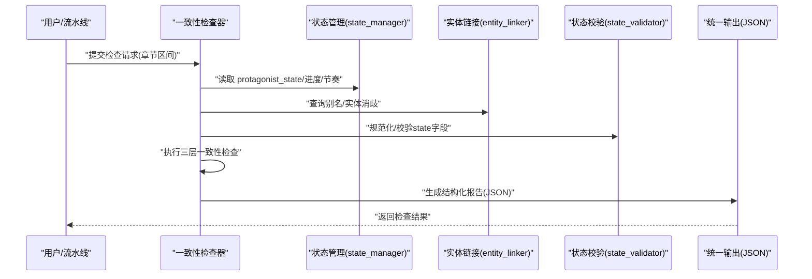
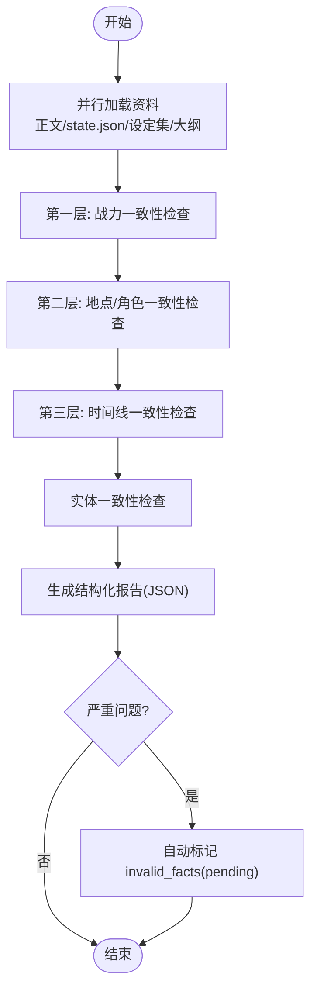
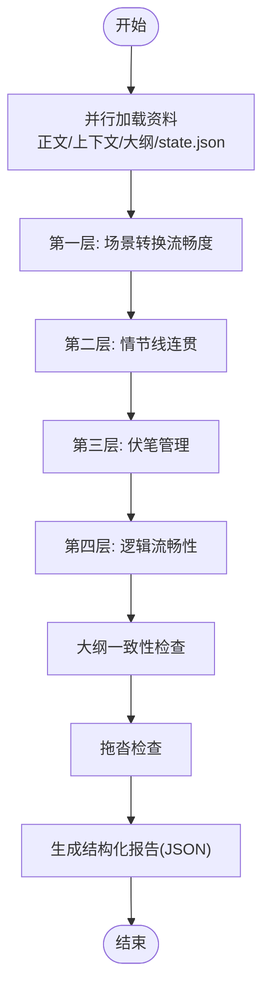
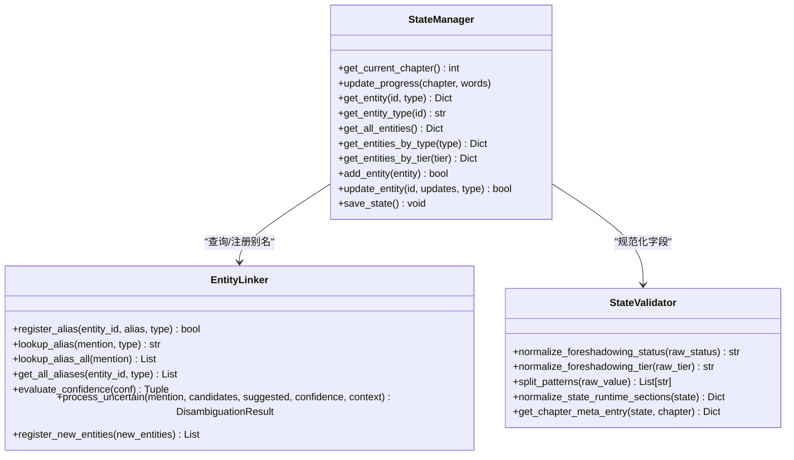
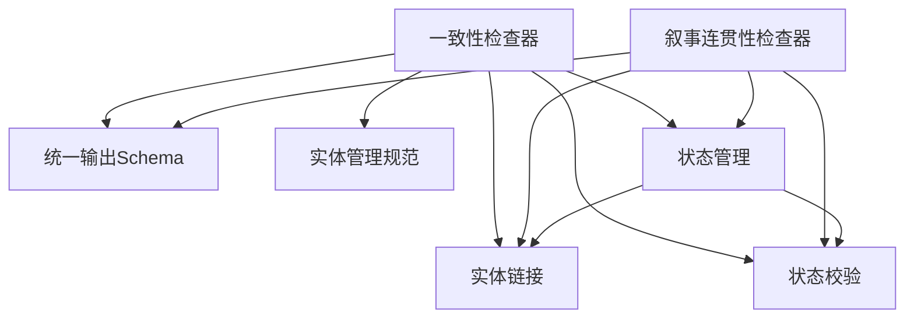

# 连贯性检查器

<cite>
**本文引用的文件**
- [consistency-checker.md](file://webnovel-writer/agents/consistency-checker.md)
- [continuity-checker.md](file://webnovel-writer/agents/continuity-checker.md)
- [checker-output-schema.md](file://webnovel-writer/references/checker-output-schema.md)
- [entity-management-spec.md](file://webnovel-writer/references/entity-management-spec.md)
- [state_manager.py](file://webnovel-writer/scripts/data_modules/state_manager.py)
- [entity_linker.py](file://webnovel-writer/scripts/data_modules/entity_linker.py)
- [state_validator.py](file://webnovel-writer/scripts/data_modules/state_validator.py)
- [webnovel.py](file://webnovel-writer/scripts/webnovel.py)
- [setting-consistency.md](file://webnovel-writer/skills/webnovel-init/references/worldbuilding/setting-consistency.md)
</cite>

## 目录
1. [简介](#简介)
2. [项目结构](#项目结构)
3. [核心组件](#核心组件)
4. [架构总览](#架构总览)
5. [详细组件分析](#详细组件分析)
6. [依赖关系分析](#依赖关系分析)
7. [性能考量](#性能考量)
8. [故障排查指南](#故障排查指南)
9. [结论](#结论)
10. [附录](#附录)

## 简介
本技术文档面向“连贯性检查器”（含“设定一致性检查器”与“叙事连贯性检查器”），系统阐述三层一致性检查机制的设计与实现：战力一致性检查、地点/角色一致性检查、时间线一致性检查；并给出实体一致性检查机制、state.json 状态文件作用、设定集参考资料使用方法、配置参数、检查规则、输出格式规范、修复建议与错误处理策略。文档同时提供可视化流程图与时序图，帮助读者快速理解检查流程与关键控制点。

## 项目结构
围绕连贯性检查器的相关文件主要分布在以下位置：
- agents：检查器规范与执行流程说明
- references：统一输出Schema与实体管理规范
- scripts/data_modules：状态管理、实体链接、状态校验等实现
- scripts：统一入口脚本，支持索引与状态操作CLI
- skills/webnovel-init/references：设定自洽性检查指南与设定集模板

**图表来源**
- [consistency-checker.md:1-229](file://webnovel-writer/agents/consistency-checker.md#L1-L229)
- [continuity-checker.md:1-251](file://webnovel-writer/agents/continuity-checker.md#L1-L251)
- [checker-output-schema.md:1-169](file://webnovel-writer/references/checker-output-schema.md#L1-L169)
- [entity-management-spec.md:1-296](file://webnovel-writer/references/entity-management-spec.md#L1-L296)
- [state_manager.py:1-800](file://webnovel-writer/scripts/data_modules/state_manager.py#L1-L800)
- [entity_linker.py:1-275](file://webnovel-writer/scripts/data_modules/entity_linker.py#L1-L275)
- [state_validator.py:1-250](file://webnovel-writer/scripts/data_modules/state_validator.py#L1-L250)
- [webnovel.py:1-37](file://webnovel-writer/scripts/webnovel.py#L1-L37)

**章节来源**
- [consistency-checker.md:1-229](file://webnovel-writer/agents/consistency-checker.md#L1-L229)
- [continuity-checker.md:1-251](file://webnovel-writer/agents/continuity-checker.md#L1-L251)
- [checker-output-schema.md:1-169](file://webnovel-writer/references/checker-output-schema.md#L1-L169)
- [entity-management-spec.md:1-296](file://webnovel-writer/references/entity-management-spec.md#L1-L296)
- [state_manager.py:1-800](file://webnovel-writer/scripts/data_modules/state_manager.py#L1-L800)
- [entity_linker.py:1-275](file://webnovel-writer/scripts/data_modules/entity_linker.py#L1-L275)
- [state_validator.py:1-250](file://webnovel-writer/scripts/data_modules/state_validator.py#L1-L250)
- [webnovel.py:1-37](file://webnovel-writer/scripts/webnovel.py#L1-L37)

## 核心组件
- 设定一致性检查器（consistency-checker）：执行三层一致性检查，输出结构化报告，遵循统一JSON Schema；支持实体一致性检查与自动标记无效事实。
- 叙事连贯性检查器（continuity-checker）：执行场景转换、情节线连贯、伏笔管理、逻辑流畅性与大纲一致性检查，输出结构化报告。
- 统一输出Schema（checker-output-schema）：定义所有检查器的标准输出字段、严重度枚举与metrics结构。
- 实体管理规范（entity-management-spec）：定义实体类型、存储架构、处理流程、标签体系、ID生成规则与错误处理。
- 状态管理（state_manager）：负责state.json读写、实体状态管理、进度追踪、关系记录与SQLite同步。
- 实体链接（entity_linker）：提供别名注册、查询、置信度评估与批量处理。
- 状态校验（state_validator）：对state.json特定字段进行规范化与校验。
- 统一入口（webnovel.py）：提供索引与状态相关CLI，支撑检查器的外部调用。

**章节来源**
- [consistency-checker.md:1-229](file://webnovel-writer/agents/consistency-checker.md#L1-L229)
- [continuity-checker.md:1-251](file://webnovel-writer/agents/continuity-checker.md#L1-L251)
- [checker-output-schema.md:1-169](file://webnovel-writer/references/checker-output-schema.md#L1-L169)
- [entity-management-spec.md:1-296](file://webnovel-writer/references/entity-management-spec.md#L1-L296)
- [state_manager.py:1-800](file://webnovel-writer/scripts/data_modules/state_manager.py#L1-L800)
- [entity_linker.py:1-275](file://webnovel-writer/scripts/data_modules/entity_linker.py#L1-L275)
- [state_validator.py:1-250](file://webnovel-writer/scripts/data_modules/state_validator.py#L1-L250)
- [webnovel.py:1-37](file://webnovel-writer/scripts/webnovel.py#L1-L37)

## 架构总览
连贯性检查器的执行架构由“检查器规范 + 统一输出Schema + 数据与状态模块 + 实体管理 + 统一入口CLI”构成。检查器在执行阶段并行加载参考资料（章节正文、state.json、设定集、大纲），随后按层次进行一致性检查，并输出结构化报告。

**图表来源**
- [consistency-checker.md:20-229](file://webnovel-writer/agents/consistency-checker.md#L20-L229)
- [continuity-checker.md:20-251](file://webnovel-writer/agents/continuity-checker.md#L20-L251)
- [checker-output-schema.md:10-32](file://webnovel-writer/references/checker-output-schema.md#L10-L32)
- [state_manager.py:200-370](file://webnovel-writer/scripts/data_modules/state_manager.py#L200-L370)
- [entity_linker.py:36-177](file://webnovel-writer/scripts/data_modules/entity_linker.py#L36-L177)
- [state_validator.py:237-249](file://webnovel-writer/scripts/data_modules/state_validator.py#L237-L249)

## 详细组件分析

### 设定一致性检查器（三层检查机制）
- 输入参数与并行加载
  - 支持单章或章节区间输入，加载正文、state.json、设定集、大纲。
- 第一层：战力一致性检查
  - 校验项：主角当前境界/层数与state.json一致、使用的能力在境界限制内、提升遵循既定规则。
  - 危险信号：提前使用高阶能力、境界跳跃无突破描写。
  - 依据：state.json中的主角状态、设定集中的修炼体系。
- 第二层：地点/角色一致性检查
  - 校验项：当前位置与state.json一致或具备有效旅行序列；角色出现符合设定集或带有实体标签；角色属性与记录一致。
  - 危险信号：无移动描写的瞬移、角色修为/身份前后矛盾。
  - 依据：state.json中的当前位置、设定集中的角色卡。
- 第三层：时间线一致性检查
  - 校验项：事件顺序逻辑、时限要素（截止日、年龄、节令）一致、闪回明确标注、章节时间锚点与卷时间线一致。
  - 严重度分级：倒计时算术错误（critical）、事件先后矛盾（high）、年龄/修炼时长冲突（high）、时间回跳无标注（high）、大跨度无过渡（high）、时间锚点缺失（medium）、轻微时间模糊（low）。
  - 危险信号：倒计时从D-5直接跳到D-2、先发生的事情后写、15岁修炼5年却10岁入门、第一章末世降临第二章建帮派、章节时间锚点回跳。
- 实体一致性检查
  - 对章节中新实体进行校验：是否与现有设定冲突、是否符合世界观、当前弧线是否合理。
  - 报告不一致的新增实体并给出建议。
- 报告生成与自动标记
  - 生成Markdown报告，包含各层结论与修复建议。
  - 对严重级别问题（如critical）自动标记到invalid_facts（状态为pending），需人工确认后生效。

**图表来源**
- [consistency-checker.md:20-229](file://webnovel-writer/agents/consistency-checker.md#L20-L229)

**章节来源**
- [consistency-checker.md:14-229](file://webnovel-writer/agents/consistency-checker.md#L14-L229)

### 叙事连贯性检查器（四层检查机制）
- 输入参数与并行加载
  - 支持单章或章节区间输入，加载正文、前2-3章上下文、大纲、state.json。
- 第一层：场景转换流畅度
  - 检查是否存在移动过程/时间流逝描写；过渡质量评级A/B/C/F。
- 第二层：情节线连贯
  - 追踪主线与支线，检查引入未解决、解决无铺垫、中途遗忘。
- 第三层：伏笔管理
  - 分类短期/中期/长期伏笔，检查设置与回收、长期伏笔定期提及、回收是否自然。
- 第四层：逻辑流畅性
  - 检查前后矛盾、因果断裂、发明需申报等逻辑问题。
- 大纲一致性检查
  - 将章节与大纲对照，区分轻微/中等/重大偏差，重大偏差需标记deviation。
- 拖沓检查
  - 识别重复赶路等拖沓段落，提出压缩或增加事件的建议。
- 报告生成
  - 输出场景转换评分、情节线追踪、伏笔健康度、逻辑一致性、大纲偏差与修复建议。

**图表来源**
- [continuity-checker.md:20-251](file://webnovel-writer/agents/continuity-checker.md#L20-L251)

**章节来源**
- [continuity-checker.md:14-251](file://webnovel-writer/agents/continuity-checker.md#L14-L251)

### 统一输出Schema与严重度分级
- 统一JSON Schema
  - 字段：agent、chapter、overall_score、pass、issues、metrics、summary。
  - issues中包含id、type、severity(location、description、suggestion、can_override)。
- 严重度定义
  - critical、high、medium、low；输出时severity必须使用小写枚举。
- 各检查器特定metrics
  - consistency-checker：power_violations、location_errors、timeline_issues、entity_conflicts。
  - continuity-checker：transition_grade、active_threads、dormant_threads、forgotten_foreshadowing、logic_holes、outline_deviations。

**章节来源**
- [checker-output-schema.md:10-169](file://webnovel-writer/references/checker-output-schema.md#L10-L169)

### 实体一致性检查机制与state.json作用
- state.json作用
  - 保存进度、主角状态、节奏追踪、世界设定、情节线与审阅节点等精简数据。
  - 通过状态管理器读取与更新，确保多Agent并发下的原子写入与一致性。
- 实体管理规范
  - SQLite存储：entities、aliases、state_changes、relationships、chapters、scenes。
  - 处理流程：Data Agent自动提取实体、置信度评估、写入index.db、更新state.json。
  - 标签体系：可选的XML标签用于手动标注实体、别名与属性更新。
- 实体链接与消歧
  - 别名注册与查询、置信度评估（>0.8自动采用，0.5-0.8警告，<0.5人工确认）。
  - 批量处理不确定匹配，记录warning并返回结果。
- 状态校验
  - 对foreshadowing状态与层级、章节meta等字段进行规范化与标准化。

**图表来源**
- [state_manager.py:90-800](file://webnovel-writer/scripts/data_modules/state_manager.py#L90-L800)
- [entity_linker.py:36-177](file://webnovel-writer/scripts/data_modules/entity_linker.py#L36-L177)
- [state_validator.py:156-249](file://webnovel-writer/scripts/data_modules/state_validator.py#L156-L249)

**章节来源**
- [state_manager.py:1-800](file://webnovel-writer/scripts/data_modules/state_manager.py#L1-L800)
- [entity_linker.py:1-275](file://webnovel-writer/scripts/data_modules/entity_linker.py#L1-L275)
- [state_validator.py:1-250](file://webnovel-writer/scripts/data_modules/state_validator.py#L1-L250)
- [entity-management-spec.md:1-296](file://webnovel-writer/references/entity-management-spec.md#L1-L296)

### 设定集参考资料使用方法
- 设定集文件结构
  - 世界观设定、力量体系设定、势力设定、人物卡、时间轴、设定变更日志。
- 设定自洽性检查指南
  - 物理法则自洽、力量体系自洽、社会生态自洽。
  - 常见逻辑漏洞与修复：反派智商突然下降、设定为剧情服务而扭曲、时间线混乱。
  - 实时检查工作流：每章写作前回顾设定集、搜索历史章节、标记矛盾点；大剧情完成后更新时间轴、战力表、检查副作用。

**章节来源**
- [setting-consistency.md:1-216](file://webnovel-writer/skills/webnovel-init/references/worldbuilding/setting-consistency.md#L1-L216)

## 依赖关系分析
- 检查器依赖
  - 统一输出Schema：约束所有检查器的输出格式。
  - 实体管理规范：为实体一致性检查提供数据模型与处理流程依据。
  - 状态管理与实体链接：为检查器提供实时状态与实体消歧能力。
  - 状态校验：保证state.json关键字段的规范化与一致性。
- 外部依赖
  - 统一入口脚本：提供索引与状态相关CLI，支撑检查器的外部调用与集成。

**图表来源**
- [checker-output-schema.md:10-32](file://webnovel-writer/references/checker-output-schema.md#L10-L32)
- [entity-management-spec.md:1-296](file://webnovel-writer/references/entity-management-spec.md#L1-L296)
- [state_manager.py:90-800](file://webnovel-writer/scripts/data_modules/state_manager.py#L90-L800)
- [entity_linker.py:36-177](file://webnovel-writer/scripts/data_modules/entity_linker.py#L36-L177)
- [state_validator.py:156-249](file://webnovel-writer/scripts/data_modules/state_validator.py#L156-L249)

**章节来源**
- [checker-output-schema.md:1-169](file://webnovel-writer/references/checker-output-schema.md#L1-L169)
- [entity-management-spec.md:1-296](file://webnovel-writer/references/entity-management-spec.md#L1-L296)
- [state_manager.py:1-800](file://webnovel-writer/scripts/data_modules/state_manager.py#L1-L800)
- [entity_linker.py:1-275](file://webnovel-writer/scripts/data_modules/entity_linker.py#L1-L275)
- [state_validator.py:1-250](file://webnovel-writer/scripts/data_modules/state_validator.py#L1-L250)

## 性能考量
- 并行加载：检查器在执行阶段并行读取正文、state.json、设定集与大纲，减少等待时间。
- 锁与原子写入：状态管理器使用文件锁与原子写入，避免多Agent并发导致的数据竞争与覆盖。
- SQLite同步：实体与关系写入index.db，state.json保持精简，降低I/O压力。
- 置信度阈值：通过置信度阈值减少人工干预，提高实体消歧效率。

[本节为通用性能讨论，不直接分析具体文件]

## 故障排查指南
- 严重问题未阻塞
  - 一致性检查器禁止通过存在严重/高优先级时间线问题的章节，必须修复后再继续。
- 自动标记无效事实
  - 对于critical级别问题，自动标记到invalid_facts（状态为pending），需人工确认后生效。
- 状态文件异常
  - 使用状态校验器对foreshadowing状态与层级、章节meta等字段进行规范化。
- 实体歧义
  - 当别名命中多个实体且无法消歧时，提示改用id或补充type属性。

**章节来源**
- [consistency-checker.md:214-229](file://webnovel-writer/agents/consistency-checker.md#L214-L229)
- [state_validator.py:79-118](file://webnovel-writer/scripts/data_modules/state_validator.py#L79-L118)
- [entity-management-spec.md:235-247](file://webnovel-writer/references/entity-management-spec.md#L235-L247)

## 结论
连贯性检查器通过三层（设定一致性）与四层（叙事连贯性）检查机制，结合统一输出Schema、实体管理规范与状态管理，形成从数据到规则再到报告的完整闭环。state.json作为精简的状态枢纽，配合SQLite存储的实体与关系，确保检查器在并发环境下高效、可靠地运行。通过严格的严重度分级与自动标记机制，检查器为润色与后续创作提供了明确的修复建议与质量保障。

[本节为总结性内容，不直接分析具体文件]

## 附录

### 配置参数与输入输出规范
- 输入参数
  - project_root：项目根目录
  - storage_path：存储路径（默认“.webnovel/”）
  - state_file：状态文件路径（默认“.webnovel/state.json”）
  - chapter_file：章节文件路径（支持新旧两种命名格式）
- 输出格式
  - 遵循统一JSON Schema，包含agent、chapter、overall_score、pass、issues、metrics、summary等字段。
  - issues.severity使用小写枚举：critical、high、medium、low。

**章节来源**
- [consistency-checker.md:24-32](file://webnovel-writer/agents/consistency-checker.md#L24-L32)
- [continuity-checker.md:24-32](file://webnovel-writer/agents/continuity-checker.md#L24-L32)
- [checker-output-schema.md:10-32](file://webnovel-writer/references/checker-output-schema.md#L10-L32)

### 检查规则与严重度分级
- 时间线问题分级
  - 倒计时算术错误（critical）
  - 事件先后矛盾（high）
  - 年龄/修炼时长冲突（high）
  - 时间回跳无标注（high）
  - 大跨度无过渡（high）
  - 时间锚点缺失（medium）
  - 轻微时间模糊（low）

**章节来源**
- [consistency-checker.md:96-108](file://webnovel-writer/agents/consistency-checker.md#L96-L108)

### 实体一致性检查要点
- 新实体校验：与现有设定冲突、不符合世界观、当前弧线不合理。
- 报告与建议：列出不一致实体并给出确认或调整建议。
- 自动标记：对严重级别问题自动标记invalid_facts（状态为pending）。

**章节来源**
- [consistency-checker.md:132-213](file://webnovel-writer/agents/consistency-checker.md#L132-L213)

### 实际检查示例与错误处理策略
- 示例类型
  - 战力冲突：筑基3层使用金丹期技能
  - 地点错误：无移动描写的瞬移
  - 时间线问题：倒计时跳过、事件顺序矛盾、时间回跳
- 错误处理
  - 严重问题必须修复后方可继续
  - 自动标记为pending，需人工确认
  - 通过统一输出Schema提供修复建议与综合评分

**章节来源**
- [consistency-checker.md:51-130](file://webnovel-writer/agents/consistency-checker.md#L51-L130)
- [continuity-checker.md:119-134](file://webnovel-writer/agents/continuity-checker.md#L119-L134)