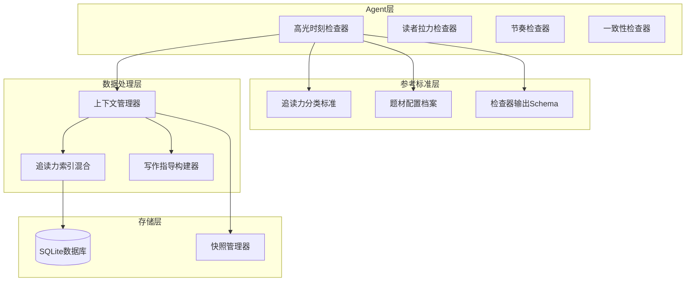
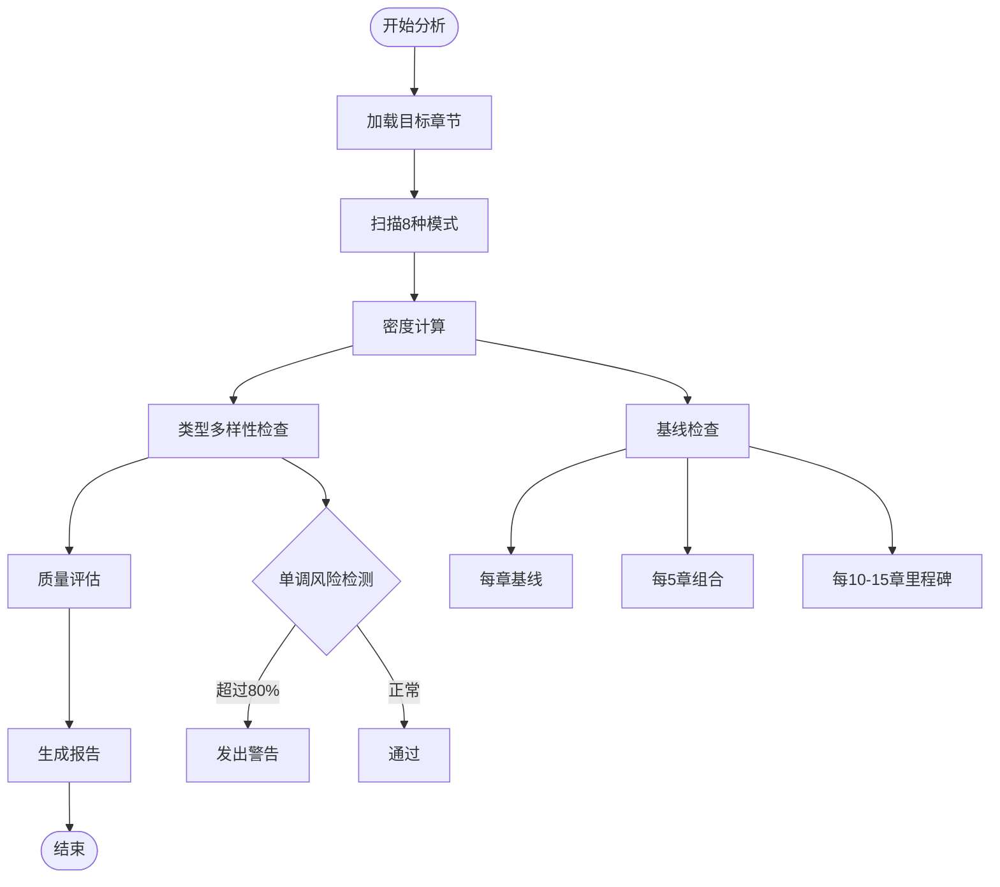
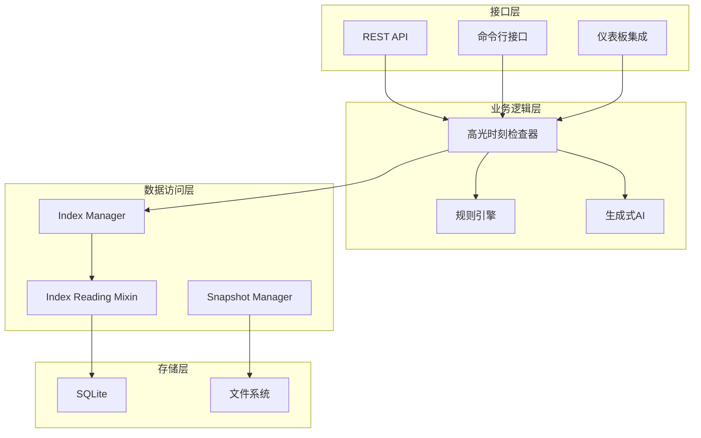
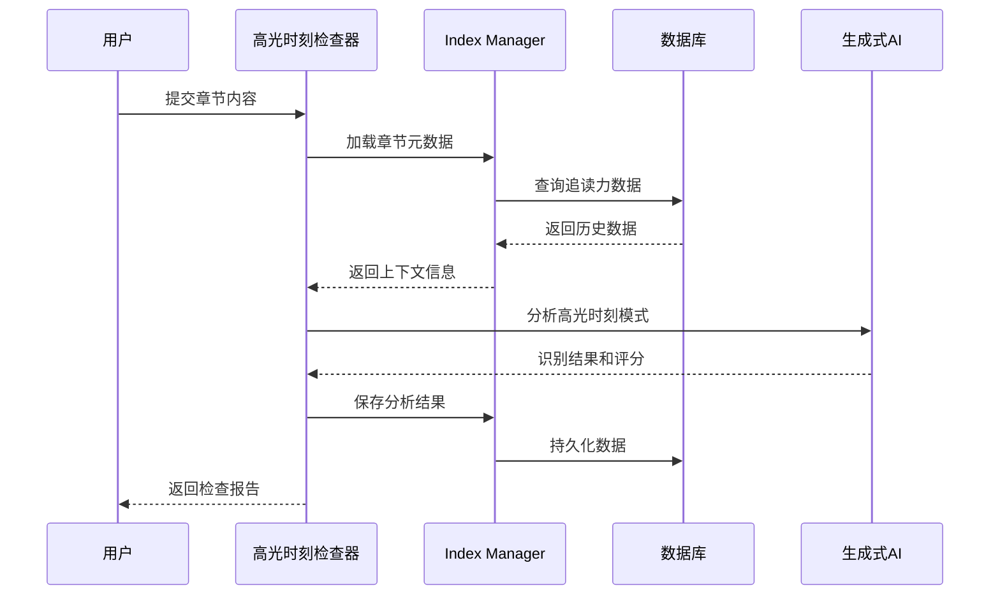
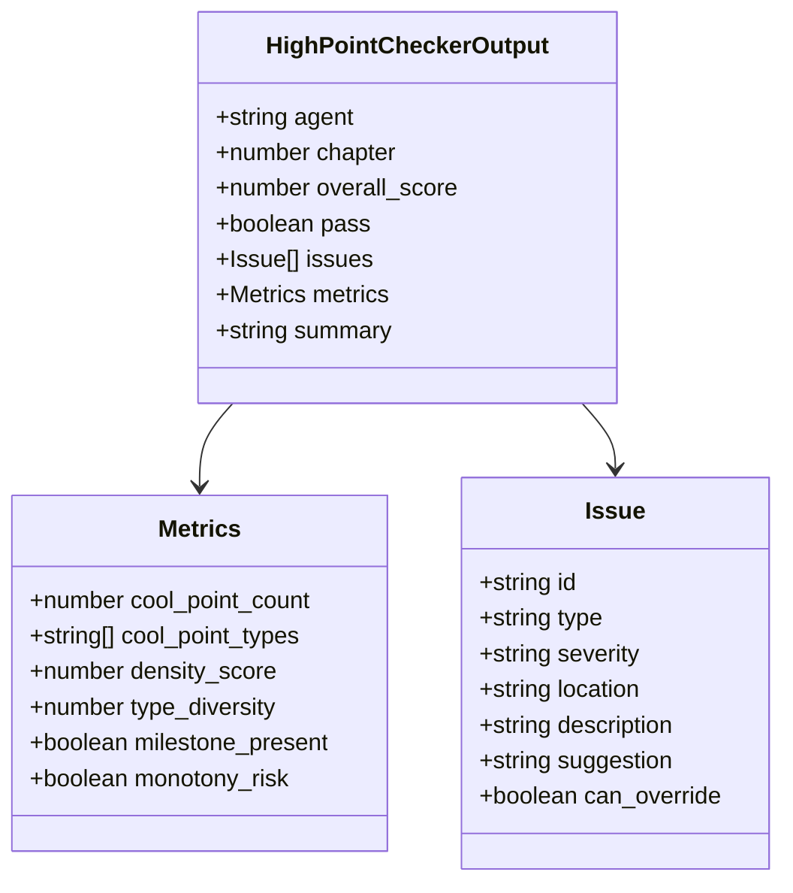
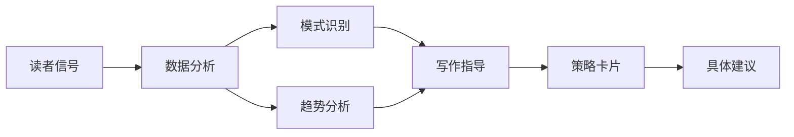
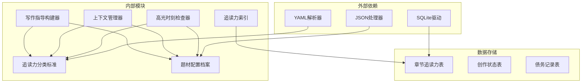

# 高光时刻检查器

<cite>
**本文档引用的文件**
- [webnovel-writer/agents/high-point-checker.md](file://webnovel-writer/agents/high-point-checker.md)
- [webnovel-writer/references/checker-output-schema.md](file://webnovel-writer/references/checker-output-schema.md)
- [webnovel-writer/references/reading-power-taxonomy.md](file://webnovel-writer/references/reading-power-taxonomy.md)
- [webnovel-writer/references/genre-profiles.md](file://webnovel-writer/references/genre-profiles.md)
- [webnovel-writer/scripts/data_modules/context_manager.py](file://webnovel-writer/scripts/data_modules/context_manager.py)
- [webnovel-writer/scripts/data_modules/writing_guidance_builder.py](file://webnovel-writer/scripts/data_modules/writing_guidance_builder.py)
- [webnovel-writer/scripts/data_modules/index_reading_mixin.py](file://webnovel-writer/scripts/data_modules/index_reading_mixin.py)
- [webnovel-writer/agents/pacing-checker.md](file://webnovel-writer/agents/pacing-checker.md)
</cite>

## 目录
1. [简介](#简介)
2. [项目结构](#项目结构)
3. [核心组件](#核心组件)
4. [架构概览](#架构概览)
5. [详细组件分析](#详细组件分析)
6. [依赖分析](#依赖分析)
7. [性能考虑](#性能考虑)
8. [故障排除指南](#故障排除指南)
9. [结论](#结论)
10. [附录](#附录)

## 简介

高光时刻检查器是一个专业的写作质量保障工具，专门用于识别和评估小说中的"高光时刻"（Cool Points）。该检查器基于统一的追读力分类标准，为网络文学创作提供科学的节奏控制和读者满足感管理方案。

### 主要功能特性

- **多维度识别**：支持8种标准执行模式的自动识别
- **密度分析**：提供滚动窗口密度检查和类型多样性评估
- **质量评级**：基于30/40/30结构参考和压扬比例进行综合评价
- **智能建议**：生成可执行的修复建议和创作策略指导
- **统一输出**：遵循标准化JSON Schema，便于自动化集成

## 项目结构

该项目采用模块化架构设计，主要包含以下几个核心部分：

**图表来源**
- [webnovel-writer/agents/high-point-checker.md:1-218](file://webnovel-writer/agents/high-point-checker.md#L1-L218)
- [webnovel-writer/references/reading-power-taxonomy.md:1-360](file://webnovel-writer/references/reading-power-taxonomy.md#L1-L360)
- [webnovel-writer/references/genre-profiles.md:1-692](file://webnovel-writer/references/genre-profiles.md#L1-L692)

**章节来源**
- [webnovel-writer/agents/high-point-checker.md:1-218](file://webnovel-writer/agents/high-point-checker.md#L1-L218)
- [webnovel-writer/references/checker-output-schema.md:1-169](file://webnovel-writer/references/checker-output-schema.md#L1-L169)

## 核心组件

### 高光时刻识别引擎

高光时刻检查器的核心在于其8种标准执行模式的识别能力：

| 模式类型 | 核心特征 | 识别要点 | 质量评估标准 |
|---------|---------|---------|-------------|
| 装逼打脸 | 嘲讽→反转→震惊 | 铺垫+反转+反应 | 情绪冲击力 |
| 扮猪吃虎 | 示弱→暴露→碾压 | 隐藏+轻视+碾压 | 信息差利用 |
| 越级反杀 | 差距→策略→逆转 | 展示差距+爆发 | 力量对比 |
| 打脸权威 | 权威→挑战→成功 | 建立权威+挑战 | 社会地位 |
| 反派翻车 | 得意→反杀→落幕 | 反派铺垫+翻车 | 复杂度 |
| 甜蜜超预期 | 期待→超预期→升华 | 期待+超越期待+情绪 | 情感深度 |
| 迪化误解 | 随意行为→脑补→优越感 | 信息差+误解+优越 | 幽默效果 |
| 身份掉马 | 隐藏→关键时刻→震惊 | 长期铺垫+意外 | 戏剧张力 |

### 密度分析系统

检查器采用多层级密度分析机制：

**图表来源**
- [webnovel-writer/agents/high-point-checker.md:83-115](file://webnovel-writer/agents/high-point-checker.md#L83-L115)

### 质量评级标准

质量评估采用多维度综合评价：

| 评估维度 | 评价标准 | 权重分配 |
|---------|---------|---------|
| 铺垫充分性 | 至少1-2章前期铺垫 | 20% |
| 反转冲击 | 出人意料且合乎逻辑 | 25% |
| 情绪回报 | 实现读者情绪释放 | 20% |
| 结构完整性 | 30/40/30参考结构 | 20% |
| 压扬比例 | 匹配题材特征 | 15% |

**章节来源**
- [webnovel-writer/agents/high-point-checker.md:116-137](file://webnovel-writer/agents/high-point-checker.md#L116-L137)

## 架构概览

高光时刻检查器采用分层架构设计，确保系统的可扩展性和维护性：

**图表来源**
- [webnovel-writer/scripts/data_modules/context_manager.py:1-200](file://webnovel-writer/scripts/data_modules/context_manager.py#L1-L200)
- [webnovel-writer/scripts/data_modules/index_reading_mixin.py:1-41](file://webnovel-writer/scripts/data_modules/index_reading_mixin.py#L1-L41)

### 数据流分析

**图表来源**
- [webnovel-writer/scripts/data_modules/context_manager.py:259-288](file://webnovel-writer/scripts/data_modules/context_manager.py#L259-L288)
- [webnovel-writer/scripts/data_modules/index_reading_mixin.py:16-41](file://webnovel-writer/scripts/data_modules/index_reading_mixin.py#L16-L41)

## 详细组件分析

### 追读力分类标准

高光时刻检查器基于统一的追读力分类标准，确保分析的一致性和科学性：

#### 钩子类型分类

| 钩子类型 | 定义 | 适用场景 | 强度建议 |
|---------|------|---------|---------|
| 情绪钩 | 触发强烈情绪反应 | 主角受冤、被背叛、弱者被欺凌 | strong/medium |
| 选择钩 | 设置两难抉择 | 生死二选一、利益与道义冲突 | strong/medium |
| 渴望钩 | 展示可期待的奖励 | 突破在即、宝物将得、复仇时机 | strong/medium |
| 危机钩 | 敌人出现/危险逼近 | 卷末关键转折、大冲突前 | strong |

#### 爽点模式扩展

检查器支持的标准模式包括：

1. **装逼打脸**：通过嘲讽到反转的情绪转变
2. **扮猪吃虎**：隐藏实力到暴露碾压的戏剧性
3. **越级反杀**：实力差距到以弱胜强的震撼
4. **打脸权威**：挑战权威到成功的社会地位变化
5. **反派翻车**：反派得意到计划失败的道德审判
6. **甜蜜超预期**：期待到超预期的情感升华
7. **迪化误解**：主角随意行为到配角脑补的幽默效果
8. **身份掉马**：长期身份伪装到关键时刻的戏剧性揭露

### 题材配置档案

针对不同题材，检查器提供差异化的分析标准：

| 题材类型 | 爽点偏好 | 密度要求 | 组合间隔 | 阶段性里程碑 |
|---------|---------|---------|---------|-------------|
| 爽文/系统流 | 装逼打脸、扮猪吃虎 | high | 5章 | 10章 |
| 修仙/玄幻 | 越级反杀、身份掉马 | high | 5章 | 15章 |
| 言情/甜宠 | 甜蜜超预期、身份掉马 | medium | 6章 | 12章 |
| 悬疑/推理 | 反派翻车、身份掉马 | low | 10章 | 20章 |
| 电竞 | 越级反杀、反派翻车 | high | 4章 | 8章 |
| 直播文 | 装逼打脸、反派翻车 | high | 3章 | 6章 |

### 输出格式标准化

检查器遵循统一的JSON Schema输出格式，确保与其他组件的无缝集成：

**图表来源**
- [webnovel-writer/references/checker-output-schema.md:12-31](file://webnovel-writer/references/checker-output-schema.md#L12-L31)
- [webnovel-writer/references/checker-output-schema.md:77-87](file://webnovel-writer/references/checker-output-schema.md#L77-L87)

**章节来源**
- [webnovel-writer/references/checker-output-schema.md:1-169](file://webnovel-writer/references/checker-output-schema.md#L1-L169)

### 上下文管理系统

高光时刻检查器与上下文管理系统深度集成，提供智能化的创作指导：

#### 读者信号分析

系统能够分析读者反馈信号，为创作提供数据驱动的建议：

| 信号类型 | 分析内容 | 价值指标 |
|---------|---------|---------|
| 近期阅读功率 | 最近章节的追读力表现 | 72分 |
| 模式使用统计 | 各种爽点模式的使用频率 | 身份掉马: 2次 |
| 钩子类型统计 | 各类钩子的使用分布 | 渴望钩: 1次 |
| 评审趋势 | 整体评分的变化趋势 | 平均分: 72分 |
| 低分区间 | 连续低分的章节范围 | 1-3章 |

#### 写作指导构建

基于分析结果，系统生成个性化的写作指导：

**图表来源**
- [webnovel-writer/scripts/data_modules/writing_guidance_builder.py:81-167](file://webnovel-writer/scripts/data_modules/writing_guidance_builder.py#L81-L167)

**章节来源**
- [webnovel-writer/scripts/data_modules/context_manager.py:259-288](file://webnovel-writer/scripts/data_modules/context_manager.py#L259-L288)
- [webnovel-writer/scripts/data_modules/writing_guidance_builder.py:81-260](file://webnovel-writer/scripts/data_modules/writing_guidance_builder.py#L81-L260)

## 依赖分析

高光时刻检查器的依赖关系呈现清晰的分层结构：

**图表来源**
- [webnovel-writer/scripts/data_modules/index_reading_mixin.py:16-41](file://webnovel-writer/scripts/data_modules/index_reading_mixin.py#L16-L41)
- [webnovel-writer/references/reading-power-taxonomy.md:1-360](file://webnovel-writer/references/reading-power-taxonomy.md#L1-L360)

### 耦合度分析

- **低耦合设计**：各组件通过标准化接口通信
- **高内聚模块**：每个模块专注于特定的功能领域
- **可替换性**：参考标准和配置可通过文件系统热更新
- **向后兼容**：输出格式遵循稳定的JSON Schema

**章节来源**
- [webnovel-writer/agents/high-point-checker.md:1-24](file://webnovel-writer/agents/high-point-checker.md#L1-L24)

## 性能考虑

### 计算复杂度

高光时刻检查器的性能特征：

- **时间复杂度**：O(n*m*k)，其中n为章节数量，m为模式数量，k为文本分析复杂度
- **空间复杂度**：O(n*m)，主要用于存储分析结果和中间状态
- **内存优化**：采用流式处理，避免一次性加载大量数据

### 缓存策略

系统实施多层次缓存机制：

1. **快照缓存**：上下文包的序列化缓存
2. **查询缓存**：频繁访问的统计数据缓存
3. **配置缓存**：题材配置和分类标准的内存缓存

### 扩展性设计

- **模块化架构**：易于添加新的分析模式和评估标准
- **插件机制**：支持第三方扩展和定制化需求
- **分布式处理**：支持多进程并行分析大量章节

## 故障排除指南

### 常见问题诊断

| 问题类型 | 症状表现 | 可能原因 | 解决方案 |
|---------|---------|---------|---------|
| 识别错误 | 模式误判或漏判 | 文本预处理不当 | 检查输入格式和编码 |
| 性能问题 | 分析速度慢 | 数据量过大 | 优化索引和查询 |
| 输出异常 | JSON格式错误 | 编码或字符集问题 | 验证UTF-8编码 |
| 配置失效 | 题材分析不准确 | 配置文件损坏 | 重新加载默认配置 |

### 调试工具

系统提供多种调试和监控工具：

- **日志系统**：详细的执行跟踪和错误记录
- **性能分析器**：识别性能瓶颈和优化机会
- **单元测试**：覆盖核心算法和边界条件
- **集成测试**：验证组件间的协作稳定性

**章节来源**
- [webnovel-writer/scripts/data_modules/context_manager.py:746-777](file://webnovel-writer/scripts/data_modules/context_manager.py#L746-L777)

## 结论

高光时刻检查器作为一个专业的写作质量保障工具，通过科学的分类标准和智能化的分析算法，为网络文学创作提供了强有力的技术支持。其模块化的设计架构确保了系统的可扩展性和维护性，而统一的输出格式则便于与其他创作工具和服务的集成。

该检查器不仅能够帮助作者识别和优化作品中的高光时刻，更重要的是通过数据驱动的方式提供创作指导，帮助作者建立可持续的创作流程和质量管理体系。随着人工智能技术的不断发展，高光时刻检查器将继续演进，为网络文学创作提供更加精准和智能的支持。

## 附录

### 高光时刻设计策略

基于检查器的分析结果，建议采用以下设计策略：

1. **平衡密度与质量**：确保高光时刻的密度适中，同时保证每次出现都有足够的质量
2. **多样化模式运用**：避免单一模式的过度使用，保持读者的新鲜感
3. **结构化节奏控制**：按照30/40/30的比例安排铺垫、执行和余波
4. **题材特征适配**：根据不同题材的特点调整高光时刻的类型和强度

### 情感峰值检测方法

系统采用多维度的情感峰值检测：

- **生理反应指标**：心跳加速、呼吸急促等身体反应
- **认知负荷指标**：注意力集中度、信息处理难度
- **情感强度指标**：情绪波动幅度、持续时间
- **行为反应指标**：阅读速度变化、停顿次数

### 经典案例解析

通过分析成功的网络文学作品，可以发现以下共同特征：

1. **节奏控制**：高光时刻与普通章节的合理搭配
2. **情感层次**：从低潮到高潮再到余韵的完整情感弧线
3. **读者参与**：通过信息差和选择权激发读者的参与感
4. **主题深化**：高光时刻服务于整体故事主题的表达