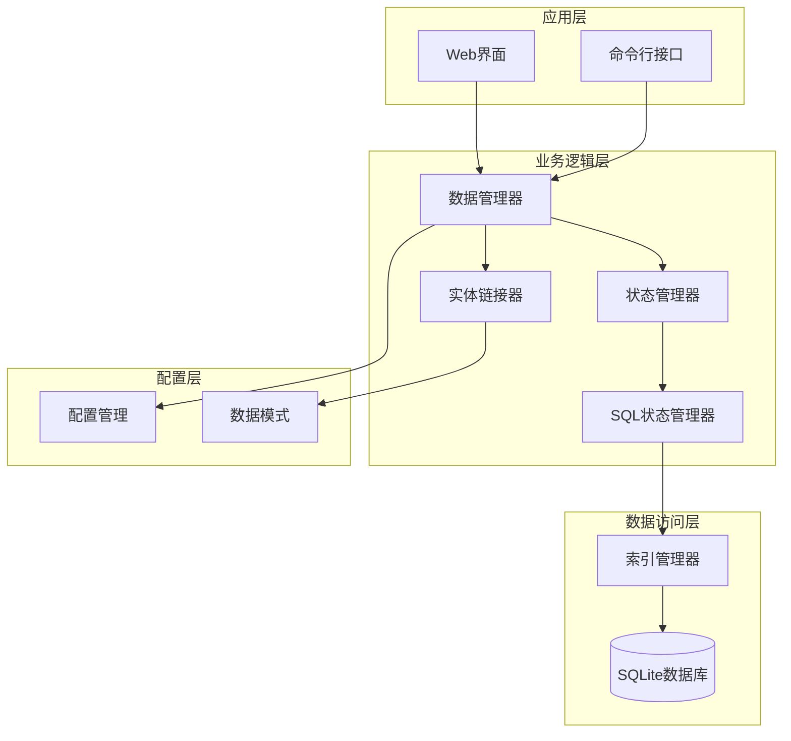
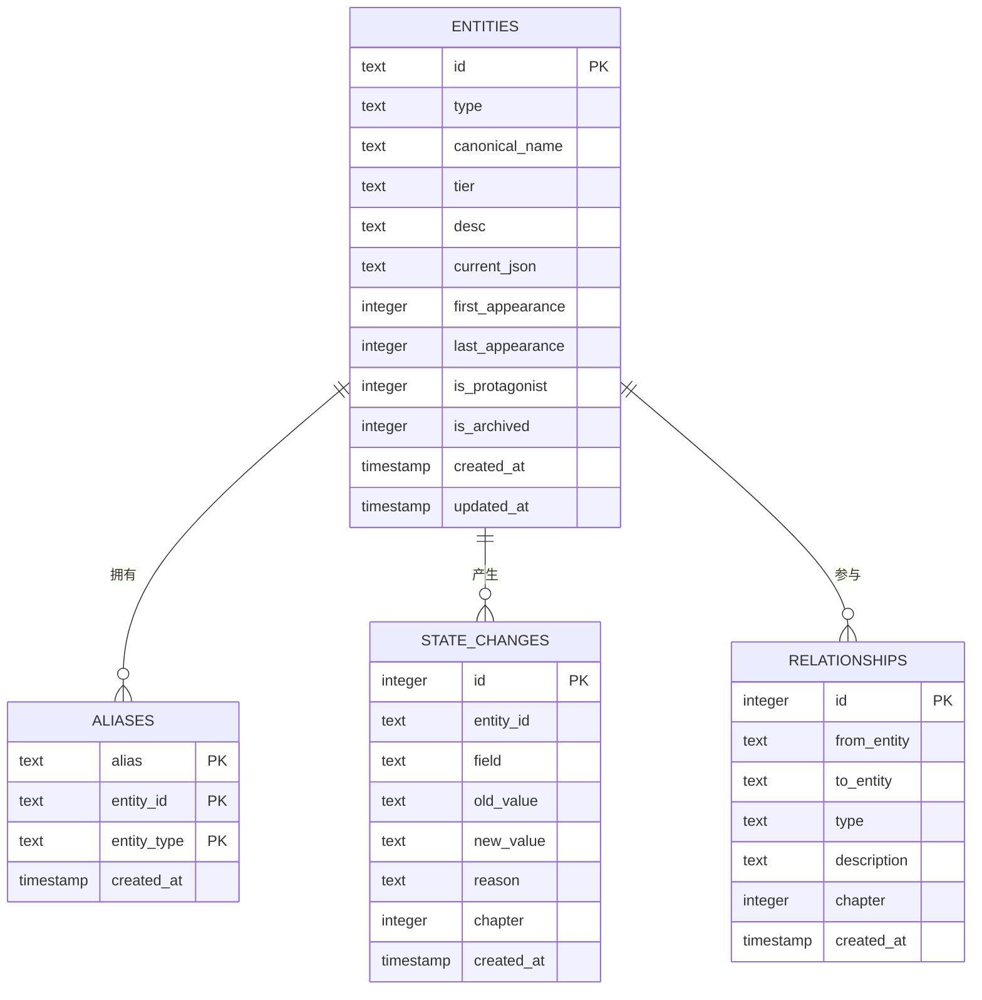
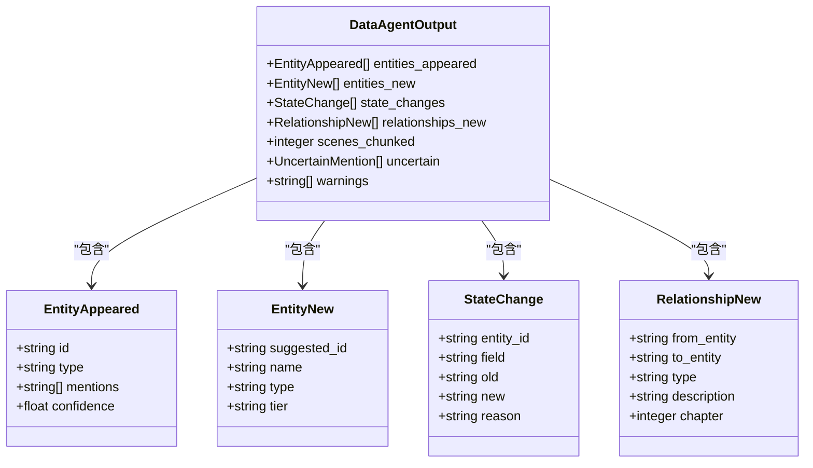
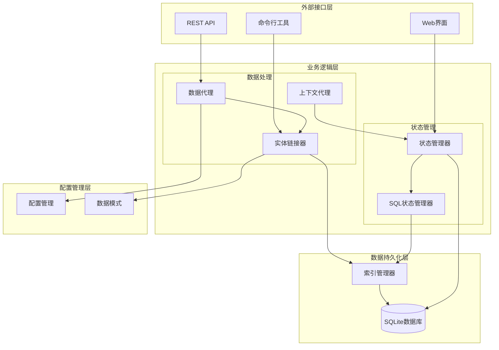
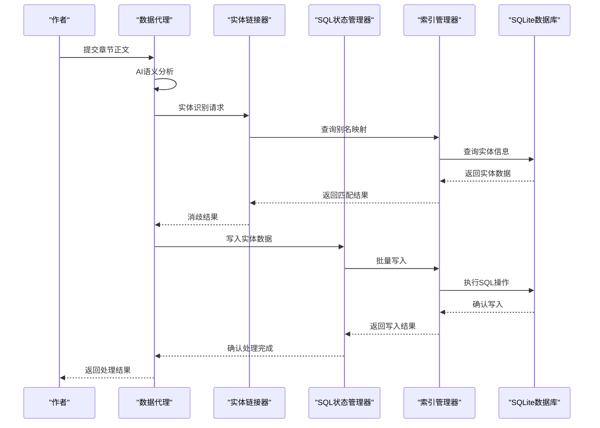
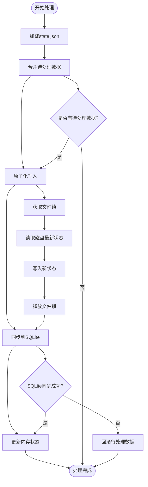
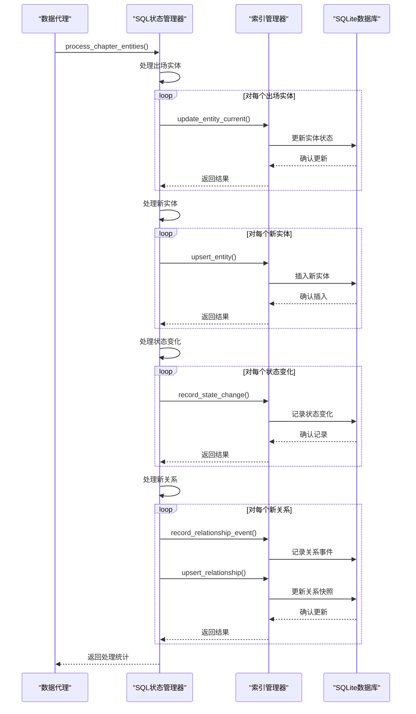
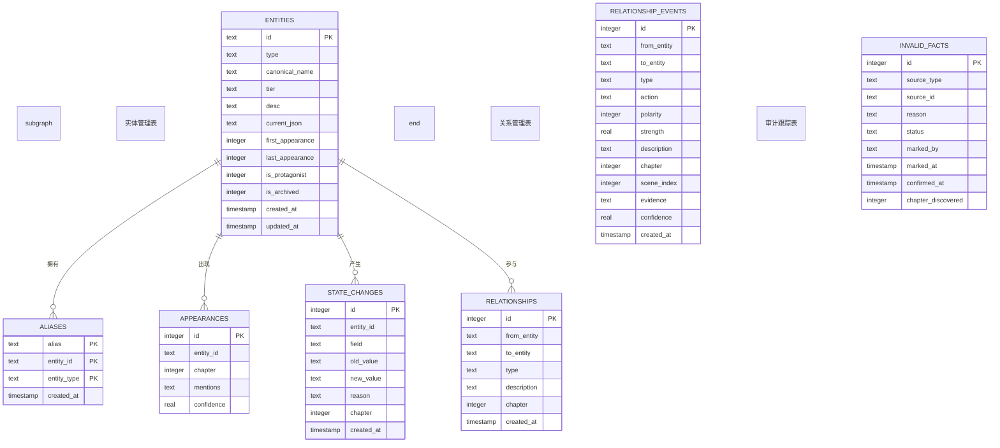
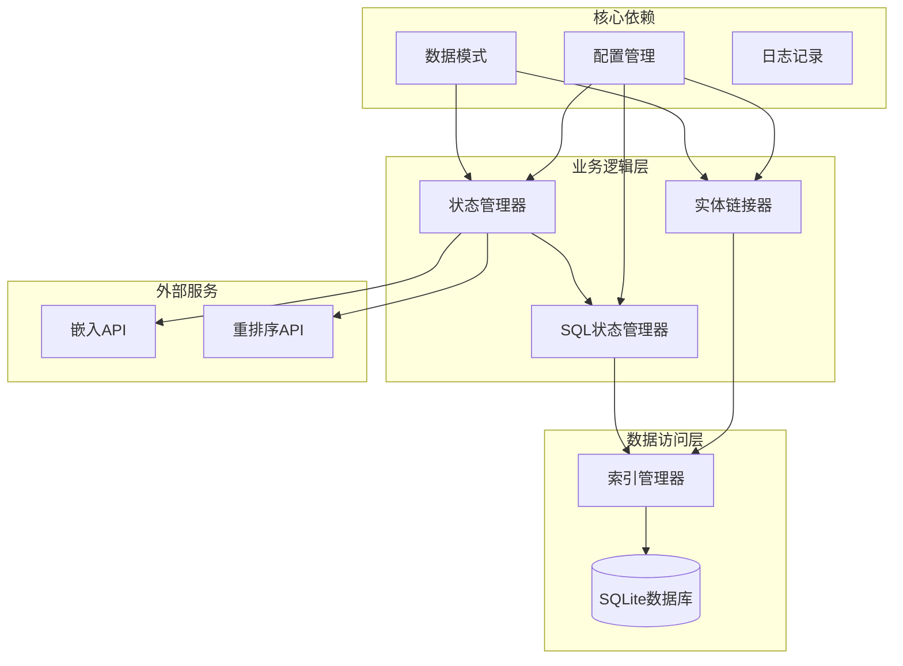
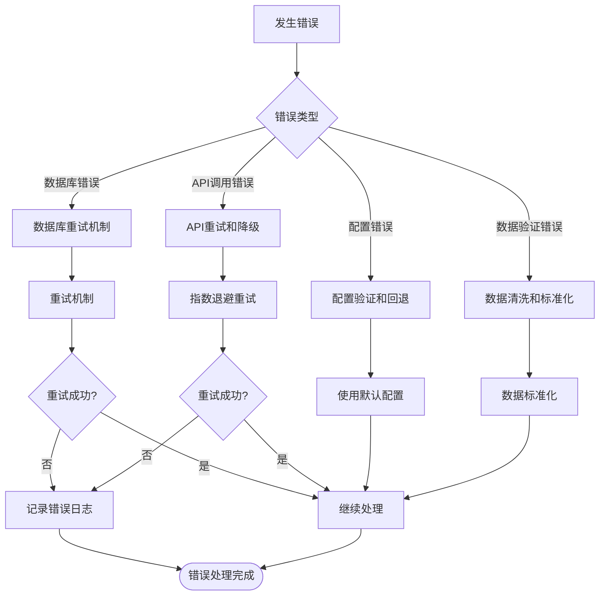

# 实体关系管理

<cite>
**本文档引用的文件**
- [entity-management-spec.md](file://webnovel-writer/references/entity-management-spec.md)
- [checker-output-schema.md](file://webnovel-writer/references/checker-output-schema.md)
- [entity_linker.py](file://webnovel-writer/scripts/data_modules/entity_linker.py)
- [schemas.py](file://webnovel-writer/scripts/data_modules/schemas.py)
- [state_manager.py](file://webnovel-writer/scripts/data_modules/state_manager.py)
- [sql_state_manager.py](file://webnovel-writer/scripts/data_modules/sql_state_manager.py)
- [index_manager.py](file://webnovel-writer/scripts/data_modules/index_manager.py)
- [index_entity_mixin.py](file://webnovel-writer/scripts/data_modules/index_entity_mixin.py)
- [config.py](file://webnovel-writer/scripts/data_modules/config.py)
- [consistency-checker.md](file://webnovel-writer/agents/consistency-checker.md)
- [test_entity_linker_cli.py](file://webnovel-writer/scripts/data_modules/tests/test_entity_linker_cli.py)
- [test_relationship_graph.py](file://webnovel-writer/scripts/data_modules/tests/test_relationship_graph.py)
</cite>

## 目录
1. [简介](#简介)
2. [项目结构](#项目结构)
3. [核心组件](#核心组件)
4. [架构概览](#架构概览)
5. [详细组件分析](#详细组件分析)
6. [依赖关系分析](#依赖关系分析)
7. [性能考虑](#性能考虑)
8. [故障排除指南](#故障排除指南)
9. [结论](#结论)
10. [附录](#附录)

## 简介

实体关系管理系统是一个基于SQLite的智能实体管理平台，专为网络小说创作设计。该系统实现了AI驱动的实体提取、别名管理、版本追踪和关系图谱构建功能。

### 系统特性

- **AI驱动实体提取**：通过Data Agent从纯文本语义中自动识别和提取实体
- **智能消歧机制**：基于置信度的实体消歧，支持>0.8自动采用、0.5-0.8警告、<0.5人工确认
- **双Agent架构**：Context Agent（读取）+ Data Agent（写入）协同工作
- **SQLite存储**：替代传统的state.json膨胀问题，提供高性能的数据持久化
- **关系图谱构建**：支持实体间关系的时序追踪和可视化展示

## 项目结构

系统采用模块化设计，主要分为以下几个层次：



**图表来源**
- [entity_linker.py:36-42](file://webnovel-writer/scripts/data_modules/entity_linker.py#L36-L42)
- [state_manager.py:90-140](file://webnovel-writer/scripts/data_modules/state_manager.py#L90-L140)
- [sql_state_manager.py:46-100](file://webnovel-writer/scripts/data_modules/sql_state_manager.py#L46-L100)
- [index_manager.py:228-234](file://webnovel-writer/scripts/data_modules/index_manager.py#L228-L234)

**章节来源**
- [entity-management-spec.md:20-85](file://webnovel-writer/references/entity-management-spec.md#L20-L85)
- [config.py:90-122](file://webnovel-writer/scripts/data_modules/config.py#L90-L122)

## 核心组件

### 实体管理规范

系统遵循严格的实体管理规范，定义了实体的生命周期管理和数据结构标准。

#### 实体类型分类

系统支持五种实体类型，每种类型具有不同的特征和管理策略：

| 实体类型 | 别名复杂度 | 属性变化 | 层级关系 | 管理重点 |
|---------|-----------|---------|---------|---------|
| 角色    | 高（多种称呼）| 高（境界/位置/关系）| 无 | 多称呼管理、属性追踪 |
| 地点    | 中（简称/全称）| 低（状态变化）| 有（省>市>区）| 地理层级、状态管理 |
| 物品    | 低（别称较少）| 中（升级/转移）| 无 | 升级追踪、归属管理 |
| 势力    | 中（简称/别称）| 中（等级/领地）| 有（总部>分部）| 组织架构、影响力 |
| 招式    | 低（别名少见）| 中（升级）| 无 | 技能等级、使用限制 |

#### 存储架构

系统采用SQLite数据库进行数据持久化，提供了完整的实体管理能力：



**图表来源**
- [entity-management-spec.md:38-84](file://webnovel-writer/references/entity-management-spec.md#L38-L84)

**章节来源**
- [entity-management-spec.md:87-96](file://webnovel-writer/references/entity-management-spec.md#L87-L96)
- [entity-management-spec.md:36-85](file://webnovel-writer/references/entity-management-spec.md#L36-L85)

### 数据模式定义

系统使用Pydantic模型定义数据结构，确保数据的一致性和完整性：

#### 核心数据模型



**图表来源**
- [schemas.py:13-77](file://webnovel-writer/scripts/data_modules/schemas.py#L13-L77)

**章节来源**
- [schemas.py:1-126](file://webnovel-writer/scripts/data_modules/schemas.py#L1-L126)

## 架构概览

系统采用分层架构设计，实现了清晰的职责分离和模块化组织。

### 整体架构



**图表来源**
- [entity_management_spec.md:101-131](file://webnovel-writer/references/entity-management-spec.md#L101-L131)
- [state_manager.py:90-140](file://webnovel-writer/scripts/data_modules/state_manager.py#L90-L140)

### 数据流处理

系统实现了完整的数据处理流水线，从原始文本到结构化数据的转换：



**图表来源**
- [entity-management-spec.md:101-131](file://webnovel-writer/references/entity-management-spec.md#L101-L131)
- [state_manager.py:371-407](file://webnovel-writer/scripts/data_modules/state_manager.py#L371-L407)

**章节来源**
- [entity-management-spec.md:99-131](file://webnovel-writer/references/entity-management-spec.md#L99-L131)

## 详细组件分析

### 实体链接器 (EntityLinker)

实体链接器是系统的核心组件，负责实体消歧和别名管理。

#### 核心功能

```mermaid
classDiagram
class EntityLinker {
-Config config
-IndexManager _index_manager
+register_alias(entity_id, alias, entity_type) bool
+lookup_alias(mention, entity_type) string
+lookup_alias_all(mention) Dict[]
+get_all_aliases(entity_id, entity_type) string[]
+evaluate_confidence(confidence) Tuple~str,bool,str~
+process_uncertain(mention, candidates, suggested,
confidence, context) DisambiguationResult
+process_extraction_result(uncertain_items)
Tuple~DisambiguationResult[],string[]~
+register_new_entities(new_entities) string[]
}
class DisambiguationResult {
+string mention
+string entity_id
+float confidence
+string[] candidates
+bool adopted
+string warning
}
EntityLinker --> DisambiguationResult : "创建"
EntityLinker --> IndexManager : "使用"
```

**图表来源**
- [entity_linker.py:36-177](file://webnovel-writer/scripts/data_modules/entity_linker.py#L36-L177)

#### 置信度评估机制

系统实现了多层次的置信度评估机制：

| 置信度范围 | 处理方式 | 系统行为 |
|-----------|---------|---------|
| > 0.8 | 自动采用 | 直接写入数据库，无需人工确认 |
| 0.5 - 0.8 | 采用但警告 | 写入数据库同时生成警告记录 |
| < 0.5 | 标记待人工确认 | 不自动写入，等待人工审核 |

**章节来源**
- [entity_linker.py:76-144](file://webnovel-writer/scripts/data_modules/entity_linker.py#L76-L144)
- [entity-management-spec.md:249-256](file://webnovel-writer/references/entity-management-spec.md#L249-L256)

### 状态管理器 (StateManager)

状态管理器负责管理实体状态和进度追踪，实现了原子化的文件写入机制。

#### 状态管理架构



**图表来源**
- [state_manager.py:208-370](file://webnovel-writer/scripts/data_modules/state_manager.py#L208-L370)

#### 增量写入机制

系统实现了高效的增量写入机制，避免了传统"读-改-写"模式的竞态条件：

**章节来源**
- [state_manager.py:208-370](file://webnovel-writer/scripts/data_modules/state_manager.py#L208-L370)

### SQL状态管理器 (SQLStateManager)

SQL状态管理器提供了与StateManager兼容的接口，但数据存储在SQLite中。

#### 批量处理流程



**图表来源**
- [sql_state_manager.py:267-417](file://webnovel-writer/scripts/data_modules/sql_state_manager.py#L267-L417)

**章节来源**
- [sql_state_manager.py:267-417](file://webnovel-writer/scripts/data_modules/sql_state_manager.py#L267-L417)

### 索引管理器 (IndexManager)

索引管理器是系统的底层数据访问层，提供了完整的数据库操作接口。

#### 数据库表结构

系统建立了完善的数据库表结构，支持复杂的实体关系管理：



**图表来源**
- [index_manager.py:295-414](file://webnovel-writer/scripts/data_modules/index_manager.py#L295-L414)

**章节来源**
- [index_manager.py:235-620](file://webnovel-writer/scripts/data_modules/index_manager.py#L235-L620)

## 依赖关系分析

系统采用了清晰的依赖层次结构，实现了良好的模块解耦。

### 组件依赖关系



**图表来源**
- [config.py:90-143](file://webnovel-writer/scripts/data_modules/config.py#L90-L143)
- [entity_linker.py:20-22](file://webnovel-writer/scripts/data_modules/entity_linker.py#L20-L22)
- [state_manager.py:29-41](file://webnovel-writer/scripts/data_modules/state_manager.py#L29-L41)

### 错误处理策略

系统实现了多层次的错误处理机制：



**图表来源**
- [config.py:153-156](file://webnovel-writer/scripts/data_modules/config.py#L153-L156)
- [state_manager.py:368-370](file://webnovel-writer/scripts/data_modules/state_manager.py#L368-L370)

**章节来源**
- [config.py:153-156](file://webnovel-writer/scripts/data_modules/config.py#L153-L156)
- [state_manager.py:368-370](file://webnovel-writer/scripts/data_modules/state_manager.py#L368-L370)

## 性能考虑

系统在设计时充分考虑了性能优化，采用了多种技术手段提升系统效率。

### 存储优化

- **SQLite索引优化**：为常用查询字段建立复合索引，提升查询性能
- **批量写入**：支持批量数据写入，减少数据库往返次数
- **增量更新**：只更新发生变化的数据，避免全量覆盖

### 缓存策略

- **内存缓存**：核心实体信息缓存在内存中，减少数据库访问
- **文件锁机制**：使用文件锁避免并发写入冲突
- **连接池管理**：复用数据库连接，减少连接开销

### 查询优化

- **分页查询**：大量数据查询使用分页机制，避免内存溢出
- **条件索引**：根据查询模式建立专门的索引
- **预编译语句**：使用预编译语句提升SQL执行效率

## 故障排除指南

### 常见问题及解决方案

#### 实体消歧问题

**问题现象**：别名歧义导致实体识别错误

**诊断步骤**：
1. 检查别名表中是否存在重复映射
2. 验证实体类型的区分度
3. 确认置信度阈值设置是否合理

**解决方案**：
- 使用实体ID代替别名进行精确匹配
- 为跨类型实体补充类型属性
- 调整置信度阈值配置

#### 数据同步问题

**问题现象**：state.json与SQLite数据不一致

**诊断步骤**：
1. 检查SQLite同步状态
2. 验证文件锁获取情况
3. 确认事务提交状态

**解决方案**：
- 手动触发数据同步
- 检查数据库权限设置
- 重启应用进程

#### 性能问题

**问题现象**：查询响应缓慢

**诊断步骤**：
1. 分析SQL执行计划
2. 检查索引使用情况
3. 监控数据库连接数

**解决方案**：
- 优化查询语句
- 添加必要的索引
- 调整数据库连接池大小

**章节来源**
- [entity-management-spec.md:235-248](file://webnovel-writer/references/entity-management-spec.md#L235-L248)
- [state_manager.py:368-370](file://webnovel-writer/scripts/data_modules/state_manager.py#L368-L370)

## 结论

实体关系管理系统通过模块化设计和SQLite数据库技术，实现了高效、可靠的实体管理功能。系统的主要优势包括：

1. **智能化处理**：AI驱动的实体提取和消歧机制
2. **高性能存储**：SQLite替代JSON，解决数据膨胀问题
3. **强一致性**：原子化写入和事务管理确保数据安全
4. **可扩展性**：模块化架构支持功能扩展和定制开发

该系统为网络小说创作提供了强大的实体关系管理能力，能够有效提升创作效率和作品质量。

## 附录

### API参考

#### 实体管理API

| 接口 | 方法 | 描述 |
|------|------|------|
| `/entities` | GET | 获取实体列表 |
| `/entities/{id}` | GET | 获取实体详情 |
| `/entities` | POST | 创建新实体 |
| `/entities/{id}` | PUT | 更新实体信息 |
| `/entities/{id}` | DELETE | 删除实体 |

#### 关系管理API

| 接口 | 方法 | 描述 |
|------|------|------|
| `/relationships` | GET | 获取关系列表 |
| `/relationships/{id}` | GET | 获取关系详情 |
| `/relationships` | POST | 创建新关系 |
| `/relationships/{id}` | PUT | 更新关系信息 |
| `/relationships/{id}` | DELETE | 删除关系 |

### 配置选项

系统提供了丰富的配置选项，支持不同场景下的需求：

- **嵌入API配置**：支持多种嵌入模型和服务提供商
- **检索配置**：可配置向量检索和BM25混合检索
- **并发配置**：可调节API调用的并发度和超时时间
- **缓存配置**：可设置缓存策略和过期时间