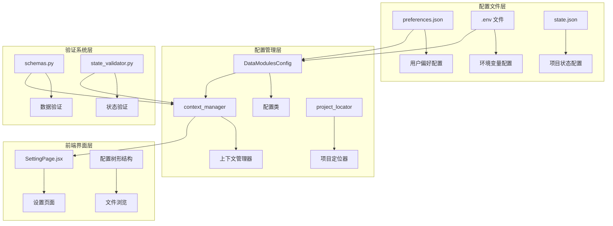
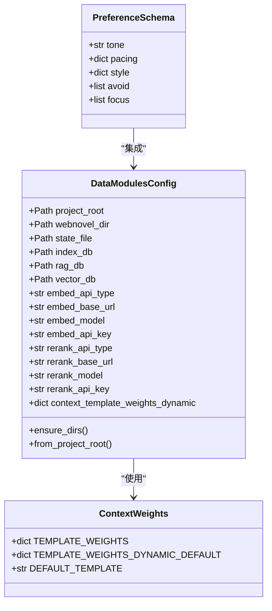
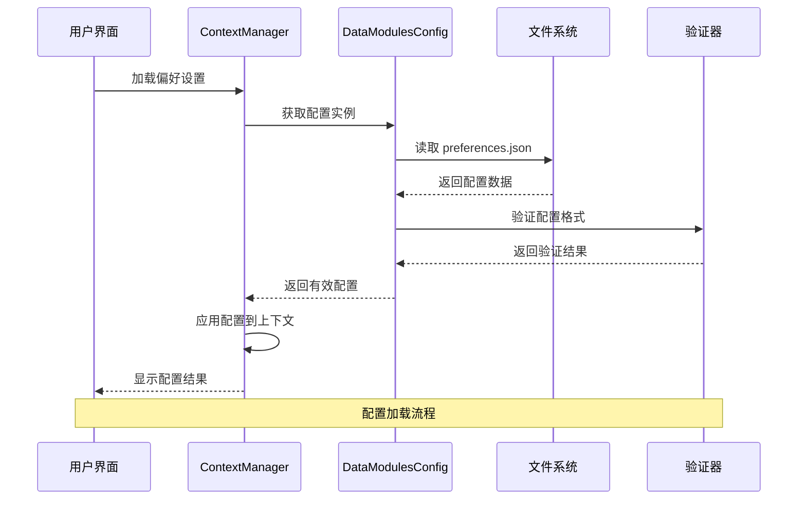
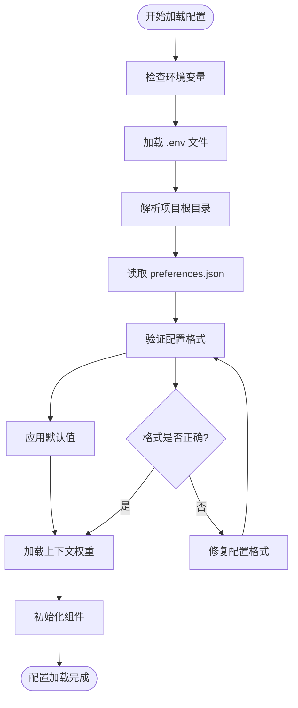
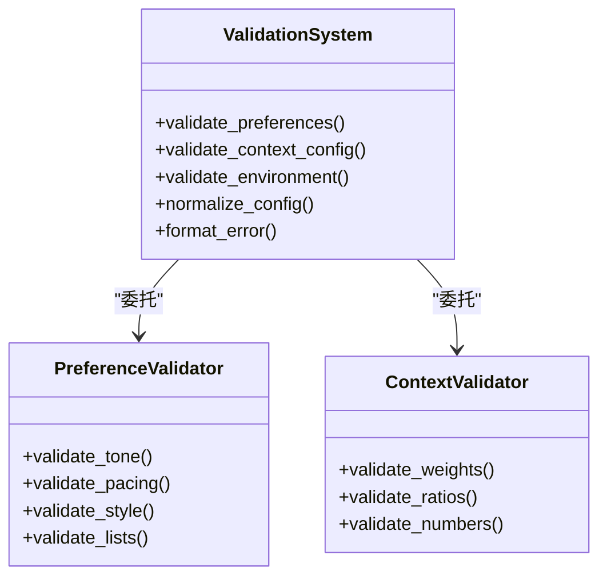
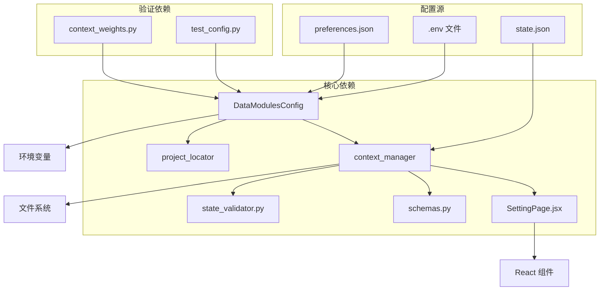
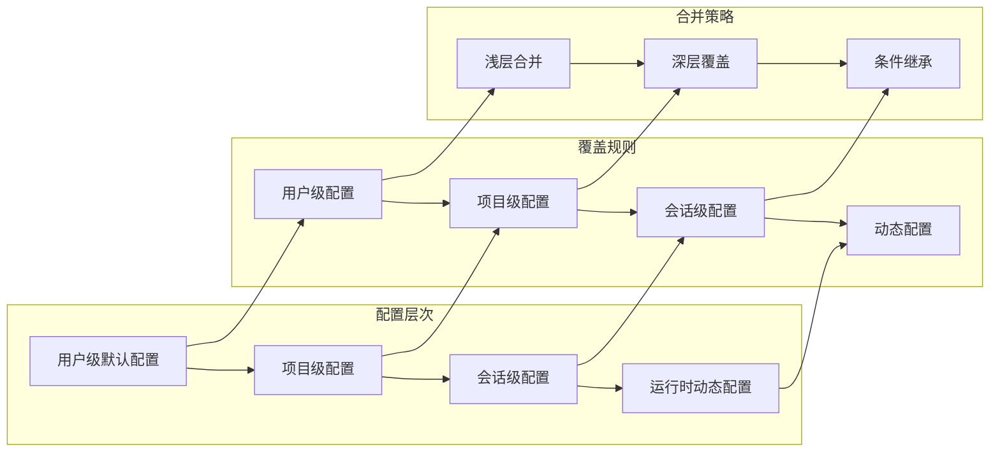
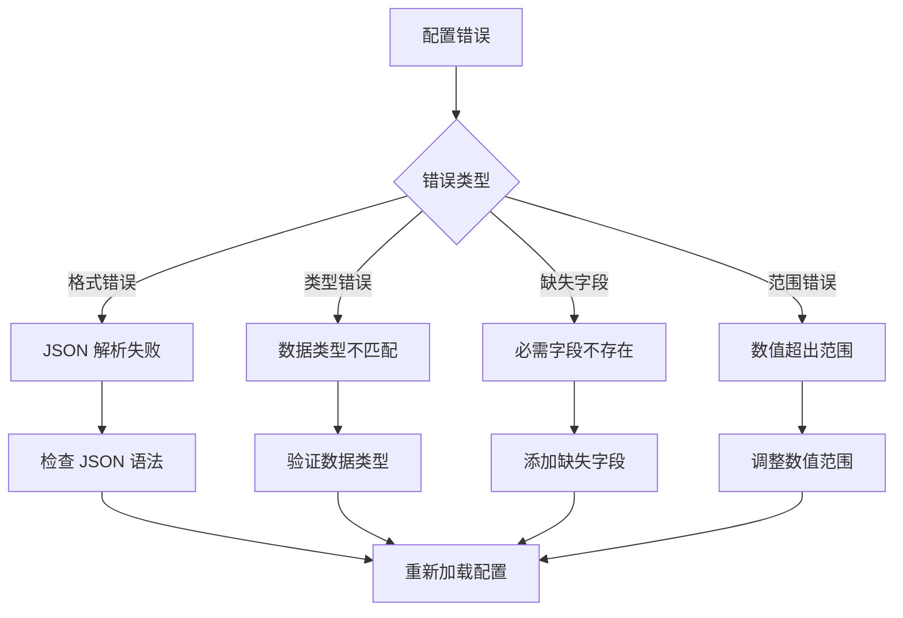

# 偏好设置数据模型

<cite>
**本文档引用的文件**
- [preferences-schema.md](file://webnovel-writer/references/preferences-schema.md)
- [config.py](file://webnovel-writer/scripts/data_modules/config.py)
- [context_weights.py](file://webnovel-writer/scripts/data_modules/context_weights.py)
- [context_manager.py](file://webnovel-writer/scripts/data_modules/context_manager.py)
- [SettingPage.jsx](file://webnovel-writer/dashboard/frontend/src/workbench/SettingPage.jsx)
- [project_locator.py](file://webnovel-writer/scripts/project_locator.py)
- [schemas.py](file://webnovel-writer/scripts/data_modules/schemas.py)
- [state_validator.py](file://webnovel-writer/scripts/data_modules/state_validator.py)
- [test_config.py](file://webnovel-writer/scripts/data_modules/tests/test_config.py)
</cite>

## 目录
1. [简介](#简介)
2. [项目结构](#项目结构)
3. [核心组件](#核心组件)
4. [架构概览](#架构概览)
5. [详细组件分析](#详细组件分析)
6. [依赖分析](#依赖分析)
7. [性能考虑](#性能考虑)
8. [故障排除指南](#故障排除指南)
9. [结论](#结论)
10. [附录](#附录)

## 简介

偏好设置数据模型是 WebNovel Writer 项目的核心配置系统，负责管理用户偏好配置、写作约束以及系统级设置。该系统采用分层架构设计，支持用户界面配置、系统级配置和项目级配置的多层级结构。

本系统主要服务于数字长篇小说创作工作流，通过结构化的配置数据驱动 AI 写作助手的行为，确保生成内容符合用户的创作风格和质量要求。

## 项目结构

偏好设置系统在项目中的组织结构如下：



**图表来源**
- [config.py:90-348](file://webnovel-writer/scripts/data_modules/config.py#L90-L348)
- [context_manager.py:259-638](file://webnovel-writer/scripts/data_modules/context_manager.py#L259-L638)
- [SettingPage.jsx:27-115](file://webnovel-writer/dashboard/frontend/src/workbench/SettingPage.jsx#L27-L115)

**章节来源**
- [config.py:1-349](file://webnovel-writer/scripts/data_modules/config.py#L1-L349)
- [preferences-schema.md:1-29](file://webnovel-writer/references/preferences-schema.md#L1-L29)

## 核心组件

### 配置数据模型

偏好设置系统的核心数据结构基于 Python 的 dataclass 和 Pydantic 模型设计，提供了强类型的配置管理能力。



**图表来源**
- [config.py:90-348](file://webnovel-writer/scripts/data_modules/config.py#L90-L348)
- [context_weights.py:10-38](file://webnovel-writer/scripts/data_modules/context_weights.py#L10-L38)
- [preferences-schema.md:7-21](file://webnovel-writer/references/preferences-schema.md#L7-L21)

### 配置层次结构

系统采用三层配置层次结构：

1. **用户级配置**：存储在用户主目录下的全局配置
2. **项目级配置**：存储在项目根目录的本地配置
3. **会话级配置**：运行时动态生成的临时配置

**章节来源**
- [config.py:20-77](file://webnovel-writer/scripts/data_modules/config.py#L20-L77)
- [context_manager.py:220](file://webnovel-writer/scripts/data_modules/context_manager.py#L220)

## 架构概览

偏好设置系统的整体架构采用分层设计，确保配置的灵活性和可维护性：



**图表来源**
- [context_manager.py:259-288](file://webnovel-writer/scripts/data_modules/context_manager.py#L259-L288)
- [config.py:329-348](file://webnovel-writer/scripts/data_modules/config.py#L329-L348)

## 详细组件分析

### 偏好设置数据结构

#### 基础配置字段

| 字段名称 | 数据类型 | 默认值 | 描述 |
|---------|---------|--------|------|
| tone | string | "中性" | 全局情绪基调 |
| pacing | object | {} | 节奏偏好配置 |
| style | object | {} | 叙事风格配置 |
| avoid | array[string] | [] | 禁忌内容列表 |
| focus | array[string] | [] | 重点关注方向 |

#### 节奏配置子结构

```mermaid
erDiagram
PACING {
int chapter_words
boolean cliffhanger
float words_per_point_excellent
float words_per_point_good
float words_per_point_acceptable
}
STYLE {
float dialogue_ratio
float narration_ratio
float transition_ratio
}
CONTEXT_CONFIG {
int vector_top_k
int rerank_top_n
float context_compact_head_ratio
boolean context_ranker_enabled
}
```

**图表来源**
- [preferences-schema.md:8-20](file://webnovel-writer/references/preferences-schema.md#L8-L20)
- [config.py:124-298](file://webnovel-writer/scripts/data_modules/config.py#L124-L298)

#### 上下文权重配置

系统实现了动态上下文权重机制，支持不同创作阶段的权重调整：

| 阶段 | plot | battle | emotion | transition |
|------|------|--------|---------|------------|
| early | 0.48/0.39/0.13 | 0.42/0.50/0.08 | 0.52/0.38/0.10 | 0.56/0.28/0.16 |
| mid | 0.40/0.35/0.25 | 0.35/0.45/0.20 | 0.45/0.35/0.20 | 0.50/0.25/0.25 |
| late | 0.36/0.29/0.35 | 0.31/0.39/0.30 | 0.41/0.29/0.30 | 0.46/0.21/0.33 |

**章节来源**
- [context_weights.py:19-38](file://webnovel-writer/scripts/data_modules/context_weights.py#L19-L38)
- [config.py:246-248](file://webnovel-writer/scripts/data_modules/config.py#L246-L248)

### 配置加载流程



**图表来源**
- [config.py:319-323](file://webnovel-writer/scripts/data_modules/config.py#L319-L323)
- [context_manager.py:220](file://webnovel-writer/scripts/data_modules/context_manager.py#L220)

**章节来源**
- [config.py:319-348](file://webnovel-writer/scripts/data_modules/config.py#L319-L348)
- [context_manager.py:259-288](file://webnovel-writer/scripts/data_modules/context_manager.py#L259-L288)

### 配置验证机制

系统实现了多层次的配置验证机制：



**图表来源**
- [schemas.py:79-98](file://webnovel-writer/scripts/data_modules/schemas.py#L79-L98)
- [state_validator.py:101-146](file://webnovel-writer/scripts/data_modules/state_validator.py#L101-L146)

**章节来源**
- [schemas.py:67-98](file://webnovel-writer/scripts/data_modules/schemas.py#L67-L98)
- [state_validator.py:101-146](file://webnovel-writer/scripts/data_modules/state_validator.py#L101-L146)

## 依赖分析

### 组件间依赖关系



**图表来源**
- [config.py:90-348](file://webnovel-writer/scripts/data_modules/config.py#L90-L348)
- [context_manager.py:259-638](file://webnovel-writer/scripts/data_modules/context_manager.py#L259-L638)

### 配置继承关系

系统实现了灵活的配置继承机制：



**图表来源**
- [config.py:20-77](file://webnovel-writer/scripts/data_modules/config.py#L20-L77)
- [project_locator.py:85-188](file://webnovel-writer/scripts/project_locator.py#L85-L188)

**章节来源**
- [config.py:20-77](file://webnovel-writer/scripts/data_modules/config.py#L20-L77)
- [project_locator.py:85-188](file://webnovel-writer/scripts/project_locator.py#L85-L188)

## 性能考虑

### 配置加载优化

系统采用了多种性能优化策略：

1. **延迟加载**：配置按需加载，避免不必要的初始化
2. **缓存机制**：配置结果缓存，减少重复计算
3. **异步处理**：大文件配置的异步加载
4. **内存管理**：及时释放不再使用的配置对象

### 内存使用优化

| 配置类型 | 内存占用 | 优化策略 |
|---------|---------|---------|
| 偏好配置 | 小量数据 | 直接缓存 |
| 上下文权重 | 中等数据 | 分阶段加载 |
| 环境变量 | 轻量数据 | 延迟解析 |
| 项目配置 | 大量数据 | 懒加载 |

## 故障排除指南

### 常见配置错误



**图表来源**
- [schemas.py:92-98](file://webnovel-writer/scripts/data_modules/schemas.py#L92-L98)
- [state_validator.py:121-146](file://webnovel-writer/scripts/data_modules/state_validator.py#L121-L146)

### 错误处理机制

系统提供了完善的错误处理机制：

1. **验证错误**：捕获并格式化验证异常
2. **文件错误**：处理文件读取和写入异常
3. **网络错误**：处理 API 调用失败
4. **配置回滚**：自动回滚到安全配置

**章节来源**
- [schemas.py:92-98](file://webnovel-writer/scripts/data_modules/schemas.py#L92-L98)
- [config.py:106-115](file://webnovel-writer/scripts/data_modules/config.py#L106-L115)

## 结论

偏好设置数据模型为 WebNovel Writer 提供了强大而灵活的配置管理能力。通过分层架构设计、多层次验证机制和智能继承规则，系统能够满足不同用户和项目的需求。

该模型的主要优势包括：
- **模块化设计**：清晰的组件分离和职责划分
- **强类型支持**：编译时类型检查和运行时验证
- **灵活继承**：支持多层级配置的智能合并
- **性能优化**：高效的配置加载和缓存机制
- **错误处理**：完善的异常捕获和恢复机制

## 附录

### JSON Schema 定义

```json
{
  "$schema": "http://json-schema.org/draft-07/schema#",
  "title": "Preferences Schema",
  "type": "object",
  "properties": {
    "tone": {
      "type": "string",
      "description": "全局情绪基调",
      "default": "中性"
    },
    "pacing": {
      "type": "object",
      "properties": {
        "chapter_words": {
          "type": "integer",
          "minimum": 100,
          "maximum": 10000
        },
        "cliffhanger": {
          "type": "boolean"
        }
      },
      "required": ["chapter_words", "cliffhanger"]
    },
    "style": {
      "type": "object",
      "properties": {
        "dialogue_ratio": {
          "type": "number",
          "minimum": 0,
          "maximum": 1
        },
        "narration_ratio": {
          "type": "number",
          "minimum": 0,
          "maximum": 1
        }
      },
      "required": ["dialogue_ratio", "narration_ratio"]
    },
    "avoid": {
      "type": "array",
      "items": {
        "type": "string"
      }
    },
    "focus": {
      "type": "array",
      "items": {
        "type": "string"
      }
    }
  },
  "required": ["tone", "pacing", "style"]
}
```

### 示例配置文件

**基础配置示例**：
```json
{
  "tone": "热血",
  "pacing": {
    "chapter_words": 2500,
    "cliffhanger": true
  },
  "style": {
    "dialogue_ratio": 0.35,
    "narration_ratio": 0.65
  },
  "avoid": ["过度旁白", "重复台词"],
  "focus": ["主角成长", "战斗描写"]
}
```

**高级配置示例**：
```json
{
  "tone": "悬疑",
  "pacing": {
    "chapter_words": 3000,
    "cliffhanger": true,
    "words_per_point_excellent": 800,
    "words_per_point_good": 1200
  },
  "style": {
    "dialogue_ratio": 0.40,
    "narration_ratio": 0.60,
    "transition_ratio": 0.20
  },
  "avoid": ["时间跳跃", "信息泄露"],
  "focus": ["情节推进", "角色发展", "悬念设置"]
}
```

### 配置迁移策略

系统提供了平滑的配置迁移机制：

1. **版本检测**：自动检测配置文件版本
2. **向后兼容**：支持旧版本配置的自动转换
3. **增量更新**：逐步更新配置字段而不影响现有功能
4. **备份保护**：迁移前自动备份原始配置

**章节来源**
- [preferences-schema.md:1-29](file://webnovel-writer/references/preferences-schema.md#L1-L29)
- [config.py:80-87](file://webnovel-writer/scripts/data_modules/config.py#L80-L87)