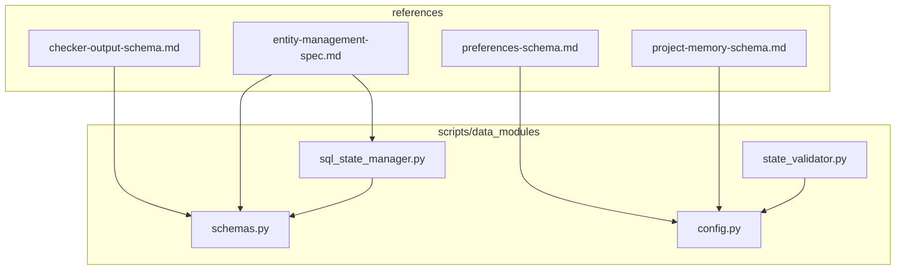
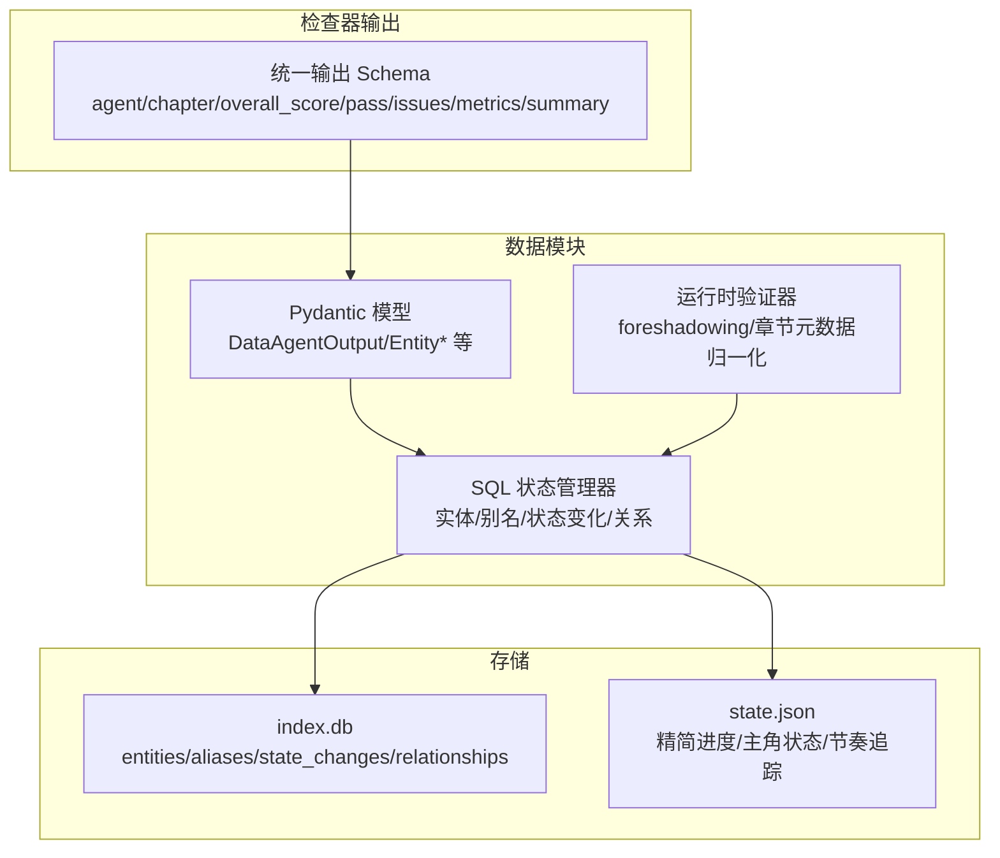
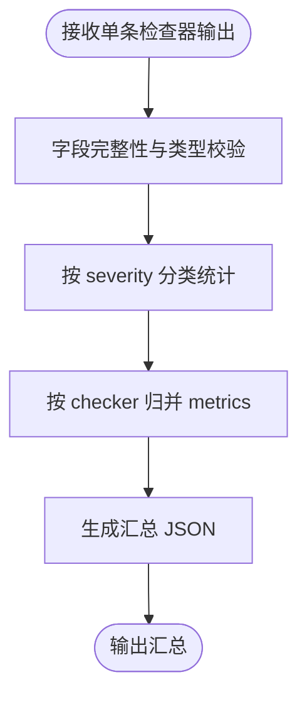
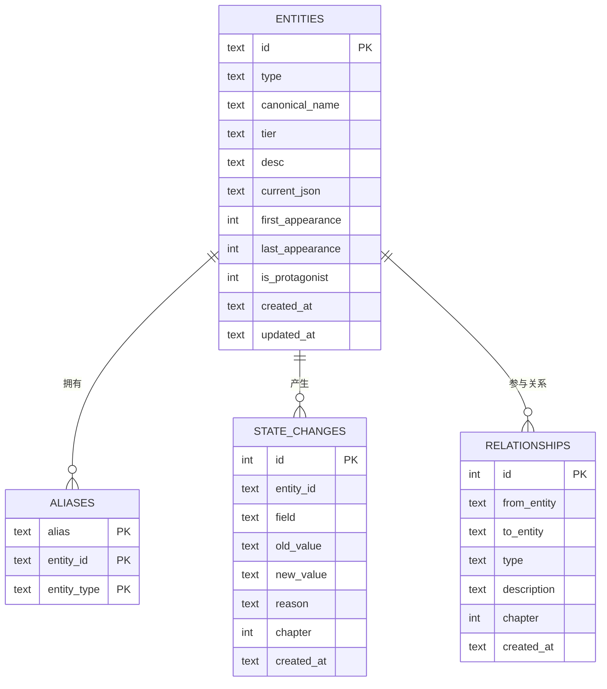
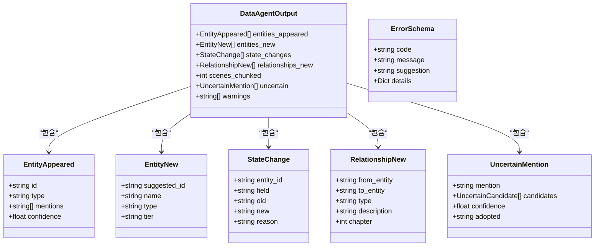
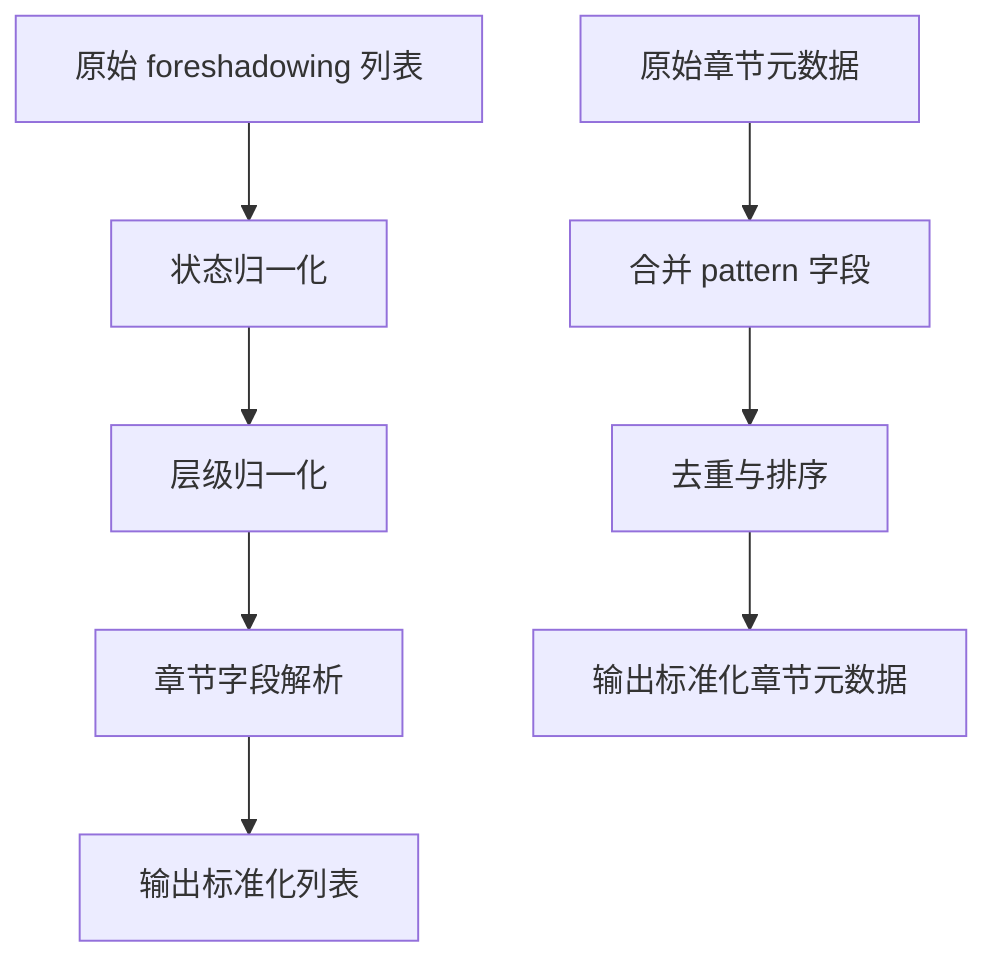
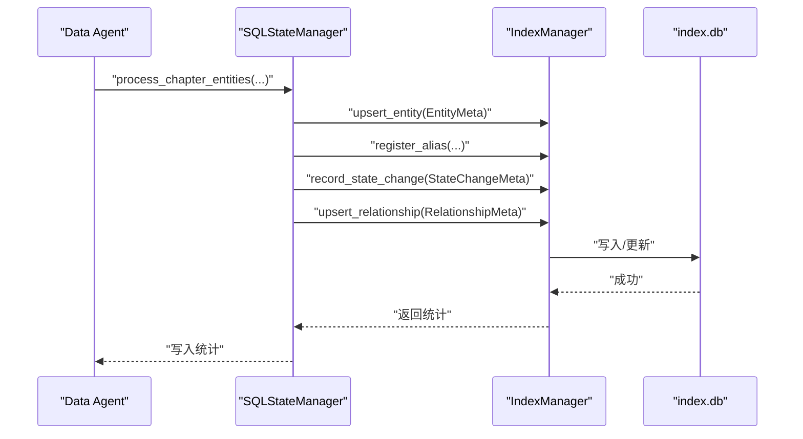
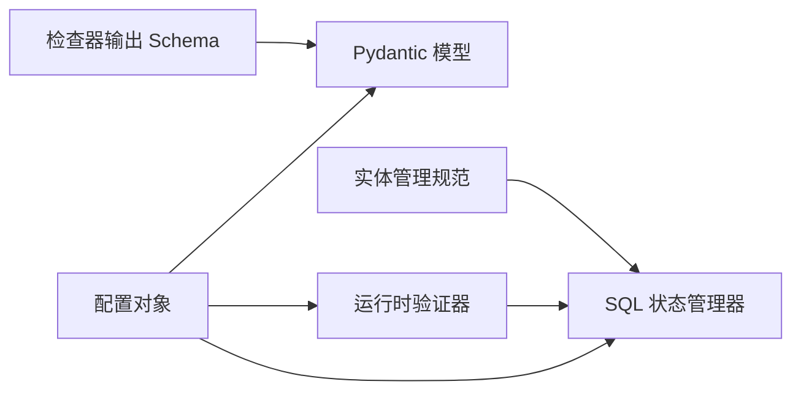

# 数据模型规范

<cite>
**本文引用的文件**
- [checker-output-schema.md](file://webnovel-writer/references/checker-output-schema.md)
- [preferences-schema.md](file://webnovel-writer/references/preferences-schema.md)
- [project-memory-schema.md](file://webnovel-writer/references/project-memory-schema.md)
- [entity-management-spec.md](file://webnovel-writer/references/entity-management-spec.md)
- [schemas.py](file://webnovel-writer/scripts/data_modules/schemas.py)
- [state_validator.py](file://webnovel-writer/scripts/data_modules/state_validator.py)
- [sql_state_manager.py](file://webnovel-writer/scripts/data_modules/sql_state_manager.py)
- [config.py](file://webnovel-writer/scripts/data_modules/config.py)
</cite>

## 目录
1. [简介](#简介)
2. [项目结构](#项目结构)
3. [核心组件](#核心组件)
4. [架构总览](#架构总览)
5. [详细组件分析](#详细组件分析)
6. [依赖关系分析](#依赖关系分析)
7. [性能考量](#性能考量)
8. [故障排查指南](#故障排查指南)
9. [结论](#结论)
10. [附录](#附录)

## 简介
本文件系统化梳理本仓库中的数据模型规范，涵盖以下方面：
- 检查器输出格式标准：字段约束、数据类型、严重度分级、汇总格式
- 偏好设置系统：数据结构、配置项、默认值管理
- 核心约束与验证：运行时规范化、错误处理、兼容性策略
- 实体管理规范：SQLite 存储、Schema、ID 生成、迁移策略
- 版本管理与向后兼容：兼容导出、CLI 命令、迁移工具链
- JSON Schema 定义与示例：字段说明、示例数据、验证规则

## 项目结构
围绕数据模型的关键文件主要分布在以下位置：
- references：定义统一的输出格式与实体管理规范
- scripts/data_modules：Python 数据模块，包含 Pydantic 模型、运行时验证器、SQL 状态管理器、配置对象

图表来源
- [checker-output-schema.md:1-169](file://webnovel-writer/references/checker-output-schema.md#L1-L169)
- [preferences-schema.md:1-29](file://webnovel-writer/references/preferences-schema.md#L1-L29)
- [project-memory-schema.md:1-26](file://webnovel-writer/references/project-memory-schema.md#L1-L26)
- [entity-management-spec.md:1-296](file://webnovel-writer/references/entity-management-spec.md#L1-L296)
- [schemas.py:1-126](file://webnovel-writer/scripts/data_modules/schemas.py#L1-L126)
- [state_validator.py:1-250](file://webnovel-writer/scripts/data_modules/state_validator.py#L1-L250)
- [sql_state_manager.py:1-595](file://webnovel-writer/scripts/data_modules/sql_state_manager.py#L1-L595)
- [config.py:1-349](file://webnovel-writer/scripts/data_modules/config.py#L1-L349)

章节来源
- [checker-output-schema.md:1-169](file://webnovel-writer/references/checker-output-schema.md#L1-L169)
- [preferences-schema.md:1-29](file://webnovel-writer/references/preferences-schema.md#L1-L29)
- [project-memory-schema.md:1-26](file://webnovel-writer/references/project-memory-schema.md#L1-L26)
- [entity-management-spec.md:1-296](file://webnovel-writer/references/entity-management-spec.md#L1-L296)
- [schemas.py:1-126](file://webnovel-writer/scripts/data_modules/schemas.py#L1-L126)
- [state_validator.py:1-250](file://webnovel-writer/scripts/data_modules/state_validator.py#L1-L250)
- [sql_state_manager.py:1-595](file://webnovel-writer/scripts/data_modules/sql_state_manager.py#L1-L595)
- [config.py:1-349](file://webnovel-writer/scripts/data_modules/config.py#L1-L349)

## 核心组件
- 检查器输出统一 Schema：定义了 agent、chapter、overall_score、pass、issues、metrics、summary 等字段及严重度分级，并给出各 Checker 的 metrics 示例
- 偏好设置 Schema：preferences.json 的结构与字段说明
- 项目记忆 Schema：project_memory.json 的结构与字段说明
- 实体管理规范：SQLite Schema、实体类型、ID 生成、别名冲突处理、迁移策略
- 数据模块 Pydantic 模型：Data Agent 输出的标准化模型与校验器
- 运行时验证器：foreshadowing 状态/层级归一化、章节元数据合并与去重
- SQL 状态管理器：SQLite 存储的实体、别名、状态变化、关系的读写与批量处理
- 配置对象：API、检索、并发、预算、权重等配置项

章节来源
- [checker-output-schema.md:10-169](file://webnovel-writer/references/checker-output-schema.md#L10-L169)
- [preferences-schema.md:5-29](file://webnovel-writer/references/preferences-schema.md#L5-L29)
- [project-memory-schema.md:5-26](file://webnovel-writer/references/project-memory-schema.md#L5-L26)
- [entity-management-spec.md:36-85](file://webnovel-writer/references/entity-management-spec.md#L36-L85)
- [schemas.py:13-126](file://webnovel-writer/scripts/data_modules/schemas.py#L13-L126)
- [state_validator.py:79-250](file://webnovel-writer/scripts/data_modules/state_validator.py#L79-L250)
- [sql_state_manager.py:46-418](file://webnovel-writer/scripts/data_modules/sql_state_manager.py#L46-L418)
- [config.py:90-349](file://webnovel-writer/scripts/data_modules/config.py#L90-L349)

## 架构总览
数据模型贯穿“检查器输出 → 数据模块 → SQLite 存储 → 上下文生成”的链路。

图表来源
- [checker-output-schema.md:10-169](file://webnovel-writer/references/checker-output-schema.md#L10-L169)
- [schemas.py:67-126](file://webnovel-writer/scripts/data_modules/schemas.py#L67-L126)
- [state_validator.py:156-250](file://webnovel-writer/scripts/data_modules/state_validator.py#L156-L250)
- [sql_state_manager.py:46-418](file://webnovel-writer/scripts/data_modules/sql_state_manager.py#L46-L418)
- [entity-management-spec.md:36-85](file://webnovel-writer/references/entity-management-spec.md#L36-L85)

## 详细组件分析

### 检查器输出统一 Schema
- 字段与类型
  - agent: string，必填
  - chapter: int，必填
  - overall_score: int，范围 0-100，必填
  - pass: bool，必填
  - issues: array，必填，元素包含 id、type、severity、location、description、suggestion、can_override
  - metrics: object，必填，按不同 checker 定义
  - summary: string，必填
- 严重度分级：critical/high/medium/low，对应不同的处理优先级
- 汇总格式：按 checker 汇总 score、pass、各类严重度计数，以及总体统计

图表来源
- [checker-output-schema.md:34-169](file://webnovel-writer/references/checker-output-schema.md#L34-L169)

章节来源
- [checker-output-schema.md:10-169](file://webnovel-writer/references/checker-output-schema.md#L10-L169)

### 偏好设置系统
- 结构要点
  - tone: 全局情绪基调
  - pacing: 节奏偏好（如 chapter_words、cliffhanger）
  - style: 叙事/对话比例（dialogue_ratio、narration_ratio）
  - avoid/focus: 禁忌与强调方向
- 默认值与管理
  - 通过配置对象集中管理偏好参数，结合环境变量与 .env 文件加载
  - 通过 CLI 或初始化流程写入/更新 preferences.json

章节来源
- [preferences-schema.md:5-29](file://webnovel-writer/references/preferences-schema.md#L5-L29)
- [config.py:90-349](file://webnovel-writer/scripts/data_modules/config.py#L90-L349)

### 项目记忆 Schema
- 结构要点
  - patterns: 列表，每项包含 pattern_type、description、source_chapter、learned_at
- 用途
  - 保存长期可复用的写作模式，供学习与复用

章节来源
- [project-memory-schema.md:5-26](file://webnovel-writer/references/project-memory-schema.md#L5-L26)

### 实体管理规范与 SQLite Schema
- 存储架构
  - entities、aliases、state_changes、relationships 等表
  - 实体类型：角色/地点/物品/势力/招式
  - tier：核心/重要/次要/装饰
- ID 生成规则
  - 基于拼音与类型前缀，冲突时追加数字后缀
- 错误处理
  - 别名冲突：同一别名命中多个实体时报错，需改用 id 或补充 type
  - 置信度处理：>0.8 自动采用，0.5-0.8 警告，<0.5 待人工确认
- 迁移策略
  - 运行迁移脚本，备份后将数据迁移到 index.db，清理旧字段

图表来源
- [entity-management-spec.md:36-85](file://webnovel-writer/references/entity-management-spec.md#L36-L85)

章节来源
- [entity-management-spec.md:1-296](file://webnovel-writer/references/entity-management-spec.md#L1-L296)

### 数据模块 Pydantic 模型与校验
- 模型定义
  - EntityAppeared、EntityNew、StateChange、RelationshipNew、UncertainMention、DataAgentOutput、ErrorSchema
- 校验与归一化
  - validate_data_agent_output：校验 Data Agent 输出
  - format_validation_error：格式化校验错误
  - normalize_data_agent_output：确保列表字段为数组，缺失字段补默认值

图表来源
- [schemas.py:13-126](file://webnovel-writer/scripts/data_modules/schemas.py#L13-L126)

章节来源
- [schemas.py:13-126](file://webnovel-writer/scripts/data_modules/schemas.py#L13-L126)

### 运行时验证与规范化
- foreshadowing 状态与层级归一化：将多种文本映射到统一状态/层级枚举
- 章节元数据合并：从多种字段来源合并 pattern 列表，去重并写入统一字段
- 章节元数据查询：支持按 000N 或字符串章节键访问

图表来源
- [state_validator.py:79-250](file://webnovel-writer/scripts/data_modules/state_validator.py#L79-L250)

章节来源
- [state_validator.py:1-250](file://webnovel-writer/scripts/data_modules/state_validator.py#L1-L250)

### SQL 状态管理器
- 能力概览
  - 实体 Upsert、别名注册、核心实体查询、主角查询
  - 状态变化记录与查询、关系 Upsert 与查询
  - 批量处理章节实体数据（Data Agent 主入口）
- 数据一致性
  - 通过事务与 SQL 直接更新保证 last_appearance 与 updated_at 一致性
- 兼容导出
  - 导出为 entities_v3 与 alias_index 格式，便于迁移与兼容

图表来源
- [sql_state_manager.py:267-418](file://webnovel-writer/scripts/data_modules/sql_state_manager.py#L267-L418)
- [entity-management-spec.md:36-85](file://webnovel-writer/references/entity-management-spec.md#L36-L85)

章节来源
- [sql_state_manager.py:1-595](file://webnovel-writer/scripts/data_modules/sql_state_manager.py#L1-L595)

### 配置与默认值管理
- 配置来源
  - 环境变量与 .env 文件（项目级与全局）
  - DataModulesConfig 提供统一配置对象
- 关键配置类别
  - API：Embedding/Rerank 基础地址、模型、密钥
  - 并发与超时：并发度、批大小、超时、重试
  - 检索与图谱：TopK、RRF、Graph-RAG 开关与权重
  - 实体提取：置信度阈值
  - 预算与权重：上下文预算、模板权重动态配置
  - 查询限制：最近章节、场景、出场等查询上限
  - 伏笔紧急度与角色活跃度：阈值与权重
  - 节奏与爽点：strand/weave 与 pacing 段长、阈值

章节来源
- [config.py:1-349](file://webnovel-writer/scripts/data_modules/config.py#L1-L349)

## 依赖关系分析
- 检查器输出 Schema 与 Pydantic 模型相互印证，前者定义字段与约束，后者提供运行时校验
- 实体管理规范驱动 SQL 状态管理器的表结构与操作
- 运行时验证器作用于 state.json 的结构化片段，确保一致性
- 配置对象贯穿 API、检索、权重、预算等模块，形成统一的默认值与行为

图表来源
- [checker-output-schema.md:10-169](file://webnovel-writer/references/checker-output-schema.md#L10-L169)
- [schemas.py:67-126](file://webnovel-writer/scripts/data_modules/schemas.py#L67-L126)
- [entity-management-spec.md:36-85](file://webnovel-writer/references/entity-management-spec.md#L36-L85)
- [sql_state_manager.py:46-418](file://webnovel-writer/scripts/data_modules/sql_state_manager.py#L46-L418)
- [state_validator.py:156-250](file://webnovel-writer/scripts/data_modules/state_validator.py#L156-L250)
- [config.py:90-349](file://webnovel-writer/scripts/data_modules/config.py#L90-L349)

章节来源
- [schemas.py:13-126](file://webnovel-writer/scripts/data_modules/schemas.py#L13-L126)
- [sql_state_manager.py:46-418](file://webnovel-writer/scripts/data_modules/sql_state_manager.py#L46-L418)
- [state_validator.py:156-250](file://webnovel-writer/scripts/data_modules/state_validator.py#L156-L250)
- [config.py:90-349](file://webnovel-writer/scripts/data_modules/config.py#L90-L349)

## 性能考量
- SQLite 存储替代 state.json 大字段，降低 JSON 体积与解析开销
- 批量写入与直接 SQL 更新（如 last_appearance）减少往返与锁竞争
- 运行时验证器对输入进行归一化，避免后续处理分支与重复计算
- 配置化的并发与批大小、TopK 与 RRF 参数，平衡召回质量与响应时间

## 故障排查指南
- 校验失败
  - 使用 format_validation_error 获取标准化错误结构，包含错误明细与建议
- 别名歧义
  - 当同一别名命中多个实体时，提示改用 id 或补充 type
- 置信度问题
  - <0.5 的实体提取标记为待人工确认，避免错误写入
- 迁移失败
  - 通过迁移脚本备份后执行，完成后使用统计命令核验

章节来源
- [schemas.py:88-126](file://webnovel-writer/scripts/data_modules/schemas.py#L88-L126)
- [entity-management-spec.md:235-256](file://webnovel-writer/references/entity-management-spec.md#L235-L256)
- [entity-management-spec.md:259-275](file://webnovel-writer/references/entity-management-spec.md#L259-L275)

## 结论
本规范以“统一输出 Schema + Pydantic 校验 + SQLite 存储 + 运行时验证 + 配置化默认值”为核心，构建了可扩展、可迁移、可维护的数据模型体系。检查器输出与实体管理在结构与约束上高度一致，配合完善的错误处理与迁移策略，确保长期演进过程中的稳定性与一致性。

## 附录

### JSON Schema 定义与示例
- 检查器输出统一 Schema
  - 字段与类型：见“字段说明”表格
  - 示例：见“示例”区域
  - 严重度：见“严重度定义”
  - 各 Checker metrics：见“各 Checker 特定 metrics”
  - 汇总格式：见“汇总格式”
- 偏好设置 Schema
  - 示例：见“示例”区域
  - 字段说明：见“字段说明”
- 项目记忆 Schema
  - 示例：见“示例”区域
  - 字段说明：见“字段说明”

章节来源
- [checker-output-schema.md:10-169](file://webnovel-writer/references/checker-output-schema.md#L10-L169)
- [preferences-schema.md:5-29](file://webnovel-writer/references/preferences-schema.md#L5-L29)
- [project-memory-schema.md:5-26](file://webnovel-writer/references/project-memory-schema.md#L5-L26)

### 验证规则说明
- 字段必填与类型：Pydantic 模型与 Schema 明确字段类型与必填性
- 严重度与处理：按 severity 分类统计与处理
- 运行时归一化：foreshadowing 状态/层级、章节元数据合并与去重
- 兼容导出：entities_v3 与 alias_index 格式，便于迁移与回滚

章节来源
- [schemas.py:67-126](file://webnovel-writer/scripts/data_modules/schemas.py#L67-L126)
- [state_validator.py:156-250](file://webnovel-writer/scripts/data_modules/state_validator.py#L156-L250)
- [sql_state_manager.py:439-488](file://webnovel-writer/scripts/data_modules/sql_state_manager.py#L439-L488)