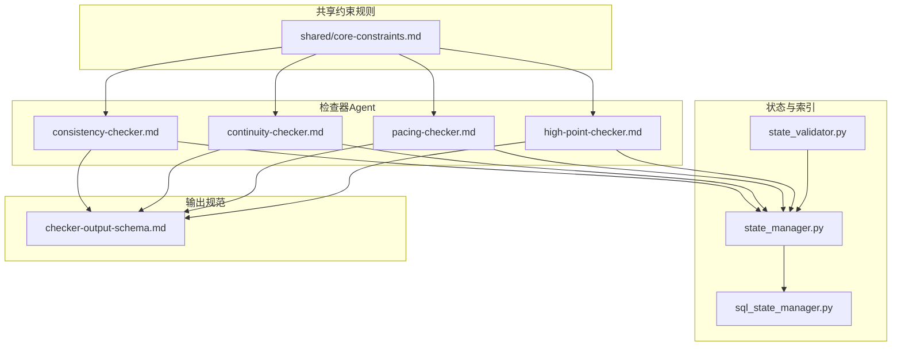
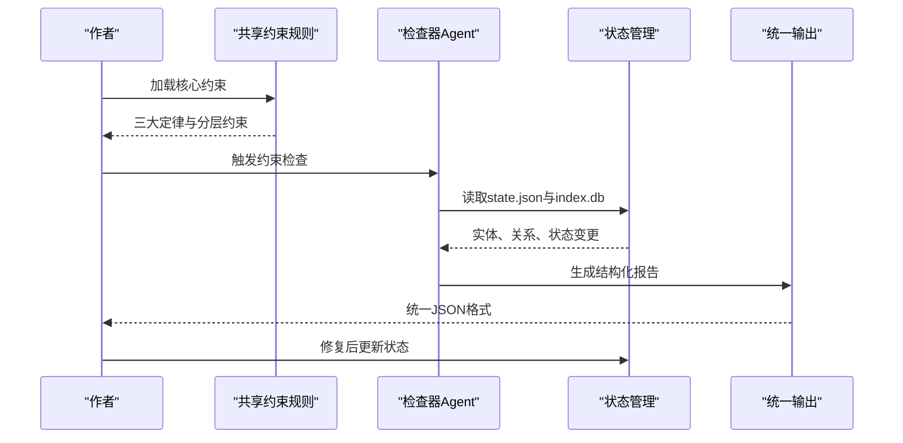
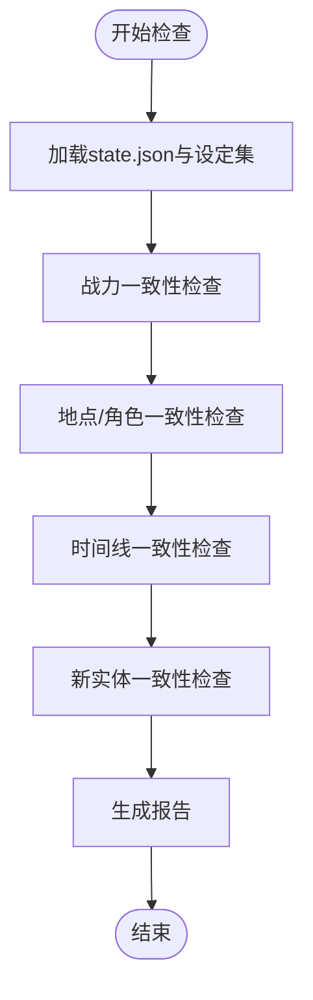
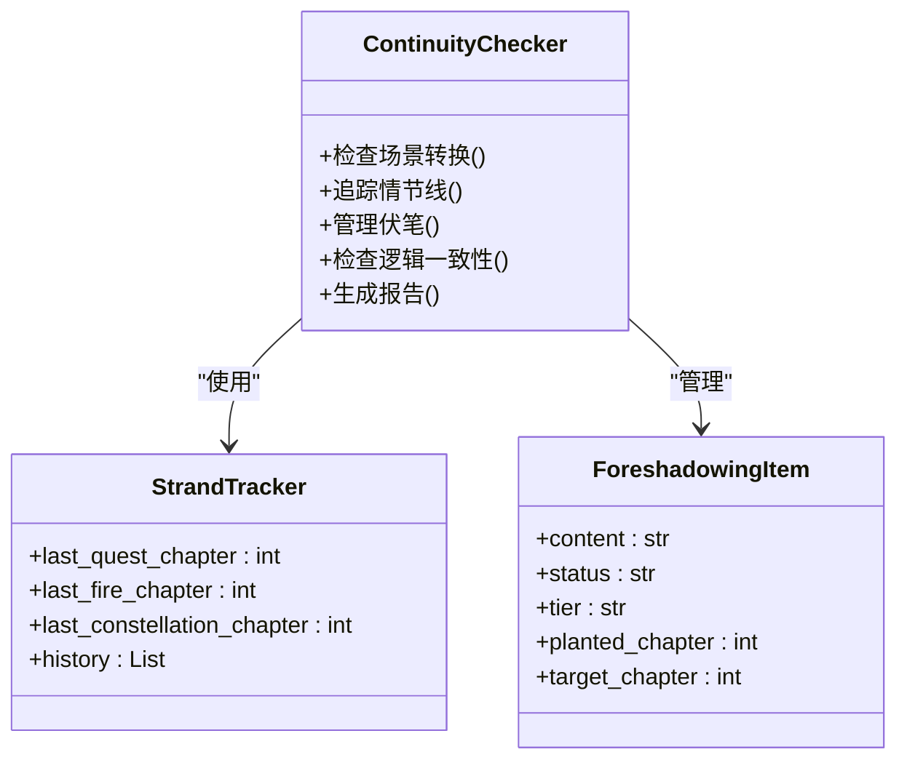
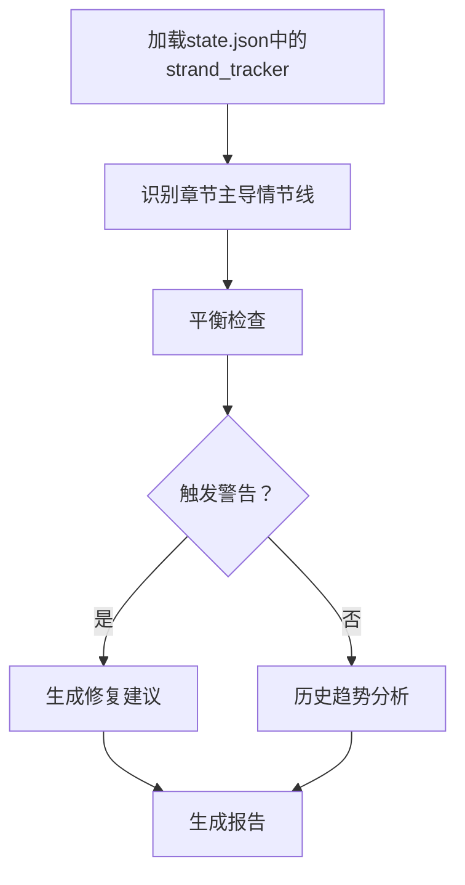
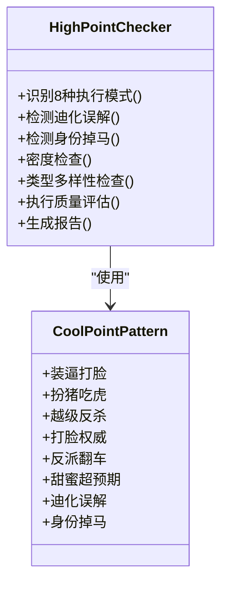
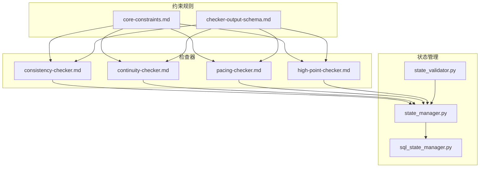

# 核心约束条件规范

<cite>
**本文档引用的文件**
- [core-constraints.md](file://webnovel-writer/references/shared/core-constraints.md)
- [consistency-checker.md](file://webnovel-writer/agents/consistency-checker.md)
- [continuity-checker.md](file://webnovel-writer/agents/continuity-checker.md)
- [pacing-checker.md](file://webnovel-writer/agents/pacing-checker.md)
- [high-point-checker.md](file://webnovel-writer/agents/high-point-checker.md)
- [checker-output-schema.md](file://webnovel-writer/references/checker-output-schema.md)
- [state_validator.py](file://webnovel-writer/scripts/data_modules/state_validator.py)
- [state_manager.py](file://webnovel-writer/scripts/data_modules/state_manager.py)
- [sql_state_manager.py](file://webnovel-writer/scripts/data_modules/sql_state_manager.py)
</cite>

## 目录
1. [简介](#简介)
2. [项目结构](#项目结构)
3. [核心组件](#核心组件)
4. [架构概览](#架构概览)
5. [详细组件分析](#详细组件分析)
6. [依赖分析](#依赖分析)
7. [性能考虑](#性能考虑)
8. [故障排除指南](#故障排除指南)
9. [结论](#结论)
10. [附录](#附录)

## 简介
本文件为核心约束条件规范的技术文档，面向网文创作系统的约束规则定义与执行。系统通过三大定律（大纲即法律、设定即物理、发明需识别）确保创作的一致性与可追溯性，并提供四类约束检查器：设定一致性检查器、连贯性检查器、节奏检查器和爽点检查器。文档详细阐述约束规则定义、验证算法、冲突检测机制、解决方案推荐，以及约束级别的分类与应用。

## 项目结构
项目围绕约束规则与检查器形成完整的约束执行链路：
- 共享约束规则源：references/shared/core-constraints.md
- 检查器Agent：agents/*-checker.md
- 统一输出Schema：references/checker-output-schema.md
- 状态管理与实体索引：scripts/data_modules/state_manager.py、sql_state_manager.py、state_validator.py

**图表来源**
- [core-constraints.md:1-99](file://webnovel-writer/references/shared/core-constraints.md#L1-L99)
- [consistency-checker.md:1-229](file://webnovel-writer/agents/consistency-checker.md#L1-L229)
- [continuity-checker.md:1-251](file://webnovel-writer/agents/continuity-checker.md#L1-L251)
- [pacing-checker.md:1-216](file://webnovel-writer/agents/pacing-checker.md#L1-L216)
- [high-point-checker.md:1-218](file://webnovel-writer/agents/high-point-checker.md#L1-L218)
- [checker-output-schema.md:1-169](file://webnovel-writer/references/checker-output-schema.md#L1-L169)
- [state_manager.py:1-800](file://webnovel-writer/scripts/data_modules/state_manager.py#L1-L800)
- [sql_state_manager.py:1-595](file://webnovel-writer/scripts/data_modules/sql_state_manager.py#L1-L595)
- [state_validator.py:1-250](file://webnovel-writer/scripts/data_modules/state_validator.py#L1-L250)

**章节来源**
- [core-constraints.md:1-99](file://webnovel-writer/references/shared/core-constraints.md#L1-L99)
- [checker-output-schema.md:1-169](file://webnovel-writer/references/checker-output-schema.md#L1-L169)

## 核心组件
本节概述四大检查器的职责与约束级别分类：

- 设定一致性检查器（Consistency Checker）
  - 职责：执行"设定即物理"定律，校验战力、地点/角色、时间线一致性
  - 约束级别：Hard（必须）
  - 输出：结构化JSON，包含严重度分类（critical|high|medium|low）

- 连贯性检查器（Continuity Checker）
  - 职责：确保场景转换、情节线连贯、伏笔管理、逻辑一致性
  - 约束级别：Hard（必须）
  - 输出：结构化报告，包含场景转换评分、伏笔健康度、逻辑漏洞数

- 节奏检查器（Pacing Checker）
  - 职责：执行Strand Weave平衡检查，防止读者疲劳
  - 约束级别：Soft（建议）
  - 输出：主导情节线、平衡状态、历史趋势分析

- 爽点检查器（High Point Checker）
  - 职责：检查爽点密度与类型多样性，支持迪化误解/身份掉马模式
  - 约束级别：Style（可选强化）
  - 输出：密度检查、类型分布、质量评级

**章节来源**
- [consistency-checker.md:1-229](file://webnovel-writer/agents/consistency-checker.md#L1-L229)
- [continuity-checker.md:1-251](file://webnovel-writer/agents/continuity-checker.md#L1-L251)
- [pacing-checker.md:1-216](file://webnovel-writer/agents/pacing-checker.md#L1-L216)
- [high-point-checker.md:1-218](file://webnovel-writer/agents/high-point-checker.md#L1-L218)

## 架构概览
约束执行架构采用"共享规则源 + 多Agent并行检查 + 统一输出"的设计，确保约束规则的一致性与可扩展性。

**图表来源**
- [core-constraints.md:1-99](file://webnovel-writer/references/shared/core-constraints.md#L1-L99)
- [checker-output-schema.md:1-169](file://webnovel-writer/references/checker-output-schema.md#L1-L169)
- [state_manager.py:1-800](file://webnovel-writer/scripts/data_modules/state_manager.py#L1-L800)
- [sql_state_manager.py:1-595](file://webnovel-writer/scripts/data_modules/sql_state_manager.py#L1-L595)

## 详细组件分析

### 设定一致性检查器（Consistency Checker）
该检查器负责执行"设定即物理"定律，确保战力、地点/角色、时间线的一致性。

#### 核心验证算法
- 战力一致性检查：对比state.json中的主角境界与使用技能限制
- 地点/角色一致性检查：验证当前位置与旅行序列，角色属性与档案一致
- 时间线一致性检查：校验事件顺序、时间敏感元素、闪回标记

**图表来源**
- [consistency-checker.md:44-146](file://webnovel-writer/agents/consistency-checker.md#L44-L146)

#### 冲突检测机制
- 严重度分级：critical（必须修复）、high（优先修复）、medium（建议修复）、low（可选修复）
- 自动标记无效事实：对critical问题自动标记到invalid_facts
- 新实体冲突：检测与现有设定的矛盾

**章节来源**
- [consistency-checker.md:96-229](file://webnovel-writer/agents/consistency-checker.md#L96-L229)

### 连贯性检查器（Continuity Checker）
该检查器确保叙事流畅性，涵盖场景转换、情节线追踪、伏笔管理与逻辑一致性。

#### 核心验证算法
- 场景转换流畅度：A/B/C/F评级，检查时间/空间标记
- 情节线追踪：主线与支线的引入、最近提及、状态与下一步
- 伏笔管理：短期/中期/长期伏笔的风险评估
- 逻辑一致性：前后矛盾、因果缺失的识别

**图表来源**
- [continuity-checker.md:42-251](file://webnovel-writer/agents/continuity-checker.md#L42-L251)
- [state_manager.py:168-177](file://webnovel-writer/scripts/data_modules/state_manager.py#L168-L177)

#### 冲突检测机制
- 场景转换：F级断裂必须修复，B级以下建议改进
- 情节线：活跃情节线遗忘超过15章视为问题
- 伏笔：长期伏笔（10+章）需定期提及或回收
- 逻辑漏洞：重大逻辑矛盾需标记deviation

**章节来源**
- [continuity-checker.md:156-251](file://webnovel-writer/agents/continuity-checker.md#L156-L251)

### 节奏检查器（Pacing Checker）
该检查器执行Strand Weave平衡检查，防止读者疲劳。

#### 核心验证算法
- 情节线分类：Quest（主线）、Fire（感情线）、Constellation（世界观线）
- 平衡检查：Quest过载（连续5+章）、Fire干旱（>10章）、Constellation缺席（>15章）
- 历史趋势分析：20章理想分布与超限影响

**图表来源**
- [pacing-checker.md:69-216](file://webnovel-writer/agents/pacing-checker.md#L69-L216)

#### 冲突检测机制
- Quest过载：连续7章Quest主导，建议第8章安排Fire或Constellation
- Fire干旱：距上次Fire已12章，建议补充互动场景
- Constellation间隔：建议揭示新势力或设定

**章节来源**
- [pacing-checker.md:69-216](file://webnovel-writer/agents/pacing-checker.md#L69-L216)

### 爽点检查器（High Point Checker）
该检查器检查爽点密度与类型多样性，支持特殊模式检测。

#### 核心验证算法
- 爽点模式识别：装逼打脸、扮猪吃虎、越级反杀、打脸权威、反派翻车、甜蜜超预期、迪化误解、身份掉马
- 密度检查：滚动窗口（5章/10-15章）基线
- 类型多样性：单一类型不超过80%
- 执行质量评估：铺垫、反转、情绪回报、结构参考

**图表来源**
- [high-point-checker.md:31-218](file://webnovel-writer/agents/high-point-checker.md#L31-L218)

#### 冲突检测机制
- 连续低密度：第M章0个爽点，需预警并补强
- 单调风险：过度依赖某模式（如装逼打脸>80%）
- 质量问题：缺乏铺垫的突发爽点，结构偏弱

**章节来源**
- [high-point-checker.md:83-197](file://webnovel-writer/agents/high-point-checker.md#L83-L197)

## 依赖分析
约束系统的关键依赖关系如下：

**图表来源**
- [core-constraints.md:1-99](file://webnovel-writer/references/shared/core-constraints.md#L1-L99)
- [checker-output-schema.md:1-169](file://webnovel-writer/references/checker-output-schema.md#L1-L169)
- [state_manager.py:1-800](file://webnovel-writer/scripts/data_modules/state_manager.py#L1-L800)
- [sql_state_manager.py:1-595](file://webnovel-writer/scripts/data_modules/sql_state_manager.py#L1-L595)
- [state_validator.py:1-250](file://webnovel-writer/scripts/data_modules/state_validator.py#L1-L250)

**章节来源**
- [state_manager.py:90-139](file://webnovel-writer/scripts/data_modules/state_manager.py#L90-L139)
- [sql_state_manager.py:46-92](file://webnovel-writer/scripts/data_modules/sql_state_manager.py#L46-L92)

## 性能考虑
- 状态管理优化：v5.1引入SQLite同步，state.json仅保留精简数据，大数据自动迁移到index.db
- 并发安全：使用文件锁确保多Agent并行下的原子写入
- 增量同步：待处理数据缓存，失败时可回滚快照
- 查询优化：IndexManager提供实体、别名、状态变化的高效查询接口

## 故障排除指南
- 约束违规处理流程
  1. 检查器生成结构化报告，包含问题类型、严重度、修复建议
  2. critical问题必须在润色步骤修复后才能继续
  3. high问题优先修复，medium建议修复，low可选修复
  4. 对严重时间线问题不得降级严重度

- 常见问题定位
  - 设定冲突：检查index.db中的实体记录与state.json的主角状态
  - 连贯性问题：核查场景转换标记、伏笔回收计划、逻辑前后一致
  - 节奏失衡：根据strand_tracker计算连续章数与间隔
  - 爽点单调：检查类型分布与密度滚动窗口

**章节来源**
- [consistency-checker.md:214-229](file://webnovel-writer/agents/consistency-checker.md#L214-L229)
- [continuity-checker.md:236-251](file://webnovel-writer/agents/continuity-checker.md#L236-L251)
- [pacing-checker.md:204-216](file://webnovel-writer/agents/pacing-checker.md#L204-L216)
- [high-point-checker.md:181-197](file://webnovel-writer/agents/high-point-checker.md#L181-L197)

## 结论
核心约束条件规范通过共享规则源与多Agent检查器实现网文创作的标准化约束。三大定律确保基本创作底线，四类检查器分别覆盖设定一致性、叙事连贯、节奏平衡与爽点设计。统一输出Schema保证了检查结果的可追溯性与可自动化处理。状态管理系统提供高性能的实体索引与并发安全保障。该体系既保证了创作质量，又为后续扩展提供了清晰的接口与规范。

## 附录

### 约束级别分类与应用
- Hard（必须）：大纲即法律、设定即物理、发明需识别
- Soft（建议）：开头冲突、未闭合问题位置、局面变化节奏
- Style（可选强化）：对话意图、解释段落切分、收尾期待保留

### 验证测试用例
- 设定一致性：战力冲突、地点错误、时间线算术错误
- 连贯性：场景转换断裂、伏笔遗忘、逻辑前后矛盾
- 节奏：Quest过载、Fire干旱、Constellation缺席
- 爽点：连续低密度、类型单调、执行质量不足

### 配置方法与自定义规则
- 共享约束规则：references/shared/core-constraints.md
- 检查器输出：遵循checker-output-schema.md统一格式
- 状态管理：通过state_manager.py与sql_state_manager.py扩展
- 伏笔管理：使用state_validator.py的规范化工具函数