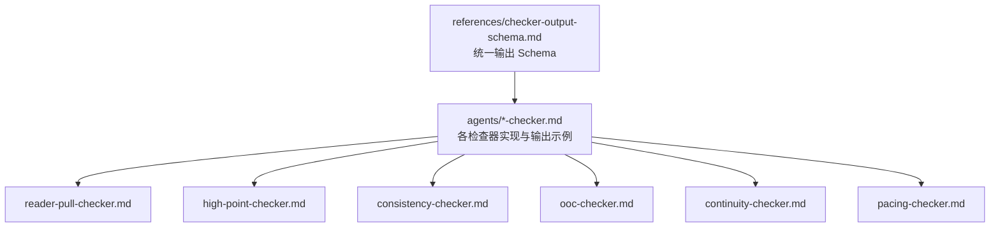
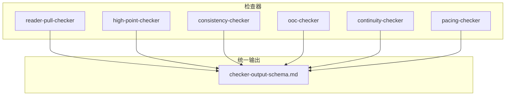
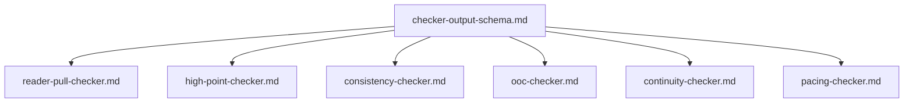

# 检查器输出格式规范

<cite>
**本文引用的文件**
- [checker-output-schema.md](file://webnovel-writer/references/checker-output-schema.md)
- [reader-pull-checker.md](file://webnovel-writer/agents/reader-pull-checker.md)
- [high-point-checker.md](file://webnovel-writer/agents/high-point-checker.md)
- [consistency-checker.md](file://webnovel-writer/agents/consistency-checker.md)
- [ooc-checker.md](file://webnovel-writer/agents/ooc-checker.md)
- [continuity-checker.md](file://webnovel-writer/agents/continuity-checker.md)
- [pacing-checker.md](file://webnovel-writer/agents/pacing-checker.md)
</cite>

## 目录
1. [简介](#简介)
2. [项目结构](#项目结构)
3. [核心组件](#核心组件)
4. [架构概览](#架构概览)
5. [详细组件分析](#详细组件分析)
6. [依赖分析](#依赖分析)
7. [性能考虑](#性能考虑)
8. [故障排查指南](#故障排查指南)
9. [结论](#结论)
10. [附录](#附录)

## 简介
本文件为检查器输出格式规范的技术文档，定义了统一的 JSON Schema，涵盖所有审查 Agent 的标准化输出结构。该规范旨在：
- 统一各检查器的输出格式，便于自动化汇总与趋势分析
- 明确必需字段与可选扩展字段的用途与约束
- 规范问题严重度等级与处理策略
- 提供各检查器特定 metrics 的语义说明与取值范围
- 给出汇总格式与实际使用案例

## 项目结构
检查器输出格式规范位于项目 references 目录，配套各检查器的实现文档位于 agents 目录。统一 Schema 与各检查器的 metrics 定义共同构成完整的输出规范。

图表来源
- [checker-output-schema.md:1-169](file://webnovel-writer/references/checker-output-schema.md#L1-L169)
- [reader-pull-checker.md:1-318](file://webnovel-writer/agents/reader-pull-checker.md#L1-L318)
- [high-point-checker.md:1-218](file://webnovel-writer/agents/high-point-checker.md#L1-L218)
- [consistency-checker.md:1-229](file://webnovel-writer/agents/consistency-checker.md#L1-L229)
- [ooc-checker.md:1-214](file://webnovel-writer/agents/ooc-checker.md#L1-L214)
- [continuity-checker.md:1-251](file://webnovel-writer/agents/continuity-checker.md#L1-L251)
- [pacing-checker.md:1-216](file://webnovel-writer/agents/pacing-checker.md#L1-L216)

章节来源
- [checker-output-schema.md:1-169](file://webnovel-writer/references/checker-output-schema.md#L1-L169)

## 核心组件
统一 JSON Schema 定义了所有检查器的标准输出结构，包含以下必需字段与可选扩展字段：

- agent: string，必填，Agent 名称
- chapter: number，必填，章节号（单章场景默认使用）
- overall_score: number，必填，总分（0-100）
- pass: boolean，必填，是否通过
- issues: array，必填，问题列表，每项包含 id、type、severity、location、description、suggestion、can_override 等
- metrics: object，必填，各检查器特定指标
- summary: string，必填，简短总结
- 扩展字段（可选）：允许附加私有字段（如 hard_violations、soft_suggestions、override_eligible 等），用于增强解释，不得替代 issues

字段类型与取值范围
- agent: string，非空
- chapter: integer，>= 1
- overall_score: integer，0-100
- pass: boolean
- issues: array，元素为对象，包含上述字段
- metrics: object，键为字符串，值为标量或数组
- summary: string，非空

章节来源
- [checker-output-schema.md:10-48](file://webnovel-writer/references/checker-output-schema.md#L10-L48)

## 架构概览
统一 Schema 作为各检查器输出的契约，确保下游系统（如数据聚合、仪表板、工作流引擎）能够一致地消费与处理检查结果。各检查器在实现中遵循该 Schema，并在必要时扩展私有字段以提供更丰富的上下文。

图表来源
- [checker-output-schema.md:1-169](file://webnovel-writer/references/checker-output-schema.md#L1-L169)
- [reader-pull-checker.md:25-61](file://webnovel-writer/agents/reader-pull-checker.md#L25-L61)
- [high-point-checker.md:12-216](file://webnovel-writer/agents/high-point-checker.md#L12-L216)
- [consistency-checker.md:12-196](file://webnovel-writer/agents/consistency-checker.md#L12-L196)
- [ooc-checker.md:12-198](file://webnovel-writer/agents/ooc-checker.md#L12-L198)
- [continuity-checker.md:12-234](file://webnovel-writer/agents/continuity-checker.md#L12-L234)
- [pacing-checker.md:12-202](file://webnovel-writer/agents/pacing-checker.md#L12-L202)

## 详细组件分析

### 统一 JSON Schema 与字段规范
- 必需字段：agent、chapter、overall_score、pass、issues、metrics、summary
- 可选扩展：允许附加私有字段（如 hard_violations、soft_suggestions、override_eligible），用于增强解释，不得替代 issues
- 问题严重度：critical、high、medium、low（小写枚举）

章节来源
- [checker-output-schema.md:10-48](file://webnovel-writer/references/checker-output-schema.md#L10-L48)
- [consistency-checker.md:107-107](file://webnovel-writer/agents/consistency-checker.md#L107-L107)

### 问题严重度等级与处理策略
- critical：严重问题，必须修复，润色步骤必须修复
- high：高优先级问题，优先修复
- medium：中等问题，建议修复
- low：轻微问题，可选修复

章节来源
- [checker-output-schema.md:50-58](file://webnovel-writer/references/checker-output-schema.md#L50-L58)

### reader-pull-checker（追读力检查器）
- 输出遵循统一 Schema
- 扩展字段：hard_violations、soft_suggestions、override_eligible
- metrics 字段含义：
  - hook_present: boolean，是否存在钩子
  - hook_type: string，钩子类型（如“渴望钩”）
  - hook_strength: string，强度（strong/medium/weak）
  - prev_hook_fulfilled: boolean，上章钩子是否已兑现
  - micropayoff_count: number，微兑现数量
  - micropayoffs: array[string]，微兑现类型列表
  - is_transition: boolean，是否为过渡章
  - debt_balance: number，债务余额
  - new_expectations: number，新增期待数量
  - pattern_repeat_risk: boolean，模式重复风险
  - next_chapter_reason: string，下章动机
  - allowed_rationales: array[string]，允许的覆盖理由类型

章节来源
- [reader-pull-checker.md:25-61](file://webnovel-writer/agents/reader-pull-checker.md#L25-L61)
- [reader-pull-checker.md:46-58](file://webnovel-writer/agents/reader-pull-checker.md#L46-L58)

### high-point-checker（爽点密度检查器）
- 输出遵循统一 Schema
- metrics 字段含义：
  - cool_point_count: number，爽点数量
  - cool_point_types: array[string]，爽点类型列表（如“装逼打脸”、“越级反杀”等）
  - density_score: number，密度得分
  - type_diversity: number，类型多样性（0-1）
  - milestone_present: boolean，是否包含里程碑式爽点
  - monotony_risk: boolean，单调风险

章节来源
- [high-point-checker.md:12-216](file://webnovel-writer/agents/high-point-checker.md#L12-L216)
- [high-point-checker.md:200-216](file://webnovel-writer/agents/high-point-checker.md#L200-L216)

### consistency-checker（设定一致性检查器）
- 输出遵循统一 Schema
- metrics 字段含义：
  - power_violations: number，战力冲突数量
  - location_errors: number，地点/角色错误数量
  - timeline_issues: number，时间线问题数量
  - entity_conflicts: number，实体冲突数量

章节来源
- [consistency-checker.md:12-196](file://webnovel-writer/agents/consistency-checker.md#L12-L196)
- [consistency-checker.md:90-106](file://webnovel-writer/agents/consistency-checker.md#L90-L106)

### ooc-checker（人物 OOC 检查器）
- 输出遵循统一 Schema
- metrics 字段含义：
  - severe_ooc: number，严重 OOC 数量
  - moderate_ooc: number，中度 OOC 数量
  - minor_ooc: number，轻微 OOC 数量
  - speech_violations: number，对话风格违规数量
  - character_development_valid: boolean，角色成长是否有效

章节来源
- [ooc-checker.md:12-198](file://webnovel-writer/agents/ooc-checker.md#L12-L198)
- [ooc-checker.md:103-112](file://webnovel-writer/agents/ooc-checker.md#L103-L112)

### continuity-checker（连贯性检查器）
- 输出遵循统一 Schema
- metrics 字段含义：
  - transition_grade: string，场景转换评分等级（如“A/B/C/F”）
  - active_threads: number，活跃情节线数量
  - dormant_threads: number，休眠/遗忘情节线数量
  - forgotten_foreshadowing: number，遗忘伏笔数量
  - logic_holes: number，逻辑漏洞数量
  - outline_deviations: number，大纲偏差数量

章节来源
- [continuity-checker.md:12-234](file://webnovel-writer/agents/continuity-checker.md#L12-L234)
- [continuity-checker.md:115-134](file://webnovel-writer/agents/continuity-checker.md#L115-L134)

### pacing-checker（节奏检查器）
- 输出遵循统一 Schema
- metrics 字段含义：
  - dominant_strand: string，主导情节线（quest/fire/constellation）
  - quest_ratio: number，主线占比（0-1）
  - fire_ratio: number，感情线占比（0-1）
  - constellation_ratio: number，世界观线占比（0-1）
  - consecutive_quest: number，连续主线章数
  - fire_gap: number，距离上次感情线章数
  - constellation_gap: number，距离上次世界观线章数
  - fatigue_risk: string，读者疲劳风险（low/medium/high）

章节来源
- [pacing-checker.md:12-202](file://webnovel-writer/agents/pacing-checker.md#L12-L202)
- [pacing-checker.md:108-142](file://webnovel-writer/agents/pacing-checker.md#L108-L142)

### 汇总格式
在 Step 3 完成后，输出汇总 JSON，包含各检查器的分数、通过状态与严重度统计，以及整体汇总。

- 字段：
  - chapter: number，章节号
  - checkers: object，键为检查器名，值包含 score、pass、critical、high
  - overall: object，包含 score、pass、critical_total、high_total、can_proceed

章节来源
- [checker-output-schema.md:145-168](file://webnovel-writer/references/checker-output-schema.md#L145-L168)

### 使用案例
- 单章场景：使用 chapter 字段标识章节号
- 区间统计：在聚合层补充 start_chapter/end_chapter，单个检查器无需必填
- 扩展字段：可在检查器输出中附加私有字段（如 hard_violations、soft_suggestions、override_eligible），用于增强解释

章节来源
- [checker-output-schema.md:5-8](file://webnovel-writer/references/checker-output-schema.md#L5-L8)
- [checker-output-schema.md:46-48](file://webnovel-writer/references/checker-output-schema.md#L46-L48)

## 依赖分析
各检查器实现依赖统一 Schema 作为输出契约，同时在内部实现中可能依赖项目内的状态文件、索引数据库与上下文数据。统一 Schema 保证了跨检查器的一致性与可组合性。

图表来源
- [checker-output-schema.md:1-169](file://webnovel-writer/references/checker-output-schema.md#L1-L169)
- [reader-pull-checker.md:12-12](file://webnovel-writer/agents/reader-pull-checker.md#L12-L12)
- [high-point-checker.md:12-12](file://webnovel-writer/agents/high-point-checker.md#L12-L12)
- [consistency-checker.md:12-12](file://webnovel-writer/agents/consistency-checker.md#L12-L12)
- [ooc-checker.md:12-12](file://webnovel-writer/agents/ooc-checker.md#L12-L12)
- [continuity-checker.md:12-12](file://webnovel-writer/agents/continuity-checker.md#L12-L12)
- [pacing-checker.md:12-12](file://webnovel-writer/agents/pacing-checker.md#L12-L12)

## 性能考虑
- 统一 Schema 有助于减少解析与转换成本，便于批量处理与缓存
- 指标字段应尽量使用数值与枚举，避免冗长文本，提高序列化与传输效率
- 扩展字段应控制粒度，避免过度膨胀 JSON 体积

## 故障排查指南
- 问题严重度不合规：确保 issues[].severity 使用小写枚举（critical|high|medium|low）
- 字段缺失：检查是否遗漏 agent、chapter、overall_score、pass、issues、metrics、summary
- 指标异常：核对各检查器 metrics 字段的取值范围与语义，确保与实现文档一致
- 汇总不一致：检查汇总格式中的统计逻辑，确保 critical_total、high_total 与 can_proceed 的计算正确

章节来源
- [consistency-checker.md:107-107](file://webnovel-writer/agents/consistency-checker.md#L107-L107)
- [checker-output-schema.md:145-168](file://webnovel-writer/references/checker-output-schema.md#L145-L168)

## 结论
统一的 JSON Schema 为各检查器提供了清晰、可扩展的输出规范，结合各检查器特定的 metrics 定义，能够支撑自动化汇总、趋势分析与工作流集成。遵循本规范有助于提升检查器生态的一致性与可维护性。

## 附录
- 完整 Schema 示例与各检查器 metrics 示例见 references/checker-output-schema.md
- 各检查器实现与输出示例见 agents/*-checker.md