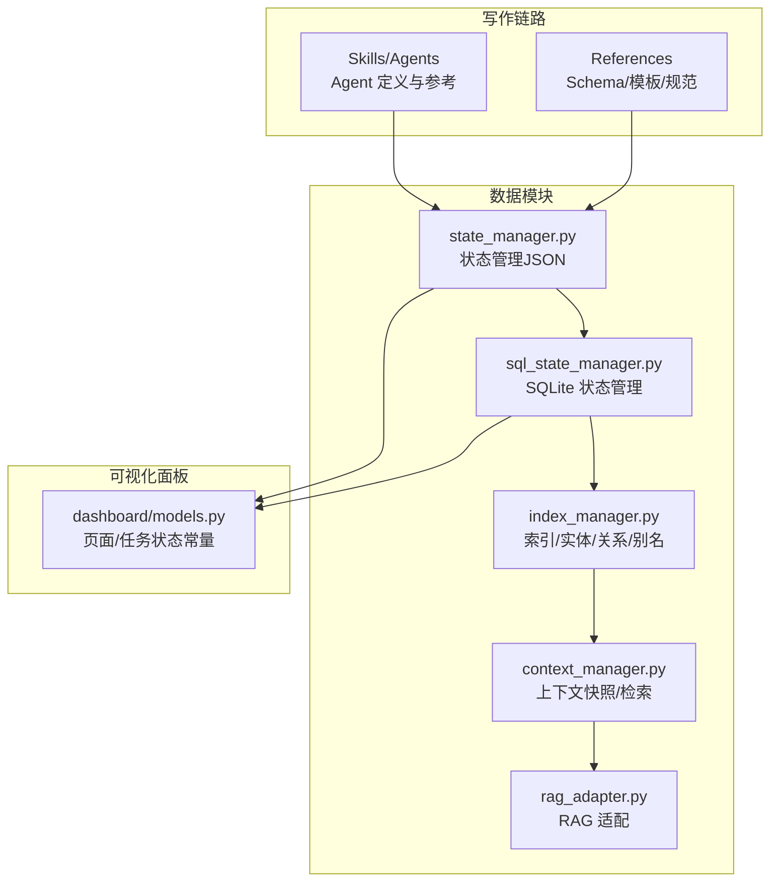
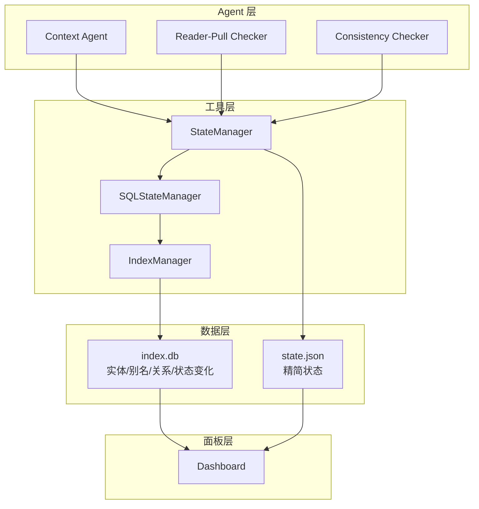
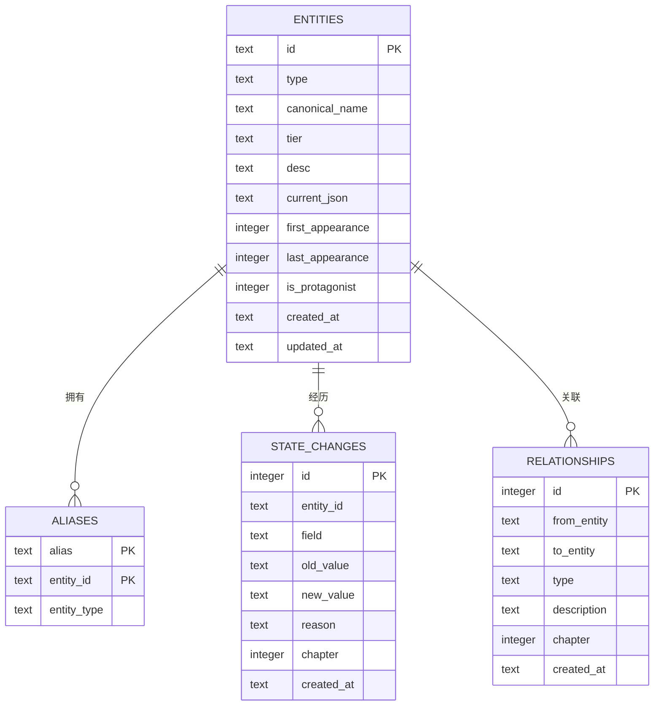
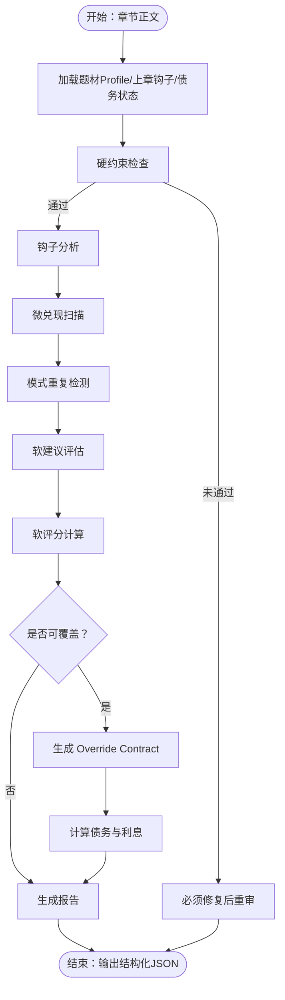
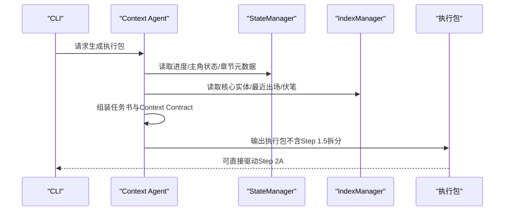
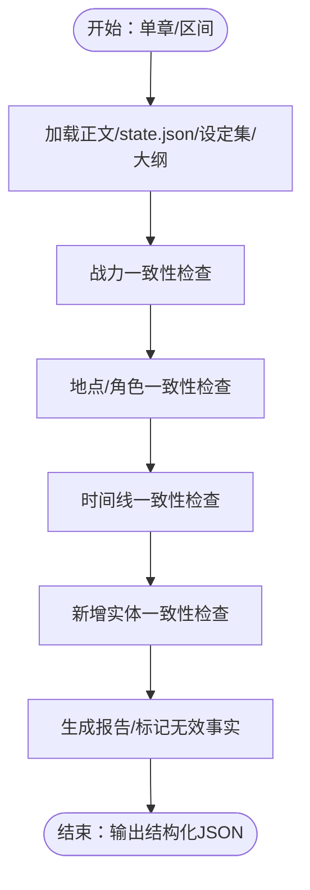
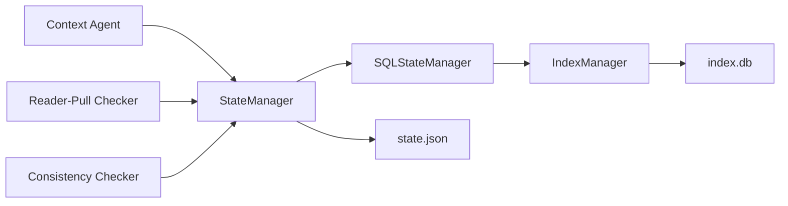

# 核心概念

<cite>
**本文引用的文件**
- [README.md](file://README.md)
- [project-memory-schema.md](file://webnovel-writer/references/project-memory-schema.md)
- [entity-management-spec.md](file://webnovel-writer/references/entity-management-spec.md)
- [preferences-schema.md](file://webnovel-writer/references/preferences-schema.md)
- [checker-output-schema.md](file://webnovel-writer/references/checker-output-schema.md)
- [consistency-checker.md](file://webnovel-writer/agents/consistency-checker.md)
- [context-agent.md](file://webnovel-writer/agents/context-agent.md)
- [reader-pull-checker.md](file://webnovel-writer/agents/reader-pull-checker.md)
- [state_manager.py](file://webnovel-writer/scripts/data_modules/state_manager.py)
- [sql_state_manager.py](file://webnovel-writer/scripts/data_modules/sql_state_manager.py)
- [models.py](file://webnovel-writer/dashboard/models.py)
</cite>

## 目录
1. [引言](#引言)
2. [项目结构](#项目结构)
3. [核心组件](#核心组件)
4. [架构总览](#架构总览)
5. [详细组件分析](#详细组件分析)
6. [依赖分析](#依赖分析)
7. [性能考量](#性能考量)
8. [故障排查指南](#故障排查指南)
9. [结论](#结论)
10. [附录](#附录)

## 引言
本文件面向具备一定技术背景的读者，系统阐述 Webnovel Writer 的核心概念与技术模型，包括：
- 智能化写作工作流与 AI 代理协作机制
- 实体关系图谱管理与数据模型
- 追读力与债务管理系统
- 项目内存架构、检查器输出格式、实体管理规范、偏好设置系统
- 业务规则与交互模式，并提供可溯源的代码示例路径与使用场景

## 项目结构
该项目围绕“写作链路 + 数据模块 + 可视化面板”的三层组织：
- 写作链路（Skills/Agents/References）：定义各阶段任务、Agent 行为与参考材料
- 数据模块（scripts/data_modules）：负责状态、索引、迁移、RAG、上下文等数据处理
- 可视化面板（dashboard）：提供只读工作台页面与任务状态常量

**图表来源**
- [state_manager.py:90-140](file://webnovel-writer/scripts/data_modules/state_manager.py#L90-L140)
- [sql_state_manager.py:46-100](file://webnovel-writer/scripts/data_modules/sql_state_manager.py#L46-L100)
- [models.py:1-23](file://webnovel-writer/dashboard/models.py#L1-L23)

**章节来源**
- [README.md:1-170](file://README.md#L1-L170)

## 核心组件
- 写作工作流与 Agent 协作
  - Context Agent：生成“创作执行包”，整合大纲、设定、实体、追读力与时间约束，确保 Step 2A 可直接开写
  - Reader-Pull Checker：评估钩子、微兑现、模式重复与债务平衡，支持硬/软约束分层与 Override Contract
  - Consistency Checker：设定一致性（战力、地点/角色、时间线）、实体冲突与无效事实标记
- 实体关系图谱管理
  - StateManager/SQLStateManager：统一实体、别名、状态变化、关系的读写与同步
  - IndexManager：SQLite 索引层，提供实体/别名/关系/状态变化的持久化与查询
- 追读力与债务系统
  - Reader-Pull Checker 的 metrics 与债务计算，结合 Override Contract 与利息累积
- 偏好设置与项目记忆
  - preferences.json：全局情绪基调、节奏偏好、叙事/对话比例、禁忌与聚焦方向
  - project_memory.json：学习到的写作模式（钩子/节奏/对话/回报/情感）

**章节来源**
- [context-agent.md:1-269](file://webnovel-writer/agents/context-agent.md#L1-L269)
- [reader-pull-checker.md:1-318](file://webnovel-writer/agents/reader-pull-checker.md#L1-L318)
- [consistency-checker.md:1-229](file://webnovel-writer/agents/consistency-checker.md#L1-L229)
- [entity-management-spec.md:1-296](file://webnovel-writer/references/entity-management-spec.md#L1-L296)
- [preferences-schema.md:1-29](file://webnovel-writer/references/preferences-schema.md#L1-L29)
- [project-memory-schema.md:1-26](file://webnovel-writer/references/project-memory-schema.md#L1-L26)

## 架构总览
整体架构以“Agent 驱动 + 数据模块持久化 + 面板只读”的方式组织，强调：
- 数据层：state.json 精简 + index.db 大数据（实体/别名/关系/状态变化）
- 上下文层：Context Agent 产出“创作执行包”，Reader-Pull Checker 产出“追读力报告”
- 审查层：Consistency Checker 保证设定一致性与无效事实标记
- 可视化层：Dashboard 提供只读工作台，展示章节/大纲/实体/追读力

**图表来源**
- [state_manager.py:90-140](file://webnovel-writer/scripts/data_modules/state_manager.py#L90-L140)
- [sql_state_manager.py:46-100](file://webnovel-writer/scripts/data_modules/sql_state_manager.py#L46-L100)
- [models.py:1-23](file://webnovel-writer/dashboard/models.py#L1-L23)

## 详细组件分析

### 组件A：实体关系图谱管理
- 存储架构
  - state.json：进度、主角状态、节奏追踪（<5KB）
  - index.db：entities/aliases/state_changes/relationships/chapters/scenes
- 处理流程
  - Data Agent 语义抽取 → 写入 index.db 与 state.json → Context Agent 消费
  - 置信度策略：>0.8 自动采用，0.5-0.8 警告，<0.5 待人工确认
  - 双 Agent 架构：Context Agent（读）+ Data Agent（写）
- 查询接口
  - 获取实体、核心实体、别名解析、状态变化历史、关系
- ID 生成规则
  - 拼音基础 + 类型前缀（物品/势力/招式）+ 数字后缀去重
- 错误处理
  - 别名冲突：一对多，歧义时报错并提供解决方案
  - 置信度处理：分级策略保障质量

**图表来源**
- [entity-management-spec.md:36-85](file://webnovel-writer/references/entity-management-spec.md#L36-L85)

**章节来源**
- [entity-management-spec.md:1-296](file://webnovel-writer/references/entity-management-spec.md#L1-L296)
- [state_manager.py:90-140](file://webnovel-writer/scripts/data_modules/state_manager.py#L90-L140)
- [sql_state_manager.py:46-100](file://webnovel-writer/scripts/data_modules/sql_state_manager.py#L46-L100)

### 组件B：追读力与债务管理系统
- Reader-Pull Checker 输出统一 JSON Schema，包含 agent、chapter、overall_score、issues、metrics、summary
- 约束分层
  - 硬约束：可读性底线、承诺违背、节奏灾难、冲突真空（必须修复）
  - 软建议：下章动机、钩子锚点/强度/类型、微兑现数量、模式重复、期待过载、节奏自然性（可覆盖）
- Override Contract
  - 当软建议无法遵守时，可提交理由类型与偿还计划，产生债务并按章计息
- 债务与利息
  - 债务量由题材 profile 的 debt_multiplier 决定，每章利息默认 10%，超过 due_chapter 未偿还则 overdue

**图表来源**
- [reader-pull-checker.md:216-318](file://webnovel-writer/agents/reader-pull-checker.md#L216-L318)
- [checker-output-schema.md:10-32](file://webnovel-writer/references/checker-output-schema.md#L10-L32)

**章节来源**
- [reader-pull-checker.md:1-318](file://webnovel-writer/agents/reader-pull-checker.md#L1-L318)
- [checker-output-schema.md:1-169](file://webnovel-writer/references/checker-output-schema.md#L1-L169)

### 组件C：上下文与创作执行包（Context Agent）
- 输入：章节号、项目根、存储路径、state.json
- 输出：创作执行包（任务书8板块 + Context Contract + 直写提示词）
- 关键数据来源：state.json、index.db、章节摘要、上下文快照、大纲/设定集
- 时间线读取：从卷时间线与章纲提取时间锚点、跨度、过渡要求、倒计时状态
- 逻辑红线校验：大纲/设定/上章承接冲突、时空跳跃无承接、能力/信息无因果、角色动机断裂、合同与任务书冲突、时间逻辑错误

**图表来源**
- [context-agent.md:101-269](file://webnovel-writer/agents/context-agent.md#L101-L269)
- [state_manager.py:618-750](file://webnovel-writer/scripts/data_modules/state_manager.py#L618-L750)
- [sql_state_manager.py:102-178](file://webnovel-writer/scripts/data_modules/sql_state_manager.py#L102-L178)

**章节来源**
- [context-agent.md:1-269](file://webnovel-writer/agents/context-agent.md#L1-L269)

### 组件D：设定一致性检查（Consistency Checker）
- 三层一致性检查：战力/地点/角色、时间线、新增实体
- 严重度分级：critical/high/medium/low
- 无效事实标记：对严重级别问题自动标记为 pending，需用户确认生效
- 成功标准：无严重违规、时间线算术正确、新实体与世界观一致

**图表来源**
- [consistency-checker.md:20-229](file://webnovel-writer/agents/consistency-checker.md#L20-L229)

**章节来源**
- [consistency-checker.md:1-229](file://webnovel-writer/agents/consistency-checker.md#L1-L229)

### 组件E：偏好设置与项目记忆
- 偏好设置（preferences.json）
  - tone：全局情绪基调
  - pacing：章节字数、是否 cliffhanger
  - style：对话/叙述比例
  - avoid/focus：禁忌与必须强调的方向
- 项目记忆（project_memory.json）
  - patterns：已验证的写作模式（hook/pacing/dialogue/payoff/emotion），含来源章节与学习时间

**章节来源**
- [preferences-schema.md:1-29](file://webnovel-writer/references/preferences-schema.md#L1-L29)
- [project-memory-schema.md:1-26](file://webnovel-writer/references/project-memory-schema.md#L1-L26)

## 依赖分析
- 组件耦合
  - StateManager 与 SQLStateManager：前者兼容旧结构，后者接管大数据写入
  - SQLStateManager 依赖 IndexManager：提供 SQLite 索引与查询能力
  - Agent 依赖数据模块：Context Agent 读取 state.json 与 index.db；Reader-Pull/Consistency 检查器读取 index.db 与 state.json
- 外部依赖
  - RAG 适配（Rerank/Embedding）：用于检索辅助（Agent 可按需调用）
  - 文件锁与原子写：state.json 写入采用锁与备份策略，避免并发覆盖
- 潜在循环依赖
  - 数据模块之间通过 IndexManager 解耦，避免直接循环导入

**图表来源**
- [state_manager.py:96-140](file://webnovel-writer/scripts/data_modules/state_manager.py#L96-L140)
- [sql_state_manager.py:97-100](file://webnovel-writer/scripts/data_modules/sql_state_manager.py#L97-L100)

**章节来源**
- [state_manager.py:90-140](file://webnovel-writer/scripts/data_modules/state_manager.py#L90-L140)
- [sql_state_manager.py:46-100](file://webnovel-writer/scripts/data_modules/sql_state_manager.py#L46-L100)

## 性能考量
- 状态写入优化
  - state.json 采用“锁内重读 + 合并 + 原子写入”，避免并发覆盖
  - 大数据字段迁移至 index.db，state.json 保持 <5KB，降低 I/O 压力
- SQLite 同步
  - StateManager 将增量写入缓存，批量同步至 SQLite，失败时回滚内存队列
  - 避免重复写入 appearances，减少覆盖成本
- 查询与索引
  - 通过 IndexManager 提供的别名解析、关系查询、状态变化历史等接口，减少全量扫描
- Agent 并行
  - 各 Agent 独立读取数据，Writer 侧通过锁与 SQLite 同步保障一致性

[本节为通用性能讨论，不直接分析具体文件]

## 故障排查指南
- 预检命令
  - 使用统一预检命令排查 CLI/插件目录/项目根解析问题
- 偏好设置与环境
  - 确认 .env 中 Embed/Rerank 配置正确
- 数据一致性
  - 如出现“别名歧义”或“置信度不足”，根据规范进行人工确认或调整
- 债务与 Override
  - 若软建议无法遵守，提交 Override Contract 并关注利息累积与到期偿还

**章节来源**
- [README.md:78-82](file://README.md#L78-L82)
- [entity-management-spec.md:233-256](file://webnovel-writer/references/entity-management-spec.md#L233-L256)
- [reader-pull-checker.md:179-214](file://webnovel-writer/agents/reader-pull-checker.md#L179-L214)

## 结论
Webnovel Writer 通过“Agent 驱动 + 数据模块持久化 + 面板只读”的架构，实现了：
- 智能化写作工作流：从上下文生成到追读力审查再到设定一致性把关
- 实体关系图谱：以 SQLite 为核心的数据层，支持大规模实体与关系管理
- 追读力与债务系统：以硬/软约束与 Override 机制，平衡创作自由与质量控制
- 偏好设置与项目记忆：为风格与模式沉淀提供结构化支撑

该设计既保证了长周期创作的稳定性，也为扩展与演进提供了清晰的边界。

[本节为总结性内容，不直接分析具体文件]

## 附录
- 代码示例路径（仅路径，不含代码内容）
  - 实体管理规范与 Schema：[entity-management-spec.md:1-296](file://webnovel-writer/references/entity-management-spec.md#L1-L296)
  - 检查器输出统一 Schema：[checker-output-schema.md:1-169](file://webnovel-writer/references/checker-output-schema.md#L1-L169)
  - 偏好设置 Schema：[preferences-schema.md:1-29](file://webnovel-writer/references/preferences-schema.md#L1-L29)
  - 项目记忆 Schema：[project-memory-schema.md:1-26](file://webnovel-writer/references/project-memory-schema.md#L1-L26)
  - Context Agent 执行包生成：[context-agent.md:1-269](file://webnovel-writer/agents/context-agent.md#L1-L269)
  - Reader-Pull Checker 约束与 Override：[reader-pull-checker.md:1-318](file://webnovel-writer/agents/reader-pull-checker.md#L1-L318)
  - Consistency Checker 设定一致性：[consistency-checker.md:1-229](file://webnovel-writer/agents/consistency-checker.md#L1-L229)
  - 状态管理（JSON）：[state_manager.py:1-800](file://webnovel-writer/scripts/data_modules/state_manager.py#L1-L800)
  - SQLite 状态管理：[sql_state_manager.py:1-595](file://webnovel-writer/scripts/data_modules/sql_state_manager.py#L1-L595)
  - Dashboard 页面与任务状态常量：[models.py:1-23](file://webnovel-writer/dashboard/models.py#L1-L23)

[本节为附录，不直接分析具体文件]