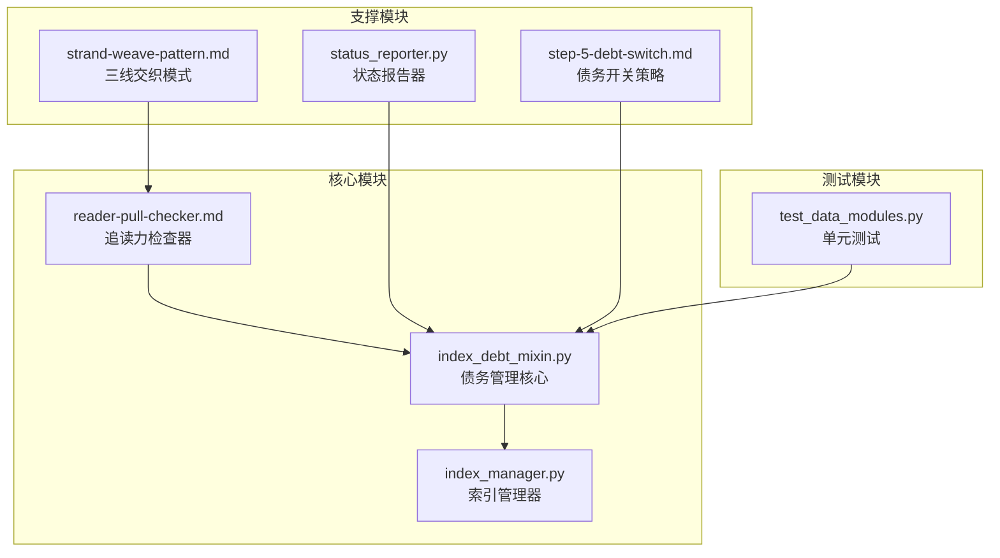
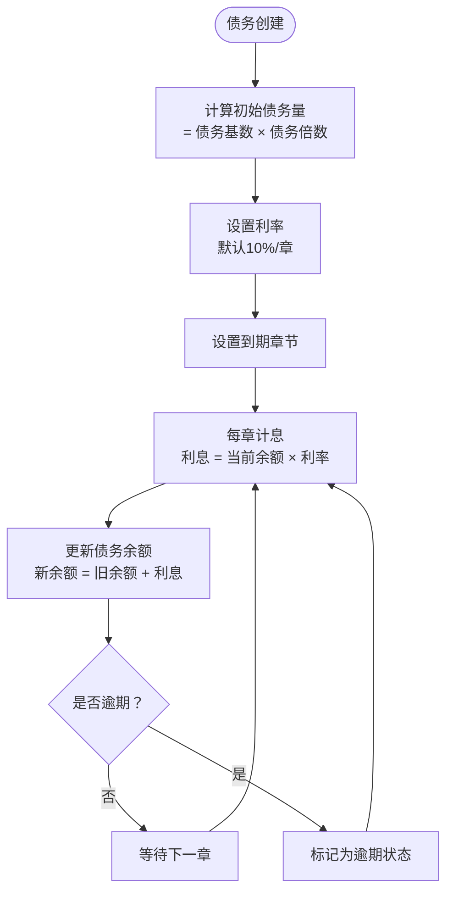
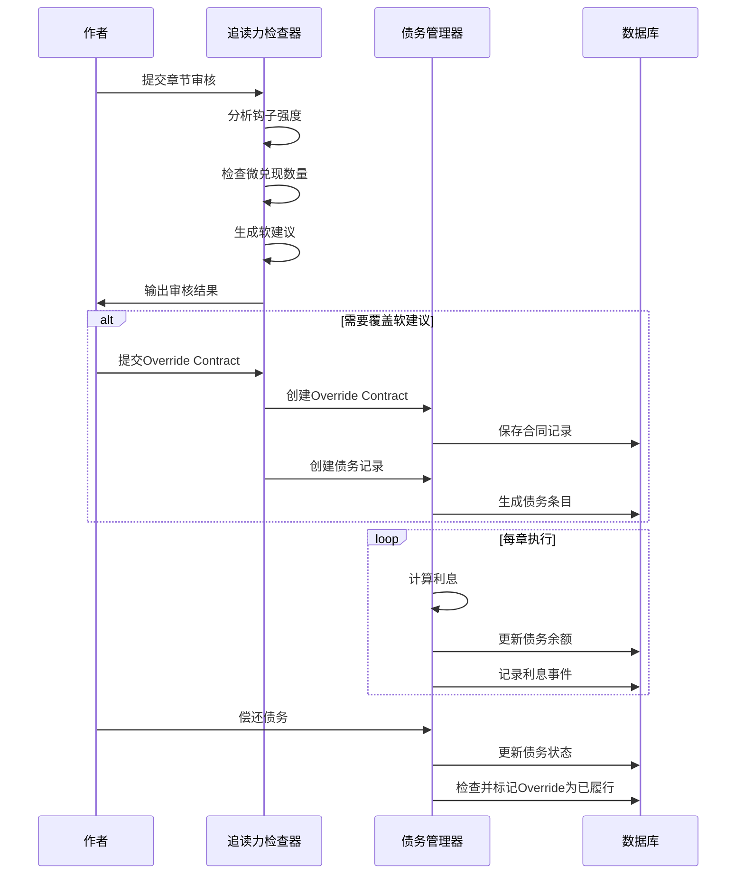
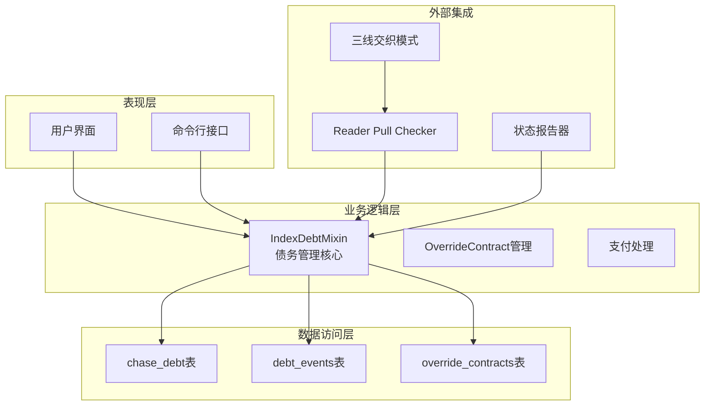
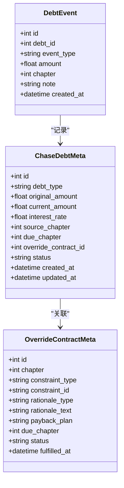
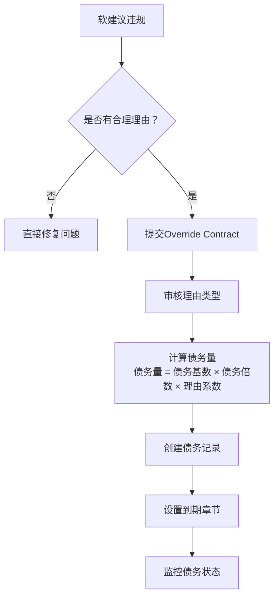
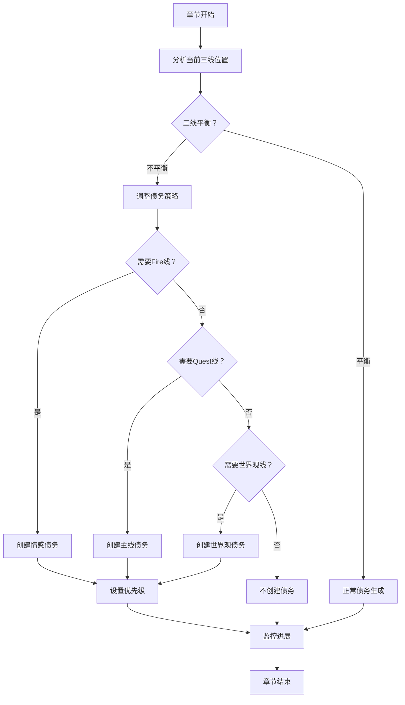
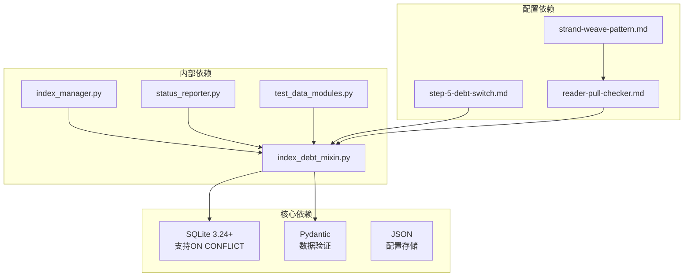
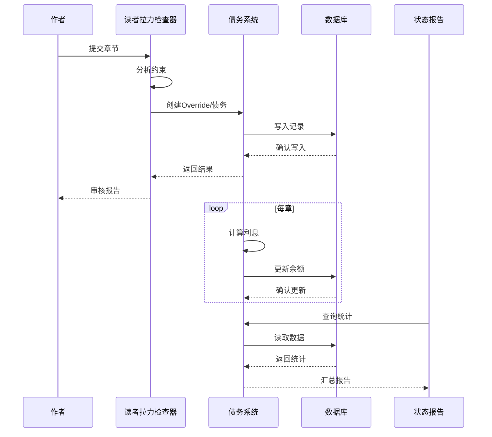
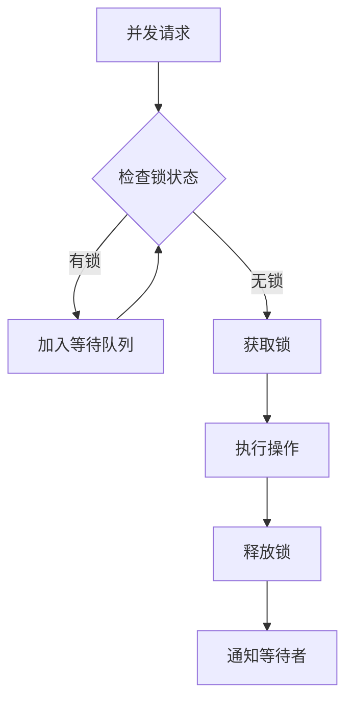

# 追读力债务系统

<cite>
**本文档引用的文件**
- [index_debt_mixin.py](file://webnovel-writer/scripts/data_modules/index_debt_mixin.py)
- [reader-pull-checker.md](file://webnovel-writer/agents/reader-pull-checker.md)
- [step-5-debt-switch.md](file://webnovel-writer/skills/webnovel-write/references/step-5-debt-switch.md)
- [index_manager.py](file://webnovel-writer/scripts/data_modules/index_manager.py)
- [strand-weave-pattern.md](file://webnovel-writer/references/shared/strand-weave-pattern.md)
- [status_reporter.py](file://webnovel-writer/scripts/status_reporter.py)
- [test_data_modules.py](file://webnovel-writer/scripts/data_modules/tests/test_data_modules.py)
</cite>

## 目录
1. [简介](#简介)
2. [项目结构](#项目结构)
3. [核心组件](#核心组件)
4. [架构概览](#架构概览)
5. [详细组件分析](#详细组件分析)
6. [依赖分析](#依赖分析)
7. [性能考虑](#性能考虑)
8. [故障排除指南](#故障排除指南)
9. [结论](#结论)
10. [附录](#附录)

## 简介

追读力债务系统是网络小说写作辅助系统中的核心机制，旨在通过量化管理读者期待与承诺，确保故事节奏的可持续性和读者粘性。该系统基于"债务"概念，将未能满足读者期待的行为转化为可追踪、可累积、可偿还的债务，通过利息机制驱动作者按时履行承诺。

系统的核心价值在于：
- **量化读者期待**：将抽象的阅读体验转化为可测量的债务指标
- **节奏控制**：通过债务压力机制调节故事推进速度
- **质量保证**：确保关键情节节点按时完成，避免读者流失
- **创作监督**：提供可视化的债务监控和预警机制

## 项目结构

追读力债务系统主要分布在以下模块中：

**图表来源**
- [index_debt_mixin.py:1-505](file://webnovel-writer/scripts/data_modules/index_debt_mixin.py#L1-L505)
- [index_manager.py:435-465](file://webnovel-writer/scripts/data_modules/index_manager.py#L435-L465)
- [reader-pull-checker.md:1-318](file://webnovel-writer/agents/reader-pull-checker.md#L1-L318)

**章节来源**
- [index_debt_mixin.py:1-505](file://webnovel-writer/scripts/data_modules/index_debt_mixin.py#L1-L505)
- [index_manager.py:435-465](file://webnovel-writer/scripts/data_modules/index_manager.py#L435-L465)

## 核心组件

### 债务类型分类

系统定义了两类主要债务类型：

1. **钩子强度债务 (Hook Strength Debt)**
   - 触发条件：章节钩子强度未达到题材基准
   - 影响评估：根据钩子类型和强度差异计算债务量
   - 还款方式：通过后续章节的钩子强化进行补偿

2. **微兑现债务 (Micropayoff Debt)**
   - 触发条件：章节微兑现数量未达到题材要求
   - 影响评估：按未达成的微兑现数量计算债务
   - 还款方式：在后续章节中提供相应数量的微兑现

### 债务计算模型

债务计算采用复利模型，确保未履行承诺的成本持续累积：

**图表来源**
- [index_debt_mixin.py:241-336](file://webnovel-writer/scripts/data_modules/index_debt_mixin.py#L241-L336)

### 累积和偿还机制

系统实现了完整的债务生命周期管理：

**图表来源**
- [reader-pull-checker.md:288-306](file://webnovel-writer/agents/reader-pull-checker.md#L288-L306)
- [index_debt_mixin.py:338-433](file://webnovel-writer/scripts/data_modules/index_debt_mixin.py#L338-L433)

**章节来源**
- [index_debt_mixin.py:164-433](file://webnovel-writer/scripts/data_modules/index_debt_mixin.py#L164-L433)
- [reader-pull-checker.md:179-213](file://webnovel-writer/agents/reader-pull-checker.md#L179-L213)

## 架构概览

追读力债务系统采用分层架构设计，确保各组件职责清晰、耦合度低：

**图表来源**
- [index_debt_mixin.py:14-505](file://webnovel-writer/scripts/data_modules/index_debt_mixin.py#L14-L505)
- [index_manager.py:435-465](file://webnovel-writer/scripts/data_modules/index_manager.py#L435-L465)

系统的关键特性包括：
- **原子性操作**：使用SQLite事务确保数据一致性
- **幂等性设计**：防止重复计算和重复处理
- **并发安全**：通过数据库锁和条件更新避免竞态条件
- **可观测性**：完整的事件记录和历史追踪

## 详细组件分析

### 债务管理器 (IndexDebtMixin)

债务管理器是系统的核心组件，负责所有债务相关的操作：

#### 核心功能

1. **债务创建**
   - 接受ChaseDebtMeta参数
   - 验证债务类型和金额
   - 设置初始状态和到期时间

2. **利息计算**
   - 每章自动计算利息
   - 防止重复计息
   - 更新债务余额

3. **债务偿还**
   - 支持部分和完全偿还
   - 自动标记关联的Override为已履行
   - 并发安全的原子更新

#### 数据结构设计

**图表来源**
- [index_debt_mixin.py:164-203](file://webnovel-writer/scripts/data_modules/index_debt_mixin.py#L164-L203)
- [index_debt_mixin.py:435-465](file://webnovel-writer/scripts/data_modules/index_debt_mixin.py#L435-L465)

**章节来源**
- [index_debt_mixin.py:14-505](file://webnovel-writer/scripts/data_modules/index_debt_mixin.py#L14-L505)

### 追读力检查器 (Reader Pull Checker)

追读力检查器负责评估章节的读者吸引力，并确定是否需要创建债务：

#### 约束分层机制

系统定义了两级约束体系：

1. **硬约束 (Critical)**
   - 可读性底线：读者无法理解发生了什么/谁/为什么
   - 承诺违背：上章明确承诺在本章完全无回应
   - 节奏灾难：连续N章无任何推进
   - 冲突真空：整章无问题/目标/代价

2. **软建议 (Soft)**
   - 下章动机：读者能明确"为何点下一章"
   - 期待锚点有效性：有未闭合问题或明确期待
   - 钩子强度：题材profile baseline
   - 微兑现数量：≥ profile.min_per_chapter

#### Override Contract机制

当软建议无法遵守时，作者可以提交Override Contract：

**图表来源**
- [reader-pull-checker.md:179-213](file://webnovel-writer/agents/reader-pull-checker.md#L179-L213)

**章节来源**
- [reader-pull-checker.md:66-318](file://webnovel-writer/agents/reader-pull-checker.md#L66-L318)

### 三线交织模式集成

追读力债务系统与三线交织模式紧密结合，确保债务管理与整体叙事结构协调：

#### 三条线定义

| 线条 | 占比 | 定义 | 典型剧情 |
|------|------|------|----------|
| **Quest（主线）** | 55-65% | 核心任务、升级、战斗、夺宝 | 宗门大比、秘境、突破境界、复仇打脸 |
| **Fire（感情线）** | 20-30% | 情感关系发展（爱情/友情/师徒） | 相识暧昧、英雄救美、确认关系 |
| **Constellation（世界观线）** | 10-20% | 扩展设定、展示新势力/地点、势力关系 | 揭示隐藏势力、介绍新大陆、主角身世 |

#### 债务管理策略

**图表来源**
- [strand-weave-pattern.md:13-27](file://webnovel-writer/references/shared/strand-weave-pattern.md#L13-L27)

**章节来源**
- [strand-weave-pattern.md:1-112](file://webnovel-writer/references/shared/strand-weave-pattern.md#L1-L112)

## 依赖分析

### 外部依赖关系

**图表来源**
- [index_debt_mixin.py:1-12](file://webnovel-writer/scripts/data_modules/index_debt_mixin.py#L1-L12)
- [index_manager.py:94-115](file://webnovel-writer/scripts/data_modules/index_manager.py#L94-L115)

### 数据流依赖

系统采用事件驱动的数据流架构：

**图表来源**
- [reader-pull-checker.md:288-306](file://webnovel-writer/agents/reader-pull-checker.md#L288-L306)
- [status_reporter.py:552-673](file://webnovel-writer/scripts/status_reporter.py#L552-L673)

**章节来源**
- [index_debt_mixin.py:241-336](file://webnovel-writer/scripts/data_modules/index_debt_mixin.py#L241-L336)
- [status_reporter.py:552-673](file://webnovel-writer/scripts/status_reporter.py#L552-L673)

## 性能考虑

### 数据库优化

1. **索引策略**
   - 在chase_debt表上建立status和due_chapter索引
   - 在debt_events表上建立debt_id和chapter组合索引
   - 在override_contracts表上建立chapter和status索引

2. **查询优化**
   - 使用批量操作减少数据库往返
   - 实施适当的连接池管理
   - 避免不必要的数据加载

3. **内存管理**
   - 实施缓存策略减少重复查询
   - 使用生成器模式处理大量数据
   - 及时释放数据库连接

### 并发控制

系统采用多层次的并发控制机制：

**图表来源**
- [index_debt_mixin.py:348-433](file://webnovel-writer/scripts/data_modules/index_debt_mixin.py#L348-L433)

## 故障排除指南

### 常见问题诊断

#### 债务未正确计息

**症状**：债务余额长期不变
**排查步骤**：
1. 检查debt_events表中是否存在interest_accrued记录
2. 验证current_chapter参数是否正确传递
3. 确认数据库事务是否正常提交

#### Override无法履行

**症状**：债务无法完全清零
**排查步骤**：
1. 检查override_contracts表的状态是否为pending
2. 验证所有关联债务是否已清零
3. 确认NOT EXISTS子查询的逻辑正确性

#### 并发竞态条件

**症状**：数据不一致或丢失更新
**排查步骤**：
1. 检查原子UPDATE语句的条件
2. 验证事务隔离级别设置
3. 确认锁机制的有效性

### 监控指标

系统提供了全面的监控指标：

| 指标类型 | 指标名称 | 阈值设置 | 监控方式 |
|----------|----------|----------|----------|
| 债务总量 | total_balance | > 1000 | 每章统计 |
| 逾期债务 | overdue_debts | > 10 | 实时监控 |
| 债务增长 | growth_rate | > 5%/章 | 每日统计 |
| 还款效率 | repayment_rate | < 80% | 周期统计 |
| 债务结构 | debt_distribution | quest:55%, fire:20%, world:10% | 月度分析 |

**章节来源**
- [index_debt_mixin.py:469-501](file://webnovel-writer/scripts/data_modules/index_debt_mixin.py#L469-L501)

## 结论

追读力债务系统通过创新的债务概念，将抽象的读者体验量化为可管理的财务指标。系统的设计体现了以下核心优势：

1. **科学性**：基于心理学和叙事学理论，确保债务产生的合理性
2. **可操作性**：提供具体的债务管理和偿还策略
3. **可扩展性**：模块化设计支持未来功能扩展
4. **可观测性**：完整的监控和报告机制

该系统不仅能够帮助作者维持稳定的故事节奏，更重要的是培养了以读者为中心的创作思维，这对于网络小说的长期成功至关重要。

## 附录

### 实际案例分析

#### 案例一：情感线债务管理

**情境**：作者在第100章未能安排情感戏，导致读者期待落空
**处理流程**：
1. 追读力检查器识别软建议违规
2. 作者提交Override Contract，理由为"剧情逻辑优先"
3. 系统创建情感债务，债务量为基准×0.8
4. 利率按10%/章累积，到期章节设为第105章
5. 作者在第103章通过小甜品补偿，部分偿还债务

#### 案例二：主线债务逾期

**情境**：作者连续5章专注于世界观建设，忽略主线推进
**处理流程**：
1. 三线交织模式检测到Quest线连续5章
2. 系统自动创建主线债务，债务量为基准×1.2
3. 由于未及时偿还，债务在第105章转为逾期状态
4. 作者在第106章集中处理主线冲突，完全偿还债务
5. 系统记录逾期事件，影响后续债务计算

### 最佳实践指导

#### 债务创建最佳实践

1. **合理评估债务量**：根据题材特点和章节重要性确定债务基数
2. **设置合适的利率**：平衡债务压力和创作灵活性
3. **明确到期时间**：确保债务有明确的偿还期限
4. **记录详细理由**：为Override Contract提供充分的技术说明

#### 债务管理最佳实践

1. **定期监控债务状态**：建立每日/每周债务审查制度
2. **及时偿还小额债务**：避免债务积累导致压力过大
3. **合理使用Override**：仅在必要时使用，避免滥用
4. **平衡三线债务**：确保Quest、Fire、Constellation三线债务均衡

#### 系统维护最佳实践

1. **定期备份数据库**：确保债务数据安全
2. **监控系统性能**：及时发现和解决性能问题
3. **更新配置参数**：根据项目进展调整债务策略
4. **培训团队成员**：确保所有相关人员理解债务系统