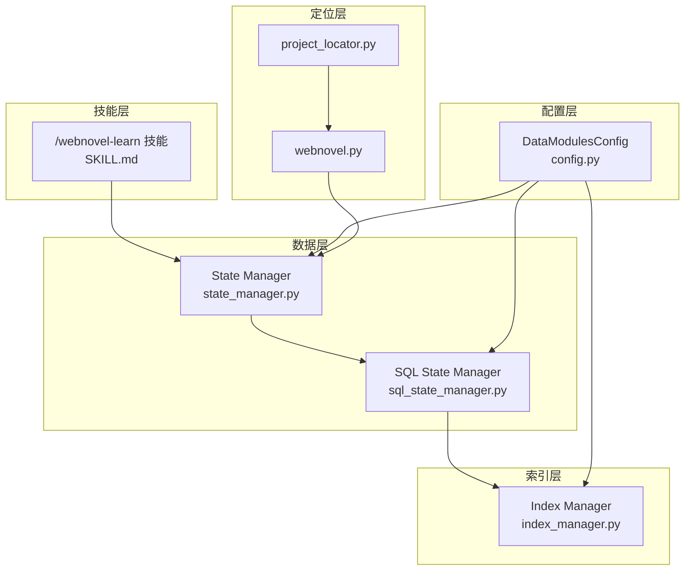
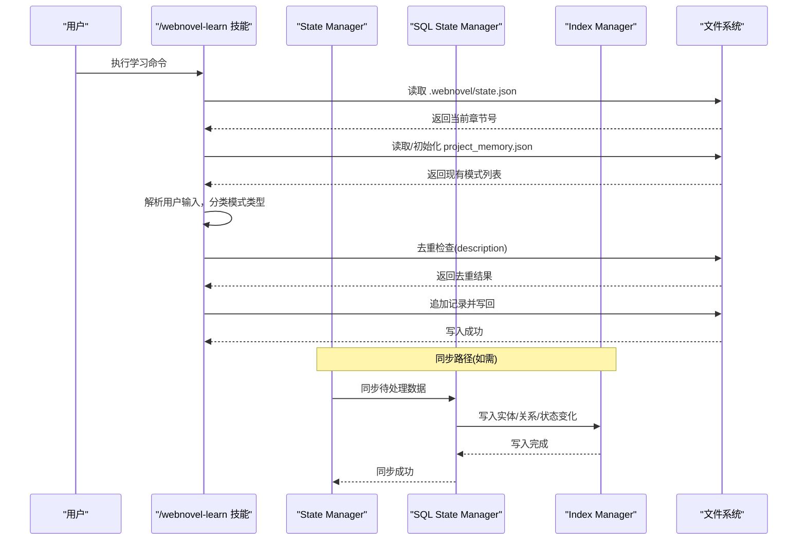
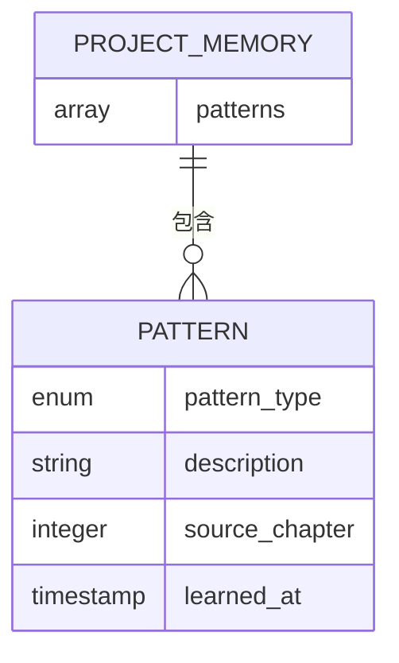
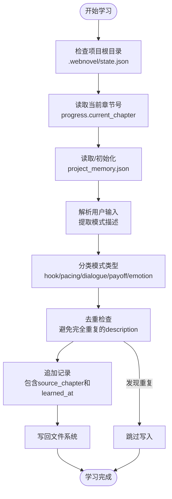
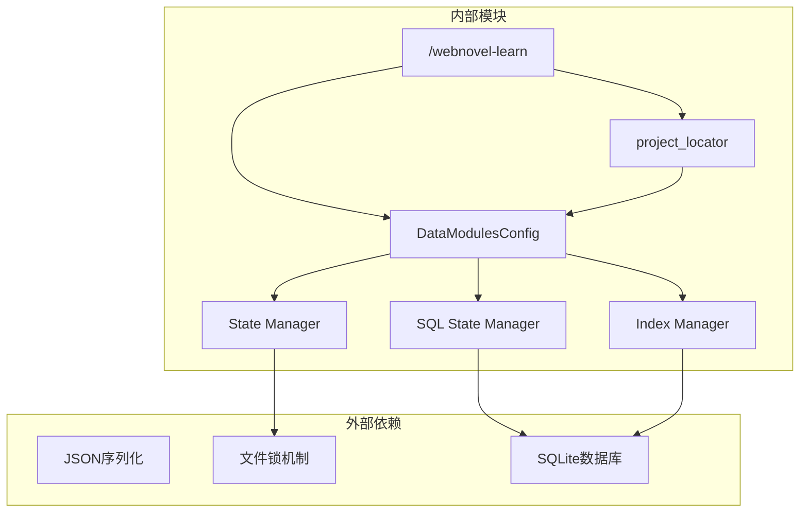

# 项目内存架构

<cite>
**本文档引用的文件**
- [project-memory-schema.md](file://webnovel-writer/references/project-memory-schema.md)
- [SKILL.md](file://webnovel-writer/skills/webnovel-learn/SKILL.md)
- [state_manager.py](file://webnovel-writer/scripts/data_modules/state_manager.py)
- [sql_state_manager.py](file://webnovel-writer/scripts/data_modules/sql_state_manager.py)
- [index_manager.py](file://webnovel-writer/scripts/data_modules/index_manager.py)
- [config.py](file://webnovel-writer/scripts/data_modules/config.py)
- [project_locator.py](file://webnovel-writer/scripts/project_locator.py)
- [webnovel.py](file://webnovel-writer/scripts/webnovel.py)
- [claude_runner.py](file://webnovel-writer/dashboard/claude_runner.py)
</cite>

## 目录
1. [简介](#简介)
2. [项目结构](#项目结构)
3. [核心组件](#核心组件)
4. [架构概览](#架构概览)
5. [详细组件分析](#详细组件分析)
6. [依赖关系分析](#依赖关系分析)
7. [性能考量](#性能考量)
8. [故障排除指南](#故障排除指南)
9. [结论](#结论)
10. [附录](#附录)

## 简介
本文件系统性阐述项目内存架构中的"项目记忆"(project memory)设计与实现，重点围绕以下目标：
- 解释 project_memory.json 的设计理念与数据结构
- 详述写作模式的存储机制与生命周期管理
- 说明模式类型分类(hook、pacing、dialogue、payoff、emotion)及学习复用流程
- 展示如何通过/webnovel-learn技能模块实现模式的学习与持久化
- 提供最佳实践与常见使用场景

## 项目结构
项目采用分层架构，核心围绕以下模块协同工作：
- 技能层：/webnovel-learn 技能负责从当前会话提取成功模式并写入 project_memory.json
- 数据层：State Manager 与 SQL State Manager 负责状态与实体数据的读写与同步
- 索引层：Index Manager 负责 SQLite 数据库的表结构与查询接口
- 配置层：DataModulesConfig 提供统一的路径与配置管理
- 定位层：project_locator 提供项目根目录解析能力

**图表来源**
- [SKILL.md:1-46](file://webnovel-writer/skills/webnovel-learn/SKILL.md#L1-L46)
- [state_manager.py:90-140](file://webnovel-writer/scripts/data_modules/state_manager.py#L90-L140)
- [sql_state_manager.py:46-100](file://webnovel-writer/scripts/data_modules/sql_state_manager.py#L46-L100)
- [index_manager.py:228-234](file://webnovel-writer/scripts/data_modules/index_manager.py#L228-L234)
- [config.py:90-122](file://webnovel-writer/scripts/data_modules/config.py#L90-L122)
- [project_locator.py:1-34](file://webnovel-writer/scripts/project_locator.py#L1-L34)
- [webnovel.py:1-36](file://webnovel-writer/scripts/webnovel.py#L1-L36)

**章节来源**
- [project-memory-schema.md:1-26](file://webnovel-writer/references/project-memory-schema.md#L1-L26)
- [SKILL.md:1-46](file://webnovel-writer/skills/webnovel-learn/SKILL.md#L1-L46)

## 核心组件
本节深入分析项目记忆架构的核心组件及其职责。

### project_memory.json 设计
project_memory.json 是项目记忆的载体，专门用于保存长期可复用的写作模式。其设计遵循以下原则：
- 仅追加写入，不删除旧记录
- 去重策略：避免完全重复的 description
- 结构简洁：包含模式类型、描述、来源章节和学习时间戳

数据结构要点：
- patterns: 已验证的写作模式列表
- pattern_type: 模式类型枚举(hook/pacing/dialogue/payoff/emotion)
- description: 可复用描述文本
- source_chapter: 模式首次出现的章节编号
- learned_at: ISO 8601格式的时间戳

**章节来源**
- [project-memory-schema.md:1-26](file://webnovel-writer/references/project-memory-schema.md#L1-L26)

### /webnovel-learn 技能模块
/webnovel-learn 技能负责从当前会话提取成功模式并写入 project_memory.json。其执行流程如下：
1. 项目根目录保护：必须在包含 .webnovel/state.json 的目录下执行
2. 章节号获取：从 state.json 的 progress.current_chapter 读取当前章节
3. 文件读取：读取或初始化 .webnovel/project_memory.json
4. 模式分类：解析用户输入，归类 pattern_type
5. 去重处理：检查 description 是否已存在
6. 写回持久化：追加记录并写回文件

**章节来源**
- [SKILL.md:7-46](file://webnovel-writer/skills/webnovel-learn/SKILL.md#L7-L46)

### State Manager 与 SQLite 同步
State Manager(v5.1引入)实现了与 SQLite 的双向同步：
- state.json 保留精简数据，大数据自动迁移到 SQLite
- 支持原子写入与并发安全
- 提供增量合并机制，避免覆盖风险

关键特性：
- 锁机制：使用 state.json.lock 防止并发写入冲突
- 增量合并：仅合并本实例产生的增量
- SQLite 同步：失败时保留 pending 以便重试

**章节来源**
- [state_manager.py:208-370](file://webnovel-writer/scripts/data_modules/state_manager.py#L208-L370)

### SQL State Manager
SQL State Manager 作为 SQLite 的高级接口，提供与 StateManager 兼容的接口：
- 替代 state.json 中的大数据字段
- 支持实体、别名、状态变化、关系的高效存储
- 提供批量写入接口，优化 Data Agent 性能

核心接口：
- upsert_entity: 插入或更新实体
- record_state_change: 记录状态变化
- upsert_relationship: 插入或更新关系
- process_chapter_entities: 处理章节实体数据

**章节来源**
- [sql_state_manager.py:46-100](file://webnovel-writer/scripts/data_modules/sql_state_manager.py#L46-L100)

### Index Manager
Index Manager 负责 SQLite 数据库的表结构与查询接口：
- v5.1 引入：entities、aliases、state_changes、relationships 表
- v5.3 引入：追读力债务管理相关表
- v5.4 引入：无效事实、工具调用统计、审查指标等表

主要表结构：
- entities: 实体信息表
- aliases: 别名索引表
- state_changes: 状态变化记录表
- relationships: 关系存储表
- chase_debt: 追读力债务表

**章节来源**
- [index_manager.py:228-620](file://webnovel-writer/scripts/data_modules/index_manager.py#L228-L620)

## 架构概览
项目内存架构采用分层设计，确保数据一致性与性能：

**图表来源**
- [SKILL.md:37-41](file://webnovel-writer/skills/webnovel-learn/SKILL.md#L37-L41)
- [state_manager.py:371-406](file://webnovel-writer/scripts/data_modules/state_manager.py#L371-L406)
- [sql_state_manager.py:267-417](file://webnovel-writer/scripts/data_modules/sql_state_manager.py#L267-L417)

## 详细组件分析

### 项目记忆数据模型
项目记忆采用简洁而强大的数据模型：

**图表来源**
- [project-memory-schema.md:7-17](file://webnovel-writer/references/project-memory-schema.md#L7-L17)

模式类型分类：
- hook: 危机钩/悬念钩等开头设计
- pacing: 节奏控制与段落安排
- dialogue: 对话技巧与人物塑造
- payoff: 微型兑现与读者满足
- emotion: 情感渲染与共鸣设计

**章节来源**
- [project-memory-schema.md:20-25](file://webnovel-writer/references/project-memory-schema.md#L20-L25)

### 学习与复用流程
学习流程通过/webnovel-learn技能实现端到端自动化：

**图表来源**
- [SKILL.md:37-45](file://webnovel-writer/skills/webnovel-learn/SKILL.md#L37-L45)

### 生命周期管理
项目记忆的生命周期管理体现在以下几个方面：

1. **创建阶段**：首次学习时初始化空数组
2. **增长阶段**：每次学习新模式时追加记录
3. **维护阶段**：定期清理重复项，保持数据质量
4. **查询阶段**：根据模式类型进行筛选与检索

**章节来源**
- [SKILL.md:43-45](file://webnovel-writer/skills/webnovel-learn/SKILL.md#L43-L45)

### 来源章节追踪
每个模式都携带来源章节信息，便于追溯模式的产生背景：
- source_chapter 字段记录模式首次出现的章节
- 结合 learned_at 时间戳，形成完整的时空轨迹
- 支持按章节范围查询与统计分析

**章节来源**
- [project-memory-schema.md:11-14](file://webnovel-writer/references/project-memory-schema.md#L11-L14)

### 时间戳记录机制
learned_at 字段提供精确的时间记录：
- ISO 8601 格式，确保跨平台一致性
- 自动记录学习时刻，便于审计与分析
- 支持按时间排序与趋势分析

**章节来源**
- [project-memory-schema.md:14-14](file://webnovel-writer/references/project-memory-schema.md#L14-L14)

## 依赖关系分析

**图表来源**
- [config.py:90-122](file://webnovel-writer/scripts/data_modules/config.py#L90-L122)
- [project_locator.py:1-34](file://webnovel-writer/scripts/project_locator.py#L1-L34)
- [state_manager.py:237-239](file://webnovel-writer/scripts/data_modules/state_manager.py#L237-L239)
- [sql_state_manager.py:97-100](file://webnovel-writer/scripts/data_modules/sql_state_manager.py#L97-L100)
- [index_manager.py:231-234](file://webnovel-writer/scripts/data_modules/index_manager.py#L231-L234)

**章节来源**
- [config.py:90-122](file://webnovel-writer/scripts/data_modules/config.py#L90-L122)
- [project_locator.py:1-34](file://webnovel-writer/scripts/project_locator.py#L1-L34)

## 性能考量
项目内存架构在性能方面采取了多项优化措施：

### 并发安全
- 使用文件锁(state.json.lock)防止并发写入冲突
- 原子写入机制避免部分写入导致的数据损坏
- 锁超时机制(10秒)确保系统稳定性

### 数据分离
- state.json 仅保存精简数据，大数据迁移到 SQLite
- 避免 JSON 文件过大影响读写性能
- SQLite 提供高效的索引与查询能力

### 增量同步
- State Manager 仅合并增量变更
- 避免不必要的全量写入
- 失败重试机制保证数据一致性

## 故障排除指南

### 常见问题与解决方案

**问题1：找不到项目根目录**
- 现象：执行技能时报错，提示缺少 .webnovel/state.json
- 解决方案：使用 webnovel.py 的 where 命令确认项目根目录
- 预防措施：始终在项目根目录执行技能命令

**问题2：并发写入冲突**
- 现象：多个进程同时写入 state.json 导致失败
- 解决方案：等待锁释放(最多10秒)，或重启系统
- 预防措施：避免同时运行多个写入进程

**问题3：SQLite 同步失败**
- 现象：实体数据无法写入 SQLite
- 解决方案：检查数据库权限与磁盘空间
- 预防措施：定期备份 index.db

**章节来源**
- [state_manager.py:368-369](file://webnovel-writer/scripts/data_modules/state_manager.py#L368-L369)
- [webnovel.py:1-36](file://webnovel-writer/scripts/webnovel.py#L1-L36)

## 结论
项目内存架构通过精心设计的数据模型与分层架构，实现了写作模式的高效学习、存储与复用。其核心优势包括：

1. **简洁而强大的数据模型**：project_memory.json 采用极简设计，专注于模式存储
2. **可靠的并发安全机制**：文件锁与原子写入确保数据一致性
3. **灵活的扩展能力**：SQLite 支持大数据量与复杂查询
4. **完整的生命周期管理**：从创建到维护的全流程支持

该架构为写作项目的知识积累提供了坚实基础，支持模式的持续学习与智能复用。

## 附录

### 最佳实践指南
- **模式分类标准化**：严格遵循 hook/pacing/dialogue/payoff/emotion 分类
- **描述规范化**：使用简洁明确的语言描述模式特点
- **定期清理**：定期检查并清理重复的模式记录
- **版本控制**：将 project_memory.json 纳入版本控制系统

### 常见使用场景
- **新手作家**：通过学习优秀作品的模式快速提升写作技巧
- **经验作家**：系统化整理自己的写作套路，形成个人风格
- **团队协作**：共享团队的写作经验和模式库
- **项目复盘**：分析项目中模式的成功与失败案例