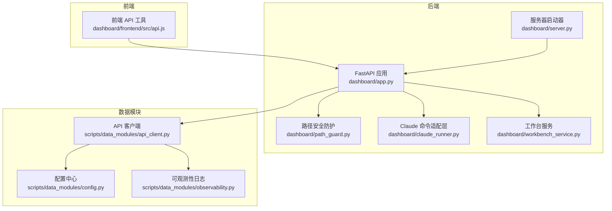
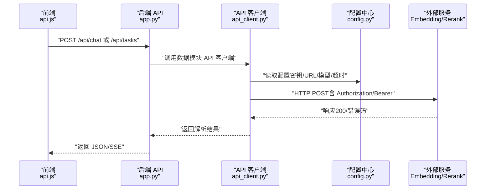
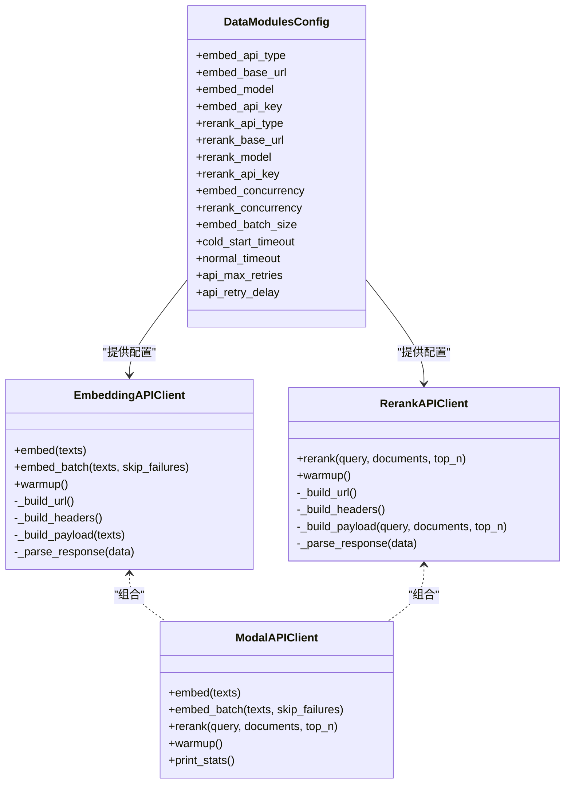
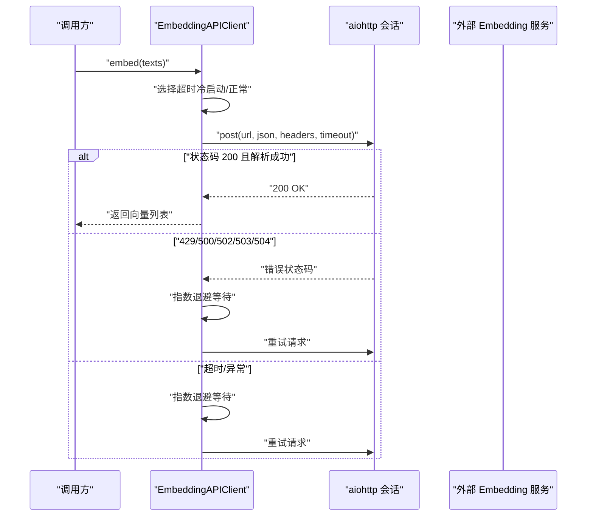
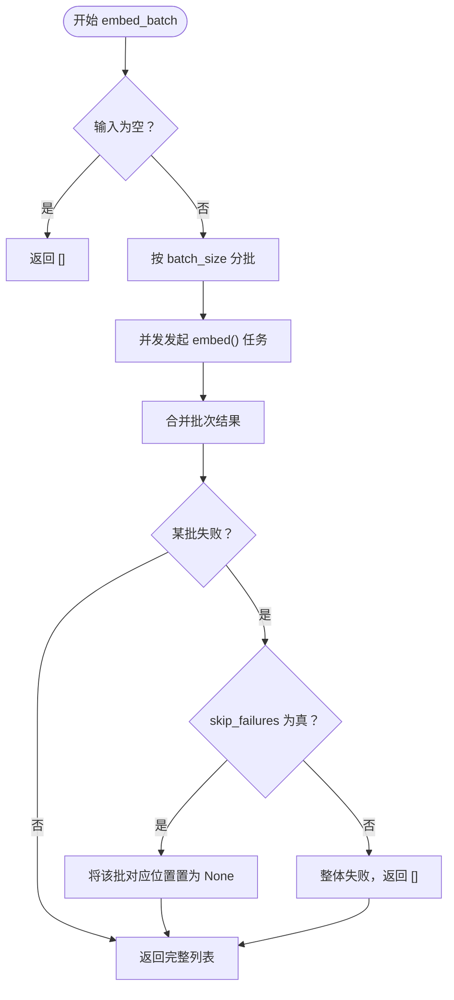
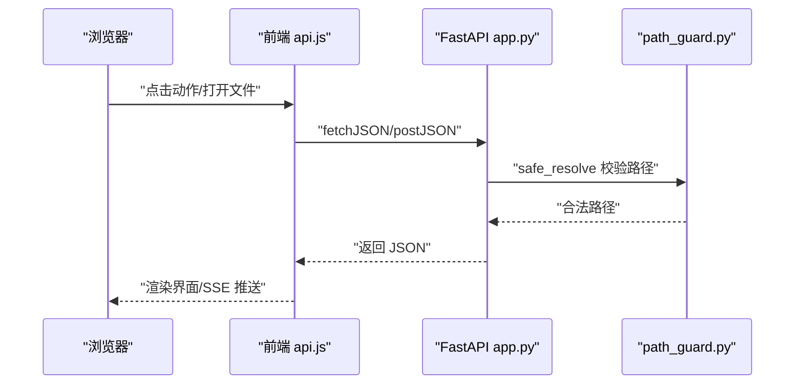
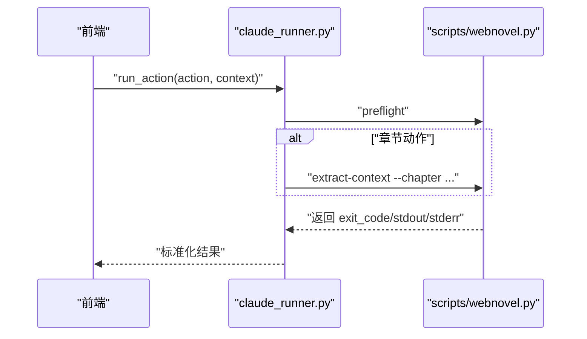
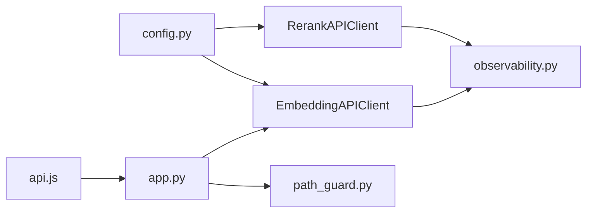

# API集成设置

<cite>
**本文引用的文件**
- [api_client.py](file://webnovel-writer/scripts/data_modules/api_client.py)
- [config.py](file://webnovel-writer/scripts/data_modules/config.py)
- [app.py](file://webnovel-writer/dashboard/app.py)
- [server.py](file://webnovel-writer/dashboard/server.py)
- [api.js](file://webnovel-writer/dashboard/frontend/src/api.js)
- [path_guard.py](file://webnovel-writer/dashboard/path_guard.py)
- [observability.py](file://webnovel-writer/scripts/data_modules/observability.py)
- [claude_runner.py](file://webnovel-writer/dashboard/claude_runner.py)
- [workbench_service.py](file://webnovel-writer/dashboard/workbench_service.py)
</cite>

## 目录
1. [简介](#简介)
2. [项目结构](#项目结构)
3. [核心组件](#核心组件)
4. [架构总览](#架构总览)
5. [详细组件分析](#详细组件分析)
6. [依赖分析](#依赖分析)
7. [性能考虑](#性能考虑)
8. [故障排查指南](#故障排查指南)
9. [结论](#结论)
10. [附录](#附录)

## 简介
本文件面向开发者与运维人员，系统化梳理 Webnovel Writer 中与“API集成设置”相关的实现与最佳实践，重点覆盖以下方面：
- Claude API 集成配置：API 密钥管理、请求频率限制、超时与重试机制
- API 客户端配置参数：连接池、并发请求限制、请求头与认证方式
- 不同 API 版本与接口类型的兼容性配置
- 错误处理策略与降级方案
- API 性能监控、速率限制管理与服务可用性保障
- API 安全配置、访问控制与数据保护

## 项目结构
围绕 API 集成的关键文件分布如下：
- 数据模块 API 客户端与配置：scripts/data_modules/api_client.py、scripts/data_modules/config.py
- Dashboard 后端服务：dashboard/app.py、dashboard/server.py
- 前端 API 工具：dashboard/frontend/src/api.js
- 安全与路径防护：dashboard/path_guard.py
- 可观测性与性能日志：scripts/data_modules/observability.py
- 与 Claude 命令执行适配层：dashboard/claude_runner.py
- 工作台辅助服务：dashboard/workbench_service.py

**图表来源**
- [app.py:50-489](file://webnovel-writer/dashboard/app.py#L50-L489)
- [server.py:43-67](file://webnovel-writer/dashboard/server.py#L43-L67)
- [api.js:1-78](file://webnovel-writer/dashboard/frontend/src/api.js#L1-L78)
- [config.py:90-343](file://webnovel-writer/scripts/data_modules/config.py#L90-L343)
- [api_client.py:41-496](file://webnovel-writer/scripts/data_modules/api_client.py#L41-L496)
- [path_guard.py:11-28](file://webnovel-writer/dashboard/path_guard.py#L11-L28)
- [observability.py:19-87](file://webnovel-writer/scripts/data_modules/observability.py#L19-L87)
- [claude_runner.py:13-142](file://webnovel-writer/dashboard/claude_runner.py#L13-L142)
- [workbench_service.py:18-171](file://webnovel-writer/dashboard/workbench_service.py#L18-L171)

**章节来源**
- [app.py:50-489](file://webnovel-writer/dashboard/app.py#L50-L489)
- [server.py:43-67](file://webnovel-writer/dashboard/server.py#L43-L67)
- [api.js:1-78](file://webnovel-writer/dashboard/frontend/src/api.js#L1-L78)
- [config.py:90-343](file://webnovel-writer/scripts/data_modules/config.py#L90-L343)
- [api_client.py:41-496](file://webnovel-writer/scripts/data_modules/api_client.py#L41-L496)
- [path_guard.py:11-28](file://webnovel-writer/dashboard/path_guard.py#L11-L28)
- [observability.py:19-87](file://webnovel-writer/scripts/data_modules/observability.py#L19-L87)
- [claude_runner.py:13-142](file://webnovel-writer/dashboard/claude_runner.py#L13-L142)
- [workbench_service.py:18-171](file://webnovel-writer/dashboard/workbench_service.py#L18-L171)

## 核心组件
- API 客户端（Embedding/Rerank/Modal 统一客户端）
  - 支持 OpenAI 兼容接口与 Modal 自定义接口
  - 提供并发控制、批量处理、指数退避重试、冷启动与正常请求超时区分
- 配置中心（DataModulesConfig）
  - 通过环境变量与 .env 文件加载 API 基础配置
  - 提供并发、超时、重试、检索与图谱相关参数
- Dashboard 后端（FastAPI）
  - 提供文件读写、任务、聊天、SSE 等 API
  - 采用路径安全防护与 CORS 配置
- 前端 API 工具
  - 封装 GET/POST 与 SSE 订阅，便于前端调用后端接口
- 可观测性
  - 工具调用日志与性能时间戳落盘，便于追踪与分析

**章节来源**
- [api_client.py:41-496](file://webnovel-writer/scripts/data_modules/api_client.py#L41-L496)
- [config.py:90-343](file://webnovel-writer/scripts/data_modules/config.py#L90-L343)
- [app.py:50-489](file://webnovel-writer/dashboard/app.py#L50-L489)
- [api.js:1-78](file://webnovel-writer/dashboard/frontend/src/api.js#L1-L78)
- [observability.py:19-87](file://webnovel-writer/scripts/data_modules/observability.py#L19-L87)

## 架构总览
后端通过 FastAPI 提供统一 API，前端通过 api.js 发起请求；数据模块中的 API 客户端负责与外部 Embedding/Rerank 服务通信，并通过配置中心集中管理密钥、URL、模型与超时等参数。

**图表来源**
- [api.js:17-25](file://webnovel-writer/dashboard/frontend/src/api.js#L17-L25)
- [app.py:420-429](file://webnovel-writer/dashboard/app.py#L420-L429)
- [api_client.py:118-195](file://webnovel-writer/scripts/data_modules/api_client.py#L118-L195)
- [config.py:124-156](file://webnovel-writer/scripts/data_modules/config.py#L124-L156)

## 详细组件分析

### API 客户端与配置参数
- API 类型与 URL 构建
  - 支持 openai 与 modal 两种类型
  - Embedding/Rerank URL 自动补齐 /v1/embeddings、/v1/rerank 或直接使用配置 URL
- 请求头与认证
  - Content-Type: application/json
  - Authorization: Bearer {api_key}（当配置存在时）
- 并发与连接池
  - 使用 asyncio.Semaphore 控制并发
  - aiohttp.ClientSession + TCPConnector，限制总连接与每主机连接数
- 超时与预热
  - 冷启动超时与正常超时区分
  - 首次调用后标记 warmed_up，切换到正常超时
- 重试机制
  - 对 429、500、502、503、504 状态码进行指数退避重试
  - 支持超时与异常的指数退避重试
- 批量处理
  - embed_batch 将输入按 batch_size 分批，支持跳过失败项或整体失败回退

**图表来源**
- [config.py:124-156](file://webnovel-writer/scripts/data_modules/config.py#L124-L156)
- [api_client.py:41-389](file://webnovel-writer/scripts/data_modules/api_client.py#L41-L389)

**章节来源**
- [api_client.py:41-389](file://webnovel-writer/scripts/data_modules/api_client.py#L41-L389)
- [config.py:124-156](file://webnovel-writer/scripts/data_modules/config.py#L124-L156)

### 请求流程与重试序列

**图表来源**
- [api_client.py:118-195](file://webnovel-writer/scripts/data_modules/api_client.py#L118-L195)

**章节来源**
- [api_client.py:118-195](file://webnovel-writer/scripts/data_modules/api_client.py#L118-L195)

### API 客户端调用流程（批量）

**图表来源**
- [api_client.py:197-232](file://webnovel-writer/scripts/data_modules/api_client.py#L197-L232)

**章节来源**
- [api_client.py:197-232](file://webnovel-writer/scripts/data_modules/api_client.py#L197-L232)

### Dashboard 后端与前端交互
- 后端提供文件读写、任务、聊天、SSE 等 API
- 前端通过 api.js 统一封装 fetch/post 与 SSE
- 路径访问经 path_guard 校验，防止路径穿越

**图表来源**
- [api.js:7-25](file://webnovel-writer/dashboard/frontend/src/api.js#L7-L25)
- [app.py:365-429](file://webnovel-writer/dashboard/app.py#L365-L429)
- [path_guard.py:11-28](file://webnovel-writer/dashboard/path_guard.py#L11-L28)

**章节来源**
- [api.js:1-78](file://webnovel-writer/dashboard/frontend/src/api.js#L1-L78)
- [app.py:365-429](file://webnovel-writer/dashboard/app.py#L365-L429)
- [path_guard.py:11-28](file://webnovel-writer/dashboard/path_guard.py#L11-L28)

### Claude 命令执行适配层
- 将前端动作映射为 CLI 命令，执行 preflight 与 extract-context 等步骤
- 返回标准化的执行结果（success、exit_code、stdout/stderr、result）

**图表来源**
- [claude_runner.py:13-112](file://webnovel-writer/dashboard/claude_runner.py#L13-L112)

**章节来源**
- [claude_runner.py:13-112](file://webnovel-writer/dashboard/claude_runner.py#L13-L112)

## 依赖分析
- API 客户端依赖配置中心提供的环境变量与 .env 加载逻辑
- Dashboard 后端依赖 path_guard 进行路径安全校验
- 前端通过 api.js 与后端 API 交互
- 可观测性模块提供工具调用与性能日志能力

**图表来源**
- [config.py:90-343](file://webnovel-writer/scripts/data_modules/config.py#L90-L343)
- [api_client.py:41-389](file://webnovel-writer/scripts/data_modules/api_client.py#L41-L389)
- [observability.py:19-87](file://webnovel-writer/scripts/data_modules/observability.py#L19-L87)
- [app.py:50-489](file://webnovel-writer/dashboard/app.py#L50-L489)
- [path_guard.py:11-28](file://webnovel-writer/dashboard/path_guard.py#L11-L28)
- [api.js:1-78](file://webnovel-writer/dashboard/frontend/src/api.js#L1-L78)

**章节来源**
- [config.py:90-343](file://webnovel-writer/scripts/data_modules/config.py#L90-L343)
- [api_client.py:41-389](file://webnovel-writer/scripts/data_modules/api_client.py#L41-L389)
- [observability.py:19-87](file://webnovel-writer/scripts/data_modules/observability.py#L19-L87)
- [app.py:50-489](file://webnovel-writer/dashboard/app.py#L50-L489)
- [path_guard.py:11-28](file://webnovel-writer/dashboard/path_guard.py#L11-L28)
- [api.js:1-78](file://webnovel-writer/dashboard/frontend/src/api.js#L1-L78)

## 性能考虑
- 并发与连接池
  - 通过 Semaphore 控制并发，避免过度占用资源
  - TCPConnector 限制总连接与每主机连接，降低连接风暴风险
- 超时与预热
  - 冷启动超时较长，首次调用后切换到正常超时，提升稳定性
- 批量处理
  - embed_batch 将大批量文本分批提交，减少单次请求负载
- 指数退避重试
  - 避免对上游服务造成雪崩效应，提高整体成功率
- 可观测性
  - 工具调用日志与性能时间戳落盘，便于定位瓶颈与回归分析

**章节来源**
- [api_client.py:57-61](file://webnovel-writer/scripts/data_modules/api_client.py#L57-L61)
- [api_client.py:123-125](file://webnovel-writer/scripts/data_modules/api_client.py#L123-L125)
- [api_client.py:157-162](file://webnovel-writer/scripts/data_modules/api_client.py#L157-L162)
- [api_client.py:214-218](file://webnovel-writer/scripts/data_modules/api_client.py#L214-L218)
- [observability.py:46-87](file://webnovel-writer/scripts/data_modules/observability.py#L46-L87)

## 故障排查指南
- API 密钥与 URL 配置
  - 确认环境变量或 .env 文件中包含正确的 EMBED_* 与 RERANK_* 参数
  - 若使用 modal 接口，请确保 base_url 指向正确端点
- 超时与重试
  - 若出现频繁超时，适当增大 normal_timeout 或调整 api_max_retries 与 api_retry_delay
  - 观察日志中的重试次数与延迟，确认是否为网络抖动或上游限流
- 并发与连接池
  - 如遇连接耗尽或队列堆积，降低 embed_concurrency/rerank_concurrency 或增大连接上限
- 路径访问错误
  - 若出现 403/路径越界，检查前端传入的相对路径是否位于允许的三大目录内
- SSE 连接问题
  - 前端 EventSource 会自动重连，如需诊断可在回调中记录错误状态
- Claude 命令执行失败
  - 查看 runner 返回的 exit_code/stdout/stderr，确认 preflight 与 extract-context 是否成功

**章节来源**
- [config.py:67-77](file://webnovel-writer/scripts/data_modules/config.py#L67-L77)
- [api_client.py:123-125](file://webnovel-writer/scripts/data_modules/api_client.py#L123-L125)
- [api_client.py:157-162](file://webnovel-writer/scripts/data_modules/api_client.py#L157-L162)
- [path_guard.py:11-28](file://webnovel-writer/dashboard/path_guard.py#L11-L28)
- [api.js:61-77](file://webnovel-writer/dashboard/frontend/src/api.js#L61-L77)
- [claude_runner.py:127-137](file://webnovel-writer/dashboard/claude_runner.py#L127-L137)

## 结论
本项目通过统一的配置中心与 API 客户端，实现了对多种 Embedding/Rerank 接口的兼容与稳健集成。结合并发控制、超时与重试、批量处理与可观测性，能够在保证性能的同时提升服务可用性与可维护性。前端与后端的清晰边界与安全防护进一步增强了系统的整体安全性与稳定性。

## 附录

### API 集成最佳实践
- 密钥管理
  - 使用 .env 文件集中管理密钥，避免硬编码
  - 为不同环境（开发/生产）分别维护 .env，避免交叉污染
- 超时与重试
  - 根据上游服务 SLA 调整 normal_timeout 与 api_max_retries
  - 对于 modal 自定义接口，确保 base_url 与 payload 字段与服务端一致
- 并发与连接池
  - 根据机器资源与上游并发限制合理设置 embed_concurrency/rerank_concurrency
  - TCPConnector 的 limit 与 limit_per_host 应与并发策略相匹配
- 安全与访问控制
  - 始终使用 path_guard 校验路径，防止路径穿越
  - CORS 配置应遵循最小暴露原则
- 监控与可观测性
  - 启用工具调用日志与性能时间戳，定期分析失败与慢调用
  - 在 Dashboard 层面增加健康检查与错误统计端点

**章节来源**
- [config.py:51-77](file://webnovel-writer/scripts/data_modules/config.py#L51-L77)
- [api_client.py:57-61](file://webnovel-writer/scripts/data_modules/api_client.py#L57-L61)
- [app.py:69-74](file://webnovel-writer/dashboard/app.py#L69-L74)
- [path_guard.py:11-28](file://webnovel-writer/dashboard/path_guard.py#L11-L28)
- [observability.py:19-87](file://webnovel-writer/scripts/data_modules/observability.py#L19-L87)