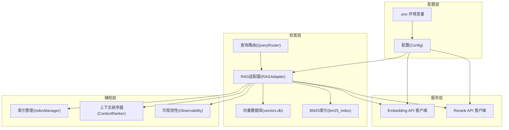
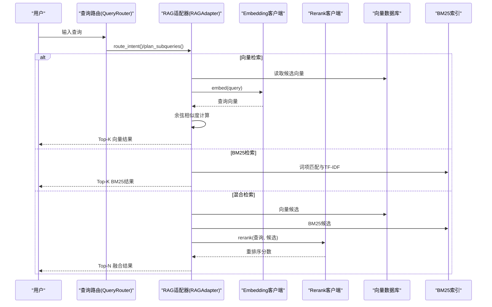
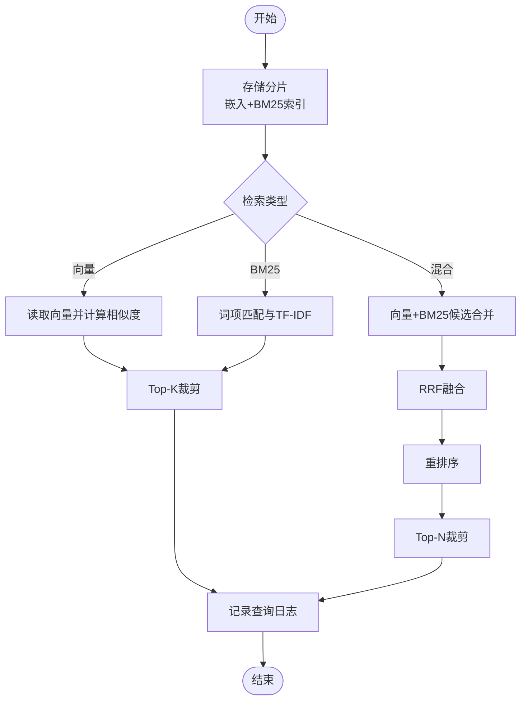
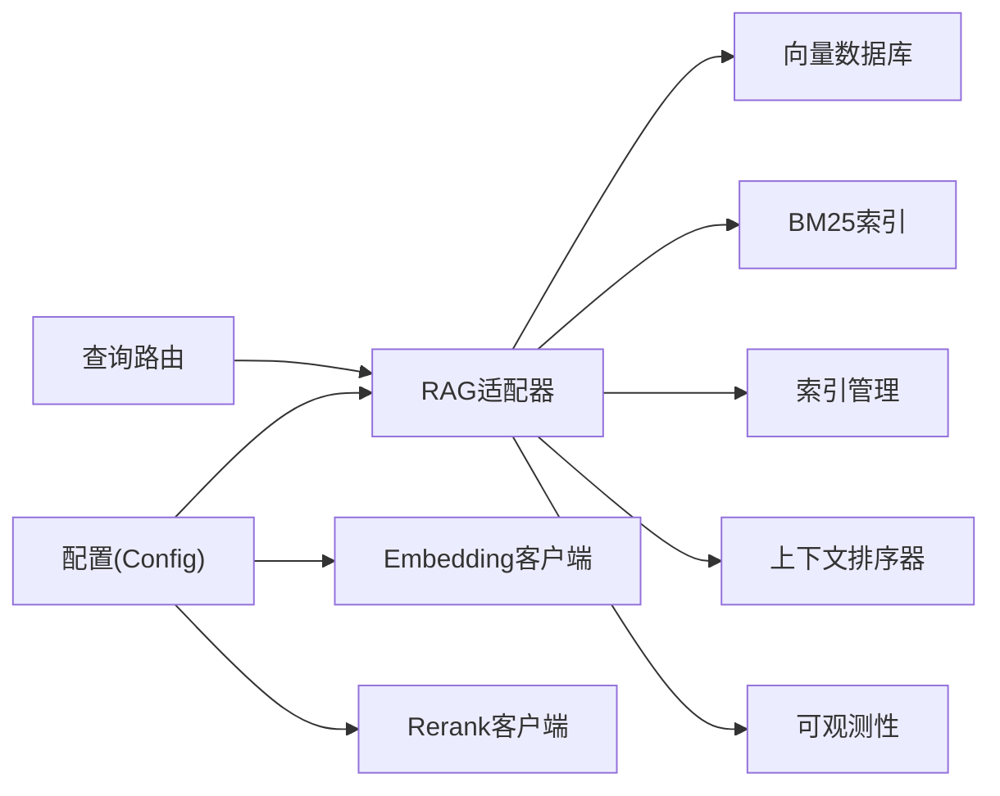

# RAG系统配置

<cite>
**本文引用的文件**
- [docs/rag-and-config.md](file://docs/rag-and-config.md)
- [webnovel-writer/scripts/data_modules/config.py](file://webnovel-writer/scripts/data_modules/config.py)
- [webnovel-writer/scripts/data_modules/api_client.py](file://webnovel-writer/scripts/data_modules/api_client.py)
- [webnovel-writer/scripts/data_modules/rag_adapter.py](file://webnovel-writer/scripts/data_modules/rag_adapter.py)
- [webnovel-writer/scripts/data_modules/query_router.py](file://webnovel-writer/scripts/data_modules/query_router.py)
- [webnovel-writer/scripts/data_modules/context_ranker.py](file://webnovel-writer/scripts/data_modules/context_ranker.py)
- [webnovel-writer/scripts/data_modules/index_manager.py](file://webnovel-writer/scripts/data_modules/index_manager.py)
- [webnovel-writer/scripts/data_modules/observability.py](file://webnovel-writer/scripts/data_modules/observability.py)
- [webnovel-writer/scripts/data_modules/context_weights.py](file://webnovel-writer/scripts/data_modules/context_weights.py)
- [webnovel-writer/scripts/data_modules/tests/test_rag_adapter.py](file://webnovel-writer/scripts/data_modules/tests/test_rag_adapter.py)
- [webnovel-writer/scripts/data_modules/tests/test_config.py](file://webnovel-writer/scripts/data_modules/tests/test_config.py)
</cite>

## 目录
1. [简介](#简介)
2. [项目结构](#项目结构)
3. [核心组件](#核心组件)
4. [架构总览](#架构总览)
5. [详细组件分析](#详细组件分析)
6. [依赖分析](#依赖分析)
7. [性能考虑](#性能考虑)
8. [故障排查指南](#故障排查指南)
9. [结论](#结论)
10. [附录](#附录)

## 简介
本文件面向数据工程师与系统管理员，提供Webnovel Writer项目中RAG（检索增强生成）系统的完整配置与运维指南。内容涵盖嵌入模型与重排序器的配置、向量数据库与BM25索引的结构、检索策略与参数调优、不同规模项目的批量处理与内存优化、性能监控与响应时间优化建议，以及基于仓库现有实现的实践要点。

## 项目结构
RAG系统主要由以下模块组成：
- 配置与环境加载：负责读取环境变量与.env文件，提供统一配置对象
- API客户端：封装Embedding与Rerank服务调用，支持并发、超时与重试
- RAG适配器：封装向量检索、BM25检索、混合检索与图谱增强检索
- 查询路由：根据查询意图自动选择检索策略
- 上下文排序器：对检索结果进行轻量级确定性排序
- 索引管理：维护SQLite索引库，支持实体、关系、出场记录等
- 可观测性：提供性能打点与工具调用日志
- 测试：验证RAG适配器、配置加载与降级行为

图表来源
- [webnovel-writer/scripts/data_modules/config.py:90-349](file://webnovel-writer/scripts/data_modules/config.py#L90-L349)
- [webnovel-writer/scripts/data_modules/api_client.py:41-496](file://webnovel-writer/scripts/data_modules/api_client.py#L41-L496)
- [webnovel-writer/scripts/data_modules/rag_adapter.py:68-254](file://webnovel-writer/scripts/data_modules/rag_adapter.py#L68-L254)
- [webnovel-writer/scripts/data_modules/query_router.py:10-145](file://webnovel-writer/scripts/data_modules/query_router.py#L10-L145)
- [webnovel-writer/scripts/data_modules/context_ranker.py:20-211](file://webnovel-writer/scripts/data_modules/context_ranker.py#L20-L211)
- [webnovel-writer/scripts/data_modules/index_manager.py:228-621](file://webnovel-writer/scripts/data_modules/index_manager.py#L228-L621)
- [webnovel-writer/scripts/data_modules/observability.py:46-88](file://webnovel-writer/scripts/data_modules/observability.py#L46-L88)

章节来源
- [webnovel-writer/scripts/data_modules/config.py:90-349](file://webnovel-writer/scripts/data_modules/config.py#L90-L349)
- [webnovel-writer/scripts/data_modules/api_client.py:41-496](file://webnovel-writer/scripts/data_modules/api_client.py#L41-L496)
- [webnovel-writer/scripts/data_modules/rag_adapter.py:68-254](file://webnovel-writer/scripts/data_modules/rag_adapter.py#L68-L254)
- [webnovel-writer/scripts/data_modules/query_router.py:10-145](file://webnovel-writer/scripts/data_modules/query_router.py#L10-L145)
- [webnovel-writer/scripts/data_modules/context_ranker.py:20-211](file://webnovel-writer/scripts/data_modules/context_ranker.py#L20-L211)
- [webnovel-writer/scripts/data_modules/index_manager.py:228-621](file://webnovel-writer/scripts/data_modules/index_manager.py#L228-L621)
- [webnovel-writer/scripts/data_modules/observability.py:46-88](file://webnovel-writer/scripts/data_modules/observability.py#L46-L88)

## 核心组件
- 配置与环境加载
  - 通过环境变量与.env文件加载API配置（嵌入与重排序）
  - 支持项目级与用户级全局.env优先级
  - 提供默认值与运行时路径推导
- API客户端
  - 支持OpenAI兼容与Modal自定义接口
  - 并发控制、批量分片、指数退避重试、超时控制
  - 统一统计与预热机制
- RAG适配器
  - 向量检索：余弦相似度、过滤条件、Top-K裁剪
  - BM25检索：分词、词频、IDF、文档长度归一
  - 混合检索：RRF融合与重排序
  - 图谱增强检索：实体扩展与权重提升
  - 数据库：SQLite向量表、BM25倒排索引、文档统计
- 查询路由
  - 基于正则的意图识别与时间范围抽取
  - 自动规划子查询与策略映射
- 上下文排序器
  - 基于时效性、频率、钩子提示的轻量排序
- 索引管理
  - 章节、场景、实体、关系、出场记录等多表结构
  - RAG查询日志与工具调用统计
- 可观测性
  - 性能打点与错误兜底日志

章节来源
- [webnovel-writer/scripts/data_modules/config.py:30-77](file://webnovel-writer/scripts/data_modules/config.py#L30-L77)
- [webnovel-writer/scripts/data_modules/api_client.py:41-496](file://webnovel-writer/scripts/data_modules/api_client.py#L41-L496)
- [webnovel-writer/scripts/data_modules/rag_adapter.py:68-254](file://webnovel-writer/scripts/data_modules/rag_adapter.py#L68-L254)
- [webnovel-writer/scripts/data_modules/query_router.py:10-145](file://webnovel-writer/scripts/data_modules/query_router.py#L10-L145)
- [webnovel-writer/scripts/data_modules/context_ranker.py:20-211](file://webnovel-writer/scripts/data_modules/context_ranker.py#L20-L211)
- [webnovel-writer/scripts/data_modules/index_manager.py:228-621](file://webnovel-writer/scripts/data_modules/index_manager.py#L228-L621)
- [webnovel-writer/scripts/data_modules/observability.py:46-88](file://webnovel-writer/scripts/data_modules/observability.py#L46-L88)

## 架构总览
RAG检索流程由查询路由决定策略，随后在RAG适配器中执行具体检索与融合，必要时调用API客户端进行嵌入或重排序，最终通过上下文排序器输出Top-K结果。

图表来源
- [webnovel-writer/scripts/data_modules/query_router.py:67-137](file://webnovel-writer/scripts/data_modules/query_router.py#L67-L137)
- [webnovel-writer/scripts/data_modules/rag_adapter.py:560-777](file://webnovel-writer/scripts/data_modules/rag_adapter.py#L560-L777)
- [webnovel-writer/scripts/data_modules/api_client.py:118-383](file://webnovel-writer/scripts/data_modules/api_client.py#L118-L383)

章节来源
- [webnovel-writer/scripts/data_modules/query_router.py:67-137](file://webnovel-writer/scripts/data_modules/query_router.py#L67-L137)
- [webnovel-writer/scripts/data_modules/rag_adapter.py:560-777](file://webnovel-writer/scripts/data_modules/rag_adapter.py#L560-L777)
- [webnovel-writer/scripts/data_modules/api_client.py:118-383](file://webnovel-writer/scripts/data_modules/api_client.py#L118-L383)

## 详细组件分析

### 嵌入模型与重排序器配置
- 嵌入模型
  - 配置项：基础URL、模型名、API密钥、并发与批量大小
  - 默认模型：Qwen/Qwen3-Embedding-8B
  - 回退策略：当嵌入认证失败时进入降级模式
- 重排序器
  - 配置项：基础URL、模型名、API密钥、并发
  - 默认模型：jina-reranker-v3
- 环境变量加载顺序
  - 进程环境变量 > 项目根目录 .env > 用户级全局 ~/.claude/webnovel-writer/.env

章节来源
- [docs/rag-and-config.md:10-37](file://docs/rag-and-config.md#L10-L37)
- [webnovel-writer/scripts/data_modules/config.py:124-147](file://webnovel-writer/scripts/data_modules/config.py#L124-L147)
- [webnovel-writer/scripts/data_modules/api_client.py:41-117](file://webnovel-writer/scripts/data_modules/api_client.py#L41-L117)

### 向量数据库与BM25索引
- 向量表结构
  - 字段：chunk_id、chapter、scene_index、content、embedding、parent_chunk_id、chunk_type、source_file、created_at
  - 索引：chapter、parent_chunk_id、chunk_type
- BM25索引
  - 表：term、chunk_id、tf（词频）
  - 文档统计：chunk_id、doc_length
  - 索引：term
- 初始化与迁移
  - 自动检测缺失列并迁移，保留历史备份
  - schema版本管理

章节来源
- [webnovel-writer/scripts/data_modules/rag_adapter.py:40-244](file://webnovel-writer/scripts/data_modules/rag_adapter.py#L40-L244)
- [webnovel-writer/scripts/data_modules/rag_adapter.py:139-186](file://webnovel-writer/scripts/data_modules/rag_adapter.py#L139-L186)

### 检索策略与参数调优
- 向量检索
  - 过滤条件：按chunk_type与chapter上限过滤
  - 相似度：余弦相似度
  - Top-K：默认30
- BM25检索
  - 分词：中文字符与英文单词
  - 公式：IDF与BM25归一化
  - Top-K：默认20
- 混合检索
  - RRF融合参数k=60
  - 重排序Top-N：默认10
- 图谱增强检索
  - 启用开关、扩展步数、最大扩展实体数、候选限制、权重提升
  - 与实体别名与关系表联动

章节来源
- [webnovel-writer/scripts/data_modules/rag_adapter.py:558-777](file://webnovel-writer/scripts/data_modules/rag_adapter.py#L558-L777)
- [webnovel-writer/scripts/data_modules/config.py:157-175](file://webnovel-writer/scripts/data_modules/config.py#L157-L175)
- [webnovel-writer/scripts/data_modules/query_router.py:10-145](file://webnovel-writer/scripts/data_modules/query_router.py#L10-L145)
- [webnovel-writer/scripts/data_modules/index_manager.py:228-621](file://webnovel-writer/scripts/data_modules/index_manager.py#L228-L621)

### 查询路由与自动策略
- 意图识别：关系、实体、场景、设定、剧情
- 时间范围抽取：支持“第X到Y章”与“第X章”
- 自动规划：根据意图映射到策略（hybrid/bm25/graph_hybrid）

章节来源
- [webnovel-writer/scripts/data_modules/query_router.py:67-137](file://webnovel-writer/scripts/data_modules/query_router.py#L67-L137)

### 上下文排序器
- 排序目标：时效性优先、稳定高频实体、高信号钩子
- 组成：近期摘要、近期元信息、出场角色、故事骨架、告警
- 权重：时效权重、频率权重、钩子奖励、长度上限

章节来源
- [webnovel-writer/scripts/data_modules/context_ranker.py:20-211](file://webnovel-writer/scripts/data_modules/context_ranker.py#L20-L211)
- [webnovel-writer/scripts/data_modules/context_weights.py:12-38](file://webnovel-writer/scripts/data_modules/context_weights.py#L12-L38)

### API客户端与并发控制
- 并发与批量
  - 嵌入并发：64，重排序并发：32
  - 嵌入批量：64
- 超时与重试
  - 冷启动超时：300s，普通超时：180s
  - 最大重试：3次，指数退避
- 错误处理
  - 429/500/502/503/504可重试
  - 认证失败降级标记

章节来源
- [webnovel-writer/scripts/data_modules/config.py:144-156](file://webnovel-writer/scripts/data_modules/config.py#L144-L156)
- [webnovel-writer/scripts/data_modules/api_client.py:118-383](file://webnovel-writer/scripts/data_modules/api_client.py#L118-L383)

### RAG适配器核心流程
- 存储
  - 批量嵌入，失败项跳过并更新BM25索引
  - 向量序列化为二进制存储
- 检索
  - 向量：全表扫描或预筛选（受配置限制）
  - BM25：词项匹配与TF-IDF
  - 混合：RRF融合+重排序
  - 图谱：实体扩展与权重提升
- 日志
  - RAG查询日志：查询、类型、耗时、命中来源分布

图表来源
- [webnovel-writer/scripts/data_modules/rag_adapter.py:379-484](file://webnovel-writer/scripts/data_modules/rag_adapter.py#L379-L484)
- [webnovel-writer/scripts/data_modules/rag_adapter.py:560-777](file://webnovel-writer/scripts/data_modules/rag_adapter.py#L560-L777)

章节来源
- [webnovel-writer/scripts/data_modules/rag_adapter.py:379-484](file://webnovel-writer/scripts/data_modules/rag_adapter.py#L379-L484)
- [webnovel-writer/scripts/data_modules/rag_adapter.py:560-777](file://webnovel-writer/scripts/data_modules/rag_adapter.py#L560-L777)

## 依赖分析
- 组件耦合
  - RAG适配器依赖配置、API客户端、索引管理与可观测性
  - 查询路由独立，但被RAG适配器调用
  - 上下文排序器与RAG适配器解耦，仅消费检索结果
- 外部依赖
  - aiohttp用于异步HTTP调用
  - SQLite用于本地持久化
  - Pydantic用于数据校验（其他模块）

图表来源
- [webnovel-writer/scripts/data_modules/config.py:90-349](file://webnovel-writer/scripts/data_modules/config.py#L90-L349)
- [webnovel-writer/scripts/data_modules/rag_adapter.py:68-254](file://webnovel-writer/scripts/data_modules/rag_adapter.py#L68-L254)
- [webnovel-writer/scripts/data_modules/query_router.py:10-145](file://webnovel-writer/scripts/data_modules/query_router.py#L10-L145)
- [webnovel-writer/scripts/data_modules/context_ranker.py:20-211](file://webnovel-writer/scripts/data_modules/context_ranker.py#L20-L211)
- [webnovel-writer/scripts/data_modules/index_manager.py:228-621](file://webnovel-writer/scripts/data_modules/index_manager.py#L228-L621)
- [webnovel-writer/scripts/data_modules/observability.py:46-88](file://webnovel-writer/scripts/data_modules/observability.py#L46-L88)

章节来源
- [webnovel-writer/scripts/data_modules/config.py:90-349](file://webnovel-writer/scripts/data_modules/config.py#L90-L349)
- [webnovel-writer/scripts/data_modules/rag_adapter.py:68-254](file://webnovel-writer/scripts/data_modules/rag_adapter.py#L68-L254)
- [webnovel-writer/scripts/data_modules/query_router.py:10-145](file://webnovel-writer/scripts/data_modules/query_router.py#L10-L145)
- [webnovel-writer/scripts/data_modules/context_ranker.py:20-211](file://webnovel-writer/scripts/data_modules/context_ranker.py#L20-L211)
- [webnovel-writer/scripts/data_modules/index_manager.py:228-621](file://webnovel-writer/scripts/data_modules/index_manager.py#L228-L621)
- [webnovel-writer/scripts/data_modules/observability.py:46-88](file://webnovel-writer/scripts/data_modules/observability.py#L46-L88)

## 性能考虑
- 嵌入与重排序
  - 控制并发与批量大小，避免峰值拥塞
  - 合理设置超时与重试，降低冷启动抖动
- 向量检索
  - 对大规模向量库启用预筛选（如按章节上限或候选数限制）
  - 使用索引与Top-K裁剪减少排序开销
- BM25检索
  - 分词策略适合中英混杂文本，注意停用词与长度过滤
- 混合检索
  - RRF融合参数k需结合数据规模与召回需求调优
  - 重排序Top-N影响最终输出质量与延迟
- 存储与I/O
  - SQLite写入采用事务提交，批量写入减少锁竞争
  - 向量序列化为二进制，注意跨平台字节序一致性

章节来源
- [webnovel-writer/scripts/data_modules/config.py:144-175](file://webnovel-writer/scripts/data_modules/config.py#L144-L175)
- [webnovel-writer/scripts/data_modules/rag_adapter.py:558-777](file://webnovel-writer/scripts/data_modules/rag_adapter.py#L558-L777)
- [webnovel-writer/scripts/data_modules/api_client.py:118-383](file://webnovel-writer/scripts/data_modules/api_client.py#L118-L383)

## 故障排查指南
- 嵌入认证失败
  - 现象：进入降级模式，向量检索返回空
  - 处理：检查EMBED_API_KEY与权限
- 重排序服务异常
  - 现象：混合检索回退至候选集
  - 处理：检查RERANK_BASE_URL与网络连通性
- 数据库迁移失败
  - 现象：迁移报错并尝试从备份恢复
  - 处理：查看备份文件与迁移日志
- 查询日志写入失败
  - 现象：警告日志提示写入失败
  - 处理：检查索引数据库权限与磁盘空间

章节来源
- [webnovel-writer/scripts/data_modules/rag_adapter.py:83-111](file://webnovel-writer/scripts/data_modules/rag_adapter.py#L83-L111)
- [webnovel-writer/scripts/data_modules/rag_adapter.py:497-517](file://webnovel-writer/scripts/data_modules/rag_adapter.py#L497-L517)
- [webnovel-writer/scripts/data_modules/tests/test_rag_adapter.py:482-514](file://webnovel-writer/scripts/data_modules/tests/test_rag_adapter.py#L482-L514)

## 结论
本RAG系统通过明确的配置、可控的并发与重试、完善的索引与日志，提供了可扩展的检索能力。建议在生产环境中：
- 明确各环境的.env配置，避免串台
- 根据数据规模调整预筛选与Top-K参数
- 监控API统计与查询日志，持续优化响应时间
- 在大规模项目中启用图谱增强与重排序，提升相关性

## 附录

### 环境变量与最小配置
- 嵌入：EMBED_BASE_URL、EMBED_MODEL、EMBED_API_KEY
- 重排序：RERANK_BASE_URL、RERANK_MODEL、RERANK_API_KEY
- 加载顺序：进程环境变量 > 项目.env > 用户级全局.env

章节来源
- [docs/rag-and-config.md:15-37](file://docs/rag-and-config.md#L15-L37)

### 配置项速览（关键）
- 检索参数：vector_top_k、bm25_top_k、rerank_top_n、rrf_k
- 预筛选：vector_full_scan_max_vectors、vector_prefilter_bm25_candidates、vector_prefilter_recent_candidates
- 图谱RAG：graph_rag_enabled、graph_rag_expand_hops、graph_rag_max_expanded_entities、graph_rag_candidate_limit、graph_rag_boost_* 等
- 并发与超时：embed_concurrency、rerank_concurrency、embed_batch_size、cold_start_timeout、normal_timeout、api_max_retries、api_retry_delay
- 路径与数据库：vector_db、rag_db、index_db

章节来源
- [webnovel-writer/scripts/data_modules/config.py:157-175](file://webnovel-writer/scripts/data_modules/config.py#L157-L175)
- [webnovel-writer/scripts/data_modules/config.py:144-156](file://webnovel-writer/scripts/data_modules/config.py#L144-L156)
- [webnovel-writer/scripts/data_modules/config.py:306-314](file://webnovel-writer/scripts/data_modules/config.py#L306-L314)