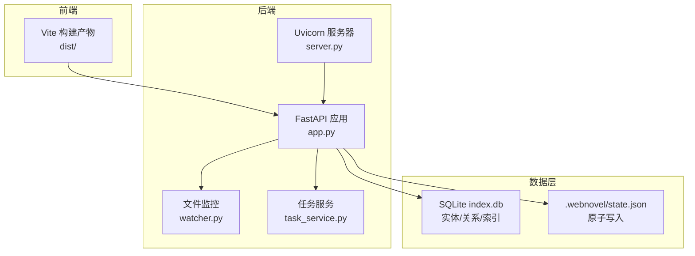
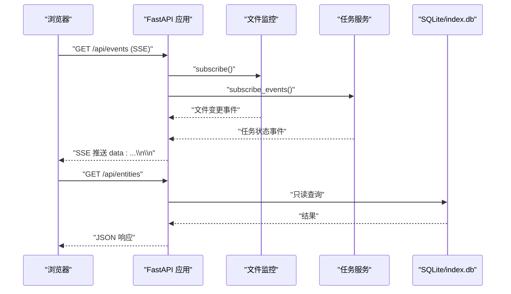
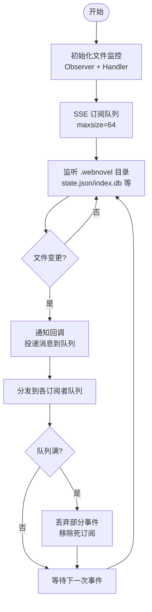
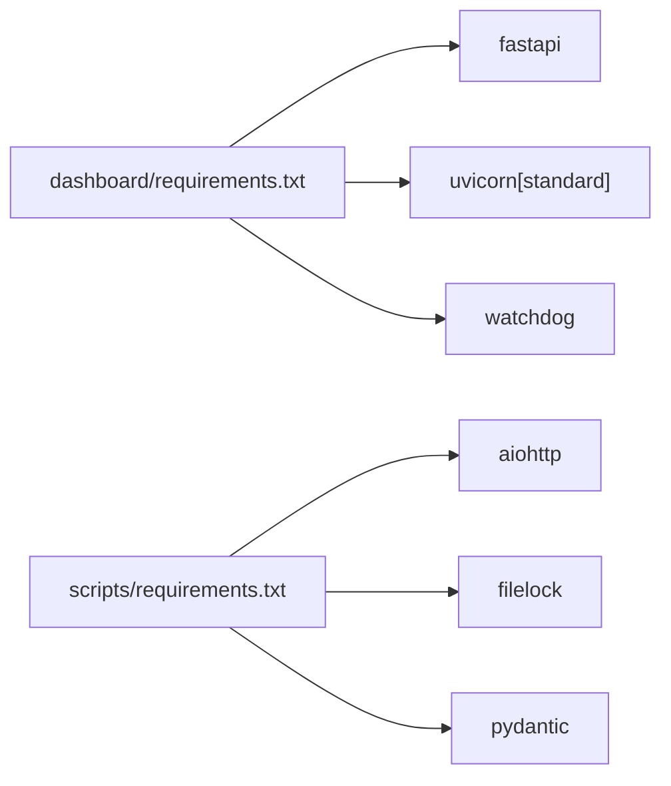

# 性能调优参数

<cite>
**本文引用的文件**
- [vite.config.js](file://webnovel-writer/dashboard/frontend/vite.config.js)
- [app.py](file://webnovel-writer/dashboard/app.py)
- [server.py](file://webnovel-writer/dashboard/server.py)
- [config.py](file://webnovel-writer/scripts/data_modules/config.py)
- [watcher.py](file://webnovel-writer/dashboard/watcher.py)
- [task_service.py](file://webnovel-writer/dashboard/task_service.py)
- [workbench_service.py](file://webnovel-writer/dashboard/workbench_service.py)
- [state_manager.py](file://webnovel-writer/scripts/data_modules/state_manager.py)
- [requirements.txt（仪表板）](file://webnovel-writer/dashboard/requirements.txt)
- [requirements.txt（脚本）](file://webnovel-writer/scripts/requirements.txt)
- [observability.py](file://webnovel-writer/scripts/data_modules/observability.py)
</cite>

## 目录
1. [简介](#简介)
2. [项目结构](#项目结构)
3. [核心组件](#核心组件)
4. [架构总览](#架构总览)
5. [详细组件分析](#详细组件分析)
6. [依赖分析](#依赖分析)
7. [性能考虑](#性能考虑)
8. [故障排查指南](#故障排查指南)
9. [结论](#结论)
10. [附录](#附录)

## 简介
本技术文档聚焦于 Webnovel Writer 的性能调优参数与实践，面向系统管理员与性能工程师，提供后端 FastAPI 服务、前端 Vite 构建、数据库与缓存策略、并发与内存优化、实时事件推送、以及不同负载场景下的调优建议与监控指标。文档基于仓库中的实际实现进行分析，避免臆测，确保可落地。

## 项目结构
- 前端：Vite React 应用，打包输出至 dist，由后端 FastAPI 静态托管。
- 后端：FastAPI 应用，提供只读查询 API、文件读写、任务队列、SSE 实时推送。
- 数据层：SQLite（index.db）承载实体/关系/检索向量等只读数据；state.json 通过原子写入与 SQLite 同步保证一致性。
- 配置层：集中于数据模块配置，包含嵌入/重排序并发、超时、重试、检索参数、上下文预算等。

图表来源
- [app.py:50-490](file://webnovel-writer/dashboard/app.py#L50-L490)
- [server.py:43-67](file://webnovel-writer/dashboard/server.py#L43-L67)
- [watcher.py:40-95](file://webnovel-writer/dashboard/watcher.py#L40-L95)
- [task_service.py:14-166](file://webnovel-writer/dashboard/task_service.py#L14-L166)

章节来源
- [vite.config.js:1-16](file://webnovel-writer/dashboard/frontend/vite.config.js#L1-L16)
- [app.py:50-490](file://webnovel-writer/dashboard/app.py#L50-L490)
- [server.py:43-67](file://webnovel-writer/dashboard/server.py#L43-L67)

## 核心组件
- FastAPI 应用与生命周期：应用工厂、CORS、静态文件挂载、SSE 实时推送。
- 文件监控与 SSE：基于 watchdog 的文件变更监听，向前端推送事件。
- 任务服务：线程池执行外部动作，异步事件广播。
- 数据模块配置：嵌入/重排序并发、超时、重试、检索参数、上下文预算等。
- 状态管理与 SQLite 同步：state.json 原子写入，大字段迁移至 SQLite，批量同步。
- 观测性：性能计时日志输出，便于定位长耗时步骤。

章节来源
- [app.py:50-490](file://webnovel-writer/dashboard/app.py#L50-L490)
- [watcher.py:40-95](file://webnovel-writer/dashboard/watcher.py#L40-L95)
- [task_service.py:14-166](file://webnovel-writer/dashboard/task_service.py#L14-L166)
- [config.py:90-349](file://webnovel-writer/scripts/data_modules/config.py#L90-L349)
- [state_manager.py:90-560](file://webnovel-writer/scripts/data_modules/state_manager.py#L90-L560)
- [observability.py:46-88](file://webnovel-writer/scripts/data_modules/observability.py#L46-L88)

## 架构总览
后端采用单进程 Uvicorn 托管 FastAPI，静态资源由 FastAPI 挂载；文件监控与任务服务在事件循环中运行，SSE 将文件变更与任务状态推送给前端。数据访问以只读为主，通过 SQLite 提供高效查询能力。

图表来源
- [app.py:434-460](file://webnovel-writer/dashboard/app.py#L434-L460)
- [watcher.py:50-78](file://webnovel-writer/dashboard/watcher.py#L50-L78)
- [task_service.py:25-165](file://webnovel-writer/dashboard/task_service.py#L25-L165)

## 详细组件分析

### 前端构建与优化参数（Vite）
- 构建目录：输出至 dist，空目录清理。
- 开发代理：将 /api 代理到本地后端地址，便于联调。
- 优化方向建议（基于现有配置）：
  - 代码分割：利用 Vite 的动态 import 自动分包；结合路由级懒加载减少首屏体积。
  - 资源压缩：生产模式默认启用 JS/HTML 压缩；可开启压缩级别与 CSS 压缩。
  - 缓存策略：静态资源带哈希名，配合 CDN/反向代理长期缓存；入口 HTML 可短期缓存。
  - 构建性能：并行编译、预构建依赖、合理拆分第三方库。

章节来源
- [vite.config.js:1-16](file://webnovel-writer/dashboard/frontend/vite.config.js#L1-L16)

### 后端 FastAPI 服务器配置
- 启动参数：主机、端口、自动打开浏览器。
- 应用工厂：生命周期管理、CORS、静态文件挂载、SSE 端点。
- 生产部署建议：
  - 进程数与线程：单进程 + Uvicorn 标准变体适合中小规模；高并发可考虑多进程 + 反向代理。
  - 连接池：Uvicorn 默认连接池适配；如需自定义，可在应用内注入或通过中间件。
  - 超时与并发：结合业务接口超时设置与任务队列并发上限，避免阻塞。
  - 健康检查：增加 /health 接口，便于探活与扩缩容决策。

章节来源
- [server.py:43-67](file://webnovel-writer/dashboard/server.py#L43-L67)
- [app.py:50-490](file://webnovel-writer/dashboard/app.py#L50-L490)

### 数据库与缓存策略（SQLite）
- 只读查询：通过 SQLite 承载实体/关系/检索向量等数据，提供高效查询。
- 索引与表结构：已创建常用索引（实体类型、别名、状态变更、关系等），提升查询性能。
- 大数据迁移：state.json 仅保留精简数据，大数据字段迁移至 SQLite，降低 JSON 体积。
- 建议：
  - 事务批处理：对批量写入使用事务，减少 fsync 次数。
  - WAL 模式：启用 WAL 提升并发读写性能（需在应用侧或数据库层配置）。
  - 连接复用：在应用内复用连接，避免频繁打开/关闭导致的句柄泄漏。
  - 索引维护：定期分析统计信息，必要时重建索引。

章节来源
- [state_manager.py:371-560](file://webnovel-writer/scripts/data_modules/state_manager.py#L371-L560)
- [state_manager.py:90-117](file://webnovel-writer/scripts/data_modules/state_manager.py#L90-L117)

### 并发处理限制与内存优化
- 嵌入/重排序并发：配置嵌入并发与批大小，避免外部 API 限流与自身资源耗尽。
- 任务队列：任务服务使用线程池执行外部动作，队列容量限制防止内存膨胀。
- 文件监控：订阅队列容量限制，避免事件堆积。
- 内存优化建议：
  - 分页与截断：对列表查询设置 limit，对日志与警告进行截断。
  - 上下文预算：动态上下文预算与窗口限制，避免一次性加载过多数据。
  - 锁与原子写：state.json 使用文件锁与原子写入，避免竞态与磁盘抖动。

章节来源
- [config.py:144-196](file://webnovel-writer/scripts/data_modules/config.py#L144-L196)
- [task_service.py:14-166](file://webnovel-writer/dashboard/task_service.py#L14-L166)
- [watcher.py:40-95](file://webnovel-writer/dashboard/watcher.py#L40-L95)
- [state_manager.py:208-370](file://webnovel-writer/scripts/data_modules/state_manager.py#L208-L370)

### 实时事件推送（SSE）
- SSE 端点：聚合文件监控与任务事件，向前端推送。
- 事件模型：文件变更与任务状态两类事件，前端据此刷新 UI。
- 性能要点：
  - 事件聚合：使用 asyncio.wait 聚合多个事件源，减少唤醒次数。
  - 队列容量：订阅队列容量限制，避免内存占用过高。
  - 取消与清理：取消未完成任务，释放订阅，避免悬挂。

章节来源
- [app.py:434-460](file://webnovel-writer/dashboard/app.py#L434-L460)
- [watcher.py:50-78](file://webnovel-writer/dashboard/watcher.py#L50-L78)
- [task_service.py:25-165](file://webnovel-writer/dashboard/task_service.py#L25-L165)

### 文件监控与事件推送流程

图表来源
- [watcher.py:40-95](file://webnovel-writer/dashboard/watcher.py#L40-L95)

## 依赖分析
- 后端依赖：FastAPI、Uvicorn、Watchdog。
- 数据模块依赖：aiohttp、filelock、pydantic。
- 版本约束：确保依赖版本满足最低要求，避免运行时差异。

图表来源
- [requirements.txt（仪表板）:1-4](file://webnovel-writer/dashboard/requirements.txt#L1-L4)
- [requirements.txt（脚本）:1-14](file://webnovel-writer/scripts/requirements.txt#L1-L14)

章节来源
- [requirements.txt（仪表板）:1-4](file://webnovel-writer/dashboard/requirements.txt#L1-L4)
- [requirements.txt（脚本）:1-14](file://webnovel-writer/scripts/requirements.txt#L1-L14)

## 性能考虑
- 高并发处理
  - 后端：Uvicorn 标准变体适合中小规模；高并发建议多进程 + 反向代理。
  - 前端：Vite 生产构建默认优化；结合 CDN 与缓存策略提升首屏。
  - 数据：SQLite 读多写少场景表现良好；写入使用事务批处理。
- 大数据集管理
  - state.json 仅保留精简数据，大数据迁移至 SQLite。
  - 查询设置 limit，避免一次性返回大量数据。
  - 对列表进行截断与去重，控制内存占用。
- 实时协作优化
  - SSE 聚合事件源，减少唤醒与网络开销。
  - 订阅队列容量限制，避免事件堆积。
  - 任务执行异步化，不影响主线程响应。
- 内存与 CPU
  - 嵌入/重排序并发与批大小需与外部 API 限额匹配。
  - 使用文件锁与原子写入，避免频繁 IO 与竞争。
- I/O 与网络
  - 外部 API 调用配置超时与重试，避免阻塞。
  - 前端代理到后端，减少跨域与额外跳转。

## 故障排查指南
- SSE 无事件
  - 检查文件监控是否启动、订阅队列是否被清理。
  - 查看任务事件订阅是否正常。
- 任务卡住或失败
  - 查看任务日志与状态，确认执行线程是否异常。
  - 检查外部动作执行器返回值与错误信息。
- 查询慢
  - 确认 SQLite 索引是否存在，查询是否带合适条件。
  - 检查是否超过查询限制（limit）。
- 写入失败
  - 检查 state.json 文件锁是否被占用。
  - 确认 SQLite 同步是否成功，失败时会回滚 pending。
- 观测性
  - 使用性能计时日志定位长耗时步骤，输出到 .webnovel/observability/data_agent_timing.jsonl。

章节来源
- [watcher.py:80-95](file://webnovel-writer/dashboard/watcher.py#L80-L95)
- [task_service.py:121-143](file://webnovel-writer/dashboard/task_service.py#L121-L143)
- [state_manager.py:371-560](file://webnovel-writer/scripts/data_modules/state_manager.py#L371-L560)
- [observability.py:46-88](file://webnovel-writer/scripts/data_modules/observability.py#L46-L88)

## 结论
本项目在后端采用 FastAPI + SQLite 的轻量架构，在前端采用 Vite 生产构建，整体具备良好的可扩展性与可观测性。通过合理的并发与批处理、查询限制与索引、SSE 事件聚合与订阅队列容量控制，可在不同负载场景下获得稳定性能。建议在生产环境中结合多进程部署、CDN 缓存与数据库 WAL 模式进一步优化吞吐与延迟。

## 附录
- 关键参数清单（节选）
  - 嵌入/重排序并发与批大小：见数据模块配置。
  - 查询限制与截断：见数据模块配置。
  - SSE 订阅队列容量：文件监控与任务服务均有限制。
  - SQLite 索引：实体/别名/状态变更/关系等常用索引已创建。
  - 观测性：性能计时日志输出路径与格式。

章节来源
- [config.py:144-349](file://webnovel-writer/scripts/data_modules/config.py#L144-L349)
- [watcher.py:50-78](file://webnovel-writer/dashboard/watcher.py#L50-L78)
- [task_service.py:25-165](file://webnovel-writer/dashboard/task_service.py#L25-L165)
- [state_manager.py:371-560](file://webnovel-writer/scripts/data_modules/state_manager.py#L371-L560)
- [observability.py:46-88](file://webnovel-writer/scripts/data_modules/observability.py#L46-L88)