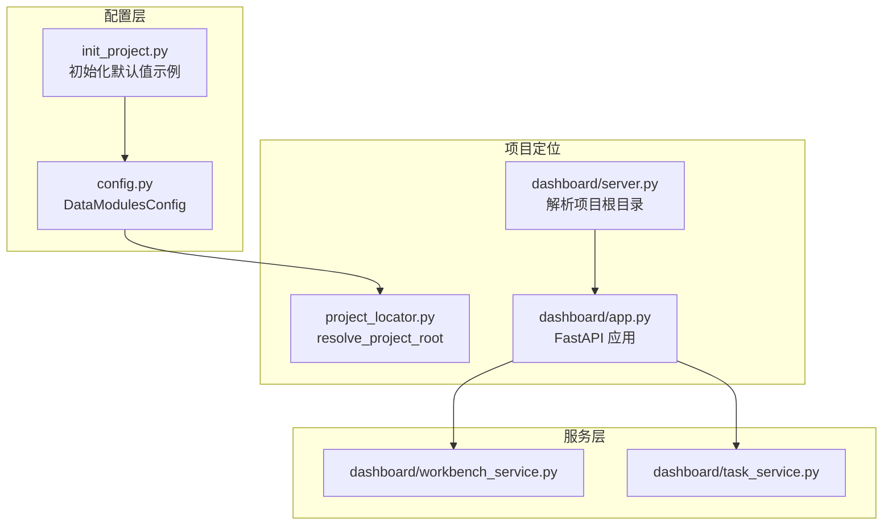
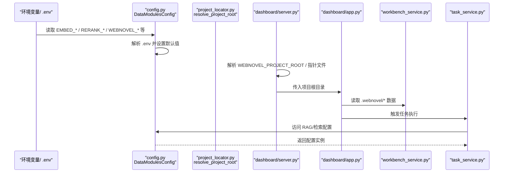
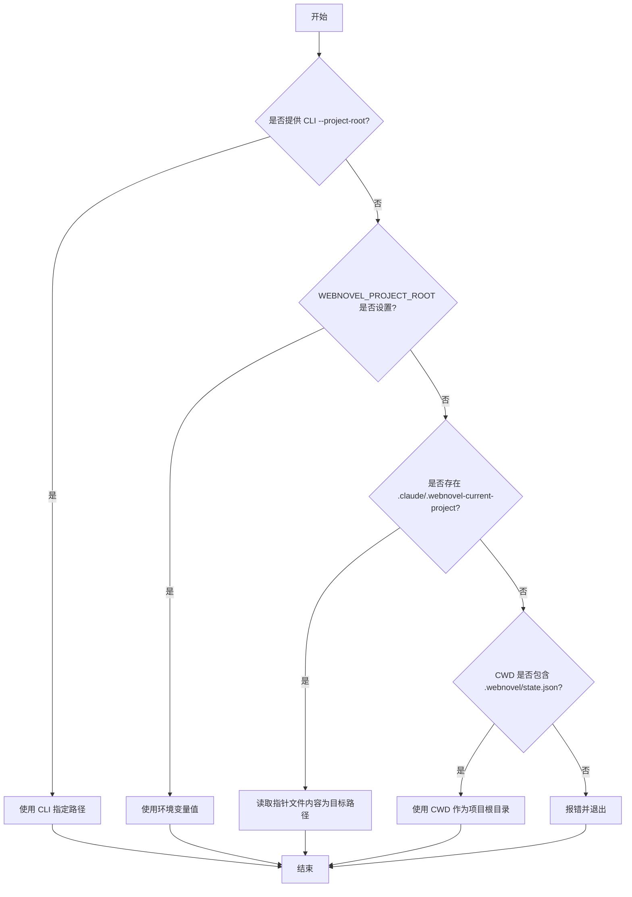
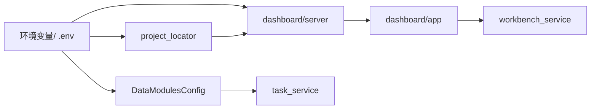

# 环境变量配置

<cite>
**本文引用的文件**
- [webnovel-writer/scripts/data_modules/config.py](file://webnovel-writer/scripts/data_modules/config.py)
- [webnovel-writer/scripts/data_modules/__init__.py](file://webnovel-writer/scripts/data_modules/__init__.py)
- [webnovel-writer/scripts/project_locator.py](file://webnovel-writer/scripts/project_locator.py)
- [webnovel-writer/dashboard/server.py](file://webnovel-writer/dashboard/server.py)
- [webnovel-writer/dashboard/app.py](file://webnovel-writer/dashboard/app.py)
- [webnovel-writer/dashboard/workbench_service.py](file://webnovel-writer/dashboard/workbench_service.py)
- [webnovel-writer/dashboard/task_service.py](file://webnovel-writer/dashboard/task_service.py)
- [webnovel-writer/scripts/init_project.py](file://webnovel-writer/scripts/init_project.py)
</cite>

## 目录
1. [简介](#简介)
2. [项目结构](#项目结构)
3. [核心组件](#核心组件)
4. [架构总览](#架构总览)
5. [详细组件分析](#详细组件分析)
6. [依赖分析](#依赖分析)
7. [性能考虑](#性能考虑)
8. [故障排查指南](#故障排查指南)
9. [结论](#结论)
10. [附录](#附录)

## 简介
本文件面向 Webnovel Writer 的运维与开发者，系统性梳理项目中涉及的环境变量配置，重点覆盖以下方面：
- 可用的环境变量清单、作用、数据类型、默认值与取值范围
- RAG 系统相关配置（嵌入、重排序、并发、超时、重试、检索参数等）
- 项目根目录定位与工作空间路径约定
- 安全管理与敏感信息保护策略
- 配置验证与最佳实践
- 不同部署环境（开发、测试、生产）与 Docker 容器化部署的配置示例
- 常见配置错误与排查方法

## 项目结构
围绕环境变量的关键文件分布如下：
- 配置加载与 RAG 参数：scripts/data_modules/config.py
- 项目根目录解析：scripts/project_locator.py
- Dashboard 启动与项目根目录传递：dashboard/server.py、dashboard/app.py
- 工作台与任务服务：dashboard/workbench_service.py、dashboard/task_service.py
- 包导出与模块组织：scripts/data_modules/__init__.py
- 初始化脚本中的默认环境变量示例：scripts/init_project.py

图表来源
- [webnovel-writer/scripts/data_modules/config.py:1-349](file://webnovel-writer/scripts/data_modules/config.py#L1-L349)
- [webnovel-writer/scripts/project_locator.py:1-428](file://webnovel-writer/scripts/project_locator.py#L1-L428)
- [webnovel-writer/dashboard/server.py:1-72](file://webnovel-writer/dashboard/server.py#L1-L72)
- [webnovel-writer/dashboard/app.py:1-513](file://webnovel-writer/dashboard/app.py#L1-L513)
- [webnovel-writer/dashboard/workbench_service.py:1-171](file://webnovel-writer/dashboard/workbench_service.py#L1-L171)
- [webnovel-writer/dashboard/task_service.py:1-166](file://webnovel-writer/dashboard/task_service.py#L1-L166)
- [webnovel-writer/scripts/init_project.py](file://webnovel-writer/scripts/init_project.py)

章节来源
- [webnovel-writer/scripts/data_modules/config.py:1-349](file://webnovel-writer/scripts/data_modules/config.py#L1-L349)
- [webnovel-writer/scripts/project_locator.py:1-428](file://webnovel-writer/scripts/project_locator.py#L1-L428)
- [webnovel-writer/dashboard/server.py:1-72](file://webnovel-writer/dashboard/server.py#L1-L72)
- [webnovel-writer/dashboard/app.py:1-513](file://webnovel-writer/dashboard/app.py#L1-L513)
- [webnovel-writer/dashboard/workbench_service.py:1-171](file://webnovel-writer/dashboard/workbench_service.py#L1-L171)
- [webnovel-writer/dashboard/task_service.py:1-166](file://webnovel-writer/dashboard/task_service.py#L1-L166)
- [webnovel-writer/scripts/init_project.py](file://webnovel-writer/scripts/init_project.py)

## 核心组件
本节聚焦与环境变量直接相关的配置类与解析逻辑。

- DataModulesConfig：集中定义 RAG 与检索相关参数，以及项目路径、数据库文件位置等。其字段通过 os.getenv 读取环境变量，支持 .env 文件注入。
- 项目根目录解析：支持 CLI、环境变量、指针文件、CWD 等多种方式定位项目根目录。
- Dashboard 启动流程：启动参数解析后创建 FastAPI 应用，应用内部使用项目根目录进行资源访问与数据库读取。

章节来源
- [webnovel-writer/scripts/data_modules/config.py:90-349](file://webnovel-writer/scripts/data_modules/config.py#L90-L349)
- [webnovel-writer/scripts/project_locator.py:1-428](file://webnovel-writer/scripts/project_locator.py#L1-L428)
- [webnovel-writer/dashboard/server.py:16-41](file://webnovel-writer/dashboard/server.py#L16-L41)
- [webnovel-writer/dashboard/app.py:50-66](file://webnovel-writer/dashboard/app.py#L50-L66)

## 架构总览
下图展示环境变量在系统中的传播路径与使用点：

图表来源
- [webnovel-writer/scripts/data_modules/config.py:30-77](file://webnovel-writer/scripts/data_modules/config.py#L30-L77)
- [webnovel-writer/scripts/data_modules/config.py:124-175](file://webnovel-writer/scripts/data_modules/config.py#L124-L175)
- [webnovel-writer/scripts/project_locator.py:334-407](file://webnovel-writer/scripts/project_locator.py#L334-L407)
- [webnovel-writer/dashboard/server.py:16-41](file://webnovel-writer/dashboard/server.py#L16-L41)
- [webnovel-writer/dashboard/app.py:50-66](file://webnovel-writer/dashboard/app.py#L50-L66)
- [webnovel-writer/dashboard/workbench_service.py:18-55](file://webnovel-writer/dashboard/workbench_service.py#L18-L55)
- [webnovel-writer/dashboard/task_service.py:121-143](file://webnovel-writer/dashboard/task_service.py#L121-L143)

## 详细组件分析

### 环境变量清单与说明
以下为与 RAG、项目根目录、路径与运行行为相关的核心环境变量。字段均来自配置类与项目定位逻辑。

- 项目根目录定位
  - WEBNOVEL_PROJECT_ROOT：字符串；显式指定项目根目录；优先级高于其他定位方式
  - CLAUDE_HOME / WEBNOVEL_CLAUDE_HOME：字符串；用于确定用户级全局 .env 与工作区注册表位置
  - CLAUDE_PROJECT_DIR：字符串；在某些上下文中作为工作区提示
  - .claude/.webnovel-current-project：文件；记录当前项目根目录的指针文件
  - CWD 下 .webnovel/state.json：文件；作为回退定位依据之一

- RAG 与检索配置
  - EMBED_BASE_URL：字符串；嵌入服务基础 URL，默认值来自配置类
  - EMBED_MODEL：字符串；嵌入模型名称，默认值来自配置类
  - EMBED_API_KEY：字符串；嵌入服务 API 密钥，默认值来自配置类
  - RERANK_BASE_URL：字符串；重排序服务基础 URL，默认值来自配置类
  - RERANK_MODEL：字符串；重排序模型名称，默认值来自配置类
  - RERANK_API_KEY：字符串；重排序服务 API 密钥，默认值来自配置类
  - embed_concurrency / rerank_concurrency：整数；并发线程数
  - embed_batch_size：整数；批处理大小
  - cold_start_timeout / normal_timeout：整数；超时秒数
  - api_max_retries / api_retry_delay：整数/浮点；最大重试次数与初始重试延迟（秒）
  - vector_top_k / bm25_top_k / rerank_top_n / rrf_k：整数；检索与融合参数
  - graph_rag_*：布尔/整数/浮点；Graph-RAG 开关与权重
  - 关系图开关：relationship_graph_from_index_enabled：布尔
  - 实体提取置信度阈值：extraction_confidence_high / extraction_confidence_medium：浮点
  - 列表截断限制：max_disambiguation_warnings / max_disambiguation_pending / max_state_changes：整数
  - 上下文窗口与预算：context_* 系列：整数/浮点/布尔/元组
  - 查询默认限制：query_* 系列：整数
  - 伏笔紧急度与节奏参数：foreshadowing_* 与 strand_* 系列：整数/浮点
  - RAG 存储路径：rag.db、vectors.db；位于 .webnovel 目录下

- 路径与工作空间
  - project_root：项目根目录（由定位逻辑决定）
  - webnovel_dir：.webnovel 目录
  - index.db / rag.db / vectors.db：SQLite/向量数据库文件
  - chapters_dir / settings_dir / outline_dir：正文/设定集/大纲目录

章节来源
- [webnovel-writer/scripts/data_modules/config.py:124-317](file://webnovel-writer/scripts/data_modules/config.py#L124-L317)
- [webnovel-writer/scripts/project_locator.py:31-407](file://webnovel-writer/scripts/project_locator.py#L31-L407)
- [webnovel-writer/dashboard/server.py:16-41](file://webnovel-writer/dashboard/server.py#L16-L41)

### 配置加载与 .env 注入机制
- 项目级 .env 优先于全局 .env；.env 文件按“键=值”格式解析，忽略注释与空行；默认不覆盖已存在的环境变量
- 在构造 DataModulesConfig 前会尝试加载项目级 .env，确保 EMBED_* / RERANK_* 等字段生效
- 用户级全局 .env 位于用户主目录下的特定路径，便于技能/代理在任意工作区共享密钥

章节来源
- [webnovel-writer/scripts/data_modules/config.py:30-77](file://webnovel-writer/scripts/data_modules/config.py#L30-L77)
- [webnovel-writer/scripts/data_modules/config.py:318-324](file://webnovel-writer/scripts/data_modules/config.py#L318-L324)

### 项目根目录解析流程
- 优先级顺序：CLI 参数 > 环境变量 WEBNOVEL_PROJECT_ROOT > .claude/.webnovel-current-project 指针 > CWD 下 .webnovel/state.json
- 若无法定位，启动失败并输出错误信息

图表来源
- [webnovel-writer/dashboard/server.py:16-41](file://webnovel-writer/dashboard/server.py#L16-L41)
- [webnovel-writer/scripts/project_locator.py:334-407](file://webnovel-writer/scripts/project_locator.py#L334-L407)

章节来源
- [webnovel-writer/dashboard/server.py:16-41](file://webnovel-writer/dashboard/server.py#L16-L41)
- [webnovel-writer/scripts/project_locator.py:334-407](file://webnovel-writer/scripts/project_locator.py#L334-L407)

### RAG 与检索配置要点
- 嵌入与重排序：通过 EMBED_* 与 RERANK_* 环境变量控制；默认值来自配置类，便于快速上手
- 并发与批处理：embed_concurrency、rerank_concurrency、embed_batch_size 影响吞吐与资源占用
- 超时与重试：cold_start_timeout、normal_timeout、api_max_retries、api_retry_delay 控制稳定性与响应时间
- 检索参数：vector_top_k、bm25_top_k、rerank_top_n、rrf_k 控制召回质量与速度
- Graph-RAG：graph_rag_enabled、graph_rag_* 权重与候选限制影响图谱增强效果
- 存储路径：rag.db、vectors.db 位于 .webnovel 目录，随项目根目录变化而变化

章节来源
- [webnovel-writer/scripts/data_modules/config.py:144-175](file://webnovel-writer/scripts/data_modules/config.py#L144-L175)
- [webnovel-writer/scripts/data_modules/config.py:176-199](file://webnovel-writer/scripts/data_modules/config.py#L176-L199)
- [webnovel-writer/scripts/data_modules/config.py:306-317](file://webnovel-writer/scripts/data_modules/config.py#L306-L317)

### 安全管理与敏感信息保护
- .env 文件加载遵循“显式 > .env”的优先级，避免无意覆盖已设置的环境变量
- 建议将 API 密钥存放在受控的 .env 或系统环境变量中，不在版本控制中提交
- 用户级全局 .env 位于用户主目录，降低泄露面；同时可通过权限控制文件访问
- Dashboard 仅对受控目录（正文/大纲/设定集）进行读写操作，防止路径穿越

章节来源
- [webnovel-writer/scripts/data_modules/config.py:30-48](file://webnovel-writer/scripts/data_modules/config.py#L30-L48)
- [webnovel-writer/dashboard/app.py:369-385](file://webnovel-writer/dashboard/app.py#L369-L385)

### 配置验证机制
- 项目根目录定位失败时，启动即刻报错，避免静默失败
- RAG 配置类在构造时读取环境变量并提供默认值，便于快速验证
- Dashboard 对文件读写进行路径白名单校验，防止越权访问

章节来源
- [webnovel-writer/dashboard/server.py:39-41](file://webnovel-writer/dashboard/server.py#L39-L41)
- [webnovel-writer/scripts/data_modules/config.py:124-175](file://webnovel-writer/scripts/data_modules/config.py#L124-L175)
- [webnovel-writer/dashboard/app.py:369-385](file://webnovel-writer/dashboard/app.py#L369-L385)

### 部署环境与 Docker 配置示例
以下示例基于仓库中已有的环境变量与默认值，帮助你在不同环境中快速落地。请根据实际部署平台调整变量名与值。

- 开发环境
  - 设置项目根目录：WEBNOVEL_PROJECT_ROOT=/path/to/your/novel-project
  - 嵌入与重排序服务：参考默认值，如需自定义可设置 EMBED_BASE_URL、EMBED_MODEL、EMBED_API_KEY、RERANK_BASE_URL、RERANK_MODEL、RERANK_API_KEY
  - Dashboard 启动：python -m dashboard.server --project-root /path/to/your/novel-project

- 测试环境
  - 与开发类似，但建议使用独立的 .env 文件存放测试密钥
  - 可通过环境变量覆盖默认并发与超时参数，以适配测试负载

- 生产环境
  - 将敏感信息放入受控的环境变量或密钥管理服务
  - 使用 WEBNOVEL_PROJECT_ROOT 明确指向生产项目目录
  - 通过 Docker 环境变量注入 RAG 与路径相关参数

- Docker 容器化部署
  - 通过 docker run -e 或 docker-compose environment 注入以下变量：
    - WEBNOVEL_PROJECT_ROOT
    - WEBNOVEL_CLAUDE_HOME 或 CLAUDE_HOME（用于用户级 .env 与注册表）
    - EMBED_BASE_URL、EMBED_MODEL、EMBED_API_KEY
    - RERANK_BASE_URL、RERANK_MODEL、RERANK_API_KEY
  - 将项目目录挂载到容器内对应路径，确保 .webnovel 与正文/大纲/设定集目录可被访问

章节来源
- [webnovel-writer/dashboard/server.py:43-67](file://webnovel-writer/dashboard/server.py#L43-L67)
- [webnovel-writer/scripts/data_modules/config.py:124-175](file://webnovel-writer/scripts/data_modules/config.py#L124-L175)
- [webnovel-writer/scripts/init_project.py:668-675](file://webnovel-writer/scripts/init_project.py#L668-L675)

### 配置文件模板
- 项目级 .env（位于项目根目录）示例字段（仅示意，值需替换为真实凭据）：
  - EMBED_BASE_URL=https://api-inference.modelscope.cn/v1
  - EMBED_MODEL=Qwen/Qwen3-Embedding-8B
  - EMBED_API_KEY=your-embed-api-key
  - RERANK_BASE_URL=https://api.jina.ai/v1
  - RERANK_MODEL=jina-reranker-v3
  - RERANK_API_KEY=your-rerank-api-key
- 用户级 .env（位于用户主目录下的特定路径）可用于存放通用密钥

章节来源
- [webnovel-writer/scripts/data_modules/config.py:51-64](file://webnovel-writer/scripts/data_modules/config.py#L51-L64)
- [webnovel-writer/scripts/data_modules/config.py:124-138](file://webnovel-writer/scripts/data_modules/config.py#L124-L138)
- [webnovel-writer/scripts/init_project.py:668-675](file://webnovel-writer/scripts/init_project.py#L668-L675)

### 最佳实践
- 明确区分“项目级 .env”与“用户级 .env”，前者用于项目私密配置，后者用于通用凭据
- 使用环境变量覆盖默认值时，确保与服务端点兼容（URL、模型名、密钥格式）
- 为不同环境准备独立的 .env 文件，避免混用
- 对敏感信息进行最小暴露原则，仅在必要容器/进程内注入
- 在 CI/CD 中通过密钥管理服务注入环境变量，避免硬编码

### 常见配置错误与排查
- 无法定位项目根目录
  - 现象：启动时报错，提示无法定位 PROJECT_ROOT
  - 排查：确认 WEBNOVEL_PROJECT_ROOT 是否设置；检查 .claude/.webnovel-current-project 是否存在且有效；确认 CWD 下是否存在 .webnovel/state.json
- RAG 请求失败或超时
  - 现象：嵌入/重排序请求报错或长时间等待
  - 排查：核对 EMBED_* / RERANK_* 是否正确；检查网络连通性与 API 密钥有效性；适当提高超时与并发参数
- 文件读写权限问题
  - 现象：Dashboard 报 403 或无法保存文件
  - 排查：确认项目根目录与 .webnovel 目录权限；检查保存路径是否在受控目录范围内
- .env 未生效
  - 现象：配置未按预期生效
  - 排查：确认 .env 文件格式（键=值）、注释与空行处理；确认未被更高优先级的环境变量覆盖

章节来源
- [webnovel-writer/dashboard/server.py:39-41](file://webnovel-writer/dashboard/server.py#L39-L41)
- [webnovel-writer/scripts/data_modules/config.py:30-48](file://webnovel-writer/scripts/data_modules/config.py#L30-L48)
- [webnovel-writer/dashboard/app.py:369-385](file://webnovel-writer/dashboard/app.py#L369-L385)

## 依赖分析
- 配置类 DataModulesConfig 依赖 os.getenv 读取环境变量，并在构造前加载 .env
- 项目定位模块依赖多种环境变量与文件系统约定
- Dashboard 服务依赖项目根目录进行资源访问与数据库读取

图表来源
- [webnovel-writer/scripts/data_modules/config.py:11-16](file://webnovel-writer/scripts/data_modules/config.py#L11-L16)
- [webnovel-writer/scripts/project_locator.py:31-34](file://webnovel-writer/scripts/project_locator.py#L31-L34)
- [webnovel-writer/dashboard/server.py:21-23](file://webnovel-writer/dashboard/server.py#L21-L23)
- [webnovel-writer/dashboard/app.py:50-66](file://webnovel-writer/dashboard/app.py#L50-L66)
- [webnovel-writer/dashboard/task_service.py:121-143](file://webnovel-writer/dashboard/task_service.py#L121-L143)

章节来源
- [webnovel-writer/scripts/data_modules/config.py:11-16](file://webnovel-writer/scripts/data_modules/config.py#L11-L16)
- [webnovel-writer/scripts/project_locator.py:31-34](file://webnovel-writer/scripts/project_locator.py#L31-L34)
- [webnovel-writer/dashboard/server.py:21-23](file://webnovel-writer/dashboard/server.py#L21-L23)
- [webnovel-writer/dashboard/app.py:50-66](file://webnovel-writer/dashboard/app.py#L50-L66)
- [webnovel-writer/dashboard/task_service.py:121-143](file://webnovel-writer/dashboard/task_service.py#L121-L143)

## 性能考虑
- 并发与批处理：合理设置 embed_concurrency、rerank_concurrency、embed_batch_size，避免过度并发导致资源争用
- 超时与重试：根据外部服务性能调优 cold_start_timeout、normal_timeout、api_max_retries、api_retry_delay
- 检索参数：vector_top_k、rerank_top_n 等参数影响召回质量与延迟，应结合业务场景权衡
- 存储路径：确保 .webnovel 目录所在磁盘具备良好 IO 性能

## 故障排查指南
- 项目根目录定位失败
  - 检查 WEBNOVEL_PROJECT_ROOT 是否设置
  - 检查 .claude/.webnovel-current-project 指针文件内容
  - 确认 CWD 下 .webnovel/state.json 存在
- RAG 请求异常
  - 核对 EMBED_* / RERANK_* 环境变量
  - 检查网络与密钥有效性
  - 调整超时与重试参数
- 文件访问受限
  - 确认保存路径在受控目录（正文/大纲/设定集）
  - 检查目录权限与磁盘空间

章节来源
- [webnovel-writer/dashboard/server.py:39-41](file://webnovel-writer/dashboard/server.py#L39-L41)
- [webnovel-writer/scripts/data_modules/config.py:144-175](file://webnovel-writer/scripts/data_modules/config.py#L144-L175)
- [webnovel-writer/dashboard/app.py:369-385](file://webnovel-writer/dashboard/app.py#L369-L385)

## 结论
通过明确的环境变量约定、严格的 .env 注入策略与稳健的项目根目录解析，Webnovel Writer 能够在不同部署环境下稳定运行。建议在生产中严格管理敏感信息，按环境隔离配置，并结合监控与日志持续优化 RAG 与检索参数。

## 附录
- 包导出与模块组织：scripts/data_modules/__init__.py 提供统一入口，便于按需导入各功能模块
- 初始化脚本示例：scripts/init_project.py 展示了默认环境变量的示例，可作为新项目模板参考

章节来源
- [webnovel-writer/scripts/data_modules/__init__.py:21-54](file://webnovel-writer/scripts/data_modules/__init__.py#L21-L54)
- [webnovel-writer/scripts/init_project.py:668-675](file://webnovel-writer/scripts/init_project.py#L668-L675)