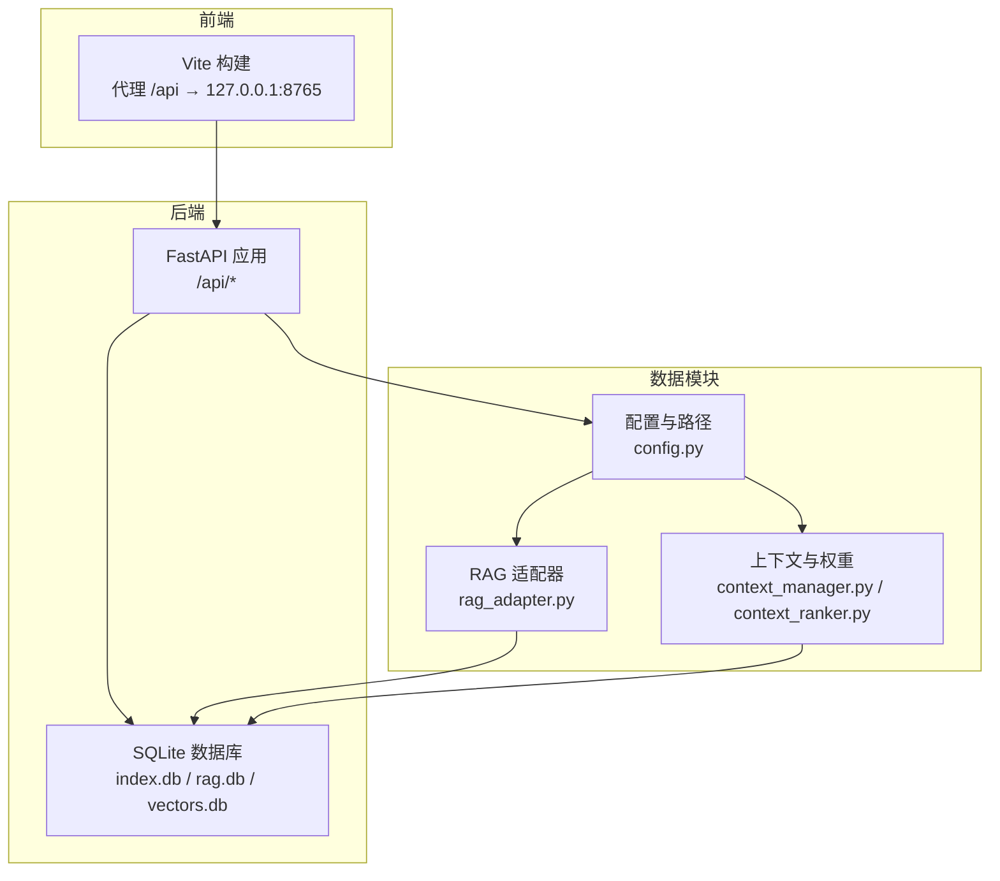
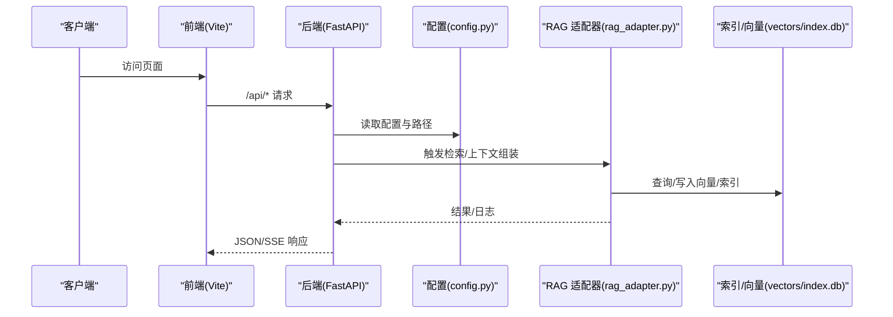
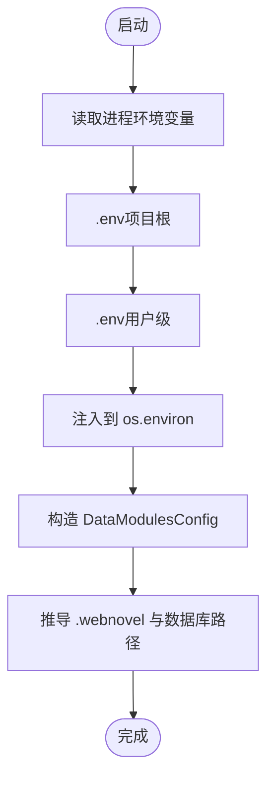
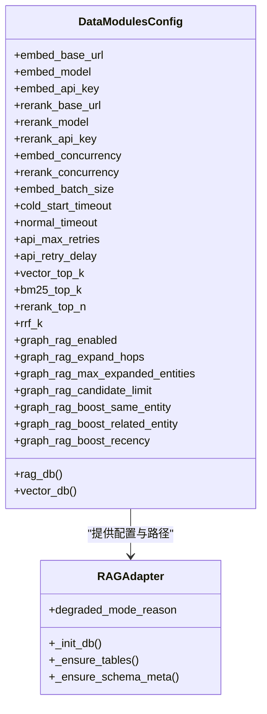
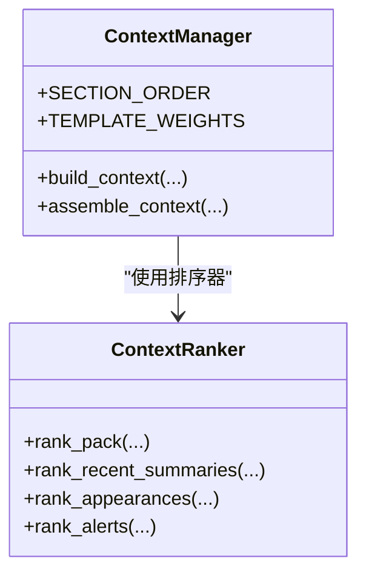
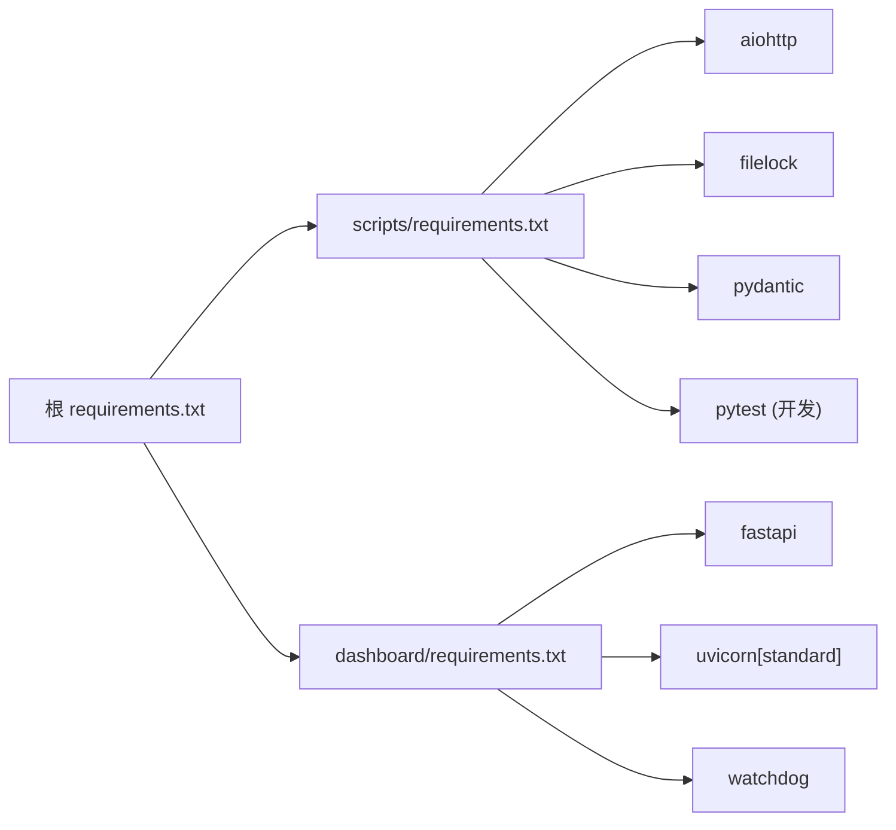

# 配置与环境

<cite>
**本文引用的文件**
- [vite.config.js](file://webnovel-writer/dashboard/frontend/vite.config.js)
- [package.json](file://webnovel-writer/dashboard/frontend/package.json)
- [requirements.txt（仪表板）](file://webnovel-writer/dashboard/requirements.txt)
- [requirements.txt（脚本）](file://webnovel-writer/scripts/requirements.txt)
- [requirements.txt（根）](file://requirements.txt)
- [config.py](file://webnovel-writer/scripts/data_modules/config.py)
- [rag_adapter.py](file://webnovel-writer/scripts/data_modules/rag_adapter.py)
- [context_ranker.py](file://webnovel-writer/scripts/data_modules/context_ranker.py)
- [context_manager.py](file://webnovel-writer/scripts/data_modules/context_manager.py)
- [app.py](file://webnovel-writer/dashboard/app.py)
- [server.py](file://webnovel-writer/dashboard/server.py)
- [rag-and-config.md](file://docs/rag-and-config.md)
</cite>

## 目录
1. [简介](#简介)
2. [项目结构](#项目结构)
3. [核心组件](#核心组件)
4. [架构总览](#架构总览)
5. [详细组件分析](#详细组件分析)
6. [依赖分析](#依赖分析)
7. [性能考虑](#性能考虑)
8. [故障排查指南](#故障排查指南)
9. [结论](#结论)
10. [附录](#附录)

## 简介
本文件面向运维与系统管理员，系统性梳理 Webnovel Writer 的配置与环境管理，涵盖：
- 环境变量配置与加载优先级
- RAG 系统设置与检索参数
- 嵌入与重排序服务集成要点
- 前端 Vite 构建与代理配置
- 后端依赖与运行参数
- 数据库与缓存策略
- 安全与环境适配建议
- 故障排查与性能优化建议

## 项目结构
项目采用前后端分离与数据模块解耦的设计：
- 前端位于 dashboard/frontend，使用 Vite 构建并代理到后端 API
- 后端基于 FastAPI，提供只读查询、文件浏览、任务与聊天等接口
- 数据模块集中于 scripts/data_modules，负责配置、RAG、索引与上下文组装
- 文档与规范位于 docs，包含 RAG 与配置说明

图表来源
- [vite.config.js:1-16](file://webnovel-writer/dashboard/frontend/vite.config.js#L1-L16)
- [app.py:50-490](file://webnovel-writer/dashboard/app.py#L50-L490)
- [config.py:90-349](file://webnovel-writer/scripts/data_modules/config.py#L90-L349)
- [rag_adapter.py:68-200](file://webnovel-writer/scripts/data_modules/rag_adapter.py#L68-L200)
- [context_manager.py:50-200](file://webnovel-writer/scripts/data_modules/context_manager.py#L50-L200)

章节来源
- [vite.config.js:1-16](file://webnovel-writer/dashboard/frontend/vite.config.js#L1-L16)
- [app.py:50-490](file://webnovel-writer/dashboard/app.py#L50-L490)
- [config.py:90-349](file://webnovel-writer/scripts/data_modules/config.py#L90-L349)
- [rag_adapter.py:68-200](file://webnovel-writer/scripts/data_modules/rag_adapter.py#L68-L200)
- [context_manager.py:50-200](file://webnovel-writer/scripts/data_modules/context_manager.py#L50-L200)

## 核心组件
- 环境变量与配置加载：支持进程环境变量、项目级 .env、用户级全局 .env，按优先级注入
- RAG 配置：嵌入与重排序的 BaseURL、Model、API Key，以及并发、超时、重试、检索融合参数
- 上下文与权重：上下文组装、权重分配、动态预算、排序器参数
- 前端构建：Vite 开发/生产配置、代理与静态资源托管
- 后端运行：FastAPI 应用、CORS、SSE、SQLite 访问
- 数据库与缓存：SQLite 索引表、向量表、Schema 元数据与迁移、备份策略

章节来源
- [config.py:30-117](file://webnovel-writer/scripts/data_modules/config.py#L30-L117)
- [config.py:124-349](file://webnovel-writer/scripts/data_modules/config.py#L124-L349)
- [context_manager.py:50-200](file://webnovel-writer/scripts/data_modules/context_manager.py#L50-L200)
- [context_ranker.py:20-200](file://webnovel-writer/scripts/data_modules/context_ranker.py#L20-L200)
- [vite.config.js:4-16](file://webnovel-writer/dashboard/frontend/vite.config.js#L4-L16)
- [app.py:50-490](file://webnovel-writer/dashboard/app.py#L50-L490)
- [rag_adapter.py:68-200](file://webnovel-writer/scripts/data_modules/rag_adapter.py#L68-L200)

## 架构总览
RAG 检索与配置的整体交互如下：

图表来源
- [app.py:50-490](file://webnovel-writer/dashboard/app.py#L50-L490)
- [config.py:90-349](file://webnovel-writer/scripts/data_modules/config.py#L90-L349)
- [rag_adapter.py:68-200](file://webnovel-writer/scripts/data_modules/rag_adapter.py#L68-L200)

## 详细组件分析

### 环境变量与配置加载
- 加载顺序（高优先级到低）：
  1) 进程环境变量（显式注入）
  2) 项目根目录 .env（推荐每项目独立）
  3) 用户级全局 .env：~/.claude/webnovel-writer/.env
- 关键 RAG 环境变量
  - EMBED_BASE_URL / EMBED_MODEL / EMBED_API_KEY
  - RERANK_BASE_URL / RERANK_MODEL / RERANK_API_KEY
- 配置类 DataModulesConfig 提供默认值与路径推导，支持按项目根目录动态加载 .env

图表来源
- [config.py:30-117](file://webnovel-writer/scripts/data_modules/config.py#L30-L117)
- [config.py:124-156](file://webnovel-writer/scripts/data_modules/config.py#L124-L156)
- [rag-and-config.md:15-37](file://docs/rag-and-config.md#L15-L37)

章节来源
- [config.py:30-117](file://webnovel-writer/scripts/data_modules/config.py#L30-L117)
- [config.py:124-156](file://webnovel-writer/scripts/data_modules/config.py#L124-L156)
- [rag-and-config.md:15-37](file://docs/rag-and-config.md#L15-L37)

### RAG 系统设置与检索参数
- 嵌入与重排序
  - 基础 URL、模型、API Key 通过环境变量注入
  - 未配置 Key 时，语义检索回退至 BM25
- 并发与超时
  - 嵌入并发、重排序并发、批大小、冷启动与常规超时
- 重试策略
  - 最大重试次数与指数退避初始延迟
- 检索融合
  - 向量 Top-K、BM25 Top-K、重排序 Top-N、RRF 融合参数
  - 全量扫描阈值、预过滤候选数
- Graph-RAG
  - 开关、扩展跳数、实体上限、候选限制与多项 Boost 权重
- 数据库与迁移
  - 向量表 Schema 版本与迁移、备份与恢复

图表来源
- [config.py:124-314](file://webnovel-writer/scripts/data_modules/config.py#L124-L314)
- [rag_adapter.py:68-200](file://webnovel-writer/scripts/data_modules/rag_adapter.py#L68-L200)

章节来源
- [config.py:124-314](file://webnovel-writer/scripts/data_modules/config.py#L124-L314)
- [rag_adapter.py:68-200](file://webnovel-writer/scripts/data_modules/rag_adapter.py#L68-L200)
- [rag-and-config.md:3-8](file://docs/rag-and-config.md#L3-L8)

### 上下文与权重配置
- 上下文组装
  - 模板权重、动态权重、额外预算、章节阶段识别
- 排序器
  - 回忆权重、频率权重、钩子加分、长度上限、调试开关
- 读者信号、体裁画像、写作清单、写作评分等辅助模块开关与参数

图表来源
- [context_manager.py:50-200](file://webnovel-writer/scripts/data_modules/context_manager.py#L50-L200)
- [context_ranker.py:20-200](file://webnovel-writer/scripts/data_modules/context_ranker.py#L20-L200)

章节来源
- [context_manager.py:50-200](file://webnovel-writer/scripts/data_modules/context_manager.py#L50-L200)
- [context_ranker.py:20-200](file://webnovel-writer/scripts/data_modules/context_ranker.py#L20-L200)

### 前端 Vite 构建与代理
- 代理规则：将 /api 前缀转发到后端 127.0.0.1:8765
- 构建输出：dist 目录，emptyOutDir 保证每次构建清理
- 开发脚本：dev、build、preview
- 依赖：React、Vite、React 插件

章节来源
- [vite.config.js:4-16](file://webnovel-writer/dashboard/frontend/vite.config.js#L4-L16)
- [package.json:6-22](file://webnovel-writer/dashboard/frontend/package.json#L6-L22)

### 后端运行与 API
- 应用工厂：FastAPI，生命周期内启动文件监控与任务服务
- CORS：允许任意 Origin/方法/头
- SQLite 只读查询：实体、关系、场景、阅读力、评审指标、状态变更、别名等
- 文件浏览：树形目录与只读读取，路径穿越防护
- 任务与聊天：任务队列、SSE 实时事件推送
- 静态资源：SPA 回退到 index.html，资产目录挂载

章节来源
- [app.py:50-490](file://webnovel-writer/dashboard/app.py#L50-L490)

### 服务器启动与项目根解析
- 支持 CLI、环境变量、.claude 指针、CWD 多种方式解析项目根
- 默认监听 127.0.0.1:8765，可选自动打开浏览器

章节来源
- [server.py:16-72](file://webnovel-writer/dashboard/server.py#L16-L72)

## 依赖分析
- 根依赖聚合：requirements.txt 引入脚本与仪表板两套依赖
- 脚本依赖：异步 HTTP、文件锁、Pydantic（核心）、pytest 等（开发/测试）
- 仪表板依赖：FastAPI、Uvicorn、Watchdog

图表来源
- [requirements.txt:1-3](file://requirements.txt#L1-L3)
- [scripts/requirements.txt:1-14](file://webnovel-writer/scripts/requirements.txt#L1-L14)
- [dashboard/requirements.txt:1-4](file://webnovel-writer/dashboard/requirements.txt#L1-L4)

章节来源
- [requirements.txt:1-3](file://requirements.txt#L1-L3)
- [scripts/requirements.txt:1-14](file://webnovel-writer/scripts/requirements.txt#L1-L14)
- [dashboard/requirements.txt:1-4](file://webnovel-writer/dashboard/requirements.txt#L1-L4)

## 性能考虑
- 并发与批大小
  - 嵌入并发与批大小直接影响吞吐与资源占用，建议根据 API 速率限制与硬件能力调整
- 超时与重试
  - 冷启动与常规超时应结合网络状况与上游服务 SLA 设置
  - 指数退避可缓解瞬时拥塞，注意最大重试时间与总等待成本
- 检索参数
  - 向量/ BM25/ 重排序 Top-K 与 RRF 参数影响召回质量与延迟，建议在回归测试中评估
- 数据库
  - SQLite 适合中小体量项目；如数据增长显著，建议评估外部数据库或分片策略
- 前端
  - 生产构建启用压缩与缓存；代理仅用于开发联调，生产环境建议反向代理统一路由

## 故障排查指南
- 无法定位项目根
  - 确认 .webnovel/state.json 存在，或通过 WEBNOVEL_PROJECT_ROOT 或 .claude 指针正确设置
- API 401（嵌入鉴权失败）
  - 检查 EMBED_API_KEY 是否正确；RAG 适配器会在降级模式下记录原因
- 语义检索不可用
  - 未配置嵌入 API Key 时会回退到 BM25；确认 EMBED_* 环境变量
- 数据库相关错误
  - 索引/向量表缺失或版本不匹配时会尝试迁移与备份；检查 .webnovel/backups 下的备份文件
- 文件读取被拒绝
  - 仅允许读取 正文/大纲/设定集 目录；确认路径穿越防护逻辑
- SSE 事件异常
  - 检查文件监控与任务服务生命周期，确保事件通道正常

章节来源
- [server.py:16-72](file://webnovel-writer/dashboard/server.py#L16-L72)
- [rag_adapter.py:83-90](file://webnovel-writer/scripts/data_modules/rag_adapter.py#L83-L90)
- [app.py:365-386](file://webnovel-writer/dashboard/app.py#L365-L386)
- [app.py:96-113](file://webnovel-writer/dashboard/app.py#L96-L113)

## 结论
本文件提供了 Webnovel Writer 配置与环境管理的全景视图，包括环境变量加载、RAG 参数、前后端依赖、数据库与缓存策略、以及运维排障与性能优化建议。建议在生产环境中：
- 为每个项目维护独立 .env，避免配置串扰
- 明确 API 密钥与速率限制，合理设置并发与超时
- 定期检查数据库迁移与备份，保障数据安全
- 使用反向代理统一暴露 API，强化安全与可观测性

## 附录

### 环境变量与默认值速览
- 嵌入服务
  - EMBED_BASE_URL（默认：模型之源）
  - EMBED_MODEL（默认：Qwen/Qwen3-Embedding-8B）
  - EMBED_API_KEY（默认：空）
- 重排序服务
  - RERANK_BASE_URL（默认：Jina）
  - RERANK_MODEL（默认：jina-reranker-v3）
  - RERANK_API_KEY（默认：空）
- 并发与超时
  - 嵌入并发、重排序并发、批大小、冷启动与常规超时
- 重试
  - 最大重试次数与指数退避初始延迟
- 检索融合
  - 向量 Top-K、BM25 Top-K、重排序 Top-N、RRF K
- Graph-RAG
  - 开关、扩展跳数、实体上限、候选限制与 Boost 权重

章节来源
- [config.py:124-314](file://webnovel-writer/scripts/data_modules/config.py#L124-L314)
- [rag-and-config.md:10-31](file://docs/rag-and-config.md#L10-L31)