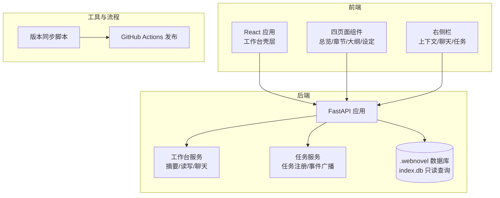
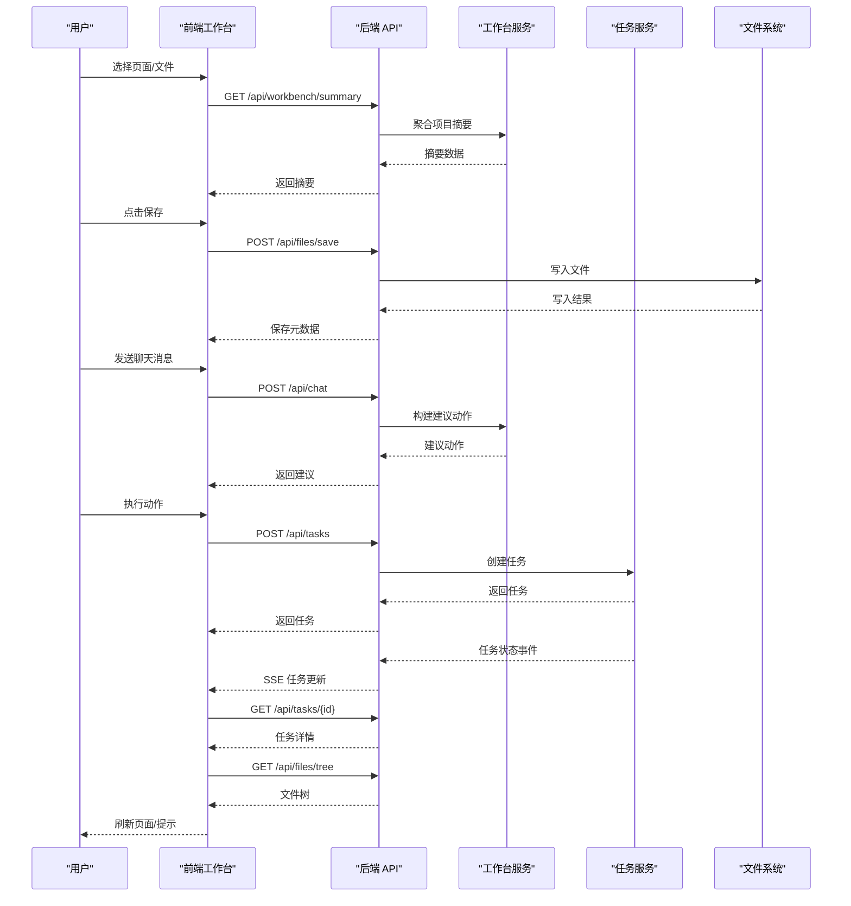
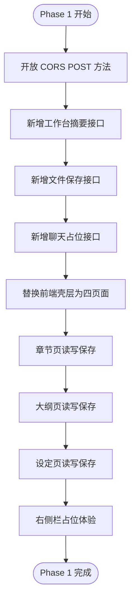
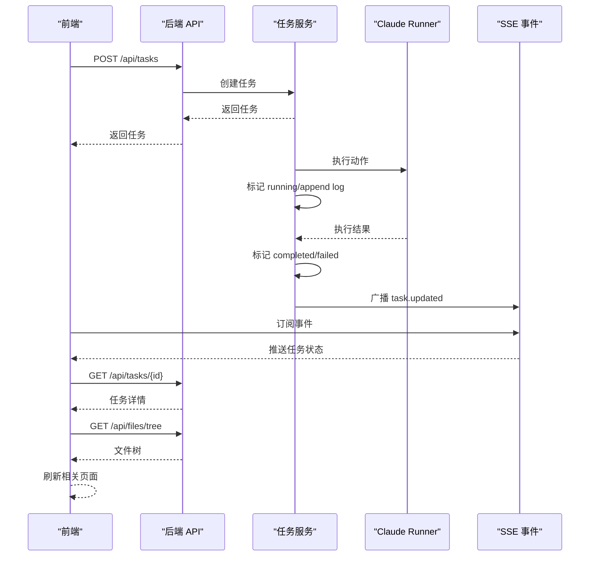
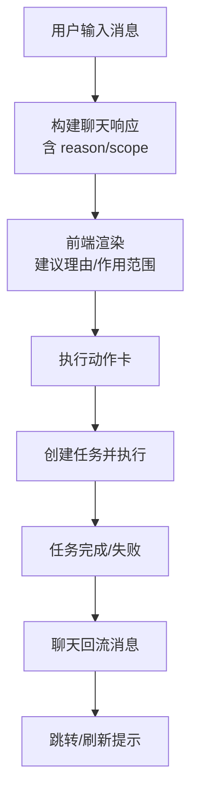
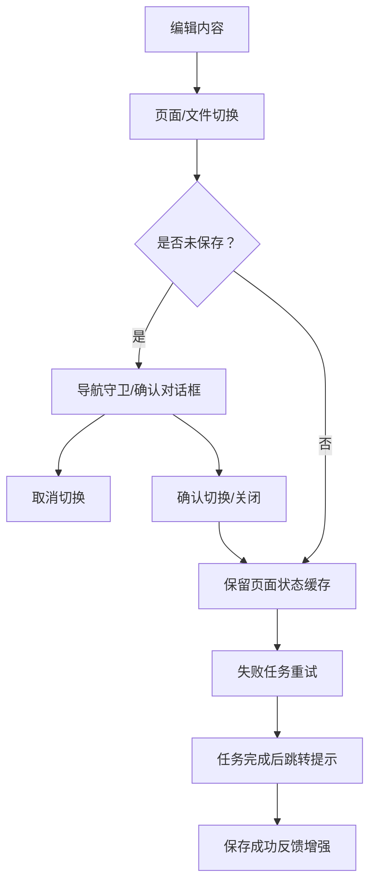
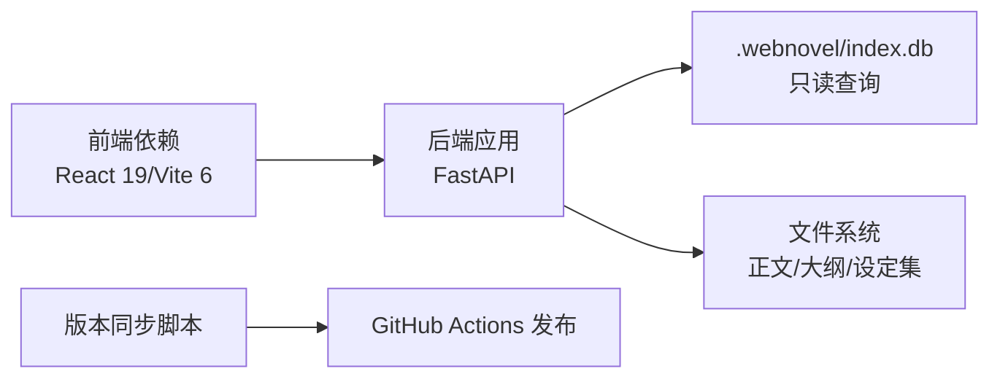

# 发展历史与版本

<cite>
**本文引用的文件**
- [README.md](file://README.md)
- [docs/web-workbench.md](file://docs/web-workbench.md)
- [docs/superpowers/plans/2026-04-12-web-workbench-phase1.md](file://docs/superpowers/plans/2026-04-12-web-workbench-phase1.md)
- [docs/superpowers/plans/2026-04-13-web-workbench-phase2.md](file://docs/superpowers/plans/2026-04-13-web-workbench-phase2.md)
- [docs/superpowers/plans/2026-04-14-web-workbench-phase3.md](file://docs/superpowers/plans/2026-04-14-web-workbench-phase3.md)
- [docs/superpowers/plans/2026-04-14-web-workbench-phase4.md](file://docs/superpowers/plans/2026-04-14-web-workbench-phase4.md)
- [webnovel-writer/dashboard/app.py](file://webnovel-writer/dashboard/app.py)
- [webnovel-writer/dashboard/server.py](file://webnovel-writer/dashboard/server.py)
- [webnovel-writer/dashboard/workbench_service.py](file://webnovel-writer/dashboard/workbench_service.py)
- [webnovel-writer/dashboard/task_service.py](file://webnovel-writer/dashboard/task_service.py)
- [webnovel-writer/dashboard/models.py](file://webnovel-writer/dashboard/models.py)
- [webnovel-writer/scripts/sync_plugin_version.py](file://webnovel-writer/scripts/sync_plugin_version.py)
- [webnovel-writer/.claude-plugin/plugin.json](file://webnovel-writer/.claude-plugin/plugin.json)
- [.github/workflows/plugin-release.yml](file://.github/workflows/plugin-release.yml)
- [webnovel-writer/dashboard/frontend/package.json](file://webnovel-writer/dashboard/frontend/package.json)
</cite>

## 目录
1. [引言](#引言)
2. [项目结构](#项目结构)
3. [核心组件](#核心组件)
4. [架构总览](#架构总览)
5. [详细组件分析](#详细组件分析)
6. [依赖分析](#依赖分析)
7. [性能考虑](#性能考虑)
8. [故障排除指南](#故障排除指南)
9. [结论](#结论)
10. [附录](#附录)

## 引言
本文件系统性梳理 Webnovel Writer 从概念到当前版本的发展历程与版本演进，重点覆盖 Web Workbench 四阶段计划（Phase 1~4）的目标、实现与当前状态，解释技术决策、功能迭代与用户体验优化，并提供版本兼容性、迁移指南与升级建议，帮助用户全面理解系统的演进轨迹与未来方向。

## 项目结构
项目采用“技能/代理/数据链路/RAG + 可视化工作台”的整体架构，核心分为：
- 后端：FastAPI 应用与任务执行层，提供只读仪表盘与可编辑工作台 API
- 前端：React/Vite 工作台壳层，承载四页面（总览/章节/大纲/设定）与右侧栏
- 脚本与工具：版本同步、发布自动化、测试与验证
- 文档与计划：四阶段工作台实施计划与页面说明文档

**图表来源**
- [webnovel-writer/dashboard/app.py:50-490](file://webnovel-writer/dashboard/app.py#L50-L490)
- [webnovel-writer/dashboard/workbench_service.py:1-171](file://webnovel-writer/dashboard/workbench_service.py#L1-L171)
- [webnovel-writer/dashboard/task_service.py:1-166](file://webnovel-writer/dashboard/task_service.py#L1-L166)
- [webnovel-writer/scripts/sync_plugin_version.py:110-137](file://webnovel-writer/scripts/sync_plugin_version.py#L110-L137)

**章节来源**
- [README.md:12-19](file://README.md#L12-L19)
- [docs/web-workbench.md:1-22](file://docs/web-workbench.md#L1-L22)

## 核心组件
- 工作台 API 与路由：提供项目摘要、文件树/读取、保存、任务与聊天接口，支持跨页面状态与事件流
- 任务服务：进程内任务注册表、状态流转、日志记录与 SSE 事件广播
- 工作台服务：项目摘要聚合、文件保存、聊天建议构建
- 模型与契约：页面与工作区常量、任务状态与空闲负载
- 启动与部署：本地服务器启动、静态资源托管、插件版本同步与发布

**章节来源**
- [webnovel-writer/dashboard/app.py:88-429](file://webnovel-writer/dashboard/app.py#L88-L429)
- [webnovel-writer/dashboard/task_service.py:14-166](file://webnovel-writer/dashboard/task_service.py#L14-L166)
- [webnovel-writer/dashboard/workbench_service.py:18-162](file://webnovel-writer/dashboard/workbench_service.py#L18-L162)
- [webnovel-writer/dashboard/models.py:1-23](file://webnovel-writer/dashboard/models.py#L1-L23)

## 架构总览
系统采用“单应用 + SSE 事件流”的前后端协作模式：
- 前端通过 fetch 调用后端 API，接收 SSE 事件流以实时更新
- 后端通过文件监听与任务执行服务向前端推送变更
- 工作台页面与右侧栏共享上下文，形成“聊天→动作→任务→刷新”的闭环

**图表来源**
- [webnovel-writer/dashboard/app.py:387-460](file://webnovel-writer/dashboard/app.py#L387-L460)
- [webnovel-writer/dashboard/workbench_service.py:74-162](file://webnovel-writer/dashboard/workbench_service.py#L74-L162)
- [webnovel-writer/dashboard/task_service.py:36-143](file://webnovel-writer/dashboard/task_service.py#L36-L143)

## 详细组件分析

### Web Workbench 四阶段计划
四阶段计划以“可编辑工作台”为目标，逐步完善从骨架到可用再到完善的体验闭环。

#### Phase 1：工作台骨架与最小可编辑闭环
- 目标：将只读仪表盘升级为四页面工作台骨架，跑通“总览/章节/大纲/设定”的浏览与保存闭环
- 关键实现：
  - 后端：新增工作台摘要、文件保存、任务占位与聊天占位接口，开放 CORS POST 方法
  - 前端：替换壳层为四页面布局，实现章节/大纲/设定的读写与保存
  - 右侧栏：统一上下文、聊天与任务占位体验
- 当前状态：已完成，具备最小可用骨架与保存闭环

**图表来源**
- [docs/superpowers/plans/2026-04-12-web-workbench-phase1.md:162-296](file://docs/superpowers/plans/2026-04-12-web-workbench-phase1.md#L162-L296)
- [webnovel-writer/dashboard/app.py:69-74](file://webnovel-writer/dashboard/app.py#L69-L74)
- [webnovel-writer/dashboard/app.py:88-429](file://webnovel-writer/dashboard/app.py#L88-L429)

**章节来源**
- [docs/superpowers/plans/2026-04-12-web-workbench-phase1.md:1-134](file://docs/superpowers/plans/2026-04-12-web-workbench-phase1.md#L1-L134)
- [docs/web-workbench.md:1-192](file://docs/web-workbench.md#L1-L192)

#### Phase 2：真实任务执行链
- 目标：将占位动作卡与任务卡升级为真实任务执行链，支持任务创建、状态与日志、SSE 事件与页面刷新
- 关键实现：
  - 任务数据契约与状态机定义
  - 任务注册表与 API（创建/查询/取消）
  - Claude 命令执行适配层
  - SSE 合并任务事件与文件变更事件
  - 前端真实任务交互与页面刷新
- 当前状态：已完成，具备真实任务链与事件流

**图表来源**
- [docs/superpowers/plans/2026-04-13-web-workbench-phase2.md:122-373](file://docs/superpowers/plans/2026-04-13-web-workbench-phase2.md#L122-L373)
- [webnovel-writer/dashboard/app.py:399-429](file://webnovel-writer/dashboard/app.py#L399-L429)
- [webnovel-writer/dashboard/task_service.py:14-166](file://webnovel-writer/dashboard/task_service.py#L14-L166)

**章节来源**
- [docs/superpowers/plans/2026-04-13-web-workbench-phase2.md:1-119](file://docs/superpowers/plans/2026-04-13-web-workbench-phase2.md#L1-L119)

#### Phase 3：聊天助手工作流
- 目标：将“规则聊天 + 动作卡创建任务”升级为“上下文感知的聊天助手工作流”，执行后给出更清晰的结果反馈、跳转与联动提示
- 关键实现：
  - 聊天响应增强字段（回复/建议动作/理由/作用范围）
  - 基于页面/路径/脏状态的上下文感知建议
  - 前端聊天记录结构增强与动作执行回流消息
  - 任务完成后的跳转/提示策略
- 当前状态：已完成，具备上下文感知的聊天与结果回流

**图表来源**
- [docs/superpowers/plans/2026-04-14-web-workbench-phase3.md:98-425](file://docs/superpowers/plans/2026-04-14-web-workbench-phase3.md#L98-L425)
- [webnovel-writer/dashboard/workbench_service.py:74-162](file://webnovel-writer/dashboard/workbench_service.py#L74-L162)

**章节来源**
- [docs/superpowers/plans/2026-04-14-web-workbench-phase3.md:1-95](file://docs/superpowers/plans/2026-04-14-web-workbench-phase3.md#L1-L95)

#### Phase 4：核心体验缺口补齐
- 目标：防止未保存数据丢失、失败任务可重试、任务完成后可跳转、页面切换时保留状态
- 关键实现：
  - 未保存改动导航守卫与 beforeunload
  - 页面状态缓存与跨页保留
  - 失败任务重试按钮
  - 任务完成后跳转提示与可点击按钮
  - 保存成功反馈增强
- 当前状态：已完成，具备完整的前端体验闭环

**图表来源**
- [docs/superpowers/plans/2026-04-14-web-workbench-phase4.md:51-398](file://docs/superpowers/plans/2026-04-14-web-workbench-phase4.md#L51-L398)

**章节来源**
- [docs/superpowers/plans/2026-04-14-web-workbench-phase4.md:1-50](file://docs/superpowers/plans/2026-04-14-web-workbench-phase4.md#L1-L50)

### 版本演进与里程碑
- v5.5.4（当前）：补齐写作链提示词强约束；统一中文化审查/润色/Agent 报告文案；清理文档内部版本号与版本历史
- v5.5.3：新增统一预检命令；写作链 CLI 示例统一为 UTF-8 运行方式
- v5.5.2：支持将详细大纲中的章节名同步到正文文件名；修复 workflow_manager 兼容性问题
- v5.5.1：修复卷级单文件大纲在上下文快照中的章节提取问题；补齐命令文档
- v5.5.0：新增只读可视化 Dashboard Skill 与实时刷新能力；支持插件目录启动与预构建前端分发
- v5.4.4：引入官方 Plugin Marketplace 安装机制；统一修复 Skills/Agents/References 的 CLI 调用
- v5.4.3：增强智能 RAG 上下文辅助（auto/graph_hybrid 回退 BM25）
- v5.3：引入追读力系统（Hook / Cool-point / 微兑现 / 债务追踪）

**章节来源**
- [README.md:117-147](file://README.md#L117-L147)

### 技术决策与功能迭代
- 技术栈与约束：FastAPI + React 19 + Vite 6，坚持“不引入新依赖或状态管理库”的前端约束
- 数据边界：只允许读写“正文/大纲/设定集”三大目录，统一路径校验与保存元数据
- 事件流：SSE 同时承载文件变更与任务事件，前端通过订阅实现实时更新
- 任务链：进程内任务注册表 + 线程执行 + 事件广播，避免外部依赖
- 聊天增强：从规则映射升级为上下文感知，提供“建议理由 + 作用范围 + 结果回流”

**章节来源**
- [webnovel-writer/dashboard/app.py:387-460](file://webnovel-writer/dashboard/app.py#L387-L460)
- [webnovel-writer/dashboard/workbench_service.py:58-71](file://webnovel-writer/dashboard/workbench_service.py#L58-L71)
- [webnovel-writer/dashboard/task_service.py:121-166](file://webnovel-writer/dashboard/task_service.py#L121-L166)

### 当前版本核心特性
- 可编辑工作台：四页面结构与统一右侧栏
- 任务执行链：真实任务创建、状态与日志、SSE 实时更新
- 聊天助手：上下文感知建议与结果回流
- 体验闭环：未保存改动守卫、失败任务重试、任务完成后跳转、保存成功反馈

**章节来源**
- [docs/web-workbench.md:1-192](file://docs/web-workbench.md#L1-L192)
- [webnovel-writer/dashboard/app.py:88-429](file://webnovel-writer/dashboard/app.py#L88-L429)

### 未来发展规划
- 持续完善聊天助手：结合更多上下文与历史交互，提供更精准的动作建议
- 任务链扩展：支持取消、重试策略与结果归档
- 前端体验：引入草稿对比、受影响章节提示等（在 Phase 4 范围外的后续规划）
- 插件生态：进一步完善 Marketplace 集成与版本发布流程

[本节为概念性总结，不直接分析具体文件]

## 依赖分析
- 后端依赖：FastAPI、SQLite（只读查询）、异步事件循环、文件监听
- 前端依赖：React 19、Vite 6、原生 fetch/EventSource
- 工具链：uvicorn、pytest、node/npm

**图表来源**
- [webnovel-writer/dashboard/frontend/package.json:11-21](file://webnovel-writer/dashboard/frontend/package.json#L11-L21)
- [webnovel-writer/dashboard/app.py:96-338](file://webnovel-writer/dashboard/app.py#L96-L338)
- [webnovel-writer/scripts/sync_plugin_version.py:110-137](file://webnovel-writer/scripts/sync_plugin_version.py#L110-L137)

**章节来源**
- [webnovel-writer/dashboard/frontend/package.json:1-23](file://webnovel-writer/dashboard/frontend/package.json#L1-L23)
- [webnovel-writer/dashboard/server.py:43-72](file://webnovel-writer/dashboard/server.py#L43-L72)

## 性能考虑
- SSE 事件合并：文件变更与任务事件在同一通道推送，减少连接数
- 任务日志截断：仅保留最近 N 条日志，控制内存占用
- 路由与静态托管：SPA 回退与静态资源分离，避免不必要的 API 调用
- 前端状态缓存：页面切换时保留编辑状态，减少重复加载

[本节提供通用指导，不直接分析具体文件]

## 故障排除指南
- 无法保存文件：检查 CORS 方法是否允许 POST，确认路径在校验范围内
- 聊天无响应：确认聊天接口返回结构是否包含增强字段（reply/suggested_actions/reason/scope）
- 任务无状态：检查任务服务是否正确广播事件，前端是否订阅 SSE
- 插件版本不一致：使用版本同步脚本校验与更新 plugin.json、marketplace.json 与 README

**章节来源**
- [webnovel-writer/dashboard/app.py:69-74](file://webnovel-writer/dashboard/app.py#L69-L74)
- [webnovel-writer/dashboard/workbench_service.py:74-162](file://webnovel-writer/dashboard/workbench_service.py#L74-L162)
- [webnovel-writer/dashboard/task_service.py:144-166](file://webnovel-writer/dashboard/task_service.py#L144-L166)
- [webnovel-writer/scripts/sync_plugin_version.py:140-169](file://webnovel-writer/scripts/sync_plugin_version.py#L140-L169)

## 结论
Webnovel Writer 通过四阶段工作台计划，完成了从只读仪表盘到可编辑工作台的完整演进。当前版本具备真实任务执行链、上下文感知聊天与完整的前端体验闭环。未来将持续优化聊天助手、任务链与前端体验，保持“不引入新依赖”的约束，稳步提升系统稳定性与易用性。

[本节为总结性内容，不直接分析具体文件]

## 附录

### 版本兼容性与迁移指南
- 兼容性：当前版本为 v5.5.4，遵循“只读/GET-only”注释已调整为支持 POST 的工作台 API
- 迁移建议：
  - 升级后端：确保 CORS 允许 POST，使用新的工作台 API
  - 升级前端：使用预构建的前端静态资源，无需本地构建
  - 插件版本：通过 Marketplace 安装与版本同步脚本保持一致

**章节来源**
- [README.md:117-147](file://README.md#L117-L147)
- [webnovel-writer/dashboard/app.py:69-74](file://webnovel-writer/dashboard/app.py#L69-L74)

### 升级建议
- 使用 GitHub Actions 的 Plugin Release 工作流统一发版
- 在本地同步版本信息后提交并推送，确保 plugin.json、marketplace.json 与 README 一致
- 发布后创建并推送 vX.Y.Z Tag，创建同名 GitHub Release

**章节来源**
- [README.md:130-147](file://README.md#L130-L147)
- [.github/workflows/plugin-release.yml:1-57](file://.github/workflows/plugin-release.yml#L1-L57)
- [webnovel-writer/scripts/sync_plugin_version.py:110-137](file://webnovel-writer/scripts/sync_plugin_version.py#L110-L137)